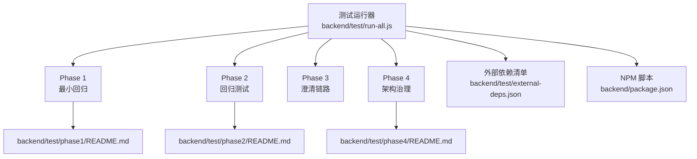
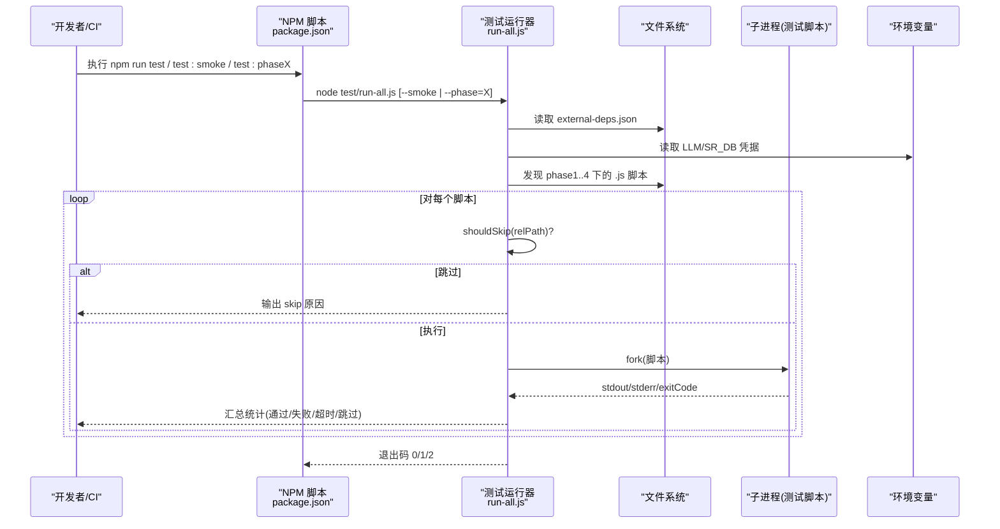
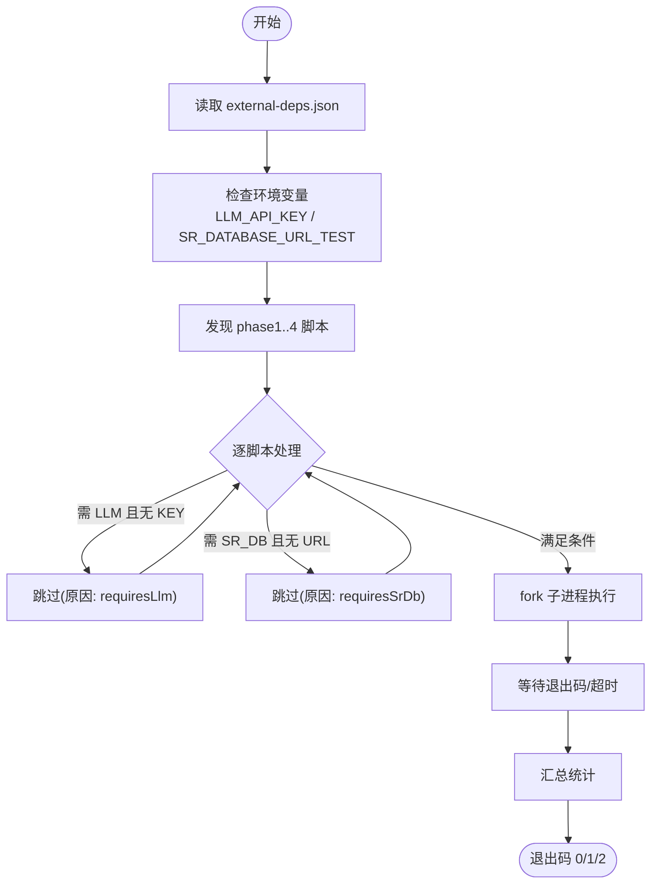

# 测试框架

<cite>
**本文引用的文件**
- [backend/test/run-all.js](file://backend/test/run-all.js)
- [backend/test/external-deps.json](file://backend/test/external-deps.json)
- [backend/package.json](file://backend/package.json)
- [backend/test/phase1/README.md](file://backend/test/phase1/README.md)
- [backend/test/phase1/test-summarizer.js](file://backend/test/phase1/test-summarizer.js)
- [backend/test/phase1/test-executeQuery.js](file://backend/test/phase1/test-executeQuery.js)
- [backend/test/phase2/README.md](file://backend/test/phase2/README.md)
- [backend/test/phase2/test-limit-injection.js](file://backend/test/phase2/test-limit-injection.js)
- [backend/test/phase2/test-tableRanker-unit.js](file://backend/test/phase2/test-tableRanker-unit.js)
- [backend/test/phase3/clarification-apply.test.js](file://backend/test/phase3/clarification-apply.test.js)
- [backend/test/phase4/README.md](file://backend/test/phase4/README.md)
- [backend/src/core/nl2sqlEngine.js](file://backend/src/core/nl2sqlEngine.js)
</cite>

## 目录
1. [引言](#引言)
2. [项目结构](#项目结构)
3. [核心组件](#核心组件)
4. [架构总览](#架构总览)
5. [详细组件分析](#详细组件分析)
6. [依赖分析](#依赖分析)
7. [性能考虑](#性能考虑)
8. [故障排查指南](#故障排查指南)
9. [结论](#结论)
10. [附录](#附录)

## 引言
本技术文档面向测试工程师与开发者，系统梳理 NL2SQL 测试框架的分层设计与执行策略，覆盖单元测试、集成测试与端到端测试的阶段划分与目标，详解 Phase 1–4 的测试目标、用例设计与执行流程，并说明测试数据准备与管理、覆盖率与质量度量、持续集成与自动化执行、调试技巧与常见问题排查。

## 项目结构
测试体系采用“按阶段分层 + 脚本化执行”的组织方式：
- 根级测试运行器负责脚本发现、条件跳过、并发派生与汇总统计。
- 各 Phase 目录内包含独立的测试脚本与说明文档，明确依赖、验收门槛与运行方式。
- 外部依赖清单定义哪些脚本需要特定环境变量或外部服务支持。
- 核心引擎模块在 Phase 4 中被拆分为多个子模块并通过导出契约进行保护性回归。

图表来源
- [backend/test/run-all.js:1-181](file://backend/test/run-all.js#L1-L181)
- [backend/test/phase1/README.md:1-34](file://backend/test/phase1/README.md#L1-L34)
- [backend/test/phase2/README.md:1-72](file://backend/test/phase2/README.md#L1-L72)
- [backend/test/phase4/README.md:1-51](file://backend/test/phase4/README.md#L1-L51)
- [backend/test/external-deps.json:1-11](file://backend/test/external-deps.json#L1-L11)
- [backend/package.json:1-36](file://backend/package.json#L1-L36)

章节来源
- [backend/test/run-all.js:1-181](file://backend/test/run-all.js#L1-L181)
- [backend/test/external-deps.json:1-11](file://backend/test/external-deps.json#L1-L11)
- [backend/package.json:1-36](file://backend/package.json#L1-L36)

## 核心组件
- 测试运行器：统一发现与执行各 Phase 脚本，支持冒烟模式、按 Phase 运行、超时控制与失败汇总。
- 外部依赖清单：声明脚本对外部 LLM 或 SR 数据库的依赖，驱动运行器在缺少凭据时跳过或报错。
- Phase 文档：提供阶段性目标、验收门槛、运行示例与依赖说明。
- 核心引擎模块：在 Phase 4 拆分为子模块并通过导出契约进行回归保护。

章节来源
- [backend/test/run-all.js:1-181](file://backend/test/run-all.js#L1-L181)
- [backend/test/external-deps.json:1-11](file://backend/test/external-deps.json#L1-L11)
- [backend/test/phase1/README.md:1-34](file://backend/test/phase1/README.md#L1-L34)
- [backend/test/phase2/README.md:1-72](file://backend/test/phase2/README.md#L1-L72)
- [backend/test/phase4/README.md:1-51](file://backend/test/phase4/README.md#L1-L51)
- [backend/src/core/nl2sqlEngine.js:1-200](file://backend/src/core/nl2sqlEngine.js#L1-L200)

## 架构总览
测试运行器通过 child_process.fork 并发派生各测试脚本，统一设置工作目录与环境变量，捕获输出与退出码，汇总统计并通过退出码向 CI/本地反馈结果。外部依赖清单与环境变量共同决定脚本是否跳过。

图表来源
- [backend/package.json:6-14](file://backend/package.json#L6-L14)
- [backend/test/run-all.js:14-181](file://backend/test/run-all.js#L14-L181)
- [backend/test/external-deps.json:1-11](file://backend/test/external-deps.json#L1-L11)

## 详细组件分析

### Phase 1：最小回归测试
目标与范围
- 验证执行层 DRY_RUN 兜底、SR 数据库未配置时的行为、摘要裁剪分支、SSE 错误链路、实体解析降级等关键路径。
- 通过独立脚本确保基础稳定性，避免回归。

测试策略与用例设计
- 独立进程执行，使用原生 assert，脚本自报告通过/失败。
- 通过环境变量控制行为（如 DRY_RUN、SR_DB_ENABLED、DB_PATH_TEST），必要时连接真实数据库验证。

执行流程
- 运行器发现 phase1 下的脚本，按顺序执行，输出每脚本状态与汇总统计。

章节来源
- [backend/test/phase1/README.md:1-34](file://backend/test/phase1/README.md#L1-L34)
- [backend/test/phase1/test-summarizer.js:1-41](file://backend/test/phase1/test-summarizer.js#L1-L41)
- [backend/test/phase1/test-executeQuery.js:1-72](file://backend/test/phase1/test-executeQuery.js#L1-L72)

### Phase 2：回归测试
目标与范围
- 覆盖 LIMIT 注入、tableRanker 统一打分、端到端 NL→SQL 回归等关键优化。
- 通过单元与集成用例验证打分公式、保护机制与端到端路径。

测试策略与用例设计
- 单元测试：覆盖 hasOuterLimit/ensureLimit、tableRanker 打分与 feature flag 回退。
- 集成测试：基于复杂查询 fixture，验证 mustInclude、最大候选数等断言。
- 端到端回归：在 DRY_RUN/LIVE 模式下断言关键字与行数等指标。

执行流程
- 运行器发现 phase2 脚本，按需跳过外部依赖脚本（--smoke）。
- 可选环境变量：LLM_API_KEY（LLM）、SR_DATABASE_URL_TEST（真实数据库）。

章节来源
- [backend/test/phase2/README.md:1-72](file://backend/test/phase2/README.md#L1-L72)
- [backend/test/phase2/test-limit-injection.js:1-88](file://backend/test/phase2/test-limit-injection.js#L1-L88)
- [backend/test/phase2/test-tableRanker-unit.js:1-175](file://backend/test/phase2/test-tableRanker-unit.js#L1-L175)

### Phase 3：澄清链路测试
目标与范围
- 验证澄清应用逻辑、覆盖数据单元抽取、幂等性、类型分支与健壮性。
- 保证澄清链路在不同 clarificationType 下的行为一致性。

测试策略与用例设计
- 使用原生断言风格，覆盖 applyUncoveredDataUnit 与 applyClarificationResult 的多场景分支。
- 包含空输入、缺失字段、重复调用等边界与健壮性断言。

执行流程
- 独立脚本执行，输出通过/失败计数，失败即退出码非 0。

章节来源
- [backend/test/phase3/clarification-apply.test.js:1-157](file://backend/test/phase3/clarification-apply.test.js#L1-L157)

### Phase 4：架构治理与质量保障
目标与范围
- 保护核心引擎模块拆分后的导出契约，验证各子模块纯逻辑与错误码覆盖。
- 覆盖内存队列迁移、重试与死信处理、审计埋点等质量保障能力。

测试策略与用例设计
- 无 LLM 依赖、无 SR DB 依赖，所有脚本在 SR 未就绪时走降级分支。
- 临时 SQLite 通过环境变量指向 os.tmpdir()/nl2sql-phase4-*.db，测试结束自动清理。

执行流程
- 运行器发现 phase4 脚本，按需跳过外部依赖（--smoke）。
- 验收门槛：Phase 4 100% 通过；Phase 1–3 既定用例 0 回归。

章节来源
- [backend/test/phase4/README.md:1-51](file://backend/test/phase4/README.md#L1-L51)
- [backend/src/core/nl2sqlEngine.js:1-200](file://backend/src/core/nl2sqlEngine.js#L1-L200)

## 依赖分析
- 外部依赖黑名单：声明哪些脚本需要 LLM 或 SR 数据库，驱动运行器在缺少凭据时跳过或报错。
- 环境变量：
  - LLM_API_KEY：驱动 LLM 相关脚本（如端到端回归）。
  - SR_DATABASE_URL_TEST：驱动真实数据库执行层测试。
  - FF_UNIFIED_RANKER：控制 tableRanker 的 feature flag。
  - DB_PATH_TEST：指定 SQLite 测试库路径，避免污染正式数据。
- 运行器对每个脚本设置统一工作目录与环境变量，确保测试隔离与可重复。

图表来源
- [backend/test/external-deps.json:1-11](file://backend/test/external-deps.json#L1-L11)
- [backend/test/run-all.js:27-50](file://backend/test/run-all.js#L27-L50)
- [backend/test/run-all.js:79-114](file://backend/test/run-all.js#L79-L114)

章节来源
- [backend/test/external-deps.json:1-11](file://backend/test/external-deps.json#L1-L11)
- [backend/test/run-all.js:27-50](file://backend/test/run-all.js#L27-L50)
- [backend/test/run-all.js:79-114](file://backend/test/run-all.js#L79-L114)

## 性能考虑
- 并发执行：运行器使用 child_process.fork 并行派生脚本，缩短整体执行时间。
- 超时控制：每个脚本最长执行时间限制，避免阻塞影响 CI。
- 冒烟模式：通过 --smoke 跳过外部依赖脚本，快速验证本地开发环境。
- 缓存清理：部分测试通过 reloadCore 或删除 require 缓存确保配置与 feature flag 生效。

章节来源
- [backend/test/run-all.js:79-114](file://backend/test/run-all.js#L79-L114)
- [backend/test/phase1/test-executeQuery.js:20-27](file://backend/test/phase1/test-executeQuery.js#L20-L27)
- [backend/test/phase2/test-tableRanker-unit.js:20-27](file://backend/test/phase2/test-tableRanker-unit.js#L20-L27)

## 故障排查指南
- 退出码含义
  - 0：全部通过或无可跑用例。
  - 1：存在失败或超时。
  - 2：运行器内部未捕获异常。
- 常见问题
  - LLM 相关脚本失败：确认已设置 LLM_API_KEY。
  - SR 数据库相关脚本失败：确认已设置 SR_DATABASE_URL_TEST 或使用 --smoke。
  - 环境变量未生效：某些脚本会删除/重设环境变量并清理 require 缓存，确保重新加载核心模块。
  - 超时：检查子进程 stderr/stdout 截断输出，定位卡点。
- 调试建议
  - 使用 --phase 指定阶段，缩小排查范围。
  - 在本地设置 DB_PATH_TEST 指向临时 SQLite，避免污染正式数据。
  - 查看运行器汇总统计与失败脚本列表，结合脚本自身输出定位根因。

章节来源
- [backend/test/run-all.js:117-181](file://backend/test/run-all.js#L117-L181)
- [backend/test/phase1/README.md:30-34](file://backend/test/phase1/README.md#L30-L34)
- [backend/test/phase2/README.md:36-46](file://backend/test/phase2/README.md#L36-L46)

## 结论
该测试框架通过分层设计与运行器统一调度，实现了从单元到端到端的全链路覆盖。借助外部依赖清单与环境变量，既能满足本地冒烟验证，也能在具备凭据时完成全量回归。建议在 CI 中默认使用冒烟模式，同时提供全量执行选项以保障关键变更的质量。

## 附录

### 测试阶段与目标对照
- Phase 1：最小回归，关注执行层、摘要、SSE 错误链路与实体解析降级。
- Phase 2：回归优化，关注 LIMIT 注入、tableRanker 打分与端到端 NL→SQL。
- Phase 3：澄清链路，关注 applyClarificationResult 的多分支与健壮性。
- Phase 4：架构治理，保护导出契约与质量保障能力。

章节来源
- [backend/test/phase1/README.md:1-34](file://backend/test/phase1/README.md#L1-L34)
- [backend/test/phase2/README.md:1-72](file://backend/test/phase2/README.md#L1-L72)
- [backend/test/phase3/clarification-apply.test.js:1-157](file://backend/test/phase3/clarification-apply.test.js#L1-L157)
- [backend/test/phase4/README.md:1-51](file://backend/test/phase4/README.md#L1-L51)

### 质量度量与验收门槛
- Phase 4：全部用例 100% 通过；Phase 1–3 既定用例 0 回归（冒烟模式应显示 20 pass + 2 skip + 0 fail）。
- Phase 2：验收门槛见各脚本 README，如 test-limit-injection（25/25）、test-tableRanker-unit（18/18）等。

章节来源
- [backend/test/phase4/README.md:43-47](file://backend/test/phase4/README.md#L43-L47)
- [backend/test/phase2/README.md:48-56](file://backend/test/phase2/README.md#L48-L56)

### 持续集成与自动化
- NPM 脚本提供统一入口：全量、冒烟、按阶段执行。
- 运行器负责脚本发现、条件跳过、并发执行与退出码汇总。
- 建议在 CI 中：
  - 默认执行冒烟模式，快速反馈。
  - 在 PR 合并前执行全量回归（需配置 LLM_API_KEY 与 SR_DATABASE_URL_TEST）。

章节来源
- [backend/package.json:6-14](file://backend/package.json#L6-L14)
- [backend/test/run-all.js:117-181](file://backend/test/run-all.js#L117-L181)