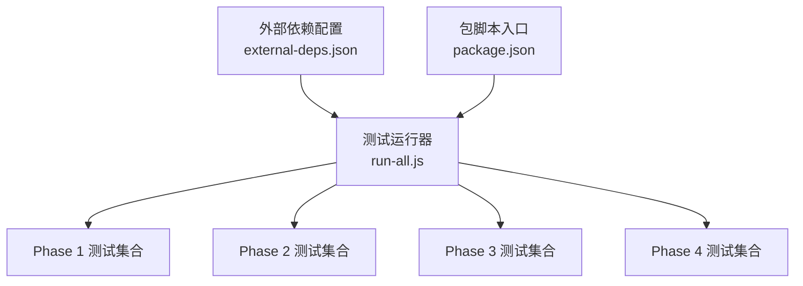
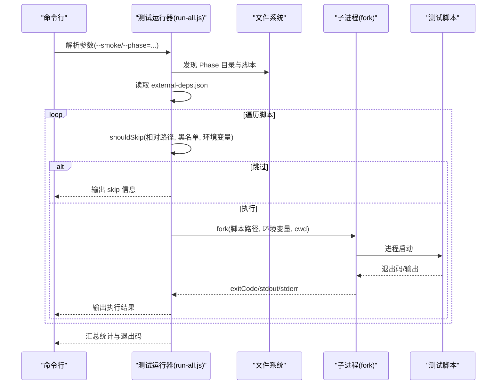
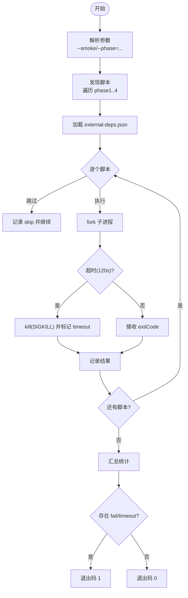
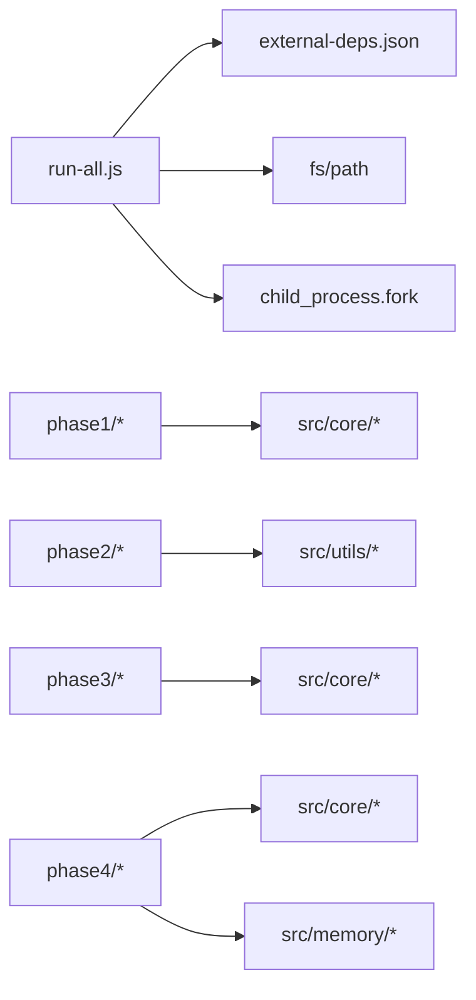

# 测试框架概览

<cite>
**本文档引用的文件**
- [backend/test/run-all.js](file://backend/test/run-all.js)
- [backend/test/external-deps.json](file://backend/test/external-deps.json)
- [backend/test/phase1/README.md](file://backend/test/phase1/README.md)
- [backend/test/phase2/README.md](file://backend/test/phase2/README.md)
- [backend/test/phase4/README.md](file://backend/test/phase4/README.md)
- [backend/test/phase1/test-executeQuery.js](file://backend/test/phase1/test-executeQuery.js)
- [backend/test/phase2/test-limit-injection.js](file://backend/test/phase2/test-limit-injection.js)
- [backend/test/phase3/clarification-apply.test.js](file://backend/test/phase3/clarification-apply.test.js)
- [backend/test/phase4/test-nl2sql-facade.js](file://backend/test/phase4/test-nl2sql-facade.js)
- [backend/package.json](file://backend/package.json)
- [backend/test/phase1/test-summarizer.js](file://backend/test/phase1/test-summarizer.js)
- [backend/test/phase2/test-tableRanker-unit.js](file://backend/test/phase2/test-tableRanker-unit.js)
- [backend/test/phase3/test-safeLog.js](file://backend/test/phase3/test-safeLog.js)
- [backend/test/phase4/test-memoryQueue-retry.js](file://backend/test/phase4/test-memoryQueue-retry.js)
</cite>

## 目录
1. [简介](#简介)
2. [项目结构](#项目结构)
3. [核心组件](#核心组件)
4. [架构总览](#架构总览)
5. [详细组件分析](#详细组件分析)
6. [依赖关系分析](#依赖关系分析)
7. [性能考虑](#性能考虑)
8. [故障排查指南](#故障排查指南)
9. [结论](#结论)
10. [附录](#附录)

## 简介
本文件为 NL2SQL 测试框架的全面技术文档，聚焦于测试运行器的工作原理、测试脚本发现机制、并行执行策略、测试组织结构（Phase 1–4）、依赖管理与跳过条件、命令行使用方法、退出码与错误处理、覆盖率与质量度量建议，以及面向测试工程师与开发者的使用指南。文档基于仓库中的实际实现进行分析，并提供可视化图示帮助理解。

## 项目结构
测试框架位于后端目录 backend/test 下，采用“阶段化”分层组织：
- phase1：最小回归测试，覆盖基础模块与关键路径
- phase2：回归测试，覆盖 LIMIT 注入、tableRanker、端到端 NL→SQL
- phase3：澄清链路与健壮性测试
- phase4：架构治理与质量保障，模块导出契约与稳定性测试
- run-all.js：统一测试运行器，负责脚本发现、并发执行、汇总与退出码
- external-deps.json：外部依赖黑名单，控制 smoke 模式与环境变量跳过

图表来源
- [backend/test/run-all.js:1-181](file://backend/test/run-all.js#L1-L181)
- [backend/test/external-deps.json:1-11](file://backend/test/external-deps.json#L1-L11)
- [backend/package.json:6-15](file://backend/package.json#L6-L15)

章节来源
- [backend/test/run-all.js:1-181](file://backend/test/run-all.js#L1-L181)
- [backend/test/external-deps.json:1-11](file://backend/test/external-deps.json#L1-L11)
- [backend/package.json:6-15](file://backend/package.json#L6-L15)

## 核心组件
- 测试运行器（run-all.js）
  - 功能：解析命令行参数、发现脚本、按序执行、汇总结果、设置退出码
  - 特点：使用原生 child_process.fork 并发派生子进程，统一工作目录，支持超时与错误处理
- 外部依赖黑名单（external-deps.json）
  - 功能：声明哪些脚本依赖 LLM 或 SR 数据库，驱动 smoke 模式与环境变量跳过
- Phase 文档与脚本
  - Phase 1/2/4 提供各自 README 与脚本，明确运行方式、依赖与验收门槛
- 包脚本入口（package.json）
  - 功能：提供 npm run test、test:smoke、test:phaseX 等便捷命令

章节来源
- [backend/test/run-all.js:1-181](file://backend/test/run-all.js#L1-L181)
- [backend/test/external-deps.json:1-11](file://backend/test/external-deps.json#L1-L11)
- [backend/test/phase1/README.md:1-34](file://backend/test/phase1/README.md#L1-L34)
- [backend/test/phase2/README.md:1-72](file://backend/test/phase2/README.md#L1-L72)
- [backend/test/phase4/README.md:1-51](file://backend/test/phase4/README.md#L1-L51)
- [backend/package.json:6-15](file://backend/package.json#L6-L15)

## 架构总览
测试运行器通过命令行参数控制执行范围与模式，扫描各 Phase 目录下的 JS 脚本，依据外部依赖配置决定是否跳过，随后以子进程方式逐一执行，收集 stdout/stderr 与退出码，最终输出汇总并设置进程退出码。

图表来源
- [backend/test/run-all.js:21-181](file://backend/test/run-all.js#L21-L181)
- [backend/test/external-deps.json:1-11](file://backend/test/external-deps.json#L1-L11)

## 详细组件分析

### 测试运行器（run-all.js）
- 命令行参数
  - --smoke：启用冒烟模式，跳过声明为外部依赖的脚本
  - --phase=N：仅执行指定 Phase（1–4），默认全量
- 脚本发现
  - 遍历 phase1–phase4 目录，筛选 .js/.test.js 文件，排除 fixtures/ 与 README
  - 生成脚本元信息（phase、名称、相对路径、绝对路径）
- 依赖与跳过判定
  - 读取 external-deps.json，根据 requiresLlm/ requiresSrDb 列表与环境变量（LLM_API_KEY、SR_DATABASE_URL_TEST）决定是否跳过
  - smoke 模式下，命中黑名单即跳过
- 并发与执行
  - 使用 child_process.fork 为每个脚本派生独立子进程，统一 cwd 为 backend/
  - 设置 120 秒超时，超时强制 kill 子进程
  - 捕获 stdout/stderr，输出 tail 与 stderr 截断片段
- 汇总与退出码
  - 统计 pass/fail/skip/timeout 数量
  - 失败或超时时输出失败列表，退出码 1；全部通过或无可执行用例时退出码 0；未捕获异常时退出码 2

图表来源
- [backend/test/run-all.js:21-181](file://backend/test/run-all.js#L21-L181)

章节来源
- [backend/test/run-all.js:1-181](file://backend/test/run-all.js#L1-L181)

### 外部依赖管理与跳过条件
- external-deps.json
  - requiresLlm：声明需要 LLM 的脚本清单
  - requiresSrDb：声明需要 SR 数据库的脚本清单
  - notes：说明 opt-in 黑名单与环境变量映射
- 环境变量
  - LLM_API_KEY：用于验证 requiresLlm
  - SR_DATABASE_URL_TEST：用于验证 requiresSrDb
- 跳过规则
  - smoke 模式：命中黑名单直接跳过
  - 非 smoke 模式：若环境变量未设置，跳过对应脚本

章节来源
- [backend/test/external-deps.json:1-11](file://backend/test/external-deps.json#L1-L11)
- [backend/test/run-all.js:27-50](file://backend/test/run-all.js#L27-L50)

### Phase 1：最小回归测试
- 目标与覆盖
  - 任务 1：真实 DB 执行层（DRY_RUN、未配置 SR_DB、可选真实连接）
  - 任务 2：query_history 写入（创建/成功/失败三步）
  - 任务 3：Embedding 开关（开关关闭时 config.embedding.enabled 为 false，维度可覆盖）
  - 任务 4：SSE 异步错误链路（无连接时静默、handleQuery 返回 null）
  - 任务 5：实体解析 DB 接口（SR_DB 未就绪时返回特定错误）
  - 任务 6：summarizer const→let 修复（超长摘要裁剪不抛异常）
- 运行方式
  - 单独运行各脚本，或按 README 顺序执行
  - 可选环境变量：SR_DATABASE_URL_TEST、DB_PATH_TEST

章节来源
- [backend/test/phase1/README.md:1-34](file://backend/test/phase1/README.md#L1-L34)
- [backend/test/phase1/test-executeQuery.js:1-72](file://backend/test/phase1/test-executeQuery.js#L1-L72)
- [backend/test/phase1/test-summarizer.js:1-41](file://backend/test/phase1/test-summarizer.js#L1-L41)

### Phase 2：回归测试
- 目标与覆盖
  - LIMIT 注入：hasOuterLimit/ensureLimit 单测与注入行为
  - tableRanker：单元测试（空信号、向量信号、核心表保护、语义层加权、explicit/inferred 加成、cap 上限、feature flag 回退）
  - 端到端回归：NL→SQL，DRY_RUN 下失败率 ≤ 20%
- 运行方式
  - 快速冒烟：无外部依赖的单元测试
  - 集成测试：需要 schema 加载与向量/关键词匹配路径
  - 端到端：需要 LLM，支持 DRY_RUN 与 LIVE 模式
- 验收门槛
  - test-limit-injection：25/25
  - test-tableRanker-unit：18/18
  - test-tableRanker-integration：mustInclude/maxSize/coreTableCount 断言通过
  - test-regression-complex：DRY_RUN 下失败率 ≤ 20%

章节来源
- [backend/test/phase2/README.md:1-72](file://backend/test/phase2/README.md#L1-L72)
- [backend/test/phase2/test-limit-injection.js:1-88](file://backend/test/phase2/test-limit-injection.js#L1-L88)
- [backend/test/phase2/test-tableRanker-unit.js:1-175](file://backend/test/phase2/test-tableRanker-unit.js#L1-L175)

### Phase 3：澄清断链修复
- 目标与覆盖
  - clarificationEngine.applyClarificationResult：从回答抽取字段、关键字、描述更新、历史记录写入、幂等性、table_selection 分支
  - safeLog：prompt 哈希、摘要、全量日志开关
- 运行方式
  - 单独运行各脚本，无外部依赖

章节来源
- [backend/test/phase3/clarification-apply.test.js:1-157](file://backend/test/phase3/clarification-apply.test.js#L1-L157)
- [backend/test/phase3/test-safeLog.js:1-104](file://backend/test/phase3/test-safeLog.js#L1-L104)

### Phase 4：架构治理与质量保障
- 目标与覆盖
  - 导出契约冻结：nl2sqlEngine.js 导出符号表一致性校验
  - 子模块 require 连通性：intentAnalyzer/entityResolver/sqlGenerator/sqlExecutor/resultFormatter
  - 内存队列重试：指数退避、重试次数、成功计数、死信计数
  - 其他：agentic 审计、SQL 生成/执行/格式化导出审计、SQL 自修复审计
- 运行方式
  - npm run test:phase4 或 node test/phase4/xxx.js
  - 零 LLM 依赖，部分脚本使用临时 sqlite

章节来源
- [backend/test/phase4/README.md:1-51](file://backend/test/phase4/README.md#L1-L51)
- [backend/test/phase4/test-nl2sql-facade.js:1-92](file://backend/test/phase4/test-nl2sql-facade.js#L1-L92)
- [backend/test/phase4/test-memoryQueue-retry.js:1-87](file://backend/test/phase4/test-memoryQueue-retry.js#L1-L87)

### 测试脚本组织结构与命名规范
- 统一以 .js/.test.js 结尾
- fixtures/ 为数据文件目录，不在运行器发现范围内
- README.md 提供各 Phase 的运行方式、依赖与验收门槛

章节来源
- [backend/test/run-all.js:62-77](file://backend/test/run-all.js#L62-L77)
- [backend/test/phase1/README.md:1-34](file://backend/test/phase1/README.md#L1-L34)
- [backend/test/phase2/README.md:1-72](file://backend/test/phase2/README.md#L1-L72)
- [backend/test/phase4/README.md:1-51](file://backend/test/phase4/README.md#L1-L51)

### 测试运行器使用方法与退出码
- 命令行
  - 全量：node test/run-all.js
  - 冒烟：node test/run-all.js --smoke
  - 指定 Phase：node test/run-all.js --phase=1/2/3/4
  - npm 脚本：npm run test、npm run test:smoke、npm run test:phaseX
- 退出码
  - 0：全部通过或无可执行用例
  - 1：存在失败或超时
  - 2：未捕获异常
- 错误处理
  - 超时：强制 kill 子进程，记录 timeout
  - 子进程错误：记录 error 与 stdout/stderr 尾部
  - 失败脚本：汇总输出失败列表

章节来源
- [backend/test/run-all.js:4-12](file://backend/test/run-all.js#L4-L12)
- [backend/test/run-all.js:117-181](file://backend/test/run-all.js#L117-L181)
- [backend/package.json:6-15](file://backend/package.json#L6-L15)

### 测试覆盖率统计与质量度量
- 覆盖范围
  - Phase 1：基础模块与关键路径
  - Phase 2：LIMIT 注入、tableRanker、端到端 NL→SQL
  - Phase 3：澄清链路与健壮性
  - Phase 4：导出契约、内存队列重试、SQL 生成/执行/格式化导出审计
- 质量度量建议
  - 用例数量与通过率：各 Phase README 中已给出验收门槛
  - 冒烟测试：npm run test:smoke 应显示 20 pass + 2 skip + 0 fail
  - 失败定位：关注 run-all.js 输出的 stderr 截断与 tail 日志
  - 依赖隔离：通过 external-deps.json 与环境变量确保可重复执行

章节来源
- [backend/test/phase1/README.md:1-34](file://backend/test/phase1/README.md#L1-L34)
- [backend/test/phase2/README.md:48-56](file://backend/test/phase2/README.md#L48-L56)
- [backend/test/phase4/README.md:43-47](file://backend/test/phase4/README.md#L43-L47)
- [backend/test/run-all.js:154-175](file://backend/test/run-all.js#L154-L175)

## 依赖关系分析
- 运行器依赖
  - child_process.fork：派生子进程
  - fs/path：脚本发现与路径拼接
  - external-deps.json：依赖黑名单
- 脚本依赖
  - 各脚本通过 require 引入核心模块或工具函数
  - 部分脚本依赖环境变量（如 SR_DATABASE_URL_TEST、LOG_PROMPT_FULL 等）

图表来源
- [backend/test/run-all.js:14-16](file://backend/test/run-all.js#L14-L16)
- [backend/test/external-deps.json:1-11](file://backend/test/external-deps.json#L1-L11)

章节来源
- [backend/test/run-all.js:14-16](file://backend/test/run-all.js#L14-L16)
- [backend/test/external-deps.json:1-11](file://backend/test/external-deps.json#L1-L11)

## 性能考虑
- 并发策略
  - 当前实现为串行 fork 子进程，逐个等待完成；如需提升吞吐，可在保证稳定性的前提下引入有限并发（例如限制并发数、超时与资源回收）
- 超时与资源回收
  - 统一 120 秒超时，超时强制 kill，避免僵尸进程
- I/O 与日志
  - stdout/stderr 按块收集，超长输出仅输出尾部片段，减少内存占用

章节来源
- [backend/test/run-all.js:94-114](file://backend/test/run-all.js#L94-L114)

## 故障排查指南
- 未发现测试脚本
  - 检查 Phase 目录是否存在、文件是否以 .js/.test.js 结尾、是否位于 fixtures/ 或 README
- 跳过过多
  - 确认 --smoke 是否开启，检查 external-deps.json 与环境变量（LLM_API_KEY、SR_DATABASE_URL_TEST）
- 超时
  - 查看 stderr 截断与 tail 日志，确认脚本是否卡在外部依赖（LLM/SR DB）
- 失败定位
  - run-all.js 会输出失败脚本列表与 stderr 截断，结合脚本内 assert 信息定位问题
- 未捕获异常
  - 退出码 2，查看顶层错误堆栈

章节来源
- [backend/test/run-all.js:117-181](file://backend/test/run-all.js#L117-L181)

## 结论
NL2SQL 测试框架以 run-all.js 为核心，采用阶段化组织与外部依赖黑名单机制，实现了可控的冒烟与全量测试流程。通过清晰的 Phase 文档、严格的验收门槛与统一的退出码策略，为 Phase 1–4 的回归与质量保障提供了可靠支撑。建议在保证稳定性的前提下，逐步引入有限并发与更细粒度的覆盖率统计，持续提升测试效率与可观测性。

## 附录
- 常用命令
  - 全量：npm run test
  - 冒烟：npm run test:smoke
  - 指定 Phase：npm run test:phase1/2/3/4
- 环境变量
  - LLM_API_KEY：用于 requiresLlm 的脚本
  - SR_DATABASE_URL_TEST：用于 requiresSrDb 的脚本
  - LOG_PROMPT_FULL：safeLog 全量日志开关
  - DB_PATH_TEST：Phase 1 测试数据库路径

章节来源
- [backend/package.json:6-15](file://backend/package.json#L6-L15)
- [backend/test/phase1/README.md:30-34](file://backend/test/phase1/README.md#L30-L34)
- [backend/test/phase2/README.md:36-46](file://backend/test/phase2/README.md#L36-L46)
- [backend/test/phase3/test-safeLog.js:77-98](file://backend/test/phase3/test-safeLog.js#L77-L98)