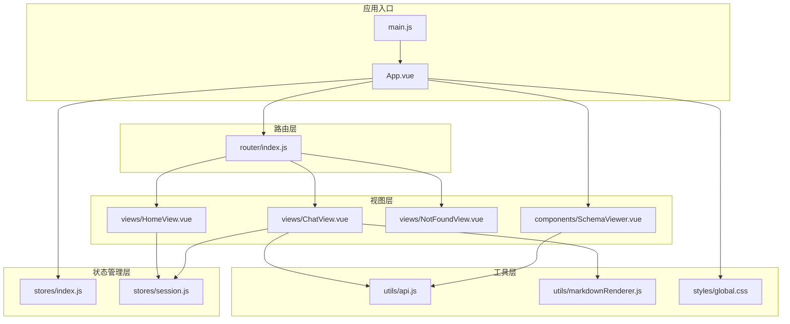
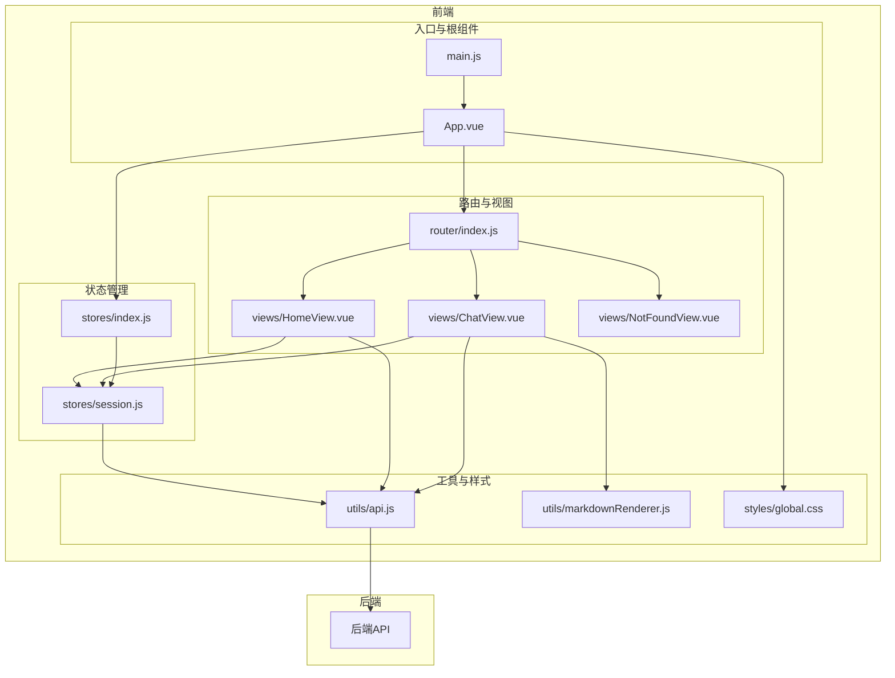
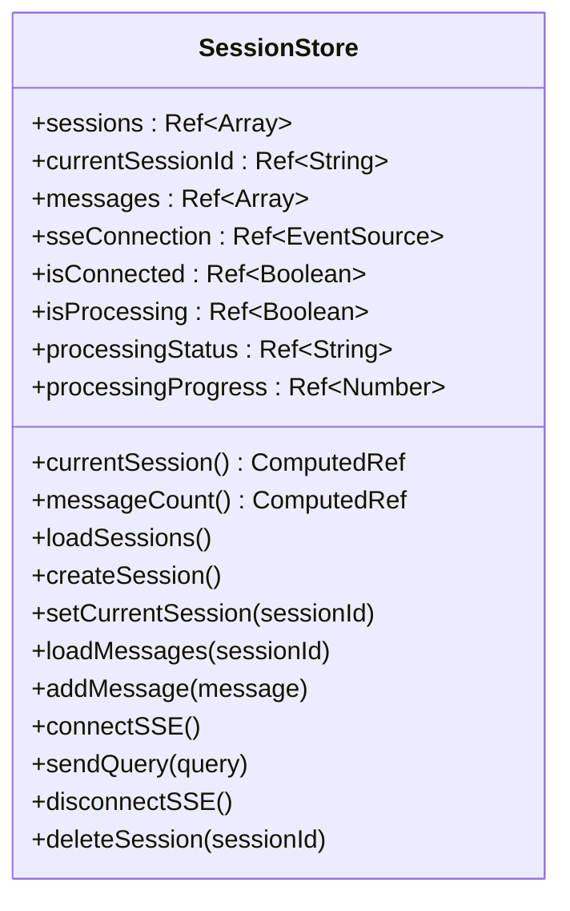
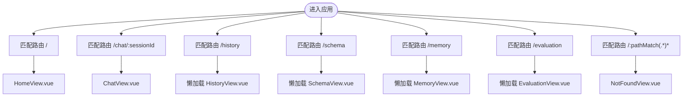
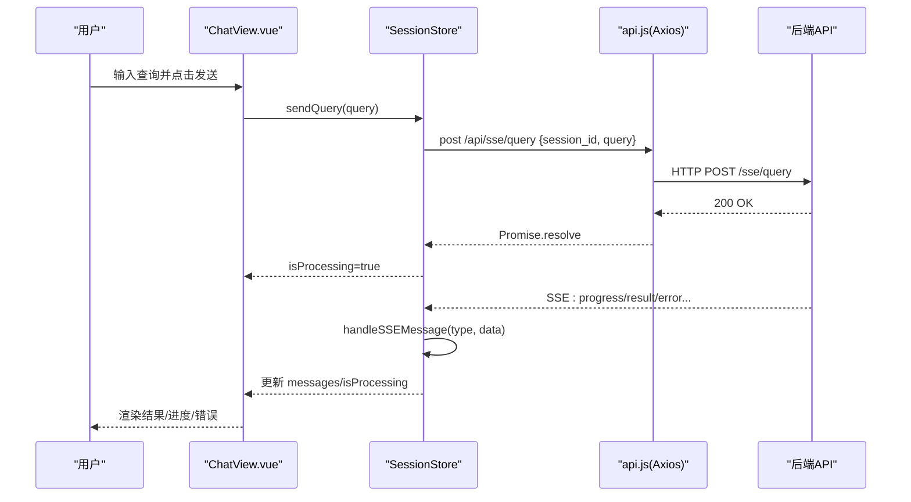
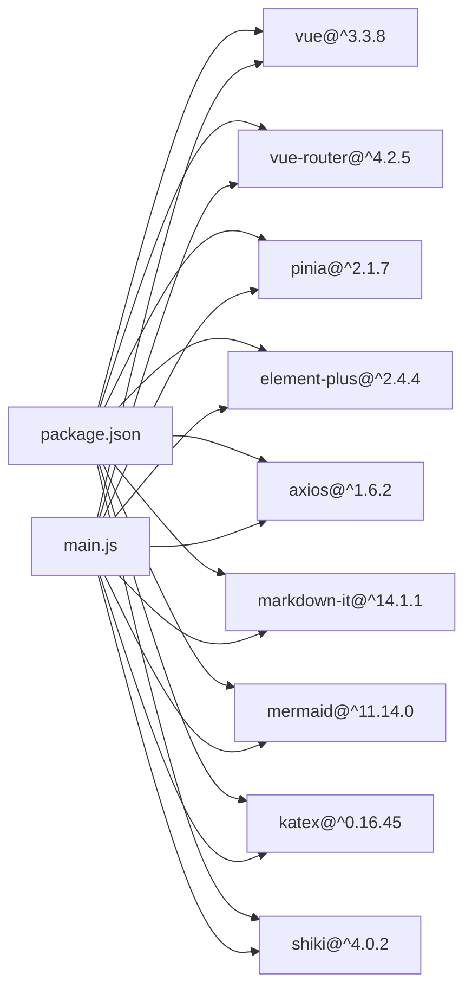

# 前端架构

<cite>
**本文档引用的文件**
- [package.json](file://frontend/package.json)
- [main.js](file://frontend/src/main.js)
- [App.vue](file://frontend/src/App.vue)
- [vite.config.js](file://frontend/vite.config.js)
- [router/index.js](file://frontend/src/router/index.js)
- [stores/index.js](file://frontend/src/stores/index.js)
- [stores/session.js](file://frontend/src/stores/session.js)
- [utils/api.js](file://frontend/src/utils/api.js)
- [views/ChatView.vue](file://frontend/src/views/ChatView.vue)
- [views/HomeView.vue](file://frontend/src/views/HomeView.vue)
- [views/NotFoundView.vue](file://frontend/src/views/NotFoundView.vue)
- [components/SchemaViewer.vue](file://frontend/src/components/SchemaViewer.vue)
- [utils/markdownRenderer.js](file://frontend/src/utils/markdownRenderer.js)
- [styles/global.css](file://frontend/src/styles/global.css)
</cite>

## 目录
1. [简介](#简介)
2. [项目结构](#项目结构)
3. [核心组件](#核心组件)
4. [架构总览](#架构总览)
5. [详细组件分析](#详细组件分析)
6. [依赖关系分析](#依赖关系分析)
7. [性能考量](#性能考量)
8. [故障排查指南](#故障排查指南)
9. [结论](#结论)
10. [附录](#附录)

## 简介
本项目是一个基于 Vue.js 3 的单页应用（SPA），采用 Composition API 与 `<script setup>` 语法，结合 Element Plus 组件库、Pinia 状态管理和 Vue Router 路由系统，实现“自然语言转 SQL”的交互式前端界面。应用通过 Axios 封装的 API 服务与后端进行通信，支持会话管理、Schema 查看、实时消息流（SSE）以及富文本/代码高亮渲染等功能。

## 项目结构
前端项目位于 `frontend/` 目录，采用按功能分层的组织方式：
- 入口与应用根组件：`src/main.js`、`src/App.vue`
- 路由配置：`src/router/index.js`
- 状态管理：`src/stores/index.js`、`src/stores/session.js`
- 视图页面：`src/views/` 下的多个页面组件
- 工具模块：`src/utils/` 下的 API 封装与 Markdown 渲染
- 全局样式：`src/styles/global.css`
- 构建配置：`vite.config.js`

**图表来源**
- [main.js:1-89](file://frontend/src/main.js#L1-L89)
- [App.vue:1-384](file://frontend/src/App.vue#L1-L384)
- [router/index.js:1-157](file://frontend/src/router/index.js#L1-L157)
- [stores/index.js:1-30](file://frontend/src/stores/index.js#L1-L30)
- [stores/session.js:1-400](file://frontend/src/stores/session.js#L1-L400)
- [utils/api.js:1-303](file://frontend/src/utils/api.js#L1-L303)
- [utils/markdownRenderer.js:1-258](file://frontend/src/utils/markdownRenderer.js#L1-L258)
- [views/ChatView.vue:1-778](file://frontend/src/views/ChatView.vue#L1-L778)
- [views/HomeView.vue:1-318](file://frontend/src/views/HomeView.vue#L1-L318)
- [views/NotFoundView.vue:1-131](file://frontend/src/views/NotFoundView.vue#L1-L131)
- [components/SchemaViewer.vue:1-317](file://frontend/src/components/SchemaViewer.vue#L1-L317)
- [styles/global.css:1-317](file://frontend/src/styles/global.css#L1-L317)

**章节来源**
- [package.json:1-36](file://frontend/package.json#L1-L36)
- [vite.config.js:1-93](file://frontend/vite.config.js#L1-L93)

## 核心组件
- 应用入口与插件安装：在入口文件中创建 Vue 应用实例，安装路由、状态管理、UI 组件库与全局样式，并注册 Element Plus 图标组件。
- 根组件布局：提供侧边栏（会话列表、历史会话、Schema 查看、记忆与评估入口）、主内容区（router-view）与 Schema 查看弹窗。
- 路由系统：定义首页、聊天、历史、Schema、记忆、评估、404 等页面，使用 History 模式与滚动行为配置，全局前置守卫设置页面标题。
- 状态管理：通过 Pinia 创建全局 Store，集中管理会话列表、当前会话、消息历史、SSE 连接与处理状态。
- API 服务：封装 Axios 实例，统一请求/响应拦截、错误处理与业务接口（Schema、会话、查询历史、统计、评估、SSE）。
- 视图组件：首页提供快速开始与示例；聊天页支持富文本渲染、SQL 高亮、数据表格展示、SSE 实时反馈；404 页面提供返回操作。
- 工具模块：Markdown 渲染器集成 markdown-it、Mermaid、KaTeX 与 Shiki，支持数学公式、Mermaid 图表与多语言代码高亮。

**章节来源**
- [main.js:1-89](file://frontend/src/main.js#L1-L89)
- [App.vue:1-384](file://frontend/src/App.vue#L1-L384)
- [router/index.js:1-157](file://frontend/src/router/index.js#L1-L157)
- [stores/index.js:1-30](file://frontend/src/stores/index.js#L1-L30)
- [stores/session.js:1-400](file://frontend/src/stores/session.js#L1-L400)
- [utils/api.js:1-303](file://frontend/src/utils/api.js#L1-L303)
- [views/ChatView.vue:1-778](file://frontend/src/views/ChatView.vue#L1-L778)
- [views/HomeView.vue:1-318](file://frontend/src/views/HomeView.vue#L1-L318)
- [views/NotFoundView.vue:1-131](file://frontend/src/views/NotFoundView.vue#L1-L131)
- [utils/markdownRenderer.js:1-258](file://frontend/src/utils/markdownRenderer.js#L1-L258)

## 架构总览
应用采用“入口 -> 根组件 -> 路由 -> 视图 -> 状态管理 -> API -> 后端”的典型 SPA 架构。Element Plus 提供 UI 基础能力，Pinia 管理全局状态，Vue Router 负责页面导航，Axios 封装统一 API 调用，Markdown 渲染器增强消息展示体验。

**图表来源**
- [main.js:1-89](file://frontend/src/main.js#L1-L89)
- [App.vue:1-384](file://frontend/src/App.vue#L1-L384)
- [router/index.js:1-157](file://frontend/src/router/index.js#L1-L157)
- [stores/index.js:1-30](file://frontend/src/stores/index.js#L1-L30)
- [stores/session.js:1-400](file://frontend/src/stores/session.js#L1-L400)
- [utils/api.js:1-303](file://frontend/src/utils/api.js#L1-L303)
- [utils/markdownRenderer.js:1-258](file://frontend/src/utils/markdownRenderer.js#L1-L258)
- [views/ChatView.vue:1-778](file://frontend/src/views/ChatView.vue#L1-L778)
- [views/HomeView.vue:1-318](file://frontend/src/views/HomeView.vue#L1-L318)
- [views/NotFoundView.vue:1-131](file://frontend/src/views/NotFoundView.vue#L1-L131)
- [styles/global.css:1-317](file://frontend/src/styles/global.css#L1-L317)

## 详细组件分析

### 组件层次结构与布局
- 根组件 App.vue 提供侧边栏与主内容区布局，包含：
  - Logo 与新建会话按钮
  - 历史会话列表（点击切换会话）
  - 底部工具栏（Schema 查看、记忆、评估、设置、侧边栏开关）
  - Schema 查看弹窗（v-model 控制）
- 通过 Element Plus 的布局组件与样式实现响应式与交互体验。

**章节来源**
- [App.vue:1-384](file://frontend/src/App.vue#L1-L384)

### 状态管理模式（Pinia）
- 全局 Pinia 实例在 stores/index.js 中创建并导出。
- 会话状态管理 store（stores/session.js）：
  - State：会话列表、当前会话 ID、消息列表、SSE 连接、连接状态、处理状态与进度
  - Getters：当前会话、消息数量
  - Actions：加载会话、创建会话、设置当前会话、加载消息、添加消息、连接/断开 SSE、发送查询、删除会话
  - 与 API 服务协作，统一处理后端返回的 SSE 消息类型（connected、processing、progress、result、clarify、error）

**图表来源**
- [stores/session.js:33-399](file://frontend/src/stores/session.js#L33-L399)

**章节来源**
- [stores/index.js:1-30](file://frontend/src/stores/index.js#L1-L30)
- [stores/session.js:1-400](file://frontend/src/stores/session.js#L1-L400)

### 路由设计（Vue Router）
- 路由配置：
  - 首页（/）：欢迎与快速开始
  - 聊天（/chat/:sessionId?）：支持带会话参数的动态路由
  - 历史（/history）：懒加载
  - Schema（/schema）：懒加载
  - 记忆（/memory）：懒加载
  - 评估（/evaluation）：懒加载
  - 404（/:pathMatch(.*)*）：兜底页面
- 全局前置守卫设置页面标题，History 模式与滚动行为配置。

**图表来源**
- [router/index.js:34-109](file://frontend/src/router/index.js#L34-L109)

**章节来源**
- [router/index.js:1-157](file://frontend/src/router/index.js#L1-L157)

### 组件间通信与数据流
- 父子组件通信：
  - App.vue 与 SchemaViewer.vue：通过 v-model 控制弹窗显示
  - ChatView.vue 与 SessionStore：通过 computed 读取状态，通过 actions 修改状态
- 路由与状态联动：
  - ChatView.vue 监听路由参数变化，初始化会话并连接 SSE
  - HomeView.vue 通过 SessionStore 创建会话并跳转到聊天页
- 事件与回调：
  - Element Plus 的按钮、输入框、表格等组件通过事件绑定触发业务逻辑
  - SSE 消息通过 store 的 handleSSEMessage 分发到消息列表

**章节来源**
- [App.vue:1-384](file://frontend/src/App.vue#L1-L384)
- [views/ChatView.vue:1-778](file://frontend/src/views/ChatView.vue#L1-L778)
- [views/HomeView.vue:1-318](file://frontend/src/views/HomeView.vue#L1-L318)
- [stores/session.js:1-400](file://frontend/src/stores/session.js#L1-L400)

### 前端与后端 API 交互模式
- Axios 封装：
  - 基础 URL 为 /api，统一超时与请求头
  - 请求拦截器：预留添加认证头（注释）
  - 响应拦截器：统一错误处理（服务端错误、网络错误、请求配置错误）
- 业务接口：
  - 健康检查、Schema、表详情、搜索、会话 CRUD、消息历史、查询历史、统计、配置、SSE 查询、评估接口
- SSE 流：
  - ChatView.vue 通过 store.connectSSE 建立连接，监听 onmessage 并调用 handleSSEMessage
  - 支持多种消息类型（connected、processing、progress、result、clarify、error）

**图表来源**
- [views/ChatView.vue:196-345](file://frontend/src/views/ChatView.vue#L196-L345)
- [stores/session.js:297-330](file://frontend/src/stores/session.js#L297-L330)
- [utils/api.js:246-251](file://frontend/src/utils/api.js#L246-L251)

**章节来源**
- [utils/api.js:1-303](file://frontend/src/utils/api.js#L1-L303)
- [stores/session.js:182-295](file://frontend/src/stores/session.js#L182-L295)
- [views/ChatView.vue:1-778](file://frontend/src/views/ChatView.vue#L1-L778)

### Element Plus 组件库集成
- 插件安装：在入口文件中安装 ElementPlus 并引入样式
- 图标注册：遍历 Element Plus Icons 并全局注册
- 组件使用：广泛使用 ElButton、ElInput、ElDialog、ElTable、ElMessage、ElMessageBox、ElSkeleton、ElEmpty 等组件

**章节来源**
- [main.js:34-80](file://frontend/src/main.js#L34-L80)
- [views/ChatView.vue:1-778](file://frontend/src/views/ChatView.vue#L1-L778)
- [components/SchemaViewer.vue:1-317](file://frontend/src/components/SchemaViewer.vue#L1-L317)

### Markdown 与富文本渲染
- 渲染器集成：
  - markdown-it：解析 Markdown
  - Shiki：代码高亮（SQL、JS、Python 等）
  - Mermaid：流程图/序列图/甘特图
  - KaTeX：数学公式渲染
- ChatView.vue 使用渲染器将助手消息内容转换为 HTML，并支持 SQL 代码块高亮与复制。

**章节来源**
- [utils/markdownRenderer.js:1-258](file://frontend/src/utils/markdownRenderer.js#L1-L258)
- [views/ChatView.vue:265-292](file://frontend/src/views/ChatView.vue#L265-L292)

## 依赖关系分析
- 依赖管理：package.json 中声明 Vue 3、Vue Router、Pinia、Element Plus、Axios、markdown-it、mermaid、katex、shiki 等核心依赖
- 构建配置：Vite 配置了开发服务器、代理、路径别名、SCSS 自动导入、代码分割（Element Plus、ECharts、第三方 vendor）
- 运行时依赖：
  - main.js 安装路由、Pinia、Element Plus 插件
  - App.vue 作为根组件承载布局与全局状态
  - router/index.js 定义路由与守卫
  - stores/session.js 管理会话与 SSE
  - utils/api.js 统一封装 HTTP 请求
  - utils/markdownRenderer.js 提供富文本渲染

**图表来源**
- [package.json:11-28](file://frontend/package.json#L11-L28)
- [main.js:14-42](file://frontend/src/main.js#L14-L42)

**章节来源**
- [package.json:1-36](file://frontend/package.json#L1-L36)
- [vite.config.js:17-92](file://frontend/vite.config.js#L17-L92)

## 性能考量
- 代码分割：Vite 配置将 Element Plus、ECharts、Vue 生态库拆分为独立 chunk，减少首屏体积
- 懒加载路由：历史、Schema、记忆、评估页面按需加载，降低初始包体
- 组件懒加载：SchemaViewer.vue 在弹窗打开时才加载数据，避免不必要的资源消耗
- 渲染优化：ChatView.vue 使用虚拟滚动与自动滚动至底部，避免 DOM 重复渲染
- 样式优化：全局样式统一基础排版与滚动条，减少重复样式定义
- 构建产物：生产环境关闭 source map，提升安全性与加载速度

**章节来源**
- [vite.config.js:71-91](file://frontend/vite.config.js#L71-L91)
- [router/index.js:63-94](file://frontend/src/router/index.js#L63-L94)
- [components/SchemaViewer.vue:191-208](file://frontend/src/components/SchemaViewer.vue#L191-L208)
- [views/ChatView.vue:297-304](file://frontend/src/views/ChatView.vue#L297-L304)
- [styles/global.css:1-317](file://frontend/src/styles/global.css#L1-L317)

## 故障排查指南
- 网络与代理：
  - 开发环境通过 Vite 代理将 /api 代理到后端服务，若无法访问后端请检查代理配置与端口
- SSE 连接：
  - 若聊天页无响应，检查后端 SSE 端点与连接状态；store 中 isConnected 与 sseConnection 可辅助定位
- Axios 错误处理：
  - 响应拦截器统一捕获服务端错误、网络错误与请求配置错误，可在控制台查看具体错误信息
- 404 页面：
  - 访问不存在路由时显示 404 页面，提供返回上一页与返回首页操作
- 会话与消息：
  - 若会话列表为空，检查后端会话接口；消息为空时检查消息历史接口与路由参数

**章节来源**
- [vite.config.js:24-34](file://frontend/vite.config.js#L24-L34)
- [stores/session.js:182-221](file://frontend/src/stores/session.js#L182-L221)
- [utils/api.js:67-88](file://frontend/src/utils/api.js#L67-L88)
- [views/NotFoundView.vue:1-131](file://frontend/src/views/NotFoundView.vue#L1-L131)

## 结论
本前端应用以 Vue 3 为核心，结合 Element Plus、Pinia 与 Vue Router，构建了清晰的单页应用架构。通过 Axios 封装与 SSE 实时流，实现了自然语言到 SQL 的高效交互；通过 Markdown 渲染与代码高亮，提升了消息展示体验。配合 Vite 的代码分割与懒加载策略，兼顾了性能与可维护性。建议后续完善认证机制（请求拦截器添加 token）、错误边界与日志上报，进一步提升稳定性与可观测性。

## 附录
- 开发与构建命令：
  - dev：启动开发服务器
  - build：构建生产包
  - preview：预览生产包
- 路径别名：
  - @ 指向 src
  - @components 指向 src/components
  - @views 指向 src/views
  - @stores 指向 src/stores
  - @utils 指向 src/utils

**章节来源**
- [package.json:6-10](file://frontend/package.json#L6-L10)
- [vite.config.js:38-50](file://frontend/vite.config.js#L38-L50)