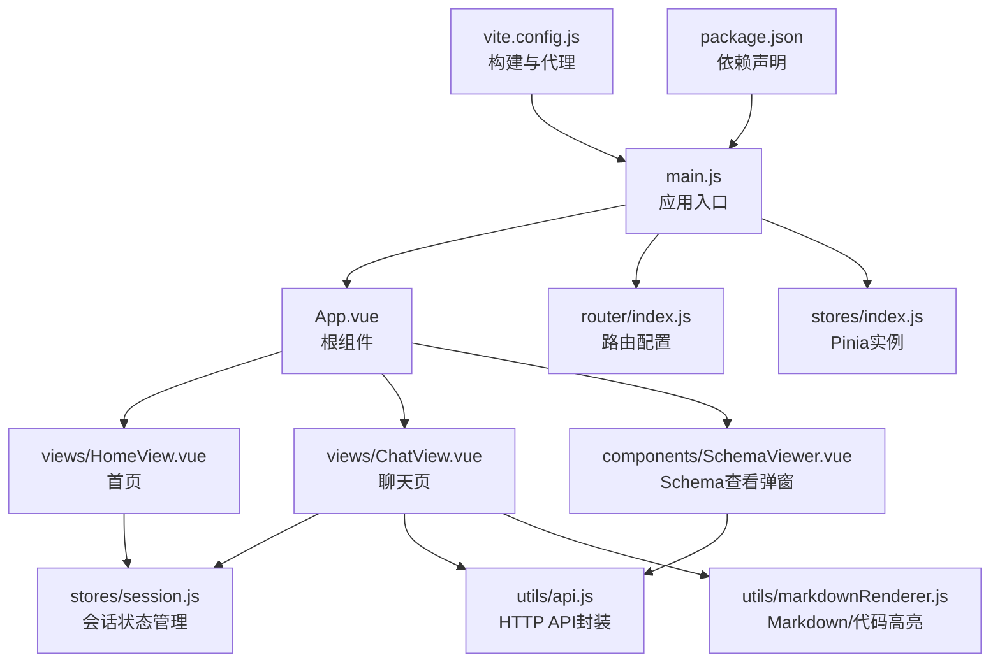
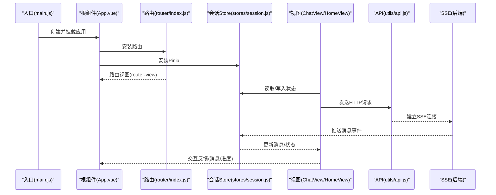
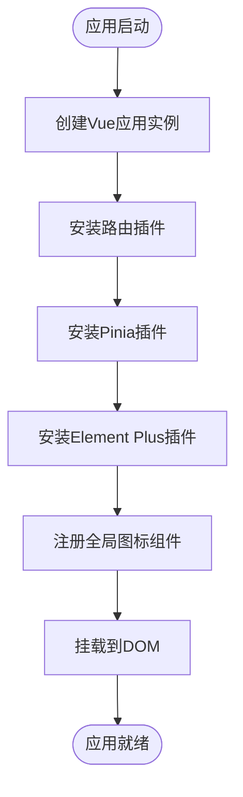
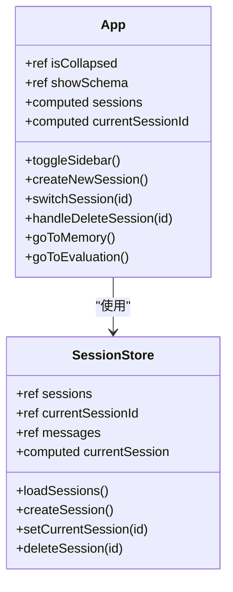
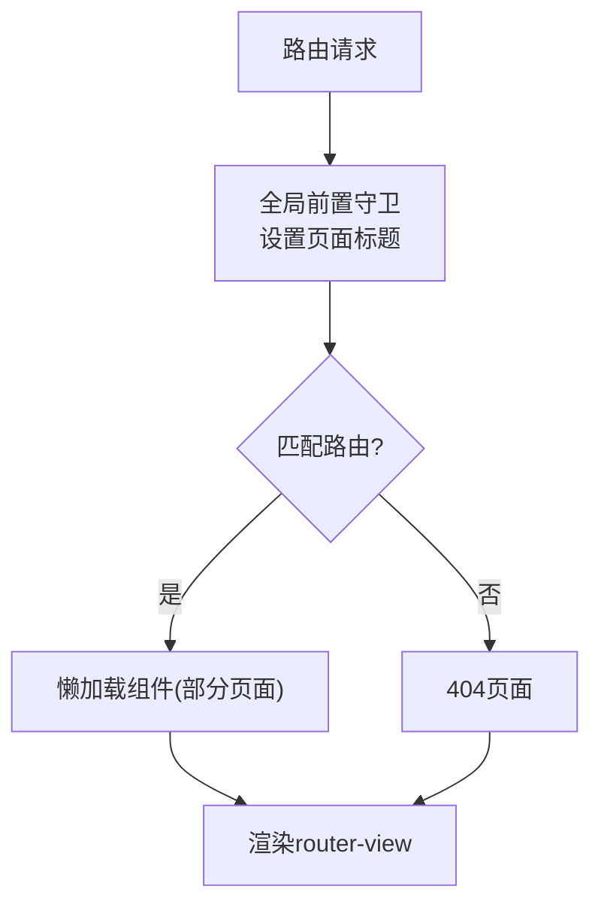
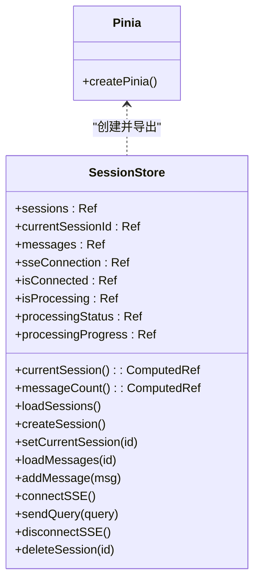
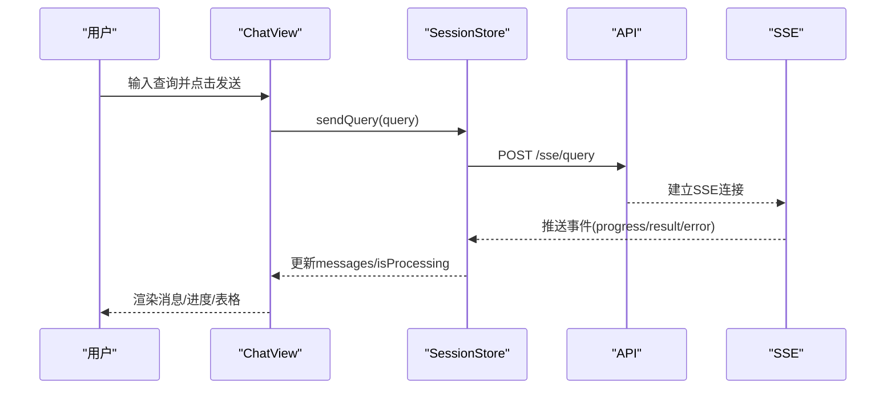
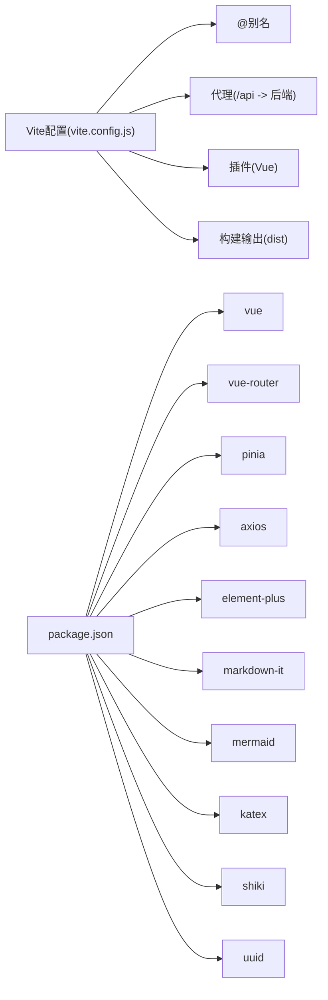

# 前端架构

<cite>
**本文引用的文件**
- [main.js](file://frontend/src/main.js)
- [App.vue](file://frontend/src/App.vue)
- [router/index.js](file://frontend/src/router/index.js)
- [stores/index.js](file://frontend/src/stores/index.js)
- [stores/session.js](file://frontend/src/stores/session.js)
- [views/ChatView.vue](file://frontend/src/views/ChatView.vue)
- [views/HomeView.vue](file://frontend/src/views/HomeView.vue)
- [utils/api.js](file://frontend/src/utils/api.js)
- [utils/markdownRenderer.js](file://frontend/src/utils/markdownRenderer.js)
- [components/SchemaViewer.vue](file://frontend/src/components/SchemaViewer.vue)
- [styles/global.css](file://frontend/src/styles/global.css)
- [vite.config.js](file://frontend/vite.config.js)
- [package.json](file://frontend/package.json)
</cite>

## 目录
1. [简介](#简介)
2. [项目结构](#项目结构)
3. [核心组件](#核心组件)
4. [架构总览](#架构总览)
5. [详细组件分析](#详细组件分析)
6. [依赖分析](#依赖分析)
7. [性能考量](#性能考量)
8. [故障排查指南](#故障排查指南)
9. [结论](#结论)
10. [附录](#附录)

## 简介
本文件面向 NL2SQL 前端架构，围绕基于 Vue 3 的单页应用（SPA）进行系统化技术文档梳理。重点覆盖：
- 应用入口配置与插件安装
- 路由系统设计与页面导航
- 状态管理方案（Pinia）与会话状态管理
- 组件层次结构、父子组件通信与事件处理
- 响应式数据绑定、计算属性与生命周期管理
- 实时数据同步（SSE）与交互体验设计
- 性能优化策略与用户体验设计要点

## 项目结构
前端采用模块化组织，遵循“按功能分层”的目录结构：
- 入口与根组件：main.js、App.vue
- 路由：router/index.js
- 状态管理：stores/index.js、stores/session.js
- 视图页面：views 下各页面组件
- 工具模块：utils 下 API 与 Markdown 渲染
- 公共组件：components 下通用组件
- 样式：styles 下全局样式
- 构建配置：vite.config.js、package.json

**图表来源**
- [main.js:1-89](file://frontend/src/main.js#L1-L89)
- [App.vue:1-384](file://frontend/src/App.vue#L1-L384)
- [router/index.js:1-157](file://frontend/src/router/index.js#L1-L157)
- [stores/index.js:1-30](file://frontend/src/stores/index.js#L1-L30)
- [stores/session.js:1-400](file://frontend/src/stores/session.js#L1-L400)
- [views/ChatView.vue:1-778](file://frontend/src/views/ChatView.vue#L1-L778)
- [views/HomeView.vue:1-318](file://frontend/src/views/HomeView.vue#L1-L318)
- [utils/api.js:1-303](file://frontend/src/utils/api.js#L1-L303)
- [utils/markdownRenderer.js:1-258](file://frontend/src/utils/markdownRenderer.js#L1-L258)
- [components/SchemaViewer.vue:1-317](file://frontend/src/components/SchemaViewer.vue#L1-L317)
- [vite.config.js:1-93](file://frontend/vite.config.js#L1-L93)
- [package.json:1-36](file://frontend/package.json#L1-L36)

**章节来源**
- [main.js:1-89](file://frontend/src/main.js#L1-L89)
- [router/index.js:1-157](file://frontend/src/router/index.js#L1-L157)
- [stores/index.js:1-30](file://frontend/src/stores/index.js#L1-L30)
- [vite.config.js:1-93](file://frontend/vite.config.js#L1-L93)
- [package.json:1-36](file://frontend/package.json#L1-L36)

## 核心组件
- 应用入口与插件安装：在入口文件中创建 Vue 应用实例，安装路由、Pinia、Element Plus，并注册全局图标组件，最后挂载到 DOM。
- 根组件：负责整体布局（侧边栏 + 主内容区），承载会话列表、导航与 Schema 查看弹窗；通过 Pinia 会话 Store 管理会话状态与路由联动。
- 路由系统：定义首页、聊天、历史、Schema、记忆、评估、404 等页面，使用 History 模式与滚动行为配置，全局前置守卫设置页面标题。
- 状态管理：Pinia 实例集中管理；会话 Store 管理会话列表、当前会话、消息、SSE 连接与处理状态，提供加载、创建、切换、删除会话与发送查询等动作。
- 视图组件：首页提供快速开始与示例；聊天页实现消息渲染、输入、SSE 实时反馈、SQL 与表格展示、复制 SQL 等；Schema 查看弹窗提供搜索、折叠查看表结构。
- 工具模块：API 封装统一 HTTP 请求与错误处理；Markdown 渲染集成 markdown-it、Mermaid、KaTeX、Shiki，支持数学公式、Mermaid 图表与代码高亮。

**章节来源**
- [main.js:1-89](file://frontend/src/main.js#L1-L89)
- [App.vue:85-241](file://frontend/src/App.vue#L85-L241)
- [router/index.js:34-157](file://frontend/src/router/index.js#L34-L157)
- [stores/session.js:33-399](file://frontend/src/stores/session.js#L33-L399)
- [views/ChatView.vue:132-383](file://frontend/src/views/ChatView.vue#L132-L383)
- [views/HomeView.vue:95-188](file://frontend/src/views/HomeView.vue#L95-L188)
- [utils/api.js:25-303](file://frontend/src/utils/api.js#L25-L303)
- [utils/markdownRenderer.js:74-258](file://frontend/src/utils/markdownRenderer.js#L74-L258)
- [components/SchemaViewer.vue:89-257](file://frontend/src/components/SchemaViewer.vue#L89-L257)

## 架构总览
下图展示了前端应用的整体交互流：入口创建应用 → 安装插件 → 根组件布局 → 路由驱动页面 → 状态管理协调业务 → API 与 SSE 实时通信。

**图表来源**
- [main.js:55-88](file://frontend/src/main.js#L55-L88)
- [App.vue:115-241](file://frontend/src/App.vue#L115-L241)
- [router/index.js:118-157](file://frontend/src/router/index.js#L118-L157)
- [stores/session.js:103-341](file://frontend/src/stores/session.js#L103-L341)
- [views/ChatView.vue:196-345](file://frontend/src/views/ChatView.vue#L196-L345)
- [utils/api.js:246-251](file://frontend/src/utils/api.js#L246-L251)

## 详细组件分析

### 应用入口与插件安装（main.js）
- 创建 Vue 应用实例并引入根组件
- 安装路由、Pinia、Element Plus 插件
- 注册 Element Plus 图标为全局组件
- 挂载到 DOM

**图表来源**
- [main.js:55-88](file://frontend/src/main.js#L55-L88)

**章节来源**
- [main.js:1-89](file://frontend/src/main.js#L1-L89)

### 根组件布局与会话管理（App.vue）
- 布局：侧边栏（Logo、新建会话、会话列表、底部工具栏）、主内容区（router-view）、Schema 查看弹窗
- 会话管理：通过 Pinia 会话 Store 获取 sessions/currentSessionId，支持创建、切换、删除会话，路由跳转
- 交互：侧边栏折叠、跳转到记忆/评估页面、弹窗开关

**图表来源**
- [App.vue:124-241](file://frontend/src/App.vue#L124-L241)
- [stores/session.js:42-399](file://frontend/src/stores/session.js#L42-L399)

**章节来源**
- [App.vue:1-384](file://frontend/src/App.vue#L1-L384)

### 路由系统与页面导航（router/index.js）
- 路由定义：首页、聊天（带会话参数）、历史、Schema、记忆、评估、404
- 懒加载：历史、Schema、记忆、评估页面按需加载
- 全局守卫：设置页面标题
- 滚动行为：返回保存位置或回到顶部

**图表来源**
- [router/index.js:142-150](file://frontend/src/router/index.js#L142-L150)
- [router/index.js:34-109](file://frontend/src/router/index.js#L34-L109)

**章节来源**
- [router/index.js:1-157](file://frontend/src/router/index.js#L1-L157)

### Pinia 状态管理与会话 Store（stores/index.js、stores/session.js）
- Pinia 实例：集中管理全局状态
- 会话 Store：
  - State：sessions、currentSessionId、messages、sseConnection、isConnected、isProcessing、processingStatus、processingProgress
  - Getters：currentSession、messageCount
  - Actions：loadSessions、createSession、setCurrentSession、loadMessages、addMessage、connectSSE、sendQuery、disconnectSSE、deleteSession
  - SSE：建立连接、接收事件、更新处理状态与消息列表

**图表来源**
- [stores/index.js:23-29](file://frontend/src/stores/index.js#L23-L29)
- [stores/session.js:33-399](file://frontend/src/stores/session.js#L33-L399)

**章节来源**
- [stores/index.js:1-30](file://frontend/src/stores/index.js#L1-L30)
- [stores/session.js:1-400](file://frontend/src/stores/session.js#L1-L400)

### 聊天视图与实时交互（views/ChatView.vue）
- 消息渲染：用户/助手消息、Markdown 内容、SQL 代码块、数据表格
- 输入与发送：Textarea 输入、Enter 发送、Shift+Enter 换行、禁用条件
- SSE 集成：初始化会话、连接 SSE、监听消息、处理不同类型事件（进度、结果、澄清、错误）
- 自动滚动：消息变化与处理完成时滚动到底部
- 生命周期：挂载时初始化会话，卸载时断开 SSE

**图表来源**
- [views/ChatView.vue:196-345](file://frontend/src/views/ChatView.vue#L196-L345)
- [stores/session.js:297-341](file://frontend/src/stores/session.js#L297-L341)
- [utils/api.js:246-251](file://frontend/src/utils/api.js#L246-L251)

**章节来源**
- [views/ChatView.vue:1-778](file://frontend/src/views/ChatView.vue#L1-L778)
- [stores/session.js:103-341](file://frontend/src/stores/session.js#L103-L341)
- [utils/api.js:246-251](file://frontend/src/utils/api.js#L246-L251)

### 首页与示例（views/HomeView.vue）
- 快速开始：创建新会话并跳转到聊天页
- Schema 查看：跳转到 Schema 页面
- 示例列表：点击示例可创建会话并跳转（实际发送在聊天页处理）

**章节来源**
- [views/HomeView.vue:1-318](file://frontend/src/views/HomeView.vue#L1-L318)

### API 封装与错误处理（utils/api.js）
- axios 实例：baseURL /api、超时、请求/响应拦截
- 统一错误处理：根据响应状态、网络错误、请求配置错误分类处理
- API 列表：Schema、会话、查询历史、统计、配置、SSE 查询等

**章节来源**
- [utils/api.js:25-88](file://frontend/src/utils/api.js#L25-L88)
- [utils/api.js:151-302](file://frontend/src/utils/api.js#L151-L302)

### Markdown 渲染与代码高亮（utils/markdownRenderer.js）
- 集成：markdown-it、Mermaid、KaTeX、Shiki
- 功能：Markdown 渲染、数学公式（行内/块级）、Mermaid 图表、SQL/多语言代码高亮
- 异步初始化：Shiki 按需加载，失败回退

**章节来源**
- [utils/markdownRenderer.js:74-258](file://frontend/src/utils/markdownRenderer.js#L74-L258)

### Schema 查看弹窗（components/SchemaViewer.vue）
- 功能：弹窗展示数据 Schema，支持搜索、折叠展开、主键标识、关联关系展示
- 交互：v-model 控制显隐，首次打开时加载数据

**章节来源**
- [components/SchemaViewer.vue:1-317](file://frontend/src/components/SchemaViewer.vue#L1-L317)

## 依赖分析
- 构建工具：Vite，配置开发服务器、代理、路径别名、CSS 预处理器、代码分割
- 运行时依赖：Vue 3、Vue Router、Pinia、Element Plus、axios、markdown-it、mermaid、katex、shiki、uuid 等
- 开发依赖：@vitejs/plugin-vue、sass、vite

**图表来源**
- [vite.config.js:17-92](file://frontend/vite.config.js#L17-L92)
- [package.json:11-28](file://frontend/package.json#L11-L28)

**章节来源**
- [vite.config.js:1-93](file://frontend/vite.config.js#L1-L93)
- [package.json:1-36](file://frontend/package.json#L1-L36)

## 性能考量
- 代码分割：第三方库手动拆分（element-plus、echarts、vendor），减少首屏体积
- 懒加载：部分页面组件按需加载，降低初始加载压力
- 响应式与计算属性：避免重复计算，仅在依赖变化时更新
- SSE 连接管理：组件卸载时断开连接，防止内存泄漏
- 滚动优化：nextTick 确保 DOM 更新后再滚动，避免闪烁
- 图表与高亮：Mermaid 与 Shiki 异步初始化，失败回退，避免阻塞主线程
- 全局样式：统一基础样式与工具类，减少重复样式计算

**章节来源**
- [vite.config.js:78-91](file://frontend/vite.config.js#L78-L91)
- [views/ChatView.vue:297-304](file://frontend/src/views/ChatView.vue#L297-L304)
- [utils/markdownRenderer.js:51-68](file://frontend/src/utils/markdownRenderer.js#L51-L68)

## 故障排查指南
- 网络与代理
  - 开发环境跨域：确认 Vite 代理配置将 /api 代理到后端服务
  - 网络错误：响应拦截器捕获网络异常并返回统一错误对象
- SSE 连接
  - 连接状态：Store 中 isConnected 与 readyState 检查
  - 事件处理：按类型处理 progress/result/error，必要时断线重连
- 路由与导航
  - 路由守卫：全局前置守卫设置标题，确保页面标题正确
  - 参数变化：监听路由参数变化，重新初始化会话
- 状态与数据
  - 会话列表：loadSessions 失败时保留空列表，避免崩溃
  - 消息渲染：Markdown 渲染失败时降级显示原文
- 组件交互
  - Schema 弹窗：首次打开才加载数据，避免重复请求
  - 输入限制：禁用发送按钮条件与 Enter/Shift+Enter 行为

**章节来源**
- [vite.config.js:24-34](file://frontend/vite.config.js#L24-L34)
- [utils/api.js:72-88](file://frontend/src/utils/api.js#L72-L88)
- [stores/session.js:185-221](file://frontend/src/stores/session.js#L185-L221)
- [views/ChatView.vue:354-361](file://frontend/src/views/ChatView.vue#L354-L361)
- [components/SchemaViewer.vue:252-256](file://frontend/src/components/SchemaViewer.vue#L252-L256)

## 结论
NL2SQL 前端采用现代 Vue 3 技术栈，结合 Vue Router、Pinia、Element Plus 与 Vite，构建了清晰的单页应用架构。通过会话 Store 统一管理状态与实时数据同步，配合 API 封装与 Markdown/代码高亮工具，实现了良好的用户体验与可维护性。建议持续关注：
- SSE 连接稳定性与断线重连策略
- 大数据量表格与长消息的虚拟滚动优化
- 国际化与无障碍访问扩展
- 测试覆盖率与端到端测试完善

## 附录
- 全局样式：统一基础样式、滚动条、工具类与动画，提升一致性与可维护性
- 路径别名：@、@components、@views、@stores、@utils，简化导入路径

**章节来源**
- [styles/global.css:1-317](file://frontend/src/styles/global.css#L1-L317)
- [vite.config.js:38-51](file://frontend/vite.config.js#L38-L51)