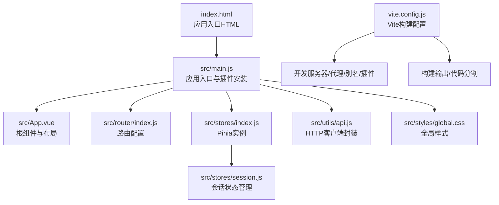
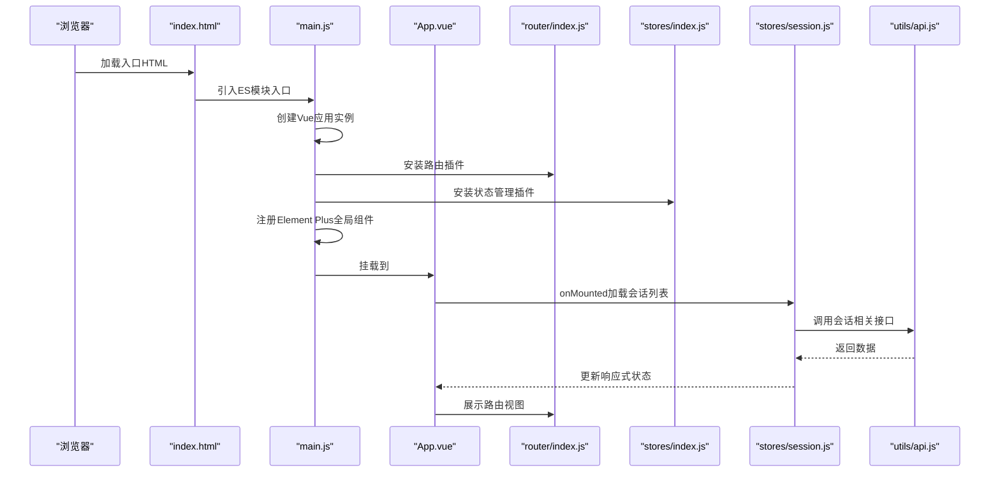
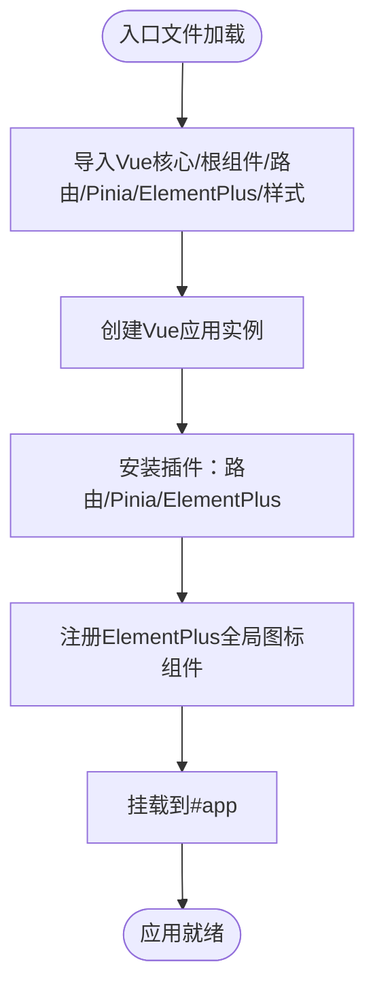
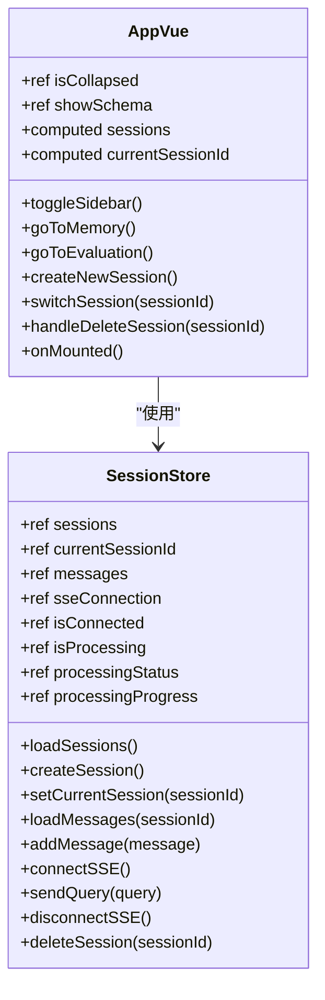
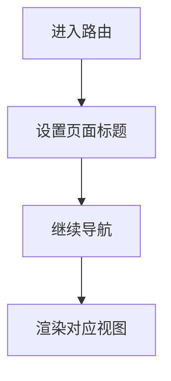
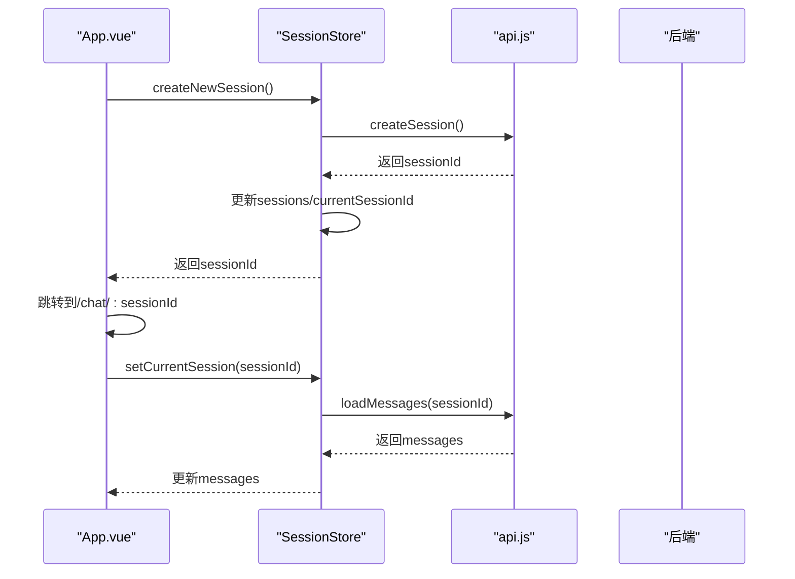
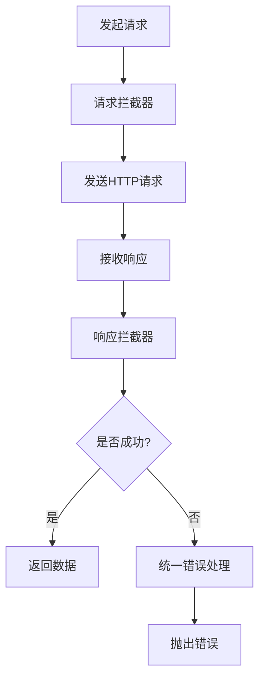
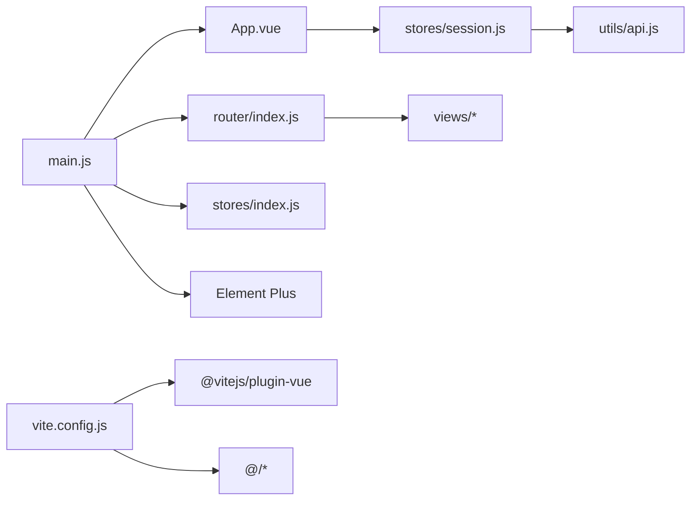

# 应用入口与初始化

<cite>
**本文引用的文件**
- [main.js](file://frontend/src/main.js)
- [vite.config.js](file://frontend/vite.config.js)
- [App.vue](file://frontend/src/App.vue)
- [package.json](file://frontend/package.json)
- [router/index.js](file://frontend/src/router/index.js)
- [stores/index.js](file://frontend/src/stores/index.js)
- [stores/session.js](file://frontend/src/stores/session.js)
- [utils/api.js](file://frontend/src/utils/api.js)
- [styles/global.css](file://frontend/src/styles/global.css)
- [index.html](file://frontend/index.html)
</cite>

## 目录
1. [简介](#简介)
2. [项目结构](#项目结构)
3. [核心组件](#核心组件)
4. [架构总览](#架构总览)
5. [详细组件分析](#详细组件分析)
6. [依赖关系分析](#依赖关系分析)
7. [性能考量](#性能考量)
8. [故障排查指南](#故障排查指南)
9. [结论](#结论)
10. [附录](#附录)

## 简介
本文件聚焦 NL2SQL 前端应用的入口与初始化流程，围绕 main.js 的应用创建、插件注册与全局配置，结合 Vite 构建配置与 App.vue 根组件的布局与状态管理，系统阐述应用启动、依赖注入与全局错误处理机制，并给出开发与生产环境的配置建议、构建打包策略以及性能优化与缓存实践。

## 项目结构
前端采用 Vue 3 + Vite + Pinia + Vue Router + Element Plus 技术栈，入口文件位于 src/main.js，根组件为 App.vue，路由与状态管理分别在 router/index.js 与 stores 下组织，全局样式在 styles/global.css，构建配置集中在 vite.config.js，入口 HTML 文件为 index.html。

图表来源
- [index.html:1-33](file://frontend/index.html#L1-L33)
- [main.js:1-89](file://frontend/src/main.js#L1-L89)
- [App.vue:1-384](file://frontend/src/App.vue#L1-L384)
- [router/index.js:1-157](file://frontend/src/router/index.js#L1-L157)
- [stores/index.js:1-30](file://frontend/src/stores/index.js#L1-L30)
- [stores/session.js:1-400](file://frontend/src/stores/session.js#L1-L400)
- [utils/api.js:1-303](file://frontend/src/utils/api.js#L1-L303)
- [styles/global.css:1-317](file://frontend/src/styles/global.css#L1-L317)
- [vite.config.js:1-93](file://frontend/vite.config.js#L1-L93)

章节来源
- [index.html:1-33](file://frontend/index.html#L1-L33)
- [main.js:1-89](file://frontend/src/main.js#L1-L89)
- [vite.config.js:1-93](file://frontend/vite.config.js#L1-L93)

## 核心组件
- 应用入口 main.js：创建 Vue 应用实例，安装路由、状态管理、UI 插件，注册全局组件，挂载 DOM。
- 根组件 App.vue：侧边栏+主内容区布局，会话列表与切换、Schema 查看弹窗、路由视图占位。
- 路由 router/index.js：定义页面路由、懒加载、滚动行为与全局前置守卫。
- 状态 stores：Pinia 实例与会话 Store，管理会话列表、当前会话、消息、SSE 连接与处理状态。
- HTTP 封装 utils/api.js：基于 axios 的客户端，统一请求/响应拦截与错误处理。
- 全局样式 styles/global.css：基础重置、工具类、Element Plus 自定义样式与动画。
- 构建配置 vite.config.js：开发服务器、代理、路径别名、SCSS 预处理、代码分割与输出目录。

章节来源
- [main.js:1-89](file://frontend/src/main.js#L1-L89)
- [App.vue:1-384](file://frontend/src/App.vue#L1-L384)
- [router/index.js:1-157](file://frontend/src/router/index.js#L1-L157)
- [stores/index.js:1-30](file://frontend/src/stores/index.js#L1-L30)
- [stores/session.js:1-400](file://frontend/src/stores/session.js#L1-L400)
- [utils/api.js:1-303](file://frontend/src/utils/api.js#L1-L303)
- [styles/global.css:1-317](file://frontend/src/styles/global.css#L1-L317)
- [vite.config.js:1-93](file://frontend/vite.config.js#L1-L93)

## 架构总览
应用启动流程概览：
- index.html 提供挂载点，引入 ES 模块入口 main.js。
- main.js 创建 Vue 应用，安装路由、Pinia、Element Plus，注册全局图标组件，挂载到 #app。
- App.vue 作为根组件，承载侧边栏与主内容区，通过路由视图展示页面。
- 路由配置定义页面与懒加载，全局守卫设置标题。
- Pinia 管理会话状态，API 封装统一 HTTP 访问，Element Plus 提供 UI 组件与样式。

图表来源
- [index.html:1-33](file://frontend/index.html#L1-L33)
- [main.js:1-89](file://frontend/src/main.js#L1-L89)
- [App.vue:1-384](file://frontend/src/App.vue#L1-L384)
- [router/index.js:1-157](file://frontend/src/router/index.js#L1-L157)
- [stores/index.js:1-30](file://frontend/src/stores/index.js#L1-L30)
- [stores/session.js:1-400](file://frontend/src/stores/session.js#L1-L400)
- [utils/api.js:1-303](file://frontend/src/utils/api.js#L1-L303)

## 详细组件分析

### 应用入口 main.js 初始化流程
- 导入与依赖：导入 Vue 核心、根组件、路由、Pinia、Element Plus、全局样式。
- 应用实例创建：使用 createApp(App) 创建应用实例。
- 插件安装：依次安装路由、状态管理、UI 组件库。
- 全局组件注册：遍历 Element Plus 图标并注册为全局组件，便于任意组件直接使用。
- 挂载：将应用挂载到 #app 元素。

图表来源
- [main.js:1-89](file://frontend/src/main.js#L1-L89)

章节来源
- [main.js:1-89](file://frontend/src/main.js#L1-L89)

### 根组件 App.vue 结构与状态管理
- 布局框架：侧边栏（Logo、新建会话、历史会话列表、底部工具栏）、主内容区（router-view）。
- 响应式状态：侧边栏折叠状态、Schema 查看弹窗显隐。
- 状态管理：通过 useSessionStore 获取会话列表与当前会话 ID，使用 computed 保持响应式。
- 路由集成：使用 useRouter 进行页面跳转。
- 生命周期：onMounted 钩子中加载会话列表。
- 交互方法：切换侧边栏、跳转到记忆/评估页面、创建/切换/删除会话。

图表来源
- [App.vue:85-241](file://frontend/src/App.vue#L85-L241)
- [stores/session.js:33-399](file://frontend/src/stores/session.js#L33-L399)

章节来源
- [App.vue:1-384](file://frontend/src/App.vue#L1-L384)
- [stores/session.js:1-400](file://frontend/src/stores/session.js#L1-L400)

### 路由配置与导航守卫
- 路由规则：首页、聊天（带会话ID参数）、历史、Schema、记忆、评估、404。
- 懒加载：历史、Schema、记忆、评估页面采用动态 import 按需加载。
- 滚动行为：支持恢复滚动位置或回到顶部。
- 全局前置守卫：设置页面标题，增强用户体验。

图表来源
- [router/index.js:142-150](file://frontend/src/router/index.js#L142-L150)
- [router/index.js:118-132](file://frontend/src/router/index.js#L118-L132)

章节来源
- [router/index.js:1-157](file://frontend/src/router/index.js#L1-L157)

### 状态管理与会话 Store
- Store 定义：使用 defineStore('session') 定义会话 Store。
- State：会话列表、当前会话ID、消息列表、SSE 连接、连接状态、处理状态与进度。
- Getters：当前会话信息、消息数量。
- Actions：加载会话、创建会话、设置当前会话、加载消息、添加消息、连接/断开 SSE、发送查询、删除会话。
- SSE 处理：根据消息类型更新状态，自动刷新会话列表标题。

图表来源
- [stores/session.js:118-155](file://frontend/src/stores/session.js#L118-L155)
- [utils/api.js:160-186](file://frontend/src/utils/api.js#L160-L186)

章节来源
- [stores/session.js:1-400](file://frontend/src/stores/session.js#L1-L400)
- [utils/api.js:1-303](file://frontend/src/utils/api.js#L1-L303)

### HTTP 客户端封装与错误处理
- axios 实例：baseURL 设为 /api，timeout 30s，统一 Content-Type。
- 请求拦截：可扩展认证 token。
- 响应拦截：统一封装错误，区分服务端错误、网络错误与请求配置错误。
- API 方法：健康检查、Schema、会话、查询历史、统计、配置、SSE 查询、评估相关接口。

图表来源
- [utils/api.js:25-88](file://frontend/src/utils/api.js#L25-L88)

章节来源
- [utils/api.js:1-303](file://frontend/src/utils/api.js#L1-L303)

### 全局样式与响应式设计
- 基础重置：统一盒模型、移除默认内外边距、设置字体与背景。
- 滚动条样式：自定义 WebKit 滚动条外观。
- 工具类：文本对齐、截断、Flex 布局、间距、显示控制、光标样式。
- Element Plus 自定义：消息气泡、代码块、SQL 高亮。
- 动画：淡入、滑入、旋转加载。
- 响应式：移动端侧边栏定位与动画。

章节来源
- [styles/global.css:1-317](file://frontend/src/styles/global.css#L1-L317)

### Vite 构建配置与优化
- 开发服务器：端口 5173，自动打开浏览器，配置 /api 代理至后端 3000 端口。
- 路径别名：@、@components、@views、@stores、@utils，提升导入便捷性。
- 插件：启用 @vitejs/plugin-vue 支持 Vue SFC。
- CSS：SCSS 预处理，自动导入 Element Plus 变量。
- 构建输出：outDir 为 dist；sourcemap 生产环境关闭；manualChunks 将 Element Plus、ECharts、Vue 生态库拆分，提升缓存命中率与首屏加载速度。

章节来源
- [vite.config.js:1-93](file://frontend/vite.config.js#L1-L93)
- [package.json:1-36](file://frontend/package.json#L1-L36)

## 依赖关系分析
- main.js 依赖 App.vue、router、pinia、Element Plus、全局样式。
- App.vue 依赖 Element Plus 图标、Element Plus 消息组件、会话 Store、SchemaViewer 组件。
- router/index.js 依赖各页面组件与路由守卫。
- stores/index.js 仅导出 Pinia 实例。
- stores/session.js 依赖 defineStore、ref/computed、uuid、api 封装。
- utils/api.js 依赖 axios。
- vite.config.js 依赖 @vitejs/plugin-vue、path、SCSS 预处理。

图表来源
- [main.js:1-89](file://frontend/src/main.js#L1-L89)
- [App.vue:1-384](file://frontend/src/App.vue#L1-L384)
- [router/index.js:1-157](file://frontend/src/router/index.js#L1-L157)
- [stores/index.js:1-30](file://frontend/src/stores/index.js#L1-L30)
- [stores/session.js:1-400](file://frontend/src/stores/session.js#L1-L400)
- [utils/api.js:1-303](file://frontend/src/utils/api.js#L1-L303)
- [vite.config.js:1-93](file://frontend/vite.config.js#L1-L93)

章节来源
- [main.js:1-89](file://frontend/src/main.js#L1-L89)
- [router/index.js:1-157](file://frontend/src/router/index.js#L1-L157)
- [stores/session.js:1-400](file://frontend/src/stores/session.js#L1-L400)
- [utils/api.js:1-303](file://frontend/src/utils/api.js#L1-L303)
- [vite.config.js:1-93](file://frontend/vite.config.js#L1-L93)

## 性能考量
- 代码分割：通过 manualChunks 将 Element Plus、ECharts、Vue 生态库独立打包，降低首屏体积，提升缓存复用。
- 懒加载路由：历史、Schema、记忆、评估页面按需加载，减少初始包体。
- 构建 Sourcemap：生产环境关闭，减小产物体积与加载时间。
- 资源加载优化：利用 Vite 的原生 ES 模块与 HMR，开发阶段快速热更新；生产阶段静态资源由 CDN 或反向代理分发。
- 缓存策略：合理设置 HTTP 缓存头，第三方库版本号稳定，利于浏览器缓存；Pinia 状态持久化可结合本地存储策略（如需要）。
- 样式与图标：全局样式集中管理，Element Plus 图标按需使用，避免冗余引入。

章节来源
- [vite.config.js:72-91](file://frontend/vite.config.js#L72-L91)
- [router/index.js:63-108](file://frontend/src/router/index.js#L63-L108)

## 故障排查指南
- 启动失败：检查 index.html 中的入口脚本路径与 ES 模块声明。
- 跨域问题：确认 vite.config.js 中 /api 代理目标与 changeOrigin 配置正确。
- 路由无法匹配：核对 router/index.js 中路由路径与命名，注意动态参数与通配符。
- 会话加载异常：检查 utils/api.js 中 baseURL 与后端接口一致性，关注响应拦截器的错误分支。
- SSE 连接失败：确认后端 SSE 地址与会话ID传递，检查 SessionStore 中 connectSSE 与 handleSSEMessage 的状态更新。
- UI 组件不可用：确认 main.js 中 Element Plus 插件安装与图标注册步骤。

章节来源
- [index.html:1-33](file://frontend/index.html#L1-L33)
- [vite.config.js:18-35](file://frontend/vite.config.js#L18-L35)
- [router/index.js:142-150](file://frontend/src/router/index.js#L142-L150)
- [utils/api.js:25-88](file://frontend/src/utils/api.js#L25-L88)
- [stores/session.js:185-221](file://frontend/src/stores/session.js#L185-L221)
- [main.js:62-80](file://frontend/src/main.js#L62-L80)

## 结论
NL2SQL 前端应用通过清晰的入口初始化、完善的路由与状态管理、统一的 HTTP 封装与 UI 组件体系，实现了良好的可维护性与扩展性。借助 Vite 的现代构建能力与合理的代码分割策略，应用在开发与生产环境中均具备优秀的性能表现。后续可在认证、缓存持久化、监控埋点等方面进一步完善。

## 附录
- 开发环境：npm run dev 启动 Vite 开发服务器，默认监听 5173 端口，自动打开浏览器，/api 代理至后端 3000 端口。
- 生产构建：npm run build 生成 dist 目录，手动部署至静态服务器或反向代理。
- 预览：npm run preview 本地预览构建产物。
- 依赖说明：Vue 3、Vue Router、Pinia、Element Plus、axios、echarts/vue-echarts 等。

章节来源
- [package.json:6-10](file://frontend/package.json#L6-L10)
- [vite.config.js:18-35](file://frontend/vite.config.js#L18-L35)
- [vite.config.js:72-91](file://frontend/vite.config.js#L72-L91)