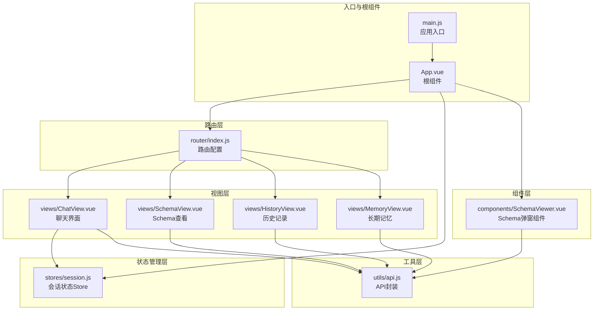
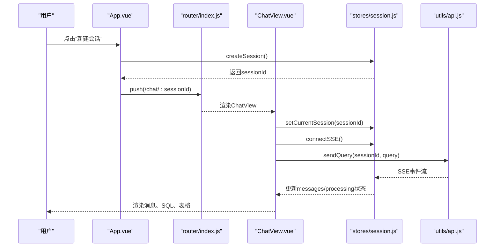
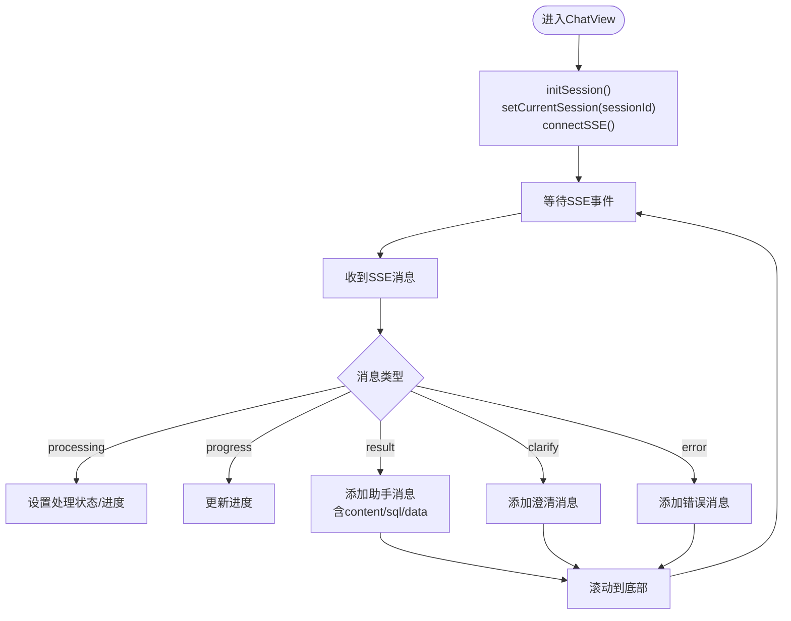
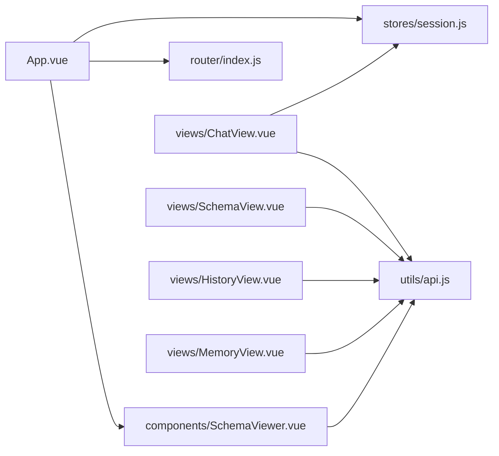

# 核心组件架构

<cite>
**本文档引用的文件**
- [App.vue](file://frontend/src/App.vue)
- [main.js](file://frontend/src/main.js)
- [router/index.js](file://frontend/src/router/index.js)
- [stores/session.js](file://frontend/src/stores/session.js)
- [utils/api.js](file://frontend/src/utils/api.js)
- [views/ChatView.vue](file://frontend/src/views/ChatView.vue)
- [views/SchemaView.vue](file://frontend/src/views/SchemaView.vue)
- [views/HistoryView.vue](file://frontend/src/views/HistoryView.vue)
- [views/MemoryView.vue](file://frontend/src/views/MemoryView.vue)
- [components/SchemaViewer.vue](file://frontend/src/components/SchemaViewer.vue)
</cite>

## 目录
1. [简介](#简介)
2. [项目结构](#项目结构)
3. [核心组件](#核心组件)
4. [架构概览](#架构概览)
5. [详细组件分析](#详细组件分析)
6. [依赖分析](#依赖分析)
7. [性能考虑](#性能考虑)
8. [故障排查指南](#故障排查指南)
9. [结论](#结论)
10. [附录](#附录)

## 简介
本文件面向 NL2SQL 前端核心组件架构，聚焦以下视图组件的设计理念与实现细节：
- ChatView 聊天界面：支持自然语言到 SQL 的实时对话，集成 SSE 流式输出、Markdown 渲染、SQL 代码高亮与复制、数据表格展示。
- SchemaView 数据 Schema 查看：以标签页形式呈现表结构、指标、维度与关系，支持统计信息与刷新。
- HistoryView 查询历史：提供查询历史列表、筛选、分页与详情弹窗，支持复制查询内容。
- MemoryView 长期记忆组件：展示用户偏好与记忆数据，支持类型筛选、删除与原始 JSON 查看。
- SchemaViewer 弹窗式 Schema 查看组件：作为通用弹窗组件，提供搜索、折叠面板与关系展示。

同时，文档深入分析组件间通信模式（props/emits）、事件传递与数据流、生命周期管理、复用策略、插槽与作用域插槽的应用、测试方法、性能优化与用户体验设计原则，以及样式封装、主题定制与响应式布局实现。

## 项目结构
前端采用基于 Vue 3 + Vite 的单页应用架构，使用 Composition API 与 `<script setup>` 语法，配合 Pinia 状态管理、Element Plus UI 组件库与路由系统。

图表来源
- [main.js:1-89](file://frontend/src/main.js#L1-L89)
- [App.vue:1-384](file://frontend/src/App.vue#L1-L384)
- [router/index.js:1-157](file://frontend/src/router/index.js#L1-L157)
- [stores/session.js:1-400](file://frontend/src/stores/session.js#L1-L400)
- [utils/api.js:1-303](file://frontend/src/utils/api.js#L1-L303)
- [views/ChatView.vue:1-778](file://frontend/src/views/ChatView.vue#L1-L778)
- [views/SchemaView.vue:1-322](file://frontend/src/views/SchemaView.vue#L1-L322)
- [views/HistoryView.vue:1-441](file://frontend/src/views/HistoryView.vue#L1-L441)
- [views/MemoryView.vue:1-511](file://frontend/src/views/MemoryView.vue#L1-L511)
- [components/SchemaViewer.vue:1-317](file://frontend/src/components/SchemaViewer.vue#L1-L317)

章节来源
- [main.js:1-89](file://frontend/src/main.js#L1-L89)
- [App.vue:1-384](file://frontend/src/App.vue#L1-L384)
- [router/index.js:1-157](file://frontend/src/router/index.js#L1-L157)

## 核心组件
本节概述四个核心视图组件的功能定位与交互要点：
- ChatView：实时对话、SSE 流式处理、Markdown/SQL 渲染、长消息折叠与展开、复制 SQL。
- SchemaView：Schema 数据的多标签页展示，支持统计信息与刷新。
- HistoryView：查询历史列表、筛选、分页、详情弹窗与复制。
- MemoryView：长期记忆数据的分类展示、删除与原始 JSON 查看。
- SchemaViewer：通用弹窗组件，提供搜索、折叠面板与关系展示。

章节来源
- [views/ChatView.vue:1-778](file://frontend/src/views/ChatView.vue#L1-L778)
- [views/SchemaView.vue:1-322](file://frontend/src/views/SchemaView.vue#L1-L322)
- [views/HistoryView.vue:1-441](file://frontend/src/views/HistoryView.vue#L1-L441)
- [views/MemoryView.vue:1-511](file://frontend/src/views/MemoryView.vue#L1-L511)
- [components/SchemaViewer.vue:1-317](file://frontend/src/components/SchemaViewer.vue#L1-L317)

## 架构概览
NL2SQL 前端采用“根组件 + 路由 + 视图组件 + 状态管理 + 工具层”的分层架构：
- 根组件 App.vue 负责侧边栏、会话列表、Schema 弹窗与页面跳转。
- 路由 router/index.js 定义页面路径与懒加载策略。
- 视图组件通过 Pinia 状态管理 stores/session.js 管理会话、消息与 SSE 连接。
- 工具层 utils/api.js 封装 axios，提供统一的请求/响应拦截与错误处理。
- SchemaViewer 作为可复用弹窗组件，被 ChatView 与 App.vue 调用。

图表来源
- [App.vue:176-186](file://frontend/src/App.vue#L176-L186)
- [router/index.js:50-58](file://frontend/src/router/index.js#L50-L58)
- [views/ChatView.vue:333-345](file://frontend/src/views/ChatView.vue#L333-L345)
- [stores/session.js:118-138](file://frontend/src/stores/session.js#L118-L138)
- [utils/api.js:246-251](file://frontend/src/utils/api.js#L246-L251)

## 详细组件分析

### ChatView 聊天界面
设计理念
- 以“消息驱动”为核心，通过 Pinia 管理 messages/isProcessing 等状态，实现与后端 SSE 的解耦。
- 支持 Markdown 渲染与 SQL 代码高亮，增强可读性；长消息支持折叠/展开。
- 输入区域支持 Enter 发送、Shift+Enter 换行，提升交互效率。

关键实现要点
- 状态管理：使用 computed 从 store 读取 messages、isProcessing、processingStatus、processingProgress，保证响应式更新。
- SSE 集成：connectSSE 建立 EventSource 连接，handleSSEMessage 解析不同事件类型（processing/progress/result/error），并更新 store 状态。
- DOM 操作：scrollToBottom 使用 nextTick 确保滚动到最新消息；长消息通过 Set 记录展开状态。
- 事件与交互：sendMessage/sendQuery 触发后端查询；copySQL 使用 Clipboard API；键盘事件 handleEnter 控制 Enter/Shift+Enter 行为。

图表来源
- [views/ChatView.vue:333-345](file://frontend/src/views/ChatView.vue#L333-L345)
- [stores/session.js:185-221](file://frontend/src/stores/session.js#L185-L221)
- [stores/session.js:227-295](file://frontend/src/stores/session.js#L227-L295)

章节来源
- [views/ChatView.vue:132-383](file://frontend/src/views/ChatView.vue#L132-L383)
- [stores/session.js:33-399](file://frontend/src/stores/session.js#L33-L399)

### SchemaView 数据 Schema 查看
设计理念
- 以标签页组织数据：表结构、指标、维度、表关系，便于用户快速定位所需信息。
- 提供统计信息与刷新按钮，帮助用户了解数据规模与最新状态。

关键实现要点
- 数据加载：onMounted 调用 api.getSchema() 获取 schemaData 并赋值给响应式对象。
- 标签页与表格：使用 Element Plus el-tabs/el-table 展示表字段、指标定义、维度字段与粒度、表关系。
- 响应式布局：使用 CSS Grid 与 Flex 布局，适配不同屏幕尺寸。

章节来源
- [views/SchemaView.vue:148-201](file://frontend/src/views/SchemaView.vue#L148-L201)
- [utils/api.js:118-120](file://frontend/src/utils/api.js#L118-L120)

### HistoryView 查询历史
设计理念
- 以列表为中心的查询历史管理，支持关键词、状态与日期范围筛选，结合分页提升大数据量下的可用性。
- 详情弹窗展示 SQL、状态、执行时间与错误信息，便于问题诊断。

关键实现要点
- 筛选逻辑：computed filteredHistory 基于 query/status/dateRange 进行三路过滤。
- 分页：el-pagination 与分页参数组合，触发 loadHistory 重新拉取数据。
- 交互：viewDetail 打开弹窗；copyQuery 使用 Clipboard API 复制查询内容。

章节来源
- [views/HistoryView.vue:138-298](file://frontend/src/views/HistoryView.vue#L138-L298)
- [utils/api.js:206-208](file://frontend/src/utils/api.js#L206-L208)

### MemoryView 长期记忆组件
设计理念
- 以“用户偏好”为中心的数据管理，支持按类型（字段别名、查询模式、常用指标、常用维度）筛选与删除。
- 提供原始 JSON 查看能力，便于调试与审计。

关键实现要点
- 数据加载：loadMemoryData 通过 axios 获取 /api/preferences/:userId/raw，成功后缓存到 memoryData。
- 类型筛选：selectedType 控制当前展示的表格类型，groupedData 为 computed，从 memoryData.data.grouped 中派生。
- 删除操作：deleteItem 调用 /api/preferences/:id 删除，删除成功后重新加载数据。

章节来源
- [views/MemoryView.vue:191-254](file://frontend/src/views/MemoryView.vue#L191-L254)

### SchemaViewer 弹窗组件
设计理念
- 作为通用弹窗组件，提供 Schema 数据的搜索、折叠面板与关系展示，支持 v-model 双向绑定控制显示状态。
- 首次打开时异步加载数据并默认展开首个表，优化首次体验。

关键实现要点
- Props/Emits：modelValue 接收外部控制；update:modelValue 事件用于同步显示状态。
- 搜索与过滤：searchQuery 支持表名、中文名、描述与字段名的模糊匹配。
- 关系展示：getTableRelations 与 formatRelation 提供表间关系的可视化。

章节来源
- [components/SchemaViewer.vue:89-257](file://frontend/src/components/SchemaViewer.vue#L89-L257)
- [utils/api.js:118-120](file://frontend/src/utils/api.js#L118-L120)

## 依赖分析
组件间依赖关系与耦合度
- App.vue 依赖：useSessionStore、SchemaViewer、路由跳转；负责会话列表、新建/切换/删除会话与 Schema 弹窗。
- ChatView 依赖：useSessionStore、useRoute、api.sendQuery；负责消息渲染、SSE 连接与滚动。
- SchemaView/HistoryView/MemoryView 依赖：api.*；负责数据获取与展示。
- SchemaViewer 依赖：api.getSchema；作为独立弹窗组件，低耦合。

图表来源
- [App.vue:134-138](file://frontend/src/App.vue#L134-L138)
- [views/ChatView.vue:150-152](file://frontend/src/views/ChatView.vue#L150-L152)
- [stores/session.js:33-399](file://frontend/src/stores/session.js#L33-L399)
- [utils/api.js:1-303](file://frontend/src/utils/api.js#L1-L303)

章节来源
- [App.vue:1-384](file://frontend/src/App.vue#L1-L384)
- [views/ChatView.vue:1-778](file://frontend/src/views/ChatView.vue#L1-L778)
- [stores/session.js:1-400](file://frontend/src/stores/session.js#L1-L400)
- [utils/api.js:1-303](file://frontend/src/utils/api.js#L1-L303)

## 性能考虑
- 渲染优化
  - ChatView 使用 computed 读取 store 状态，避免重复渲染；长消息折叠减少 DOM 节点数量。
  - HistoryView 使用 Skeleton 与 Empty 状态占位，分页加载降低初始渲染压力。
- 网络优化
  - api.js 使用 axios 拦截器统一处理错误与超时，减少重复错误处理代码。
  - ChatView 的 SSE 连接按需建立，组件卸载时断开，避免资源泄漏。
- 内存管理
  - ChatView 使用 Set 记录展开状态，避免冗余数据存储。
  - HistoryView 的分页参数与筛选条件使用响应式 ref，避免不必要的计算。
- 交互优化
  - App.vue 侧边栏收起/展开使用过渡动画，提升视觉连贯性。
  - SchemaViewer 首次打开才加载数据，减少首屏负担。

[本节为通用性能建议，无需特定文件来源]

## 故障排查指南
常见问题与处理
- SSE 连接失败
  - 现象：ChatView 无法接收流式消息。
  - 排查：检查 sessionStore.connectSSE() 是否被调用；确认后端 SSE 地址与会话 ID 正确。
  - 参考：[stores/session.js:185-221](file://frontend/src/stores/session.js#L185-L221)
- 查询发送失败
  - 现象：点击发送后无响应或报错。
  - 排查：确认 SSE 已连接；检查 api.sendQuery() 返回；查看 store 中 isProcessing 状态。
  - 参考：[stores/session.js:301-330](file://frontend/src/stores/session.js#L301-L330)
- Schema 加载异常
  - 现象：SchemaView 或 SchemaViewer 显示空状态。
  - 排查：检查 api.getSchema() 返回；确认后端 /api/schema 可访问。
  - 参考：[utils/api.js:118-120](file://frontend/src/utils/api.js#L118-L120)
- 历史记录为空
  - 现象：HistoryView 显示“暂无查询记录”。
  - 排查：确认筛选条件是否过严；检查分页参数与后端 /api/queries/history。
  - 参考：[utils/api.js:206-208](file://frontend/src/utils/api.js#L206-L208)
- 长期记忆删除失败
  - 现象：点击删除无反应或提示失败。
  - 排查：确认 /api/preferences/:id 删除接口可用；检查返回的 success 字段。
  - 参考：[views/MemoryView.vue:230-243](file://frontend/src/views/MemoryView.vue#L230-L243)

章节来源
- [stores/session.js:185-221](file://frontend/src/stores/session.js#L185-L221)
- [stores/session.js:301-330](file://frontend/src/stores/session.js#L301-L330)
- [utils/api.js:118-120](file://frontend/src/utils/api.js#L118-L120)
- [utils/api.js:206-208](file://frontend/src/utils/api.js#L206-L208)
- [views/MemoryView.vue:230-243](file://frontend/src/views/MemoryView.vue#L230-L243)

## 结论
NL2SQL 前端通过清晰的分层架构与组件化设计，实现了从聊天对话到数据 Schema、历史记录与长期记忆的完整功能闭环。ChatView 以 SSE 为核心的数据流驱动，SchemaView/HistoryView/MemoryView 提供多场景的数据展示与管理，SchemaViewer 作为可复用弹窗组件提升交互一致性。配合 Pinia 状态管理与 axios 统一封装，整体具备良好的可维护性与扩展性。

[本节为总结性内容，无需特定文件来源]

## 附录

### 组件生命周期与事件处理
- ChatView
  - onMounted：初始化会话、连接 SSE、滚动到底部。
  - onUnmounted：断开 SSE 连接。
  - watch：监听路由参数变化与 messages/isProcessing，自动滚动。
  - 参考：[views/ChatView.vue:313-382](file://frontend/src/views/ChatView.vue#L313-L382)
- SchemaView
  - onMounted：加载 Schema 数据。
  - 参考：[views/SchemaView.vue:198-200](file://frontend/src/views/SchemaView.vue#L198-L200)
- HistoryView
  - onMounted：加载历史数据。
  - 参考：[views/HistoryView.vue:295-297](file://frontend/src/views/HistoryView.vue#L295-L297)
- MemoryView
  - onMounted：加载记忆数据。
  - 参考：[views/MemoryView.vue:251-253](file://frontend/src/views/MemoryView.vue#L251-L253)
- SchemaViewer
  - watch(visible)：首次打开时加载 Schema。
  - 参考：[components/SchemaViewer.vue:252-256](file://frontend/src/components/SchemaViewer.vue#L252-L256)

### 组件复用策略与插槽应用
- 复用策略
  - SchemaViewer 作为独立弹窗组件，通过 v-model 控制显示，可在多个页面复用。
  - App.vue 作为根组件，集中管理会话列表与导航，避免重复逻辑。
- 插槽与作用域插槽
  - 当前组件未使用作用域插槽；如需扩展，可在 SchemaViewer 中为表格列或折叠项提供具名插槽，以支持自定义渲染。

### 样式封装、主题定制与响应式布局
- 样式封装
  - 各组件使用 scoped 样式，避免样式污染；Markdown 样式通过 :deep 选择器覆盖 Element Plus 组件内部样式。
- 主题定制
  - 通过 Element Plus 全局安装与图标注册，统一 UI 风格；可引入主题变量文件进行定制。
- 响应式布局
  - 使用 CSS Grid/Flex 布局适配不同屏幕尺寸；侧边栏支持收起/展开；表格与弹窗内容区域设置最大高度与滚动条。

章节来源
- [views/ChatView.vue:385-777](file://frontend/src/views/ChatView.vue#L385-L777)
- [views/SchemaView.vue:203-321](file://frontend/src/views/SchemaView.vue#L203-L321)
- [views/HistoryView.vue:300-440](file://frontend/src/views/HistoryView.vue#L300-L440)
- [views/MemoryView.vue:256-510](file://frontend/src/views/MemoryView.vue#L256-L510)
- [components/SchemaViewer.vue:259-316](file://frontend/src/components/SchemaViewer.vue#L259-L316)