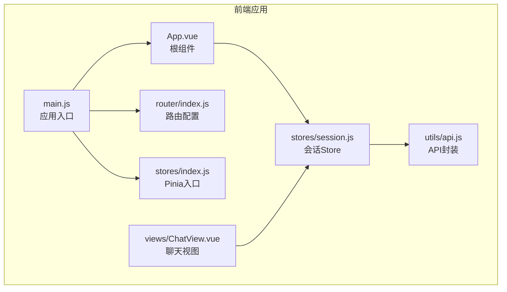
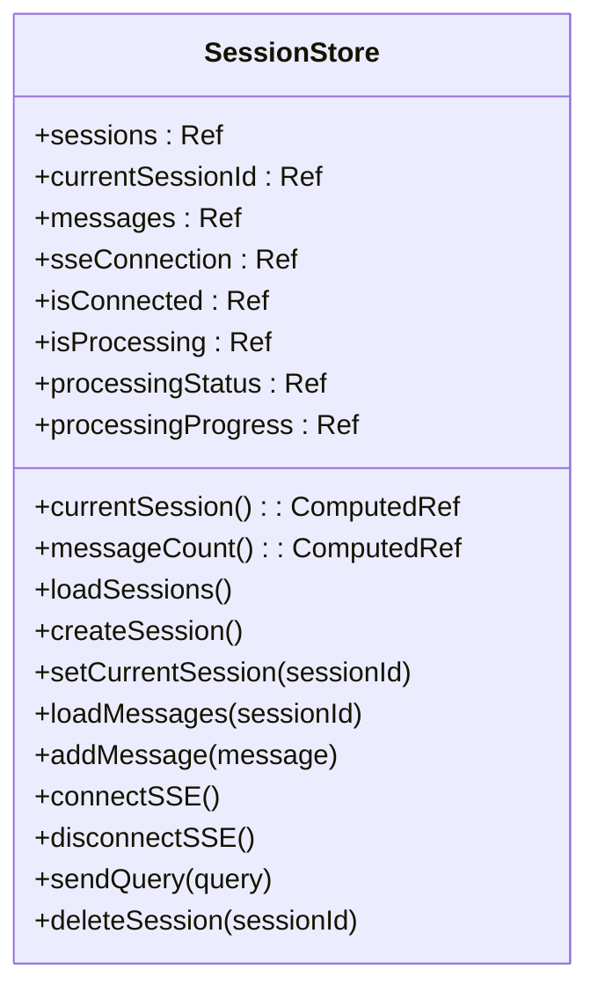
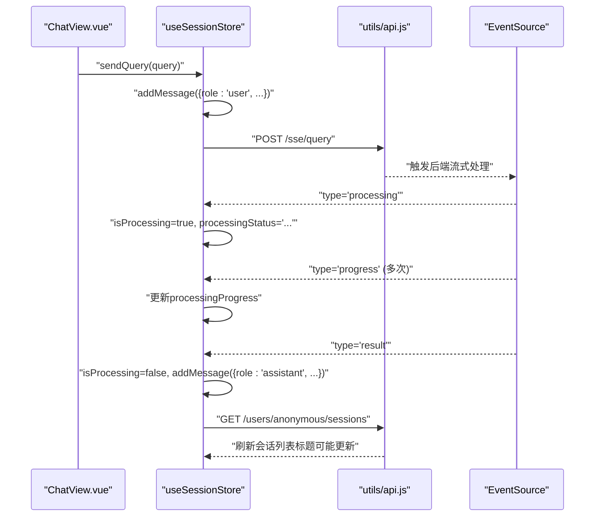
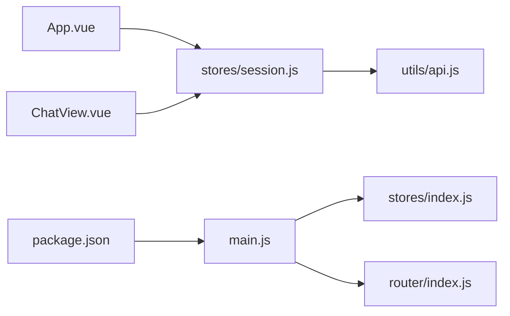

# 状态管理系统

<cite>
**本文档引用的文件**
- [frontend/src/stores/index.js](file://frontend/src/stores/index.js)
- [frontend/src/stores/session.js](file://frontend/src/stores/session.js)
- [frontend/src/main.js](file://frontend/src/main.js)
- [frontend/src/utils/api.js](file://frontend/src/utils/api.js)
- [frontend/src/views/ChatView.vue](file://frontend/src/views/ChatView.vue)
- [frontend/src/App.vue](file://frontend/src/App.vue)
- [frontend/src/router/index.js](file://frontend/src/router/index.js)
- [frontend/package.json](file://frontend/package.json)
</cite>

## 目录
1. [简介](#简介)
2. [项目结构](#项目结构)
3. [核心组件](#核心组件)
4. [架构总览](#架构总览)
5. [详细组件分析](#详细组件分析)
6. [依赖关系分析](#依赖关系分析)
7. [性能考虑](#性能考虑)
8. [故障排查指南](#故障排查指南)
9. [结论](#结论)
10. [附录](#附录)

## 简介
本文件面向 NL2SQL 前端的状态管理系统，围绕 Pinia 状态管理的设计理念与实现方式进行系统性说明。重点覆盖：
- Store 的创建、状态定义与方法实现
- 会话状态管理（session store）的会话创建、切换、删除与持久化机制
- 状态响应式更新、计算属性使用与状态订阅模式
- 状态模块化设计、命名空间管理与跨组件状态共享
- 状态调试技巧、性能优化策略与最佳实践
- 状态备份恢复、版本兼容性与数据迁移方案

## 项目结构
前端采用模块化的组织方式，状态管理位于 stores 目录，会话状态由 session store 独立维护；API 通信封装在 utils/api.js 中；视图层通过 Composition API 与状态管理交互；路由配置在 router/index.js 中定义。



图表来源
- [frontend/src/main.js:1-89](file://frontend/src/main.js#L1-L89)
- [frontend/src/App.vue:1-384](file://frontend/src/App.vue#L1-L384)
- [frontend/src/router/index.js:1-157](file://frontend/src/router/index.js#L1-L157)
- [frontend/src/stores/index.js:1-30](file://frontend/src/stores/index.js#L1-L30)
- [frontend/src/stores/session.js:1-400](file://frontend/src/stores/session.js#L1-L400)
- [frontend/src/utils/api.js:1-303](file://frontend/src/utils/api.js#L1-L303)
- [frontend/src/views/ChatView.vue:1-778](file://frontend/src/views/ChatView.vue#L1-L778)

章节来源
- [frontend/src/main.js:1-89](file://frontend/src/main.js#L1-L89)
- [frontend/src/stores/index.js:1-30](file://frontend/src/stores/index.js#L1-L30)
- [frontend/src/stores/session.js:1-400](file://frontend/src/stores/session.js#L1-L400)
- [frontend/src/utils/api.js:1-303](file://frontend/src/utils/api.js#L1-L303)
- [frontend/src/views/ChatView.vue:1-778](file://frontend/src/views/ChatView.vue#L1-L778)
- [frontend/src/App.vue:1-384](file://frontend/src/App.vue#L1-L384)
- [frontend/src/router/index.js:1-157](file://frontend/src/router/index.js#L1-L157)

## 核心组件
- Pinia 入口：在 stores/index.js 中创建并导出 Pinia 实例，供 main.js 安装。
- 会话 Store：在 stores/session.js 中定义 useSessionStore，集中管理会话列表、当前会话、消息历史、SSE 连接与处理状态。
- API 封装：在 utils/api.js 中封装 axios 实例与各接口方法，统一请求/响应拦截与错误处理。
- 视图组件：App.vue 与 ChatView.vue 通过 Composition API 订阅与操作会话状态，实现跨组件共享。

章节来源
- [frontend/src/stores/index.js:1-30](file://frontend/src/stores/index.js#L1-L30)
- [frontend/src/stores/session.js:1-400](file://frontend/src/stores/session.js#L1-L400)
- [frontend/src/utils/api.js:1-303](file://frontend/src/utils/api.js#L1-L303)
- [frontend/src/views/ChatView.vue:1-778](file://frontend/src/views/ChatView.vue#L1-L778)
- [frontend/src/App.vue:1-384](file://frontend/src/App.vue#L1-L384)

## 架构总览
Pinia 作为状态管理核心，session store 提供会话生命周期管理与实时流式交互能力。API 封装负责与后端通信，视图层通过响应式绑定与计算属性实现状态驱动的 UI 更新。

```mermaid
sequenceDiagram
participant UI as "视图组件<br/>App.vue/ChatView.vue"
participant Store as "useSessionStore"
participant API as "API封装<br/>utils/api.js"
participant Backend as "后端服务"
UI->>Store : "调用动作如创建/切换/发送查询"
Store->>API : "发起HTTP请求"
API->>Backend : "REST API请求"
Backend-->>API : "响应数据"
API-->>Store : "返回数据"
Store-->>UI : "更新状态响应式"
Note over Store,UI : "视图通过计算属性订阅状态并自动刷新"
```

图表来源
- [frontend/src/stores/session.js:100-138](file://frontend/src/stores/session.js#L100-L138)
- [frontend/src/utils/api.js:150-195](file://frontend/src/utils/api.js#L150-L195)
- [frontend/src/views/ChatView.vue:196-214](file://frontend/src/views/ChatView.vue#L196-L214)
- [frontend/src/App.vue:176-200](file://frontend/src/App.vue#L176-L200)

## 详细组件分析

### Pinia 入口与安装
- stores/index.js 创建 Pinia 实例并导出，main.js 在应用启动时安装该实例，使全局可用。
- 该设计遵循 Pinia 的推荐模式：单一实例、集中安装。

章节来源
- [frontend/src/stores/index.js:1-30](file://frontend/src/stores/index.js#L1-L30)
- [frontend/src/main.js:62-66](file://frontend/src/main.js#L62-L66)

### 会话 Store 设计与实现
- Store ID：使用字符串标识，便于调试与 DevTools 辨识。
- 状态定义：包含会话列表、当前会话 ID、消息列表、SSE 连接、连接状态、处理状态与进度等。
- 计算属性：currentSession、messageCount 基于响应式状态派生，避免重复计算与手动同步。
- 动作方法：
  - 会话管理：loadSessions、createSession、setCurrentSession、loadMessages、deleteSession
  - SSE 流：connectSSE、disconnectSSE、sendQuery、handleSSEMessage
  - 消息管理：addMessage
- 返回值：显式返回所有公开的 state/getters/actions，便于在组件中解构使用。



图表来源
- [frontend/src/stores/session.js:33-399](file://frontend/src/stores/session.js#L33-L399)

章节来源
- [frontend/src/stores/session.js:1-400](file://frontend/src/stores/session.js#L1-L400)

### 会话状态管理流程
- 会话创建：调用 API 创建新会话，更新本地列表并设为当前会话，清空消息列表。
- 会话切换：更新 currentSessionId 并加载对应会话的消息历史。
- 消息管理：用户消息即时加入，SSE 推送结果后追加助手消息。
- SSE 流：建立连接后监听多种消息类型（连接、处理、进度、结果、澄清、错误），并根据类型更新处理状态与消息列表。
- 删除会话：调用 API 删除后，从本地列表移除；若删除的是当前会话，则清空当前会话与消息并断开连接。



图表来源
- [frontend/src/stores/session.js:297-330](file://frontend/src/stores/session.js#L297-L330)
- [frontend/src/stores/session.js:227-295](file://frontend/src/stores/session.js#L227-L295)
- [frontend/src/utils/api.js:246-251](file://frontend/src/utils/api.js#L246-L251)
- [frontend/src/views/ChatView.vue:196-214](file://frontend/src/views/ChatView.vue#L196-L214)

章节来源
- [frontend/src/stores/session.js:100-171](file://frontend/src/stores/session.js#L100-L171)
- [frontend/src/stores/session.js:182-370](file://frontend/src/stores/session.js#L182-L370)
- [frontend/src/utils/api.js:150-195](file://frontend/src/utils/api.js#L150-L195)
- [frontend/src/views/ChatView.vue:196-214](file://frontend/src/views/ChatView.vue#L196-L214)

### API 封装与错误处理
- axios 实例：配置 base URL、超时与请求头。
- 请求拦截器：可扩展认证 token 注入。
- 响应拦截器：统一封装错误处理，区分服务端错误、网络错误与请求配置错误。
- 会话相关 API：提供获取会话列表、创建会话、获取/删除会话、获取消息、发送查询等方法。

章节来源
- [frontend/src/utils/api.js:25-88](file://frontend/src/utils/api.js#L25-L88)
- [frontend/src/utils/api.js:147-195](file://frontend/src/utils/api.js#L147-L195)
- [frontend/src/utils/api.js:238-251](file://frontend/src/utils/api.js#L238-L251)

### 视图层与状态订阅
- App.vue：侧边栏展示会话列表，支持新建、切换与删除会话；挂载时加载会话列表。
- ChatView.vue：聊天界面订阅 messages、isProcessing、processingStatus、processingProgress 等状态，自动滚动至底部，处理键盘事件与内容渲染。
- 订阅模式：通过 computed 从 store 获取响应式数据，组件自动响应状态变化。

章节来源
- [frontend/src/App.vue:134-240](file://frontend/src/App.vue#L134-L240)
- [frontend/src/views/ChatView.vue:172-383](file://frontend/src/views/ChatView.vue#L172-L383)

### 路由与会话联动
- 路由配置：/chat/:sessionId 支持带参路由，meta 标记 requiresSession。
- 生命周期：ChatView 在挂载时根据路由参数初始化会话并连接 SSE；组件卸载时断开连接。
- 监听器：监听路由参数变化，切换会话时重新初始化并断开旧连接。

章节来源
- [frontend/src/router/index.js:34-109](file://frontend/src/router/index.js#L34-L109)
- [frontend/src/views/ChatView.vue:313-361](file://frontend/src/views/ChatView.vue#L313-L361)

## 依赖关系分析
- main.js 依赖 stores/index.js 与 router/index.js，安装 Pinia 插件并挂载应用。
- App.vue 与 ChatView.vue 依赖 useSessionStore，实现会话管理与消息展示。
- useSessionStore 依赖 utils/api.js 提供的 REST API。
- package.json 明确 Pinia 与 Vue 版本约束，保证生态兼容性。



图表来源
- [frontend/src/main.js:1-89](file://frontend/src/main.js#L1-L89)
- [frontend/src/stores/index.js:1-30](file://frontend/src/stores/index.js#L1-L30)
- [frontend/src/stores/session.js:1-400](file://frontend/src/stores/session.js#L1-L400)
- [frontend/src/utils/api.js:1-303](file://frontend/src/utils/api.js#L1-L303)
- [frontend/src/views/ChatView.vue:1-778](file://frontend/src/views/ChatView.vue#L1-L778)
- [frontend/src/App.vue:1-384](file://frontend/src/App.vue#L1-L384)
- [frontend/src/router/index.js:1-157](file://frontend/src/router/index.js#L1-L157)
- [frontend/package.json:1-36](file://frontend/package.json#L1-L36)

章节来源
- [frontend/src/main.js:1-89](file://frontend/src/main.js#L1-L89)
- [frontend/package.json:11-28](file://frontend/package.json#L11-L28)

## 性能考虑
- 响应式粒度：仅暴露必要的 state/getters/actions，减少不必要的响应式依赖。
- 计算属性：使用 computed 缓存派生数据，避免重复计算。
- 监听器：watch 仅监听必要状态，如消息列表与处理状态，避免深度监听大对象导致的性能问题。
- SSE 连接：在组件卸载时断开连接，防止内存泄漏与后台资源占用。
- 消息渲染：长内容支持折叠与懒渲染，降低 DOM 渲染压力。
- 路由切换：切换会话时先断开旧连接再建立新连接，避免并发冲突。

[本节为通用性能建议，无需特定文件引用]

## 故障排查指南
- SSE 连接失败
  - 症状：isConnected 为 false 或 onerror 触发
  - 排查：检查后端 SSE 端点、会话 ID 是否有效、网络连通性
  - 处理：调用 disconnectSSE 后重新 connectSSE
- 查询发送失败
  - 症状：sendQuery 抛错或返回错误消息
  - 排查：确认 SSE 已连接、后端服务可用、请求体格式正确
  - 处理：捕获异常并提示用户重试
- 会话列表为空
  - 症状：loadSessions 返回空数组
  - 排查：确认 API 调用成功、用户身份与权限
  - 处理：重试加载或引导用户创建新会话
- 路由切换异常
  - 症状：切换会话后消息未更新或连接未建立
  - 排查：检查路由参数变化监听、setCurrentSession 与 connectSSE 的调用顺序
  - 处理：确保在路由参数变化时先断开旧连接再初始化新会话

章节来源
- [frontend/src/stores/session.js:182-221](file://frontend/src/stores/session.js#L182-L221)
- [frontend/src/stores/session.js:297-330](file://frontend/src/stores/session.js#L297-L330)
- [frontend/src/views/ChatView.vue:313-361](file://frontend/src/views/ChatView.vue#L313-L361)

## 结论
NL2SQL 前端采用 Pinia 实现模块化、可维护的状态管理，session store 将会话生命周期、消息历史与 SSE 流整合在一个 Store 中，配合 API 封装与视图层响应式订阅，实现了高效、直观的会话交互体验。通过合理的计算属性、监听器与连接管理，系统在易用性与性能之间取得平衡。后续可在持久化、版本兼容与迁移方面进一步完善。

[本节为总结性内容，无需特定文件引用]

## 附录

### 状态调试技巧
- 使用浏览器 DevTools 的 Vue DevTools 查看 Pinia Store 的 state/getters/actions 变化。
- 在 actions 中添加日志输出，定位异步流程中的问题。
- 通过 computed 与 watch 的组合验证状态依赖链路。

[本节为通用调试建议，无需特定文件引用]

### 最佳实践指南
- 将业务域相关的状态收敛到独立的 Store，避免全局污染。
- 使用 computed 管理派生状态，减少重复计算。
- 在组件卸载时清理副作用（如断开 SSE 连接）。
- 对外暴露最小 API，内部通过 actions 组织复杂流程。

[本节为通用最佳实践，无需特定文件引用]

### 状态持久化与迁移方案
- 会话列表与消息：可结合浏览器存储（如 IndexedDB 或 LocalStorage）实现轻量持久化，注意敏感数据保护。
- 版本兼容：为 Store 的 state 结构引入版本字段，迁移时按版本映射更新结构。
- 数据迁移：提供迁移脚本，读取旧格式数据并转换为新格式，迁移完成后清理旧数据。

[本节为概念性方案，无需特定文件引用]