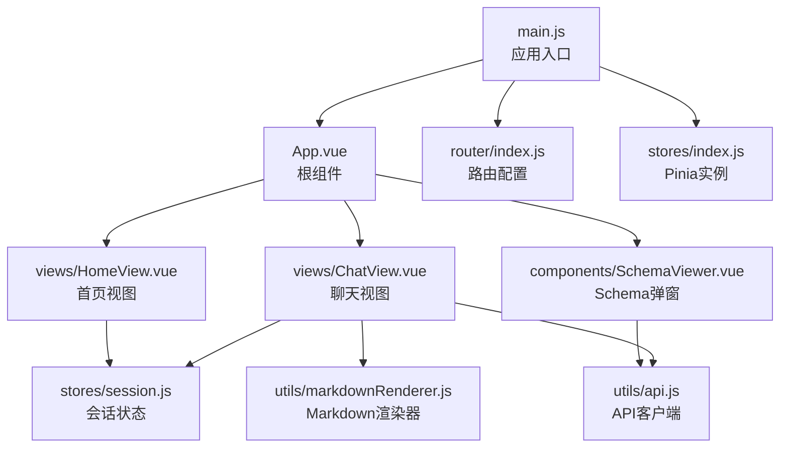
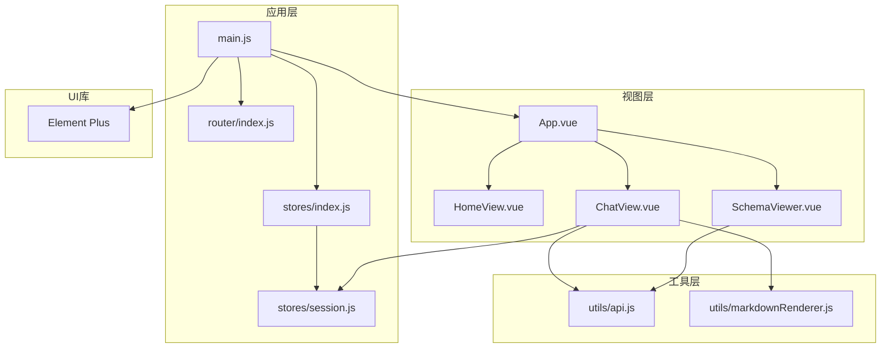
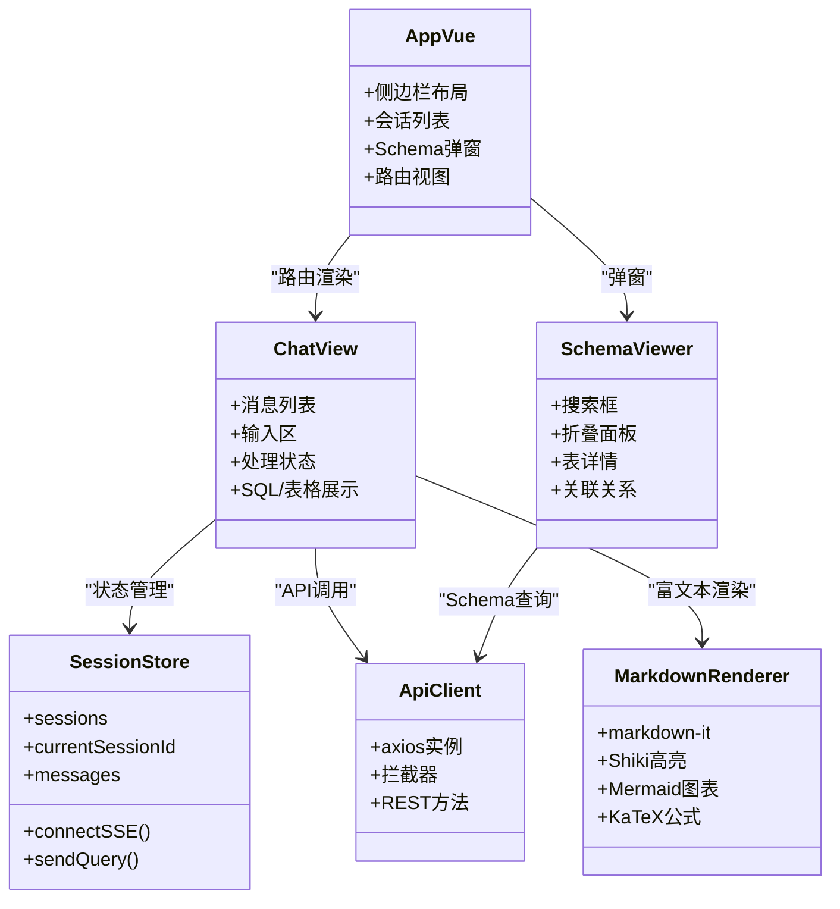
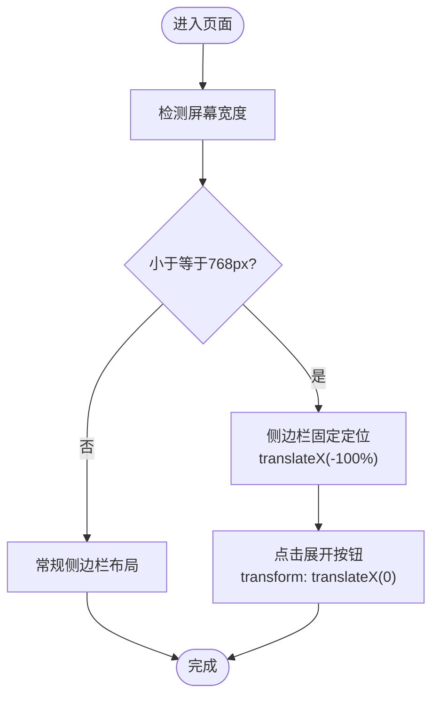
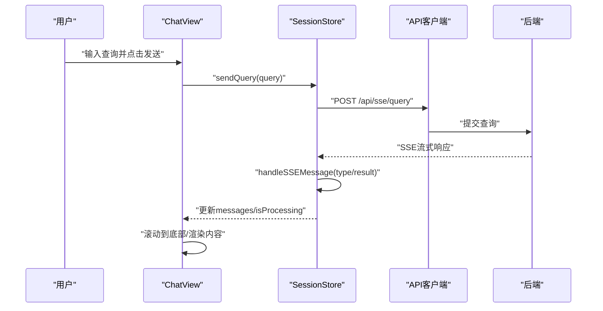
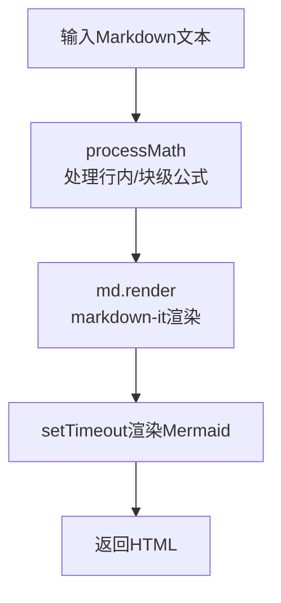
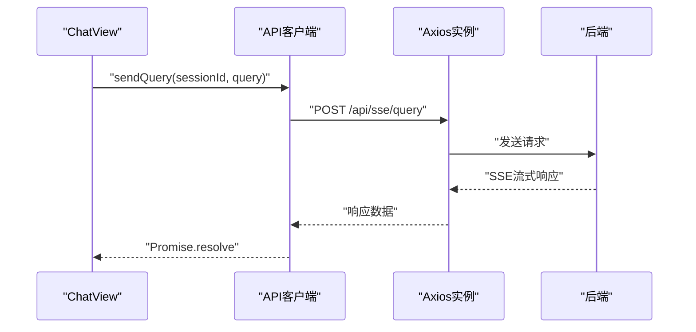
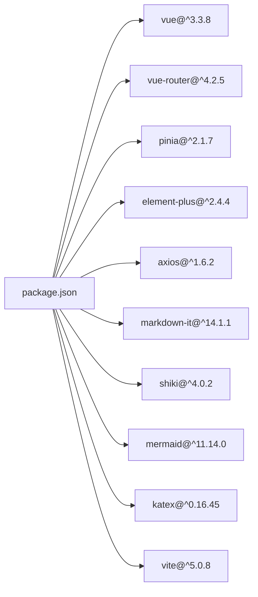

# 用户界面与交互

<cite>
**本文引用的文件**
- [main.js](file://frontend/src/main.js)
- [App.vue](file://frontend/src/App.vue)
- [vite.config.js](file://frontend/vite.config.js)
- [package.json](file://frontend/package.json)
- [global.css](file://frontend/src/styles/global.css)
- [router/index.js](file://frontend/src/router/index.js)
- [stores/index.js](file://frontend/src/stores/index.js)
- [stores/session.js](file://frontend/src/stores/session.js)
- [utils/api.js](file://frontend/src/utils/api.js)
- [utils/markdownRenderer.js](file://frontend/src/utils/markdownRenderer.js)
- [views/ChatView.vue](file://frontend/src/views/ChatView.vue)
- [views/HomeView.vue](file://frontend/src/views/HomeView.vue)
- [components/SchemaViewer.vue](file://frontend/src/components/SchemaViewer.vue)
</cite>

## 目录
1. [简介](#简介)
2. [项目结构](#项目结构)
3. [核心组件](#核心组件)
4. [架构总览](#架构总览)
5. [详细组件分析](#详细组件分析)
6. [依赖分析](#依赖分析)
7. [性能考虑](#性能考虑)
8. [故障排查指南](#故障排查指南)
9. [结论](#结论)
10. [附录](#附录)

## 简介
本文件面向 NL2SQL 前端用户界面与交互，围绕 Vue 3 + Element Plus 技术栈，系统梳理界面组件库使用、自定义主题与样式、响应式与移动端适配、跨浏览器兼容、用户交互与事件处理、动画效果、Markdown 渲染器集成、API 客户端设计与请求响应处理、用户体验优化、无障碍支持、性能监控以及界面测试与视觉规范等内容。文档同时提供多处架构与流程图示，帮助读者快速把握系统全貌与关键实现。

## 项目结构
前端采用 Vite + Vue 3 单页应用架构，核心目录组织如下：
- 入口与根组件：main.js、App.vue
- 路由与状态：router/index.js、stores/index.js、stores/session.js
- 视图与组件：views/*、components/*
- 工具与样式：utils/*、styles/global.css
- 构建配置：vite.config.js、package.json

**图表来源**
- [main.js:1-89](file://frontend/src/main.js#L1-L89)
- [App.vue:1-384](file://frontend/src/App.vue#L1-L384)
- [router/index.js:1-157](file://frontend/src/router/index.js#L1-L157)
- [stores/index.js:1-30](file://frontend/src/stores/index.js#L1-L30)
- [stores/session.js:1-400](file://frontend/src/stores/session.js#L1-L400)
- [views/ChatView.vue:1-778](file://frontend/src/views/ChatView.vue#L1-L778)
- [views/HomeView.vue:1-318](file://frontend/src/views/HomeView.vue#L1-L318)
- [components/SchemaViewer.vue:1-317](file://frontend/src/components/SchemaViewer.vue#L1-L317)
- [utils/api.js:1-303](file://frontend/src/utils/api.js#L1-L303)
- [utils/markdownRenderer.js:1-258](file://frontend/src/utils/markdownRenderer.js#L1-L258)

**章节来源**
- [main.js:1-89](file://frontend/src/main.js#L1-L89)
- [vite.config.js:1-93](file://frontend/vite.config.js#L1-L93)
- [package.json:1-36](file://frontend/package.json#L1-L36)

## 核心组件
- 应用入口与插件安装：创建 Vue 应用、安装路由、Pinia、Element Plus，并注册全局图标组件。
- 根组件布局：侧边栏（会话列表、历史会话、底部工具）、主内容区（router-view）与 Schema 查看弹窗。
- 路由系统：History 模式、滚动行为、全局前置守卫设置页面标题。
- 状态管理：Pinia Store 管理会话列表、当前会话、消息、SSE 连接与处理状态。
- API 客户端：Axios 实例封装、请求/响应拦截、统一错误处理、REST API 方法。
- Markdown 渲染器：markdown-it + Shiki + Mermaid + KaTeX，支持代码高亮、Mermaid 图表与数学公式。
- 视图组件：首页（快速开始、功能特性、示例）、聊天视图（消息列表、输入区、处理状态、SQL/表格展示）、Schema 查看弹窗（搜索、折叠、表详情、关联关系）。

**章节来源**
- [main.js:37-80](file://frontend/src/main.js#L37-L80)
- [App.vue:11-82](file://frontend/src/App.vue#L11-L82)
- [router/index.js:118-150](file://frontend/src/router/index.js#L118-L150)
- [stores/session.js:33-399](file://frontend/src/stores/session.js#L33-L399)
- [utils/api.js:25-88](file://frontend/src/utils/api.js#L25-L88)
- [utils/markdownRenderer.js:74-196](file://frontend/src/utils/markdownRenderer.js#L74-L196)
- [views/ChatView.vue:6-129](file://frontend/src/views/ChatView.vue#L6-L129)
- [components/SchemaViewer.vue:6-86](file://frontend/src/components/SchemaViewer.vue#L6-L86)

## 架构总览
前端采用“入口 -> 根组件 -> 视图/组件 -> 工具/状态”的分层架构。Element Plus 作为 UI 基础库，配合自定义样式与动画；路由驱动页面切换；Pinia 管理会话与消息状态；API 客户端负责与后端交互；Markdown 渲染器负责富文本与代码高亮展示；SSE 用于实时流式响应。

**图表来源**
- [main.js:14-88](file://frontend/src/main.js#L14-L88)
- [router/index.js:15-157](file://frontend/src/router/index.js#L15-L157)
- [stores/index.js:13-29](file://frontend/src/stores/index.js#L13-L29)
- [stores/session.js:33-399](file://frontend/src/stores/session.js#L33-L399)
- [views/ChatView.vue:132-383](file://frontend/src/views/ChatView.vue#L132-L383)
- [views/HomeView.vue:95-188](file://frontend/src/views/HomeView.vue#L95-L188)
- [components/SchemaViewer.vue:89-257](file://frontend/src/components/SchemaViewer.vue#L89-L257)
- [utils/api.js:14-303](file://frontend/src/utils/api.js#L14-L303)
- [utils/markdownRenderer.js:15-258](file://frontend/src/utils/markdownRenderer.js#L15-L258)

## 详细组件分析

### Element Plus 组件库与自定义主题
- 全局安装与图标注册：在入口文件中安装 Element Plus 并批量注册图标组件，便于在任意组件中直接使用。
- 样式与主题：
  - 全局 CSS 定义基础重置、通用工具类、消息气泡、代码块、SQL 高亮、动画与响应式布局。
  - Vite 配置中通过 SCSS 预处理器自动导入 Element Plus 变量，便于覆盖主题变量。
- 组件使用场景：
  - 按钮、输入框、对话框、骨架屏、空状态、折叠面板、表格、标签、消息提示、确认框等广泛应用于各视图与组件。

**图表来源**
- [App.vue:11-82](file://frontend/src/App.vue#L11-L82)
- [views/ChatView.vue:6-129](file://frontend/src/views/ChatView.vue#L6-L129)
- [components/SchemaViewer.vue:6-86](file://frontend/src/components/SchemaViewer.vue#L6-L86)
- [stores/session.js:33-399](file://frontend/src/stores/session.js#L33-L399)
- [utils/api.js:25-303](file://frontend/src/utils/api.js#L25-L303)
- [utils/markdownRenderer.js:74-258](file://frontend/src/utils/markdownRenderer.js#L74-L258)

**章节来源**
- [main.js:37-80](file://frontend/src/main.js#L37-L80)
- [global.css:10-317](file://frontend/src/styles/global.css#L10-L317)
- [vite.config.js:60-69](file://frontend/vite.config.js#L60-L69)

### 响应式设计、移动端适配与跨浏览器兼容
- 响应式与移动端：
  - 全局 CSS 提供媒体查询，侧边栏在小屏设备下以固定定位滑出，支持打开/关闭状态。
  - 聊天视图输入区绝对定位在底部，避免内容溢出。
- 跨浏览器兼容：
  - 使用标准 CSS 与 Web API（如 Clipboard API），并为滚动条提供 WebKit 特定样式。
  - Element Plus 与 Vue 3 生态在主流现代浏览器中具备良好兼容性。

**图表来源**
- [global.css:304-316](file://frontend/src/styles/global.css#L304-L316)

**章节来源**
- [global.css:304-316](file://frontend/src/styles/global.css#L304-L316)

### 用户交互模式、事件处理与动画效果
- 交互模式：
  - 侧边栏切换、会话创建/切换/删除、Schema 查看弹窗、聊天输入与发送、长文本折叠/展开、复制 SQL。
- 事件处理：
  - Enter 发送、Shift+Enter 换行；按键监听与防抖；SSE 连接与消息处理；路由参数变化监听。
- 动画效果：
  - 淡入、滑入、旋转加载、打字动画点、进度条渐变。

**图表来源**
- [views/ChatView.vue:196-214](file://frontend/src/views/ChatView.vue#L196-L214)
- [stores/session.js:297-330](file://frontend/src/stores/session.js#L297-L330)
- [utils/api.js:246-251](file://frontend/src/utils/api.js#L246-L251)

**章节来源**
- [views/ChatView.vue:220-229](file://frontend/src/views/ChatView.vue#L220-L229)
- [views/ChatView.vue:297-304](file://frontend/src/views/ChatView.vue#L297-L304)
- [stores/session.js:182-221](file://frontend/src/stores/session.js#L182-L221)

### Markdown 渲染器集成与富文本显示
- 集成能力：
  - markdown-it 解析 Markdown；Shiki 代码高亮；Mermaid 流程图/序列图/甘特图；KaTeX 数学公式。
- 渲染流程：
  - 先处理行内/块级数学公式，再调用 markdown-it 渲染；异步初始化 Shiki；延迟渲染 Mermaid 图表。
- 代码高亮：
  - SQL 专用高亮与通用高亮；降级回简单背景色与等宽字体。

**图表来源**
- [utils/markdownRenderer.js:181-196](file://frontend/src/utils/markdownRenderer.js#L181-L196)

**章节来源**
- [utils/markdownRenderer.js:74-196](file://frontend/src/utils/markdownRenderer.js#L74-L196)

### API 客户端设计与请求响应处理
- Axios 实例：
  - 基础 URL、超时、Content-Type；请求/响应拦截器统一处理认证与错误。
- API 方法：
  - Schema、会话、查询历史、统计、评估等 REST 接口封装；SSE 查询通过 HTTP POST 触发。
- 错误处理：
  - 分类处理 4xx/5xx、网络错误、请求配置错误，统一返回结构化错误对象。

**图表来源**
- [utils/api.js:246-251](file://frontend/src/utils/api.js#L246-L251)
- [views/ChatView.vue:207-207](file://frontend/src/views/ChatView.vue#L207-L207)

**章节来源**
- [utils/api.js:25-88](file://frontend/src/utils/api.js#L25-L88)
- [utils/api.js:151-195](file://frontend/src/utils/api.js#L151-L195)

### 用户体验优化策略
- 自动滚动：消息新增与处理完成时自动滚动到底部。
- 长文本折叠：超过阈值的内容支持折叠/展开，减少 DOM 体积。
- 处理状态反馈：进度条、旋转图标、打字动画、状态文本。
- 交互提示：Element Plus 消息与确认框统一错误与提示。
- Schema 搜索：输入即搜，提升 Schema 查看效率。

**章节来源**
- [views/ChatView.vue:297-304](file://frontend/src/views/ChatView.vue#L297-L304)
- [views/ChatView.vue:236-259](file://frontend/src/views/ChatView.vue#L236-L259)
- [components/SchemaViewer.vue:157-182](file://frontend/src/components/SchemaViewer.vue#L157-L182)

### 无障碍访问支持
- 语义化标签：使用 h1/h2/h3 等标题层级与列表结构。
- 键盘可达：输入框支持 Enter 发送、Shift+Enter 换行。
- 状态提示：加载骨架屏、空状态描述、进度条与图标说明。
- 颜色对比：基于 Element Plus 主题变量，确保文本与背景对比度满足可读性要求。

**章节来源**
- [views/ChatView.vue:106-124](file://frontend/src/views/ChatView.vue#L106-L124)
- [components/SchemaViewer.vue:25-29](file://frontend/src/components/SchemaViewer.vue#L25-L29)

### 性能监控方案
- 代码分割：Vite Rollup 配置将 Element Plus、ECharts、Vue 生态库独立打包，提升缓存命中率。
- 懒加载：部分视图组件按需加载，减少首屏体积。
- 渲染优化：长消息折叠、虚拟滚动（可扩展）、延迟渲染 Mermaid。
- 网络优化：Axios 超时设置、SSE 连接复用、错误快速失败。

**章节来源**
- [vite.config.js:72-91](file://frontend/vite.config.js#L72-L91)
- [router/index.js:63-69](file://frontend/src/router/index.js#L63-L69)
- [utils/api.js:29-34](file://frontend/src/utils/api.js#L29-L34)

### 界面测试方法
- 单元测试：针对工具函数（API 客户端、Markdown 渲染器）编写单元测试，验证错误处理与渲染结果。
- 组件测试：使用 Vue Test Utils 或 Vitest 测试视图与组件交互逻辑（如消息发送、SSE 状态变更）。
- 端到端测试：Cypress 或 Playwright 编写 E2E 场景，覆盖路由切换、Schema 搜索、聊天输入与结果展示。
- 可访问性测试：axe-core 或 Lighthouse 检查 WCAG 合规性。

[本节为通用实践指导，不直接分析具体文件]

### 视觉设计规范与品牌一致性
- 设计语言：遵循 Element Plus 设计体系，使用统一的主色、辅助色与组件风格。
- 品牌标识：Logo 与图标统一使用 Element Plus 图标库，保持一致性。
- 动效规范：淡入、滑入、旋转加载等动效统一时长与缓动曲线。
- 响应式规范：移动端优先，侧边栏抽屉式交互，输入区始终可见。

**章节来源**
- [App.vue:13-69](file://frontend/src/App.vue#L13-L69)
- [global.css:185-296](file://frontend/src/styles/global.css#L185-L296)

## 依赖分析
- 运行时依赖：Vue 3、Vue Router、Pinia、Element Plus、Axios、markdown-it、Shiki、Mermaid、KaTeX 等。
- 构建依赖：Vite、@vitejs/plugin-vue、Sass。
- 代理与别名：开发服务器代理 /api 到后端，路径别名简化导入。

**图表来源**
- [package.json:11-28](file://frontend/package.json#L11-L28)

**章节来源**
- [package.json:11-36](file://frontend/package.json#L11-L36)
- [vite.config.js:18-51](file://frontend/vite.config.js#L18-L51)

## 性能考虑
- 首屏优化：懒加载视图、Element Plus 与第三方库独立打包。
- 渲染优化：长消息折叠、延迟渲染 Mermaid、骨架屏占位。
- 网络优化：SSE 连接复用、Axios 超时、错误快速反馈。
- 缓存策略：静态资源版本化、浏览器缓存控制。

[本节为通用性能建议，不直接分析具体文件]

## 故障排查指南
- API 错误处理：检查响应拦截器返回的错误对象，区分服务端错误、网络错误与请求配置错误。
- SSE 连接：确认后端 SSE 端点可用、会话 ID 正确、EventSource 状态。
- Markdown 渲染：检查 Shiki 初始化与语言支持，Mermaid 图表渲染异常时查看控制台错误。
- 路由与状态：确认路由守卫设置标题、Pinia Store 状态同步与消息列表更新。

**章节来源**
- [utils/api.js:67-88](file://frontend/src/utils/api.js#L67-L88)
- [stores/session.js:182-221](file://frontend/src/stores/session.js#L182-L221)
- [utils/markdownRenderer.js:160-170](file://frontend/src/utils/markdownRenderer.js#L160-L170)

## 结论
NL2SQL 前端以 Vue 3 + Element Plus 为核心，结合 Pinia 状态管理、Axios API 客户端与丰富的富文本渲染能力，构建了清晰的用户界面与流畅的交互体验。通过响应式布局、动画与可访问性设计，以及完善的错误处理与性能优化策略，系统在易用性、稳定性与可维护性方面均表现良好。后续可在测试自动化、A/B 实验与性能监控方面进一步完善。

## 附录
- 开发与构建命令：dev、build、preview。
- 开发服务器：端口 5173，自动打开浏览器，/api 代理至后端 3000 端口。
- 路由守卫：设置页面标题，History 模式滚动行为。

**章节来源**
- [package.json:6-10](file://frontend/package.json#L6-L10)
- [vite.config.js:18-35](file://frontend/vite.config.js#L18-L35)
- [router/index.js:124-132](file://frontend/src/router/index.js#L124-L132)