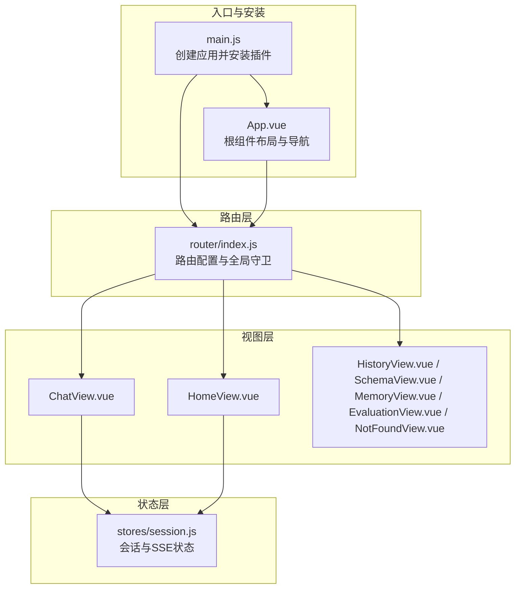
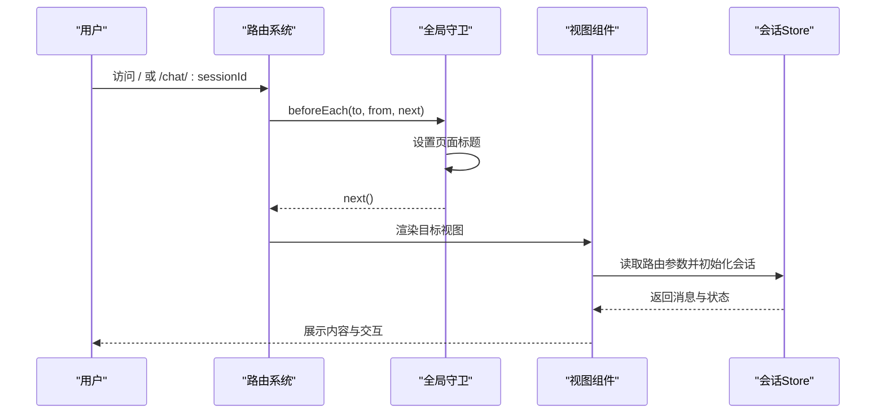
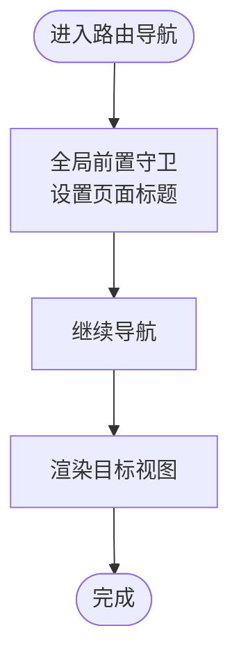
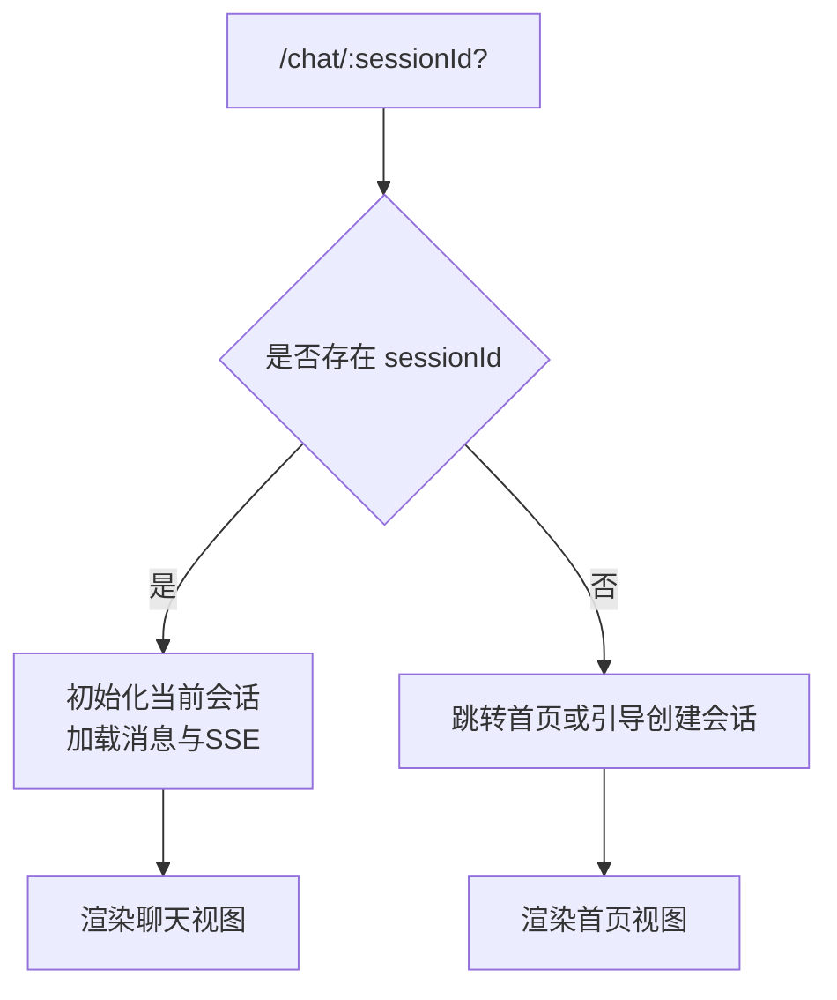
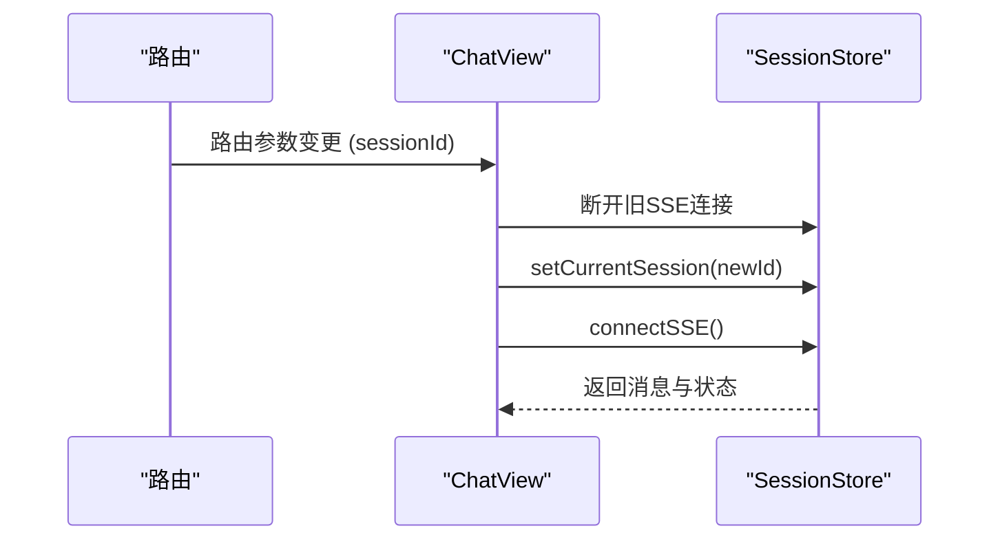
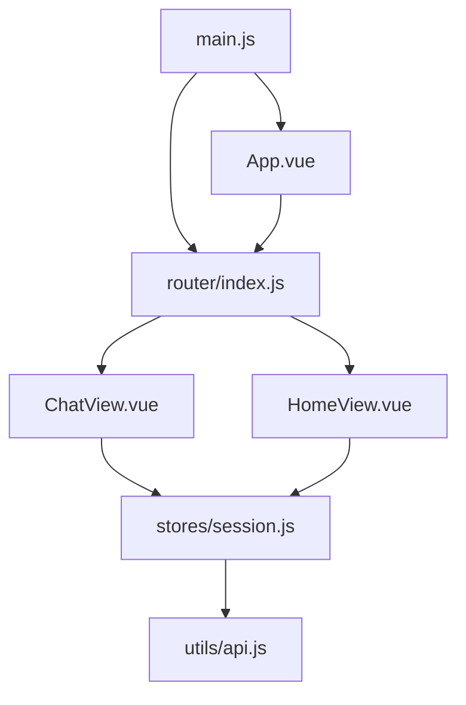

# 路由系统设计

<cite>
**本文引用的文件**
- [frontend/src/router/index.js](file://frontend/src/router/index.js)
- [frontend/src/main.js](file://frontend/src/main.js)
- [frontend/src/App.vue](file://frontend/src/App.vue)
- [frontend/src/views/ChatView.vue](file://frontend/src/views/ChatView.vue)
- [frontend/src/views/HomeView.vue](file://frontend/src/views/HomeView.vue)
- [frontend/src/stores/session.js](file://frontend/src/stores/session.js)
- [frontend/src/utils/api.js](file://frontend/src/utils/api.js)
- [frontend/vite.config.js](file://frontend/vite.config.js)
- [frontend/package.json](file://frontend/package.json)
</cite>

## 目录
1. [简介](#简介)
2. [项目结构](#项目结构)
3. [核心组件](#核心组件)
4. [架构总览](#架构总览)
5. [详细组件分析](#详细组件分析)
6. [依赖关系分析](#依赖关系分析)
7. [性能考虑](#性能考虑)
8. [故障排查指南](#故障排查指南)
9. [结论](#结论)
10. [附录](#附录)

## 简介
本技术文档围绕 NL2SQL 前端路由系统进行深入设计说明，重点覆盖以下方面：
- Vue Router 配置与路由守卫机制
- 路由定义、动态路由匹配与嵌套路由设计
- 路由导航拦截、权限验证与页面访问控制
- 路由懒加载、代码分割与性能优化策略
- 路由参数传递、查询字符串处理与路由元信息使用
- 路由调试技巧、错误处理机制与用户体验优化
- 路由历史管理、前进后退控制与浏览器兼容性处理

## 项目结构
前端采用 Vue 3 + Vue Router 4 + Pinia 的现代前端架构，路由系统位于独立模块中，配合全局守卫、状态管理和组件级路由能力共同实现完整的导航体验。

**图表来源**
- [frontend/src/main.js:1-89](file://frontend/src/main.js#L1-L89)
- [frontend/src/router/index.js:1-157](file://frontend/src/router/index.js#L1-L157)
- [frontend/src/App.vue:1-384](file://frontend/src/App.vue#L1-L384)

**章节来源**
- [frontend/src/main.js:1-89](file://frontend/src/main.js#L1-L89)
- [frontend/src/router/index.js:1-157](file://frontend/src/router/index.js#L1-L157)
- [frontend/src/App.vue:1-384](file://frontend/src/App.vue#L1-L384)

## 核心组件
- 路由配置与全局守卫：集中定义路由表、滚动行为与全局前置守卫，统一设置页面标题。
- 视图组件：首页、聊天、历史、Schema、内存、评估、404 等页面，其中聊天页通过动态路由参数驱动会话切换。
- 状态管理：会话 Store 管理会话列表、当前会话、消息历史与 SSE 连接，支撑路由参数变更后的状态同步。
- 构建与懒加载：Vite 配置手动分包策略，提升首屏性能与交互体验。

**章节来源**
- [frontend/src/router/index.js:34-157](file://frontend/src/router/index.js#L34-L157)
- [frontend/src/stores/session.js:33-399](file://frontend/src/stores/session.js#L33-L399)
- [frontend/vite.config.js:72-91](file://frontend/vite.config.js#L72-L91)

## 架构总览
路由系统通过 History 模式提供干净的 URL，结合全局守卫实现页面标题与导航控制；组件内通过路由 API 读取参数并联动状态管理，实现会话级数据的动态加载与刷新。

**图表来源**
- [frontend/src/router/index.js:142-150](file://frontend/src/router/index.js#L142-L150)
- [frontend/src/views/ChatView.vue:333-345](file://frontend/src/views/ChatView.vue#L333-L345)
- [frontend/src/stores/session.js:144-155](file://frontend/src/stores/session.js#L144-L155)

## 详细组件分析

### 路由配置与全局守卫
- 路由表定义：包含首页、聊天（动态参数）、历史、Schema、内存、评估、404 等路由，部分路由采用懒加载组件以减少初始包体。
- 滚动行为：优先恢复保存的滚动位置，否则回到顶部，提升用户体验一致性。
- 全局前置守卫：在每次导航前设置页面标题，标题来源于路由元信息，增强语义化与可读性。

**图表来源**
- [frontend/src/router/index.js:118-132](file://frontend/src/router/index.js#L118-L132)
- [frontend/src/router/index.js:142-150](file://frontend/src/router/index.js#L142-L150)

**章节来源**
- [frontend/src/router/index.js:34-109](file://frontend/src/router/index.js#L34-L109)
- [frontend/src/router/index.js:118-132](file://frontend/src/router/index.js#L118-L132)
- [frontend/src/router/index.js:142-150](file://frontend/src/router/index.js#L142-L150)

### 动态路由匹配与嵌套路由设计
- 动态路由：聊天页使用带可选参数的路径，支持无参进入首页或带会话 ID 进入指定会话。
- 嵌套路由：当前项目未显式声明嵌套路由，但通过根组件的路由视图占位与侧边栏布局，形成“主内容区”与“侧边栏”的嵌套视觉结构，满足导航与会话列表的组织需求。

**图表来源**
- [frontend/src/router/index.js:51-58](file://frontend/src/router/index.js#L51-L58)
- [frontend/src/views/ChatView.vue:333-345](file://frontend/src/views/ChatView.vue#L333-L345)

**章节来源**
- [frontend/src/router/index.js:51-58](file://frontend/src/router/index.js#L51-L58)
- [frontend/src/views/ChatView.vue:333-345](file://frontend/src/views/ChatView.vue#L333-L345)

### 权限验证与页面访问控制
- 当前路由配置未实现细粒度的鉴权守卫。聊天页通过路由元信息标记“需要会话”，可在全局守卫中扩展鉴权逻辑，如校验会话有效性或用户状态。
- 建议在全局守卫中增加：
  - 会话存在性校验（若 requiresSession 为 true）
  - 用户登录状态检查（若引入登录体系）
  - 未授权跳转至登录页或首页

**章节来源**
- [frontend/src/router/index.js:42-58](file://frontend/src/router/index.js#L42-L58)

### 路由懒加载与代码分割
- 懒加载组件：历史、Schema、内存、评估等页面采用动态导入，按需加载，降低首屏体积。
- Vite 手动分包：将 Element Plus、ECharts、Vue 生态等第三方库拆分为独立 chunk，提升缓存命中率与并行加载效率。

**图表来源**
- [frontend/src/router/index.js:64-94](file://frontend/src/router/index.js#L64-L94)
- [frontend/vite.config.js:81-88](file://frontend/vite.config.js#L81-L88)

**章节来源**
- [frontend/src/router/index.js:64-94](file://frontend/src/router/index.js#L64-L94)
- [frontend/vite.config.js:72-91](file://frontend/vite.config.js#L72-L91)

### 路由参数传递、查询字符串与元信息
- 路由参数：聊天页通过路由参数携带会话 ID，组件内读取并初始化当前会话。
- 查询字符串：当前路由未使用查询参数，API 层通过 axios 的 params 字段传递查询参数（如搜索、分页）。
- 路由元信息：title 用于设置页面标题，requiresSession 用于标识页面访问条件，可扩展用于权限控制。

**章节来源**
- [frontend/src/views/ChatView.vue:186-188](file://frontend/src/views/ChatView.vue#L186-L188)
- [frontend/src/router/index.js:42-58](file://frontend/src/router/index.js#L42-L58)
- [frontend/src/utils/api.js:137-141](file://frontend/src/utils/api.js#L137-L141)

### 路由导航拦截与状态联动
- 导航拦截：全局守卫统一设置标题，后续可在此处加入鉴权与访问控制。
- 状态联动：聊天页监听路由参数变化，当会话 ID 变更时断开旧 SSE、初始化新会话并加载消息，保证数据一致性。

**图表来源**
- [frontend/src/views/ChatView.vue:354-361](file://frontend/src/views/ChatView.vue#L354-L361)
- [frontend/src/stores/session.js:185-221](file://frontend/src/stores/session.js#L185-L221)

**章节来源**
- [frontend/src/views/ChatView.vue:354-361](file://frontend/src/views/ChatView.vue#L354-L361)
- [frontend/src/stores/session.js:185-221](file://frontend/src/stores/session.js#L185-L221)

### 路由历史管理、前进后退与浏览器兼容
- History 模式：使用 HTML5 History API，URL 更加美观且支持前进/后退。
- 滚动行为：通过 scrollBehavior 控制滚动位置，提升多页面切换体验。
- 浏览器兼容：History 模式在现代浏览器中表现稳定；若部署在不支持 History API 的环境中，需调整为 Hash 模式或服务端配置回退。

**章节来源**
- [frontend/src/router/index.js:118-132](file://frontend/src/router/index.js#L118-L132)

## 依赖关系分析
- 路由依赖：main.js 安装路由插件；App.vue 作为根组件承载侧边栏与路由视图。
- 组件依赖：ChatView 依赖 SessionStore；HomeView 也依赖 SessionStore 与路由 API。
- 第三方依赖：Vue Router、Pinia、Element Plus、axios 等。

**图表来源**
- [frontend/src/main.js:28-69](file://frontend/src/main.js#L28-L69)
- [frontend/src/App.vue:144-145](file://frontend/src/App.vue#L144-L145)
- [frontend/src/router/index.js:14-25](file://frontend/src/router/index.js#L14-L25)

**章节来源**
- [frontend/src/main.js:28-69](file://frontend/src/main.js#L28-L69)
- [frontend/src/App.vue:144-145](file://frontend/src/App.vue#L144-L145)
- [frontend/src/router/index.js:14-25](file://frontend/src/router/index.js#L14-L25)

## 性能考虑
- 代码分割：Vite 的 manualChunks 将第三方库拆分，减少重复下载与缓存失效。
- 懒加载：非关键页面采用动态导入，降低首屏资源压力。
- 滚动恢复：利用 savedPosition 提升页面切换体验。
- 并发优化：SSE 连接按需建立，避免不必要的网络开销。

**章节来源**
- [frontend/vite.config.js:72-91](file://frontend/vite.config.js#L72-L91)
- [frontend/src/router/index.js:64-94](file://frontend/src/router/index.js#L64-L94)
- [frontend/src/router/index.js:124-131](file://frontend/src/router/index.js#L124-L131)

## 故障排查指南
- 页面标题未更新：检查全局守卫是否正确设置 meta.title。
- 路由参数无效：确认 ChatView 中是否正确读取 route.params.sessionId，并在监听器中处理变更。
- SSE 连接异常：检查 SessionStore 的 connectSSE 与 handleSSEMessage，确认后端 SSE 地址与会话 ID。
- API 请求失败：查看 axios 响应拦截器的错误分支，定位网络或服务端错误。
- 路由跳转无效：确认 App.vue 中的路由 API 使用与路径拼接正确。

**章节来源**
- [frontend/src/router/index.js:142-150](file://frontend/src/router/index.js#L142-L150)
- [frontend/src/views/ChatView.vue:333-345](file://frontend/src/views/ChatView.vue#L333-L345)
- [frontend/src/stores/session.js:185-221](file://frontend/src/stores/session.js#L185-L221)
- [frontend/src/utils/api.js:67-88](file://frontend/src/utils/api.js#L67-L88)

## 结论
NL2SQL 前端路由系统以 Vue Router 为核心，结合全局守卫、懒加载与手动分包策略，在保证良好用户体验的同时提升了性能与可维护性。未来可在全局守卫中扩展权限控制与访问校验，并完善 404 与错误页面的导航体验，进一步提升系统的健壮性与可用性。

## 附录
- 依赖版本：Vue 3、Vue Router 4、Pinia、Element Plus、axios、Vite 等。
- 构建脚本：dev、build、preview，支持代理后端接口与路径别名。

**章节来源**
- [frontend/package.json:11-28](file://frontend/package.json#L11-L28)
- [frontend/package.json:6-10](file://frontend/package.json#L6-L10)
- [frontend/vite.config.js:18-35](file://frontend/vite.config.js#L18-L35)