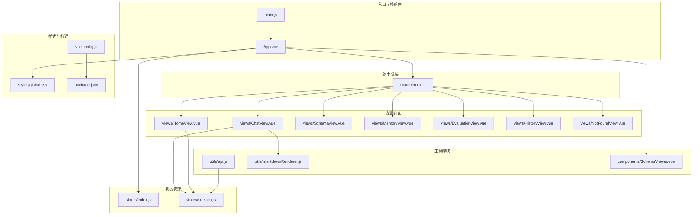
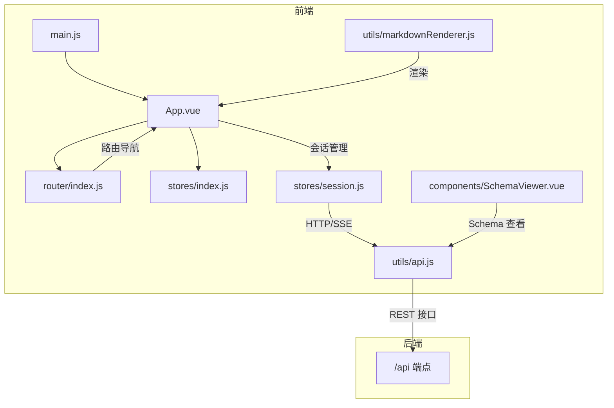
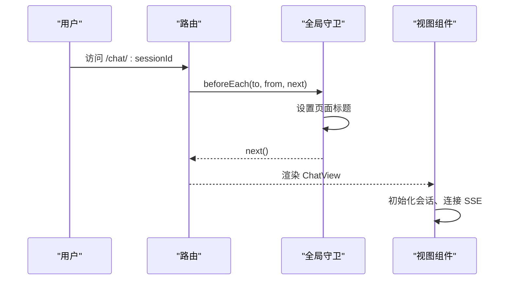
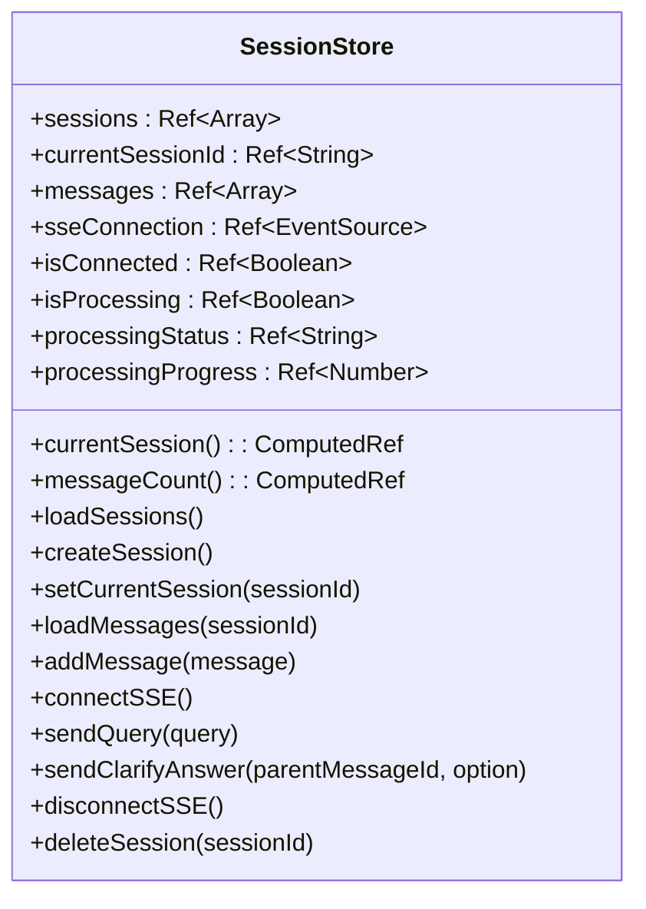
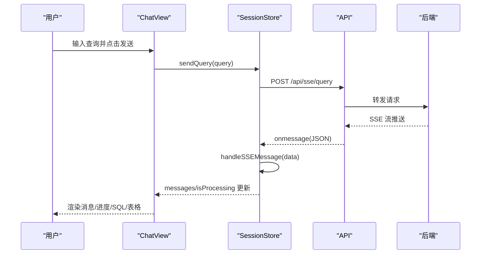
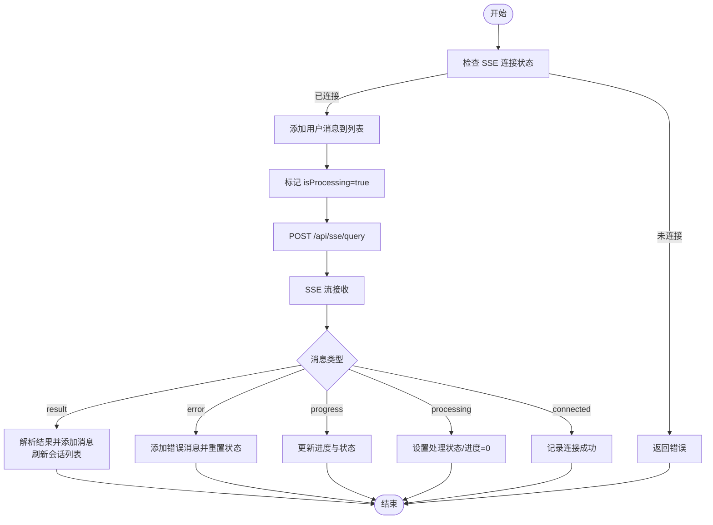
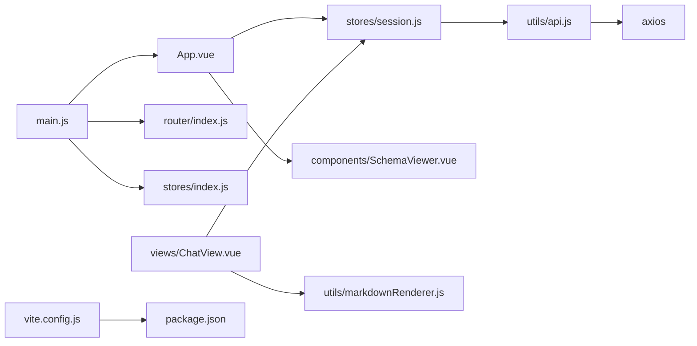

# 前端架构设计

<cite>
**本文档引用的文件**
- [main.js](file://frontend/src/main.js)
- [App.vue](file://frontend/src/App.vue)
- [router/index.js](file://frontend/src/router/index.js)
- [stores/index.js](file://frontend/src/stores/index.js)
- [stores/session.js](file://frontend/src/stores/session.js)
- [utils/api.js](file://frontend/src/utils/api.js)
- [views/ChatView.vue](file://frontend/src/views/ChatView.vue)
- [views/HomeView.vue](file://frontend/src/views/HomeView.vue)
- [styles/global.css](file://frontend/src/styles/global.css)
- [utils/markdownRenderer.js](file://frontend/src/utils/markdownRenderer.js)
- [components/SchemaViewer.vue](file://frontend/src/components/SchemaViewer.vue)
- [views/NotFoundView.vue](file://frontend/src/views/NotFoundView.vue)
- [vite.config.js](file://frontend/vite.config.js)
- [package.json](file://frontend/package.json)
</cite>

## 目录
1. [简介](#简介)
2. [项目结构](#项目结构)
3. [核心组件](#核心组件)
4. [架构总览](#架构总览)
5. [详细组件分析](#详细组件分析)
6. [依赖关系分析](#依赖关系分析)
7. [性能考虑](#性能考虑)
8. [故障排除指南](#故障排除指南)
9. [结论](#结论)
10. [附录](#附录)

## 简介
本文件面向 NL2SQL 前端架构，系统性梳理 Vue3 应用的整体设计，涵盖组件层次、状态管理、路由配置、模块化组织、组件通信、前后端交互、响应式设计与用户体验优化等方面。目标是帮助开发者快速理解并高效扩展前端能力。

## 项目结构
前端采用模块化分层组织：
- 入口与根组件：main.js、App.vue
- 路由系统：router/index.js
- 状态管理：stores/index.js、stores/session.js
- 视图页面：views 下各页面组件
- 工具模块：utils 下 API 封装、Markdown 渲染等
- 组件库：Element Plus
- 构建配置：vite.config.js、package.json

**图表来源**
- [main.js:1-89](file://frontend/src/main.js#L1-L89)
- [App.vue:1-384](file://frontend/src/App.vue#L1-L384)
- [router/index.js:1-157](file://frontend/src/router/index.js#L1-L157)
- [stores/index.js:1-30](file://frontend/src/stores/index.js#L1-L30)
- [stores/session.js:1-443](file://frontend/src/stores/session.js#L1-L443)
- [utils/api.js:1-320](file://frontend/src/utils/api.js#L1-L320)
- [utils/markdownRenderer.js:1-258](file://frontend/src/utils/markdownRenderer.js#L1-L258)
- [components/SchemaViewer.vue:1-317](file://frontend/src/components/SchemaViewer.vue#L1-L317)
- [views/ChatView.vue:1-835](file://frontend/src/views/ChatView.vue#L1-L835)
- [views/HomeView.vue:1-318](file://frontend/src/views/HomeView.vue#L1-L318)
- [styles/global.css:1-317](file://frontend/src/styles/global.css#L1-L317)
- [vite.config.js:1-93](file://frontend/vite.config.js#L1-L93)
- [package.json:1-36](file://frontend/package.json#L1-L36)

**章节来源**
- [main.js:1-89](file://frontend/src/main.js#L1-L89)
- [router/index.js:1-157](file://frontend/src/router/index.js#L1-L157)
- [stores/index.js:1-30](file://frontend/src/stores/index.js#L1-L30)
- [stores/session.js:1-443](file://frontend/src/stores/session.js#L1-L443)
- [utils/api.js:1-320](file://frontend/src/utils/api.js#L1-L320)
- [utils/markdownRenderer.js:1-258](file://frontend/src/utils/markdownRenderer.js#L1-L258)
- [components/SchemaViewer.vue:1-317](file://frontend/src/components/SchemaViewer.vue#L1-L317)
- [views/ChatView.vue:1-835](file://frontend/src/views/ChatView.vue#L1-L835)
- [views/HomeView.vue:1-318](file://frontend/src/views/HomeView.vue#L1-L318)
- [styles/global.css:1-317](file://frontend/src/styles/global.css#L1-L317)
- [vite.config.js:1-93](file://frontend/vite.config.js#L1-L93)
- [package.json:1-36](file://frontend/package.json#L1-L36)

## 核心组件
- 应用入口与插件安装：main.js 负责创建 Vue 实例、安装路由、状态管理、UI 组件库及全局样式。
- 根组件与布局：App.vue 提供侧边栏、主内容区、Schema 查看弹窗，协调会话管理与页面导航。
- 路由系统：router/index.js 定义页面路由、懒加载、滚动行为与全局前置守卫。
- 状态管理：stores/index.js 创建 Pinia 实例；stores/session.js 管理会话、消息、SSE 连接与处理状态。
- API 封装：utils/api.js 统一封装 axios，提供健康检查、Schema、会话、查询历史、统计、配置、SSE 等接口。
- 视图组件：HomeView、ChatView、SchemaViewer 等承载具体业务功能。
- 工具模块：markdownRenderer.js 提供 Markdown、Mermaid、KaTeX、代码高亮渲染能力。
- 构建与样式：vite.config.js 配置代理、路径别名、代码分割；global.css 提供基础样式与工具类。

**章节来源**
- [main.js:1-89](file://frontend/src/main.js#L1-L89)
- [App.vue:1-384](file://frontend/src/App.vue#L1-L384)
- [router/index.js:1-157](file://frontend/src/router/index.js#L1-L157)
- [stores/index.js:1-30](file://frontend/src/stores/index.js#L1-L30)
- [stores/session.js:1-443](file://frontend/src/stores/session.js#L1-L443)
- [utils/api.js:1-320](file://frontend/src/utils/api.js#L1-L320)
- [utils/markdownRenderer.js:1-258](file://frontend/src/utils/markdownRenderer.js#L1-L258)
- [components/SchemaViewer.vue:1-317](file://frontend/src/components/SchemaViewer.vue#L1-L317)
- [views/ChatView.vue:1-835](file://frontend/src/views/ChatView.vue#L1-L835)
- [views/HomeView.vue:1-318](file://frontend/src/views/HomeView.vue#L1-L318)
- [styles/global.css:1-317](file://frontend/src/styles/global.css#L1-L317)
- [vite.config.js:1-93](file://frontend/vite.config.js#L1-L93)
- [package.json:1-36](file://frontend/package.json#L1-L36)

## 架构总览
应用采用“入口 -> 根组件 -> 路由 -> 视图 -> 状态管理”的清晰层次，配合 Element Plus 提供 UI 能力，通过 axios 与后端交互，使用 Pinia 管理全局状态，利用 Vite 进行开发与构建。

**图表来源**
- [main.js:1-89](file://frontend/src/main.js#L1-L89)
- [App.vue:1-384](file://frontend/src/App.vue#L1-L384)
- [router/index.js:1-157](file://frontend/src/router/index.js#L1-L157)
- [stores/index.js:1-30](file://frontend/src/stores/index.js#L1-L30)
- [stores/session.js:1-443](file://frontend/src/stores/session.js#L1-L443)
- [utils/api.js:1-320](file://frontend/src/utils/api.js#L1-L320)
- [utils/markdownRenderer.js:1-258](file://frontend/src/utils/markdownRenderer.js#L1-L258)
- [components/SchemaViewer.vue:1-317](file://frontend/src/components/SchemaViewer.vue#L1-L317)

## 详细组件分析

### 入口与根组件
- 入口文件 main.js
  - 创建 Vue 应用实例，安装路由、Pinia、Element Plus，并注册全局图标组件，挂载到 DOM。
  - 作用：集中初始化与装配，保证插件顺序与全局可用性。
- 根组件 App.vue
  - 提供侧边栏（Logo、新建会话、历史会话列表、底部工具栏）、主内容区（router-view）与 Schema 查看弹窗。
  - 协调会话状态管理、路由跳转、侧边栏折叠、弹窗控制等。

**章节来源**
- [main.js:1-89](file://frontend/src/main.js#L1-L89)
- [App.vue:1-384](file://frontend/src/App.vue#L1-L384)

### 路由系统
- 路由配置 router/index.js
  - 定义首页、聊天、历史、Schema、内存、评估、404 等路由，支持懒加载与滚动行为。
  - 全局前置守卫设置页面标题，便于 SEO 与用户体验。
  - 路由参数 chat/:sessionId? 支持带会话 ID 的直接访问。

**图表来源**
- [router/index.js:142-150](file://frontend/src/router/index.js#L142-L150)
- [views/ChatView.vue:370-382](file://frontend/src/views/ChatView.vue#L370-L382)

**章节来源**
- [router/index.js:1-157](file://frontend/src/router/index.js#L1-L157)

### 状态管理（Pinia）
- Pinia 实例 stores/index.js
  - 创建并导出 Pinia 实例，供应用使用。
- 会话 Store stores/session.js
  - State：sessions、currentSessionId、messages、sseConnection、isConnected、isProcessing、processingStatus、processingProgress。
  - Getters：currentSession、messageCount。
  - Actions：loadSessions、createSession、setCurrentSession、loadMessages、addMessage、connectSSE、sendQuery、sendClarifyAnswer、disconnectSSE、deleteSession。
  - 设计要点：
    - 使用 defineStore 与 Composition API，响应式与副作用分离。
    - SSE 连接与消息处理解耦，支持澄清流程与错误处理。
    - 与 API 模块解耦，便于替换后端。

**图表来源**
- [stores/session.js:33-442](file://frontend/src/stores/session.js#L33-L442)

**章节来源**
- [stores/index.js:1-30](file://frontend/src/stores/index.js#L1-L30)
- [stores/session.js:1-443](file://frontend/src/stores/session.js#L1-L443)

### 组件间通信与数据流
- App.vue 与子组件
  - App.vue 通过 useSessionStore 管理会话列表与当前会话，控制侧边栏与弹窗。
  - ChatView.vue 通过 computed 读取 store 的 messages、isProcessing、processingStatus、processingProgress，实现双向绑定与响应式更新。
  - SchemaViewer.vue 通过 v-model 控制显示，内部通过 API 获取 Schema 数据。
- 数据流向
  - 用户输入 -> ChatView.sendMessage -> sessionStore.sendQuery -> API -> SSE -> sessionStore.handleSSEMessage -> store 更新 -> 视图响应式渲染。

**图表来源**
- [views/ChatView.vue:217-235](file://frontend/src/views/ChatView.vue#L217-L235)
- [stores/session.js:310-339](file://frontend/src/stores/session.js#L310-L339)
- [utils/api.js:246-251](file://frontend/src/utils/api.js#L246-L251)

**章节来源**
- [App.vue:134-240](file://frontend/src/App.vue#L134-L240)
- [views/ChatView.vue:151-420](file://frontend/src/views/ChatView.vue#L151-L420)
- [stores/session.js:1-443](file://frontend/src/stores/session.js#L1-L443)
- [utils/api.js:1-320](file://frontend/src/utils/api.js#L1-L320)

### 前后端交互模式
- HTTP 请求封装 utils/api.js
  - axios 实例：baseURL="/api"、timeout、默认 Content-Type。
  - 请求/响应拦截器：统一处理错误与返回数据。
  - 接口分类：健康检查、Schema、会话、查询历史、统计、配置、SSE。
- SSE 交互
  - ChatView 初始化时根据路由参数设置当前会话并连接 SSE。
  - sessionStore.connectSSE 建立 EventSource，handleSSEMessage 分发不同类型消息（connected/processing/progress/result/error），更新 store 状态并触发视图刷新。
- 错误处理与加载状态
  - 统一错误拦截，捕获网络、请求配置、服务器错误。
  - isProcessing、processingStatus、processingProgress 管理加载态与进度条。

**图表来源**
- [stores/session.js:185-304](file://frontend/src/stores/session.js#L185-L304)
- [views/ChatView.vue:370-382](file://frontend/src/views/ChatView.vue#L370-L382)
- [utils/api.js:246-251](file://frontend/src/utils/api.js#L246-L251)

**章节来源**
- [utils/api.js:1-320](file://frontend/src/utils/api.js#L1-L320)
- [stores/session.js:1-443](file://frontend/src/stores/session.js#L1-L443)
- [views/ChatView.vue:1-835](file://frontend/src/views/ChatView.vue#L1-L835)

### 视图组件与用户体验
- HomeView.vue
  - 快速开始入口：创建会话并跳转聊天页；查看 Schema。
  - 使用示例列表，便于新手引导。
- ChatView.vue
  - 消息渲染：Markdown、SQL 代码高亮、数据表格、澄清选项。
  - 交互：Enter 发送、Shift+Enter 换行；长内容折叠/展开；复制 SQL。
  - 加载态：打字动画、进度条、状态文本。
- NotFoundView.vue
  - 友好 404 页面，提供返回上一页与首页按钮。
- SchemaViewer.vue
  - 弹窗展示 Schema，支持搜索、折叠展开、字段与关系展示。

**章节来源**
- [views/HomeView.vue:1-318](file://frontend/src/views/HomeView.vue#L1-L318)
- [views/ChatView.vue:1-835](file://frontend/src/views/ChatView.vue#L1-L835)
- [views/NotFoundView.vue:1-131](file://frontend/src/views/NotFoundView.vue#L1-L131)
- [components/SchemaViewer.vue:1-317](file://frontend/src/components/SchemaViewer.vue#L1-L317)

### Markdown 渲染与富文本
- utils/markdownRenderer.js
  - 集成 markdown-it、Mermaid、KaTeX、Shiki。
  - 支持块级/行内数学公式、Mermaid 图表、SQL/多语言代码高亮。
  - 提供 renderMarkdown、renderSQL、highlightCode、renderMermaidCharts 等工具函数。

**章节来源**
- [utils/markdownRenderer.js:1-258](file://frontend/src/utils/markdownRenderer.js#L1-L258)
- [views/ChatView.vue:286-301](file://frontend/src/views/ChatView.vue#L286-L301)

### 响应式设计与样式
- styles/global.css
  - 基础重置、滚动条美化、通用工具类、Element Plus 自定义样式、动画效果。
  - 媒体查询适配移动端侧边栏布局。
- 组件样式
  - 各组件使用 scoped 样式，避免全局污染；结合 Element Plus 组件样式实现一致性。

**章节来源**
- [styles/global.css:1-317](file://frontend/src/styles/global.css#L1-L317)
- [views/ChatView.vue:422-800](file://frontend/src/views/ChatView.vue#L422-L800)

## 依赖关系分析
- 模块依赖
  - main.js 依赖 App.vue、router、stores、Element Plus、全局样式。
  - App.vue 依赖路由、会话 store、SchemaViewer 组件。
  - ChatView.vue 依赖路由、会话 store、markdownRenderer。
  - stores/session.js 依赖 api 模块、uuid。
  - utils/api.js 依赖 axios。
  - vite.config.js 依赖 @vitejs/plugin-vue、path。
- 外部依赖
  - Vue3、Vue Router、Pinia、Element Plus、axios、markdown-it、mermaid、katex、shiki、uuid 等。

**图表来源**
- [main.js:1-89](file://frontend/src/main.js#L1-L89)
- [App.vue:1-384](file://frontend/src/App.vue#L1-L384)
- [router/index.js:1-157](file://frontend/src/router/index.js#L1-L157)
- [stores/index.js:1-30](file://frontend/src/stores/index.js#L1-L30)
- [stores/session.js:1-443](file://frontend/src/stores/session.js#L1-L443)
- [utils/api.js:1-320](file://frontend/src/utils/api.js#L1-L320)
- [utils/markdownRenderer.js:1-258](file://frontend/src/utils/markdownRenderer.js#L1-L258)
- [components/SchemaViewer.vue:1-317](file://frontend/src/components/SchemaViewer.vue#L1-L317)
- [views/ChatView.vue:1-835](file://frontend/src/views/ChatView.vue#L1-L835)
- [vite.config.js:1-93](file://frontend/vite.config.js#L1-L93)
- [package.json:1-36](file://frontend/package.json#L1-L36)

**章节来源**
- [main.js:1-89](file://frontend/src/main.js#L1-L89)
- [package.json:1-36](file://frontend/package.json#L1-L36)

## 性能考虑
- 代码分割与懒加载
  - 路由懒加载减少首屏体积，提升加载速度。
  - Vite 配置 manualChunks 将 Element Plus、ECharts、Vue 生态库独立打包，利于缓存与并行加载。
- 构建优化
  - 生产环境关闭 sourcemap，减少体积。
  - 路径别名简化导入，提升开发体验。
- 渲染优化
  - ChatView 使用虚拟滚动与折叠长内容，避免大量 DOM。
  - Markdown 渲染延迟 Mermaid 渲染，降低首屏压力。
- 状态与网络
  - Pinia 响应式更新最小化重渲染。
  - SSE 连接复用，避免频繁重建；错误时断开重连。

**章节来源**
- [router/index.js:63-69](file://frontend/src/router/index.js#L63-L69)
- [vite.config.js:72-91](file://frontend/vite.config.js#L72-L91)
- [views/ChatView.vue:257-280](file://frontend/src/views/ChatView.vue#L257-L280)
- [utils/markdownRenderer.js:156-170](file://frontend/src/utils/markdownRenderer.js#L156-L170)

## 故障排除指南
- 路由与导航
  - 404 页面友好提示，提供返回上一页与首页按钮。
  - 全局守卫设置页面标题，若标题异常，检查 meta.title 配置。
- 网络与 API
  - axios 拦截器统一错误处理：服务器错误、网络错误、请求配置错误分别处理。
  - 代理配置 /api -> http://localhost:3000，开发环境跨域问题排查。
- SSE 与状态
  - 连接失败：检查后端 SSE 端点与会话 ID；确保 sessionStore.isConnected 与 isProcessing 状态正确。
  - 消息解析失败：检查后端消息格式与 JSON 结构。
- 组件渲染
  - Markdown/SQL 渲染异常：确认 markdownRenderer 初始化与 Shiki 高亮器状态。
  - Schema 查看：首次打开弹窗时加载数据，注意空状态与骨架屏提示。

**章节来源**
- [views/NotFoundView.vue:1-131](file://frontend/src/views/NotFoundView.vue#L1-L131)
- [router/index.js:142-150](file://frontend/src/router/index.js#L142-L150)
- [utils/api.js:67-88](file://frontend/src/utils/api.js#L67-L88)
- [vite.config.js:24-35](file://frontend/vite.config.js#L24-L35)
- [stores/session.js:185-304](file://frontend/src/stores/session.js#L185-L304)
- [utils/markdownRenderer.js:46-68](file://frontend/src/utils/markdownRenderer.js#L46-L68)
- [components/SchemaViewer.vue:191-208](file://frontend/src/components/SchemaViewer.vue#L191-L208)

## 结论
NL2SQL 前端采用清晰的模块化架构：入口集中装配、根组件统一布局、路由驱动导航、Pinia 管理状态、axios 封装 API、Element Plus 提供 UI、Vite 优化构建。通过 SSE 实现实时交互，配合 Markdown/代码高亮与 Schema 查看，形成良好的用户体验。整体设计具备良好扩展性与维护性，适合持续演进。

## 附录
- 开发与构建
  - 开发：npm run dev（Vite 开发服务器，端口 5173，自动打开浏览器）。
  - 构建：npm run build（输出至 dist，手动 chunks 优化）。
  - 预览：npm run preview（本地预览构建产物）。
- 依赖版本
  - Vue3、Vue Router、Pinia、Element Plus、axios、markdown-it、mermaid、katex、shiki、uuid 等。

**章节来源**
- [package.json:6-10](file://frontend/package.json#L6-L10)
- [vite.config.js:17-57](file://frontend/vite.config.js#L17-L57)
- [package.json:11-29](file://frontend/package.json#L11-L29)