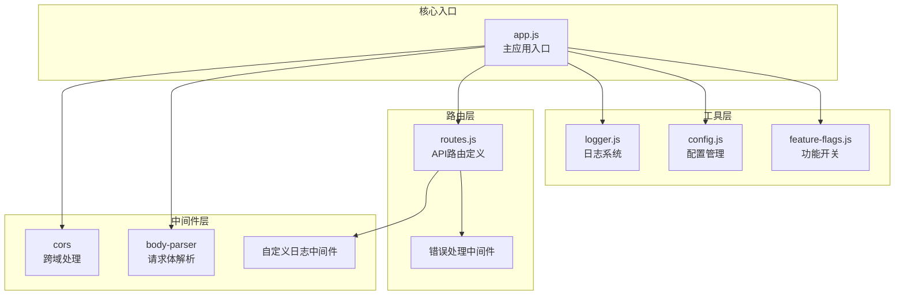
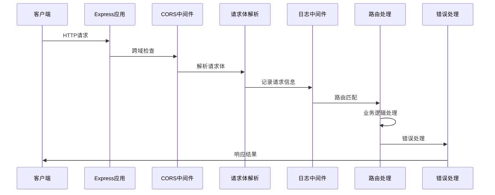
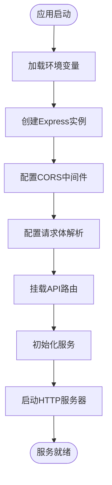
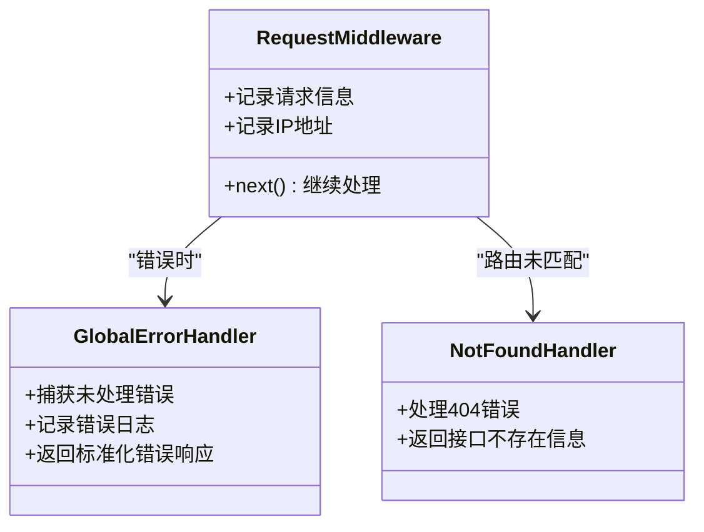
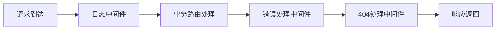
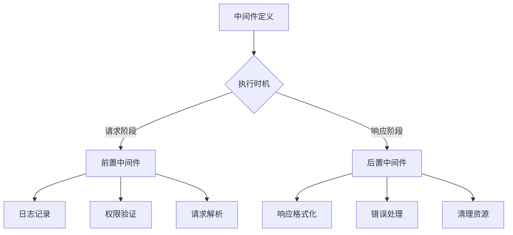

# 中间件体系

<cite>
**本文档引用的文件**
- [app.js](file://backend/src/app.js)
- [routes.js](file://backend/src/core/routes.js)
- [logger.js](file://backend/src/utils/logger.js)
- [config.js](file://backend/src/core/config.js)
- [feature-flags.js](file://backend/config/feature-flags.js)
- [package.json](file://backend/package.json)
</cite>

## 目录
1. [简介](#简介)
2. [项目结构](#项目结构)
3. [核心中间件](#核心中间件)
4. [架构概览](#架构概览)
5. [详细组件分析](#详细组件分析)
6. [中间件执行顺序](#中间件执行顺序)
7. [安全配置](#安全配置)
8. [扩展与自定义](#扩展与自定义)
9. [性能考虑](#性能考虑)
10. [故障排除指南](#故障排除指南)
11. [结论](#结论)

## 简介

NL2SQL中间件体系是构建在Express.js之上的现代化Web服务架构，专门设计用于处理自然语言到SQL的转换服务。该体系通过精心设计的中间件栈实现了跨域处理、请求解析、日志记录、错误处理等核心功能，为NL2SQL服务提供了稳定可靠的基础设施。

本中间件体系采用模块化设计，支持生产环境的高性能要求，同时保持开发环境的便利性。通过统一的配置管理和功能开关机制，实现了灵活的功能控制和渐进式部署能力。

## 项目结构

NL2SQL项目的中间件体系主要分布在以下关键文件中：



**图表来源**
- [app.js:63-80](file://backend/src/app.js#L63-L80)
- [routes.js:46-54](file://backend/src/core/routes.js#L46-L54)

**章节来源**
- [app.js:1-260](file://backend/src/app.js#L1-L260)
- [package.json:1-28](file://backend/package.json#L1-L28)

## 核心中间件

### CORS跨域处理中间件

NL2SQL项目使用Express.js的CORS中间件来处理跨域请求。在应用启动时，通过以下配置启用CORS：

```javascript
// 启用CORS中间件，允许前端跨域访问
app.use(cors({ origin: '*' }));
```

**配置特点：**
- `origin: '*'` - 允许来自任何来源的跨域请求
- 适用于开发环境和测试环境
- 生产环境中建议配置为具体的域名列表

**安全考虑：**
- 在生产环境中应将通配符替换为具体的可信域名
- 可以配置允许的方法、头部和凭据

### JSON请求体解析中间件

项目使用body-parser中间件来处理JSON格式的请求体：

```javascript
// 启用body-parser中间件，解析JSON格式的请求体
app.use(bodyParser.json({ limit: '10mb' }));

// 启用body-parser中间件，解析URL编码的请求体
app.use(bodyParser.urlencoded({ extended: true }));
```

**配置特点：**
- `limit: '10mb'` - 设置最大请求体大小为10MB
- `extended: true` - 支持嵌套对象的URL编码解析
- 自动处理Content-Type为application/json的请求

**安全考虑：**
- 合理设置请求体大小限制，防止内存溢出
- 避免处理过大或恶意构造的请求体

### URL编码解析中间件

除了JSON解析外，还配置了URL编码解析：

```javascript
app.use(bodyParser.urlencoded({ extended: true }));
```

**用途：**
- 处理表单提交的application/x-www-form-urlencoded数据
- 支持嵌套对象的解析
- 与JSON解析配合，满足不同客户端的请求格式

**章节来源**
- [app.js:63-72](file://backend/src/app.js#L63-L72)
- [package.json:15-16](file://backend/package.json#L15-L16)

## 架构概览

NL2SQL中间件体系采用分层架构设计，确保各层职责清晰分离：



**图表来源**
- [app.js:63-80](file://backend/src/app.js#L63-L80)
- [routes.js:46-54](file://backend/src/core/routes.js#L46-L54)

## 详细组件分析

### 应用启动流程

应用启动时按照特定顺序初始化各个中间件：



**图表来源**
- [app.js:97-188](file://backend/src/app.js#L97-L188)

### 路由中间件链

路由层包含自定义的日志中间件和错误处理中间件：



**图表来源**
- [routes.js:46-54](file://backend/src/core/routes.js#L46-L54)
- [routes.js:1012-1030](file://backend/src/core/routes.js#L1012-L1030)

**章节来源**
- [app.js:56-88](file://backend/src/app.js#L56-L88)
- [routes.js:46-1030](file://backend/src/core/routes.js#L46-L1030)

## 中间件执行顺序

NL2SQL中间件的执行顺序遵循Express.js的标准模式：

### 全局中间件顺序

1. **CORS中间件** - 处理跨域请求
2. **JSON解析中间件** - 解析application/json请求体
3. **URL编码解析中间件** - 解析application/x-www-form-urlencoded请求体
4. **路由中间件** - 记录请求日志
5. **API路由** - 处理具体的业务逻辑
6. **错误处理中间件** - 捕获并处理所有错误

### 路由级中间件顺序

在路由层面，中间件按照定义顺序执行：



**图表来源**
- [routes.js:46-54](file://backend/src/core/routes.js#L46-L54)
- [routes.js:1012-1030](file://backend/src/core/routes.js#L1012-L1030)

**章节来源**
- [app.js:63-80](file://backend/src/app.js#L63-L80)
- [routes.js:46-54](file://backend/src/core/routes.js#L46-L54)

## 安全配置

### 请求大小限制

项目通过多种方式实现请求大小限制：

```javascript
// JSON请求体大小限制
app.use(bodyParser.json({ limit: '10mb' }));

// URL编码请求体大小限制
app.use(bodyParser.urlencoded({ extended: true }));

// 配置管理中的安全参数
security: {
    maxQueryRows: 1000,      // 单个查询最大返回行数
    queryTimeout: 30000,     // 查询超时时间（毫秒）
    forbiddenKeywords: []    // 禁止的SQL关键字
}
```

**安全措施：**
- JSON请求体限制为10MB，防止内存攻击
- 查询结果行数限制为1000行
- SQL关键字过滤防止恶意查询
- 查询超时机制防止长时间阻塞

### 跨域配置

```javascript
// 开发环境允许所有来源
app.use(cors({ origin: '*' }));

// 生产环境建议配置为具体域名
// app.use(cors({ 
//     origin: ['https://yourdomain.com', 'https://www.yourdomain.com'],
//     credentials: true
// }));
```

**生产环境最佳实践：**
- 明确指定允许的域名列表
- 启用credentials支持（如果需要）
- 配置允许的HTTP方法和头部

**章节来源**
- [app.js:63-72](file://backend/src/app.js#L63-L72)
- [config.js:140-170](file://backend/src/core/config.js#L140-L170)

## 扩展与自定义

### 自定义中间件开发指南

#### 日志中间件模式

```javascript
// 基础日志中间件结构
router.use((req, res, next) => {
    // 记录请求信息
    logger.debug(`${req.method} ${req.path}`, {
        query: req.query,
        ip: req.ip
    });
    // 继续处理下一个中间件
    next();
});
```

#### 错误处理中间件模式

```javascript
// 全局错误处理中间件
router.use((err, req, res, next) => {
    logger.error('API错误:', err);
    res.status(500).json({
        error: '服务器内部错误',
        message: config.isDevelopment() ? err.message : '请稍后重试'
    });
});

// 404处理中间件
router.use((req, res) => {
    res.status(404).json({
        error: '接口不存在',
        path: req.path,
        method: req.method
    });
});
```

### 中间件优先级管理



**图表来源**
- [routes.js:46-54](file://backend/src/core/routes.js#L46-L54)
- [routes.js:1012-1030](file://backend/src/core/routes.js#L1012-L1030)

### 中间件组合模式

```javascript
// 条件中间件
function conditionalMiddleware(condition) {
    return (req, res, next) => {
        if (condition) {
            next();
        } else {
            res.status(403).json({ error: '访问被拒绝' });
        }
    };
}

// 参数验证中间件
function validateParams(requiredParams) {
    return (req, res, next) => {
        const missing = requiredParams.filter(param => !req.body[param]);
        if (missing.length > 0) {
            return res.status(400).json({
                error: '缺少必要参数',
                missing: missing
            });
        }
        next();
    };
}
```

**章节来源**
- [routes.js:46-54](file://backend/src/core/routes.js#L46-L54)
- [routes.js:1012-1030](file://backend/src/core/routes.js#L1012-L1030)

## 性能考虑

### 中间件性能优化

```javascript
// 1. 合理设置请求体大小限制
app.use(bodyParser.json({ limit: '10mb' }));

// 2. 使用适当的日志级别
logger.setLevel(config.log.level);

// 3. 避免不必要的中间件链
// 只在需要的路由上应用特定中间件

// 4. 实现中间件缓存
const middlewareCache = new Map();

// 5. 异步中间件优化
function asyncMiddleware(fn) {
    return (req, res, next) => {
        Promise.resolve(fn(req, res, next)).catch(next);
    };
}
```

### 监控和调试

```javascript
// 性能监控中间件
router.use((req, res, next) => {
    const start = Date.now();
    res.on('finish', () => {
        const duration = Date.now() - start;
        logger.debug(`请求耗时: ${duration}ms`, {
            method: req.method,
            path: req.path,
            duration: duration
        });
    });
    next();
});
```

## 故障排除指南

### 常见中间件问题

#### CORS相关问题

**问题症状：**
- 浏览器控制台出现CORS错误
- 预检请求失败

**解决方案：**
```javascript
// 检查CORS配置
app.use(cors({
    origin: process.env.ALLOWED_ORIGINS?.split(',') || '*',
    credentials: true
}));

// 启用调试模式
app.use((req, res, next) => {
    console.log('CORS Headers:', res.getHeaders());
    next();
});
```

#### 请求体解析问题

**问题症状：**
- JSON解析失败
- 请求体为空

**解决方案：**
```javascript
// 检查Content-Type头
router.use((req, res, next) => {
    console.log('Content-Type:', req.headers['content-type']);
    console.log('Body:', req.body);
    next();
});

// 设置适当的解析器
app.use(express.json({ limit: '50mb' }));
app.use(express.urlencoded({ limit: '50mb', extended: true }));
```

#### 错误处理问题

**问题症状：**
- 500错误页面显示技术细节
- 错误信息不一致

**解决方案：**
```javascript
// 标准化错误响应
router.use((err, req, res, next) => {
    logger.error('API错误:', {
        message: err.message,
        stack: err.stack,
        url: req.url,
        method: req.method
    });
    
    const response = {
        error: '服务器内部错误',
        timestamp: new Date().toISOString(),
        path: req.path
    };
    
    if (config.isDevelopment()) {
        response.details = err.message;
    }
    
    res.status(500).json(response);
});
```

**章节来源**
- [routes.js:1012-1030](file://backend/src/core/routes.js#L1012-L1030)
- [logger.js:299-309](file://backend/src/utils/logger.js#L299-L309)

## 结论

NL2SQL中间件体系通过精心设计的模块化架构，为自然语言到SQL的转换服务提供了稳定可靠的技术基础。该体系的主要优势包括：

### 核心优势

1. **模块化设计** - 中间件职责清晰，易于维护和扩展
2. **安全性保障** - 多层次的安全防护机制
3. **性能优化** - 合理的中间件执行顺序和资源配置
4. **开发友好** - 完善的日志记录和错误处理机制
5. **生产就绪** - 支持功能开关和环境配置管理

### 最佳实践建议

1. **生产环境配置** - 将CORS配置从通配符改为具体域名
2. **监控完善** - 添加性能监控和错误追踪
3. **文档维护** - 保持中间件文档与代码同步更新
4. **安全审计** - 定期审查中间件配置和安全设置
5. **性能测试** - 定期进行压力测试和性能优化

该中间件体系为NL2SQL服务的成功部署和稳定运行奠定了坚实基础，通过持续的优化和完善，能够满足不断增长的业务需求和技术挑战。