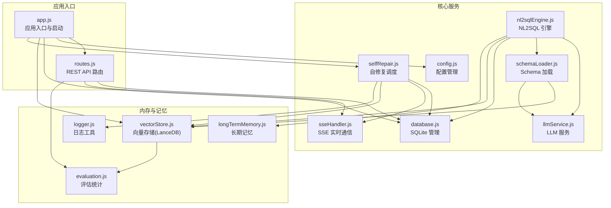
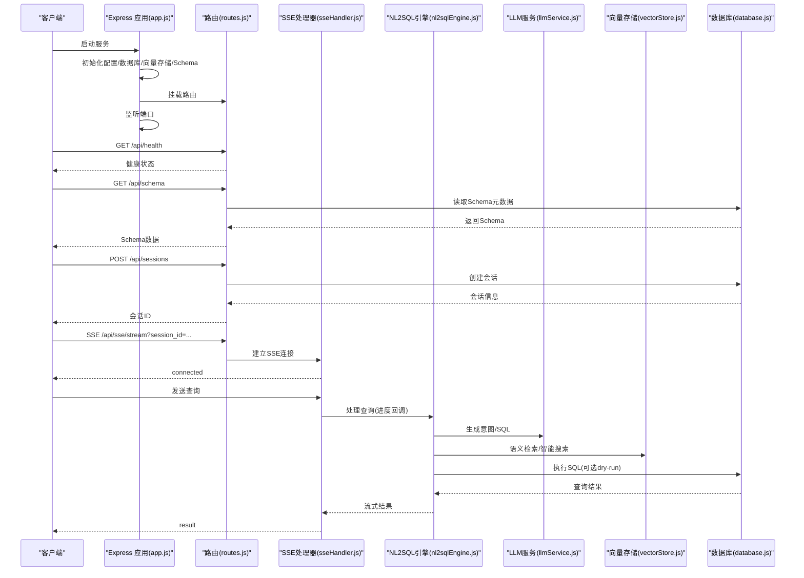
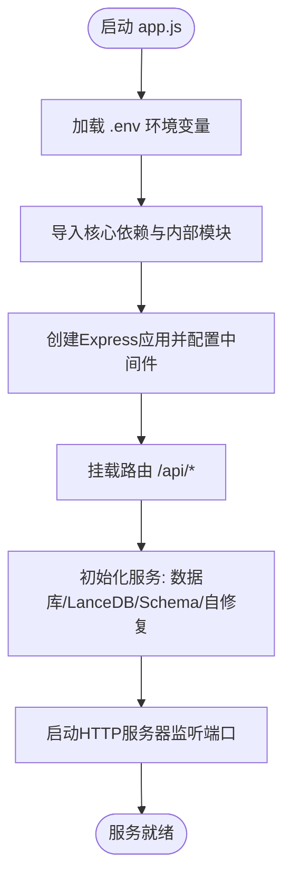
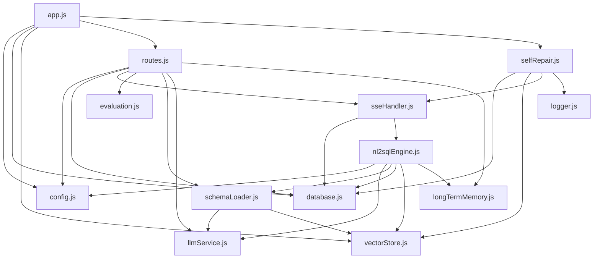

# 后端架构

<cite>
**本文档引用的文件**
- [app.js](file://backend/src/app.js)
- [package.json](file://backend/package.json)
- [routes.js](file://backend/src/core/routes.js)
- [config.js](file://backend/src/core/config.js)
- [database.js](file://backend/src/core/database.js)
- [llmService.js](file://backend/src/core/llmService.js)
- [nl2sqlEngine.js](file://backend/src/core/nl2sqlEngine.js)
- [schemaLoader.js](file://backend/src/core/schemaLoader.js)
- [sseHandler.js](file://backend/src/core/sseHandler.js)
- [vectorStore.js](file://backend/src/memory/vectorStore.js)
- [longTermMemory.js](file://backend/src/memory/longTermMemory.js)
- [evaluation.js](file://backend/src/utils/evaluation.js)
- [logger.js](file://backend/src/utils/logger.js)
- [selfRepair.js](file://backend/src/core/selfRepair.js)
</cite>

## 目录
1. [简介](#简介)
2. [项目结构](#项目结构)
3. [核心组件](#核心组件)
4. [架构总览](#架构总览)
5. [详细组件分析](#详细组件分析)
6. [依赖关系分析](#依赖关系分析)
7. [性能考虑](#性能考虑)
8. [故障排查指南](#故障排查指南)
9. [结论](#结论)
10. [附录](#附录)

## 简介
本项目是一个基于 Express.js 的 NL2SQL 后端服务，提供自然语言到 SQL 的转换能力。系统采用模块化设计，包含配置管理、数据库层、Schema 管理、NL2SQL 引擎、LLM 服务集成、向量存储与检索、长期记忆、SSE 实时通信以及自修复机制等核心模块。本文档将深入解释应用入口初始化流程、模块化架构设计与中间件配置，详细描述各模块职责、依赖关系与数据流转，并提供架构图表、性能优化建议、安全配置与监控集成方案。

## 项目结构
后端采用按功能域划分的模块化组织方式：
- 核心模块：配置、数据库、LLM 服务、NL2SQL 引擎、Schema 加载、SSE 处理、自修复
- 内存与记忆：向量存储、长期记忆、记忆维护、对话摘要
- 工具与评估：日志、评估统计
- 应用入口：Express 应用、路由、启动与优雅关闭

**图表来源**
- [app.js:1-238](file://backend/src/app.js#L1-L238)
- [routes.js:1-1037](file://backend/src/core/routes.js#L1-L1037)
- [config.js:1-398](file://backend/src/core/config.js#L1-L398)
- [database.js:1-850](file://backend/src/core/database.js#L1-L850)
- [llmService.js:1-468](file://backend/src/core/llmService.js#L1-L468)
- [nl2sqlEngine.js:1-2492](file://backend/src/core/nl2sqlEngine.js#L1-L2492)
- [schemaLoader.js:1-1071](file://backend/src/core/schemaLoader.js#L1-L1071)
- [sseHandler.js:1-349](file://backend/src/core/sseHandler.js#L1-L349)
- [vectorStore.js:1-759](file://backend/src/memory/vectorStore.js#L1-L759)
- [longTermMemory.js:1-1141](file://backend/src/memory/longTermMemory.js#L1-L1141)
- [evaluation.js:1-488](file://backend/src/utils/evaluation.js#L1-L488)
- [logger.js:1-442](file://backend/src/utils/logger.js#L1-L442)
- [selfRepair.js:1-489](file://backend/src/core/selfRepair.js#L1-L489)

**章节来源**
- [app.js:1-238](file://backend/src/app.js#L1-L238)
- [package.json:1-28](file://backend/package.json#L1-L28)

## 核心组件
- 配置管理模块：集中管理应用配置，包括 LLM API、数据库、安全策略、会话、日志、自修复、Schema、长期记忆、上下文管理与评估等配置项，并提供配置校验。
- 数据库层：基于 SQLite 的会话、消息、查询历史、用户偏好等数据持久化，提供连接管理、事务、迁移与查询封装。
- LLM 服务：封装与外部 LLM API 的通信，支持普通与流式响应、重试机制、超时控制与日志记录。
- NL2SQL 引擎：实现意图识别、实体解析、SQL 生成、验证与结果格式化，集成长期记忆与向量检索。
- Schema 加载：从 JSON 配置加载表结构，构建映射与缓存，支持向量化与语义搜索。
- SSE 处理：管理实时连接、消息广播与进度回调，驱动 NL2SQL 引擎执行查询。
- 向量存储：基于 LanceDB 的 Schema 与查询历史向量存储，提供语义检索与智能重排序。
- 长期记忆：提取与存储用户偏好（查询模式、字段别名、指标/维度偏好），支持 LLM 智能分析。
- 自修复机制：定时任务执行健康检查、会话清理、统计收集与记忆维护。
- 评估统计：记录向量检索命中率与长期记忆命中率，提供质量评估接口。
- 日志工具：统一日志输出，支持文件轮转、结构化日志与执行流程追踪。

**章节来源**
- [config.js:1-398](file://backend/src/core/config.js#L1-L398)
- [database.js:1-850](file://backend/src/core/database.js#L1-L850)
- [llmService.js:1-468](file://backend/src/core/llmService.js#L1-L468)
- [nl2sqlEngine.js:1-2492](file://backend/src/core/nl2sqlEngine.js#L1-L2492)
- [schemaLoader.js:1-1071](file://backend/src/core/schemaLoader.js#L1-L1071)
- [sseHandler.js:1-349](file://backend/src/core/sseHandler.js#L1-L349)
- [vectorStore.js:1-759](file://backend/src/memory/vectorStore.js#L1-L759)
- [longTermMemory.js:1-1141](file://backend/src/memory/longTermMemory.js#L1-L1141)
- [evaluation.js:1-488](file://backend/src/utils/evaluation.js#L1-L488)
- [logger.js:1-442](file://backend/src/utils/logger.js#L1-L442)
- [selfRepair.js:1-489](file://backend/src/core/selfRepair.js#L1-L489)

## 架构总览
系统采用“应用入口 -> 中间件 -> 路由 -> 业务模块”的分层架构。Express 应用在启动时加载环境变量、初始化数据库与向量存储、加载 Schema、启动自修复调度器，并监听端口。路由层提供健康检查、Schema 查询、会话管理、查询历史、用户偏好、评估统计等 REST 接口。NL2SQL 引擎通过 LLM 服务与向量存储协作，结合长期记忆与数据库执行 SQL。SSE 处理器提供实时流式响应。

**图表来源**
- [app.js:93-166](file://backend/src/app.js#L93-L166)
- [routes.js:60-137](file://backend/src/core/routes.js#L60-L137)
- [routes.js:140-250](file://backend/src/core/routes.js#L140-L250)
- [routes.js:256-398](file://backend/src/core/routes.js#L256-L398)
- [routes.js:400-450](file://backend/src/core/routes.js#L400-L450)
- [routes.js:452-760](file://backend/src/core/routes.js#L452-L760)
- [sseHandler.js:43-112](file://backend/src/core/sseHandler.js#L43-L112)
- [sseHandler.js:218-280](file://backend/src/core/sseHandler.js#L218-L280)
- [nl2sqlEngine.js:741-760](file://backend/src/core/nl2sqlEngine.js#L741-L760)
- [llmService.js:222-299](file://backend/src/core/llmService.js#L222-L299)
- [vectorStore.js:450-536](file://backend/src/memory/vectorStore.js#L450-L536)
- [database.js:458-540](file://backend/src/core/database.js#L458-L540)

## 详细组件分析

### 应用入口与启动流程
- 加载环境变量，导入核心依赖与内部模块
- 配置 Express 中间件（CORS、JSON 解析）
- 挂载路由至 /api
- 初始化数据目录、SQLite、LanceDB、Schema、自修复调度器
- 启动 HTTP 服务器并打印服务信息

**图表来源**
- [app.js:15-166](file://backend/src/app.js#L15-L166)

**章节来源**
- [app.js:1-238](file://backend/src/app.js#L1-L238)

### 配置管理模块
- 集中管理应用配置，包括 LLM API、数据库、安全策略、会话、日志、自修复、Schema、长期记忆、上下文管理与评估等
- 提供配置校验，确保关键配置（如 LLM API Key、SR 数据库 URL）存在
- 支持开发/生产环境切换与日志级别控制

**章节来源**
- [config.js:1-398](file://backend/src/core/config.js#L1-L398)

### 数据库层
- SQLite 管理：创建表结构、索引、外键约束，提供查询、插入、更新、事务封装
- 迁移机制：自动检测并修复旧表结构（如移除 UNIQUE 约束）
- 会话与消息：支持会话创建、更新、删除、消息历史查询
- 用户偏好：存储查询模式、字段别名、指标/维度偏好，支持使用统计与去重
- 安全策略：白名单表访问、禁止关键字过滤、行数限制与查询超时

**章节来源**
- [database.js:1-850](file://backend/src/core/database.js#L1-L850)

### LLM 服务集成
- 支持普通与流式响应，封装 HTTP 请求、超时与重试
- 提供聊天与 Embedding 接口，支持工具定义辅助函数
- 记录请求/响应日志，包含耗时与 Token 使用情况

**章节来源**
- [llmService.js:1-468](file://backend/src/core/llmService.js#L1-L468)

### NL2SQL 引擎
- 意图识别：结合上下文与长期记忆，提取时间范围、维度、指标、筛选条件
- 实体解析：支持游戏/渠道 ID 与平台类型映射，学习字段别名
- SQL 生成与验证：生成标准 SQL，执行前进行安全检查与白名单过滤
- 结果格式化：将结果转为自然语言，支持澄清与默认选项确认
- 集成向量检索：智能搜索相关表，结合查询意图与领域标签重排序

**章节来源**
- [nl2sqlEngine.js:1-2492](file://backend/src/core/nl2sqlEngine.js#L1-L2492)

### Schema 加载与向量检索
- 从 JSON 配置加载表结构，构建表/字段映射与缓存
- 将表级描述向量化，添加域标签与数据类型元数据
- 提供语义搜索与智能搜索（按游戏/平台类型重排序）
- 支持关键词匹配与 SQL 安全验证（禁止关键字与白名单）

**章节来源**
- [schemaLoader.js:1-1071](file://backend/src/core/schemaLoader.js#L1-L1071)
- [vectorStore.js:1-759](file://backend/src/memory/vectorStore.js#L1-L759)

### SSE 实时通信
- 管理 SSE 连接，支持多标签页连接与广播
- 处理查询请求，调用 NL2SQL 引擎并流式返回进度与结果
- 提供连接统计与错误处理

**章节来源**
- [sseHandler.js:1-349](file://backend/src/core/sseHandler.js#L1-L349)

### 长期记忆与上下文管理
- 提取并存储用户偏好（查询模式、字段别名、指标/维度偏好）
- 支持 LLM 智能分析，区分个人偏好与通用知识
- 基于阈值与频率策略筛选有价值的记忆
- 对话摘要与 Token 预算管理，支持上下文压缩

**章节来源**
- [longTermMemory.js:1-1141](file://backend/src/memory/longTermMemory.js#L1-L1141)

### 自修复机制
- 定时任务：每日健康检查、会话清理、统计收集、记忆维护
- 健康检查：数据库连接、向量数据库、查询统计、活跃连接、系统资源
- 会话清理：过期会话归档
- 记忆维护：压缩与清理过期偏好

**章节来源**
- [selfRepair.js:1-489](file://backend/src/core/selfRepair.js#L1-L489)

### 评估统计与监控
- 记录向量检索命中率与距离分布
- 统计长期记忆命中率与类型分布
- 提供评估接口：Schema 向量化质量评估、查询相似度评估
- 支持运行时统计与重置

**章节来源**
- [evaluation.js:1-488](file://backend/src/utils/evaluation.js#L1-L488)

### 日志与中间件
- 统一日志输出：控制台彩色输出、文件轮转、结构化日志
- 请求日志中间件：记录请求方法、路径、查询参数与 IP
- Trace 追踪：执行流程追踪，支持步骤记录与耗时统计

**章节来源**
- [logger.js:1-442](file://backend/src/utils/logger.js#L1-L442)
- [routes.js:42-54](file://backend/src/core/routes.js#L42-L54)

## 依赖关系分析
模块间依赖关系如下：
- app.js 依赖 config、database、vectorStore、routes、selfRepair
- routes.js 依赖 config、database、sseHandler、evaluation、schemaLoader、llmService、vectorStore、longTermMemory
- nl2sqlEngine.js 依赖 config、llmService、schemaLoader、database、tokenBudget、summarizer、longTermMemory、vectorStore
- schemaLoader.js 依赖 config、llmService、vectorStore
- vectorStore.js 依赖 config、evaluation
- longTermMemory.js 依赖 database、llmService、config、evaluation
- sseHandler.js 依赖 database、nl2sqlEngine
- selfRepair.js 依赖 config、database、vectorStore、sseHandler

**图表来源**
- [app.js:38-50](file://backend/src/app.js#L38-L50)
- [routes.js:15-30](file://backend/src/core/routes.js#L15-L30)
- [nl2sqlEngine.js:16-33](file://backend/src/core/nl2sqlEngine.js#L16-L33)
- [schemaLoader.js:15-26](file://backend/src/core/schemaLoader.js#L15-L26)
- [sseHandler.js:15-20](file://backend/src/core/sseHandler.js#L15-L20)
- [selfRepair.js:15-26](file://backend/src/core/selfRepair.js#L15-L26)

**章节来源**
- [app.js:38-50](file://backend/src/app.js#L38-L50)
- [routes.js:15-30](file://backend/src/core/routes.js#L15-L30)

## 性能考虑
- 数据库优化：为常用查询字段建立索引，使用事务批量操作，定期清理过期会话
- 向量检索：分批获取 Embedding，智能搜索按域与数据类型重排序，减少无关表影响
- LLM 调用：合理设置超时与重试，避免阻塞请求；流式响应提升用户体验
- 日志与监控：按级别输出，避免过度日志；使用评估模块记录命中率与性能指标
- 内存管理：定期自检与内存使用监控，必要时重启服务

[本节为通用指导，无需列出具体文件来源]

## 故障排查指南
- 未处理的 Promise 拒绝与未捕获异常：应用入口已监听并记录错误，触发优雅关闭
- 数据库初始化失败：检查 SQLite 路径与权限，确认迁移脚本执行成功
- 向量数据库未初始化：确认 LanceDB 路径与权限，检查向量表创建与数据写入
- LLM API 调用失败：检查 API Key、Base URL、超时与重试配置
- Schema 加载失败：确认配置文件路径与格式，检查向量化过程
- SSE 连接异常：检查会话有效性与连接状态，查看日志错误信息

**章节来源**
- [app.js:214-230](file://backend/src/app.js#L214-L230)
- [database.js:200-261](file://backend/src/core/database.js#L200-L261)
- [vectorStore.js:231-261](file://backend/src/memory/vectorStore.js#L231-L261)
- [llmService.js:167-195](file://backend/src/core/llmService.js#L167-L195)
- [schemaLoader.js:69-122](file://backend/src/core/schemaLoader.js#L69-L122)
- [sseHandler.js:119-153](file://backend/src/core/sseHandler.js#L119-L153)

## 结论
本 NL2SQL 后端服务采用清晰的模块化架构，围绕配置管理、数据库、LLM 服务、NL2SQL 引擎、向量检索、长期记忆与 SSE 实时通信构建。通过自修复机制与评估统计，系统具备良好的可维护性与可观测性。建议在生产环境中启用严格的白名单与安全策略，合理配置超时与重试，持续监控向量检索与长期记忆命中率，以保障服务稳定性与性能。

[本节为总结性内容，无需列出具体文件来源]

## 附录
- 环境变量与配置项：参考配置模块中的各项配置说明与默认值
- API 接口清单：健康检查、Schema 查询、会话管理、查询历史、用户偏好、评估统计等
- 启动与部署：使用 npm scripts 启动开发与生产环境，确保数据目录与数据库文件权限

**章节来源**
- [config.js:1-398](file://backend/src/core/config.js#L1-L398)
- [routes.js:60-800](file://backend/src/core/routes.js#L60-L800)
- [package.json:6-8](file://backend/package.json#L6-L8)