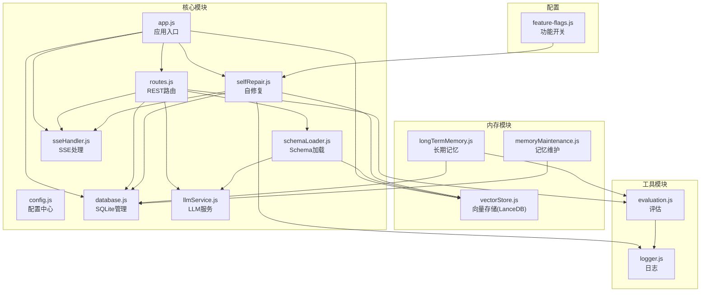
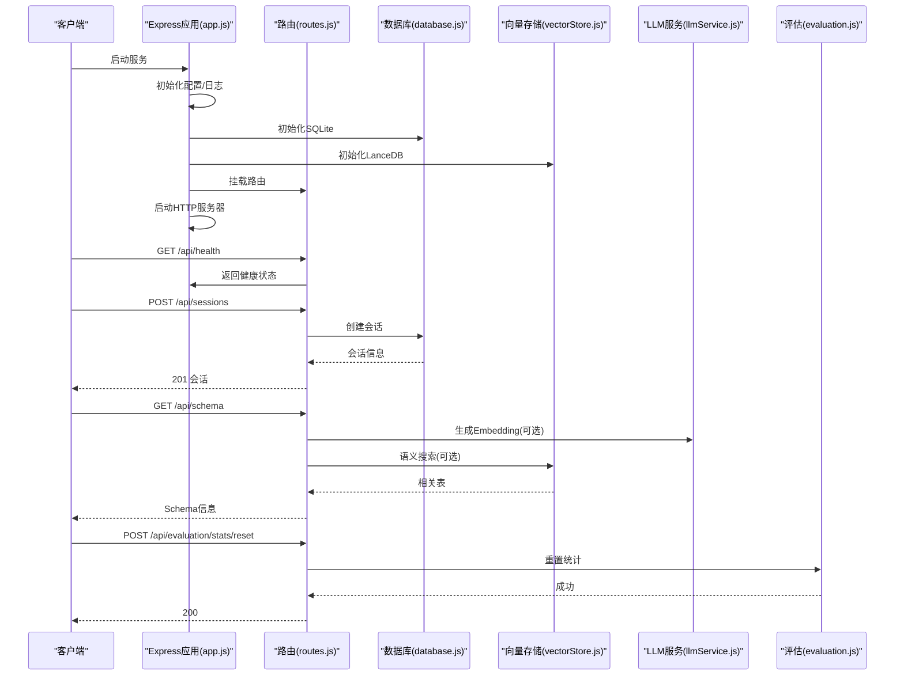
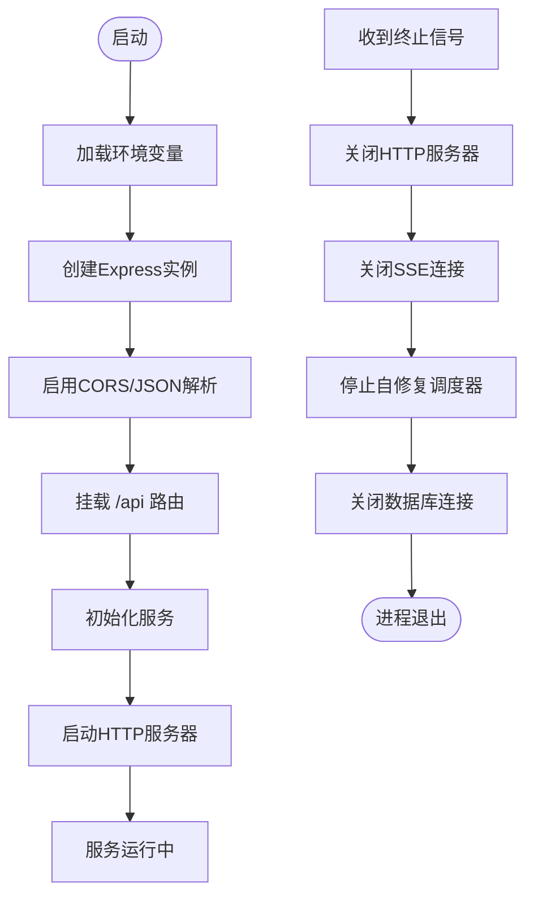
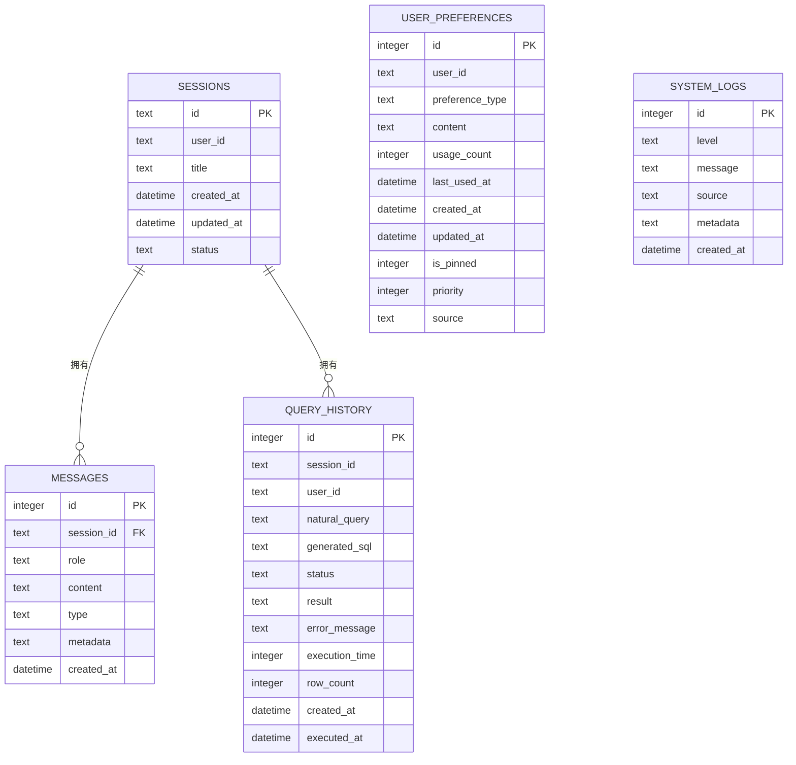
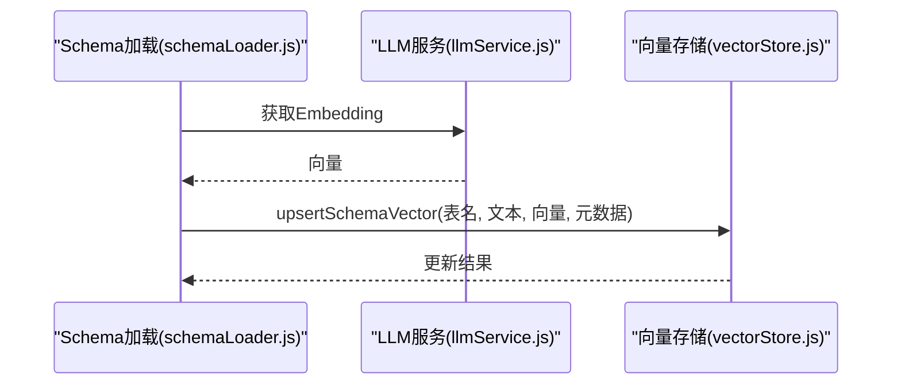
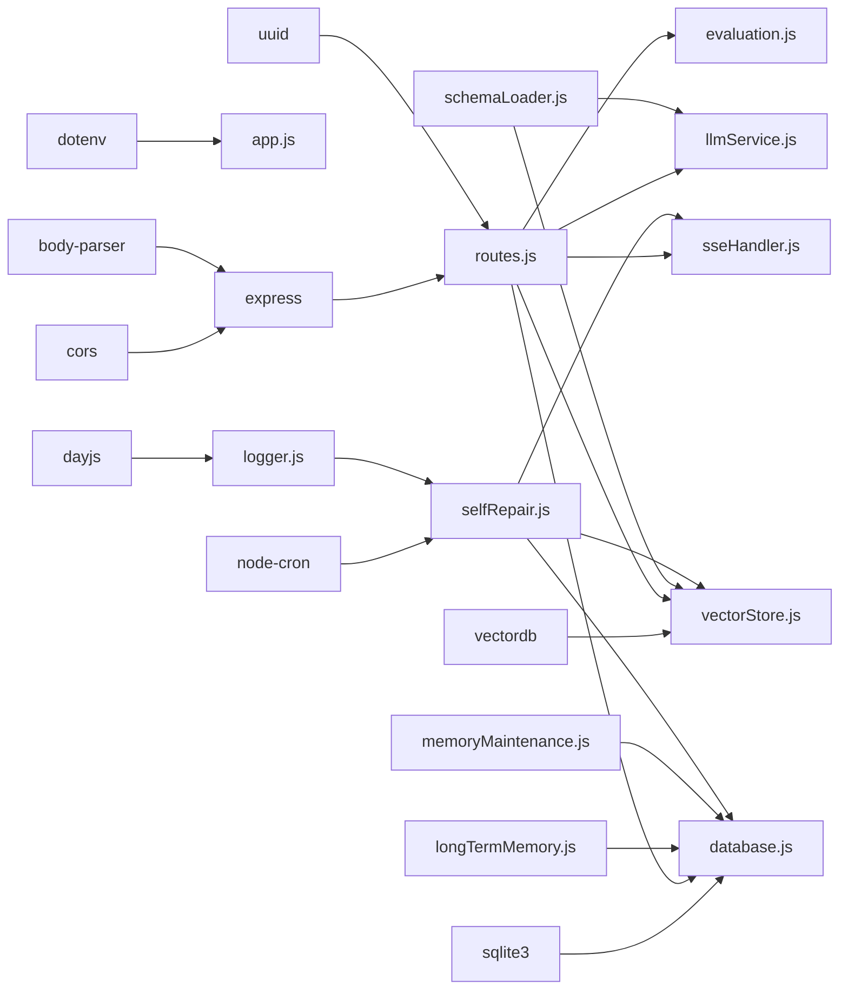

# 后端架构

<cite>
**本文档引用的文件**
- [app.js](file://backend/src/app.js)
- [routes.js](file://backend/src/core/routes.js)
- [config.js](file://backend/src/core/config.js)
- [database.js](file://backend/src/core/database.js)
- [vectorStore.js](file://backend/src/memory/vectorStore.js)
- [logger.js](file://backend/src/utils/logger.js)
- [schemaLoader.js](file://backend/src/core/schemaLoader.js)
- [llmService.js](file://backend/src/core/llmService.js)
- [longTermMemory.js](file://backend/src/memory/longTermMemory.js)
- [feature-flags.js](file://backend/config/feature-flags.js)
- [selfRepair.js](file://backend/src/core/selfRepair.js)
- [evaluation.js](file://backend/src/utils/evaluation.js)
- [sseHandler.js](file://backend/src/core/sseHandler.js)
- [memoryMaintenance.js](file://backend/src/memory/memoryMaintenance.js)
- [package.json](file://backend/package.json)
</cite>

## 目录
1. [简介](#简介)
2. [项目结构](#项目结构)
3. [核心组件](#核心组件)
4. [架构总览](#架构总览)
5. [详细组件分析](#详细组件分析)
6. [依赖关系分析](#依赖关系分析)
7. [性能考虑](#性能考虑)
8. [故障排查指南](#故障排查指南)
9. [结论](#结论)
10. [附录](#附录)

## 简介
本项目为NL2SQL自然语言转SQL的数据查询服务，采用基于Express.js的RESTful API架构，结合SQLite与LanceDB向量数据库，提供Schema探索、意图识别、查询生成与执行、长期记忆与评估等功能。系统通过模块化设计实现高内聚、低耦合，支持功能开关、自修复机制、SSE流式响应与完善的日志监控。

## 项目结构
后端采用按功能域划分的模块化组织方式：
- 核心模块：路由、配置、数据库、LLM服务、SSE处理、自修复、Schema加载等
- 内存模块：长期记忆、向量存储、记忆维护
- 工具模块：日志、评估
- 配置：功能开关、Schema元数据

**图表来源**
- [app.js:1-260](file://backend/src/app.js#L1-L260)
- [routes.js:1-1037](file://backend/src/core/routes.js#L1-L1037)
- [config.js:1-398](file://backend/src/core/config.js#L1-L398)
- [database.js:1-859](file://backend/src/core/database.js#L1-L859)
- [vectorStore.js:1-881](file://backend/src/memory/vectorStore.js#L1-L881)
- [logger.js:1-442](file://backend/src/utils/logger.js#L1-L442)
- [schemaLoader.js:1-1172](file://backend/src/core/schemaLoader.js#L1-L1172)
- [llmService.js:1-477](file://backend/src/core/llmService.js#L1-L477)
- [longTermMemory.js:1-1127](file://backend/src/memory/longTermMemory.js#L1-L1127)
- [feature-flags.js:1-249](file://backend/config/feature-flags.js#L1-L249)
- [selfRepair.js:1-489](file://backend/src/core/selfRepair.js#L1-L489)
- [evaluation.js:1-488](file://backend/src/utils/evaluation.js#L1-L488)
- [sseHandler.js:1-349](file://backend/src/core/sseHandler.js#L1-L349)
- [memoryMaintenance.js:1-418](file://backend/src/memory/memoryMaintenance.js#L1-L418)

**章节来源**
- [app.js:1-260](file://backend/src/app.js#L1-L260)
- [package.json:1-28](file://backend/package.json#L1-L28)

## 核心组件
- Express应用与中间件：CORS、JSON解析、路由挂载
- 配置中心：集中管理LLM、数据库、安全、会话、日志、评估等配置
- 数据库层：SQLite持久化会话、消息、查询历史、用户偏好
- 向量数据库：LanceDB存储Schema与查询向量，支持语义检索
- LLM服务：封装HTTP请求、重试、超时与流式响应
- Schema加载：加载元数据、构建映射、向量化、语义搜索
- 长期记忆：用户偏好抽取、存储、分级保留策略
- SSE处理：流式消息推送、进度回调、连接管理
- 自修复：定时任务、会话清理、健康检查、统计收集
- 评估：向量化质量评估、记忆命中率统计
- 日志：结构化日志、文件轮转、级别控制

**章节来源**
- [routes.js:1-1037](file://backend/src/core/routes.js#L1-L1037)
- [config.js:1-398](file://backend/src/core/config.js#L1-L398)
- [database.js:1-859](file://backend/src/core/database.js#L1-L859)
- [vectorStore.js:1-881](file://backend/src/memory/vectorStore.js#L1-L881)
- [llmService.js:1-477](file://backend/src/core/llmService.js#L1-L477)
- [schemaLoader.js:1-1172](file://backend/src/core/schemaLoader.js#L1-L1172)
- [longTermMemory.js:1-1127](file://backend/src/memory/longTermMemory.js#L1-L1127)
- [sseHandler.js:1-349](file://backend/src/core/sseHandler.js#L1-L349)
- [selfRepair.js:1-489](file://backend/src/core/selfRepair.js#L1-L489)
- [evaluation.js:1-488](file://backend/src/utils/evaluation.js#L1-L488)
- [logger.js:1-442](file://backend/src/utils/logger.js#L1-L442)

## 架构总览
系统采用“入口-中间件-路由-服务”的经典Express架构，配合模块化核心、内存与工具层，形成清晰的职责边界。服务启动时依次初始化数据目录、SQLite、LanceDB、Schema元数据、业务语义层、功能开关与自修复调度器，然后启动HTTP服务器与SSE端点。

**图表来源**
- [app.js:93-188](file://backend/src/app.js#L93-L188)
- [routes.js:72-137](file://backend/src/core/routes.js#L72-L137)
- [database.js:206-267](file://backend/src/core/database.js#L206-L267)
- [vectorStore.js:233-263](file://backend/src/memory/vectorStore.js#L233-L263)
- [llmService.js:222-308](file://backend/src/core/llmService.js#L222-L308)
- [evaluation.js:412-429](file://backend/src/utils/evaluation.js#L412-L429)

**章节来源**
- [app.js:93-188](file://backend/src/app.js#L93-L188)
- [routes.js:1-1037](file://backend/src/core/routes.js#L1-L1037)

## 详细组件分析

### Express应用与中间件体系
- 中间件：CORS允许跨域；body-parser解析JSON与URL编码请求体
- 路由挂载：所有API路由统一挂载至 /api 前缀
- 优雅关闭：监听SIGTERM/SIGINT，关闭HTTP、SSE、定时任务、数据库连接

**图表来源**
- [app.js:56-87](file://backend/src/app.js#L56-L87)
- [app.js:198-234](file://backend/src/app.js#L198-L234)

**章节来源**
- [app.js:56-87](file://backend/src/app.js#L56-L87)
- [app.js:198-234](file://backend/src/app.js#L198-L234)

### REST API路由设计与请求处理
- 健康检查：/api/health、/api/health/detail
- Schema接口：/api/schema、/api/schema/tables/:tableName、/api/schema/search
- 会话管理：/api/sessions、/api/sessions/:sessionId、/api/sessions/:sessionId/messages、/api/users/:userId/sessions
- 查询历史：/api/queries/history
- 用户偏好（长期记忆）：/api/preferences/:userId/raw、/api/preferences/:userId/stats、/api/preferences/:userId、/api/preferences/:userId/templates、/api/preferences/:userId/learn-alias、/api/preferences/:preferenceId
- 评估接口：/api/evaluation/stats、/api/evaluation/stats/reset、/api/evaluation/schema-quality

请求处理流程：
- 路由层校验参数与权限
- 调用核心服务（数据库、Schema、LLM、向量存储）
- 统一返回JSON响应，错误时记录日志并返回相应状态码

**章节来源**
- [routes.js:60-137](file://backend/src/core/routes.js#L60-L137)
- [routes.js:143-250](file://backend/src/core/routes.js#L143-L250)
- [routes.js:256-398](file://backend/src/core/routes.js#L256-L398)
- [routes.js:404-760](file://backend/src/core/routes.js#L404-L760)
- [routes.js:721-800](file://backend/src/core/routes.js#L721-L800)

### 配置管理模块
- 集中管理：端口、环境、LLM/API、Embedding、数据库、安全、会话、日志、自修复、Schema、长期记忆、上下文管理、评估
- 配置验证：启动时校验必要配置（如LLM API密钥、SR数据库URL）
- 功能开关：通过环境变量控制Phase 1-4功能启用

**章节来源**
- [config.js:16-395](file://backend/src/core/config.js#L16-L395)
- [config.js:366-388](file://backend/src/core/config.js#L366-L388)
- [feature-flags.js:16-96](file://backend/config/feature-flags.js#L16-L96)

### 数据库层设计（SQLite）
- 表结构：sessions、messages、query_history、user_preferences、system_logs
- 初始化：创建表与索引，启用外键约束，执行迁移修复
- 操作方法：query、queryOne、run、transaction
- 会话与消息：创建、查询、更新、删除
- 长期记忆：偏好存储、使用统计、查找与删除
- 安全：白名单表访问、禁止关键字、最大返回行数、查询超时

**图表来源**
- [database.js:39-195](file://backend/src/core/database.js#L39-L195)
- [database.js:467-550](file://backend/src/core/database.js#L467-L550)
- [database.js:618-772](file://backend/src/core/database.js#L618-L772)

**章节来源**
- [database.js:206-267](file://backend/src/core/database.js#L206-L267)
- [database.js:364-454](file://backend/src/core/database.js#L364-L454)
- [database.js:467-550](file://backend/src/core/database.js#L467-L550)
- [database.js:618-772](file://backend/src/core/database.js#L618-L772)

### 向量数据库集成（LanceDB）
- 初始化：连接数据库目录，创建schema_vectors与query_vectors表
- Schema向量：表级表征文本、元数据（域、类型、关键特征）、智能搜索与重排序
- 查询历史向量：相似查询检索
- 统计：表统计、存在性检查、增量更新（基于内容Hash）

**图表来源**
- [schemaLoader.js:201-276](file://backend/src/core/schemaLoader.js#L201-L276)
- [llmService.js:369-424](file://backend/src/core/llmService.js#L369-L424)
- [vectorStore.js:799-800](file://backend/src/memory/vectorStore.js#L799-L800)

**章节来源**
- [vectorStore.js:233-263](file://backend/src/memory/vectorStore.js#L233-L263)
- [vectorStore.js:338-369](file://backend/src/memory/vectorStore.js#L338-L369)
- [vectorStore.js:452-538](file://backend/src/memory/vectorStore.js#L452-L538)
- [schemaLoader.js:201-276](file://backend/src/core/schemaLoader.js#L201-L276)

### LLM服务与工具链
- HTTP封装：统一POST请求、超时、错误处理、流式响应
- 重试机制：withRetry、sleep
- 工具定义：createToolDefinition
- 简单对话：simpleChat
- Embedding：getEmbedding

**章节来源**
- [llmService.js:41-152](file://backend/src/core/llmService.js#L41-L152)
- [llmService.js:167-206](file://backend/src/core/llmService.js#L167-L206)
- [llmService.js:222-308](file://backend/src/core/llmService.js#L222-L308)
- [llmService.js:369-424](file://backend/src/core/llmService.js#L369-L424)

### 长期记忆与记忆维护
- 偏好提取：查询模式、字段别名、指标/维度偏好
- 存储策略：置信度阈值、频率阈值、模板阈值、使用次数与最近使用时间
- 分级保留：高频永久、中频90天、低频30天、字段别名365天
- 记忆压缩：按用户清理过期偏好、统计保留数量、合并相似模式

**章节来源**
- [longTermMemory.js:313-471](file://backend/src/memory/longTermMemory.js#L313-L471)
- [longTermMemory.js:480-592](file://backend/src/memory/longTermMemory.js#L480-L592)
- [memoryMaintenance.js:69-120](file://backend/src/memory/memoryMaintenance.js#L69-L120)
- [memoryMaintenance.js:127-192](file://backend/src/memory/memoryMaintenance.js#L127-L192)

### SSE流式处理
- 连接管理：建立、关闭、错误处理、连接数统计
- 查询处理：进度回调、结果广播、错误广播
- 与NL2SQL引擎协作：处理用户查询并流式返回进度与结果

**章节来源**
- [sseHandler.js:43-112](file://backend/src/core/sseHandler.js#L43-L112)
- [sseHandler.js:218-280](file://backend/src/core/sseHandler.js#L218-L280)
- [sseHandler.js:291-330](file://backend/src/core/sseHandler.js#L291-L330)

### 自修复与监控
- 定时任务：每日自检、会话清理、统计收集、记忆维护
- 健康检查：数据库、向量库、查询统计、连接数、系统资源
- 记忆维护：压缩用户偏好、合并相似模式、生成健康报告

**章节来源**
- [selfRepair.js:60-125](file://backend/src/core/selfRepair.js#L60-L125)
- [selfRepair.js:169-310](file://backend/src/core/selfRepair.js#L169-L310)
- [selfRepair.js:341-373](file://backend/src/core/selfRepair.js#L341-L373)
- [selfRepair.js:383-415](file://backend/src/core/selfRepair.js#L383-L415)

### 评估与统计
- 向量化质量评估：Schema表检索精度、查询相似度
- 运行时统计：向量检索命中率、距离分布、长期记忆命中率
- 报表导出：完整统计报告、重置统计

**章节来源**
- [evaluation.js:158-266](file://backend/src/utils/evaluation.js#L158-L266)
- [evaluation.js:276-334](file://backend/src/utils/evaluation.js#L276-L334)
- [evaluation.js:397-429](file://backend/src/utils/evaluation.js#L397-L429)

## 依赖关系分析
- 外部依赖：Express、vectordb、sqlite3、dotenv、cors、body-parser、uuid、dayjs、node-cron
- 内部依赖：核心模块相互协作，内存模块依赖数据库与向量存储，工具模块被广泛使用

**图表来源**
- [package.json:10-27](file://backend/package.json#L10-L27)
- [app.js:22-48](file://backend/src/app.js#L22-L48)
- [routes.js:16-30](file://backend/src/core/routes.js#L16-L30)

**章节来源**
- [package.json:10-27](file://backend/package.json#L10-L27)

## 性能考虑
- 数据库优化：为常用查询字段建立索引，启用外键约束，事务批量操作
- 向量检索：表级向量减少存储与计算成本，智能搜索与重排序提升命中质量
- LLM调用：超时与重试机制，Embedding维度与批量处理
- SSE：禁用缓冲，及时清理过期连接
- 评估统计：仅在启用时记录，避免影响主流程

## 故障排查指南
- 启动失败：检查 .env 配置、端口占用、数据目录权限
- 数据库异常：确认SQLite文件路径、表结构与迁移是否成功
- 向量库异常：确认LanceDB目录存在、表初始化状态
- LLM调用失败：检查API密钥、超时设置、网络连通性
- SSE连接问题：确认会话存在、客户端SSE支持、Nginx缓冲设置
- 自修复任务：检查Cron表达式、任务日志、系统资源

**章节来源**
- [app.js:182-187](file://backend/src/app.js#L182-L187)
- [config.js:366-388](file://backend/src/core/config.js#L366-L388)
- [database.js:234-242](file://backend/src/core/database.js#L234-L242)
- [vectorStore.js:240-262](file://backend/src/memory/vectorStore.js#L240-L262)
- [llmService.js:135-151](file://backend/src/core/llmService.js#L135-L151)
- [sseHandler.js:104-112](file://backend/src/core/sseHandler.js#L104-L112)
- [selfRepair.js:131-159](file://backend/src/core/selfRepair.js#L131-L159)

## 结论
本NL2SQL后端服务通过模块化设计实现了清晰的职责分离与可扩展性，结合SQLite与LanceDB在数据与向量层面提供高效存储与检索能力，配合LLM服务、长期记忆与SSE流式处理，形成完整的自然语言到SQL的处理闭环。完善的配置中心、功能开关、自修复与评估机制保障了系统的稳定性与可观测性，适合在生产环境中部署与演进。

## 附录
- 环境变量与功能开关：通过 .env 与 feature-flags.js 控制运行行为
- 日志配置：支持文件轮转、级别控制、结构化输出
- 安全配置：白名单表、禁止关键字、最大返回行数、查询超时、脱敏字段

**章节来源**
- [feature-flags.js:209-229](file://backend/config/feature-flags.js#L209-L229)
- [logger.js:54-85](file://backend/src/utils/logger.js#L54-L85)
- [config.js:140-170](file://backend/src/core/config.js#L140-L170)