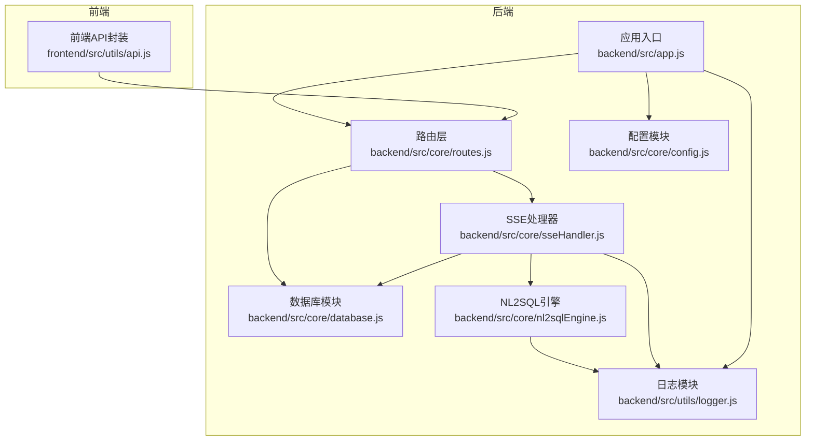
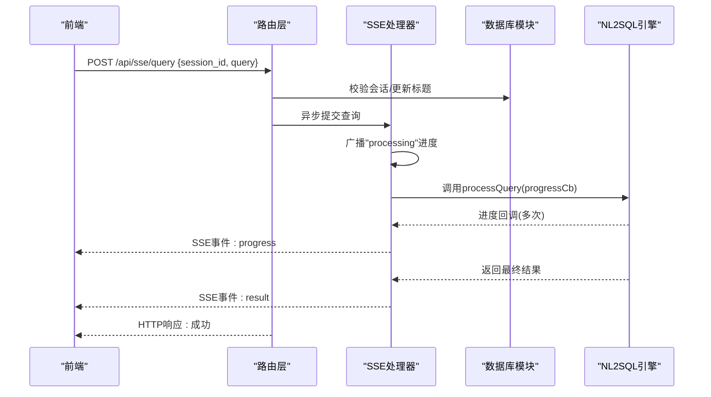
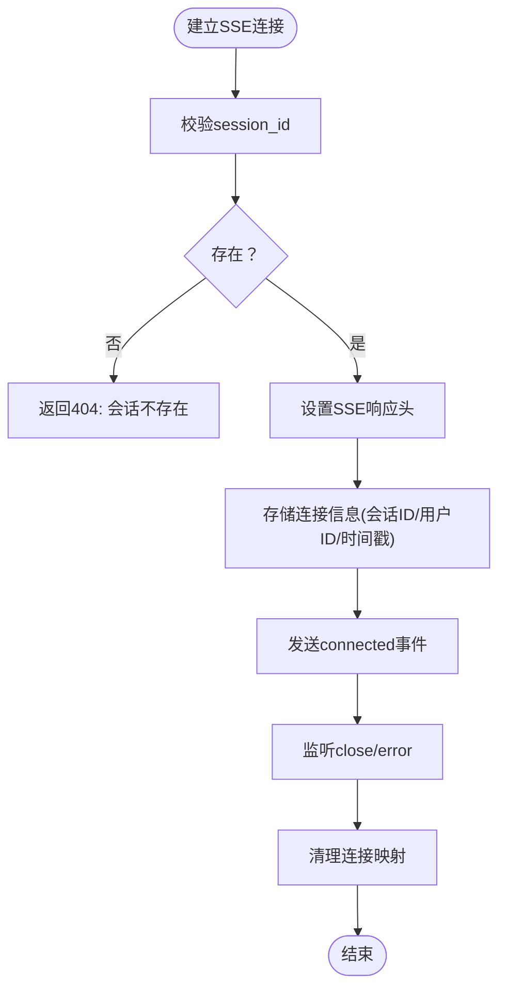
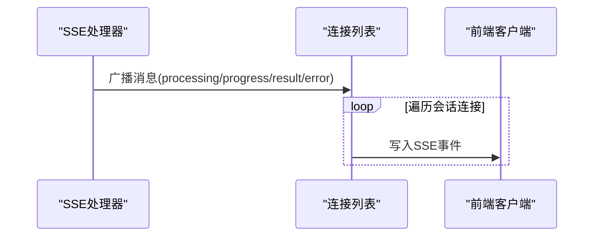
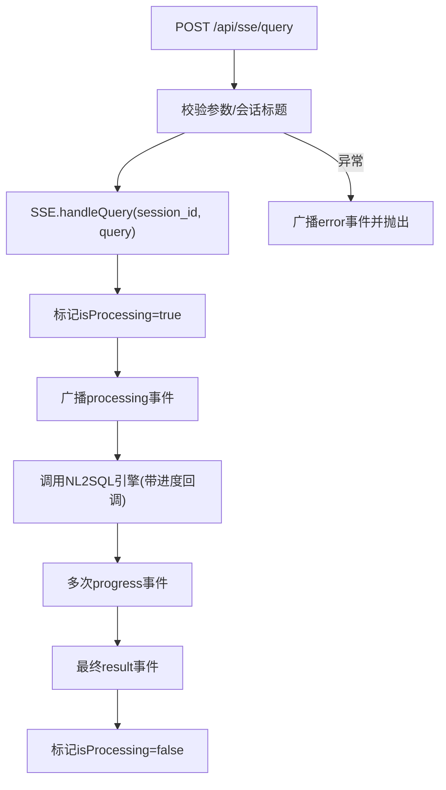
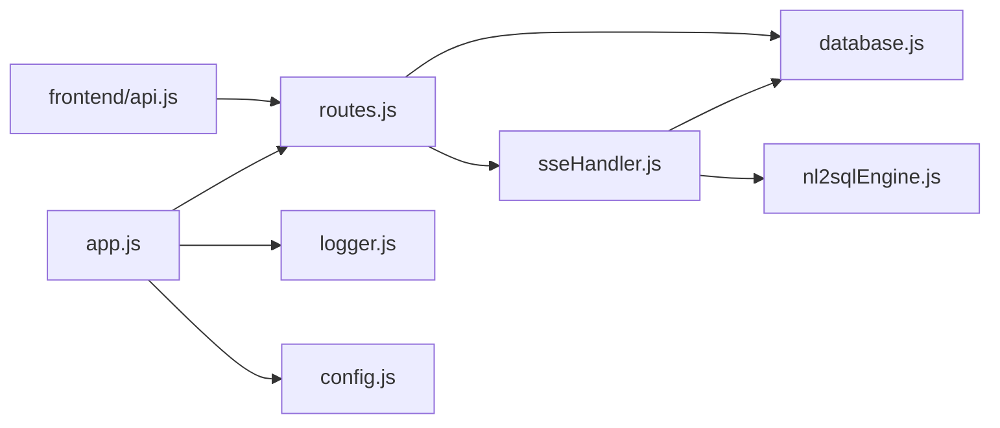

# 实时通信系统

<cite>
**本文引用的文件**
- [backend/src/core/sseHandler.js](file://backend/src/core/sseHandler.js)
- [backend/src/core/routes.js](file://backend/src/core/routes.js)
- [backend/src/app.js](file://backend/src/app.js)
- [backend/src/utils/logger.js](file://backend/src/utils/logger.js)
- [backend/src/core/config.js](file://backend/src/core/config.js)
- [backend/src/core/database.js](file://backend/src/core/database.js)
- [backend/src/core/nl2sqlEngine.js](file://backend/src/core/nl2sqlEngine.js)
- [frontend/src/utils/api.js](file://frontend/src/utils/api.js)
- [backend/package.json](file://backend/package.json)
- [backend/config/schema-metadata.json](file://backend/config/schema-metadata.json)
</cite>

## 目录
1. [简介](#简介)
2. [项目结构](#项目结构)
3. [核心组件](#核心组件)
4. [架构总览](#架构总览)
5. [详细组件分析](#详细组件分析)
6. [依赖关系分析](#依赖关系分析)
7. [性能考量](#性能考量)
8. [故障排查指南](#故障排查指南)
9. [结论](#结论)
10. [附录](#附录)

## 简介
本技术文档聚焦于 NL2SQL 实时通信系统中的 Server-Sent Events（SSE）实现，系统通过 SSE 实现实时状态更新、进度报告与结果流式传输。文档覆盖连接管理、事件流处理、客户端生命周期、查询执行过程中的实时反馈、心跳与重连策略、错误处理与恢复、性能优化、安全与集成实践等内容，帮助开发者与运维人员快速理解并高效部署该系统。

## 项目结构
后端采用 Express + Node.js，SSE 通过独立处理器模块与路由层协作，配合数据库与 NL2SQL 引擎实现端到端的实时查询体验。前端通过 Axios 封装 API，统一处理请求与错误。

图表来源
- [backend/src/app.js:1-238](file://backend/src/app.js#L1-L238)
- [backend/src/core/routes.js:1-1037](file://backend/src/core/routes.js#L1-L1037)
- [backend/src/core/sseHandler.js:1-349](file://backend/src/core/sseHandler.js#L1-L349)
- [backend/src/utils/logger.js:1-442](file://backend/src/utils/logger.js#L1-L442)
- [backend/src/core/config.js:1-398](file://backend/src/core/config.js#L1-L398)
- [backend/src/core/database.js:1-200](file://backend/src/core/database.js#L1-L200)
- [backend/src/core/nl2sqlEngine.js:1-200](file://backend/src/core/nl2sqlEngine.js#L1-L200)
- [frontend/src/utils/api.js:1-303](file://frontend/src/utils/api.js#L1-L303)

章节来源
- [backend/src/app.js:1-238](file://backend/src/app.js#L1-L238)
- [backend/src/core/routes.js:1-1037](file://backend/src/core/routes.js#L1-L1037)
- [frontend/src/utils/api.js:1-303](file://frontend/src/utils/api.js#L1-L303)

## 核心组件
- SSE 处理器：负责连接建立、消息发送、广播、连接清理与统计。
- 路由层：暴露 SSE 连接与查询提交端点，校验参数并协调数据库与 SSE。
- 应用入口：初始化配置、数据库、向量库、Schema 元数据，启动 HTTP 服务器与优雅关闭。
- 日志模块：统一日志格式、文件轮转与事件派发，支撑调试与审计。
- 配置模块：集中管理端口、LLM、数据库、安全、日志、自修复等配置。
- 数据库模块：SQLite 会话与消息持久化，支持会话、消息、查询历史、偏好与系统日志。
- NL2SQL 引擎：意图识别、澄清、SQL 生成、验证与结果格式化，支持进度回调。

章节来源
- [backend/src/core/sseHandler.js:1-349](file://backend/src/core/sseHandler.js#L1-L349)
- [backend/src/core/routes.js:944-1002](file://backend/src/core/routes.js#L944-L1002)
- [backend/src/app.js:93-166](file://backend/src/app.js#L93-L166)
- [backend/src/utils/logger.js:1-442](file://backend/src/utils/logger.js#L1-L442)
- [backend/src/core/config.js:1-398](file://backend/src/core/config.js#L1-L398)
- [backend/src/core/database.js:1-200](file://backend/src/core/database.js#L1-L200)
- [backend/src/core/nl2sqlEngine.js:1-200](file://backend/src/core/nl2sqlEngine.js#L1-L200)

## 架构总览
SSE 实时通信链路如下：
- 前端通过 POST 提交查询，后端异步处理并通过 SSE 推送状态与结果。
- SSE 连接建立后，后端发送“已连接”消息，随后按进度与结果推送事件。
- 查询处理由 NL2SQL 引擎驱动，期间通过进度回调持续广播进度事件。
- 连接生命周期由 SSE 处理器管理，支持多标签页连接与清理。

图表来源
- [backend/src/core/routes.js:961-1002](file://backend/src/core/routes.js#L961-L1002)
- [backend/src/core/sseHandler.js:218-280](file://backend/src/core/sseHandler.js#L218-L280)
- [backend/src/core/nl2sqlEngine.js:1-200](file://backend/src/core/nl2sqlEngine.js#L1-L200)

## 详细组件分析

### SSE 连接管理与生命周期
- 连接建立：路由层接收 GET /api/sse/stream，携带 session_id 与可选 user_id，校验后设置 SSE 响应头并创建连接信息。
- 多连接支持：同一会话允许多个标签页连接，内部以 Map 以 sessionId 为键维护连接列表。
- 生命周期事件：监听 close 与 error，清理连接映射；记录连接建立/关闭/错误日志。
- 连接清理：当某 sessionId 的连接列表为空时，删除该键，避免内存泄漏。

图表来源
- [backend/src/core/routes.js:948-959](file://backend/src/core/routes.js#L948-L959)
- [backend/src/core/sseHandler.js:43-112](file://backend/src/core/sseHandler.js#L43-L112)
- [backend/src/core/sseHandler.js:119-137](file://backend/src/core/sseHandler.js#L119-L137)

章节来源
- [backend/src/core/routes.js:948-959](file://backend/src/core/routes.js#L948-L959)
- [backend/src/core/sseHandler.js:26-31](file://backend/src/core/sseHandler.js#L26-L31)
- [backend/src/core/sseHandler.js:43-112](file://backend/src/core/sseHandler.js#L43-L112)
- [backend/src/core/sseHandler.js:119-137](file://backend/src/core/sseHandler.js#L119-L137)

### 事件流处理与消息广播
- 单连接消息发送：将消息对象序列化为 JSON，按 SSE 格式写入响应流，并更新最后活跃时间。
- 广播机制：针对同一会话的所有连接逐一发送，保证多标签页同步接收。
- 错误消息：统一以 type: error 的事件格式推送，便于前端识别与处理。
- 进度回调：查询处理阶段通过进度回调广播 progress 事件，前端可实时显示处理阶段与百分比。

图表来源
- [backend/src/core/sseHandler.js:165-176](file://backend/src/core/sseHandler.js#L165-L176)
- [backend/src/core/sseHandler.js:197-204](file://backend/src/core/sseHandler.js#L197-L204)
- [backend/src/core/sseHandler.js:184-189](file://backend/src/core/sseHandler.js#L184-L189)

章节来源
- [backend/src/core/sseHandler.js:165-176](file://backend/src/core/sseHandler.js#L165-L176)
- [backend/src/core/sseHandler.js:197-204](file://backend/src/core/sseHandler.js#L197-L204)
- [backend/src/core/sseHandler.js:184-189](file://backend/src/core/sseHandler.js#L184-L189)

### 查询执行与实时状态更新
- 查询提交：POST /api/sse/query 校验 session_id 与 query，若会话标题为默认则更新为查询内容前缀。
- 并发控制：同一会话仅允许一个请求处于处理中，避免并发冲突。
- 进度与结果：调用 NL2SQL 引擎处理查询，期间通过进度回调广播 progress 事件；完成后广播 result 事件。
- 错误处理：捕获异常并广播 error 事件，同时抛出错误以便上层处理。

图表来源
- [backend/src/core/routes.js:972-1002](file://backend/src/core/routes.js#L972-L1002)
- [backend/src/core/sseHandler.js:218-280](file://backend/src/core/sseHandler.js#L218-L280)
- [backend/src/core/nl2sqlEngine.js:1-200](file://backend/src/core/nl2sqlEngine.js#L1-L200)

章节来源
- [backend/src/core/routes.js:972-1002](file://backend/src/core/routes.js#L972-L1002)
- [backend/src/core/sseHandler.js:218-280](file://backend/src/core/sseHandler.js#L218-L280)

### 客户端连接生命周期与多标签页支持
- 多标签页：同一会话可同时打开多个标签页，每个标签页对应一个连接对象，广播时遍历该会话下的所有连接。
- 生命周期：连接建立后记录时间戳；close/error 时清理；连接数统计用于健康检查与运维监控。
- 会话维度：连接映射以 sessionId 为键，支持按会话维度进行广播与清理。

章节来源
- [backend/src/core/sseHandler.js:26-31](file://backend/src/core/sseHandler.js#L26-L31)
- [backend/src/core/sseHandler.js:197-204](file://backend/src/core/sseHandler.js#L197-L204)
- [backend/src/core/sseHandler.js:291-318](file://backend/src/core/sseHandler.js#L291-L318)

### 心跳检测、重连机制与错误处理
- 心跳检测：SSE 通过 keep-alive 与 no-cache 响应头维持连接，后端记录最后活跃时间；前端可基于事件到达时间判断心跳。
- 重连机制：前端可在连接断开后根据会话ID重新发起 GET /api/sse/stream；若会话仍有效，后端会重建连接并继续推送后续事件。
- 错误处理：SSE 层捕获连接关闭与错误事件，记录日志并清理连接；查询阶段异常通过 error 事件通知前端。

章节来源
- [backend/src/core/sseHandler.js:64-70](file://backend/src/core/sseHandler.js#L64-L70)
- [backend/src/core/sseHandler.js:104-111](file://backend/src/core/sseHandler.js#L104-L111)
- [backend/src/core/sseHandler.js:145-153](file://backend/src/core/sseHandler.js#L145-L153)

### 与其他模块的集成与最佳实践
- 与数据库集成：SSE 查询提交前校验会话，必要时更新会话标题；查询历史与消息持久化由数据库模块负责。
- 与 NL2SQL 引擎集成：查询处理由引擎驱动，SSE 仅负责事件推送；进度回调与最终结果通过广播传递。
- 与前端集成：前端通过 /api/sse/stream 建立连接，通过 /api/sse/query 提交查询；API 封装统一处理请求与错误。

章节来源
- [backend/src/core/routes.js:948-1002](file://backend/src/core/routes.js#L948-L1002)
- [backend/src/core/database.js:1-200](file://backend/src/core/database.js#L1-L200)
- [backend/src/core/nl2sqlEngine.js:1-200](file://backend/src/core/nl2sqlEngine.js#L1-L200)
- [frontend/src/utils/api.js:246-251](file://frontend/src/utils/api.js#L246-L251)

## 依赖关系分析
- 模块耦合：SSE 处理器依赖数据库与 NL2SQL 引擎；路由层依赖 SSE 处理器与数据库；应用入口依赖配置、日志与数据库初始化。
- 外部依赖：Express、CORS、body-parser、sqlite3、dotenv、uuid、node-cron 等。
- 配置集中：配置模块集中管理端口、LLM、数据库、安全、日志、自修复等，便于运维与扩展。

图表来源
- [backend/src/app.js:1-238](file://backend/src/app.js#L1-L238)
- [backend/src/core/routes.js:1-1037](file://backend/src/core/routes.js#L1-L1037)
- [backend/src/core/sseHandler.js:1-349](file://backend/src/core/sseHandler.js#L1-L349)
- [backend/src/core/database.js:1-200](file://backend/src/core/database.js#L1-L200)
- [backend/src/core/nl2sqlEngine.js:1-200](file://backend/src/core/nl2sqlEngine.js#L1-L200)
- [backend/src/utils/logger.js:1-442](file://backend/src/utils/logger.js#L1-L442)
- [backend/src/core/config.js:1-398](file://backend/src/core/config.js#L1-L398)
- [frontend/src/utils/api.js:1-303](file://frontend/src/utils/api.js#L1-L303)

章节来源
- [backend/src/app.js:1-238](file://backend/src/app.js#L1-L238)
- [backend/src/core/routes.js:1-1037](file://backend/src/core/routes.js#L1-L1037)
- [backend/src/core/sseHandler.js:1-349](file://backend/src/core/sseHandler.js#L1-L349)
- [backend/src/core/database.js:1-200](file://backend/src/core/database.js#L1-L200)
- [backend/src/core/nl2sqlEngine.js:1-200](file://backend/src/core/nl2sqlEngine.js#L1-L200)
- [backend/src/utils/logger.js:1-442](file://backend/src/utils/logger.js#L1-L442)
- [backend/src/core/config.js:1-398](file://backend/src/core/config.js#L1-L398)
- [frontend/src/utils/api.js:1-303](file://frontend/src/utils/api.js#L1-L303)

## 性能考量
- 连接池管理：数据库连接池配置在配置模块中集中管理，建议结合负载与查询特征调整最小/最大连接数与超时参数。
- 背压处理：SSE 写入采用逐连接广播，建议在高并发场景下限制单会话连接数或引入队列缓冲。
- 内存优化：连接映射以 sessionId 为键，关闭/错误时及时清理；日志文件轮转避免磁盘占用过大。
- 响应头优化：SSE 响应头设置 no-cache 与 X-Accel-Buffering=no，避免代理层缓冲导致延迟。
- 查询超时与行数限制：配置模块提供查询超时与最大返回行数限制，防止大查询造成资源耗尽。

章节来源
- [backend/src/core/config.js:115-130](file://backend/src/core/config.js#L115-L130)
- [backend/src/core/config.js:150-157](file://backend/src/core/config.js#L150-L157)
- [backend/src/core/sseHandler.js:64-70](file://backend/src/core/sseHandler.js#L64-L70)
- [backend/src/utils/logger.js:134-166](file://backend/src/utils/logger.js#L134-L166)

## 故障排查指南
- 健康检查：/api/health 与 /api/health/detail 提供服务状态与组件状态，包括 SSE 连接数。
- 日志定位：SSE 连接建立/关闭/错误均有日志记录，结合日志级别与文件轮转定位问题。
- 连接异常：检查会话是否存在、SSE 响应头设置、Nginx/Apache 是否启用缓冲。
- 查询异常：查看进度事件与错误事件，确认 NL2SQL 引擎是否抛出异常；检查数据库连接与权限。
- 前端重连：前端应在连接断开后根据会话ID重新发起连接；若会话已过期需先创建新会话。

章节来源
- [backend/src/core/routes.js:59-137](file://backend/src/core/routes.js#L59-L137)
- [backend/src/utils/logger.js:263-309](file://backend/src/utils/logger.js#L263-L309)
- [backend/src/core/sseHandler.js:56-62](file://backend/src/core/sseHandler.js#L56-L62)
- [backend/src/core/sseHandler.js:145-153](file://backend/src/core/sseHandler.js#L145-L153)

## 结论
NL2SQL 实时通信系统通过 SSE 实现了从查询提交到结果推送的全链路实时化，具备良好的连接生命周期管理、事件流广播与错误处理能力。结合配置中心化、日志统一化与数据库持久化，系统在可维护性与可观测性方面表现良好。建议在生产环境中进一步完善认证授权、CORS 与 TLS 加密策略，并根据业务负载优化连接池与背压处理。

## 附录
- 端点一览
  - GET /api/sse/stream：建立 SSE 连接（查询参数：session_id, user_id）
  - POST /api/sse/query：提交查询（请求体：session_id, query）
  - GET /api/health：健康检查
  - GET /api/health/detail：详细健康检查（包含 SSE 连接数）
- 前端调用参考
  - 通过 /api/sse/stream 建立连接
  - 通过 /api/sse/query 提交查询
  - 统一错误处理与拦截器封装

章节来源
- [backend/src/core/routes.js:948-1002](file://backend/src/core/routes.js#L948-L1002)
- [frontend/src/utils/api.js:246-251](file://frontend/src/utils/api.js#L246-L251)