# 应用入口与初始化

<cite>
**本文档引用的文件**
- [app.js](file://backend/src/app.js)
- [config.js](file://backend/src/core/config.js)
- [logger.js](file://backend/src/utils/logger.js)
- [schemaLoader.js](file://backend/src/core/schemaLoader.js)
- [selfRepair.js](file://backend/src/core/selfRepair.js)
- [vectorStore.js](file://backend/src/memory/vectorStore.js)
- [database.js](file://backend/src/core/database.js)
- [package.json](file://backend/package.json)
- [schema-metadata.example.json](file://backend/config/schema-metadata.example.json)
</cite>

## 目录
1. [简介](#简介)
2. [项目结构](#项目结构)
3. [核心组件](#核心组件)
4. [架构概览](#架构概览)
5. [详细组件分析](#详细组件分析)
6. [依赖关系分析](#依赖关系分析)
7. [性能考虑](#性能考虑)
8. [故障排除指南](#故障排除指南)
9. [结论](#结论)

## 简介

NL2SQL 应用入口与初始化模块是整个后端服务的核心启动组件，负责应用程序的完整生命周期管理。该模块采用模块化设计，通过精心组织的初始化流程确保所有依赖组件能够正确启动和协作。

本模块的主要职责包括：
- 环境变量加载与配置管理
- Express 应用创建与中间件配置
- 核心模块的有序初始化
- 资源管理和优雅关闭机制
- 启动日志记录与错误处理

## 项目结构

NL2SQL 项目的后端采用清晰的分层架构，主要目录结构如下：

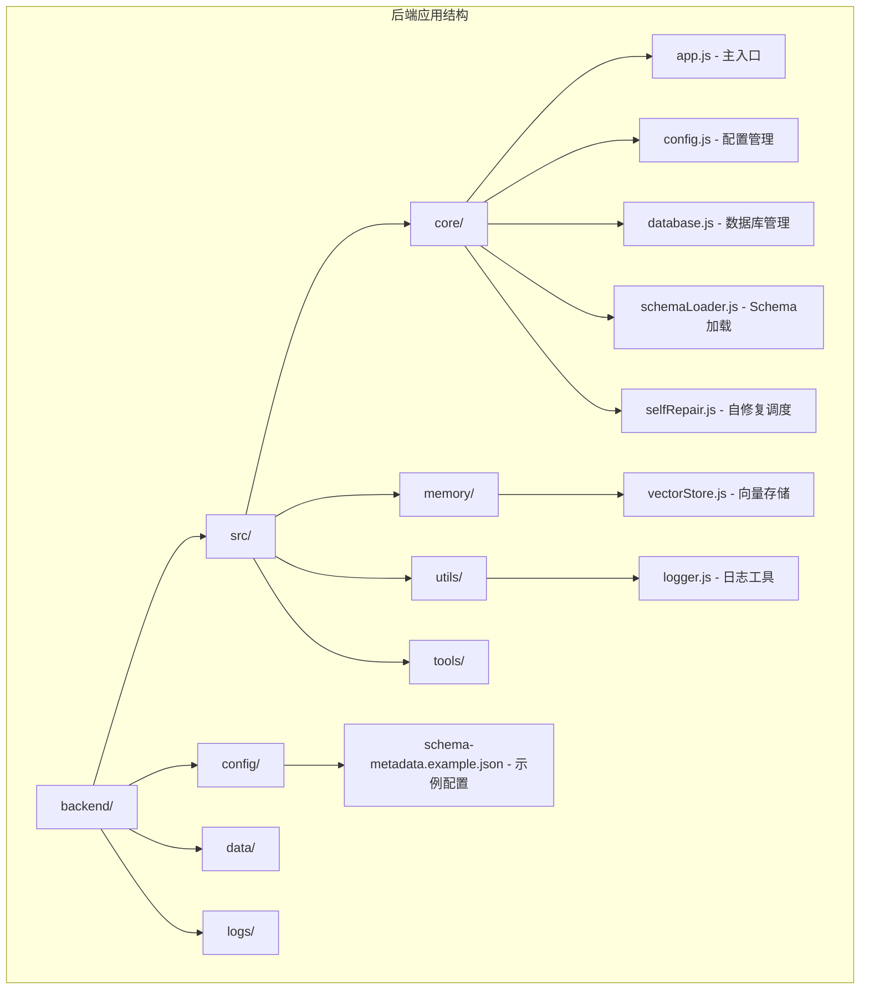

**图表来源**
- [app.js:1-238](file://backend/src/app.js#L1-L238)
- [config.js:1-398](file://backend/src/core/config.js#L1-L398)

**章节来源**
- [app.js:1-238](file://backend/src/app.js#L1-L238)
- [package.json:1-28](file://backend/package.json#L1-L28)

## 核心组件

### 主入口模块 (app.js)

主入口模块是整个应用的启动中心，采用模块化设计模式，将不同的功能职责分离到独立的模块中。

#### 环境变量加载机制

应用使用 dotenv 库从 .env 文件加载环境变量，确保配置的集中管理和安全性：

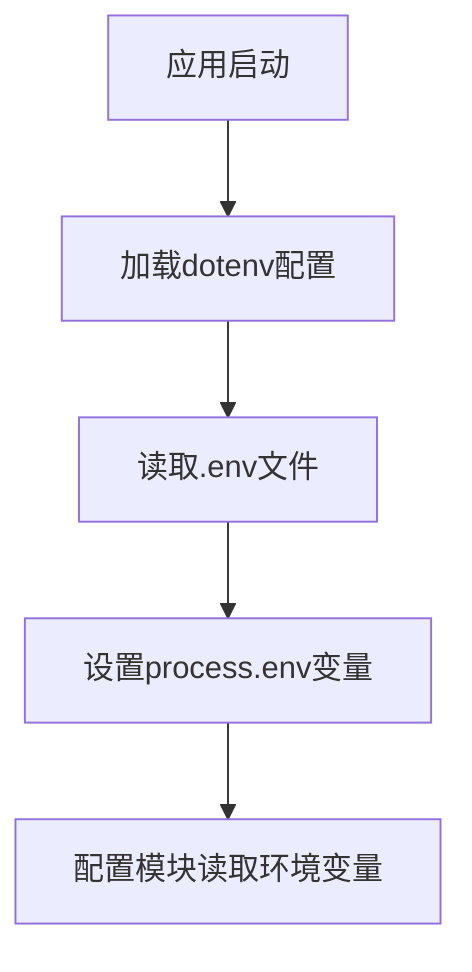

**图表来源**
- [app.js:15-16](file://backend/src/app.js#L15-L16)

#### Express 应用创建

应用创建了一个标准的 Express 应用实例，并配置了必要的中间件：

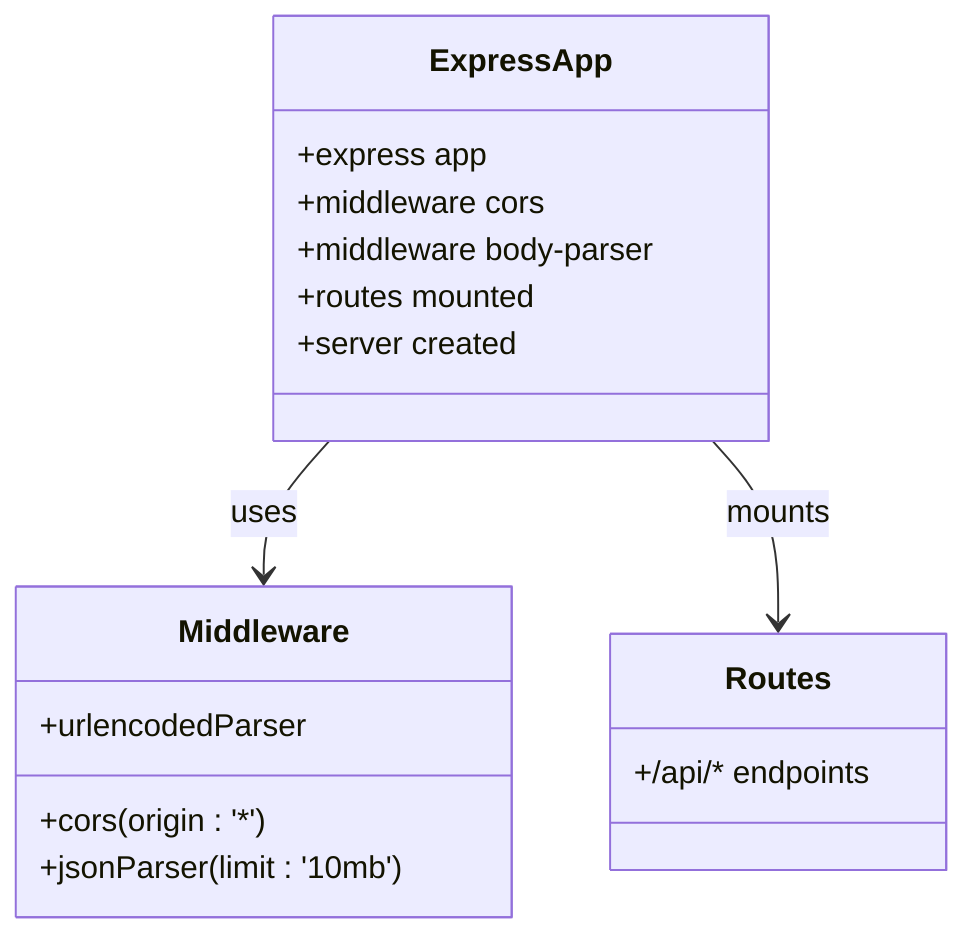

**图表来源**
- [app.js:22-80](file://backend/src/app.js#L22-L80)

**章节来源**
- [app.js:15-80](file://backend/src/app.js#L15-L80)

### 配置管理模块 (config.js)

配置管理模块提供了统一的配置访问接口，支持多种配置类型的管理：

#### 配置分类结构

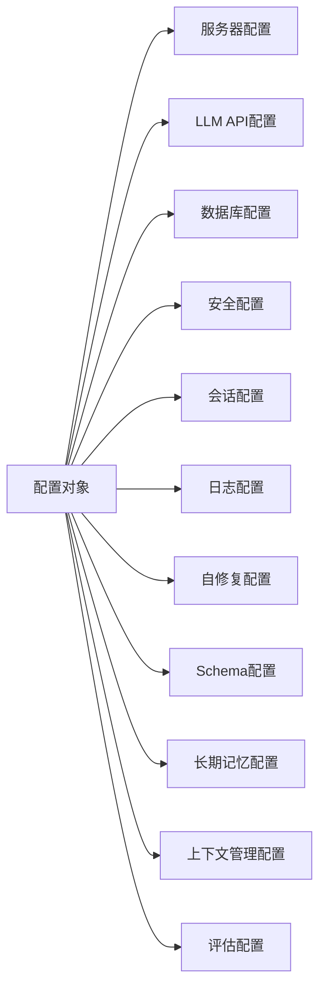

**图表来源**
- [config.js:16-355](file://backend/src/core/config.js#L16-L355)

#### 配置验证机制

配置模块实现了严格的验证机制，确保关键配置项的完整性：

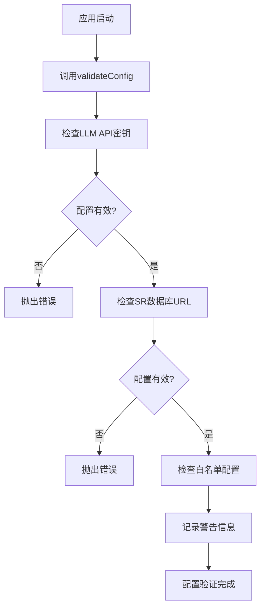

**图表来源**
- [config.js:366-397](file://backend/src/core/config.js#L366-L397)

**章节来源**
- [config.js:16-397](file://backend/src/core/config.js#L16-L397)

## 架构概览

NL2SQL 应用采用模块化微服务架构，各组件之间通过清晰的接口进行通信：

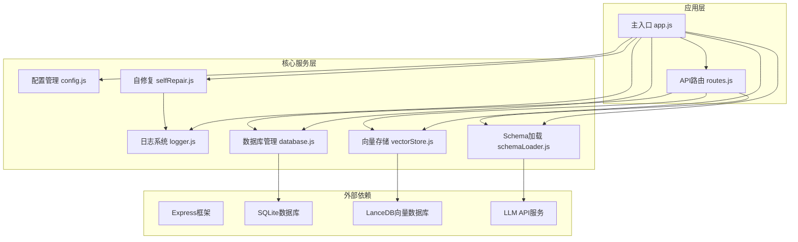

**图表来源**
- [app.js:39-50](file://backend/src/app.js#L39-L50)
- [config.js:16-355](file://backend/src/core/config.js#L16-L355)

## 详细组件分析

### 初始化流程详解

应用的初始化流程严格按照预定义的顺序执行，确保所有依赖组件能够正确初始化：

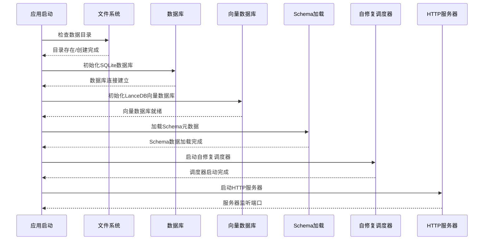

**图表来源**
- [app.js:97-166](file://backend/src/app.js#L97-L166)

#### 数据目录检查与创建

初始化过程首先确保数据存储目录的存在性和完整性：

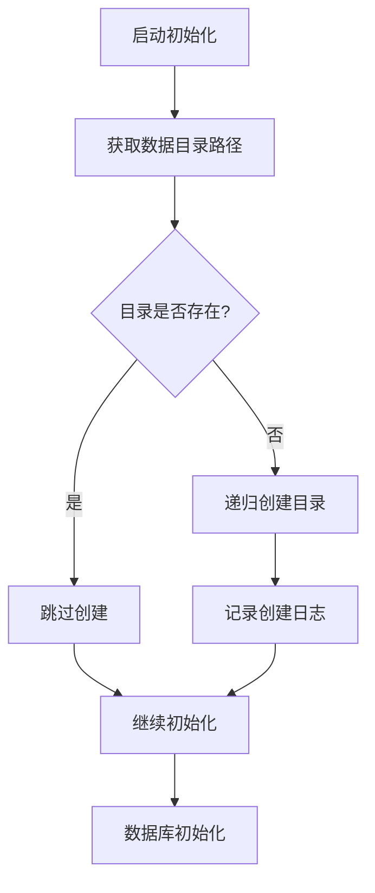

**图表来源**
- [app.js:107-113](file://backend/src/app.js#L107-L113)

#### 数据库初始化流程

SQLite 数据库初始化包含表结构创建和索引优化：

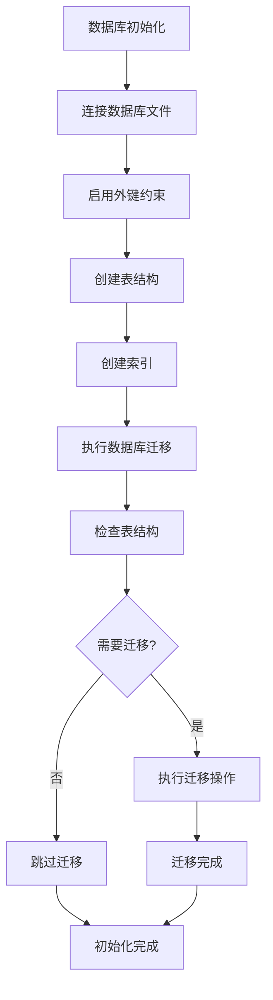

**图表来源**
- [database.js:200-261](file://backend/src/core/database.js#L200-L261)

**章节来源**
- [app.js:97-166](file://backend/src/app.js#L97-L166)
- [database.js:200-336](file://backend/src/core/database.js#L200-L336)

### 优雅关闭机制

应用实现了完善的优雅关闭机制，确保在接收到终止信号时能够正确清理资源：

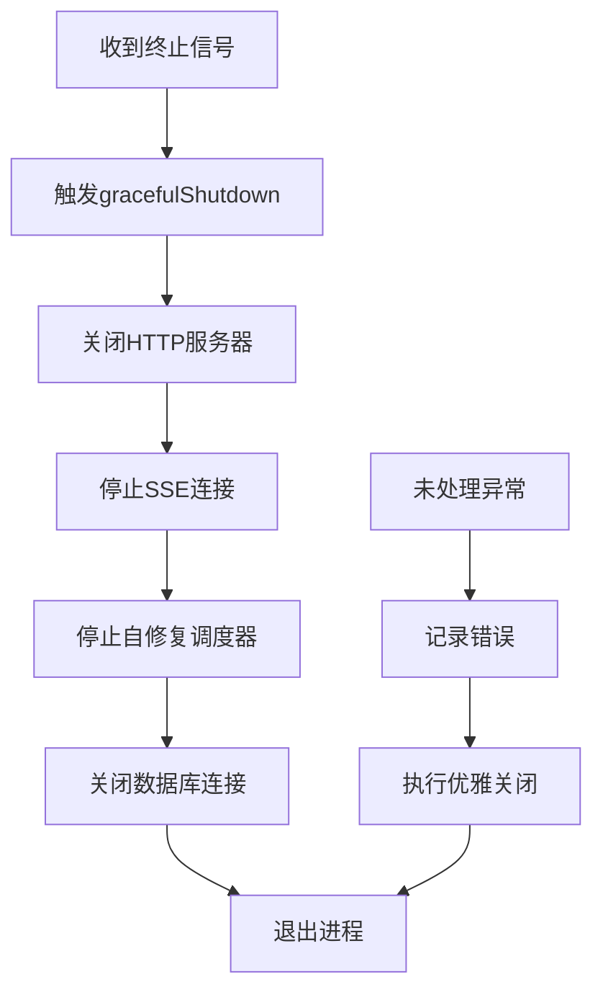

**图表来源**
- [app.js:176-212](file://backend/src/app.js#L176-L212)

#### 信号处理机制

应用同时监听 SIGTERM 和 SIGINT 信号，确保在不同场景下的正确响应：

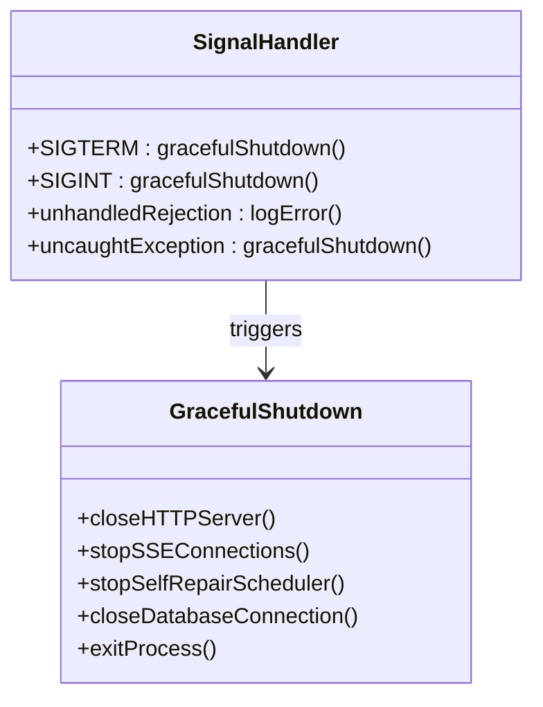

**图表来源**
- [app.js:214-230](file://backend/src/app.js#L214-L230)

**章节来源**
- [app.js:176-230](file://backend/src/app.js#L176-L230)

### 日志记录系统

应用采用了统一的日志记录系统，支持多级别日志输出和结构化日志格式：

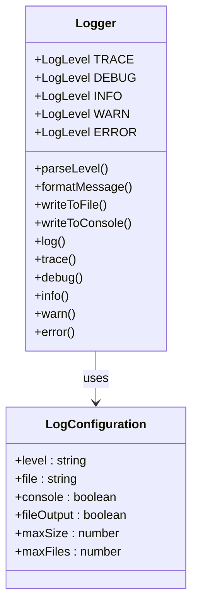

**图表来源**
- [logger.js:54-441](file://backend/src/utils/logger.js#L54-L441)

#### 日志级别管理

日志系统支持五种不同的日志级别，每种级别都有特定的用途和输出格式：

| 日志级别 | 数值优先级 | 用途 | 输出格式 |
|---------|-----------|------|----------|
| TRACE | 0 | 详细流程追踪 | 灰色文本 |
| DEBUG | 1 | 开发调试信息 | 青色文本 |
| INFO | 2 | 一般信息 | 绿色文本 |
| WARN | 3 | 警告信息 | 黄色文本 |
| ERROR | 4 | 错误信息 | 红色文本 |

**章节来源**
- [logger.js:33-44](file://backend/src/utils/logger.js#L33-L44)
- [logger.js:54-441](file://backend/src/utils/logger.js#L54-L441)

## 依赖关系分析

应用的依赖关系体现了清晰的分层架构和模块化设计原则：

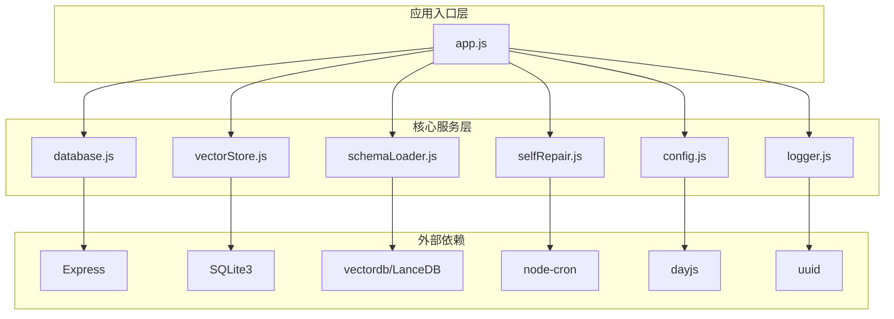

**图表来源**
- [app.js:39-50](file://backend/src/app.js#L39-L50)
- [package.json:10-20](file://backend/package.json#L10-L20)

### 模块间依赖关系

应用采用松耦合的设计模式，通过明确的接口定义实现模块间的解耦：

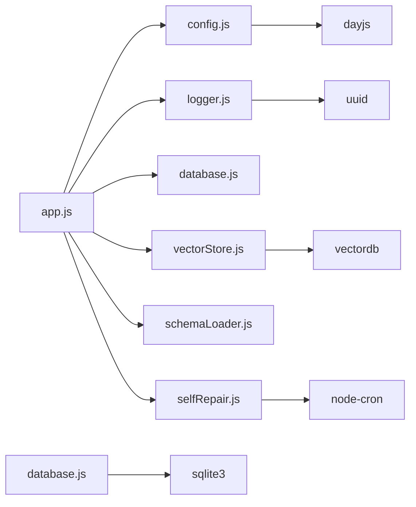

**图表来源**
- [app.js:39-50](file://backend/src/app.js#L39-L50)
- [package.json:10-20](file://backend/package.json#L10-L20)

**章节来源**
- [package.json:10-20](file://backend/package.json#L10-L20)

## 性能考虑

NL2SQL 应用在设计时充分考虑了性能优化和资源管理：

### 内存管理策略

应用采用了渐进式的资源初始化策略，避免一次性加载大量数据：

- **延迟初始化**: 非关键组件采用延迟加载机制
- **连接池管理**: 数据库连接采用连接池优化
- **内存监控**: 定期检查内存使用情况，防止内存泄漏

### 并发处理机制

应用支持多用户并发访问，通过以下机制保证性能：

- **异步操作**: 所有数据库和文件操作采用异步模式
- **队列管理**: 高并发请求通过队列机制有序处理
- **超时控制**: 关键操作设置合理的超时时间

### 缓存策略

应用实现了多层次的缓存机制：

- **Schema缓存**: Schema元数据缓存减少重复加载
- **向量缓存**: 向量数据库缓存提升查询性能
- **配置缓存**: 配置信息缓存避免频繁读取

## 故障排除指南

### 常见启动问题

#### 环境变量配置错误

**问题症状**: 应用启动时报配置错误

**解决方案**:
1. 检查 .env 文件中的配置项
2. 验证 LLM API 密钥的有效性
3. 确认数据库连接 URL 格式正确

#### 数据库连接失败

**问题症状**: 数据库初始化阶段报错

**解决方案**:
1. 检查数据库文件权限
2. 验证数据库文件路径
3. 确认 SQLite3 扩展正确安装

#### 向量数据库初始化失败

**问题症状**: 向量存储模块无法初始化

**解决方案**:
1. 检查 LanceDB 依赖安装
2. 验证向量数据库目录权限
3. 确认磁盘空间充足

### 运行时错误处理

应用实现了完善的错误处理机制：

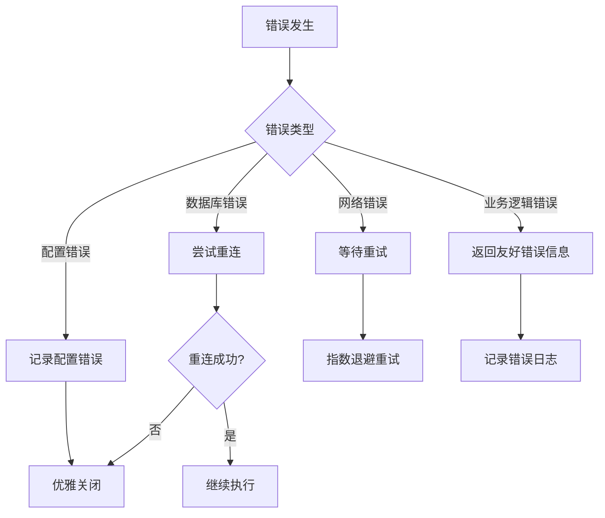

**图表来源**
- [app.js:160-165](file://backend/src/app.js#L160-L165)

**章节来源**
- [app.js:160-230](file://backend/src/app.js#L160-L230)

## 结论

NL2SQL 应用入口与初始化模块展现了现代 Node.js 应用的最佳实践，通过模块化设计、优雅的初始化流程和完善的错误处理机制，为整个系统奠定了坚实的基础。

### 设计优势

1. **模块化架构**: 清晰的职责分离和接口定义
2. **配置管理**: 集中的配置管理和验证机制
3. **资源管理**: 完善的资源初始化和清理流程
4. **错误处理**: 全面的错误捕获和恢复策略
5. **监控集成**: 结构化的日志记录和性能监控

### 技术亮点

- **异步初始化**: 采用 Promise 和 async/await 模式
- **优雅关闭**: 完善的信号处理和资源清理
- **配置验证**: 运行时配置检查和错误提示
- **日志系统**: 多级别、多输出的日志管理
- **性能优化**: 缓存策略和资源池管理

该模块为 NL2SQL 应用提供了稳定可靠的基础，确保系统能够在各种环境下稳定运行，并为未来的功能扩展提供了良好的架构基础。