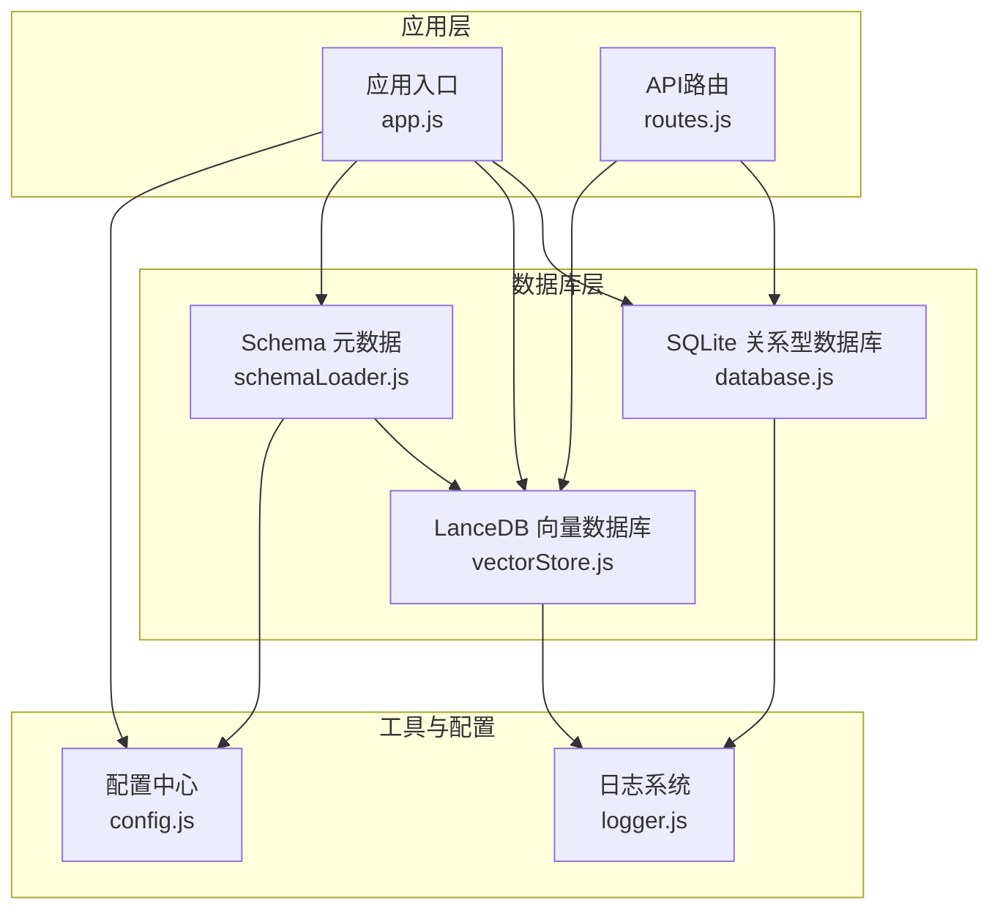
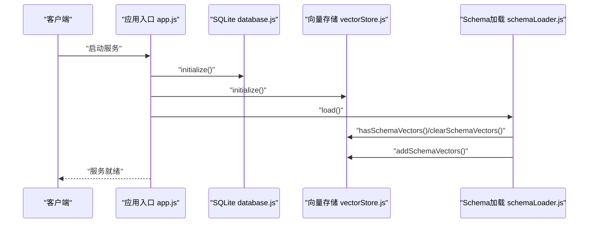
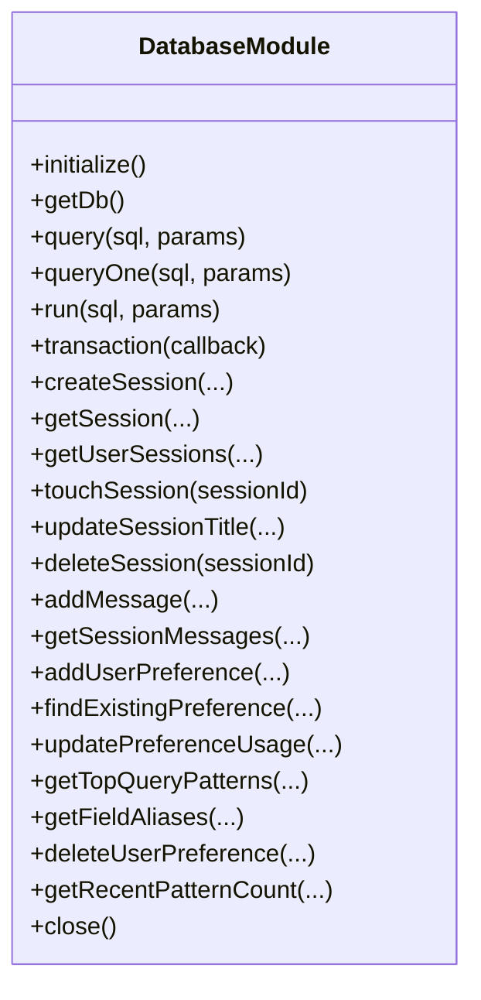
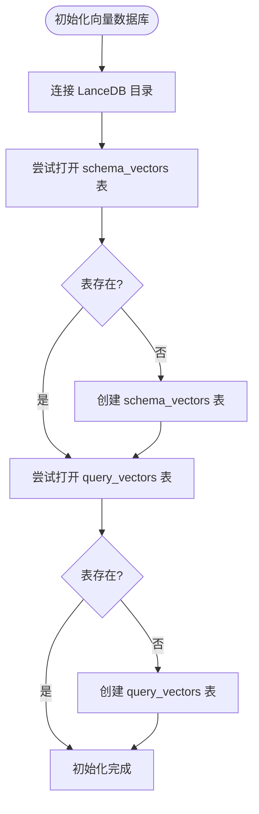
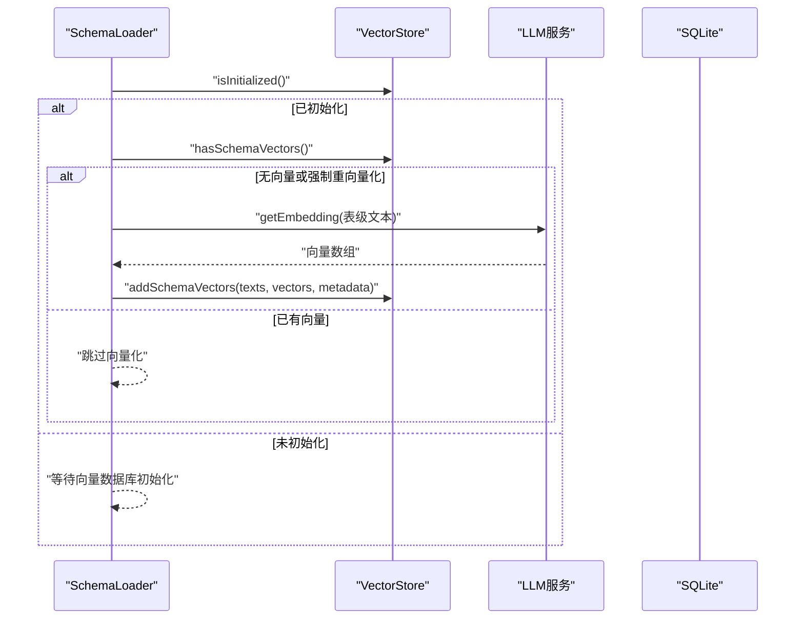
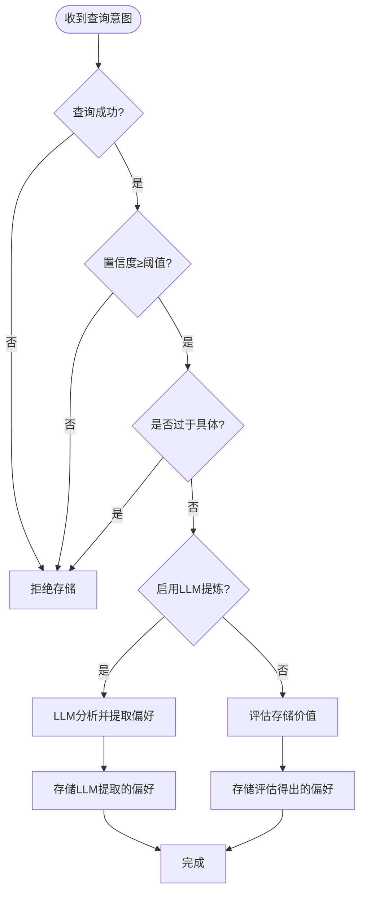
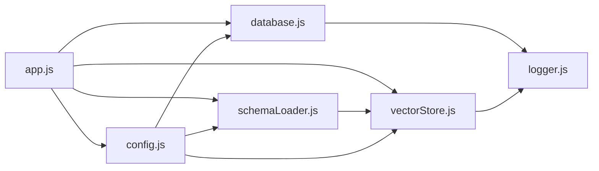

# 数据库层架构

<cite>
**本文引用的文件**
- [database.js](file://backend/src/core/database.js)
- [vectorStore.js](file://backend/src/memory/vectorStore.js)
- [longTermMemory.js](file://backend/src/memory/longTermMemory.js)
- [schemaLoader.js](file://backend/src/core/schemaLoader.js)
- [config.js](file://backend/src/core/config.js)
- [logger.js](file://backend/src/utils/logger.js)
- [app.js](file://backend/src/app.js)
- [schema-metadata.json](file://backend/config/schema-metadata.json)
- [package.json](file://backend/package.json)
</cite>

## 目录
1. [简介](#简介)
2. [项目结构](#项目结构)
3. [核心组件](#核心组件)
4. [架构总览](#架构总览)
5. [详细组件分析](#详细组件分析)
6. [依赖分析](#依赖分析)
7. [性能考虑](#性能考虑)
8. [故障排查指南](#故障排查指南)
9. [结论](#结论)
10. [附录](#附录)

## 简介
本技术文档聚焦 NL2SQL 的数据库层架构，系统性阐述基于 SQLite 的关系型数据库设计与基于 LanceDB 的向量数据库架构。文档覆盖：
- 关系型数据库表结构设计、索引策略与查询优化
- 会话管理、查询历史存储与用户偏好的数据模型
- 数据库连接池管理、事务处理与并发控制机制
- 向量数据库的初始化流程、数据导入与查询优化策略
- 数据迁移、备份恢复与性能监控方案
- 内存数据库与持久化存储的结合使用模式

## 项目结构
后端采用模块化设计，数据库层由三层组成：
- 关系型层：SQLite 数据库，负责会话、消息、查询历史、用户偏好、系统日志等持久化
- 向量层：LanceDB，负责 Schema 与查询历史的向量化存储与语义检索
- 长期记忆层：基于 SQLite 的偏好抽取与存储，结合向量检索进行智能推荐

图表来源
- [app.js:97-166](file://backend/src/app.js#L97-L166)
- [database.js:195-261](file://backend/src/core/database.js#L195-L261)
- [vectorStore.js:231-261](file://backend/src/memory/vectorStore.js#L231-L261)
- [schemaLoader.js:69-122](file://backend/src/core/schemaLoader.js#L69-L122)
- [config.js:16-355](file://backend/src/core/config.js#L16-L355)
- [logger.js:54-442](file://backend/src/utils/logger.js#L54-L442)

章节来源
- [app.js:97-166](file://backend/src/app.js#L97-L166)
- [config.js:16-355](file://backend/src/core/config.js#L16-L355)

## 核心组件
- SQLite 关系型数据库模块：提供数据库初始化、表结构迁移、事务封装、会话/消息/查询历史/用户偏好/系统日志等 CRUD 操作
- LanceDB 向量数据库模块：提供 Schema 向量与查询历史向量的初始化、添加、搜索与统计
- Schema 元数据加载模块：负责加载 schema-metadata.json，构建表/字段映射，向量化并存储到 LanceDB
- 长期记忆模块：从查询意图中提取用户偏好，存储到 SQLite，并结合向量检索进行智能推荐
- 配置中心：集中管理数据库路径、向量维度、连接池、安全策略、日志级别等
- 日志系统：统一日志输出、文件轮转、追踪上下文

章节来源
- [database.js:195-800](file://backend/src/core/database.js#L195-L800)
- [vectorStore.js:231-759](file://backend/src/memory/vectorStore.js#L231-L759)
- [schemaLoader.js:69-800](file://backend/src/core/schemaLoader.js#L69-L800)
- [longTermMemory.js:312-485](file://backend/src/memory/longTermMemory.js#L312-L485)
- [config.js:16-355](file://backend/src/core/config.js#L16-L355)
- [logger.js:54-442](file://backend/src/utils/logger.js#L54-L442)

## 架构总览
数据库层采用“关系型 + 向量”的混合架构：
- SQLite：存储结构化数据（会话、消息、查询历史、用户偏好、系统日志），提供 ACID 事务保证
- LanceDB：存储向量化数据（Schema 表级向量、查询历史向量），提供高效语义检索
- Schema 元数据：从 schema-metadata.json 加载，构建映射与向量，驱动语义搜索
- 长期记忆：在 SQLite 中沉淀用户偏好，结合向量检索提升推荐质量

图表来源
- [app.js:118-135](file://backend/src/app.js#L118-L135)
- [database.js:200-261](file://backend/src/core/database.js#L200-L261)
- [vectorStore.js:231-322](file://backend/src/memory/vectorStore.js#L231-L322)
- [schemaLoader.js:201-281](file://backend/src/core/schemaLoader.js#L201-L281)

## 详细组件分析

### SQLite 关系型数据库模块
- 初始化与迁移
  - 初始化：创建数据库连接，启用外键约束，执行建表与索引创建，执行迁移修复旧表结构
  - 迁移：检测 user_preferences 表是否包含旧的 UNIQUE 约束，如存在则重建表并重新创建索引
- 数据库操作
  - query/queryOne/run：封装 all/get/run，统一错误处理与日志记录
  - transaction：封装 BEGIN/COMMIT/ROLLBACK，提供原子性保障
- 会话与消息
  - sessions 表：存储会话元数据，支持按用户、状态、更新时间索引
  - messages 表：存储消息历史，支持按会话、时间索引
  - touchSession/updateSessionTitle/deleteSession：维护会话生命周期
- 查询历史与用户偏好
  - query_history 表：存储查询历史，支持按用户、会话、时间、状态索引
  - user_preferences 表：存储用户偏好，支持按用户、类型、复合索引
  - 偏好操作：addUserPreference/findExistingPreference/updatePreferenceUsage/getTopQueryPatterns/getFieldAliases/deleteUserPreference
- 系统日志
  - system_logs 表：记录系统运行日志，支持按级别、时间索引
- 关闭与连接
  - close：优雅关闭数据库连接

图表来源
- [database.js:195-800](file://backend/src/core/database.js#L195-L800)

章节来源
- [database.js:195-800](file://backend/src/core/database.js#L195-L800)

### LanceDB 向量数据库模块
- 初始化
  - connect(config.vectorDb.path) 连接数据库目录
  - openTable/createTable(schema_vectors/query_vectors) 初始化表结构
- Schema 向量
  - addSchemaVectors：批量添加表级向量，包含文本、向量、元数据与时间戳
  - searchSchema/searchSchemaSmart：向量检索，支持过滤与智能重排序
- 查询历史向量
  - addQueryVector：添加查询向量
  - searchSimilarQueries：相似查询检索
- 统计与状态
  - getStats：获取表行数统计
  - hasSchemaVectors/clearSchemaVectors：检查与清理向量数据
- 元数据增强
  - calculateImportance/classifyQueryType/buildEnhancedMetadata：构建查询重要性评分、类型分类与执行信息

图表来源
- [vectorStore.js:231-322](file://backend/src/memory/vectorStore.js#L231-L322)

章节来源
- [vectorStore.js:231-759](file://backend/src/memory/vectorStore.js#L231-L759)

### Schema 元数据加载与向量化
- 加载与校验
  - load：读取 schema-metadata.json，校验格式，构建表/字段映射
- 向量化策略
  - vectorizeSchema：将表级描述文本向量化，添加元数据标签（域、数据类型、关键特征词）
  - 分批获取 Embedding，避免单次请求过大
- 智能搜索
  - searchRelevantTables：结合上下文（gameId、datasource）增强查询，使用语义搜索与关键词匹配双通道
  - searchSchemaSmart：基于查询意图识别，对结果进行优先级重排（游戏表优先、平台表次之、原始日志优先、报表降权）

图表来源
- [schemaLoader.js:69-122](file://backend/src/core/schemaLoader.js#L69-L122)
- [schemaLoader.js:201-281](file://backend/src/core/schemaLoader.js#L201-L281)
- [schemaLoader.js:567-657](file://backend/src/core/schemaLoader.js#L567-L657)
- [vectorStore.js:231-322](file://backend/src/memory/vectorStore.js#L231-L322)

章节来源
- [schemaLoader.js:69-800](file://backend/src/core/schemaLoader.js#L69-L800)
- [schema-metadata.json:1-800](file://backend/config/schema-metadata.json#L1-L800)

### 长期记忆与用户偏好
- 存储筛选
  - evaluateStorageValue：基于高价值模板与高频模式评估是否存储
  - isTooSpecific：排除过于具体的单次查询
- LLM 智能提炼
  - analyzeWithLLM：使用提示词引导提取字段别名、分析习惯、过滤逻辑等
  - parseJSONResponse：解析 LLM 返回的 JSON
- 偏好存储
  - storeQueryPattern/storeMetricPreference/storeDimensionPreference/learnFieldAlias：将偏好写入 SQLite
  - findExistingPreference/updatePreferenceUsage：去重与使用统计

图表来源
- [longTermMemory.js:312-485](file://backend/src/memory/longTermMemory.js#L312-L485)
- [longTermMemory.js:57-189](file://backend/src/memory/longTermMemory.js#L57-L189)
- [database.js:619-763](file://backend/src/core/database.js#L619-L763)

章节来源
- [longTermMemory.js:312-485](file://backend/src/memory/longTermMemory.js#L312-L485)
- [database.js:619-763](file://backend/src/core/database.js#L619-L763)

## 依赖分析
- 外部依赖
  - sqlite3：SQLite 驱动，提供数据库连接、查询与事务
  - vectordb：LanceDB 客户端，提供向量表的创建、查询与统计
  - dotenv：加载 .env 环境变量
  - express/cors/body-parser：Web 服务与中间件
- 内部依赖
  - config：集中配置，包括数据库路径、向量维度、连接池、安全策略、日志级别
  - logger：统一日志输出与追踪
  - schemaLoader：加载与向量化 Schema
  - database/vectorStore/longTermMemory：数据库层核心模块

图表来源
- [app.js:40-50](file://backend/src/app.js#L40-L50)
- [config.js:16-355](file://backend/src/core/config.js#L16-L355)
- [package.json:10-27](file://backend/package.json#L10-L27)

章节来源
- [package.json:10-27](file://backend/package.json#L10-L27)
- [config.js:16-355](file://backend/src/core/config.js#L16-L355)

## 性能考虑
- SQLite 查询优化
  - 索引策略：sessions(messages) 按 user_id/status/updated_at 索引；messages/query_history 按 session_id/created_at 索引；user_preferences 按 user_id/type 复合索引
  - 查询限制：安全配置中设置最大查询行数与查询超时，防止大查询导致性能问题
  - 事务封装：使用 transaction 将多步写入合并为原子操作，减少锁竞争
- 向量检索优化
  - 表级向量：将每个表生成一个向量，减少向量数量与检索成本
  - 智能搜索：基于查询意图识别与元数据标签过滤，先扩大搜索再应用过滤，提升召回质量
  - 批量嵌入：分批获取 Embedding，避免单次请求过大
- 日志与监控
  - 日志级别与文件轮转：避免日志文件过大影响 IO
  - 评估开关：可选开启运行时统计，记录向量搜索命中与质量

[本节为通用性能指导，无需特定文件引用]

## 故障排查指南
- SQLite 初始化失败
  - 检查数据库路径权限与目录是否存在
  - 查看外键约束启用日志与建表错误日志
- 向量数据库未初始化
  - 确认 LanceDB 目录可写，检查连接路径
  - 若初始化失败，模块会记录警告并降级为关键词匹配
- Schema 向量缺失
  - 检查是否启用强制重向量化（SCHEMA_REVECTORIZE），或确认向量表中已有数据
  - 确认 Embedding 服务可用，网络与超时配置合理
- 查询超时或返回过多
  - 调整安全配置中的查询超时与最大行数
  - 检查 SQL 白名单与禁止关键字配置
- 日志定位
  - 使用 logger 的 trace/debug/info/warn/error 级别，结合追踪上下文 startTrace/traceStep/endTrace 定位问题

章节来源
- [database.js:200-261](file://backend/src/core/database.js#L200-L261)
- [vectorStore.js:231-261](file://backend/src/memory/vectorStore.js#L231-L261)
- [schemaLoader.js:201-281](file://backend/src/core/schemaLoader.js#L201-L281)
- [config.js:140-170](file://backend/src/core/config.js#L140-L170)
- [logger.js:263-408](file://backend/src/utils/logger.js#L263-L408)

## 结论
NL2SQL 的数据库层通过 SQLite 与 LanceDB 的协同，实现了结构化数据与语义检索的有机结合。SQLite 提供可靠的事务与索引能力，支撑会话、消息、查询历史与用户偏好的持久化；LanceDB 提供高效的向量检索，结合 Schema 元数据与智能搜索策略，显著提升了查询意图理解与表选择的准确性。配合完善的配置中心、日志系统与安全策略，整体架构具备良好的可维护性与扩展性。

[本节为总结性内容，无需特定文件引用]

## 附录

### 数据库表结构与索引
- sessions：主键 id，user_id/status/updated_at 索引
- messages：主键 id，session_id/created_at 索引
- query_history：主键 id，user_id/session_id/created_at/status 索引
- user_preferences：主键 id，user_id/type 复合索引
- system_logs：主键 id，level/created_at 索引

章节来源
- [database.js:39-189](file://backend/src/core/database.js#L39-L189)

### 向量数据库初始化与数据导入流程
- 初始化：连接目录，打开/创建 schema_vectors 与 query_vectors 表
- 数据导入：从 Schema 元数据生成表级文本，调用 Embedding 服务获取向量，批量写入向量表
- 查询优化：智能搜索结合元数据过滤与优先级重排

章节来源
- [vectorStore.js:231-322](file://backend/src/memory/vectorStore.js#L231-L322)
- [schemaLoader.js:201-281](file://backend/src/core/schemaLoader.js#L201-L281)

### 数据迁移与备份恢复
- 迁移：检测并修复 user_preferences 表的 UNIQUE 约束，重建表并重新创建索引
- 备份：SQLite 数据库文件可直接复制；LanceDB 为本地目录，可整体备份 data/vectordb 目录
- 恢复：停止服务后替换数据库文件或向量目录，重启服务

章节来源
- [database.js:271-336](file://backend/src/core/database.js#L271-L336)
- [app.js:176-212](file://backend/src/app.js#L176-L212)