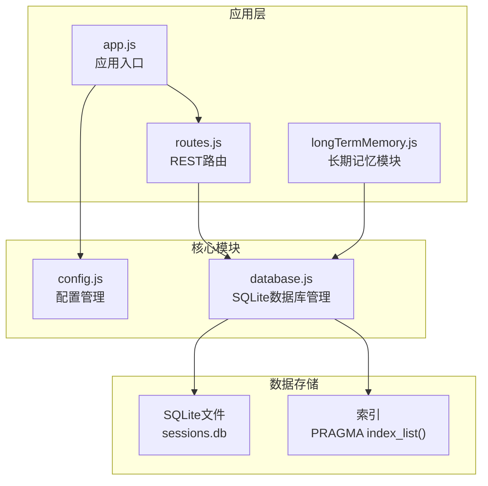
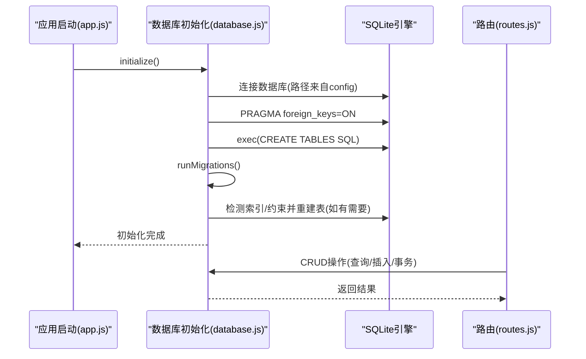
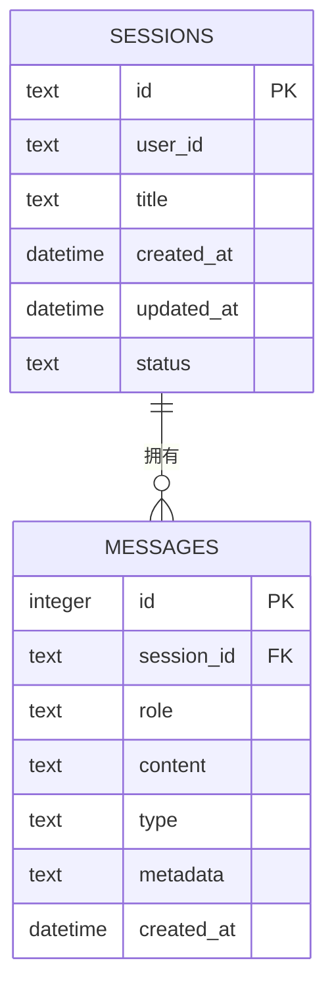
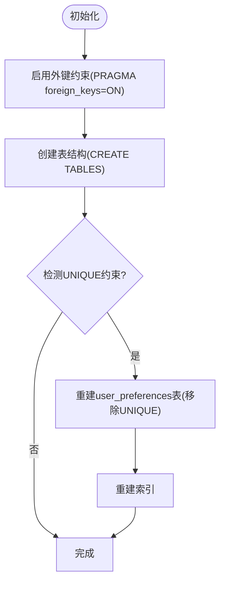

# SQLite数据库设计

<cite>
**本文引用的文件**
- [database.js](file://backend/src/core/database.js)
- [config.js](file://backend/src/core/config.js)
- [routes.js](file://backend/src/core/routes.js)
- [app.js](file://backend/src/app.js)
- [longTermMemory.js](file://backend/src/memory/longTermMemory.js)
</cite>

## 目录
1. [简介](#简介)
2. [项目结构](#项目结构)
3. [核心组件](#核心组件)
4. [架构概览](#架构概览)
5. [详细组件分析](#详细组件分析)
6. [依赖分析](#依赖分析)
7. [性能考虑](#性能考虑)
8. [故障排查指南](#故障排查指南)
9. [结论](#结论)

## 简介
本文件面向NL2SQL项目的SQLite数据库设计，围绕四大核心数据表sessions（会话表）、messages（消息表）、query_history（查询历史表）和user_preferences（用户偏好表）进行深入解析。内容涵盖字段定义、数据类型选择、主键与外键约束、索引策略与性能优化、表间关系与外键机制、数据迁移与版本升级、数据库初始化流程、连接管理与事务处理策略等。

## 项目结构
NL2SQL后端采用Express + SQLite的轻量级架构，数据库位于本地文件系统，通过Node.js的sqlite3模块进行访问。数据库初始化在应用启动阶段完成，随后由路由层调用数据库模块执行CRUD操作。

**图表来源**
- [app.js:97-188](file://backend/src/app.js#L97-L188)
- [routes.js:24-28](file://backend/src/core/routes.js#L24-L28)
- [database.js:206-267](file://backend/src/core/database.js#L206-L267)

**章节来源**
- [app.js:97-188](file://backend/src/app.js#L97-L188)
- [config.js:97-100](file://backend/src/core/config.js#L97-L100)

## 核心组件
本节概述四大核心表的设计目标与职责：
- sessions：存储用户会话元数据，支持按用户、状态、时间排序的高效查询。
- messages：存储会话中的消息历史，支持按会话ID和时间排序检索。
- query_history：存储用户数据查询记录，支持按用户、会话、状态、时间等多维筛选。
- user_preferences：存储用户偏好（查询模式、字段别名、指标/维度偏好等），支持按用户与类型组合查询。

**章节来源**
- [database.js:39-195](file://backend/src/core/database.js#L39-L195)

## 架构概览
数据库层通过统一的初始化流程创建表结构与索引，并在迁移阶段修复旧版本约束。应用层通过路由调用数据库模块，实现对四大表的增删改查与事务控制。

**图表来源**
- [app.js:118-120](file://backend/src/app.js#L118-L120)
- [database.js:234-267](file://backend/src/core/database.js#L234-L267)
- [database.js:277-345](file://backend/src/core/database.js#L277-L345)

## 详细组件分析

### 会话表 sessions
- 设计目标：持久化用户会话元数据，支持快速检索与时间排序。
- 主键：id（TEXT，PRIMARY KEY）
- 关键字段：
  - user_id（TEXT NOT NULL）：用户标识
  - title（TEXT）：会话标题（可选）
  - created_at（DATETIME DEFAULT CURRENT_TIMESTAMP）：创建时间
  - updated_at（DATETIME DEFAULT CURRENT_TIMESTAMP）：最后更新时间
  - status（TEXT DEFAULT 'active'）：会话状态（active/archived/deleted）
- 索引策略：
  - idx_sessions_user_id(user_id)：加速按用户查询
  - idx_sessions_status(status)：加速按状态筛选
  - idx_sessions_updated_at(updated_at)：加速按时间排序
- 外键约束：无外键，独立表
- 使用场景：路由层通过getSession、getUserSessions、deleteSession等操作与之交互

**章节来源**
- [database.js:44-57](file://backend/src/core/database.js#L44-L57)
- [database.js:59-64](file://backend/src/core/database.js#L59-L64)
- [routes.js:296-398](file://backend/src/core/routes.js#L296-L398)

### 消息表 messages
- 设计目标：存储会话中的消息历史，支持按会话ID与时间排序检索。
- 主键：id（INTEGER PRIMARY KEY AUTOINCREMENT）
- 关键字段：
  - session_id（TEXT NOT NULL）：所属会话ID（外键）
  - role（TEXT NOT NULL）：消息角色（user/assistant/system/tool）
  - content（TEXT NOT NULL）：消息内容
  - type（TEXT DEFAULT 'text'）：消息类型（text/sql/result/error/clarify）
  - metadata（TEXT）：JSON字符串形式的附加元数据
  - created_at（DATETIME DEFAULT CURRENT_TIMESTAMP）：创建时间
- 外键约束：FOREIGN KEY(session_id) REFERENCES sessions(id) ON DELETE CASCADE
- 索引策略：
  - idx_messages_session_id(session_id)：加速按会话查询
  - idx_messages_created_at(created_at)：加速按时间排序
- 使用场景：addMessage、getSessionMessages等操作

**图表来源**
- [database.js:70-87](file://backend/src/core/database.js#L70-L87)
- [database.js:89-92](file://backend/src/core/database.js#L89-L92)

**章节来源**
- [database.js:70-87](file://backend/src/core/database.js#L70-L87)
- [database.js:89-92](file://backend/src/core/database.js#L89-L92)
- [routes.js:348-373](file://backend/src/core/routes.js#L348-L373)

### 查询历史表 query_history
- 设计目标：记录用户的数据查询历史，支持按用户、会话、状态、时间等多维筛选。
- 主键：id（INTEGER PRIMARY KEY AUTOINCREMENT）
- 关键字段：
  - session_id（TEXT）：所属会话ID（外键，可空）
  - user_id（TEXT NOT NULL）：用户标识
  - natural_query（TEXT NOT NULL）：用户的自然语言查询
  - generated_sql（TEXT）：生成的SQL语句
  - status（TEXT DEFAULT 'pending'）：执行状态（pending/success/failed）
  - result（TEXT）：查询结果（JSON格式）
  - error_message（TEXT）：错误信息（失败时）
  - execution_time（INTEGER）：执行耗时（毫秒）
  - row_count（INTEGER）：返回行数
  - created_at（DATETIME DEFAULT CURRENT_TIMESTAMP）：创建时间
  - executed_at（DATETIME）：执行时间
- 外键约束：FOREIGN KEY(session_id) REFERENCES sessions(id) ON DELETE SET NULL
- 索引策略：
  - idx_query_history_user_id(user_id)：加速按用户查询
  - idx_query_history_session_id(session_id)：加速按会话查询
  - idx_query_history_created_at(created_at)：加速按时间排序
  - idx_query_history_status(status)：加速按状态筛选
- 使用场景：路由层提供查询历史接口，底层通过database.query构建动态WHERE条件

**章节来源**
- [database.js:98-125](file://backend/src/core/database.js#L98-L125)
- [database.js:127-134](file://backend/src/core/database.js#L127-L134)
- [routes.js:413-450](file://backend/src/core/routes.js#L413-L450)

### 用户偏好表 user_preferences
- 设计目标：存储用户的查询偏好（查询模式、字段别名、指标/维度偏好等），支持按用户与类型组合查询。
- 主键：id（INTEGER PRIMARY KEY AUTOINCREMENT）
- 关键字段：
  - user_id（TEXT NOT NULL）：用户标识（注：不再强制UNIQUE，允许一个用户有多条偏好）
  - preference_type（TEXT NOT NULL）：偏好类型（field_alias/query_pattern/metric_preference/dimension_preference）
  - content（TEXT NOT NULL）：偏好内容（JSON格式）
  - usage_count（INTEGER DEFAULT 1）：使用次数，用于排序推荐
  - last_used_at（DATETIME）：最后使用时间
  - created_at（DATETIME DEFAULT CURRENT_TIMESTAMP）：创建时间
  - updated_at（DATETIME DEFAULT CURRENT_TIMESTAMP）：更新时间
  - is_pinned（INTEGER DEFAULT 0）：是否置顶（0=普通, 1=置顶）
  - priority（INTEGER DEFAULT 0）：优先级（0=auto, 1=manual, 2=pinned）
  - source（TEXT DEFAULT 'auto'）：来源（auto/manual）
- 索引策略：
  - idx_user_preferences_user_id(user_id)：加速按用户查询
  - idx_user_preferences_type(preference_type)：加速按类型筛选
  - idx_user_prefs_user_type(user_id, preference_type)：复合索引，加速按用户+类型的组合查询
- 使用场景：长期记忆模块通过addUserPreference、getUserPreferences、findExistingPreference等操作管理偏好

**章节来源**
- [database.js:140-163](file://backend/src/core/database.js#L140-L163)
- [database.js:165-170](file://backend/src/core/database.js#L165-L170)
- [longTermMemory.js:17-22](file://backend/src/memory/longTermMemory.js#L17-L22)

## 依赖分析
- 外键约束启用：数据库初始化时显式启用PRAGMA foreign_keys=ON，确保参照完整性。
- 表间关系：
  - messages.session_id → sessions.id（CASCADE删除）
  - query_history.session_id → sessions.id（SET NULL）
- 索引依赖：各表的查询热点字段均建立索引，满足常见查询模式。

**图表来源**
- [database.js:234-267](file://backend/src/core/database.js#L234-L267)
- [database.js:277-345](file://backend/src/core/database.js#L277-L345)

**章节来源**
- [database.js:234-267](file://backend/src/core/database.js#L234-L267)
- [database.js:277-345](file://backend/src/core/database.js#L277-L345)

## 性能考虑
- 索引策略：
  - sessions：user_id、status、updated_at三类索引分别服务于用户筛选、状态筛选与时间排序。
  - messages：session_id、created_at索引服务于按会话查询与时间排序。
  - query_history：user_id、session_id、created_at、status四类索引服务于多维筛选。
  - user_preferences：user_id、preference_type与复合索引user_id+preference_type，满足按用户+类型的高效查询。
- 复合索引使用场景：
  - user_preferences上user_id+preference_type复合索引，显著提升按用户与类型的组合查询性能。
- 外键与删除策略：
  - messages使用CASCADE删除，保证会话删除时自动清理消息，减少孤立数据。
  - query_history使用SET NULL，避免因会话删除导致查询历史丢失。
- 时间字段默认值：
  - 多表使用CURRENT_TIMESTAMP作为默认值，简化插入逻辑并保持时间一致性。
- JSON字段：
  - metadata（messages）与content（user_preferences）采用TEXT存储JSON，便于扩展但需注意查询时的JSON解析成本。

**章节来源**
- [database.js:59-64](file://backend/src/core/database.js#L59-L64)
- [database.js:89-92](file://backend/src/core/database.js#L89-L92)
- [database.js:127-134](file://backend/src/core/database.js#L127-L134)
- [database.js:165-170](file://backend/src/core/database.js#L165-L170)

## 故障排查指南
- 初始化失败：
  - 检查数据库文件路径（config.database.path）与权限，确认data目录存在。
  - 查看日志中“数据库连接失败”或“创建数据表失败”的具体错误。
- 外键约束问题：
  - 确认初始化时已执行PRAGMA foreign_keys=ON。
  - 若出现约束冲突，检查插入或删除顺序是否违反参照完整性。
- 迁移失败：
  - runMigrations会检测user_preferences表的UNIQUE约束，若存在则重建表并重新创建索引。
  - 如迁移失败，检查事务回滚日志并确认数据库锁状态。
- 查询性能问题：
  - 使用EXPLAIN QUERY PLAN分析慢查询，确认是否命中预期索引。
  - 对于频繁的多维筛选，确保相关字段已建立索引。
- 事务处理：
  - 使用transaction()包裹批量操作，确保原子性；异常时自动回滚。

**章节来源**
- [config.js:97-100](file://backend/src/core/config.js#L97-L100)
- [database.js:206-267](file://backend/src/core/database.js#L206-L267)
- [database.js:277-345](file://backend/src/core/database.js#L277-L345)
- [database.js:440-454](file://backend/src/core/database.js#L440-L454)

## 结论
NL2SQL的SQLite数据库设计以简洁高效为核心，通过合理的字段类型、主键与外键约束、以及针对查询热点的索引策略，支撑了会话管理、消息历史、查询历史与用户偏好等关键业务场景。迁移机制确保了历史数据的平滑演进，事务处理保障了数据一致性。在实际部署中，建议结合业务查询模式持续优化索引与查询计划，以获得最佳性能表现。