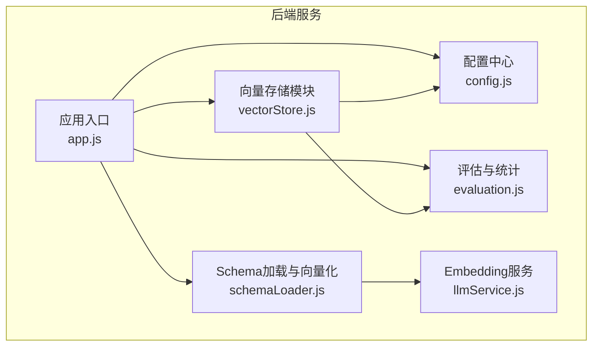
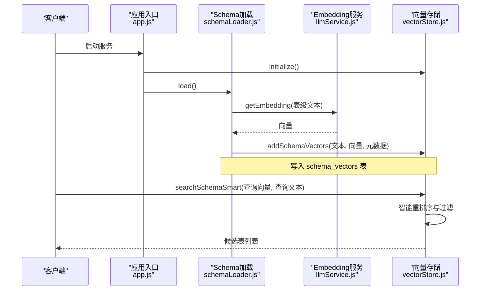
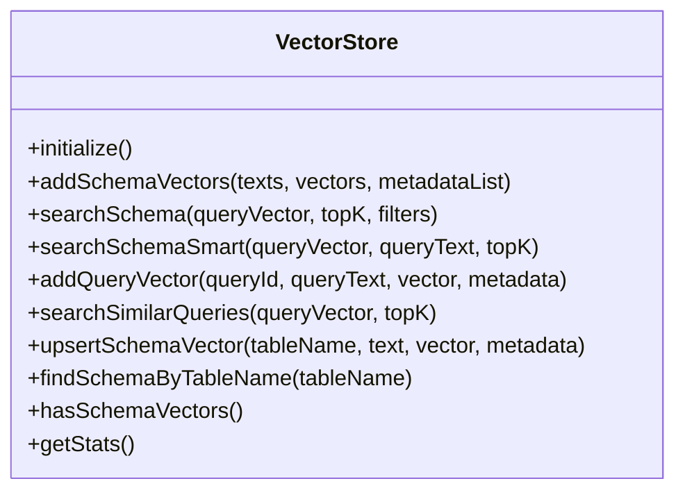
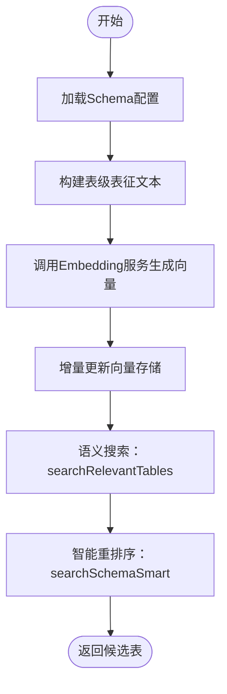
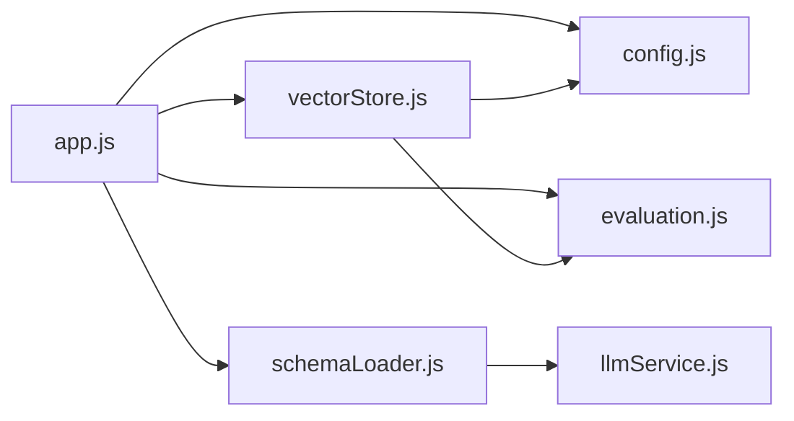

# 向量数据库集成

<cite>
**本文档引用的文件**
- [vectorStore.js](file://backend/src/memory/vectorStore.js)
- [schemaLoader.js](file://backend/src/core/schemaLoader.js)
- [config.js](file://backend/src/core/config.js)
- [llmService.js](file://backend/src/core/llmService.js)
- [evaluation.js](file://backend/src/utils/evaluation.js)
- [app.js](file://backend/src/app.js)
- [package.json](file://backend/package.json)
</cite>

## 目录
1. [简介](#简介)
2. [项目结构](#项目结构)
3. [核心组件](#核心组件)
4. [架构总览](#架构总览)
5. [详细组件分析](#详细组件分析)
6. [依赖关系分析](#依赖关系分析)
7. [性能考量](#性能考量)
8. [故障排查指南](#故障排查指南)
9. [结论](#结论)
10. [附录](#附录)

## 简介
本文件面向NL2SQL项目的向量数据库集成，聚焦LanceDB向量数据库的配置与使用，涵盖：
- 向量存储的初始化与管理
- 查询向量与模式向量的存储结构（向量维度、索引类型、存储格式）
- 向量检索算法与搜索策略（相似度计算、智能重排序）
- 增删改查与批量插入、增量更新机制
- 性能优化建议（索引配置、查询优化）
- 向量数据与传统关系型数据的集成与一致性保障

## 项目结构
向量数据库集成位于后端工程的内存与核心模块中，关键文件如下：
- 向量存储模块：backend/src/memory/vectorStore.js
- Schema加载与向量化：backend/src/core/schemaLoader.js
- 配置中心：backend/src/core/config.js
- Embedding服务：backend/src/core/llmService.js
- 评估与统计：backend/src/utils/evaluation.js
- 应用入口与初始化：backend/src/app.js
- 依赖声明：backend/package.json

**图表来源**
- [app.js:97-188](file://backend/src/app.js#L97-L188)
- [config.js:16-398](file://backend/src/core/config.js#L16-L398)
- [llmService.js:369-424](file://backend/src/core/llmService.js#L369-L424)
- [vectorStore.js:233-263](file://backend/src/memory/vectorStore.js#L233-L263)
- [schemaLoader.js:69-122](file://backend/src/core/schemaLoader.js#L69-L122)
- [evaluation.js:465-488](file://backend/src/utils/evaluation.js#L465-L488)

**章节来源**
- [app.js:97-188](file://backend/src/app.js#L97-L188)
- [config.js:16-398](file://backend/src/core/config.js#L16-L398)

## 核心组件
- 向量存储模块（LanceDB）：负责Schema向量与查询历史向量的增删改查、批量插入、增量更新、统计与状态查询。
- Schema加载模块：负责从配置文件加载Schema元数据，并将其向量化后写入向量数据库；支持表级向量与智能搜索。
- 配置中心：集中管理LLM、Embedding、向量数据库、安全与评估等配置。
- Embedding服务：封装LLM API调用，提供文本向量获取能力。
- 评估模块：记录向量检索命中率、距离分布、相似度评估等统计。

**章节来源**
- [vectorStore.js:233-263](file://backend/src/memory/vectorStore.js#L233-L263)
- [schemaLoader.js:201-276](file://backend/src/core/schemaLoader.js#L201-L276)
- [config.js:80-109](file://backend/src/core/config.js#L80-L109)
- [llmService.js:369-424](file://backend/src/core/llmService.js#L369-L424)
- [evaluation.js:71-96](file://backend/src/utils/evaluation.js#L71-L96)

## 架构总览
向量数据库集成采用“配置驱动 + 模块化”的设计：
- 应用启动时初始化SQLite、LanceDB、Schema元数据与业务语义层。
- Schema加载完成后，使用Embedding服务生成表级向量，写入LanceDB的schema_vectors表。
- 查询阶段，用户输入经Embedding服务向量化后，通过LanceDB执行向量检索与智能重排序，结合元数据过滤与应用层后过滤，最终返回候选表集合。

**图表来源**
- [app.js:123-135](file://backend/src/app.js#L123-L135)
- [schemaLoader.js:201-276](file://backend/src/core/schemaLoader.js#L201-L276)
- [llmService.js:369-424](file://backend/src/core/llmService.js#L369-L424)
- [vectorStore.js:452-538](file://backend/src/memory/vectorStore.js#L452-L538)

## 详细组件分析

### 向量存储模块（LanceDB）
- 初始化与表管理
  - 连接LanceDB数据库目录，打开或创建schema_vectors与query_vectors两张表。
  - 表结构包含：id、text、vector、metadata、created_at等字段。
- Schema向量操作
  - 批量添加：addSchemaVectors(texts, vectors, metadataList)。
  - 智能搜索：searchSchemaSmart(queryVector, queryText, topK)，结合查询意图与元数据标签进行重排序。
  - 普通搜索：searchSchema(queryVector, topK, filters)。
- 查询历史向量操作
  - 单条添加：addQueryVector(queryId, queryText, vector, metadata)。
  - 相似查询检索：searchSimilarQueries(queryVector, topK)。
- 增量更新与维护
  - upsertSchemaVector：基于内容哈希判断是否需要更新，避免重复Embedding调用。
  - findSchemaByTableName：按表名查找已存在向量。
  - hasSchemaVectors/getStats：检查向量存在性与统计信息。
- 状态与错误处理
  - 初始化失败不会阻断应用启动，记录警告并降级为无语义搜索能力。
  - 删除与更新：LanceDB暂不支持直接删除/更新，采用软删除与定期维护策略。

**图表来源**
- [vectorStore.js:233-263](file://backend/src/memory/vectorStore.js#L233-L263)
- [vectorStore.js:338-369](file://backend/src/memory/vectorStore.js#L338-L369)
- [vectorStore.js:380-437](file://backend/src/memory/vectorStore.js#L380-L437)
- [vectorStore.js:452-538](file://backend/src/memory/vectorStore.js#L452-L538)
- [vectorStore.js:553-579](file://backend/src/memory/vectorStore.js#L553-L579)
- [vectorStore.js:589-620](file://backend/src/memory/vectorStore.js#L589-L620)
- [vectorStore.js:799-800](file://backend/src/memory/vectorStore.js#L799-L800)
- [vectorStore.js:745-776](file://backend/src/memory/vectorStore.js#L745-L776)
- [vectorStore.js:703-716](file://backend/src/memory/vectorStore.js#L703-L716)
- [vectorStore.js:655-685](file://backend/src/memory/vectorStore.js#L655-L685)

**章节来源**
- [vectorStore.js:233-263](file://backend/src/memory/vectorStore.js#L233-L263)
- [vectorStore.js:269-324](file://backend/src/memory/vectorStore.js#L269-L324)
- [vectorStore.js:338-369](file://backend/src/memory/vectorStore.js#L338-L369)
- [vectorStore.js:380-437](file://backend/src/memory/vectorStore.js#L380-L437)
- [vectorStore.js:452-538](file://backend/src/memory/vectorStore.js#L452-L538)
- [vectorStore.js:553-579](file://backend/src/memory/vectorStore.js#L553-L579)
- [vectorStore.js:589-620](file://backend/src/memory/vectorStore.js#L589-L620)
- [vectorStore.js:745-776](file://backend/src/memory/vectorStore.js#L745-L776)
- [vectorStore.js:703-716](file://backend/src/memory/vectorStore.js#L703-L716)
- [vectorStore.js:655-685](file://backend/src/memory/vectorStore.js#L655-L685)

### Schema加载与向量化
- 表级向量生成
  - 将每个表的描述文本（包含域标签、数据类型、核心特征词）向量化，写入schema_vectors表。
  - 使用增量更新策略，避免重复生成Embedding。
- 智能搜索与过滤
  - searchRelevantTables：结合上下文（gameId/datasource）增强查询文本，调用searchSchemaSmart进行语义搜索与重排序。
  - 元数据标签：scope（域）、data_type（数据源类型）、key_features（核心特征）。
- 与向量存储的协作
  - 若向量数据库未初始化，回退到关键词匹配。

**图表来源**
- [schemaLoader.js:201-276](file://backend/src/core/schemaLoader.js#L201-L276)
- [schemaLoader.js:562-652](file://backend/src/core/schemaLoader.js#L562-L652)
- [llmService.js:369-424](file://backend/src/core/llmService.js#L369-L424)
- [vectorStore.js:452-538](file://backend/src/memory/vectorStore.js#L452-L538)

**章节来源**
- [schemaLoader.js:201-276](file://backend/src/core/schemaLoader.js#L201-L276)
- [schemaLoader.js:562-652](file://backend/src/core/schemaLoader.js#L562-L652)
- [llmService.js:369-424](file://backend/src/core/llmService.js#L369-L424)
- [vectorStore.js:452-538](file://backend/src/memory/vectorStore.js#L452-L538)

### 配置与依赖
- 配置项
  - Embedding模型与维度：embedding.model/dimension
  - LanceDB路径：vectorDb.path
  - 安全与评估开关：security与evaluation
- 依赖
  - vectordb：LanceDB客户端
  - dotenv：环境变量加载
  - sqlite3：本地会话存储

**章节来源**
- [config.js:80-109](file://backend/src/core/config.js#L80-L109)
- [package.json:10-20](file://backend/package.json#L10-L20)

### 评估与统计
- 向量检索统计
  - 记录schema/query搜索次数与命中次数、距离分布。
- 相似度评估
  - 余弦相似度计算，评估查询历史向量的相似度质量。
- 报告与重置
  - 提供统计报告与重置接口，便于运行时观测。

**章节来源**
- [evaluation.js:71-96](file://backend/src/utils/evaluation.js#L71-L96)
- [evaluation.js:134-147](file://backend/src/utils/evaluation.js#L134-L147)
- [evaluation.js:276-334](file://backend/src/utils/evaluation.js#L276-L334)
- [evaluation.js:344-429](file://backend/src/utils/evaluation.js#L344-L429)

## 依赖关系分析
- 应用入口负责按序初始化数据库、向量存储、Schema与业务语义层。
- Schema加载依赖Embedding服务生成向量，再写入向量存储。
- 向量存储依赖配置中心提供的向量维度与数据库路径。
- 评估模块独立于主流程，提供非侵入式统计与质量评估。

**图表来源**
- [app.js:123-135](file://backend/src/app.js#L123-L135)
- [schemaLoader.js:201-276](file://backend/src/core/schemaLoader.js#L201-L276)
- [llmService.js:369-424](file://backend/src/core/llmService.js#L369-L424)
- [vectorStore.js:233-263](file://backend/src/memory/vectorStore.js#L233-L263)
- [evaluation.js:465-488](file://backend/src/utils/evaluation.js#L465-L488)

**章节来源**
- [app.js:123-135](file://backend/src/app.js#L123-L135)
- [schemaLoader.js:201-276](file://backend/src/core/schemaLoader.js#L201-L276)
- [llmService.js:369-424](file://backend/src/core/llmService.js#L369-L424)
- [vectorStore.js:233-263](file://backend/src/memory/vectorStore.js#L233-L263)
- [evaluation.js:465-488](file://backend/src/utils/evaluation.js#L465-L488)

## 性能考量
- 向量维度与模型
  - Embedding维度由配置决定，影响向量存储体积与检索性能。
- 检索策略
  - 搜索topK扩大后再应用过滤与重排序，平衡召回与精度。
  - 智能重排序结合意图识别与元数据标签，减少无效候选。
- 批量与增量
  - 批量插入与增量更新减少Embedding调用次数，提升吞吐。
- 索引与存储
  - 当前实现基于LanceDB表的向量检索能力，未显式配置索引参数；建议在生产环境关注底层索引策略与硬件配置。
- 评估与监控
  - 使用评估模块记录命中率与距离分布，指导阈值与策略调优。

[本节为通用性能建议，不直接分析具体文件]

## 故障排查指南
- 向量数据库未初始化
  - 现象：日志提示向量数据库未初始化，语义搜索功能不可用。
  - 处理：确认VECTOR_DB_PATH配置与目录权限；检查LanceDB客户端版本兼容性。
- 向量检索无结果
  - 现象：searchSchema/searchSchemaSmart返回空。
  - 处理：确认schema_vectors表是否已写入向量；检查Embedding服务可用性与超时配置。
- 增量更新未生效
  - 现象：upsert后未见更新。
  - 处理：确认内容哈希逻辑与元数据一致性；检查是否触发了重新向量化。
- 评估统计未记录
  - 现象：评估报告为空。
  - 处理：确认EVALUATION_ENABLED/EVALUATION_TRACK_STATS开关；检查recordVectorSearch调用链。

**章节来源**
- [vectorStore.js:258-262](file://backend/src/memory/vectorStore.js#L258-L262)
- [vectorStore.js:382-385](file://backend/src/memory/vectorStore.js#L382-L385)
- [evaluation.js:71-96](file://backend/src/utils/evaluation.js#L71-L96)

## 结论
NL2SQL项目通过LanceDB实现了Schema与查询历史的向量化存储与语义检索，结合表级向量与智能重排序策略，显著提升了表发现与查询复用的效果。通过配置中心与评估模块，系统具备良好的可配置性与可观测性。建议在生产环境中进一步完善索引策略、监控与容量规划，持续优化检索质量与性能。

[本节为总结性内容，不直接分析具体文件]

## 附录

### 向量存储结构与元数据
- schema_vectors表
  - 字段：id、text、vector、metadata、created_at
  - 元数据示例：包含type、name、name_cn、scope、data_type、key_features等
- query_vectors表
  - 字段：id、text、vector、metadata、created_at
  - 元数据示例：包含查询类型、重要性评分、复杂度、执行信息等

**章节来源**
- [vectorStore.js:279-294](file://backend/src/memory/vectorStore.js#L279-L294)
- [vectorStore.js:312-322](file://backend/src/memory/vectorStore.js#L312-L322)
- [vectorStore.js:157-196](file://backend/src/memory/vectorStore.js#L157-L196)

### 相似度计算与搜索策略
- 相似度
  - 使用余弦相似度衡量查询向量与候选向量的相似程度。
- 搜索策略
  - 先扩大topK再过滤与重排序，结合元数据标签与意图识别提升准确性。

**章节来源**
- [evaluation.js:134-147](file://backend/src/utils/evaluation.js#L134-L147)
- [vectorStore.js:391-402](file://backend/src/memory/vectorStore.js#L391-L402)
- [vectorStore.js:478-510](file://backend/src/memory/vectorStore.js#L478-L510)

### 增量更新与批量操作
- 增量更新
  - upsertSchemaVector：基于内容哈希判断是否需要更新，避免重复Embedding。
- 批量插入
  - addSchemaVectors：支持批量写入，提升吞吐。
- 删除与维护
  - 当前采用软删除与定期维护策略，避免直接删除/更新。

**章节来源**
- [vectorStore.js:799-800](file://backend/src/memory/vectorStore.js#L799-L800)
- [vectorStore.js:338-369](file://backend/src/memory/vectorStore.js#L338-L369)
- [vectorStore.js:632-648](file://backend/src/memory/vectorStore.js#L632-L648)

### 与传统关系型数据的集成
- Schema元数据来自JSON配置文件，加载后向量化写入LanceDB。
- 查询阶段，语义搜索结果与关键词匹配相结合，最终返回表定义供SQL生成与执行。
- 安全与白名单：通过配置项限制可访问表与查询超时，保障传统数据库访问安全。

**章节来源**
- [schemaLoader.js:69-122](file://backend/src/core/schemaLoader.js#L69-L122)
- [schemaLoader.js:562-652](file://backend/src/core/schemaLoader.js#L562-L652)
- [config.js:140-170](file://backend/src/core/config.js#L140-L170)