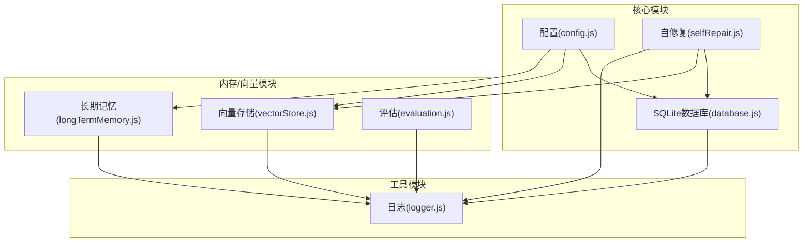
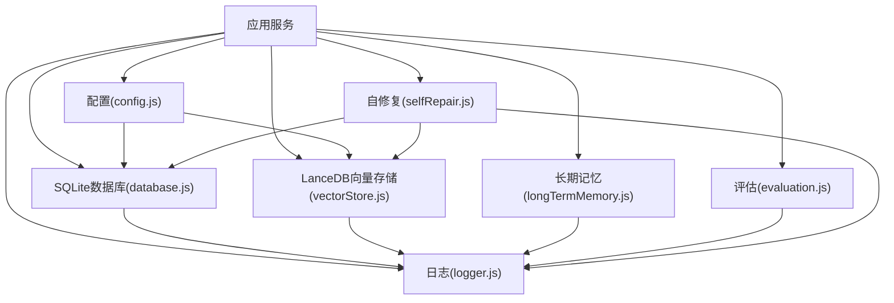
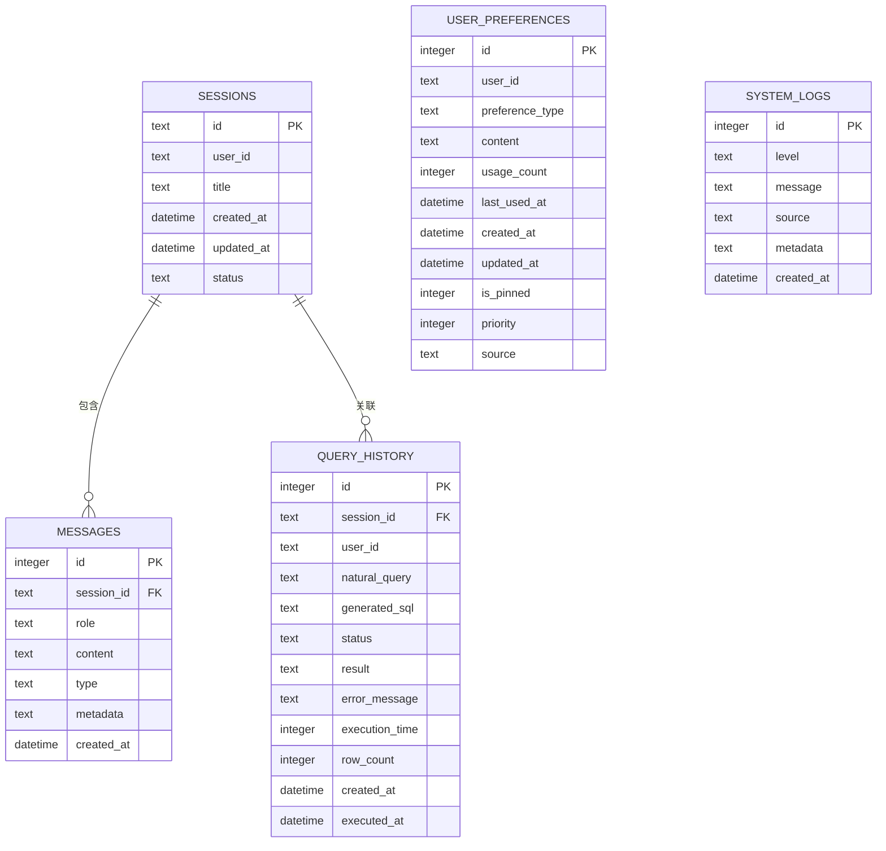
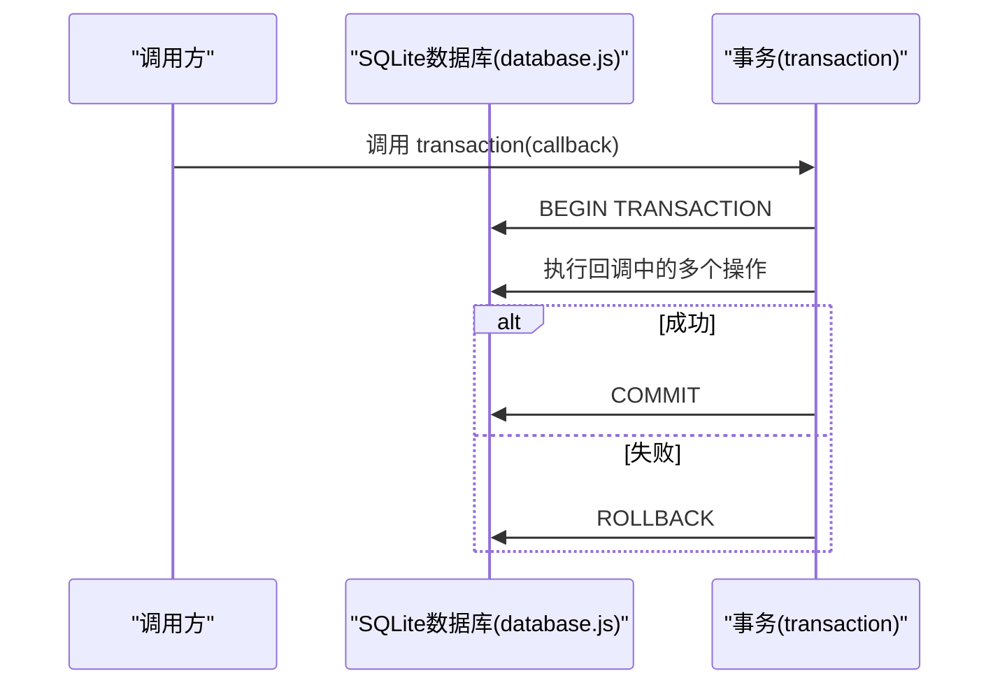
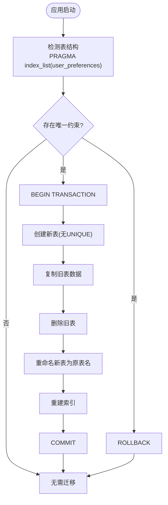
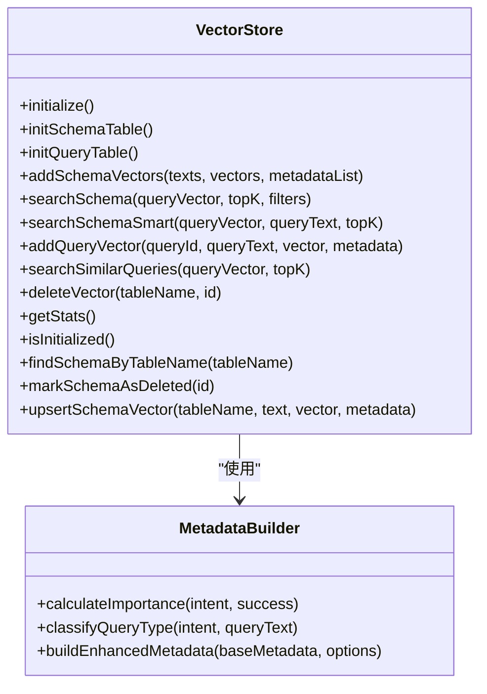
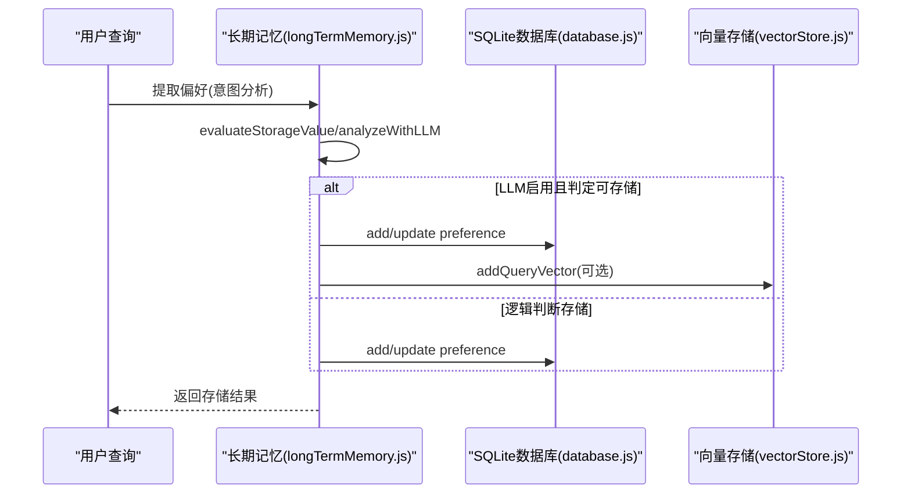
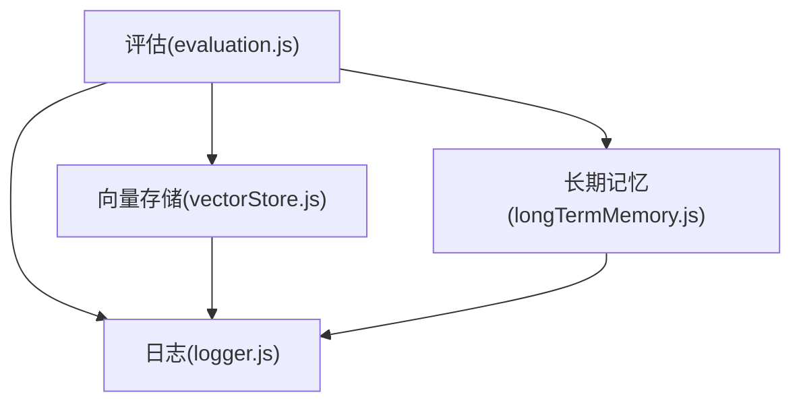
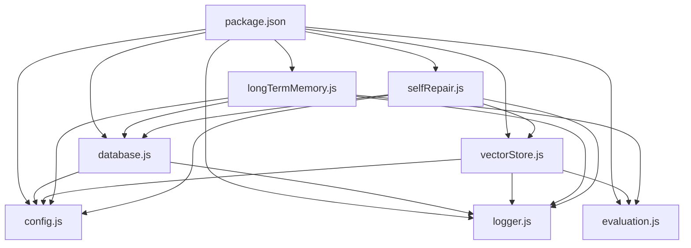

# 数据库架构

<cite>
**本文引用的文件**
- [database.js](file://backend/src/core/database.js)
- [config.js](file://backend/src/core/config.js)
- [vectorStore.js](file://backend/src/memory/vectorStore.js)
- [longTermMemory.js](file://backend/src/memory/longTermMemory.js)
- [evaluation.js](file://backend/src/utils/evaluation.js)
- [logger.js](file://backend/src/utils/logger.js)
- [selfRepair.js](file://backend/src/core/selfRepair.js)
- [package.json](file://backend/package.json)
</cite>

## 目录
1. [简介](#简介)
2. [项目结构](#项目结构)
3. [核心组件](#核心组件)
4. [架构总览](#架构总览)
5. [详细组件分析](#详细组件分析)
6. [依赖分析](#依赖分析)
7. [性能考虑](#性能考虑)
8. [故障排查指南](#故障排查指南)
9. [结论](#结论)
10. [附录](#附录)

## 简介
本文件面向NL2SQL项目的数据库架构，系统性阐述SQLite与LanceDB两类数据存储的设计与使用方式，涵盖：
- SQLite数据库：会话存储、查询历史、用户偏好、系统日志等表结构设计与索引优化策略
- LanceDB向量数据库：Schema与查询历史向量的存储、查询向量与模式向量的管理、智能搜索与重排序
- 数据库连接池配置、事务管理与并发控制策略
- 数据迁移与版本升级机制
- 性能优化建议与监控指标
- 数据备份与恢复策略

## 项目结构
NL2SQL后端采用“核心模块 + 内存/向量模块 + 工具模块”的分层组织：
- 核心模块：数据库管理、配置、自修复、SSE处理等
- 内存/向量模块：长期记忆、向量存储、记忆维护等
- 工具模块：日志、评估、Token预算等

图表来源
- [config.js:16-130](file://backend/src/core/config.js#L16-L130)
- [database.js:12-195](file://backend/src/core/database.js#L12-L195)
- [vectorStore.js:14-263](file://backend/src/memory/vectorStore.js#L14-L263)
- [longTermMemory.js:17-22](file://backend/src/memory/longTermMemory.js#L17-L22)
- [evaluation.js:12-31](file://backend/src/utils/evaluation.js#L12-L31)
- [logger.js:54-85](file://backend/src/utils/logger.js#L54-L85)
- [selfRepair.js:15-26](file://backend/src/core/selfRepair.js#L15-L26)

章节来源
- [config.js:16-130](file://backend/src/core/config.js#L16-L130)
- [database.js:12-195](file://backend/src/core/database.js#L12-L195)
- [vectorStore.js:14-263](file://backend/src/memory/vectorStore.js#L14-L263)
- [longTermMemory.js:17-22](file://backend/src/memory/longTermMemory.js#L17-L22)
- [evaluation.js:12-31](file://backend/src/utils/evaluation.js#L12-L31)
- [logger.js:54-85](file://backend/src/utils/logger.js#L54-L85)
- [selfRepair.js:15-26](file://backend/src/core/selfRepair.js#L15-L26)

## 核心组件
- SQLite数据库模块：提供数据库初始化、表结构定义、索引优化、事务管理、迁移机制与会话/消息/偏好/日志等核心CRUD接口
- LanceDB向量存储模块：提供Schema向量与查询向量的增删改查、智能搜索与重排序、统计与评估
- 配置模块：集中管理数据库路径、向量维度、连接池、安全阈值、评估开关等
- 评估与日志：非侵入式统计与日志记录，支撑性能与质量评估
- 自修复：定时任务驱动的健康检查、会话清理、记忆维护与统计收集

章节来源
- [database.js:206-267](file://backend/src/core/database.js#L206-L267)
- [vectorStore.js:233-263](file://backend/src/memory/vectorStore.js#L233-L263)
- [config.js:97-130](file://backend/src/core/config.js#L97-L130)
- [evaluation.js:71-96](file://backend/src/utils/evaluation.js#L71-L96)
- [logger.js:263-310](file://backend/src/utils/logger.js#L263-L310)
- [selfRepair.js:60-125](file://backend/src/core/selfRepair.js#L60-L125)

## 架构总览
NL2SQL采用“关系型 + 向量型”双数据库架构：
- SQLite：承载会话、消息、查询历史、用户偏好、系统日志等结构化数据
- LanceDB：承载Schema与查询历史的向量表示，支持语义检索与智能重排序
- 配置中心：统一管理数据库路径、向量维度、连接池、安全阈值、评估与日志策略
- 评估与日志：非侵入式统计与日志记录，支撑性能与质量评估
- 自修复：定时任务保障系统健康与资源回收

图表来源
- [config.js:16-130](file://backend/src/core/config.js#L16-L130)
- [database.js:12-195](file://backend/src/core/database.js#L12-L195)
- [vectorStore.js:14-263](file://backend/src/memory/vectorStore.js#L14-L263)
- [longTermMemory.js:17-22](file://backend/src/memory/longTermMemory.js#L17-L22)
- [evaluation.js:12-31](file://backend/src/utils/evaluation.js#L12-L31)
- [logger.js:54-85](file://backend/src/utils/logger.js#L54-L85)
- [selfRepair.js:15-26](file://backend/src/core/selfRepair.js#L15-L26)

## 详细组件分析

### SQLite数据库设计与索引优化
- 表结构概览
  - sessions：会话信息，包含用户ID、标题、状态、时间戳
  - messages：会话消息，包含角色、类型、元数据、时间戳
  - query_history：查询历史，包含用户ID、自然语言、生成SQL、状态、结果、耗时、行数、时间戳
  - user_preferences：用户偏好，包含偏好类型、内容、使用次数、时间戳、置顶与优先级
  - system_logs：系统日志，包含级别、消息、来源、元数据、时间戳
- 索引策略
  - sessions：按user_id、status、updated_at建立索引，加速按用户/状态/时间查询
  - messages：按session_id、created_at建立索引，加速按会话与时间排序
  - query_history：按user_id、session_id、created_at、status建立索引，加速多维查询与排序
  - user_preferences：按user_id、preference_type、复合(user_id, preference_type)建立索引，加速偏好检索
  - system_logs：按level、created_at建立索引，加速按级别与时间查询
- 外键约束
  - 启用PRAGMA foreign_keys = ON，确保数据一致性（如消息与会话、查询历史与会话的引用完整性）

图表来源
- [database.js:44-194](file://backend/src/core/database.js#L44-L194)

章节来源
- [database.js:39-195](file://backend/src/core/database.js#L39-L195)
- [database.js:234-241](file://backend/src/core/database.js#L234-L241)

### 事务管理与并发控制
- 事务封装
  - transaction(callback)：封装BEGIN/COMMIT/ROLLBACK，保证批量操作原子性
- 并发控制
  - SQLite采用文件锁机制，单进程内串行化访问；通过事务与索引减少锁竞争
  - 业务层面：删除会话时先删除消息再删除会话，使用事务保证一致性
- 连接池
  - 配置中定义了SR数据源的连接池参数（最小/最大连接数、获取/空闲超时），用于业务数据库连接池管理

图表来源
- [database.js:440-454](file://backend/src/core/database.js#L440-L454)

章节来源
- [database.js:440-454](file://backend/src/core/database.js#L440-L454)
- [config.js:115-130](file://backend/src/core/config.js#L115-L130)

### 数据迁移与版本升级
- 迁移策略
  - 启动时执行runMigrations，检测user_preferences表的唯一约束并重建表以移除UNIQUE约束
  - 使用事务包裹重建过程，失败时回滚，保证数据安全
- 升级路径
  - 通过PRAGMA与DDL变更实现结构演进，避免破坏性变更
  - 保持向后兼容：新增字段与索引，逐步替换旧约束

图表来源
- [database.js:277-344](file://backend/src/core/database.js#L277-L344)

章节来源
- [database.js:277-344](file://backend/src/core/database.js#L277-L344)

### LanceDB向量数据库集成
- 表结构与初始化
  - schema_vectors：Schema向量表，包含id、text、vector、metadata、created_at
  - query_vectors：查询历史向量表，包含id、text、vector、metadata、created_at
  - 初始化时尝试打开表，不存在则创建并写入占位数据
- 向量操作
  - addSchemaVectors/addQueryVector：批量/单条添加向量
  - searchSchema/searchSimilarQueries：向量检索，返回text、distance、metadata
  - searchSchemaSmart：基于查询意图的智能搜索与重排序
- 元数据增强
  - buildEnhancedMetadata：构建包含时间戳、重要性评分、查询类型、复杂度、执行信息等的元数据
- 统计与评估
  - recordVectorSearch：记录向量检索命中与距离分布
  - getVectorSearchStats/getFullStatsReport：查询命中率与分布统计

图表来源
- [vectorStore.js:233-263](file://backend/src/memory/vectorStore.js#L233-L263)
- [vectorStore.js:29-197](file://backend/src/memory/vectorStore.js#L29-L197)
- [vectorStore.js:338-437](file://backend/src/memory/vectorStore.js#L338-L437)
- [vectorStore.js:553-620](file://backend/src/memory/vectorStore.js#L553-L620)
- [vectorStore.js:632-733](file://backend/src/memory/vectorStore.js#L632-L733)

章节来源
- [vectorStore.js:233-263](file://backend/src/memory/vectorStore.js#L233-L263)
- [vectorStore.js:29-197](file://backend/src/memory/vectorStore.js#L29-L197)
- [vectorStore.js:338-437](file://backend/src/memory/vectorStore.js#L338-L437)
- [vectorStore.js:553-620](file://backend/src/memory/vectorStore.js#L553-L620)
- [vectorStore.js:632-733](file://backend/src/memory/vectorStore.js#L632-L733)

### 长期记忆与偏好管理
- 偏好类型
  - query_pattern、field_alias、metric_preference、dimension_preference
- 存储策略
  - 通过findExistingPreference判断是否已存在，避免重复存储
  - 使用updatePreferenceUsage更新使用统计
  - 异步入队存储，降低主线程阻塞
- LLM智能提炼
  - analyzeWithLLM：基于提示词判断是否值得存储、是否为个人偏好、置信度与理由
  - storeLLMExtractedPreference：按类型存储字段别名、指标/维度偏好、查询模式等

图表来源
- [longTermMemory.js:313-471](file://backend/src/memory/longTermMemory.js#L313-L471)
- [longTermMemory.js:601-645](file://backend/src/memory/longTermMemory.js#L601-L645)
- [longTermMemory.js:672-743](file://backend/src/memory/longTermMemory.js#L672-L743)
- [database.js:618-675](file://backend/src/core/database.js#L618-L675)

章节来源
- [longTermMemory.js:313-471](file://backend/src/memory/longTermMemory.js#L313-L471)
- [longTermMemory.js:601-645](file://backend/src/memory/longTermMemory.js#L601-L645)
- [longTermMemory.js:672-743](file://backend/src/memory/longTermMemory.js#L672-L743)
- [database.js:618-675](file://backend/src/core/database.js#L618-L675)

### 评估与监控
- 向量检索统计
  - recordVectorSearch：记录schema/query检索次数与命中、距离分布
  - getVectorSearchStats：查询命中率与分布
- 长期记忆统计
  - recordMemoryHit：记录记忆命中
  - getLongTermMemoryStats：总体命中率与按类型命中率
- 质量评估
  - evaluateSchemaVectorQuality：基于测试查询评估召回精度
  - evaluateQueryVectorQuality：基于相似查询对评估余弦相似度
- 日志与追踪
  - Logger：统一日志输出、文件轮转、结构化元数据、追踪会话

图表来源
- [evaluation.js:71-96](file://backend/src/utils/evaluation.js#L71-L96)
- [evaluation.js:344-407](file://backend/src/utils/evaluation.js#L344-L407)
- [logger.js:263-310](file://backend/src/utils/logger.js#L263-L310)

章节来源
- [evaluation.js:71-96](file://backend/src/utils/evaluation.js#L71-L96)
- [evaluation.js:344-407](file://backend/src/utils/evaluation.js#L344-L407)
- [logger.js:263-310](file://backend/src/utils/logger.js#L263-L310)

## 依赖分析
- 外部依赖
  - sqlite3：SQLite数据库驱动
  - vectordb：LanceDB向量数据库客户端
  - dotenv/cors/body-parser/uuid/dayjs/node-cron：通用工具与定时任务
- 内部依赖
  - database.js依赖config.js与logger.js
  - vectorStore.js依赖config.js、logger.js、evaluation.js
  - longTermMemory.js依赖database.js、logger.js、llmService、evaluation.js、memoryQueue
  - selfRepair.js依赖cron、config.js、logger.js、database.js、vectorStore.js、sseHandler

图表来源
- [package.json:10-20](file://backend/package.json#L10-L20)
- [database.js:12-19](file://backend/src/core/database.js#L12-L19)
- [vectorStore.js:14-23](file://backend/src/memory/vectorStore.js#L14-L23)
- [longTermMemory.js:17-22](file://backend/src/memory/longTermMemory.js#L17-L22)
- [evaluation.js:12-13](file://backend/src/utils/evaluation.js#L12-L13)
- [logger.js:16-23](file://backend/src/utils/logger.js#L16-L23)
- [config.js:16-16](file://backend/src/core/config.js#L16-L16)
- [selfRepair.js:15-26](file://backend/src/core/selfRepair.js#L15-L26)

章节来源
- [package.json:10-20](file://backend/package.json#L10-L20)
- [database.js:12-19](file://backend/src/core/database.js#L12-L19)
- [vectorStore.js:14-23](file://backend/src/memory/vectorStore.js#L14-L23)
- [longTermMemory.js:17-22](file://backend/src/memory/longTermMemory.js#L17-L22)
- [evaluation.js:12-13](file://backend/src/utils/evaluation.js#L12-L13)
- [logger.js:16-23](file://backend/src/utils/logger.js#L16-L23)
- [config.js:16-16](file://backend/src/core/config.js#L16-L16)
- [selfRepair.js:15-26](file://backend/src/core/selfRepair.js#L15-L26)

## 性能考虑
- SQLite性能优化
  - 合理索引：按查询模式建立索引，避免全表扫描
  - 事务批处理：使用transaction合并多次写入，减少提交开销
  - 外键约束：启用PRAGMA foreign_keys = ON，确保一致性的同时避免级联删除带来的性能损耗
- LanceDB性能优化
  - 向量维度与索引：合理设置向量维度，结合metadata过滤与智能重排序
  - 检索topK：适当扩大搜索范围再裁剪，提升召回质量
  - 元数据压缩：将频繁过滤字段放入metadata，减少应用层二次过滤
- 评估与监控
  - 使用evaluation模块记录命中率与距离分布，指导索引与向量质量优化
  - 通过selfRepair的定时任务监控慢查询与失败率，及时预警

[本节为通用性能建议，不直接分析具体文件]

## 故障排查指南
- 数据库连接失败
  - 检查DB_PATH与数据库文件权限，确认路径正确
  - 查看日志中的错误堆栈，定位具体SQL或索引问题
- 向量数据库未初始化
  - 确认VECTOR_DB_PATH存在且可写
  - 初始化失败会记录警告，不影响应用启动，需人工介入
- 迁移失败
  - 检查user_preferences表结构，确认唯一约束重建流程
  - 事务回滚后需检查中间状态，必要时手动修复
- 慢查询与高失败率
  - 通过selfRepair的每日自检报告查看慢查询阈值与失败率
  - 结合evaluation统计与日志追踪定位瓶颈

章节来源
- [database.js:225-229](file://backend/src/core/database.js#L225-L229)
- [vectorStore.js:258-262](file://backend/src/memory/vectorStore.js#L258-L262)
- [selfRepair.js:169-310](file://backend/src/core/selfRepair.js#L169-L310)
- [evaluation.js:344-407](file://backend/src/utils/evaluation.js#L344-L407)

## 结论
NL2SQL采用SQLite与LanceDB双数据库架构，分别承担结构化数据与语义检索需求。通过完善的索引策略、事务封装、迁移机制与自修复定时任务，系统在保证数据一致性与可维护性的同时，具备良好的扩展性与可观测性。配合评估与日志体系，能够持续优化性能与质量。

[本节为总结性内容，不直接分析具体文件]

## 附录
- 数据备份与恢复
  - SQLite：定期复制数据库文件；生产环境建议使用事务日志备份策略
  - LanceDB：备份数据目录（data与_index目录），恢复时保持目录结构一致
- 配置要点
  - DB_PATH与VECTOR_DB_PATH：确保路径存在且权限正确
  - EMBEDDING维度：与Embedding模型一致，避免向量不匹配
  - 安全阈值：ALLOWED_TABLES、MAX_QUERY_ROWS、QUERY_TIMEOUT等需按生产环境调整

章节来源
- [config.js:97-109](file://backend/src/core/config.js#L97-L109)
- [config.js:160-170](file://backend/src/core/config.js#L160-L170)