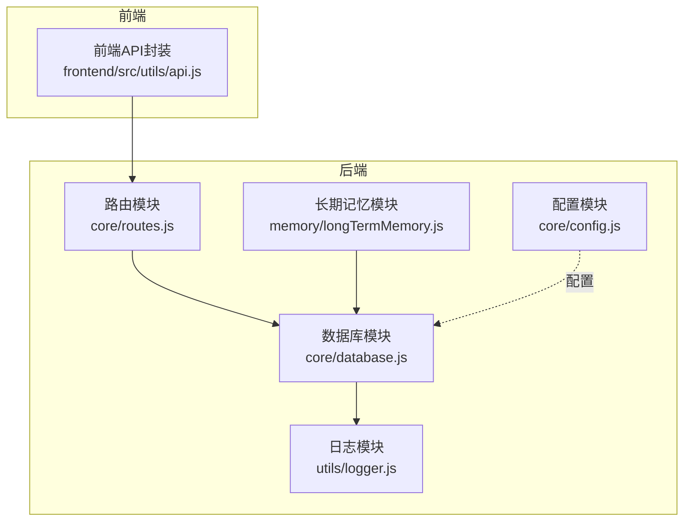
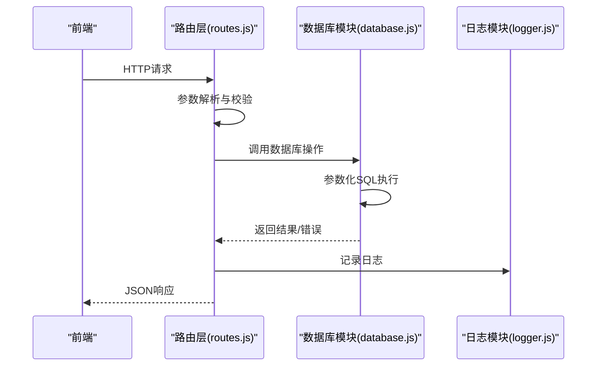
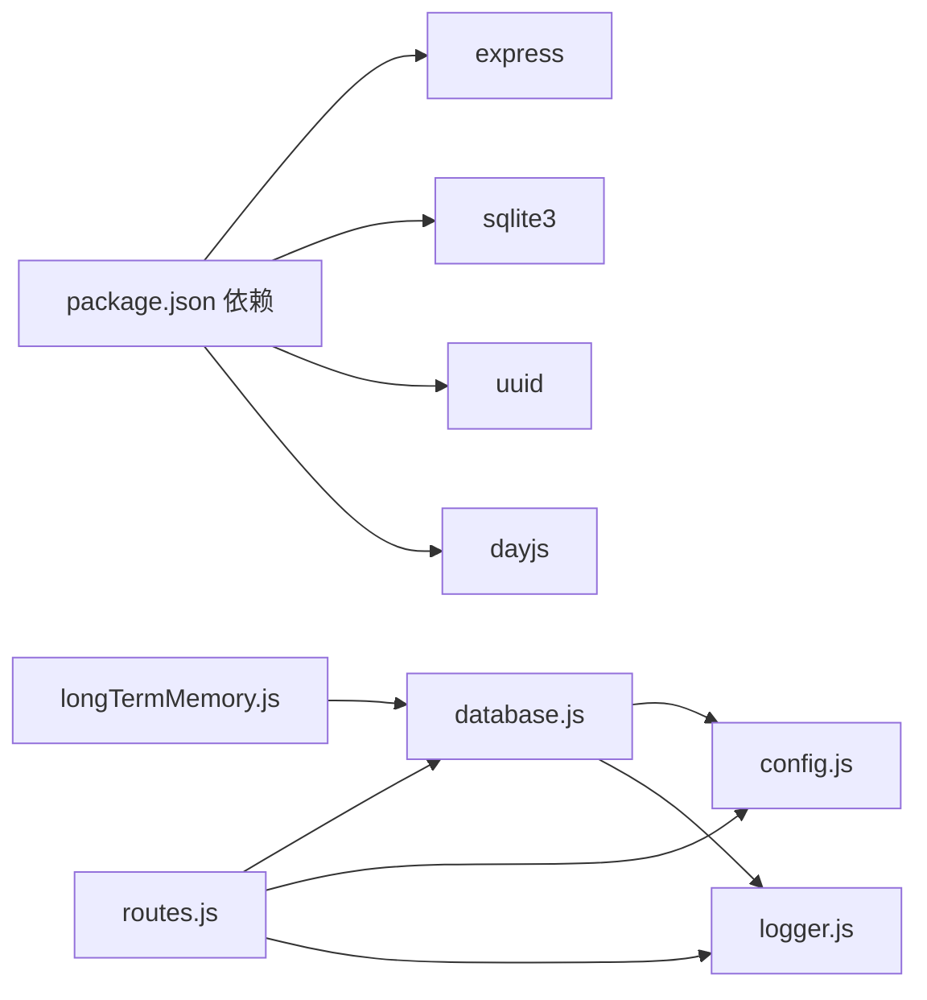

# 数据操作API

<cite>
**本文引用的文件**
- [database.js](file://backend/src/core/database.js)
- [routes.js](file://backend/src/core/routes.js)
- [config.js](file://backend/src/core/config.js)
- [logger.js](file://backend/src/utils/logger.js)
- [longTermMemory.js](file://backend/src/memory/longTermMemory.js)
- [api.js](file://frontend/src/utils/api.js)
- [package.json](file://backend/package.json)
</cite>

## 目录
1. [简介](#简介)
2. [项目结构](#项目结构)
3. [核心组件](#核心组件)
4. [架构概览](#架构概览)
5. [详细组件分析](#详细组件分析)
6. [依赖分析](#依赖分析)
7. [性能考量](#性能考量)
8. [故障排查指南](#故障排查指南)
9. [结论](#结论)
10. [附录](#附录)

## 简介
本文件面向NL2SQL项目的后端数据操作API，系统性梳理数据库模块提供的公共接口，涵盖：
- 会话管理API：createSession、getSession、getUserSessions、updateSessionTitle、deleteSession
- 消息管理API：addMessage、getSessionMessages
- 用户偏好API：addUserPreference、getUserPreferences、updatePreferenceUsage、findExistingPreference、deleteUserPreference
- 查询历史API：查询历史列表（由路由层提供）
- 数据库事务与并发控制策略
- 安全性考虑（SQL注入防护、参数化查询、白名单与限制）

目标是帮助开发者快速理解API的参数规范、返回值格式、错误处理机制，并给出最佳实践与排障建议。

## 项目结构
后端采用模块化设计，核心数据层位于core/database.js，HTTP路由位于core/routes.js，日志与配置分别在utils/logger.js与core/config.js，前端通过frontend/src/utils/api.js封装调用。

图表来源
- [database.js](file://backend/src/core/database.js)
- [routes.js](file://backend/src/core/routes.js)
- [config.js](file://backend/src/core/config.js)
- [logger.js](file://backend/src/utils/logger.js)
- [longTermMemory.js](file://backend/src/memory/longTermMemory.js)
- [api.js](file://frontend/src/utils/api.js)

章节来源
- [database.js](file://backend/src/core/database.js)
- [routes.js](file://backend/src/core/routes.js)
- [config.js](file://backend/src/core/config.js)
- [logger.js](file://backend/src/utils/logger.js)
- [longTermMemory.js](file://backend/src/memory/longTermMemory.js)
- [api.js](file://frontend/src/utils/api.js)

## 核心组件
- 数据库模块(database.js)：提供SQLite连接、表初始化、事务、查询/执行、以及会话、消息、用户偏好等CRUD操作。
- 路由模块(routes.js)：定义REST API端点，调用数据库模块执行业务逻辑，并进行错误处理与响应封装。
- 配置模块(config.js)：集中管理数据库路径、安全限制、日志级别等配置。
- 日志模块(logger.js)：统一日志输出，支持文件轮转与结构化日志。
- 长期记忆模块(longTermMemory.js)：对用户偏好进行智能提取与存储，间接调用数据库模块。

章节来源
- [database.js](file://backend/src/core/database.js)
- [routes.js](file://backend/src/core/routes.js)
- [config.js](file://backend/src/core/config.js)
- [logger.js](file://backend/src/utils/logger.js)
- [longTermMemory.js](file://backend/src/memory/longTermMemory.js)

## 架构概览
数据操作API的调用链路如下：
- 前端通过HTTP请求调用路由层
- 路由层解析参数、校验输入、调用数据库模块
- 数据库模块执行参数化SQL，返回结构化结果
- 路由层根据结果返回JSON响应或错误信息
- 日志模块记录关键操作与错误

图表来源
- [routes.js](file://backend/src/core/routes.js)
- [database.js](file://backend/src/core/database.js)
- [logger.js](file://backend/src/utils/logger.js)

## 详细组件分析

### 会话管理API
- createSession(sessionId, userId, title)
  - 功能：创建新会话
  - 参数：sessionId(字符串)、userId(字符串)、title(可选字符串)
  - 返回：Promise对象，包含创建的会话信息
  - 错误：数据库连接未初始化或SQL执行失败时抛出错误
  - 安全：参数化插入，防止SQL注入
  - 并发：无显式锁，依赖SQLite事务隔离
  - 示例：见“最佳实践”章节

- getSession(sessionId)
  - 功能：获取指定会话（仅active状态）
  - 参数：sessionId(字符串)
  - 返回：Promise对象，会话记录或null
  - 错误：数据库错误时记录日志并抛出

- getUserSessions(userId, limit=20)
  - 功能：获取用户所有active会话，按updated_at降序
  - 参数：userId(字符串)、limit(数字)
  - 返回：Promise对象，会话数组

- updateSessionTitle(sessionId, title)
  - 功能：更新会话标题
  - 返回：Promise对象，布尔值表示是否影响行数>0

- deleteSession(sessionId)
  - 功能：删除会话（级联删除消息）
  - 返回：Promise对象，布尔值
  - 错误：内部使用事务，失败时回滚

章节来源
- [database.js](file://backend/src/core/database.js)
- [routes.js](file://backend/src/core/routes.js)

### 消息管理API
- addMessage(sessionId, role, content, type='text', metadata=null)
  - 功能：向会话添加消息
  - 参数：sessionId、role、content、type、metadata(JSON对象)
  - 返回：Promise对象，包含插入的消息信息
  - 注意：内部会调用touchSession更新会话时间

- getSessionMessages(sessionId, limit=50)
  - 功能：获取会话消息历史
  - 返回：Promise对象，消息数组（metadata已解析为JSON）

章节来源
- [database.js](file://backend/src/core/database.js)
- [routes.js](file://backend/src/core/routes.js)

### 用户偏好API
- addUserPreference(userId, type, content)
  - 功能：添加用户偏好
  - 参数：userId、type(偏好类型)、content(JSON对象)
  - 返回：Promise对象，偏好记录

- getUserPreferences(userId, type=null, limit=50)
  - 功能：获取用户偏好列表
  - 返回：Promise对象，偏好数组（content已解析为JSON）

- updatePreferenceUsage(preferenceId)
  - 功能：更新偏好使用统计（usage_count+1、last_used_at=CURRENT_TIMESTAMP）
  - 返回：Promise对象，布尔值

- findExistingPreference(userId, type, contentKey)
  - 功能：查找已存在的偏好（按name或user_term匹配）
  - 返回：Promise对象，偏好记录或null

- deleteUserPreference(preferenceId)
  - 功能：删除用户偏好
  - 返回：Promise对象，布尔值

- getTopQueryPatterns(userId, limit=10)
  - 功能：获取常用查询模板（按usage_count排序）
  - 返回：Promise对象，模板数组

- getFieldAliases(userId, fieldName=null)
  - 功能：获取字段别名映射
  - 返回：Promise对象，别名数组

- getRecentPatternCount(userId, patternType, days=7)
  - 功能：统计近期相似查询次数
  - 返回：Promise对象，数字

章节来源
- [database.js](file://backend/src/core/database.js)
- [longTermMemory.js](file://backend/src/memory/longTermMemory.js)

### 查询历史API
- GET /api/queries/history
  - 查询参数：user_id、session_id、limit
  - 返回：Promise对象，历史数组

章节来源
- [routes.js](file://backend/src/core/routes.js)

### 数据库事务与并发控制
- transaction(callback)
  - 功能：在单个事务中执行多个数据库操作
  - 行为：BEGIN -> 执行回调 -> COMMIT 或 ROLLBACK
  - deleteSession内部使用事务，保证消息与会话删除的一致性

- 并发控制
  - SQLite默认使用行级锁，事务内串行化执行
  - 无显式乐观/悲观锁，适合单机部署场景
  - 建议：高并发场景下考虑升级为PostgreSQL/MySQL

章节来源
- [database.js](file://backend/src/core/database.js)

### 安全性考虑
- SQL注入防护
  - 所有查询均使用参数化SQL（?占位符 + 参数数组）
  - 示例：insert/update/delete均通过run/sql执行，避免字符串拼接

- 白名单与限制
  - 配置项：security.allowedTables（允许查询的表白名单）
  - 配置项：security.maxQueryRows（单次查询最大行数）
  - 配置项：security.queryTimeout（查询超时）
  - 配置项：security.forbiddenKeywords（禁止的关键字列表）
  - 配置项：security.sensitiveFields（敏感字段脱敏）

- 输入校验与错误处理
  - 路由层对必填参数进行校验（如POST /api/sessions要求user_id）
  - 数据库层捕获SQL错误并记录日志
  - 前端统一响应拦截器处理错误

章节来源
- [config.js](file://backend/src/core/config.js)
- [routes.js](file://backend/src/core/routes.js)
- [database.js](file://backend/src/core/database.js)
- [logger.js](file://backend/src/utils/logger.js)
- [api.js](file://frontend/src/utils/api.js)

### 参数规范与返回值格式
- 通用约定
  - 所有数据库操作返回Promise
  - 成功：resolve返回结构化数据
  - 失败：reject抛出错误，路由层捕获并返回JSON错误对象
  - 日志：使用logger记录关键操作与错误

- 会话管理
  - createSession：返回包含id、user_id、title的对象
  - getSession：返回单条会话记录或null
  - getUserSessions：返回数组，按updated_at降序
  - updateSessionTitle：返回布尔值
  - deleteSession：返回布尔值

- 消息管理
  - addMessage：返回包含id、session_id、role、content、type、metadata的对象
  - getSessionMessages：返回数组，metadata为JSON对象

- 用户偏好
  - addUserPreference：返回包含id、user_id、preference_type、content的对象
  - getUserPreferences：返回数组，content为JSON对象
  - updatePreferenceUsage：返回布尔值
  - findExistingPreference：返回单条记录或null
  - deleteUserPreference：返回布尔值
  - getTopQueryPatterns/getFieldAliases：返回数组
  - getRecentPatternCount：返回数字

章节来源
- [database.js](file://backend/src/core/database.js)
- [routes.js](file://backend/src/core/routes.js)

### 错误处理机制
- 数据库层
  - query/queryOne/run均捕获错误并记录日志
  - transaction内部捕获异常并回滚

- 路由层
  - try/catch包裹API逻辑
  - 返回JSON错误对象，包含error字段
  - 404：资源不存在
  - 500：服务器内部错误

- 前端
  - 响应拦截器统一处理错误，打印日志并reject

章节来源
- [database.js](file://backend/src/core/database.js)
- [routes.js](file://backend/src/core/routes.js)
- [logger.js](file://backend/src/utils/logger.js)
- [api.js](file://frontend/src/utils/api.js)

### 最佳实践
- 会话管理
  - 创建会话：使用POST /api/sessions，携带user_id与可选title
  - 获取会话：GET /api/sessions/:sessionId
  - 删除会话：DELETE /api/sessions/:sessionId（内部级联删除消息）

- 消息管理
  - 添加消息：POST /api/sessions/:sessionId/messages（role/content/type/metadata）
  - 获取消息：GET /api/sessions/:sessionId/messages?limit=50

- 用户偏好
  - 添加偏好：POST /api/preferences/:userId/templates（name/dimensions/metrics/default_time_range）
  - 学习别名：POST /api/preferences/:userId/learn-alias（user_term/schema_field/field_type）
  - 获取偏好：GET /api/preferences/:userId?type=query_pattern&limit=50
  - 删除偏好：DELETE /api/preferences/:preferenceId

- 查询历史
  - 获取历史：GET /api/queries/history?user_id=xxx&session_id=xxx&limit=20

- 安全与性能
  - 配置ALLOWED_TABLES白名单，避免任意表查询
  - 设置MAX_QUERY_ROWS与QUERY_TIMEOUT，防止大查询与超时
  - 使用事务保证一致性（如删除会话）

章节来源
- [routes.js](file://backend/src/core/routes.js)
- [database.js](file://backend/src/core/database.js)
- [config.js](file://backend/src/core/config.js)

## 依赖分析
- 外部依赖
  - sqlite3：SQLite驱动
  - express：Web框架
  - uuid：生成会话ID
  - dayjs：时间处理
  - dotenv：环境变量加载

- 内部依赖
  - database.js依赖config.js与logger.js
  - routes.js依赖database.js、logger.js、config.js
  - longTermMemory.js依赖database.js、logger.js、config.js

图表来源
- [package.json](file://backend/package.json)
- [database.js](file://backend/src/core/database.js)
- [routes.js](file://backend/src/core/routes.js)
- [config.js](file://backend/src/core/config.js)
- [logger.js](file://backend/src/utils/logger.js)
- [longTermMemory.js](file://backend/src/memory/longTermMemory.js)

章节来源
- [package.json](file://backend/package.json)
- [database.js](file://backend/src/core/database.js)
- [routes.js](file://backend/src/core/routes.js)
- [config.js](file://backend/src/core/config.js)
- [logger.js](file://backend/src/utils/logger.js)
- [longTermMemory.js](file://backend/src/memory/longTermMemory.js)

## 性能考量
- 索引优化
  - sessions：user_id、status、updated_at
  - messages：session_id、created_at
  - query_history：user_id、session_id、created_at、status
  - user_preferences：user_id、preference_type、复合索引(user_id, preference_type)

- 查询限制
  - 默认limit参数控制返回数量
  - 配置maxQueryRows限制单次查询行数
  - 配置queryTimeout防止长事务阻塞

- 事务与并发
  - 事务保证一致性，但SQLite在高并发下可能成为瓶颈
  - 建议：单机部署可满足需求；生产环境建议迁移到PostgreSQL/MySQL

[本节为通用指导，无需列出章节来源]

## 故障排查指南
- 数据库未初始化
  - 现象：调用getDb时报错
  - 处理：确保先调用initialize()

- SQL执行失败
  - 现象：日志出现SQL执行失败
  - 处理：检查参数化SQL与参数数组，确认表结构与索引

- 会话不存在
  - 现象：GET /api/sessions/:sessionId返回404
  - 处理：确认sessionId正确且状态为active

- 删除会话失败
  - 现象：deleteSession抛出错误
  - 处理：检查外键约束与事务回滚日志

- 偏好重复或冲突
  - 现象：findExistingPreference返回已存在记录
  - 处理：updatePreferenceUsage更新使用统计；冲突时记录警告

- 前端错误
  - 现象：响应拦截器打印错误
  - 处理：检查后端路由返回的error字段与HTTP状态码

章节来源
- [database.js](file://backend/src/core/database.js)
- [routes.js](file://backend/src/core/routes.js)
- [logger.js](file://backend/src/utils/logger.js)
- [api.js](file://frontend/src/utils/api.js)

## 结论
NL2SQL的数据操作API以SQLite为核心，提供会话、消息、用户偏好等核心能力，并通过参数化SQL与事务保障安全性与一致性。配合路由层的参数校验与错误处理，以及配置层的安全限制，形成完整的数据访问体系。建议在生产环境中结合白名单、行数与超时限制，并考虑数据库升级以应对高并发场景。

[本节为总结性内容，无需列出章节来源]

## 附录
- 常用环境变量
  - DB_PATH：SQLite数据库文件路径
  - ALLOWED_TABLES：允许查询的表白名单
  - MAX_QUERY_ROWS：单次查询最大行数
  - QUERY_TIMEOUT：查询超时（毫秒）
  - LOG_LEVEL：日志级别
  - LOG_FILE：日志文件路径

- 偏好类型
  - query_pattern：查询模式
  - field_alias：字段别名
  - metric_preference：指标偏好
  - dimension_preference：维度偏好

章节来源
- [config.js](file://backend/src/core/config.js)
- [database.js](file://backend/src/core/database.js)