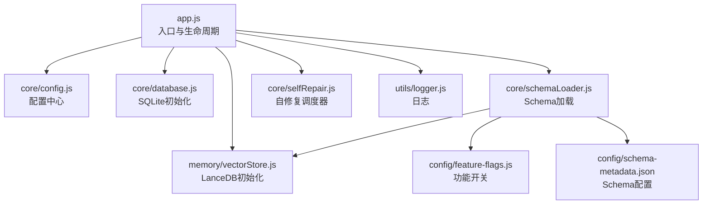
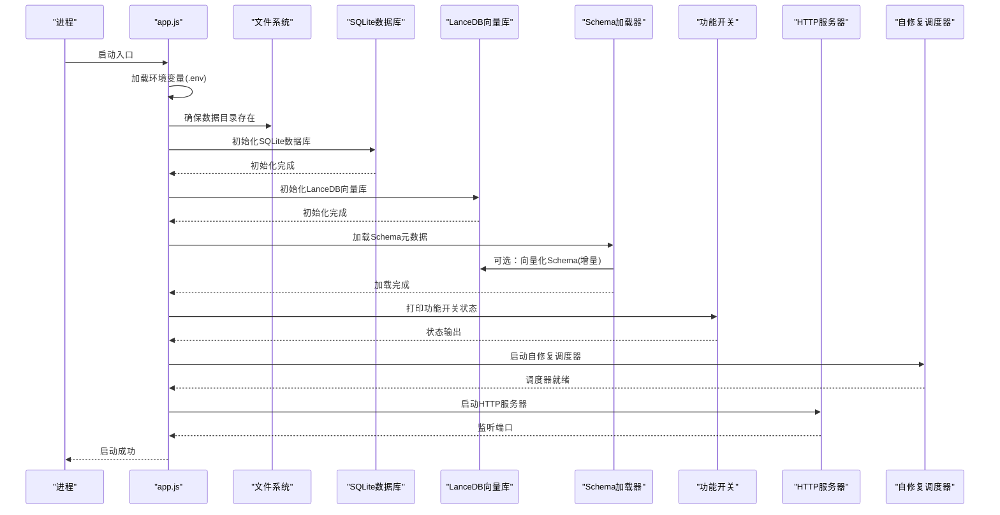
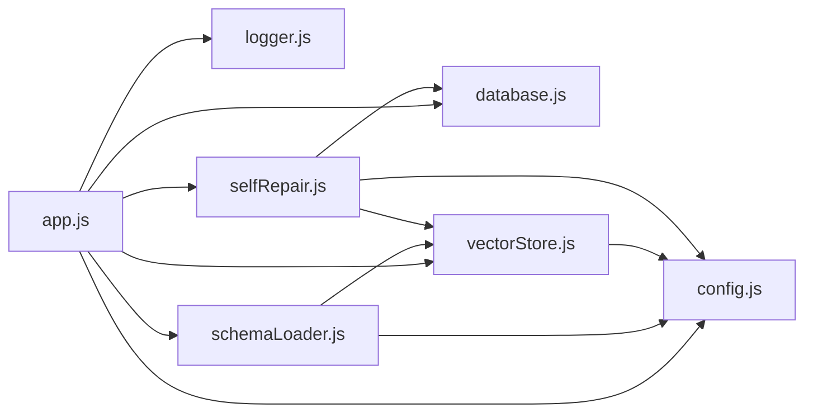

# 服务初始化与启动

<cite>
**本文引用的文件**
- [app.js](file://backend/src/app.js)
- [config.js](file://backend/src/core/config.js)
- [database.js](file://backend/src/core/database.js)
- [vectorStore.js](file://backend/src/memory/vectorStore.js)
- [schemaLoader.js](file://backend/src/core/schemaLoader.js)
- [logger.js](file://backend/src/utils/logger.js)
- [selfRepair.js](file://backend/src/core/selfRepair.js)
- [feature-flags.js](file://backend/config/feature-flags.js)
- [schema-metadata.example.json](file://backend/config/schema-metadata.example.json)
- [schema-metadata.json](file://backend/config/schema-metadata.json)
- [package.json](file://backend/package.json)
</cite>

## 目录
1. [简介](#简介)
2. [项目结构](#项目结构)
3. [核心组件](#核心组件)
4. [架构总览](#架构总览)
5. [详细组件分析](#详细组件分析)
6. [依赖关系分析](#依赖关系分析)
7. [性能考量](#性能考量)
8. [故障排查指南](#故障排查指南)
9. [结论](#结论)

## 简介
本文面向NL2SQL服务的启动与初始化流程，系统性阐述从环境变量加载、模块依赖初始化、数据目录创建，到SQLite数据库、LanceDB向量数据库、Schema元数据与业务语义层的加载顺序与依赖关系；同时给出错误处理与日志记录策略、优雅关闭机制（SIGTERM/SIGINT）、以及常见启动问题的排查与解决建议。

## 项目结构
后端采用模块化设计，入口文件集中管理初始化顺序与生命周期：
- 入口与生命周期：app.js
- 配置中心：core/config.js
- 数据层：core/database.js（SQLite）
- 向量存储：memory/vectorStore.js（LanceDB）
- Schema与语义：core/schemaLoader.js
- 日志：utils/logger.js
- 自修复：core/selfRepair.js
- 配置文件：config/feature-flags.js、schema-metadata.json/.example.json
- 依赖声明：package.json

图表来源
- [app.js:97-188](file://backend/src/app.js#L97-L188)
- [config.js:16-355](file://backend/src/core/config.js#L16-L355)
- [database.js:206-267](file://backend/src/core/database.js#L206-L267)
- [vectorStore.js:233-263](file://backend/src/memory/vectorStore.js#L233-L263)
- [schemaLoader.js:69-122](file://backend/src/core/schemaLoader.js#L69-L122)
- [selfRepair.js:60-125](file://backend/src/core/selfRepair.js#L60-L125)
- [logger.js:54-442](file://backend/src/utils/logger.js#L54-L442)
- [feature-flags.js:16-96](file://backend/config/feature-flags.js#L16-L96)
- [schema-metadata.json:1-800](file://backend/config/schema-metadata.json#L1-L800)

章节来源
- [app.js:1-260](file://backend/src/app.js#L1-L260)
- [package.json:1-28](file://backend/package.json#L1-L28)

## 核心组件
- 入口与生命周期管理：负责环境变量加载、中间件配置、路由挂载、HTTP服务器创建、初始化顺序编排、优雅关闭与未捕获异常处理。
- 配置中心：集中读取环境变量并提供默认值，涵盖LLM、Embedding、数据库、安全、会话、日志、自修复、Schema、长期记忆、上下文管理、评估等配置。
- SQLite数据库：负责会话、消息、查询历史、用户偏好、系统日志等表的创建与迁移。
- LanceDB向量数据库：负责schema_vectors与query_vectors表的初始化与向量增删改查能力。
- Schema加载器：负责Schema元数据加载、校验、映射构建、向量化（增量更新）与语义搜索。
- 日志模块：统一日志输出（控制台/文件），支持级别、轮转、结构化与追踪。
- 自修复调度器：定时任务（每日自检、会话清理、统计收集、记忆维护）。
- 功能开关：按Phase控制新功能启用与回滚。
- Schema配置：提供表结构、关系、指标、维度等元数据。

章节来源
- [app.js:97-188](file://backend/src/app.js#L97-L188)
- [config.js:16-355](file://backend/src/core/config.js#L16-L355)
- [database.js:206-267](file://backend/src/core/database.js#L206-L267)
- [vectorStore.js:233-263](file://backend/src/memory/vectorStore.js#L233-L263)
- [schemaLoader.js:69-122](file://backend/src/core/schemaLoader.js#L69-L122)
- [logger.js:54-442](file://backend/src/utils/logger.js#L54-L442)
- [selfRepair.js:60-125](file://backend/src/core/selfRepair.js#L60-L125)
- [feature-flags.js:16-96](file://backend/config/feature-flags.js#L16-L96)
- [schema-metadata.json:1-800](file://backend/config/schema-metadata.json#L1-L800)

## 架构总览
服务启动遵循严格的初始化顺序，确保后续模块依赖前置模块已就绪。初始化完成后才启动HTTP服务器与SSE端点，随后启动自修复调度器。

图表来源
- [app.js:97-188](file://backend/src/app.js#L97-L188)
- [database.js:206-267](file://backend/src/core/database.js#L206-L267)
- [vectorStore.js:233-263](file://backend/src/memory/vectorStore.js#L233-L263)
- [schemaLoader.js:69-122](file://backend/src/core/schemaLoader.js#L69-L122)
- [feature-flags.js:209-229](file://backend/config/feature-flags.js#L209-L229)
- [selfRepair.js:60-125](file://backend/src/core/selfRepair.js#L60-L125)

## 详细组件分析

### 初始化顺序与依赖关系
- 环境变量加载：入口文件在最前加载dotenv，确保后续配置读取生效。
- 数据目录创建：确保./data与./logs存在，避免后续I/O失败。
- SQLite数据库初始化：创建/迁移表结构，为会话、消息、查询历史、用户偏好、系统日志提供持久化。
- LanceDB向量数据库初始化：建立schema_vectors与query_vectors表，为语义检索与向量存储提供能力。
- Schema元数据加载：从配置文件读取表结构、关系、指标、维度，构建映射，必要时向量化（增量更新）。
- 业务语义层加载（Phase 2）：可选加载，失败时降级为传统流程。
- 功能开关打印：输出当前启用的Phase与开关状态，便于运维观察。
- 自修复调度器启动：注册定时任务，开始健康检查与维护。
- HTTP服务器启动：监听配置端口，暴露API与SSE端点。

章节来源
- [app.js:97-188](file://backend/src/app.js#L97-L188)
- [database.js:206-267](file://backend/src/core/database.js#L206-L267)
- [vectorStore.js:233-263](file://backend/src/memory/vectorStore.js#L233-L263)
- [schemaLoader.js:69-122](file://backend/src/core/schemaLoader.js#L69-L122)
- [feature-flags.js:209-229](file://backend/config/feature-flags.js#L209-L229)
- [selfRepair.js:60-125](file://backend/src/core/selfRepair.js#L60-L125)

### 配置中心（config.js）
- 环境变量读取与默认值：端口、运行环境、LLM/Embedding、数据库路径、SR数据库URL、安全白名单、会话过期、日志级别与文件、自修复Cron与阈值、Schema缓存与重向量化开关、长期记忆与上下文管理、评估开关等。
- 配置校验：启动时校验必要项（LLM API Key、SR数据库URL），缺失时报错并终止。
- 模块化导出：统一配置对象与校验函数，供其他模块使用。

章节来源
- [config.js:16-355](file://backend/src/core/config.js#L16-L355)
- [config.js:366-388](file://backend/src/core/config.js#L366-L388)

### SQLite数据库初始化（database.js）
- 连接创建：基于配置的DB路径，verbose模式便于定位错误。
- 外键约束：显式启用PRAGMA foreign_keys。
- 表结构与索引：sessions、messages、query_history、user_preferences、system_logs。
- 迁移：检测并修复旧表结构（如UNIQUE约束），事务包裹保证一致性。
- 事务与查询封装：提供transaction/query/run等方法，统一错误处理与日志记录。

章节来源
- [database.js:206-267](file://backend/src/core/database.js#L206-L267)
- [database.js:277-345](file://backend/src/core/database.js#L277-L345)
- [database.js:356-454](file://backend/src/core/database.js#L356-L454)

### LanceDB向量数据库初始化（vectorStore.js）
- 连接与表初始化：connect到配置路径，打开或创建schema_vectors与query_vectors表。
- 增量更新：upsertSchemaVector基于内容Hash判断是否更新，避免重复Embedding调用。
- 智能搜索：searchSchemaSmart结合查询意图与元数据标签进行重排序。
- 统计与状态：hasSchemaVectors、getStats、clearSchemaVectors等辅助能力。

章节来源
- [vectorStore.js:233-263](file://backend/src/memory/vectorStore.js#L233-L263)
- [vectorStore.js:799-800](file://backend/src/memory/vectorStore.js#L799-L800)
- [vectorStore.js:452-538](file://backend/src/memory/vectorStore.js#L452-L538)

### Schema元数据加载（schemaLoader.js）
- 文件读取与校验：读取schema-metadata.json，校验tables/fields等结构。
- 映射构建：tableMap与fieldMap，支持中英文名映射，加速查询。
- 向量化（增量）：基于表级表征文本生成Embedding，upsert至向量库，支持强制重向量化与跳过已有向量。
- 语义搜索：searchRelevantTables结合关键词与向量搜索，支持上下文增强与平台类型推断。

章节来源
- [schemaLoader.js:69-122](file://backend/src/core/schemaLoader.js#L69-L122)
- [schemaLoader.js:161-189](file://backend/src/core/schemaLoader.js#L161-L189)
- [schemaLoader.js:201-276](file://backend/src/core/schemaLoader.js#L201-L276)
- [schemaLoader.js:562-652](file://backend/src/core/schemaLoader.js#L562-L652)

### 日志记录策略（logger.js）
- 级别与输出：支持TRACE/DEBUG/INFO/WARN/ERROR，控制台彩色输出与文件轮转。
- 结构化日志：统一格式，支持元数据附加。
- 追踪能力：startTrace/traceStep/endTrace，便于端到端流程追踪。
- 事件驱动：emit log事件，便于外部监听。

章节来源
- [logger.js:54-442](file://backend/src/utils/logger.js#L54-L442)

### 自修复调度器（selfRepair.js）
- 任务编排：每日自检（数据库、向量库、查询统计、连接数、系统资源）、会话清理、统计收集、记忆维护。
- 报告与记录：生成健康报告并写入system_logs。
- 可控开关：通过配置控制启用与Cron表达式。

章节来源
- [selfRepair.js:60-125](file://backend/src/core/selfRepair.js#L60-L125)
- [selfRepair.js:169-310](file://backend/src/core/selfRepair.js#L169-L310)
- [selfRepair.js:341-373](file://backend/src/core/selfRepair.js#L341-L373)
- [selfRepair.js:425-445](file://backend/src/core/selfRepair.js#L425-L445)

### 优雅关闭机制（SIGTERM/SIGINT）
- 信号监听：process.on(SIGTERM/SIGINT)触发gracefulShutdown。
- 关闭顺序：HTTP服务器关闭、SSE连接断开、自修复调度器停止、数据库连接关闭、进程退出。
- 未捕获异常：uncaughtException触发优雅关闭，避免进程崩溃。

章节来源
- [app.js:198-252](file://backend/src/app.js#L198-L252)

### 功能开关与业务语义层
- 功能开关：按Phase控制工具化Schema探索、动态意图拆解、澄清机制、多步推理与自我修正等。
- 业务语义层：可选加载，失败时降级，不影响主流程。

章节来源
- [feature-flags.js:16-96](file://backend/config/feature-flags.js#L16-L96)
- [feature-flags.js:209-229](file://backend/config/feature-flags.js#L209-L229)
- [app.js:141-147](file://backend/src/app.js#L141-L147)

## 依赖关系分析
- 入口依赖：app.js依赖config、logger、database、vectorStore、routes、selfRepair。
- Schema依赖：schemaLoader依赖config、logger、llmService、vectorStore。
- 向量库依赖：vectorStore依赖config、logger、evaluation、crypto。
- 自修复依赖：selfRepair依赖config、logger、database、vectorStore、sseHandler。
- 日志依赖：各模块依赖logger进行统一输出。

图表来源
- [app.js:40-50](file://backend/src/app.js#L40-L50)
- [schemaLoader.js:19-26](file://backend/src/core/schemaLoader.js#L19-L26)
- [vectorStore.js:16-23](file://backend/src/memory/vectorStore.js#L16-L23)
- [selfRepair.js:17-26](file://backend/src/core/selfRepair.js#L17-L26)

章节来源
- [app.js:40-50](file://backend/src/app.js#L40-L50)
- [schemaLoader.js:19-26](file://backend/src/core/schemaLoader.js#L19-L26)
- [vectorStore.js:16-23](file://backend/src/memory/vectorStore.js#L16-L23)
- [selfRepair.js:17-26](file://backend/src/core/selfRepair.js#L17-L26)

## 性能考量
- 向量库增量更新：基于内容Hash判断是否更新，减少Embedding调用与IO压力。
- Schema缓存与重向量化：通过配置控制缓存与强制重向量化，平衡一致性与性能。
- SQLite索引：为高频查询字段建立索引，降低查询成本。
- 日志轮转：文件大小与数量限制，避免磁盘占用过大。
- 自修复统计：定期收集连接数与内存使用，及时发现异常。

章节来源
- [vectorStore.js:799-800](file://backend/src/memory/vectorStore.js#L799-L800)
- [schemaLoader.js:201-276](file://backend/src/core/schemaLoader.js#L201-L276)
- [database.js:39-195](file://backend/src/core/database.js#L39-L195)
- [logger.js:134-166](file://backend/src/utils/logger.js#L134-L166)
- [selfRepair.js:425-445](file://backend/src/core/selfRepair.js#L425-L445)

## 故障排查指南
- 环境变量缺失
  - 现象：启动即报错，进程退出。
  - 排查：检查LLM API Key与SR数据库URL是否配置；查看配置校验逻辑。
  - 解决：在.env中补齐必要配置项。
  
  章节来源
  - [config.js:366-388](file://backend/src/core/config.js#L366-L388)

- SQLite初始化失败
  - 现象：数据库连接失败或建表失败。
  - 排查：确认DB路径可写、外键PRAGMA启用、迁移脚本无语法错误。
  - 解决：修正路径权限与配置，必要时清理旧数据库文件后重试。
  
  章节来源
  - [database.js:206-267](file://backend/src/core/database.js#L206-L267)
  - [database.js:277-345](file://backend/src/core/database.js#L277-L345)

- LanceDB初始化失败
  - 现象：向量库未初始化，语义搜索不可用。
  - 排查：确认VECTOR_DB_PATH可写、LanceDB依赖安装、版本兼容。
  - 解决：修复路径与权限，或暂时禁用向量功能继续使用。
  
  章节来源
  - [vectorStore.js:233-263](file://backend/src/memory/vectorStore.js#L233-L263)

- Schema加载失败
  - 现象：Schema配置文件不存在或格式错误。
  - 排查：核对schema-metadata.json路径与格式；检查tables/fields字段。
  - 解决：使用示例文件校准格式，或修正配置文件。
  
  章节来源
  - [schemaLoader.js:69-122](file://backend/src/core/schemaLoader.js#L69-L122)
  - [schema-metadata.example.json:1-328](file://backend/config/schema-metadata.example.json#L1-L328)

- 向量库无数据或向量化失败
  - 现象：向量搜索返回空或失败。
  - 排查：检查是否启用强制重向量化、是否已有向量、Embedding服务可用。
  - 解决：开启强制重向量化或修复Embedding服务。
  
  章节来源
  - [schemaLoader.js:201-276](file://backend/src/core/schemaLoader.js#L201-L276)
  - [vectorStore.js:799-800](file://backend/src/memory/vectorStore.js#L799-L800)

- 功能开关导致行为异常
  - 现象：某些新功能未生效或出现异常。
  - 排查：查看功能开关状态输出，确认启用的Phase与开关。
  - 解决：按需调整开关或回滚到原有流程。
  
  章节来源
  - [feature-flags.js:209-229](file://backend/config/feature-flags.js#L209-L229)

- 优雅关闭未生效
  - 现象：容器停止或Ctrl+C后资源未释放。
  - 排查：确认SIGTERM/SIGINT信号是否到达、gracefulShutdown是否被调用。
  - 解决：检查容器停止信号、进程管理器配置。
  
  章节来源
  - [app.js:198-252](file://backend/src/app.js#L198-L252)

## 结论
NL2SQL服务的启动流程严格遵循“数据目录—SQLite—LanceDB—Schema—业务语义层—功能开关—自修复—HTTP服务器”的顺序，确保各模块依赖前置模块已就绪。通过统一配置中心、日志模块与自修复机制，系统具备良好的可观测性与可维护性。建议在生产环境中：
- 明确配置项与环境变量，启用配置校验；
- 监控向量库与数据库健康状态；
- 合理设置日志级别与轮转策略；
- 使用功能开关进行渐进式发布与回滚；
- 完善容器与进程管理，保障优雅关闭。