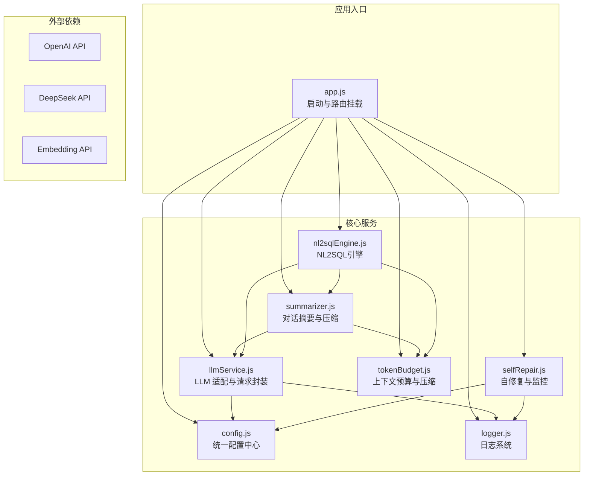
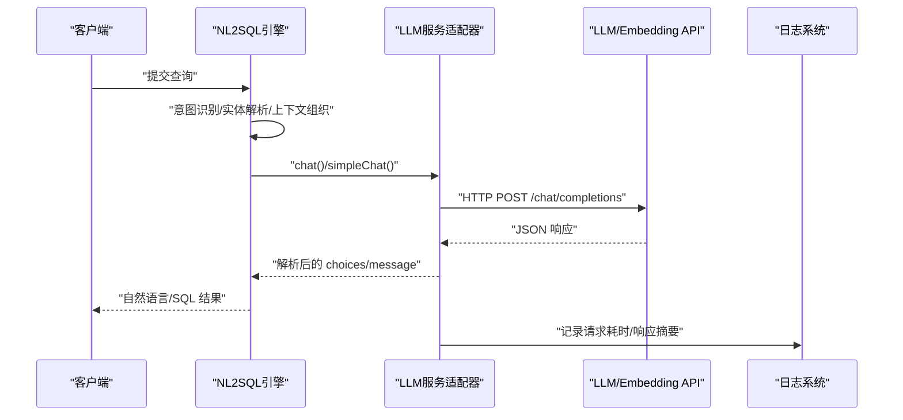
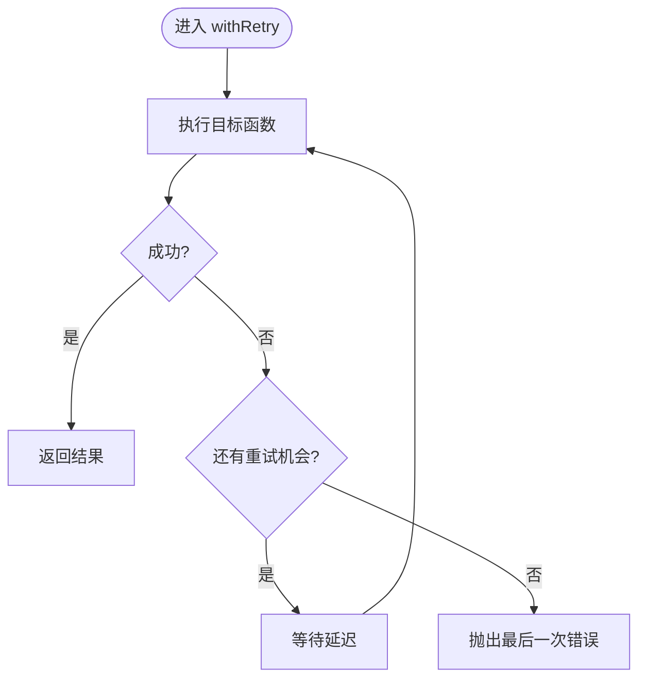
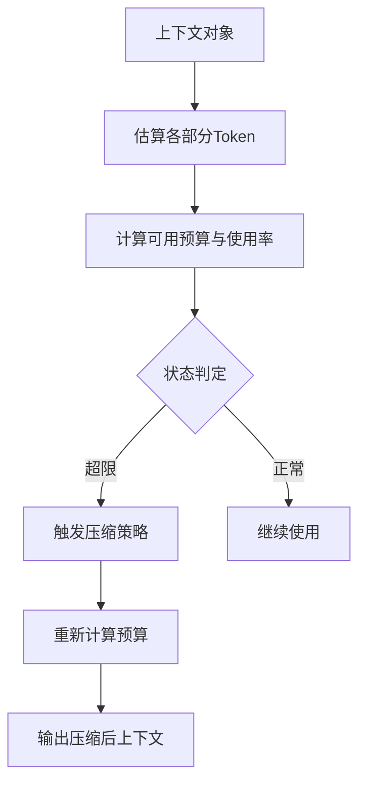
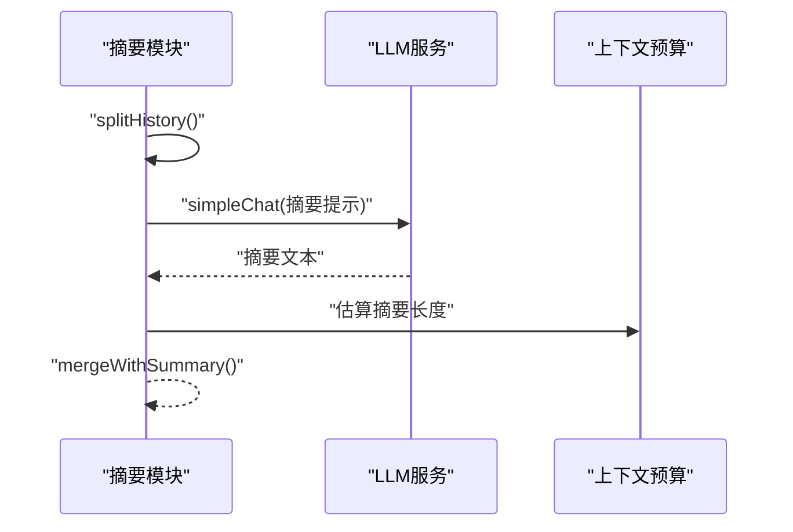
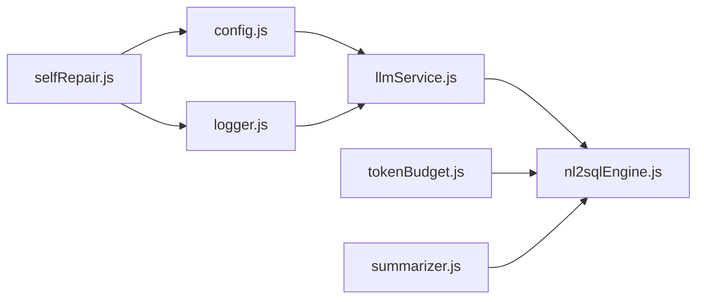

# LLM 服务集成

<cite>
**本文引用的文件**
- [llmService.js](file://backend/src/core/llmService.js)
- [config.js](file://backend/src/core/config.js)
- [tokenBudget.js](file://backend/src/utils/tokenBudget.js)
- [logger.js](file://backend/src/utils/logger.js)
- [selfRepair.js](file://backend/src/core/selfRepair.js)
- [summarizer.js](file://backend/src/memory/summarizer.js)
- [nl2sqlEngine.js](file://backend/src/core/nl2sqlEngine.js)
- [app.js](file://backend/src/app.js)
- [package.json](file://backend/package.json)
- [schema-metadata.example.json](file://backend/config/schema-metadata.example.json)
</cite>

## 目录
1. [简介](#简介)
2. [项目结构](#项目结构)
3. [核心组件](#核心组件)
4. [架构总览](#架构总览)
5. [详细组件分析](#详细组件分析)
6. [依赖关系分析](#依赖关系分析)
7. [性能考量](#性能考量)
8. [故障排查指南](#故障排查指南)
9. [结论](#结论)
10. [附录](#附录)

## 简介
本文件面向 NL2SQL 项目中的 LLM 服务集成模块，系统性阐述第三方 AI 服务（如 OpenAI、DeepSeek 等）的适配与实现，覆盖 API 密钥管理、请求格式化、响应解析、错误处理、模型选择与温度参数、上下文窗口与令牌预算、服务可用性检测、故障转移与性能监控、以及自定义 LLM 适配器的开发与调试实践。目标是帮助开发者在不改变现有架构的前提下，快速接入并稳定运行多种 LLM 提供商。

## 项目结构
后端采用 Node.js + Express 架构，LLM 服务集成位于 core 层，工具与策略位于 utils 与 memory 层，整体通过配置中心集中管理。

图表来源
- [app.js:97-166](file://backend/src/app.js#L97-L166)
- [config.js:16-397](file://backend/src/core/config.js#L16-L397)
- [llmService.js:15-467](file://backend/src/core/llmService.js#L15-L467)
- [logger.js:54-441](file://backend/src/utils/logger.js#L54-L441)
- [selfRepair.js:60-125](file://backend/src/core/selfRepair.js#L60-L125)
- [summarizer.js:109-185](file://backend/src/memory/summarizer.js#L109-L185)
- [tokenBudget.js:115-181](file://backend/src/utils/tokenBudget.js#L115-L181)
- [nl2sqlEngine.js:16-33](file://backend/src/core/nl2sqlEngine.js#L16-L33)

章节来源
- [app.js:97-166](file://backend/src/app.js#L97-L166)
- [package.json:10-27](file://backend/package.json#L10-L27)

## 核心组件
- LLM 服务适配器（llmService.js）
  - HTTP 请求封装、重试机制、流式响应、错误解析与日志记录
  - 支持 chat/completions 与 embeddings 两类端点
- 配置中心（config.js）
  - LLM 与 Embedding 的基础地址、模型、超时、重试、日志级别等
  - 安全白名单、查询限制、上下文预算与摘要策略等
- 上下文预算与压缩（tokenBudget.js）
  - 令牌估算、预算计算、历史裁剪、检索片段压缩、触发压缩
- 对话摘要与压缩（summarizer.js）
  - 历史分割、摘要生成、增量更新、缓存与融合
- 自修复与监控（selfRepair.js）
  - 定时健康检查、会话清理、统计收集、内存维护
- 日志系统（logger.js）
  - 多级别日志、结构化输出、文件轮转、追踪能力
- NL2SQL 引擎（nl2sqlEngine.js）
  - 意图识别、实体解析、SQL 生成与校验、上下文组织

章节来源
- [llmService.js:222-299](file://backend/src/core/llmService.js#L222-L299)
- [config.js:55-87](file://backend/src/core/config.js#L55-L87)
- [tokenBudget.js:115-181](file://backend/src/utils/tokenBudget.js#L115-L181)
- [summarizer.js:256-331](file://backend/src/memory/summarizer.js#L256-L331)
- [selfRepair.js:169-310](file://backend/src/core/selfRepair.js#L169-L310)
- [logger.js:263-309](file://backend/src/utils/logger.js#L263-L309)
- [nl2sqlEngine.js:741-744](file://backend/src/core/nl2sqlEngine.js#L741-L744)

## 架构总览
LLM 服务集成遵循“配置驱动 + 统一封装 + 策略分离”的设计：
- 配置驱动：通过 config.js 统一管理 LLM/Embedding 基础地址、模型、超时、重试等
- 统一封装：llmService.js 提供 httpPost、withRetry、chat/simpleChat、getEmbedding 等统一接口
- 策略分离：tokenBudget.js 与 summarizer.js 分别负责上下文预算与历史压缩，降低耦合
- 监控与自修复：selfRepair.js 与 logger.js 提供健康检查、统计与日志追踪

图表来源
- [llmService.js:222-299](file://backend/src/core/llmService.js#L222-L299)
- [nl2sqlEngine.js:741-744](file://backend/src/core/nl2sqlEngine.js#L741-L744)
- [logger.js:263-309](file://backend/src/utils/logger.js#L263-L309)

## 详细组件分析

### LLM 服务适配器（llmService.js）
- HTTP 请求封装
  - 支持 http/https、自定义头部、超时、流式响应
  - 统一 JSON 序列化与响应解析，异常时记录状态码与原始响应片段
- 重试与超时
  - withRetry 提供指数退避重试，支持最大重试次数与延迟
  - 超时控制由配置决定，避免请求挂起
- 聊天与嵌入
  - chat/simpleChat：支持工具定义、温度与最大输出 token
  - getEmbedding：支持单/批量输入与维度参数
- 错误处理
  - 捕获网络错误、超时、JSON 解析失败、代理截断等场景
  - 记录 trace/debug 以便定位问题

图表来源
- [llmService.js:167-195](file://backend/src/core/llmService.js#L167-L195)

章节来源
- [llmService.js:41-151](file://backend/src/core/llmService.js#L41-L151)
- [llmService.js:167-195](file://backend/src/core/llmService.js#L167-L195)
- [llmService.js:222-299](file://backend/src/core/llmService.js#L222-L299)
- [llmService.js:360-415](file://backend/src/core/llmService.js#L360-L415)

### 配置中心（config.js）
- LLM/Embedding 基础配置
  - apiBase、apiKey、model、timeout、maxRetries、retryDelay
  - 支持任意兼容 OpenAI API 的服务（如 OpenAI、DeepSeek、Azure OpenAI 等）
- 安全与查询限制
  - 白名单表、dryRun、最大返回行数、查询超时、禁止关键字、敏感字段脱敏
- 上下文与摘要策略
  - enableTokenBudget、enableSummarizer、maxContextTokens、reservedOutputTokens、阈值
  - summarizer 的轮数阈值、保留轮数、最大摘要 Token、更新间隔
- 自修复与日志
  - 自修复开关、Cron 表达式、会话清理间隔、慢查询阈值
  - 日志级别、文件路径、控制台/文件输出、轮转策略

章节来源
- [config.js:55-87](file://backend/src/core/config.js#L55-L87)
- [config.js:140-170](file://backend/src/core/config.js#L140-L170)
- [config.js:303-333](file://backend/src/core/config.js#L303-L333)
- [config.js:222-231](file://backend/src/core/config.js#L222-L231)
- [config.js:195-213](file://backend/src/core/config.js#L195-L213)

### 上下文预算与压缩（tokenBudget.js）
- 令牌估算
  - 基于字符数的经验估算，支持批量与对象序列化估算
- 预算计算
  - 分解系统提示、历史、检索片段的 Token，计算可用预算与使用率
  - 警告/临界/超限三态判断与建议
- 历史裁剪与检索压缩
  - 保留最近 N 轮对话，按相关性裁剪检索片段
- 触发压缩
  - 根据预算状态自动选择压缩策略，二次校验预算

图表来源
- [tokenBudget.js:115-181](file://backend/src/utils/tokenBudget.js#L115-L181)
- [tokenBudget.js:315-372](file://backend/src/utils/tokenBudget.js#L315-L372)

章节来源
- [tokenBudget.js:57-99](file://backend/src/utils/tokenBudget.js#L57-L99)
- [tokenBudget.js:115-181](file://backend/src/utils/tokenBudget.js#L115-L181)
- [tokenBudget.js:227-253](file://backend/src/utils/tokenBudget.js#L227-L253)
- [tokenBudget.js:263-305](file://backend/src/utils/tokenBudget.js#L263-L305)
- [tokenBudget.js:315-372](file://backend/src/utils/tokenBudget.js#L315-L372)

### 对话摘要与压缩（summarizer.js）
- 历史分割
  - 将历史分为待摘要部分与近期保留部分
- 摘要生成
  - 使用 LLM 生成简洁摘要，控制长度并进行裁剪
- 增量更新
  - 将新增对话与现有摘要合并，避免重复生成
- 缓存与融合
  - 基于会话 ID 的摘要缓存，定期清理，与近期历史融合

图表来源
- [summarizer.js:58-95](file://backend/src/memory/summarizer.js#L58-L95)
- [summarizer.js:109-185](file://backend/src/memory/summarizer.js#L109-L185)
- [summarizer.js:264-331](file://backend/src/memory/summarizer.js#L264-L331)
- [summarizer.js:341-363](file://backend/src/memory/summarizer.js#L341-L363)

章节来源
- [summarizer.js:109-185](file://backend/src/memory/summarizer.js#L109-L185)
- [summarizer.js:264-331](file://backend/src/memory/summarizer.js#L264-L331)
- [summarizer.js:341-363](file://backend/src/memory/summarizer.js#L341-L363)

### 自修复与监控（selfRepair.js）
- 定时任务
  - 每日自检：数据库、向量库、查询统计、连接数、系统资源
  - 会话清理：过期会话归档
  - 统计收集：连接数、内存使用
  - 记忆维护：压缩与健康报告
- 报告与建议
  - 失败率、慢查询、内存使用等指标触发告警与建议

章节来源
- [selfRepair.js:60-125](file://backend/src/core/selfRepair.js#L60-L125)
- [selfRepair.js:169-310](file://backend/src/core/selfRepair.js#L169-L310)
- [selfRepair.js:341-373](file://backend/src/core/selfRepair.js#L341-L373)
- [selfRepair.js:383-415](file://backend/src/core/selfRepair.js#L383-L415)

### 日志系统（logger.js）
- 多级别日志与结构化输出
- 文件轮转与控制台输出
- 追踪能力：startTrace/traceStep/endTrace，支持按 traceId 关联多条日志

章节来源
- [logger.js:263-309](file://backend/src/utils/logger.js#L263-L309)
- [logger.js:322-408](file://backend/src/utils/logger.js#L322-L408)

### NL2SQL 引擎（nl2sqlEngine.js）
- 意图识别与澄清
  - 结合上下文、Schema、长期记忆与别名学习，生成结构化意图
- 实体解析
  - 优先使用 LLM 已识别的 filters，回退到数据库模糊匹配与长期记忆
- SQL 生成与校验
  - 基于意图与 Schema 生成 SQL，进行安全与语法校验
- 上下文组织
  - 与 tokenBudget、summarizer 协作，维持合理上下文规模

章节来源
- [nl2sqlEngine.js:741-744](file://backend/src/core/nl2sqlEngine.js#L741-L744)
- [nl2sqlEngine.js:229-283](file://backend/src/core/nl2sqlEngine.js#L229-L283)
- [nl2sqlEngine.js:368-484](file://backend/src/core/nl2sqlEngine.js#L368-L484)

## 依赖关系分析
- 模块耦合
  - llmService 依赖 config 与 logger，提供统一 API
  - tokenBudget 与 summarizer 依赖 config 与 logger，独立于 LLM
  - nl2sqlEngine 组合使用 llmService、tokenBudget、summarizer
  - selfRepair 依赖 config、logger、database、vectorStore、sseHandler
- 外部依赖
  - OpenAI/DeepSeek/Azure OpenAI 兼容 API
  - SQLite/LanceDB 等本地存储

图表来源
- [llmService.js:22-24](file://backend/src/core/llmService.js#L22-L24)
- [nl2sqlEngine.js:16-33](file://backend/src/core/nl2sqlEngine.js#L16-L33)
- [tokenBudget.js:12-13](file://backend/src/utils/tokenBudget.js#L12-L13)
- [summarizer.js:12-14](file://backend/src/memory/summarizer.js#L12-L14)
- [selfRepair.js:17-26](file://backend/src/core/selfRepair.js#L17-L26)

章节来源
- [llmService.js:22-24](file://backend/src/core/llmService.js#L22-L24)
- [nl2sqlEngine.js:16-33](file://backend/src/core/nl2sqlEngine.js#L16-L33)
- [tokenBudget.js:12-13](file://backend/src/utils/tokenBudget.js#L12-L13)
- [summarizer.js:12-14](file://backend/src/memory/summarizer.js#L12-L14)
- [selfRepair.js:17-26](file://backend/src/core/selfRepair.js#L17-L26)

## 性能考量
- 令牌预算与上下文压缩
  - 合理设置 maxContextTokens 与 reservedOutputTokens，避免超限
  - 启用 enableTokenBudget 与 enableSummarizer，定期压缩历史与检索片段
- 重试与超时
  - 根据模型规模与网络状况调整 LLM_TIMEOUT、maxRetries、retryDelay
- 日志级别与文件轮转
  - 生产环境建议降低日志级别，避免 IO 压力
- 自修复与监控
  - 定期检查慢查询与内存使用，及时优化

[本节为通用指导，无需特定文件来源]

## 故障排查指南
- API 密钥与基础地址
  - 确认 LLM_API_KEY、LLM_API_BASE、LLM_MODEL、EMBEDDING_MODEL 等配置
  - 验证配置校验逻辑，避免空值或默认占位符
- 响应解析失败
  - 关注日志中的“truncated”“multiple JSON objects”等提示
  - 检查代理/网关对响应大小的限制
- 超时与重试
  - 提升 LLM_TIMEOUT，适当增加 maxRetries/retryDelay
  - 对大模型（如 Qwen3.5-397B）建议更长超时
- 上下文超限
  - 启用 enableTokenBudget，调优 maxContextTokens/reservedOutputTokens
  - 使用 summarizer 缓存与融合，减少历史长度
- 自修复与健康检查
  - 查看每日自检报告，关注失败率与慢查询
  - 检查数据库连接、向量库初始化状态

章节来源
- [config.js:366-388](file://backend/src/core/config.js#L366-L388)
- [llmService.js:113-131](file://backend/src/core/llmService.js#L113-L131)
- [selfRepair.js:169-310](file://backend/src/core/selfRepair.js#L169-L310)

## 结论
本项目通过“配置驱动 + 统一封装 + 策略分离”的方式，实现了对多种 LLM 提供商的适配与稳健运行。llmService.js 提供统一的请求封装与错误处理；tokenBudget.js 与 summarizer.js 保障上下文可控；config.js 与 selfRepair.js 提供完善的配置与监控。配合 logger.js 的结构化日志与追踪能力，能够有效支撑 NL2SQL 的生产化落地。

[本节为总结，无需特定文件来源]

## 附录

### 自定义 LLM 适配器开发指南
- 适配原则
  - 保持与 llmService.js 的接口一致性：chat/simpleChat/getEmbedding
  - 统一错误处理与日志记录
- 配置对接
  - 在 config.js 中新增提供商的 apiBase/model/timeout 等项
  - 通过环境变量覆盖默认值，便于多环境切换
- 请求格式化
  - chat/completions：messages、temperature、max_tokens、stream
  - embeddings：input、dimensions
- 响应解析
  - chat：choices[0].message.content
  - embeddings：data[0].embedding 或数组
- 错误处理
  - 捕获 HTTP 状态码、超时、JSON 解析失败、代理截断
  - 记录 trace/debug 以便定位问题

章节来源
- [llmService.js:222-299](file://backend/src/core/llmService.js#L222-L299)
- [llmService.js:360-415](file://backend/src/core/llmService.js#L360-L415)
- [config.js:55-87](file://backend/src/core/config.js#L55-L87)

### 配置管理与调试
- 环境变量
  - LLM_API_KEY、LLM_API_BASE、LLM_MODEL、LLM_TIMEOUT、EMBEDDING_MODEL、EMBEDDING_TIMEOUT
  - LOG_LEVEL、LOG_FILE、ALLOWED_TABLES、DRY_RUN、MAX_QUERY_ROWS、QUERY_TIMEOUT
  - ENABLE_TOKEN_BUDGET、ENABLE_SUMMARIZER、MAX_CONTEXT_TOKENS、RESERVED_OUTPUT_TOKENS
  - EVALUATION_ENABLED、EVALUATION_TRACK_STATS
- 调试技巧
  - 提升日志级别至 debug/trace，观察请求详情与响应摘要
  - 使用 withRetry 的重试日志定位网络波动
  - 通过 summarizer 缓存与融合减少重复生成

章节来源
- [config.js:55-87](file://backend/src/core/config.js#L55-L87)
- [config.js:195-213](file://backend/src/core/config.js#L195-L213)
- [config.js:303-333](file://backend/src/core/config.js#L303-L333)
- [logger.js:263-309](file://backend/src/utils/logger.js#L263-L309)

### 安全与成本控制
- 安全
  - 白名单表、禁止关键字、敏感字段脱敏、查询超时与最大返回行数
- 成本控制
  - 通过上下文预算与摘要压缩降低 token 使用
  - 合理设置 temperature 与 max_tokens，避免过度生成
- 速率限制
  - 通过 withRetry 与超时控制，避免请求堆积
  - 结合自修复的慢查询阈值与日志分析，识别热点与瓶颈

章节来源
- [config.js:140-170](file://backend/src/core/config.js#L140-L170)
- [tokenBudget.js:115-181](file://backend/src/utils/tokenBudget.js#L115-L181)
- [selfRepair.js:243-246](file://backend/src/core/selfRepair.js#L243-L246)