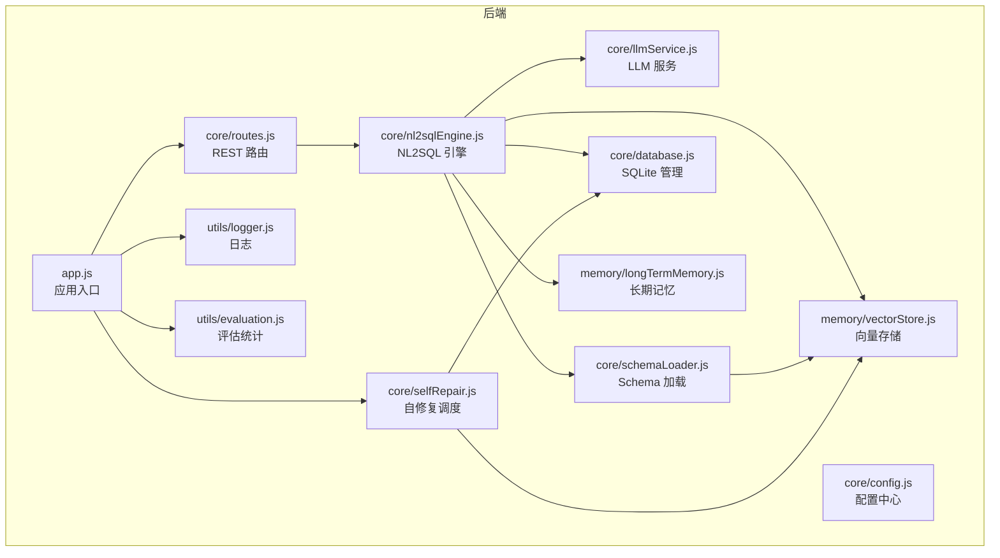
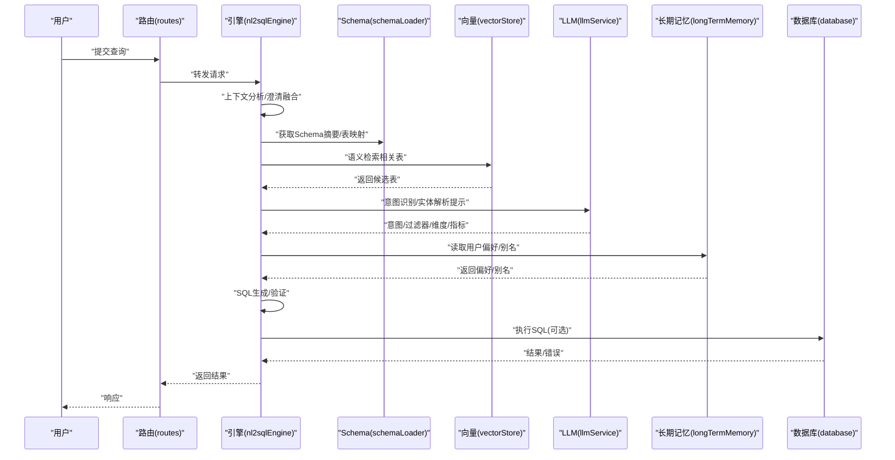
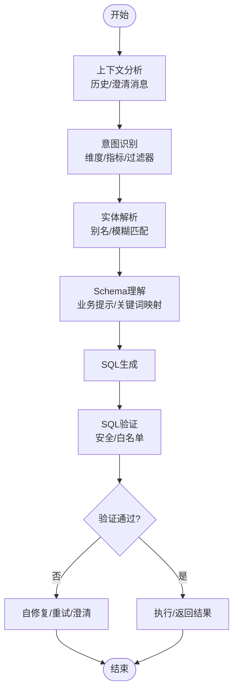
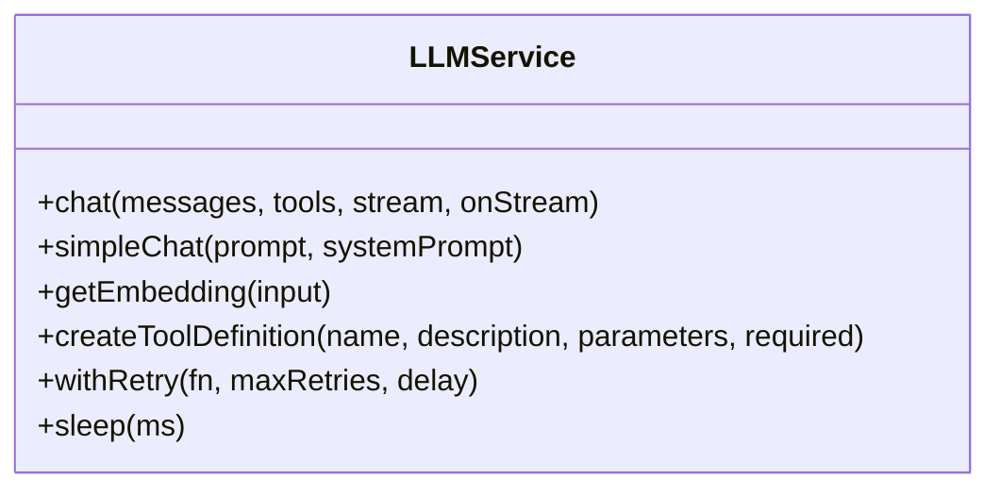
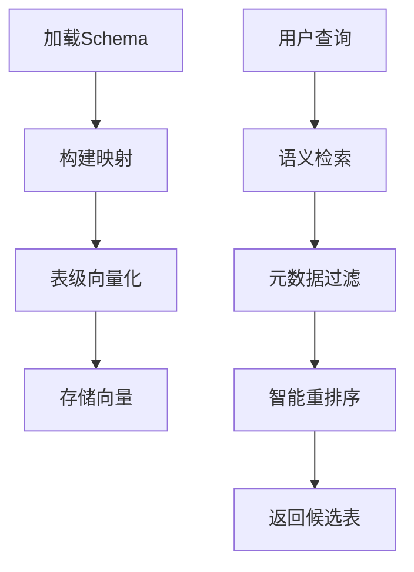
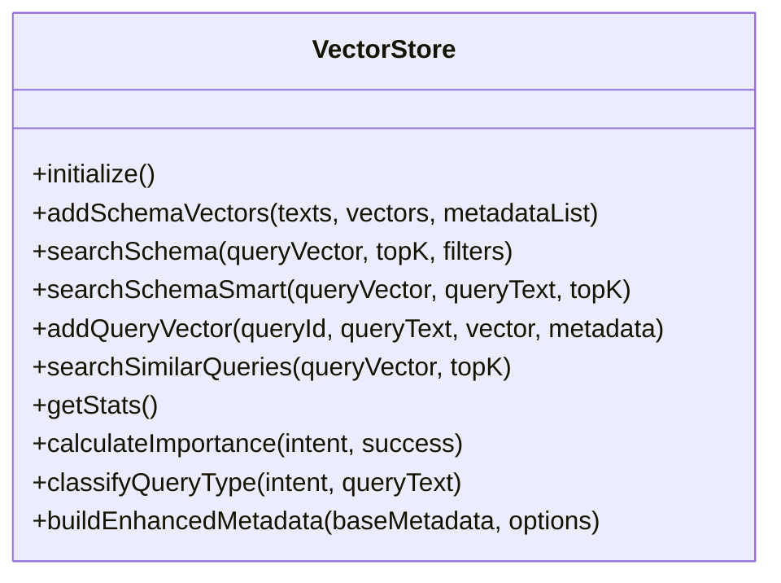
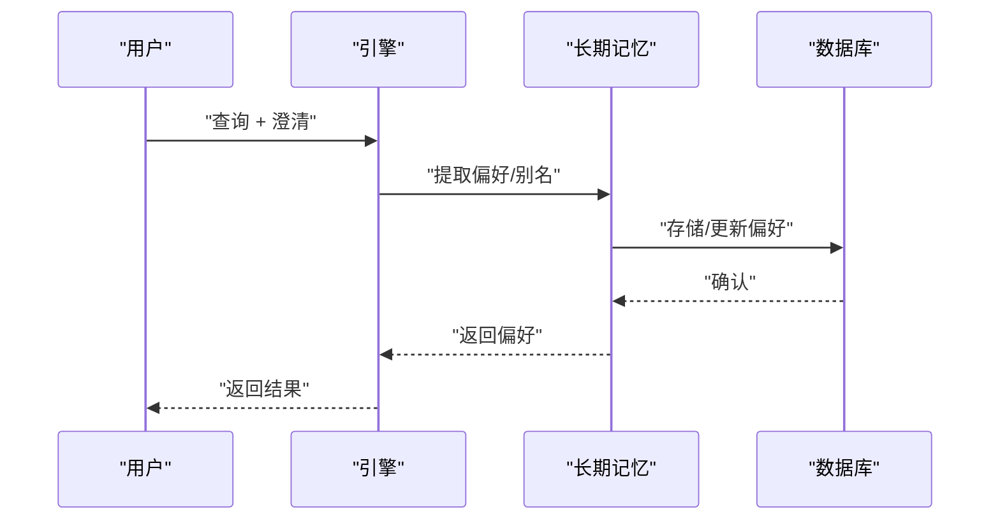
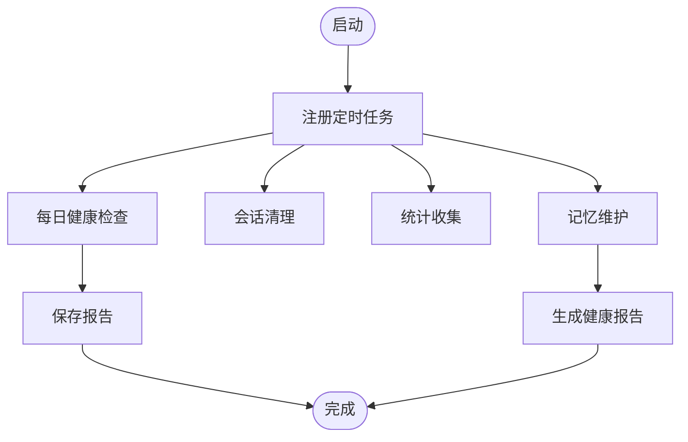
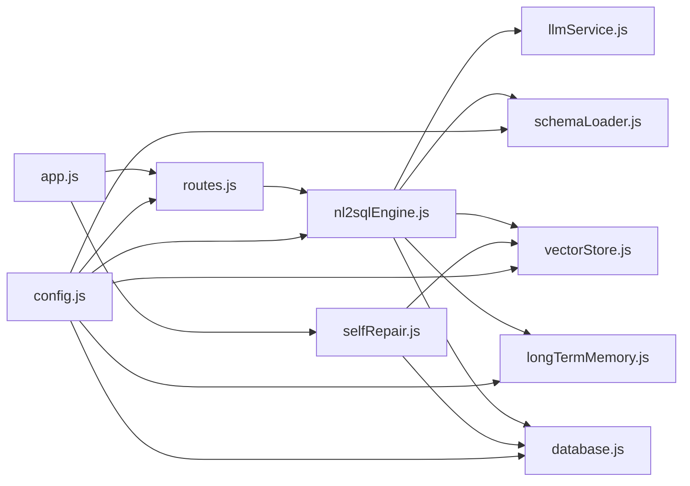

# NL2SQL 引擎

<cite>
**本文引用的文件**
- [nl2sqlEngine.js](file://backend/src/core/nl2sqlEngine.js)
- [llmService.js](file://backend/src/core/llmService.js)
- [schemaLoader.js](file://backend/src/core/schemaLoader.js)
- [vectorStore.js](file://backend/src/memory/vectorStore.js)
- [longTermMemory.js](file://backend/src/memory/longTermMemory.js)
- [selfRepair.js](file://backend/src/core/selfRepair.js)
- [config.js](file://backend/src/core/config.js)
- [database.js](file://backend/src/core/database.js)
- [routes.js](file://backend/src/core/routes.js)
- [logger.js](file://backend/src/utils/logger.js)
- [evaluation.js](file://backend/src/utils/evaluation.js)
- [app.js](file://backend/src/app.js)
- [package.json](file://backend/package.json)
</cite>

## 目录
1. [简介](#简介)
2. [项目结构](#项目结构)
3. [核心组件](#核心组件)
4. [架构总览](#架构总览)
5. [详细组件分析](#详细组件分析)
6. [依赖关系分析](#依赖关系分析)
7. [性能考虑](#性能考虑)
8. [故障排查指南](#故障排查指南)
9. [结论](#结论)
10. [附录](#附录)

## 简介
本技术文档面向 NL2SQL 核心引擎模块，系统阐述从自然语言到 SQL 的转换机制与实现细节，涵盖意图识别、实体解析、表/字段理解、SQL 生成与验证、以及与 LLM 服务、向量数据库检索和长期记忆系统的集成方式。文档还提供配置选项、性能优化策略、错误处理机制、扩展指南与调试技巧，帮助开发者快速理解与高效运维该引擎。

## 项目结构
后端采用模块化分层设计，核心模块位于 backend/src/core，记忆与向量相关模块位于 backend/src/memory，工具与评估模块位于 backend/src/utils，入口文件位于 backend/src/app.js。前端位于 frontend，通过 REST API 与后端交互。

**图表来源**
- [app.js:97-166](file://backend/src/app.js#L97-L166)
- [routes.js:35-81](file://backend/src/core/routes.js#L35-L81)
- [nl2sqlEngine.js:15-34](file://backend/src/core/nl2sqlEngine.js#L15-L34)
- [llmService.js:15-26](file://backend/src/core/llmService.js#L15-L26)
- [schemaLoader.js:15-27](file://backend/src/core/schemaLoader.js#L15-L27)
- [vectorStore.js:14-22](file://backend/src/memory/vectorStore.js#L14-L22)
- [longTermMemory.js:17-22](file://backend/src/memory/longTermMemory.js#L17-L22)
- [selfRepair.js:15-27](file://backend/src/core/selfRepair.js#L15-L27)
- [database.js:12-20](file://backend/src/core/database.js#L12-L20)
- [logger.js:16-24](file://backend/src/utils/logger.js#L16-L24)
- [evaluation.js:12-14](file://backend/src/utils/evaluation.js#L12-L14)

**章节来源**
- [app.js:97-166](file://backend/src/app.js#L97-L166)
- [routes.js:35-81](file://backend/src/core/routes.js#L35-L81)

## 核心组件
- NL2SQL 引擎：负责意图识别、实体解析、表/字段理解、SQL 生成与验证、澄清与上下文融合、错误处理与日志记录。
- LLM 服务：封装 HTTP 请求、重试机制、流式响应、Embedding 获取与工具定义辅助。
- Schema 加载：加载/校验/缓存 Schema，构建表/字段映射，向量化 Schema，语义检索表，SQL 安全校验。
- 向量存储：基于 LanceDB 的表级/查询级向量存储与检索，智能重排序与元数据过滤。
- 长期记忆：用户偏好抽取、字段别名学习、查询模式存储与检索，支持 LLM 智能提炼。
- 自修复调度：定时健康检查、会话清理、统计收集、记忆维护。
- 数据库：SQLite 会话/消息/查询历史/偏好持久化。
- 日志与评估：统一日志、执行追踪、运行时统计与评估报告。

**章节来源**
- [nl2sqlEngine.js:15-34](file://backend/src/core/nl2sqlEngine.js#L15-L34)
- [llmService.js:15-26](file://backend/src/core/llmService.js#L15-L26)
- [schemaLoader.js:32-51](file://backend/src/core/schemaLoader.js#L32-L51)
- [vectorStore.js:14-22](file://backend/src/memory/vectorStore.js#L14-L22)
- [longTermMemory.js:17-22](file://backend/src/memory/longTermMemory.js#L17-L22)
- [selfRepair.js:15-27](file://backend/src/core/selfRepair.js#L15-L27)
- [database.js:12-20](file://backend/src/core/database.js#L12-L20)
- [logger.js:16-24](file://backend/src/utils/logger.js#L16-L24)
- [evaluation.js:12-14](file://backend/src/utils/evaluation.js#L12-L14)

## 架构总览
NL2SQL 引擎工作流从用户输入开始，经过上下文分析、Schema 理解、实体解析、意图识别与澄清、SQL 生成与验证，最终返回结果。引擎与 LLM 服务、向量数据库、长期记忆系统紧密协作，形成“理解-检索-生成-验证”的闭环。

**图表来源**
- [routes.js:266-398](file://backend/src/core/routes.js#L266-L398)
- [nl2sqlEngine.js:741-726](file://backend/src/core/nl2sqlEngine.js#L741-L726)
- [schemaLoader.js:771-785](file://backend/src/core/schemaLoader.js#L771-L785)
- [vectorStore.js:450-536](file://backend/src/memory/vectorStore.js#L450-L536)
- [llmService.js:222-299](file://backend/src/core/llmService.js#L222-L299)
- [longTermMemory.js:312-485](file://backend/src/memory/longTermMemory.js#L312-L485)
- [database.js:361-424](file://backend/src/core/database.js#L361-L424)

## 详细组件分析

### NL2SQL 引擎（核心）
- 意图识别与澄清融合：从历史对话与澄清消息中提取上下文，整合默认选项与槽位确认，增强意图完整性。
- 实体解析：优先使用长期记忆别名，其次回退到数据库模糊匹配，支持游戏/渠道等实体 ID 推断。
- 表/字段理解：业务关键词映射、Schema 业务提示、平台术语映射（老/新平台）。
- SQL 生成与验证：基于意图与 Schema 生成 SQL，执行安全关键字与白名单校验。
- 错误处理：统一 NL2SQLError，区分可恢复与不可恢复错误，记录日志与堆栈。

**图表来源**
- [nl2sqlEngine.js:741-726](file://backend/src/core/nl2sqlEngine.js#L741-L726)
- [nl2sqlEngine.js:229-283](file://backend/src/core/nl2sqlEngine.js#L229-L283)
- [nl2sqlEngine.js:368-484](file://backend/src/core/nl2sqlEngine.js#L368-L484)
- [schemaLoader.js:104-135](file://backend/src/core/schemaLoader.js#L104-L135)
- [schemaLoader.js:727-763](file://backend/src/core/schemaLoader.js#L727-L763)

**章节来源**
- [nl2sqlEngine.js:44-95](file://backend/src/core/nl2sqlEngine.js#L44-L95)
- [nl2sqlEngine.js:145-215](file://backend/src/core/nl2sqlEngine.js#L145-L215)
- [nl2sqlEngine.js:229-283](file://backend/src/core/nl2sqlEngine.js#L229-L283)
- [nl2sqlEngine.js:368-484](file://backend/src/core/nl2sqlEngine.js#L368-L484)
- [nl2sqlEngine.js:533-605](file://backend/src/core/nl2sqlEngine.js#L533-L605)
- [nl2sqlEngine.js:687-726](file://backend/src/core/nl2sqlEngine.js#L687-L726)

### LLM 服务
- HTTP 请求封装：统一 POST 请求、超时、错误解析、流式响应。
- 重试机制：withRetry 支持指数退避与最大重试次数。
- 聊天与 Embedding：chat/simpleChat、getEmbedding，支持工具定义与 JSON Schema 参数。
- 日志与统计：记录请求/响应、耗时、Token 使用。

**图表来源**
- [llmService.js:41-152](file://backend/src/core/llmService.js#L41-L152)
- [llmService.js:167-196](file://backend/src/core/llmService.js#L167-L196)
- [llmService.js:222-299](file://backend/src/core/llmService.js#L222-L299)
- [llmService.js:360-415](file://backend/src/core/llmService.js#L360-L415)

**章节来源**
- [llmService.js:41-152](file://backend/src/core/llmService.js#L41-L152)
- [llmService.js:167-196](file://backend/src/core/llmService.js#L167-L196)
- [llmService.js:222-299](file://backend/src/core/llmService.js#L222-L299)
- [llmService.js:360-415](file://backend/src/core/llmService.js#L360-L415)

### Schema 加载与检索
- 加载与校验：从 JSON 配置加载表/字段/关系/指标/维度，构建表/字段映射。
- 向量化：表级向量（包含域标签、数据类型、关键特征），支持强制重向量化。
- 智能检索：基于 Embedding 的语义搜索，结合上下文（game_id/datasource）与智能重排序。
- 安全校验：禁止关键字与白名单表校验。

**图表来源**
- [schemaLoader.js:69-122](file://backend/src/core/schemaLoader.js#L69-L122)
- [schemaLoader.js:161-189](file://backend/src/core/schemaLoader.js#L161-L189)
- [schemaLoader.js:201-281](file://backend/src/core/schemaLoader.js#L201-L281)
- [schemaLoader.js:567-657](file://backend/src/core/schemaLoader.js#L567-L657)
- [schemaLoader.js:727-763](file://backend/src/core/schemaLoader.js#L727-L763)

**章节来源**
- [schemaLoader.js:69-122](file://backend/src/core/schemaLoader.js#L69-L122)
- [schemaLoader.js:201-281](file://backend/src/core/schemaLoader.js#L201-L281)
- [schemaLoader.js:567-657](file://backend/src/core/schemaLoader.js#L567-L657)
- [schemaLoader.js:727-763](file://backend/src/core/schemaLoader.js#L727-L763)

### 向量存储（LanceDB）
- 表结构：schema_vectors、query_vectors，支持初始化、添加、搜索、统计。
- 智能搜索：基于查询意图识别与元数据过滤，对平台/报表类型进行重排序。
- 元数据增强：重要性评分、查询类型分类、复杂度统计、执行信息。

**图表来源**
- [vectorStore.js:231-261](file://backend/src/memory/vectorStore.js#L231-L261)
- [vectorStore.js:336-367](file://backend/src/memory/vectorStore.js#L336-L367)
- [vectorStore.js:378-435](file://backend/src/memory/vectorStore.js#L378-L435)
- [vectorStore.js:450-536](file://backend/src/memory/vectorStore.js#L450-L536)
- [vectorStore.js:551-577](file://backend/src/memory/vectorStore.js#L551-L577)
- [vectorStore.js:587-618](file://backend/src/memory/vectorStore.js#L587-L618)
- [vectorStore.js:653-683](file://backend/src/memory/vectorStore.js#L653-L683)

**章节来源**
- [vectorStore.js:231-261](file://backend/src/memory/vectorStore.js#L231-L261)
- [vectorStore.js:450-536](file://backend/src/memory/vectorStore.js#L450-L536)
- [vectorStore.js:653-683](file://backend/src/memory/vectorStore.js#L653-L683)

### 长期记忆（Layer 2）
- 偏好抽取：查询模式、字段别名、指标/维度偏好，支持 LLM 智能提炼与逻辑判断。
- 存储策略：置信度阈值、高频模式、高价值模板、字段别名分级保留。
- 学习机制：从澄清与上下文中学习实体映射（如“青木=30”），支持双记录/直接映射。

**图表来源**
- [longTermMemory.js:312-485](file://backend/src/memory/longTermMemory.js#L312-L485)
- [longTermMemory.js:494-606](file://backend/src/memory/longTermMemory.js#L494-L606)
- [longTermMemory.js:772-800](file://backend/src/memory/longTermMemory.js#L772-L800)
- [database.js:609-666](file://backend/src/core/database.js#L609-L666)

**章节来源**
- [longTermMemory.js:252-296](file://backend/src/memory/longTermMemory.js#L252-L296)
- [longTermMemory.js:312-485](file://backend/src/memory/longTermMemory.js#L312-L485)
- [longTermMemory.js:494-606](file://backend/src/memory/longTermMemory.js#L494-L606)
- [database.js:609-666](file://backend/src/core/database.js#L609-L666)

### 自修复调度
- 定时任务：每日健康检查、会话清理、统计收集、记忆维护。
- 健康检查：数据库/向量库/查询统计/连接数/内存使用。
- 记忆维护：压缩与清理过期记忆，生成健康报告。

**图表来源**
- [selfRepair.js:60-125](file://backend/src/core/selfRepair.js#L60-L125)
- [selfRepair.js:169-310](file://backend/src/core/selfRepair.js#L169-L310)
- [selfRepair.js:341-373](file://backend/src/core/selfRepair.js#L341-L373)
- [selfRepair.js:383-415](file://backend/src/core/selfRepair.js#L383-L415)

**章节来源**
- [selfRepair.js:60-125](file://backend/src/core/selfRepair.js#L60-L125)
- [selfRepair.js:169-310](file://backend/src/core/selfRepair.js#L169-L310)
- [selfRepair.js:341-373](file://backend/src/core/selfRepair.js#L341-L373)
- [selfRepair.js:383-415](file://backend/src/core/selfRepair.js#L383-L415)

### 数据库（SQLite）
- 表结构：sessions/messages/query_history/user_preferences/system_logs。
- 操作：初始化/迁移、CRUD、事务、索引优化。
- 偏好存储：JSON content 字段，按类型与使用统计排序。

**章节来源**
- [database.js:39-189](file://backend/src/core/database.js#L39-L189)
- [database.js:200-336](file://backend/src/core/database.js#L200-L336)
- [database.js:609-781](file://backend/src/core/database.js#L609-L781)

### 日志与评估
- 日志：统一级别、控制台/文件输出、轮转、追踪上下文。
- 评估：向量检索命中率、长期记忆命中率、运行时统计、质量评估接口。

**章节来源**
- [logger.js:54-442](file://backend/src/utils/logger.js#L54-L442)
- [evaluation.js:71-122](file://backend/src/utils/evaluation.js#L71-L122)
- [evaluation.js:158-266](file://backend/src/utils/evaluation.js#L158-L266)
- [evaluation.js:344-407](file://backend/src/utils/evaluation.js#L344-L407)

## 依赖关系分析
- 模块耦合：引擎依赖 LLM、Schema、向量存储、长期记忆与数据库；路由依赖引擎；自修复依赖数据库与向量存储。
- 外部依赖：Express、LanceDB(vectordb)、sqlite3、node-cron、uuid、dayjs、dotenv。
- 配置集中：config.js 统一管理 LLM/API/数据库/向量/安全/会话/日志/自修复/Schema/长期记忆/上下文/评估等配置。

**图表来源**
- [routes.js:35-81](file://backend/src/core/routes.js#L35-L81)
- [nl2sqlEngine.js:15-34](file://backend/src/core/nl2sqlEngine.js#L15-L34)
- [app.js:40-51](file://backend/src/app.js#L40-L51)
- [config.js:16-398](file://backend/src/core/config.js#L16-L398)

**章节来源**
- [routes.js:35-81](file://backend/src/core/routes.js#L35-L81)
- [nl2sqlEngine.js:15-34](file://backend/src/core/nl2sqlEngine.js#L15-L34)
- [app.js:40-51](file://backend/src/app.js#L40-L51)
- [config.js:16-398](file://backend/src/core/config.js#L16-L398)

## 性能考虑
- 向量检索优化：表级向量、智能重排序、元数据过滤、批量 Embedding。
- Schema 缓存：映射构建与缓存时间戳，减少重复解析。
- Token 预算：上下文管理配置，避免过度消耗 LLM 资源。
- 数据库索引：SQLite 表与索引优化，事务批量写入。
- 超时与重试：LLM 请求超时与重试策略，避免阻塞。
- 评估统计：运行时统计与质量评估，持续优化检索与记忆命中。

**章节来源**
- [schemaLoader.js:161-189](file://backend/src/core/schemaLoader.js#L161-L189)
- [vectorStore.js:450-536](file://backend/src/memory/vectorStore.js#L450-L536)
- [config.js:303-333](file://backend/src/core/config.js#L303-L333)
- [database.js:39-189](file://backend/src/core/database.js#L39-L189)
- [llmService.js:167-196](file://backend/src/core/llmService.js#L167-L196)
- [evaluation.js:71-122](file://backend/src/utils/evaluation.js#L71-L122)

## 故障排查指南
- LLM API 失败：检查 API Key/Base/Model/超时；查看 withRetry 重试日志；确认响应解析与截断标记。
- 向量数据库未初始化：确认 LanceDB 路径与权限；检查表创建与初始化日志。
- 数据库连接异常：检查 SQLite 路径与权限；确认外键约束启用与迁移执行。
- SQL 验证失败：检查禁止关键字与白名单；核对表名与字段名映射。
- 长期记忆不生效：确认启用标志与阈值；检查偏好类型与使用统计更新。
- 自修复任务异常：查看定时任务日志与健康检查报告。

**章节来源**
- [llmService.js:135-151](file://backend/src/core/llmService.js#L135-L151)
- [llmService.js:269-299](file://backend/src/core/llmService.js#L269-L299)
- [vectorStore.js:231-261](file://backend/src/memory/vectorStore.js#L231-L261)
- [database.js:200-261](file://backend/src/core/database.js#L200-L261)
- [schemaLoader.js:727-763](file://backend/src/core/schemaLoader.js#L727-L763)
- [longTermMemory.js:312-485](file://backend/src/memory/longTermMemory.js#L312-L485)
- [selfRepair.js:169-310](file://backend/src/core/selfRepair.js#L169-L310)

## 结论
NL2SQL 引擎通过意图识别、实体解析、Schema 理解、向量检索与长期记忆协同，实现了从自然语言到 SQL 的稳健转换。模块化设计与完善的配置、日志、评估与自修复机制，确保了系统的可维护性与可扩展性。建议在生产环境中启用白名单、限制查询规模、定期评估向量化质量与记忆命中率，并结合自修复任务保障系统健康。

## 附录

### 配置选项（节选）
- LLM：apiBase、apiKey、model、timeout、maxRetries、retryDelay。
- Embedding：model、dimension、timeout。
- 数据库：SQLite 路径；SR 数据源 URL 与连接池。
- 安全：allowedTables、dryRun、maxQueryRows、queryTimeout、forbiddenKeywords、sensitiveFields。
- 会话：maxHistory、expireTime、cleanupInterval。
- 日志：level、file、console、fileOutput、maxSize、maxFiles。
- 自修复：enabled、dailyCheckCron、sessionCheckInterval、slowQueryThreshold。
- Schema：configPath、enableCache、cacheExpireTime、revectorize。
- 长期记忆：enabled、useLLMForExtraction、thresholds、retention。
- 上下文管理：enableTokenBudget、enableSummarizer、tokenBudget、summarizer。
- 评估：enabled、trackStats、thresholds。

**章节来源**
- [config.js:16-398](file://backend/src/core/config.js#L16-L398)

### 扩展指南
- 自定义转换规则：在引擎中扩展意图识别与 SQL 生成逻辑，增加业务规则与映射。
- 新增实体类型：完善实体解析函数与长期记忆学习逻辑。
- 评估与监控：启用评估模块，定期运行质量评估与统计报告。
- 集成新 LLM：适配新 API 格式，复用 llmService 的封装与重试机制。

**章节来源**
- [nl2sqlEngine.js:145-215](file://backend/src/core/nl2sqlEngine.js#L145-L215)
- [longTermMemory.js:494-606](file://backend/src/memory/longTermMemory.js#L494-L606)
- [evaluation.js:158-266](file://backend/src/utils/evaluation.js#L158-L266)

### 调试技巧
- 使用日志追踪：logger.startTrace/logger.traceStep/logger.endTrace。
- 评估统计：/api/evaluation/stats 与 /api/evaluation/stats/reset。
- 健康检查：/api/health 与 /api/health/detail。
- 原始记忆数据：/api/preferences/:userId/raw 与 /api/preferences/:userId/stats。

**章节来源**
- [logger.js:322-408](file://backend/src/utils/logger.js#L322-L408)
- [routes.js:726-760](file://backend/src/core/routes.js#L726-L760)
- [routes.js:100-137](file://backend/src/core/routes.js#L100-L137)
- [routes.js:461-517](file://backend/src/core/routes.js#L461-L517)