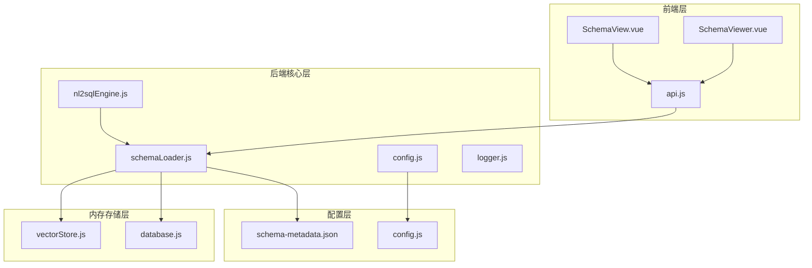
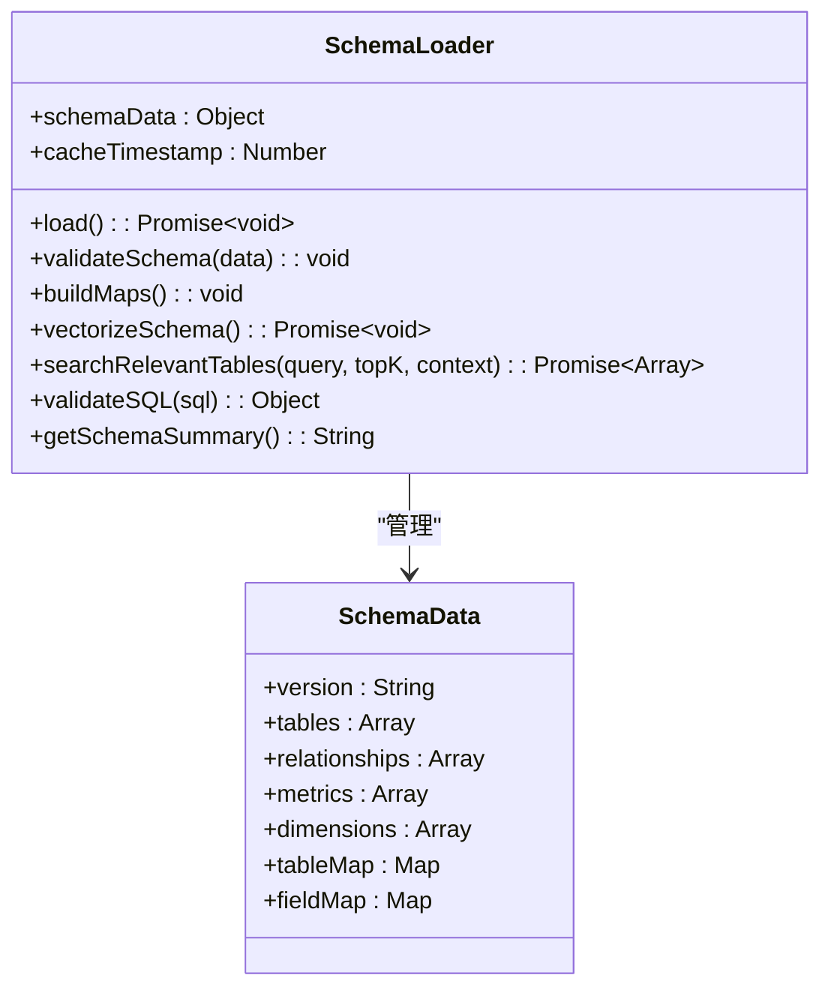
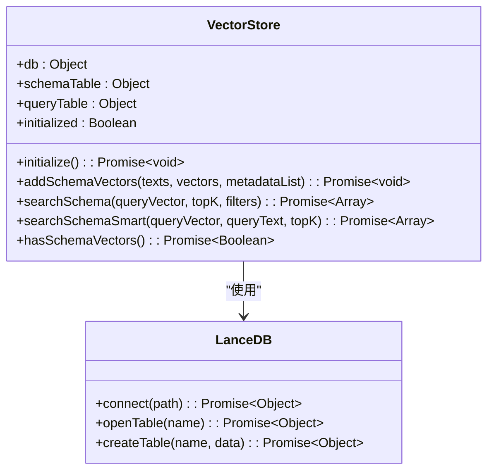
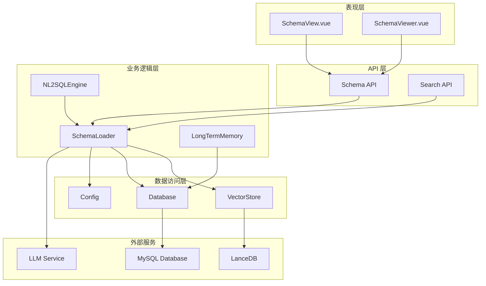
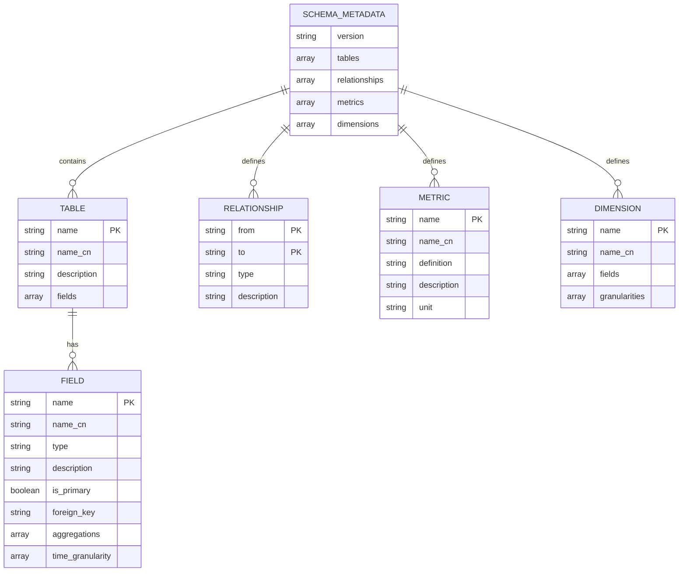
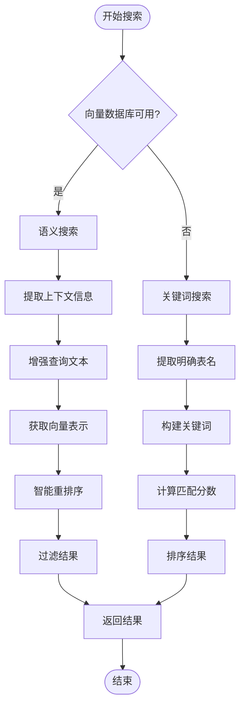
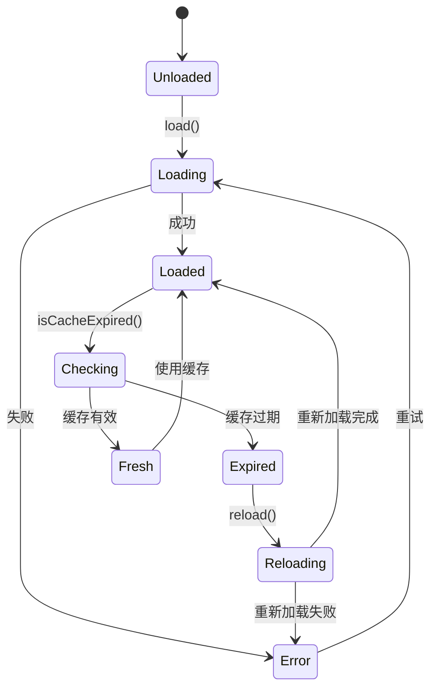
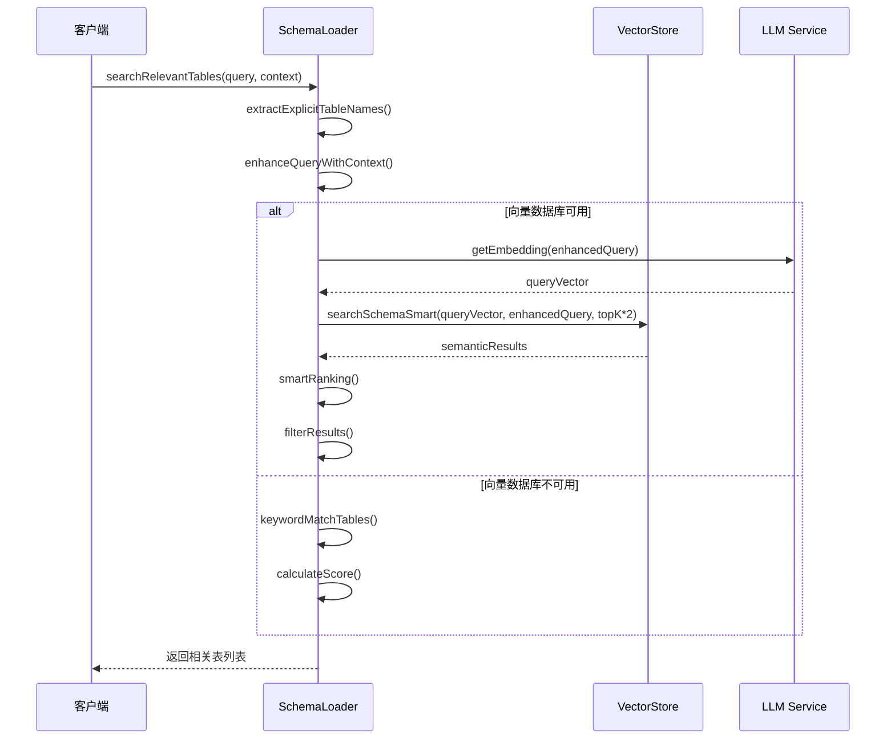
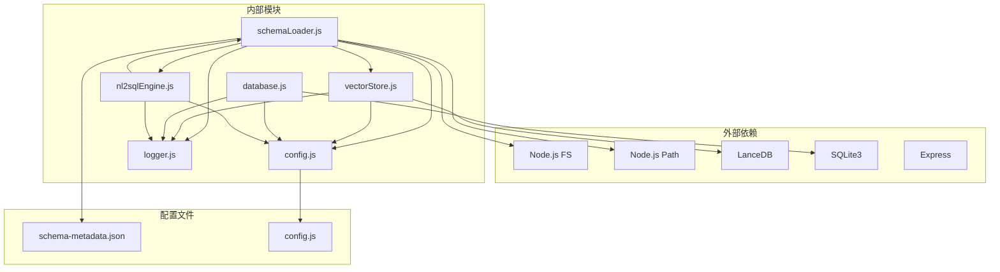

# Schema 管理

<cite>
**本文档引用的文件**
- [schemaLoader.js](file://backend/src/core/schemaLoader.js)
- [nl2sqlEngine.js](file://backend/src/core/nl2sqlEngine.js)
- [vectorStore.js](file://backend/src/memory/vectorStore.js)
- [config.js](file://backend/src/core/config.js)
- [database.js](file://backend/src/core/database.js)
- [logger.js](file://backend/src/utils/logger.js)
- [schema-metadata.json](file://backend/config/schema-metadata.json)
- [SchemaView.vue](file://frontend/src/views/SchemaView.vue)
- [SchemaViewer.vue](file://frontend/src/components/SchemaViewer.vue)
- [api.js](file://frontend/src/utils/api.js)
</cite>

## 目录
1. [简介](#简介)
2. [项目结构](#项目结构)
3. [核心组件](#核心组件)
4. [架构概览](#架构概览)
5. [详细组件分析](#详细组件分析)
6. [依赖关系分析](#依赖关系分析)
7. [性能考虑](#性能考虑)
8. [故障排除指南](#故障排除指南)
9. [结论](#结论)
10. [附录](#附录)

## 简介

Schema 管理模块是 NL2SQL 系统的核心基础设施，负责数据库 Schema 元数据的加载、解析和管理。该模块实现了完整的 Schema 生命周期管理，包括：

- **元数据加载与验证**：从 JSON 配置文件加载表结构定义，验证数据格式完整性
- **动态搜索与匹配**：提供向量化搜索、关键词匹配和智能表推断功能
- **缓存与性能优化**：实现智能缓存策略，支持缓存失效和重新加载
- **向量化存储**：基于 LanceDB 的向量数据库，支持语义相似度搜索
- **安全验证**：SQL 语句安全检查和访问控制
- **前端集成**：提供完整的 Schema 查看和搜索界面

## 项目结构

NL2SQL 项目采用前后端分离架构，Schema 管理模块位于后端核心层：

**图表来源**
- [schemaLoader.js:1-1071](file://backend/src/core/schemaLoader.js#L1-1071)
- [nl2sqlEngine.js:1-800](file://backend/src/core/nl2sqlEngine.js#L1-800)
- [vectorStore.js:1-759](file://backend/src/memory/vectorStore.js#L1-759)

**章节来源**
- [schemaLoader.js:1-1071](file://backend/src/core/schemaLoader.js#L1-1071)
- [nl2sqlEngine.js:1-800](file://backend/src/core/nl2sqlEngine.js#L1-800)
- [vectorStore.js:1-759](file://backend/src/memory/vectorStore.js#L1-759)

## 核心组件

### Schema 元数据加载器

Schema 元数据加载器是整个模块的核心组件，负责：

- **配置文件解析**：从 JSON 文件读取表结构定义
- **数据验证**：确保 Schema 数据格式正确性
- **映射构建**：建立表名和字段名的快速查找映射
- **缓存管理**：实现智能缓存策略

**图表来源**
- [schemaLoader.js:36-122](file://backend/src/core/schemaLoader.js#L36-122)

### 向量存储模块

向量存储模块基于 LanceDB 实现，提供：

- **向量数据库**：存储 Schema 信息的向量表示
- **语义搜索**：基于 Embedding 的相似度搜索
- **智能重排序**：根据查询意图进行结果重排序
- **过滤机制**：支持按域标签和数据类型过滤

**图表来源**
- [vectorStore.js:204-322](file://backend/src/memory/vectorStore.js#L204-322)

### NL2SQL 引擎集成

NL2SQL 引擎通过 Schema 管理模块实现：

- **业务关键词映射**：动态构建关键词到表的映射关系
- **意图识别增强**：利用 Schema 信息理解用户查询意图
- **实体解析**：基于 Schema 进行实体映射和解析
- **SQL 生成**：提供准确的表结构信息用于 SQL 生成

**章节来源**
- [schemaLoader.js:975-1037](file://backend/src/core/schemaLoader.js#L975-1037)
- [nl2sqlEngine.js:44-72](file://backend/src/core/nl2sqlEngine.js#L44-72)

## 架构概览

Schema 管理模块采用分层架构设计，各层职责清晰：

**图表来源**
- [schemaLoader.js:1043-1071](file://backend/src/core/schemaLoader.js#L1043-1071)
- [nl2sqlEngine.js:16-34](file://backend/src/core/nl2sqlEngine.js#L16-34)

## 详细组件分析

### Schema 元数据格式规范

Schema 元数据采用标准化的 JSON 格式，支持多语言和丰富的元数据信息：

**图表来源**
- [schema-metadata.json:1-800](file://backend/config/schema-metadata.json#L1-800)

### Schema 搜索算法

Schema 搜索功能实现了多层次的搜索策略：

**图表来源**
- [schemaLoader.js:567-657](file://backend/src/core/schemaLoader.js#L567-657)

### 缓存策略与性能优化

Schema 管理模块实现了智能缓存策略：

**图表来源**
- [schemaLoader.js:949-972](file://backend/src/core/schemaLoader.js#L949-972)

### 向量化搜索实现

向量化搜索是 Schema 管理模块的核心功能之一：

**图表来源**
- [schemaLoader.js:567-657](file://backend/src/core/schemaLoader.js#L567-657)
- [vectorStore.js:450-535](file://backend/src/memory/vectorStore.js#L450-535)

**章节来源**
- [schemaLoader.js:533-714](file://backend/src/core/schemaLoader.js#L533-714)
- [vectorStore.js:437-535](file://backend/src/memory/vectorStore.js#L437-535)

## 依赖关系分析

Schema 管理模块的依赖关系呈现清晰的层次结构：

**图表来源**
- [schemaLoader.js:15-27](file://backend/src/core/schemaLoader.js#L15-27)
- [vectorStore.js:14-22](file://backend/src/memory/vectorStore.js#L14-22)

**章节来源**
- [schemaLoader.js:15-27](file://backend/src/core/schemaLoader.js#L15-27)
- [vectorStore.js:14-22](file://backend/src/memory/vectorStore.js#L14-22)

## 性能考虑

### 缓存优化策略

Schema 管理模块采用了多层次的缓存优化策略：

1. **内存缓存**：Schema 数据在内存中缓存，避免重复读取
2. **智能过期**：基于时间戳的缓存过期机制
3. **批量向量化**：向量生成采用批次处理，减少 API 调用次数
4. **懒加载**：向量数据库延迟初始化，按需加载

### 向量搜索优化

向量搜索实现了多项性能优化：

- **分批处理**：Embedding 生成采用 20 个表为一批的批次处理
- **智能过滤**：在应用层进行元数据过滤，提高搜索准确性
- **重排序算法**：结合游戏关键词、数据类型和向量距离进行综合评分
- **结果限制**：搜索结果数量限制，避免过度计算

### 前端性能优化

前端组件实现了高效的渲染和交互：

- **虚拟滚动**：大量数据的表格使用虚拟滚动技术
- **懒加载**：弹窗组件按需加载 Schema 数据
- **搜索防抖**：输入搜索关键词时进行防抖处理
- **骨架屏**：加载状态使用骨架屏提升用户体验

## 故障排除指南

### 常见问题诊断

#### Schema 加载失败

**症状**：Schema 加载过程中抛出异常

**可能原因**：
1. 配置文件路径错误
2. JSON 格式不正确
3. 必需字段缺失
4. 文件权限问题

**解决方案**：
1. 检查配置文件路径是否正确
2. 验证 JSON 格式的合法性
3. 确认必需字段的存在和格式
4. 检查文件读取权限

#### 向量数据库初始化失败

**症状**：向量搜索功能不可用

**可能原因**：
1. LanceDB 依赖未正确安装
2. 数据库目录权限不足
3. 磁盘空间不足
4. 网络连接问题

**解决方案**：
1. 确认 LanceDB 依赖正确安装
2. 检查数据库目录权限
3. 确保磁盘有足够的剩余空间
4. 验证网络连接稳定性

#### SQL 验证失败

**症状**：SQL 语句被拒绝执行

**可能原因**：
1. 包含禁止的关键字
2. 访问未授权的表
3. 语法格式不正确

**解决方案**：
1. 检查 SQL 语句中是否包含禁止关键字
2. 确认访问的表在白名单中
3. 验证 SQL 语法的正确性

**章节来源**
- [schemaLoader.js:78-122](file://backend/src/core/schemaLoader.js#L78-122)
- [vectorStore.js:231-261](file://backend/src/memory/vectorStore.js#L231-261)
- [database.js:200-261](file://backend/src/core/database.js#L200-261)

## 结论

Schema 管理模块为 NL2SQL 系统提供了强大的数据 Schema 管理能力。通过标准化的元数据格式、智能的搜索算法、高效的缓存策略和完善的错误处理机制，该模块能够：

- **可靠地管理**复杂的数据库 Schema 元数据
- **提供高性能的搜索体验**，支持语义搜索和关键词匹配
- **确保系统的安全性**，通过 SQL 验证和访问控制
- **优化性能表现**，通过缓存和向量化技术
- **提供良好的扩展性**，支持自定义字段类型和验证规则

该模块的设计充分考虑了生产环境的需求，具有良好的可维护性和可扩展性，为 NL2SQL 系统的稳定运行奠定了坚实的基础。

## 附录

### 配置参数说明

| 配置项 | 类型 | 默认值 | 描述 |
|--------|------|--------|------|
| SCHEMA_CONFIG_PATH | string | ./config/schema-metadata.json | Schema 配置文件路径 |
| SCHEMA_REVECTORIZE | boolean | false | 是否强制重新向量化 |
| SCHEMA_CACHE_EXPIRE_TIME | number | 3600000 | 缓存过期时间（毫秒） |
| EMBEDDING_MODEL | string | text-embedding-3-small | Embedding 模型名称 |
| VECTOR_DB_PATH | string | ./data/vectordb | 向量数据库存储路径 |

### API 接口规范

| 接口 | 方法 | 路径 | 功能 |
|------|------|------|------|
| 获取完整 Schema | GET | /api/schema | 返回完整的 Schema 信息 |
| 搜索 Schema | GET | /api/schema/search | 基于关键词搜索相关表 |
| 获取表详情 | GET | /api/schema/tables/:name | 返回指定表的详细信息 |
| 重新加载 Schema | POST | /api/schema/reload | 重新加载 Schema 配置 |

### 扩展指南

#### 自定义字段类型支持

要在 Schema 中添加自定义字段类型，需要：

1. 在 Schema 配置文件中定义新的字段类型
2. 在前端组件中添加相应的显示逻辑
3. 在后端验证逻辑中添加类型检查
4. 更新向量搜索的特征提取逻辑

#### 数据验证规则

自定义数据验证规则的实现步骤：

1. 在配置文件中定义验证规则
2. 在后端添加验证逻辑
3. 在前端添加用户反馈
4. 更新错误处理机制

#### 与 NL2SQL 引擎的集成

Schema 管理模块与 NL2SQL 引擎的集成要点：

- **业务关键词映射**：动态构建关键词到表的映射关系
- **意图识别增强**：提供准确的表结构信息用于意图理解
- **实体解析支持**：基于 Schema 进行实体映射和解析
- **SQL 生成辅助**：提供结构化的 Schema 信息用于 SQL 生成