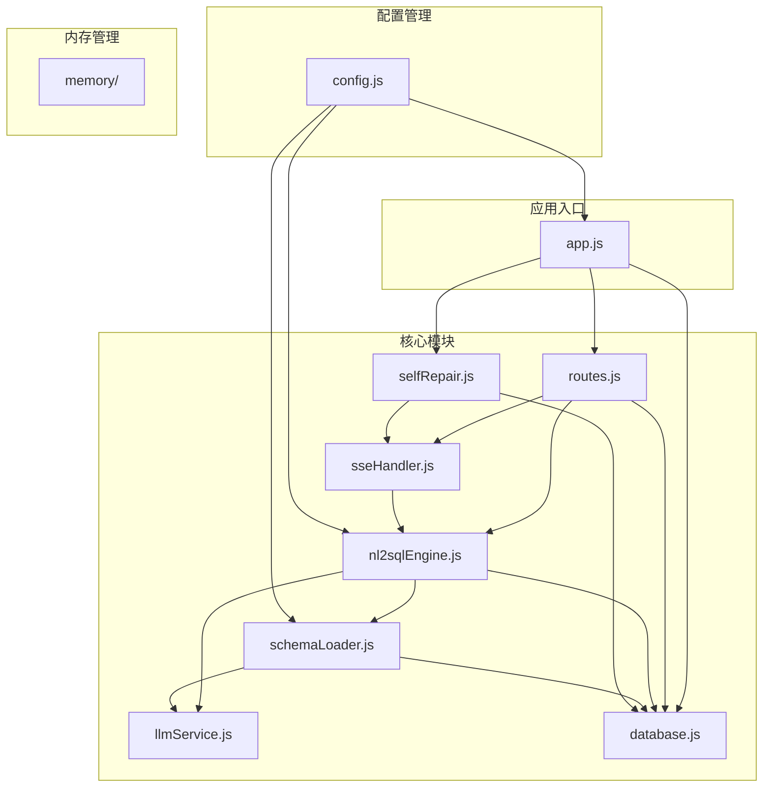
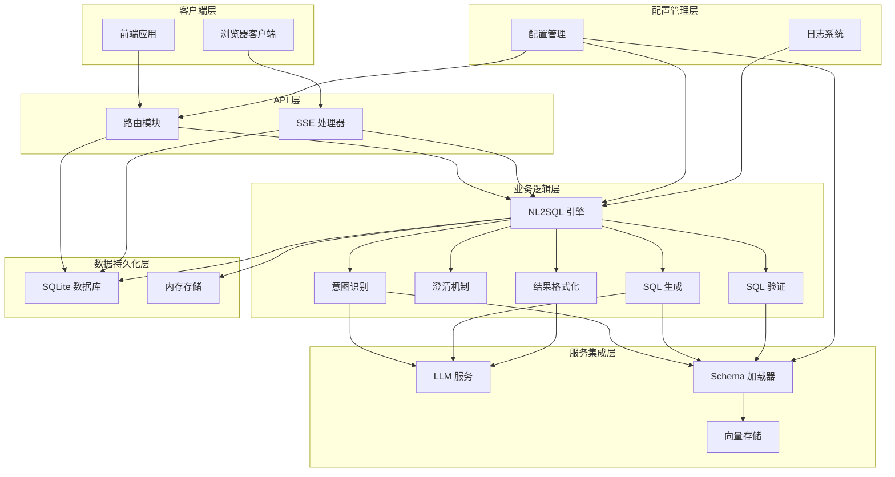
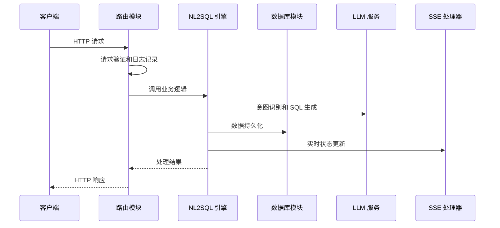
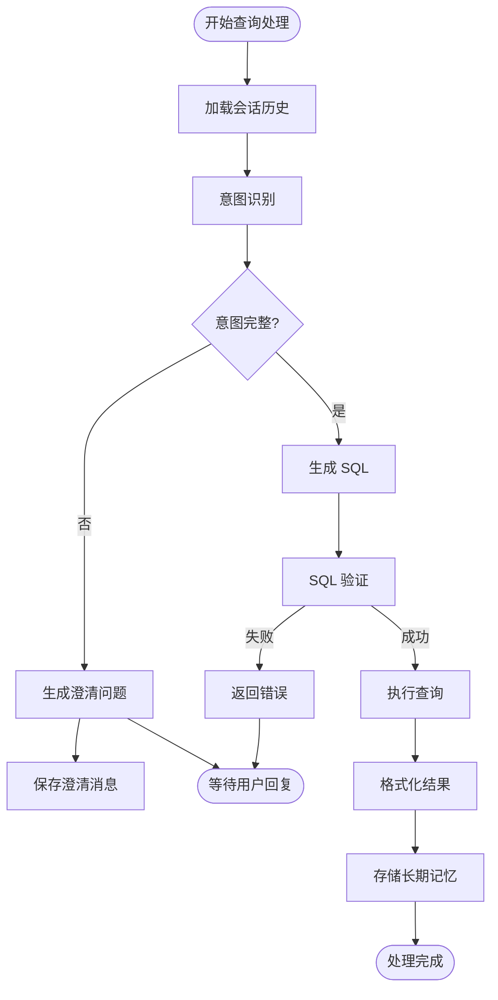
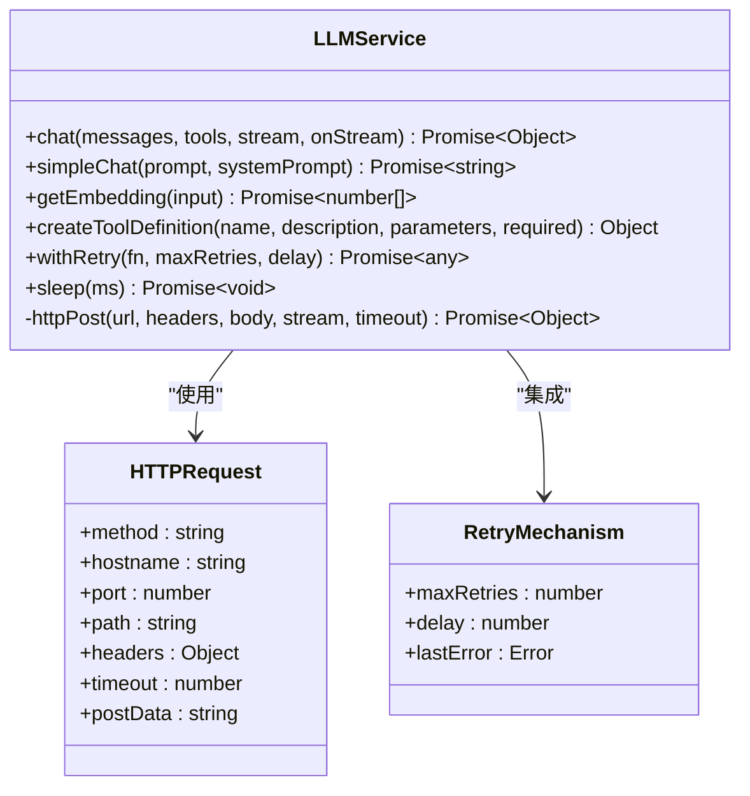
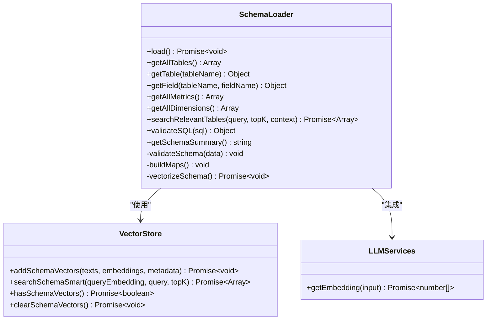
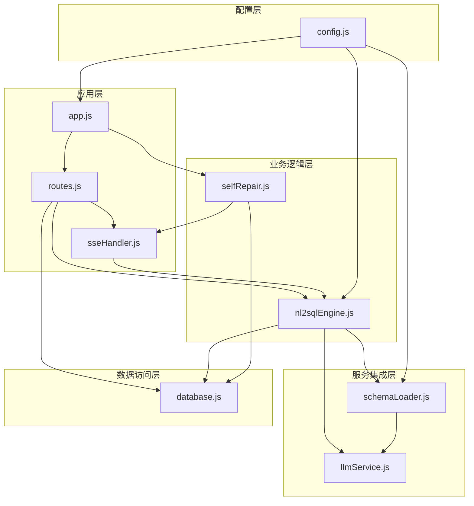

# 核心模块设计

<cite>
**本文档引用的文件**
- [app.js](file://backend/src/app.js)
- [routes.js](file://backend/src/core/routes.js)
- [nl2sqlEngine.js](file://backend/src/core/nl2sqlEngine.js)
- [llmService.js](file://backend/src/core/llmService.js)
- [schemaLoader.js](file://backend/src/core/schemaLoader.js)
- [database.js](file://backend/src/core/database.js)
- [sseHandler.js](file://backend/src/core/sseHandler.js)
- [selfRepair.js](file://backend/src/core/selfRepair.js)
- [config.js](file://backend/src/core/config.js)
</cite>

## 目录
1. [简介](#简介)
2. [项目结构](#项目结构)
3. [核心组件](#核心组件)
4. [架构概览](#架构概览)
5. [详细组件分析](#详细组件分析)
6. [依赖关系分析](#依赖关系分析)
7. [性能考虑](#性能考虑)
8. [故障排除指南](#故障排除指南)
9. [结论](#结论)

## 简介

NL2SQL 核心模块是一个基于 Node.js 的自然语言到 SQL 转换系统，集成了人工智能服务、数据库管理和实时通信功能。该系统通过模块化设计实现了高度可扩展的架构，支持 RESTful API 接口、流式服务器推送事件（SSE）、智能意图识别和 SQL 生成等功能。

## 项目结构

后端项目采用清晰的模块化组织结构：

**图表来源**
- [app.js:1-238](file://backend/src/app.js#L1-L238)
- [routes.js:1-1037](file://backend/src/core/routes.js#L1-L1037)

**章节来源**
- [app.js:1-238](file://backend/src/app.js#L1-L238)
- [config.js:1-398](file://backend/src/core/config.js#L1-L398)

## 核心组件

### 路由模块 (routes.js)

路由模块是整个系统的入口点，负责定义和处理所有 RESTful API 端点。该模块实现了完整的 CRUD 操作和业务特定的查询接口。

**主要功能**：
- 健康检查接口：监控服务状态和组件健康状况
- Schema 查询接口：提供数据库元数据的查询和搜索功能
- 会话管理接口：处理用户会话的创建、查询和删除
- 查询历史接口：管理用户的查询历史记录
- 用户偏好接口：支持长期记忆和查询模式的学习
- 评估接口：提供系统性能和质量评估功能

**中间件配置**：
- 请求日志中间件：记录所有 API 请求的详细信息
- CORS 支持：允许跨域请求访问
- JSON 解析：支持 JSON 格式的请求体解析

**章节来源**
- [routes.js:1-1037](file://backend/src/core/routes.js#L1-L1037)

### NL2SQL 引擎模块 (nl2sqlEngine.js)

NL2SQL 引擎是系统的核心处理模块，实现了从自然语言到 SQL 的完整转换流程。

**核心流程**：
1. **意图识别**：分析用户查询，提取时间范围、指标、维度和筛选条件
2. **澄清机制**：当信息不足时，生成澄清问题引导用户提供必要信息
3. **SQL 生成**：基于意图和 Schema 信息生成标准 SQL 语句
4. **SQL 验证**：确保生成的 SQL 符合安全性和语法规范
5. **结果格式化**：将查询结果转换为自然语言描述

**高级特性**：
- 长期记忆集成：利用用户历史偏好和学习模式
- 实体解析：自动识别和解析游戏名称、渠道等业务实体
- 上下文管理：智能处理多轮对话的上下文理解
- Token 预算管理：控制 LLM 调用的成本和性能

**章节来源**
- [nl2sqlEngine.js:1-2492](file://backend/src/core/nl2sqlEngine.js#L1-L2492)

### LLM 服务模块 (llmService.js)

LLM 服务模块负责与外部 AI 服务进行通信，提供统一的 API 调用接口。

**核心功能**：
- HTTP 请求封装：支持同步和流式响应的 HTTP POST 请求
- 重试机制：自动处理 API 调用失败并进行重试
- 超时控制：防止请求挂起和资源浪费
- 错误处理：提供详细的错误信息和调试支持

**支持的 API**：
- 聊天功能：支持普通响应和流式响应
- Embedding 生成：获取文本的向量表示
- 工具定义：支持函数调用的工具定义

**章节来源**
- [llmService.js:1-468](file://backend/src/core/llmService.js#L1-L468)

### Schema 加载器模块 (schemaLoader.js)

Schema 加载器模块管理数据库元数据，提供查询和匹配功能。

**主要职责**：
- Schema 文件加载：从 JSON 配置文件读取表结构定义
- 缓存管理：缓存 Schema 信息以提高查询性能
- 语义搜索：使用向量嵌入进行智能表和字段匹配
- SQL 验证：检查 SQL 语句的安全性和有效性

**向量化功能**：
- 表级向量生成：为每个表生成语义向量表示
- 智能搜索：基于语义相似度的表和字段匹配
- 元数据标签：添加域标签和数据类型信息用于过滤

**章节来源**
- [schemaLoader.js:1-1071](file://backend/src/core/schemaLoader.js#L1-L1071)

### 数据库模块 (database.js)

数据库模块负责会话历史、查询日志等数据的持久化存储。

**数据库设计**：
- SQLite 轻量级数据库：无需额外安装数据库服务
- 多表结构：支持会话、消息、查询历史、用户偏好等数据
- 索引优化：为常用查询字段创建索引以提高性能

**核心表结构**：
- sessions：存储用户会话信息
- messages：存储会话中的消息历史
- query_history：存储用户的数据查询记录
- user_preferences：存储用户的查询偏好和常用模式

**章节来源**
- [database.js:1-850](file://backend/src/core/database.js#L1-L850)

### SSE 处理器模块 (sseHandler.js)

SSE 处理器模块实现服务器推送事件功能，支持实时通信。

**核心功能**：
- 连接管理：维护活跃的 SSE 连接
- 流式消息：支持实时消息推送
- 查询处理：协调 NL2SQL 引擎进行查询处理
- 进度回调：提供查询进度的实时反馈

**连接特性**：
- 多连接支持：每个会话可支持多个并发连接
- 自动清理：自动处理断开的连接
- 错误处理：完善的错误监控和处理机制

**章节来源**
- [sseHandler.js:1-349](file://backend/src/core/sseHandler.js#L1-L349)

### 自修复模块 (selfRepair.js)

自修复模块提供系统的自我监控和维护功能。

**定时任务**：
- 每日自检：检查系统健康状态和各项指标
- 会话清理：定期清理过期的会话数据
- 统计收集：收集系统运行统计数据
- 记忆维护：压缩和清理长期记忆数据

**监控功能**：
- 数据库连接检查
- 向量数据库状态监控
- 查询性能分析
- 系统资源使用情况

**章节来源**
- [selfRepair.js:1-489](file://backend/src/core/selfRepair.js#L1-L489)

## 架构概览

系统采用分层架构设计，各模块之间通过清晰的接口进行交互：

**图表来源**
- [app.js:97-166](file://backend/src/app.js#L97-L166)
- [nl2sqlEngine.js:1878-2399](file://backend/src/core/nl2sqlEngine.js#L1878-L2399)

## 详细组件分析

### 路由模块详细分析

路由模块实现了 RESTful API 的完整生命周期管理：

**图表来源**
- [routes.js:266-345](file://backend/src/core/routes.js#L266-L345)
- [nl2sqlEngine.js:1878-2399](file://backend/src/core/nl2sqlEngine.js#L1878-L2399)

**章节来源**
- [routes.js:1-1037](file://backend/src/core/routes.js#L1-L1037)

### NL2SQL 引擎详细分析

NL2SQL 引擎实现了复杂的自然语言处理流程：

**图表来源**
- [nl2sqlEngine.js:1878-2399](file://backend/src/core/nl2sqlEngine.js#L1878-L2399)

**章节来源**
- [nl2sqlEngine.js:1-2492](file://backend/src/core/nl2sqlEngine.js#L1-L2492)

### LLM 服务详细分析

LLM 服务模块提供了可靠的 AI 服务集成：

**图表来源**
- [llmService.js:222-299](file://backend/src/core/llmService.js#L222-L299)
- [llmService.js:416-415](file://backend/src/core/llmService.js#L416-L415)

**章节来源**
- [llmService.js:1-468](file://backend/src/core/llmService.js#L1-L468)

### Schema 加载器详细分析

Schema 加载器模块实现了智能的元数据管理：

**图表来源**
- [schemaLoader.js:69-122](file://backend/src/core/schemaLoader.js#L69-L122)
- [schemaLoader.js:201-281](file://backend/src/core/schemaLoader.js#L201-L281)

**章节来源**
- [schemaLoader.js:1-1071](file://backend/src/core/schemaLoader.js#L1-L1071)

## 依赖关系分析

系统模块间的依赖关系体现了清晰的分层架构：

**图表来源**
- [app.js:39-50](file://backend/src/app.js#L39-L50)
- [routes.js:16-29](file://backend/src/core/routes.js#L16-L29)

**章节来源**
- [app.js:1-238](file://backend/src/app.js#L1-L238)
- [routes.js:1-1037](file://backend/src/core/routes.js#L1-L1037)

## 性能考虑

系统在多个层面实现了性能优化：

### 缓存策略
- **Schema 缓存**：缓存元数据以减少重复加载
- **向量缓存**：缓存向量嵌入以提高搜索性能
- **会话缓存**：缓存频繁访问的会话数据

### 异步处理
- **非阻塞 I/O**：使用异步操作避免阻塞主线程
- **批量处理**：对向量嵌入进行批量处理
- **延迟执行**：将非关键操作延迟执行

### 资源管理
- **连接池**：数据库连接池管理
- **内存优化**：及时清理临时数据
- **垃圾回收**：合理管理内存使用

## 故障排除指南

### 常见问题及解决方案

**1. LLM API 调用失败**
- 检查 API 密钥配置
- 验证网络连接
- 查看重试日志

**2. 数据库连接问题**
- 确认数据库文件权限
- 检查磁盘空间
- 验证 SQLite 版本

**3. SSE 连接异常**
- 检查防火墙设置
- 验证客户端连接状态
- 查看连接池配置

**4. 性能问题**
- 监控内存使用情况
- 检查索引使用
- 优化查询语句

**章节来源**
- [llmService.js:135-151](file://backend/src/core/llmService.js#L135-L151)
- [database.js:218-244](file://backend/src/core/database.js#L218-L244)

## 结论

NL2SQL 核心模块通过精心设计的架构实现了自然语言到 SQL 的高效转换。系统的主要优势包括：

1. **模块化设计**：清晰的职责分离和接口定义
2. **可扩展性**：支持插件式架构和自定义扩展
3. **可靠性**：完善的错误处理和重试机制
4. **性能优化**：多层缓存和异步处理
5. **监控能力**：全面的健康检查和性能监控

该系统为构建企业级的自然语言查询平台提供了坚实的技术基础，支持未来功能的持续扩展和优化。