# 路由模块

<cite>
**本文引用的文件**
- [routes.js](file://backend/src/core/routes.js)
- [app.js](file://backend/src/app.js)
- [logger.js](file://backend/src/utils/logger.js)
- [evaluation.js](file://backend/src/utils/evaluation.js)
- [config.js](file://backend/src/core/config.js)
- [sseHandler.js](file://backend/src/core/sseHandler.js)
- [database.js](file://backend/src/core/database.js)
- [package.json](file://backend/package.json)
</cite>

## 目录
1. [简介](#简介)
2. [项目结构](#项目结构)
3. [核心组件](#核心组件)
4. [架构总览](#架构总览)
5. [详细组件分析](#详细组件分析)
6. [依赖分析](#依赖分析)
7. [性能考虑](#性能考虑)
8. [故障排查指南](#故障排查指南)
9. [结论](#结论)
10. [附录](#附录)

## 简介
本文件面向 NL2SQL 后端的 Express 路由模块，系统性阐述其设计架构与实现细节，覆盖中间件配置、请求处理流程、错误处理机制、参数校验、请求体解析、响应格式化与状态码处理，并结合日志记录与性能监控，提供扩展指南与最佳实践，帮助开发者快速理解与维护路由层。

## 项目结构
路由模块位于 backend/src/core/routes.js，Express 应用在 backend/src/app.js 中初始化并挂载路由。日志、评估、配置与 SSE 处理分别由 utils/logger.js、utils/evaluation.js、core/config.js、core/sseHandler.js 和 core/database.js 提供支撑。

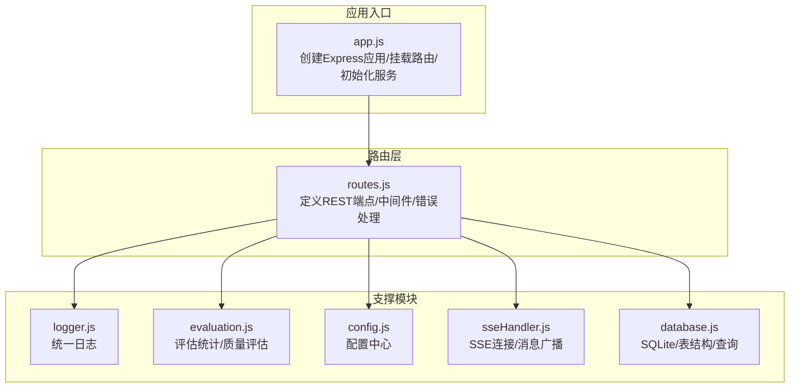

图表来源
- [app.js:78-80](file://backend/src/app.js#L78-L80)
- [routes.js:16-36](file://backend/src/core/routes.js#L16-L36)
- [logger.js:1-442](file://backend/src/utils/logger.js#L1-L442)
- [evaluation.js:1-488](file://backend/src/utils/evaluation.js#L1-L488)
- [config.js:16-355](file://backend/src/core/config.js#L16-L355)
- [sseHandler.js:1-349](file://backend/src/core/sseHandler.js#L1-L349)
- [database.js:1-200](file://backend/src/core/database.js#L1-L200)

章节来源
- [app.js:56-80](file://backend/src/app.js#L56-L80)
- [routes.js:16-36](file://backend/src/core/routes.js#L16-L36)

## 核心组件
- Express 路由实例：集中定义 /api 下所有 REST 端点，采用模块化导出。
- 中间件链：
  - CORS 与 body-parser：全局启用跨域与 JSON/URL 编码解析。
  - 请求日志中间件：记录 method、path、query、ip。
  - 404 与全局错误中间件：兜底处理未匹配路径与未捕获异常。
- 端点分组：
  - 健康检查：/api/health、/api/health/detail
  - Schema 查询：/api/schema、/api/schema/tables/:tableName、/api/schema/search
  - 会话管理：/api/sessions、/api/sessions/:sessionId、/api/sessions/:sessionId/messages、/api/users/:userId/sessions
  - 查询历史：/api/queries/history
  - 用户偏好（长期记忆）：/api/preferences/:userId/raw、/api/preferences/:userId/stats、/api/preferences/:userId、/api/preferences/:userId/templates、/api/preferences/:preferenceId、/api/preferences/:userId/learn-alias
  - 评估接口：/api/evaluation/stats、/api/evaluation/stats/reset、/api/evaluation/schema-quality、/api/evaluation/query-quality、/api/evaluation/config
  - 统计信息：/api/stats
  - 配置接口：/api/config
  - SSE 接口：/api/sse/stream、/api/sse/query
- 日志与错误处理：统一使用 logger.js 记录，路由内捕获异常并返回标准化错误响应。

章节来源
- [routes.js:46-54](file://backend/src/core/routes.js#L46-L54)
- [routes.js:72-137](file://backend/src/core/routes.js#L72-L137)
- [routes.js:150-250](file://backend/src/core/routes.js#L150-L250)
- [routes.js:266-398](file://backend/src/core/routes.js#L266-L398)
- [routes.js:413-450](file://backend/src/core/routes.js#L413-L450)
- [routes.js:553-664](file://backend/src/core/routes.js#L553-L664)
- [routes.js:726-856](file://backend/src/core/routes.js#L726-L856)
- [routes.js:866-942](file://backend/src/core/routes.js#L866-L942)
- [routes.js:957-1002](file://backend/src/core/routes.js#L957-L1002)
- [routes.js:1012-1030](file://backend/src/core/routes.js#L1012-L1030)

## 架构总览
路由层通过 app.js 的中间件栈与路由实例协作，形成清晰的请求生命周期：CORS/body-parser -> 路由中间件 -> 具体端点处理 -> 数据库/向量/评估/日志 -> 标准化响应 -> 全局错误兜底。

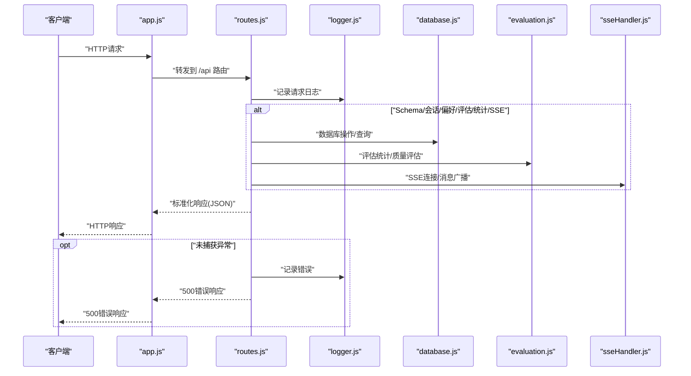

图表来源
- [app.js:63-73](file://backend/src/app.js#L63-L73)
- [routes.js:46-54](file://backend/src/core/routes.js#L46-L54)
- [routes.js:1012-1030](file://backend/src/core/routes.js#L1012-L1030)

## 详细组件分析

### 健康检查接口
- /api/health：返回服务状态、版本、运行时长与内存使用。
- /api/health/detail：聚合数据库、LLM、Schema、SSE 组件状态，任一异常返回 503。

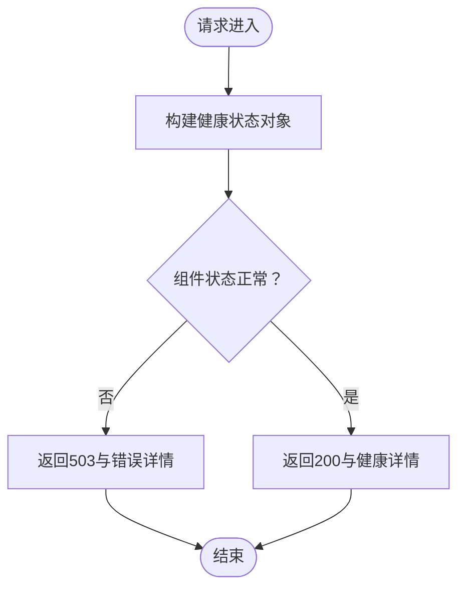

图表来源
- [routes.js:72-137](file://backend/src/core/routes.js#L72-L137)

章节来源
- [routes.js:72-137](file://backend/src/core/routes.js#L72-L137)

### Schema 查询接口
- GET /api/schema：按 type 返回 tables/metrics/dimensions 或完整 Schema。
- GET /api/schema/tables/:tableName：返回表定义与关联表。
- GET /api/schema/search?q&limit：搜索相关表，返回查询词、数量与表列表。

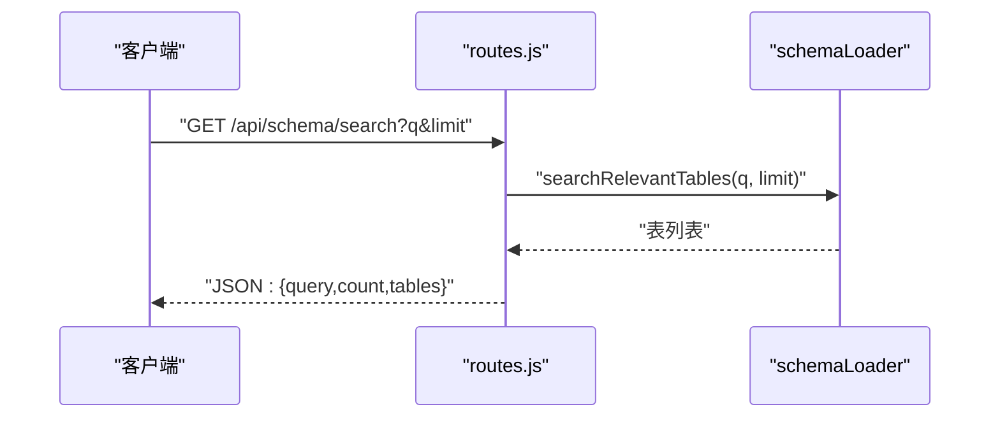

图表来源
- [routes.js:225-250](file://backend/src/core/routes.js#L225-L250)

章节来源
- [routes.js:150-250](file://backend/src/core/routes.js#L150-L250)

### 会话管理接口
- POST /api/sessions：创建会话，返回会话信息（201）。
- GET /api/sessions/:sessionId：获取会话，不存在返回 404。
- DELETE /api/sessions/:sessionId：删除会话并返回成功信息。
- GET /api/sessions/:sessionId/messages?limit：获取消息历史。
- GET /api/users/:userId/sessions?limit：获取用户会话列表。

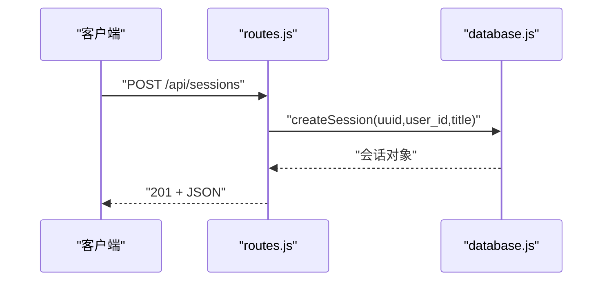

图表来源
- [routes.js:266-290](file://backend/src/core/routes.js#L266-L290)

章节来源
- [routes.js:266-398](file://backend/src/core/routes.js#L266-L398)

### 查询历史接口
- GET /api/queries/history?user_id&session_id&limit：动态拼接 SQL 条件，返回历史记录与数量。

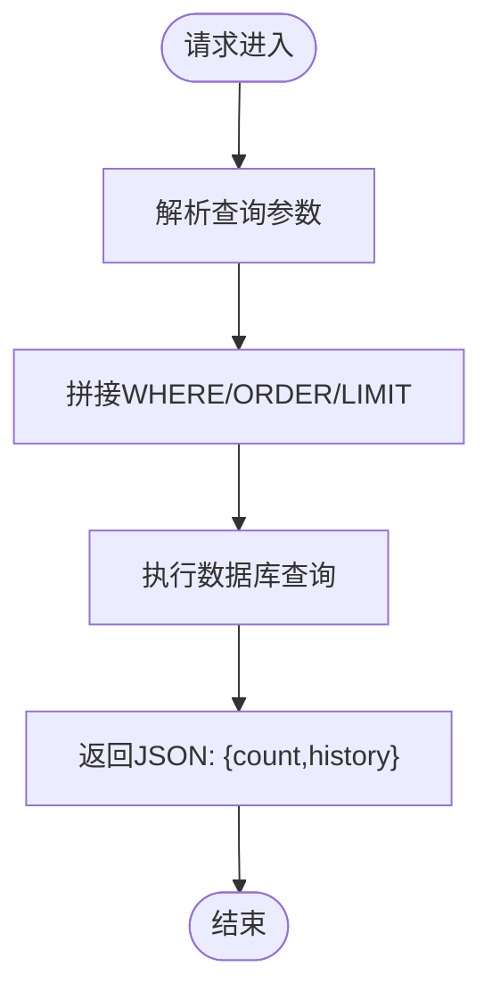

图表来源
- [routes.js:413-450](file://backend/src/core/routes.js#L413-L450)

章节来源
- [routes.js:413-450](file://backend/src/core/routes.js#L413-L450)

### 用户偏好（长期记忆）接口
- GET /api/preferences/:userId/raw：获取原始偏好数据并按类型分组。
- GET /api/preferences/:userId/stats：获取用户记忆统计。
- GET /api/preferences/:userId?type&limit：按类型过滤偏好列表。
- POST /api/preferences/:userId/templates：保存查询模板。
- DELETE /api/preferences/:preferenceId：删除偏好。
- POST /api/preferences/:userId/learn-alias：学习字段别名。

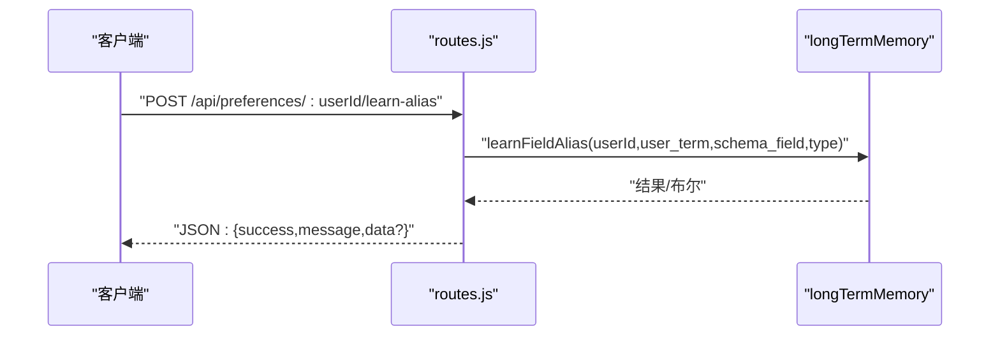

图表来源
- [routes.js:677-716](file://backend/src/core/routes.js#L677-L716)

章节来源
- [routes.js:553-664](file://backend/src/core/routes.js#L553-L664)

### 评估接口
- GET /api/evaluation/stats：获取运行时统计报告（向量检索命中率、记忆命中率）。
- POST /api/evaluation/stats/reset：重置统计数据。
- POST /api/evaluation/schema-quality：执行 Schema 向量化质量评估。
- POST /api/evaluation/query-quality：执行查询历史向量化质量评估。
- GET /api/evaluation/config：获取评估配置。

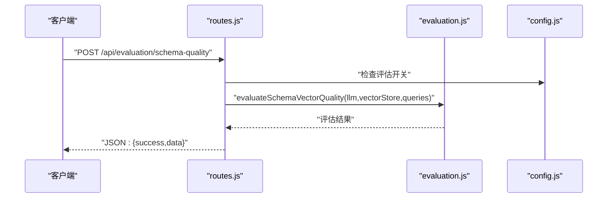

图表来源
- [routes.js:771-803](file://backend/src/core/routes.js#L771-L803)
- [evaluation.js:158-266](file://backend/src/utils/evaluation.js#L158-L266)

章节来源
- [routes.js:726-856](file://backend/src/core/routes.js#L726-L856)
- [evaluation.js:19-488](file://backend/src/utils/evaluation.js#L19-L488)

### 统计信息与配置接口
- GET /api/stats：返回今日查询统计、连接数、Schema 统计、系统信息。
- GET /api/config：返回公开配置（不含敏感信息）。

章节来源
- [routes.js:866-942](file://backend/src/core/routes.js#L866-L942)

### SSE 接口
- GET /api/sse/stream：建立 SSE 连接，支持多标签页。
- POST /api/sse/query：提交查询，异步处理并通过 SSE 推送结果。

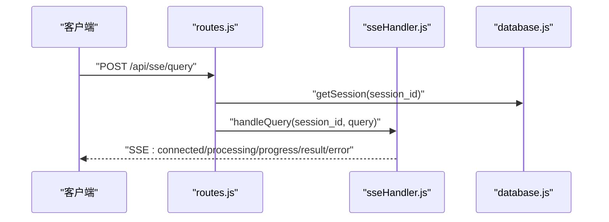

图表来源
- [routes.js:972-1002](file://backend/src/core/routes.js#L972-L1002)
- [sseHandler.js:218-280](file://backend/src/core/sseHandler.js#L218-L280)

章节来源
- [routes.js:947-1002](file://backend/src/core/routes.js#L947-L1002)
- [sseHandler.js:43-112](file://backend/src/core/sseHandler.js#L43-L112)

### 中间件与错误处理
- 请求日志中间件：记录 method、path、query、ip。
- 404 未匹配路径：返回标准化错误 JSON。
- 全局错误中间件：捕获未处理异常，按开发/生产环境返回不同 message。

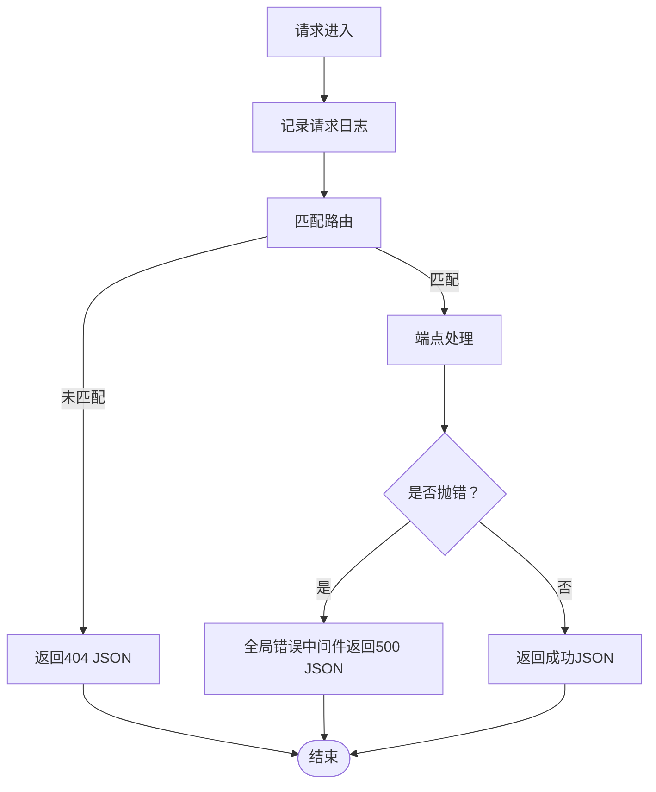

图表来源
- [routes.js:46-54](file://backend/src/core/routes.js#L46-L54)
- [routes.js:1012-1030](file://backend/src/core/routes.js#L1012-L1030)

章节来源
- [routes.js:46-54](file://backend/src/core/routes.js#L46-L54)
- [routes.js:1012-1030](file://backend/src/core/routes.js#L1012-L1030)

## 依赖分析
- app.js 负责：
  - 加载 dotenv，导入 express/http/cors/body-parser。
  - 初始化数据库、向量库、Schema 加载、自修复调度器。
  - 挂载 /api 路由。
- routes.js 依赖：
  - utils/logger.js：统一日志。
  - core/config.js：读取配置。
  - core/schemaLoader.js、core/database.js、core/sseHandler.js、utils/evaluation.js：业务能力。
- package.json 提供依赖：express、cors、body-parser、uuid、sqlite3、vectordb、dotenv、node-cron 等。

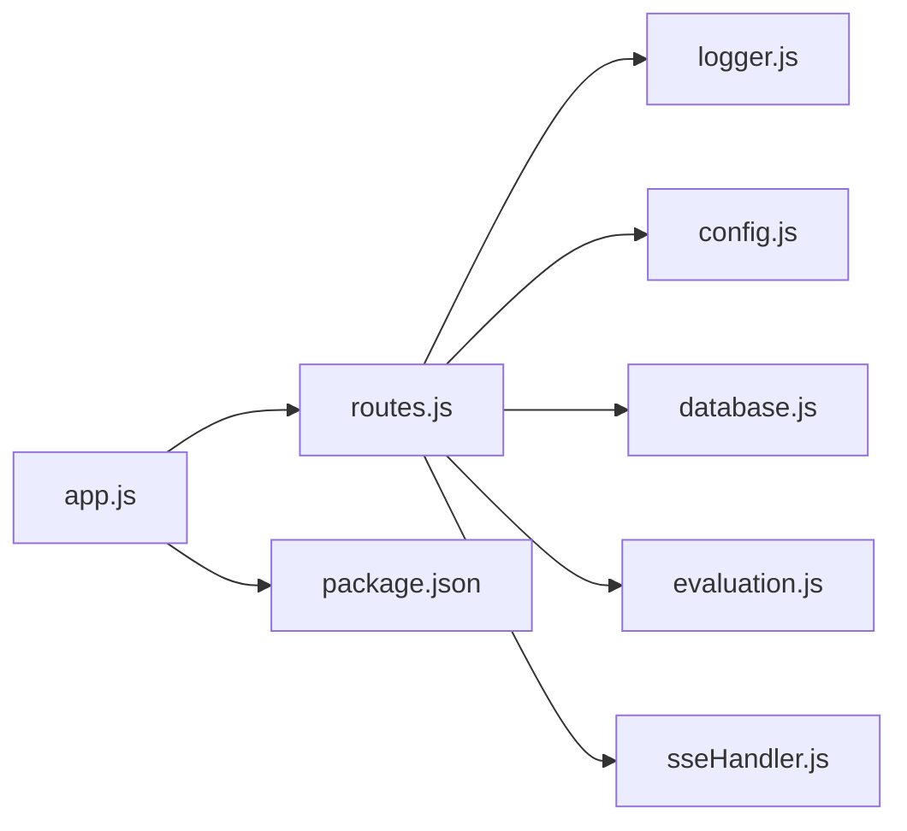

图表来源
- [app.js:40-49](file://backend/src/app.js#L40-L49)
- [routes.js:18-29](file://backend/src/core/routes.js#L18-L29)
- [package.json:10-20](file://backend/package.json#L10-L20)

章节来源
- [app.js:40-49](file://backend/src/app.js#L40-L49)
- [routes.js:18-29](file://backend/src/core/routes.js#L18-L29)
- [package.json:10-20](file://backend/package.json#L10-L20)

## 性能考虑
- 请求体大小限制：body-parser.json({ limit: '10mb' })，避免过大请求导致内存压力。
- 查询限制：config.security.maxQueryRows、config.security.queryTimeout 限制单次查询规模与耗时。
- SSE：多标签页连接复用与广播，减少重复计算。
- 日志：按级别输出，生产环境建议提升日志级别以降低 I/O。
- 评估统计：EVALUATION_TRACK_STATS 可控地记录运行时统计，避免影响主流程。

章节来源
- [app.js:69](file://backend/src/app.js#L69)
- [config.js:150-170](file://backend/src/core/config.js#L150-L170)
- [evaluation.js:21-31](file://backend/src/utils/evaluation.js#L21-L31)

## 故障排查指南
- 健康检查
  - /api/health/detail 返回 503：检查数据库、LLM、Schema、SSE 组件状态。
- Schema 查询
  - /api/schema/tables/:tableName 404：确认表名存在且已加载。
  - /api/schema/search 缺少 q 参数：确保查询参数正确。
- 会话管理
  - /api/sessions/:sessionId 404：确认会话 ID 存在。
  - /api/sessions/:sessionId/messages 500：检查数据库连接与权限。
- 用户偏好
  - /api/preferences/:userId/learn-alias 400：user_term 与 schema_field 必填。
- 评估接口
  - /api/evaluation/schema-quality /query-quality 403：EVALUATION_ENABLED 未启用。
  - 500 错误：查看日志定位具体异常。
- SSE
  - /api/sse/stream 400/404：缺少 session_id 或会话不存在。
  - /api/sse/query 500：检查会话标题更新与查询处理流程。
- 全局错误
  - 404：路径不存在或中间件顺序问题。
  - 500：查看 logger 输出的错误堆栈。

章节来源
- [routes.js:192-215](file://backend/src/core/routes.js#L192-L215)
- [routes.js:229-233](file://backend/src/core/routes.js#L229-L233)
- [routes.js:296-314](file://backend/src/core/routes.js#L296-L314)
- [routes.js:320-345](file://backend/src/core/routes.js#L320-L345)
- [routes.js:677-716](file://backend/src/core/routes.js#L677-L716)
- [routes.js:771-803](file://backend/src/core/routes.js#L771-L803)
- [routes.js:957-1002](file://backend/src/core/routes.js#L957-L1002)
- [routes.js:1012-1030](file://backend/src/core/routes.js#L1012-L1030)

## 结论
该路由模块以 Express 为核心，通过统一中间件栈与模块化端点设计，实现了健康检查、Schema 查询、会话管理、查询历史、用户偏好、评估、统计、配置与 SSE 的完整 API 能力。配合 logger、config、evaluation、sseHandler 与 database 等模块，形成清晰的职责边界与可扩展架构。建议在生产环境中合理配置日志级别、查询限制与评估开关，并持续关注 SSE 连接与评估统计的性能表现。

## 附录

### API 端点一览与规范
- 健康检查
  - GET /api/health：返回服务状态、版本、运行时长与内存使用。
  - GET /api/health/detail：返回组件状态与连接数。
- Schema 查询
  - GET /api/schema?type=tables|metrics|dimensions|""：返回对应定义或完整 Schema。
  - GET /api/schema/tables/:tableName：返回表定义与关联表。
  - GET /api/schema/search?q&limit：返回相关表列表。
- 会话管理
  - POST /api/sessions：创建会话（201）。
  - GET /api/sessions/:sessionId：获取会话。
  - DELETE /api/sessions/:sessionId：删除会话。
  - GET /api/sessions/:sessionId/messages?limit：获取消息历史。
  - GET /api/users/:userId/sessions?limit：获取用户会话列表。
- 查询历史
  - GET /api/queries/history?user_id&session_id&limit：返回历史记录。
- 用户偏好（长期记忆）
  - GET /api/preferences/:userId/raw：原始偏好数据。
  - GET /api/preferences/:userId/stats：用户记忆统计。
  - GET /api/preferences/:userId?type&limit：偏好列表（按类型过滤）。
  - POST /api/preferences/:userId/templates：保存查询模板。
  - DELETE /api/preferences/:preferenceId：删除偏好。
  - POST /api/preferences/:userId/learn-alias：学习字段别名。
- 评估接口
  - GET /api/evaluation/stats：运行时统计报告。
  - POST /api/evaluation/stats/reset：重置统计数据。
  - POST /api/evaluation/schema-quality：Schema 向量化质量评估。
  - POST /api/evaluation/query-quality：查询历史相似度评估。
  - GET /api/evaluation/config：评估配置。
- 统计信息与配置
  - GET /api/stats：今日查询统计、连接数、Schema 统计、系统信息。
  - GET /api/config：公开配置。
- SSE
  - GET /api/sse/stream：建立 SSE 连接。
  - POST /api/sse/query：提交查询并流式返回结果。

章节来源
- [routes.js:72-137](file://backend/src/core/routes.js#L72-L137)
- [routes.js:150-250](file://backend/src/core/routes.js#L150-L250)
- [routes.js:266-398](file://backend/src/core/routes.js#L266-L398)
- [routes.js:413-450](file://backend/src/core/routes.js#L413-L450)
- [routes.js:553-664](file://backend/src/core/routes.js#L553-L664)
- [routes.js:726-856](file://backend/src/core/routes.js#L726-L856)
- [routes.js:866-942](file://backend/src/core/routes.js#L866-L942)
- [routes.js:947-1002](file://backend/src/core/routes.js#L947-L1002)

### 中间件与请求处理流程
- 中间件顺序
  - CORS -> body-parser(JSON/URL) -> 路由中间件（日志）-> 路由处理 -> 404 -> 全局错误。
- 请求体解析
  - JSON：{ limit: '10mb' }；URL 编码：{ extended: true }。
- 响应格式
  - 成功：JSON；错误：统一 { error | success:false, message }。
- 状态码
  - 200/201/400/404/500/503；SSE 专用 400/404。

章节来源
- [app.js:63-73](file://backend/src/app.js#L63-L73)
- [routes.js:46-54](file://backend/src/core/routes.js#L46-L54)
- [routes.js:1012-1030](file://backend/src/core/routes.js#L1012-L1030)

### 日志记录机制
- 日志级别：TRACE/DEBUG/INFO/WARN/ERROR。
- 输出目标：控制台（带颜色）+ 文件（自动轮转）。
- 追踪能力：startTrace/traceStep/endTrace，用于流程追踪与性能分析。

章节来源
- [logger.js:29-44](file://backend/src/utils/logger.js#L29-L44)
- [logger.js:263-309](file://backend/src/utils/logger.js#L263-L309)
- [logger.js:322-408](file://backend/src/utils/logger.js#L322-L408)

### 性能监控与评估
- 评估统计：向量检索命中率、记忆命中率、距离分布、类型命中明细。
- 运行时统计：可选记录，不影响主流程。
- 配置开关：EVALUATION_ENABLED/EVALUATION_TRACK_STATS。

章节来源
- [evaluation.js:37-60](file://backend/src/utils/evaluation.js#L37-L60)
- [evaluation.js:344-429](file://backend/src/utils/evaluation.js#L344-L429)
- [config.js:342-354](file://backend/src/core/config.js#L342-L354)

### 扩展指南与最佳实践
- 新增端点
  - 在 routes.js 中定义路由与处理函数，遵循统一响应格式与状态码约定。
  - 如需参数校验，可在端点内进行简单校验，复杂场景可引入校验库。
- 中间件
  - 在 app.js 中添加全局中间件（如限流、鉴权），注意顺序。
  - 路由级中间件仅在 routes.js 中使用，保持模块内职责单一。
- 错误处理
  - 统一使用 logger.error 记录错误，返回标准化 JSON。
  - 对外部暴露的错误 message 在生产环境应简化，开发环境可显示详细信息。
- 日志与监控
  - 为关键流程增加 traceStep，便于定位性能瓶颈。
  - 评估统计仅在需要时开启，避免影响生产性能。
- SSE
  - 严格校验 session_id 与查询内容，避免空查询与无效会话。
  - 广播消息时注意连接状态与并发处理。

章节来源
- [routes.js:46-54](file://backend/src/core/routes.js#L46-L54)
- [routes.js:1012-1030](file://backend/src/core/routes.js#L1012-L1030)
- [logger.js:263-309](file://backend/src/utils/logger.js#L263-L309)
- [evaluation.js:21-31](file://backend/src/utils/evaluation.js#L21-L31)