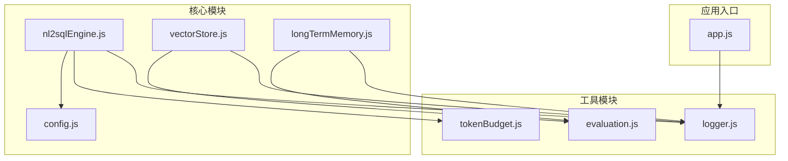
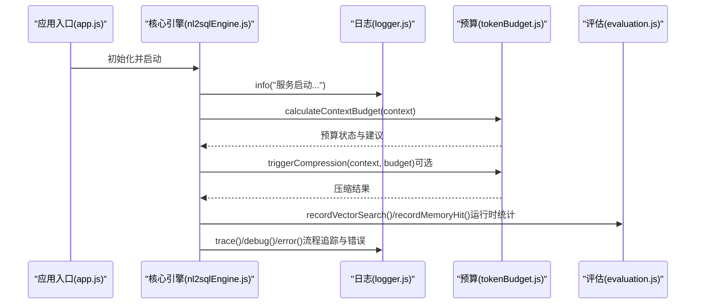
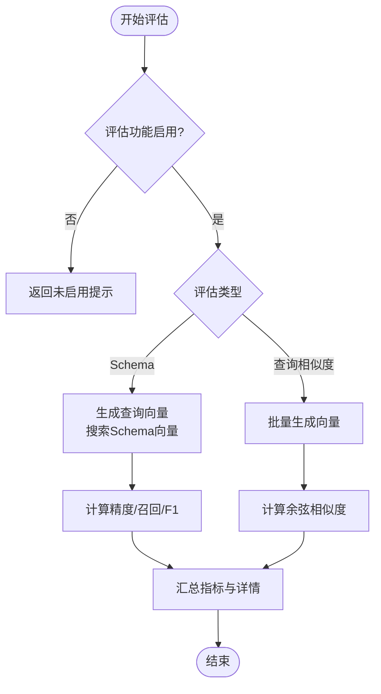
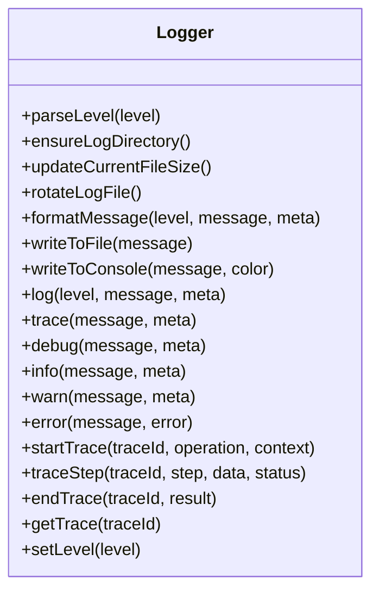
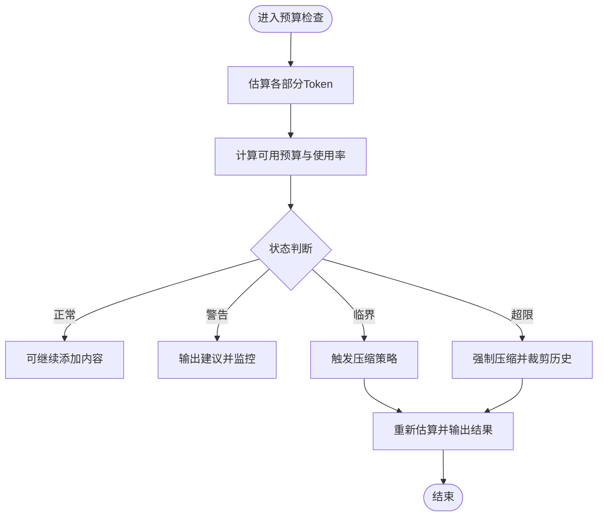
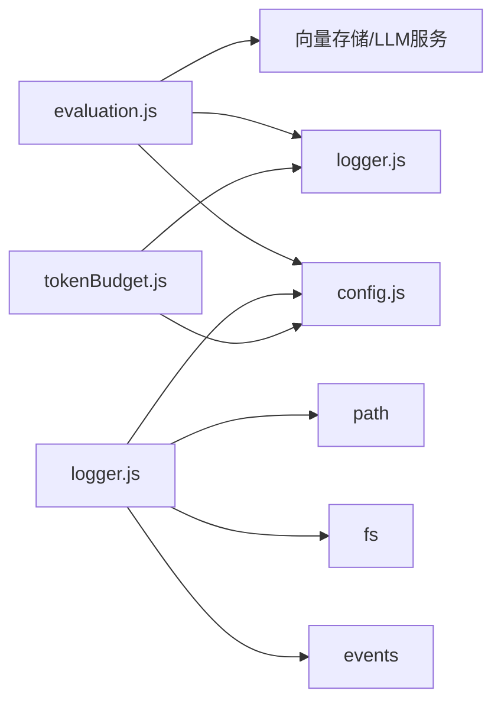

# 工具模块

<cite>
**本文引用的文件**
- [evaluation.js](file://backend/src/utils/evaluation.js)
- [logger.js](file://backend/src/utils/logger.js)
- [tokenBudget.js](file://backend/src/utils/tokenBudget.js)
- [config.js](file://backend/src/core/config.js)
- [nl2sqlEngine.js](file://backend/src/core/nl2sqlEngine.js)
- [vectorStore.js](file://backend/src/memory/vectorStore.js)
- [longTermMemory.js](file://backend/src/memory/longTermMemory.js)
- [app.js](file://backend/src/app.js)
</cite>

## 目录
1. [简介](#简介)
2. [项目结构](#项目结构)
3. [核心组件](#核心组件)
4. [架构总览](#架构总览)
5. [详细组件分析](#详细组件分析)
6. [依赖分析](#依赖分析)
7. [性能考量](#性能考量)
8. [故障排查指南](#故障排查指南)
9. [结论](#结论)
10. [附录](#附录)

## 简介
本文件聚焦NL2SQL系统中的三类实用工具模块：evaluation评估工具、logger日志记录器与tokenBudget令牌预算管理。它们分别承担“质量评估与统计”、“统一日志与流程追踪”以及“上下文Token预算与压缩”的职责，为系统提供性能监控、错误追踪与资源控制能力，支撑核心引擎的稳定运行与持续优化。

## 项目结构
工具模块位于后端工程的工具目录，与核心引擎、内存与向量存储模块协同工作：
- evaluation：提供向量化质量评估与运行时统计接口，支持非侵入式记录与手动触发评估。
- logger：提供统一日志输出、文件轮转、结构化日志与执行流程追踪（trace）能力。
- tokenBudget：提供上下文Token估算、预算计算、压缩与裁剪策略，保障LLM上下文窗口安全。

图表来源
- [evaluation.js:1-488](file://backend/src/utils/evaluation.js#L1-L488)
- [logger.js:1-442](file://backend/src/utils/logger.js#L1-L442)
- [tokenBudget.js:1-435](file://backend/src/utils/tokenBudget.js#L1-L435)
- [config.js:1-398](file://backend/src/core/config.js#L1-L398)
- [nl2sqlEngine.js:1-2652](file://backend/src/core/nl2sqlEngine.js#L1-L2652)
- [vectorStore.js:1-881](file://backend/src/memory/vectorStore.js#L1-L881)
- [longTermMemory.js:1-1127](file://backend/src/memory/longTermMemory.js#L1-L1127)
- [app.js:1-260](file://backend/src/app.js#L1-L260)

章节来源
- [evaluation.js:1-488](file://backend/src/utils/evaluation.js#L1-L488)
- [logger.js:1-442](file://backend/src/utils/logger.js#L1-L442)
- [tokenBudget.js:1-435](file://backend/src/utils/tokenBudget.js#L1-L435)
- [config.js:1-398](file://backend/src/core/config.js#L1-L398)
- [app.js:1-260](file://backend/src/app.js#L1-L260)

## 核心组件
- evaluation评估工具
  - 作用：向量化质量评估（Schema与查询历史）、运行时统计（向量检索命中、距离分布、长期记忆命中率）。
  - 特点：非侵入式记录、可配置开关、手动触发评估、提供测试数据集。
- logger日志记录器
  - 作用：统一日志输出、文件轮转、结构化日志、多级别日志、执行流程追踪（trace）。
  - 特点：支持控制台彩色输出与文件输出、事件驱动、可动态调整日志级别。
- tokenBudget令牌预算管理
  - 作用：上下文Token估算、预算计算、状态判断与压缩策略触发。
  - 特点：保守估算、阈值控制、历史裁剪与检索片段压缩、建议输出。

章节来源
- [evaluation.js:1-488](file://backend/src/utils/evaluation.js#L1-L488)
- [logger.js:1-442](file://backend/src/utils/logger.js#L1-L442)
- [tokenBudget.js:1-435](file://backend/src/utils/tokenBudget.js#L1-L435)

## 架构总览
工具模块通过配置中心与核心引擎协作，形成“评估-日志-预算”三位一体的支撑体系：
- 配置中心提供统一的开关与阈值（如评估开关、日志级别、预算阈值）。
- 核心引擎在关键节点调用日志记录与预算检查，必要时触发压缩。
- 向量存储与长期记忆在检索与记忆命中时调用评估模块进行统计。

图表来源
- [app.js:97-188](file://backend/src/app.js#L97-L188)
- [nl2sqlEngine.js:2120-2150](file://backend/src/core/nl2sqlEngine.js#L2120-L2150)
- [tokenBudget.js:115-181](file://backend/src/utils/tokenBudget.js#L115-L181)
- [tokenBudget.js:315-372](file://backend/src/utils/tokenBudget.js#L315-L372)
- [evaluation.js:71-122](file://backend/src/utils/evaluation.js#L71-L122)

## 详细组件分析

### evaluation评估工具
- 设计目标
  - 非侵入式：统计与评估不影响主业务流程，失败静默。
  - 可配置：通过环境变量与配置中心控制开关与阈值。
  - 可扩展：提供测试数据集与手动评估接口，便于离线质量评估。
- 关键能力
  - 向量化质量评估：Schema表级检索准确度与查询历史相似度评估。
  - 运行时统计：向量检索命中、距离分布、长期记忆命中率与按类型统计。
  - 报表导出：提供完整统计报告与重置接口。
- 使用场景
  - 线上运行时统计：向量检索与长期记忆命中率监控。
  - 离线质量评估：定期评估向量化质量，指导模型与检索策略优化。
- 配置项
  - EVALUATION_ENABLED：是否启用评估功能。
  - EVALUATION_TRACK_STATS：是否记录运行时统计。
  - 阈值：高/中相似度与高质量/中质量阈值。
- 接口概览
  - 记录接口：recordVectorSearch、recordMemoryHit
  - 评估接口：evaluateSchemaVectorQuality、evaluateQueryVectorQuality、calculateCosineSimilarity
  - 统计查询：getVectorSearchStats、getLongTermMemoryStats、getFullStatsReport、resetStats
  - 测试数据：DEFAULT_SCHEMA_TEST_QUERIES、DEFAULT_QUERY_SIMILARITY_PAIRS

图表来源
- [evaluation.js:158-266](file://backend/src/utils/evaluation.js#L158-L266)
- [evaluation.js:276-334](file://backend/src/utils/evaluation.js#L276-L334)

章节来源
- [evaluation.js:19-61](file://backend/src/utils/evaluation.js#L19-L61)
- [evaluation.js:66-122](file://backend/src/utils/evaluation.js#L66-L122)
- [evaluation.js:158-266](file://backend/src/utils/evaluation.js#L158-L266)
- [evaluation.js:276-334](file://backend/src/utils/evaluation.js#L276-L334)
- [evaluation.js:344-407](file://backend/src/utils/evaluation.js#L344-L407)
- [evaluation.js:439-459](file://backend/src/utils/evaluation.js#L439-L459)

### logger日志记录器
- 设计目标
  - 统一日志：集中管理日志级别、输出位置与格式。
  - 可靠性：文件轮转、异常降级（写文件失败时降级到控制台）。
  - 可观测性：结构化日志、事件驱动、执行流程追踪（trace）。
- 关键能力
  - 多级别日志：TRACE、DEBUG、INFO、WARN、ERROR。
  - 文件轮转：按大小轮转、保留多份历史文件。
  - 结构化日志：支持附加元数据，便于检索与分析。
  - 执行追踪：startTrace/traceStep/endTrace，支持按traceId聚合流程步骤。
- 使用场景
  - 应用启动/关闭：记录服务生命周期事件。
  - 核心流程：记录关键步骤与耗时，便于定位性能瓶颈。
  - 错误追踪：记录错误堆栈与上下文，便于排障。
- 配置项
  - LOG_LEVEL：日志级别。
  - LOG_FILE：日志文件路径。
  - LOG_CONSOLE：是否输出到控制台。
  - LOG_FILE_OUTPUT：是否输出到文件。
  - maxSize/maxFiles：文件轮转参数。

图表来源
- [logger.js:54-427](file://backend/src/utils/logger.js#L54-L427)

章节来源
- [logger.js:29-44](file://backend/src/utils/logger.js#L29-L44)
- [logger.js:117-166](file://backend/src/utils/logger.js#L117-L166)
- [logger.js:175-251](file://backend/src/utils/logger.js#L175-L251)
- [logger.js:322-408](file://backend/src/utils/logger.js#L322-L408)

### tokenBudget令牌预算管理
- 设计目标
  - 预防上下文溢出：通过估算与阈值控制，避免LLM上下文窗口超限。
  - 主动压缩：在接近临界时给出压缩建议并自动裁剪历史与检索片段。
  - 透明反馈：输出预算分解、使用率与建议，便于调优。
- 关键能力
  - 估算函数：estimateTokens、estimateTokensBatch、estimateObjectTokens。
  - 预算计算：calculateContextBudget，输出breakdown、budget、status与suggestions。
  - 压缩策略：trimHistory、compressRetrievedChunks、triggerCompression。
  - 快捷检查：isContextSafe、getContextStatusSummary。
- 使用场景
  - 生成SQL前：检查上下文是否安全，必要时触发压缩。
  - 长对话：通过历史裁剪与摘要，维持上下文可控。
  - 检索增强：压缩检索片段，降低Token占用。
- 配置项
  - ENABLE_TOKEN_BUDGET：是否启用Token预算检查。
  - MAX_CONTEXT_TOKENS/RESERVED_OUTPUT_TOKENS：上下文上限与输出预留。
  - WARNING_THRESHOLD/COMPRESSION_THRESHOLD：预警与压缩阈值。
  - maxRetrievedChunksTokens/recentHistoryRounds：检索片段与历史轮数限制。

图表来源
- [tokenBudget.js:115-181](file://backend/src/utils/tokenBudget.js#L115-L181)
- [tokenBudget.js:315-372](file://backend/src/utils/tokenBudget.js#L315-L372)

章节来源
- [tokenBudget.js:57-99](file://backend/src/utils/tokenBudget.js#L57-L99)
- [tokenBudget.js:115-181](file://backend/src/utils/tokenBudget.js#L115-L181)
- [tokenBudget.js:227-305](file://backend/src/utils/tokenBudget.js#L227-L305)
- [tokenBudget.js:315-372](file://backend/src/utils/tokenBudget.js#L315-L372)
- [tokenBudget.js:384-408](file://backend/src/utils/tokenBudget.js#L384-L408)

## 依赖分析
- evaluation依赖
  - logger：用于记录评估过程与调试信息。
  - config：读取评估开关与阈值。
  - 向量存储与LLM服务：用于生成嵌入与检索。
- logger依赖
  - config：读取日志级别、文件路径与输出开关。
  - events/fs/path：事件驱动、文件操作与路径处理。
- tokenBudget依赖
  - config：读取预算阈值与上下文限制。
  - logger：记录预算与压缩过程。

图表来源
- [evaluation.js:12-13](file://backend/src/utils/evaluation.js#L12-L13)
- [logger.js:16-23](file://backend/src/utils/logger.js#L16-L23)
- [tokenBudget.js:12-13](file://backend/src/utils/tokenBudget.js#L12-L13)

章节来源
- [evaluation.js:12-13](file://backend/src/utils/evaluation.js#L12-L13)
- [logger.js:16-23](file://backend/src/utils/logger.js#L16-L23)
- [tokenBudget.js:12-13](file://backend/src/utils/tokenBudget.js#L12-L13)

## 性能考量
- 评估工具
  - 非侵入式统计：try/catch包裹，失败不影响主流程。
  - 批量评估：查询相似度评估支持并发生成向量。
- 日志工具
  - 文件轮转：避免单文件过大；异常时降级到控制台，保证可观测性。
  - 结构化日志：便于后续日志分析与检索。
- 预算管理
  - 保守估算：字符数估算，避免高估导致的超限风险。
  - 主动压缩：在接近阈值时提前压缩，降低超限概率。
  - 建议输出：帮助运维与算法团队优化上下文组成。

## 故障排查指南
- 评估功能未生效
  - 检查评估开关与统计开关是否开启。
  - 查看评估日志与错误记录，确认测试用例执行情况。
- 日志异常
  - 检查日志文件路径与权限，确认轮转是否正常。
  - 若写文件失败，确认控制台输出是否正常。
- 上下文超限
  - 检查预算阈值与使用率，确认是否触发压缩。
  - 关注历史轮数与检索片段数量，必要时调整保留策略。

章节来源
- [evaluation.js:71-96](file://backend/src/utils/evaluation.js#L71-L96)
- [logger.js:193-210](file://backend/src/utils/logger.js#L193-L210)
- [tokenBudget.js:134-137](file://backend/src/utils/tokenBudget.js#L134-L137)

## 结论
evaluation、logger与tokenBudget三类工具模块分别从“质量评估与统计”、“统一日志与流程追踪”以及“上下文预算与压缩”三个维度，为NL2SQL系统提供稳健的支撑。通过配置中心统一管理开关与阈值，核心引擎在关键节点调用这些工具，既保障了系统稳定性，也为持续优化提供了数据与可观测性基础。

## 附录

### 配置选项清单
- 评估配置（evaluation）
  - EVALUATION_ENABLED：是否启用评估功能。
  - EVALUATION_TRACK_STATS：是否记录运行时统计。
  - 阈值：highSimilarity、mediumSimilarity、highQuality、mediumQuality。
- 日志配置（log）
  - LOG_LEVEL：日志级别。
  - LOG_FILE：日志文件路径。
  - LOG_CONSOLE：是否输出到控制台。
  - LOG_FILE_OUTPUT：是否输出到文件。
  - maxSize/maxFiles：文件轮转参数。
- 预算配置（contextManagement.tokenBudget）
  - ENABLE_TOKEN_BUDGET：是否启用Token预算检查。
  - MAX_CONTEXT_TOKENS：最大上下文Token数。
  - RESERVED_OUTPUT_TOKENS：为模型输出预留的Token数。
  - WARNING_THRESHOLD/COMPRESSION_THRESHOLD：预警与压缩阈值。
  - maxRetrievedChunksTokens/recentHistoryRounds：检索片段与历史轮数限制。

章节来源
- [config.js:342-354](file://backend/src/core/config.js#L342-L354)
- [config.js:195-213](file://backend/src/core/config.js#L195-L213)
- [config.js:310-332](file://backend/src/core/config.js#L310-L332)

### 使用示例与集成指南
- 在核心引擎中集成预算检查与压缩
  - 在生成SQL前调用预算计算，根据状态决定是否压缩。
  - 压缩后重新计算预算，确保安全后再继续。
- 在向量检索与长期记忆中记录统计
  - 在向量检索后记录Schema/Query命中与距离分布。
  - 在长期记忆命中后记录按类型的命中与缺失。
- 在应用启动与关闭时使用日志
  - 启动阶段记录关键初始化步骤与端点信息。
  - 关闭阶段记录优雅停机流程。

章节来源
- [nl2sqlEngine.js:2123-2146](file://backend/src/core/nl2sqlEngine.js#L2123-L2146)
- [vectorStore.js:428-428](file://backend/src/memory/vectorStore.js#L428-L428)
- [vectorStore.js:528-528](file://backend/src/memory/vectorStore.js#L528-L528)
- [vectorStore.js:611-611](file://backend/src/memory/vectorStore.js#L611-L611)
- [longTermMemory.js:973-976](file://backend/src/memory/longTermMemory.js#L973-L976)
- [app.js:98-180](file://backend/src/app.js#L98-L180)