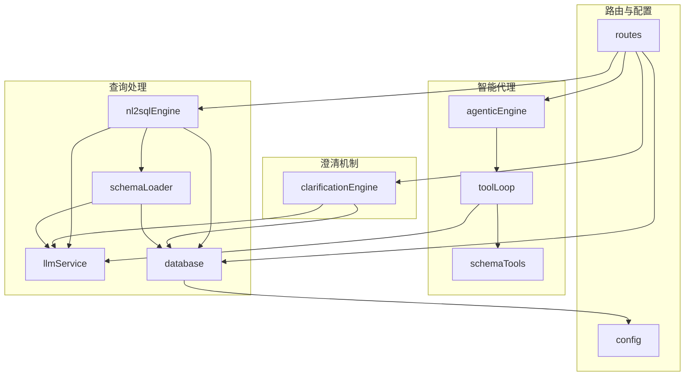
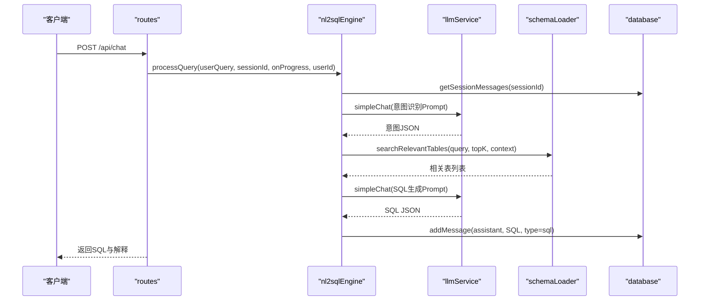
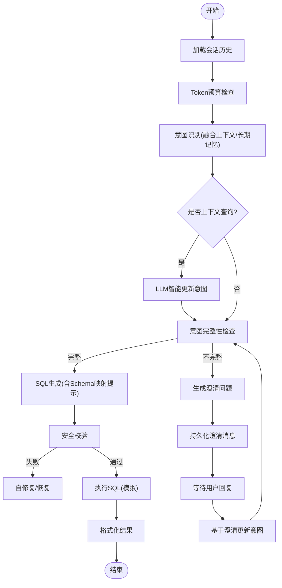
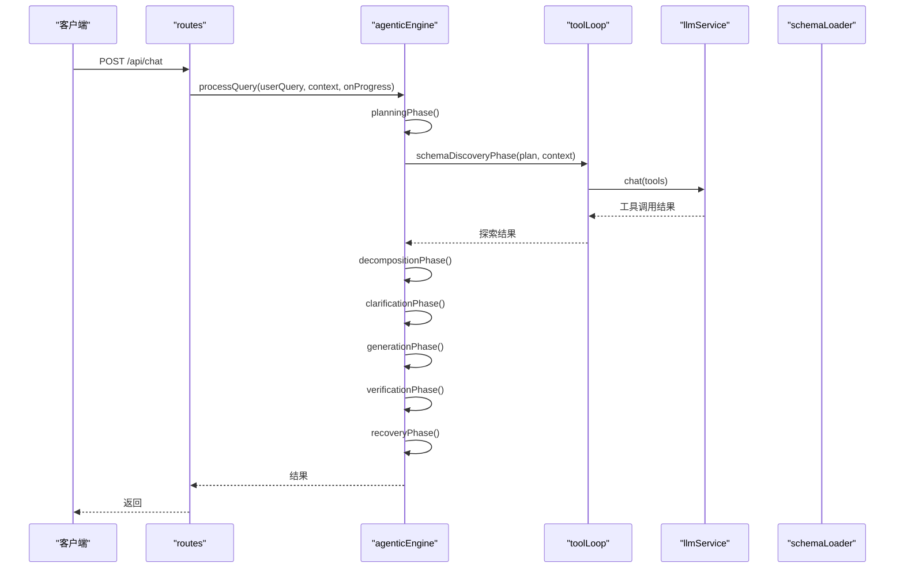
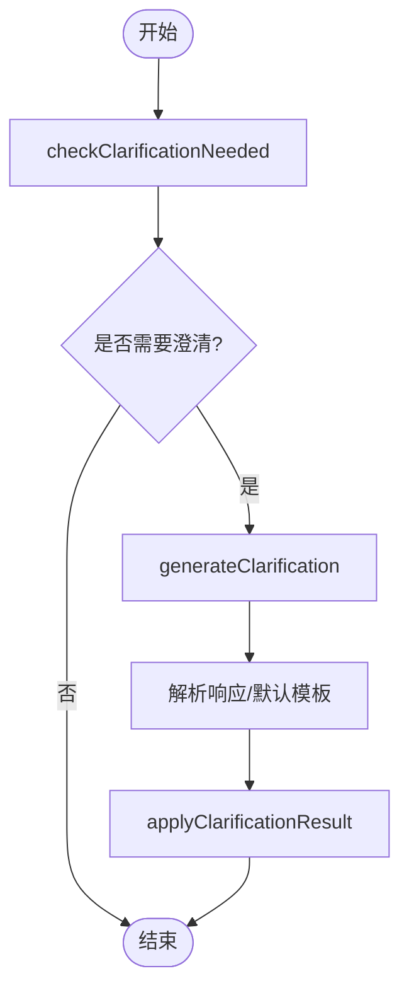
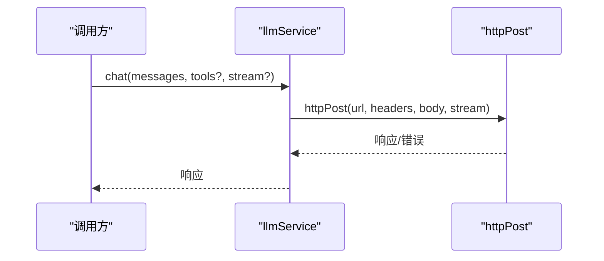
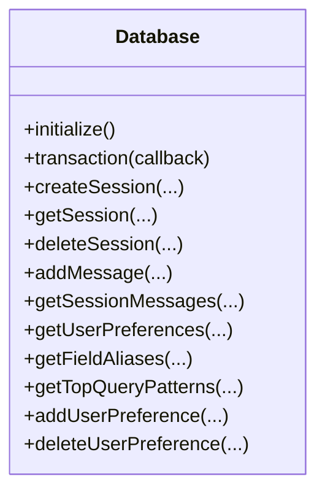
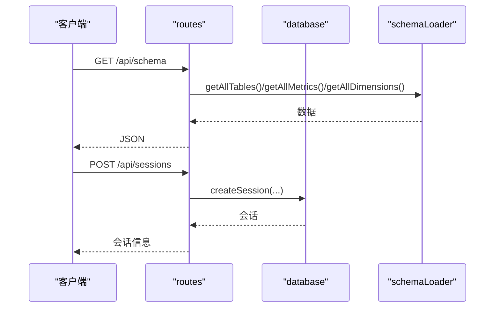
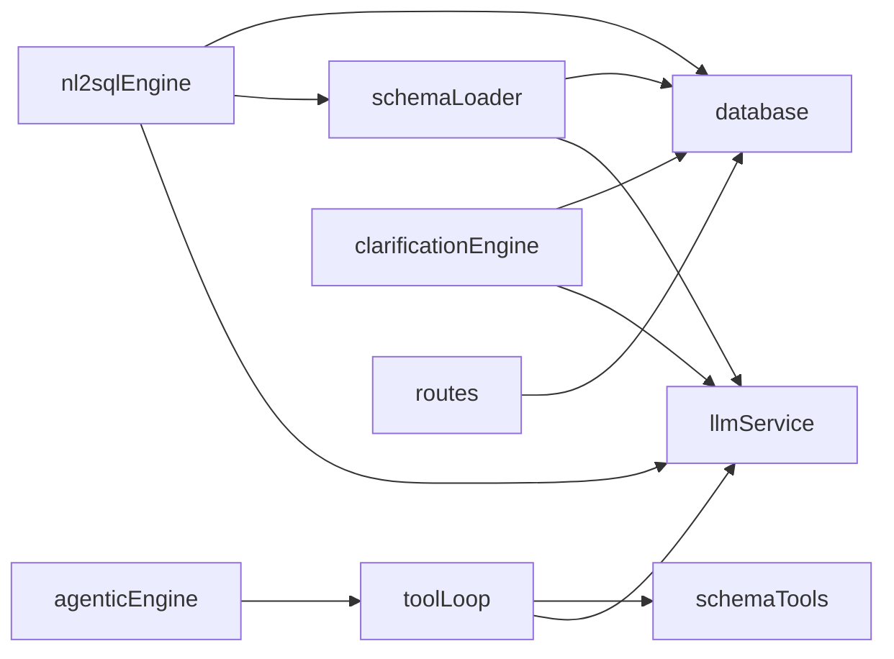

# 核心模块

<cite>
**本文引用的文件**
- [nl2sqlEngine.js](file://backend/src/core/nl2sqlEngine.js)
- [agenticEngine.js](file://backend/src/core/agenticEngine.js)
- [clarificationEngine.js](file://backend/src/core/clarificationEngine.js)
- [llmService.js](file://backend/src/core/llmService.js)
- [database.js](file://backend/src/core/database.js)
- [routes.js](file://backend/src/core/routes.js)
- [config.js](file://backend/src/core/config.js)
- [schemaLoader.js](file://backend/src/core/schemaLoader.js)
- [toolLoop.js](file://backend/src/core/toolLoop.js)
</cite>

## 目录
1. [简介](#简介)
2. [项目结构](#项目结构)
3. [核心组件](#核心组件)
4. [架构总览](#架构总览)
5. [详细组件分析](#详细组件分析)
6. [依赖分析](#依赖分析)
7. [性能考虑](#性能考虑)
8. [故障排查指南](#故障排查指南)
9. [结论](#结论)
10. [附录](#附录)

## 简介
本文件面向NL2SQL核心模块，系统梳理并解释以下关键能力：
- nl2sqlEngine查询引擎：自然语言到SQL的完整闭环，包含意图识别、澄清、SQL生成、执行、结果格式化与记忆学习。
- agenticEngine智能代理引擎：四阶段（规划→分解→澄清→生成/验证/恢复）的多步推理与自修复工作流。
- clarificationEngine澄清引擎：基于触发条件的智能澄清问题生成与应用。
- llmService语言模型服务：统一的LLM调用、重试、流式与非流式响应、Embedding向量获取。
- database数据库访问：SQLite持久化、消息与会话管理、用户偏好与长期记忆。
- routes路由管理：REST API端点、Schema查询、会话与偏好管理、评估接口。

目标是帮助读者理解模块职责、协作关系、数据流与扩展方式。

## 项目结构
后端核心位于 backend/src/core，围绕“查询处理”与“基础设施”两大维度组织：
- 查询处理链路：llmService → schemaLoader → nl2sqlEngine → database → routes
- 智能代理：agenticEngine → toolLoop → schemaTools → schemaLoader
- 澄清机制：clarificationEngine → llmService
- 配置中心：config.js
- 路由入口：routes.js

图表来源
- [routes.js](file://backend/src/core/routes.js)
- [nl2sqlEngine.js](file://backend/src/core/nl2sqlEngine.js)
- [agenticEngine.js](file://backend/src/core/agenticEngine.js)
- [clarificationEngine.js](file://backend/src/core/clarificationEngine.js)
- [llmService.js](file://backend/src/core/llmService.js)
- [schemaLoader.js](file://backend/src/core/schemaLoader.js)
- [toolLoop.js](file://backend/src/core/toolLoop.js)
- [config.js](file://backend/src/core/config.js)

章节来源
- [routes.js](file://backend/src/core/routes.js)
- [config.js](file://backend/src/core/config.js)

## 核心组件
- nl2sqlEngine：主导NL2SQL主流程，负责意图识别、实体解析、SQL生成、安全校验、执行与结果格式化，并集成长期记忆与对话历史压缩。
- agenticEngine：实现四阶段工作流，包含规划、Schema发现、动态意图分解、澄清、生成/验证/恢复，支持工具循环与语义层。
- clarificationEngine：定义澄清触发条件、生成澄清问题、应用用户回答，支撑上下文理解与默认选项确认。
- llmService：统一LLM调用、重试、流式/非流式响应、Embedding向量获取，封装HTTP请求与错误处理。
- database：SQLite持久化、会话与消息管理、用户偏好与长期记忆、查询历史、系统日志。
- routes：REST API路由，暴露Schema查询、会话管理、偏好管理、评估统计等接口。
- schemaLoader：Schema元数据加载、缓存、向量化、表搜索、SQL验证、摘要生成。
- toolLoop：工具循环执行器，驱动LLM与工具交互，支持意图识别与SQL生成阶段的Schema探索。

章节来源
- [nl2sqlEngine.js](file://backend/src/core/nl2sqlEngine.js)
- [agenticEngine.js](file://backend/src/core/agenticEngine.js)
- [clarificationEngine.js](file://backend/src/core/clarificationEngine.js)
- [llmService.js](file://backend/src/core/llmService.js)
- [database.js](file://backend/src/core/database.js)
- [routes.js](file://backend/src/core/routes.js)
- [schemaLoader.js](file://backend/src/core/schemaLoader.js)
- [toolLoop.js](file://backend/src/core/toolLoop.js)

## 架构总览
NL2SQL核心模块采用“服务化+模块化”的分层设计：
- 路由层(routes)：接收HTTP请求，编排核心引擎与数据库。
- 引擎层(nl2sqlEngine/agenticEngine/clarificationEngine)：业务逻辑与工作流编排。
- 基础设施层(llmService/database/schemaLoader/toolLoop)：能力复用与数据/模型服务。
- 配置层(config)：集中配置与校验。

图表来源
- [routes.js](file://backend/src/core/routes.js)
- [nl2sqlEngine.js](file://backend/src/core/nl2sqlEngine.js)
- [llmService.js](file://backend/src/core/llmService.js)
- [schemaLoader.js](file://backend/src/core/schemaLoader.js)
- [database.js](file://backend/src/core/database.js)

## 详细组件分析

### nl2sqlEngine 查询引擎
- 职责
  - 意图识别：融合上下文与长期记忆，抽取指标、维度、筛选条件、时间范围与置信度。
  - 实体解析：从模糊描述（如游戏名）解析为ID，支持长期记忆与数据库兜底。
  - 平台术语解析：将“新平台/老平台”映射到数据源标识。
  - 澄清生成：当意图不完整或置信度不足时，生成澄清问题与缺失槽位。
  - SQL生成：基于Schema与业务映射提示生成SQL，支持语义层与Schema映射提示。
  - 安全校验：禁止DDL/DML、限制查询行数、检查表存在性与关键字。
  - 执行与格式化：执行SQL（模拟）、格式化为自然语言回复。
  - 记忆学习：从澄清与上下文学习字段别名与用户偏好。
- 关键流程
  - 主流程：加载历史→Token预算检查→意图识别→上下文查询智能更新→完整性检查→澄清→SQL生成→验证→执行→格式化→持久化。
  - SQL生成：搜索相关表→生成Schema映射提示→构造系统提示词→LLM生成→解析→补全LIMIT。
- 错误与恢复
  - NL2SQLError统一错误类型与可恢复标记。
  - validateSQL安全校验，必要时返回needClarification。
- 与模块关系
  - 依赖 llmService、schemaLoader、database、tokenBudget、summarizer、longTermMemory、vectorStore。
  - 与 clarificationEngine 互补：前者负责生成澄清问题，后者负责应用澄清回答。

图表来源
- [nl2sqlEngine.js](file://backend/src/core/nl2sqlEngine.js)

章节来源
- [nl2sqlEngine.js](file://backend/src/core/nl2sqlEngine.js)

### agenticEngine 智能代理引擎
- 职责
  - 四阶段工作流：规划→Schema发现→动态意图分解→澄清→生成/验证/恢复。
  - 工具循环：在规划与Schema发现阶段使用工具探索Schema。
  - 自修复：根据错误分类（表不存在/语法错误）采取恢复策略。
- 关键流程
  - processQuery：按阶段推进，收集traceLog，支持进度回调。
  - 规划阶段：构建计划并解析风险。
  - Schema发现：使用工具循环或传统方式探索。
  - 动态分解：按数据单元拆解查询。
  - 澄清阶段：检查是否需要澄清并生成问题。
  - 生成/验证/恢复：生成SQL→验证→错误分类→恢复。
- 与模块关系
  - 依赖 llmService、schemaTools、schemaLoader、toolLoop、queryDecomposer、semanticLayer、clarificationEngine。
  - 与 nl2sqlEngine 的澄清阶段互补，提供更强的工具与语义层支持。

图表来源
- [agenticEngine.js](file://backend/src/core/agenticEngine.js)
- [toolLoop.js](file://backend/src/core/toolLoop.js)
- [schemaLoader.js](file://backend/src/core/schemaLoader.js)
- [llmService.js](file://backend/src/core/llmService.js)

章节来源
- [agenticEngine.js](file://backend/src/core/agenticEngine.js)
- [toolLoop.js](file://backend/src/core/toolLoop.js)

### clarificationEngine 澄清引擎
- 职责
  - 触发条件：数据单元无匹配表、表选择歧义、聚合来源不明确、时间粒度不明确、置信度过低。
  - 生成澄清：基于触发条件与候选表生成友好问题，包含默认选项与解释。
  - 应用澄清：根据澄清类型更新意图（表选择、指标来源、时间粒度）。
- 关键流程
  - checkClarificationNeeded：遍历触发器，按优先级返回最高优先级触发。
  - generateClarification：构造Prompt→LLM生成→解析→默认模板回退。
  - applyClarificationResult：按类型更新意图并记录澄清历史。

图表来源
- [clarificationEngine.js](file://backend/src/core/clarificationEngine.js)

章节来源
- [clarificationEngine.js](file://backend/src/core/clarificationEngine.js)

### llmService 语言模型服务
- 职责
  - 统一封装LLM调用：chat（支持流式/非流式）、simpleChat（单轮）、getEmbedding（向量）。
  - 重试机制：withRetry，支持最大重试次数与延迟。
  - HTTP请求：httpPost，支持超时、错误解析、响应截断检测。
  - 工具定义：createToolDefinition，辅助工具函数。
- 关键流程
  - chat：构造消息→调用API→withRetry→记录日志→返回响应。
  - simpleChat：构造messages→调用chat→提取内容。
  - getEmbedding：构造请求→withRetry→提取向量。
- 与模块关系
  - 被 nl2sqlEngine、agenticEngine、clarificationEngine、schemaLoader广泛使用。

图表来源
- [llmService.js](file://backend/src/core/llmService.js)

章节来源
- [llmService.js](file://backend/src/core/llmService.js)

### database 数据库访问
- 职责
  - SQLite持久化：sessions、messages、query_history、user_preferences、system_logs。
  - 会话管理：创建、查询、删除、更新标题、触碰时间。
  - 消息管理：添加消息、获取历史、metadata解析。
  - 用户偏好与长期记忆：添加、查询、更新使用统计、删除、模板与别名管理。
  - 查询历史：查询历史列表、统计信息。
  - 系统日志：记录日志与查询统计。
- 关键流程
  - initialize：创建表与索引、外键约束、迁移修复。
  - transaction：事务封装，保证一致性。
  - getUserPreferences/getFieldAliases：JSON字段解析与过滤。
- 与模块关系
  - 被 routes、nl2sqlEngine、agenticEngine、clarificationEngine、schemaLoader使用。

图表来源
- [database.js](file://backend/src/core/database.js)

章节来源
- [database.js](file://backend/src/core/database.js)

### routes 路由管理
- 职责
  - 健康检查：/api/health、/api/health/detail。
  - Schema接口：/api/schema、/api/schema/tables/:tableName、/api/schema/search。
  - 会话管理：/api/sessions、/api/sessions/:sessionId、/api/sessions/:sessionId/messages、/api/users/:userId/sessions。
  - 查询历史：/api/queries/history。
  - 用户偏好（长期记忆）：/api/preferences/:userId/raw、/api/preferences/:userId/stats、/api/preferences/:userId、/api/preferences/:userId/templates、/api/preferences/:preferenceId、/api/preferences/:userId/learn-alias。
  - 评估接口：/api/evaluation/stats、/api/evaluation/stats/reset、/api/evaluation/schema-quality。
- 关键流程
  - 中间件：请求日志记录。
  - Schema查询：按type返回tables/metrics/dimensions或全量。
  - 偏好管理：增删改查用户偏好与模板。
  - 评估统计：获取运行时统计与重置。

图表来源
- [routes.js](file://backend/src/core/routes.js)
- [schemaLoader.js](file://backend/src/core/schemaLoader.js)
- [database.js](file://backend/src/core/database.js)

章节来源
- [routes.js](file://backend/src/core/routes.js)

### schemaLoader Schema加载
- 职责
  - 加载Schema元数据：表、字段、关系、指标、维度。
  - 缓存与映射：构建表名/字段名映射，加速查询。
  - 向量化：将表级信息向量化并存储，支持智能搜索。
  - 搜索：语义搜索（向量）与关键词匹配，支持上下文增强（game_id、datasource）。
  - 验证：SQL关键字与白名单校验。
  - 摘要：生成Schema摘要用于Prompt。
- 关键流程
  - load：校验→构建映射→向量化（可选）。
  - searchRelevantTables：增强查询→向量搜索→上下文优先→返回表定义。
  - validateSQL：禁止关键字与白名单检查。
- 与模块关系
  - 被 nl2sqlEngine、agenticEngine、toolLoop、routes广泛使用。

章节来源
- [schemaLoader.js](file://backend/src/core/schemaLoader.js)

### toolLoop 工具循环
- 职责
  - 在LLM与工具之间建立循环：LLM→工具调用→工具执行→结果回传→继续循环。
  - 支持工具：search_tables、describe_table、search_knowledge、peek_table。
  - 用于意图识别与SQL生成阶段的Schema探索。
- 关键流程
  - executeToolLoop：构建初始消息→循环调用LLM→解析工具调用→执行→记录日志→返回最终内容。
  - buildSystemPrompt：根据是否使用Level 1索引生成系统提示词。
- 与模块关系
  - 被 agenticEngine、schemaTools、schemaLoader配合使用。

章节来源
- [toolLoop.js](file://backend/src/core/toolLoop.js)

## 依赖分析
- 模块耦合
  - nl2sqlEngine 依赖 llmService、schemaLoader、database、tokenBudget、summarizer、longTermMemory、vectorStore。
  - agenticEngine 依赖 llmService、schemaTools、schemaLoader、toolLoop、queryDecomposer、semanticLayer、clarificationEngine。
  - clarificationEngine 依赖 llmService、database。
  - routes 依赖 database、schemaLoader、sseHandler、evaluation。
  - schemaLoader 依赖 llmService、vectorStore、config。
  - toolLoop 依赖 llmService、schemaTools、schemaLoader。
- 外部依赖
  - LLM API（OpenAI兼容）、SQLite、LanceDB向量库。
- 循环依赖
  - 未见直接循环依赖；模块间通过接口与配置解耦。

图表来源
- [nl2sqlEngine.js](file://backend/src/core/nl2sqlEngine.js)
- [agenticEngine.js](file://backend/src/core/agenticEngine.js)
- [clarificationEngine.js](file://backend/src/core/clarificationEngine.js)
- [llmService.js](file://backend/src/core/llmService.js)
- [schemaLoader.js](file://backend/src/core/schemaLoader.js)
- [toolLoop.js](file://backend/src/core/toolLoop.js)
- [routes.js](file://backend/src/core/routes.js)
- [database.js](file://backend/src/core/database.js)

章节来源
- [nl2sqlEngine.js](file://backend/src/core/nl2sqlEngine.js)
- [agenticEngine.js](file://backend/src/core/agenticEngine.js)
- [clarificationEngine.js](file://backend/src/core/clarificationEngine.js)
- [llmService.js](file://backend/src/core/llmService.js)
- [schemaLoader.js](file://backend/src/core/schemaLoader.js)
- [toolLoop.js](file://backend/src/core/toolLoop.js)
- [routes.js](file://backend/src/core/routes.js)
- [database.js](file://backend/src/core/database.js)

## 性能考虑
- Prompt优化
  - nl2sqlEngine：仅传递核心表名列表，避免超长Prompt；SQL生成阶段使用精简Schema输出。
  - agenticEngine：使用工具循环减少一次性上下文压力。
- 向量化与缓存
  - schemaLoader：表级向量化与增量更新，避免全量重建；缓存Schema映射与摘要。
- Token预算与压缩
  - nl2sqlEngine：Token预算检查与对话历史压缩，降低上下文成本。
- 数据库与I/O
  - database：批量查询、事务封装、索引优化；SQLite适合轻量部署。
- LLM调用
  - llmService：重试与超时控制；Embedding请求单独超时配置。

## 故障排查指南
- LLM调用失败
  - 检查 LLM_API_BASE、LLM_API_KEY、LLM_MODEL、LLM_TIMEOUT 等配置。
  - 查看 llmService 的重试日志与超时错误。
- SQL生成失败
  - 检查 nl2sqlEngine 的 needClarification 返回与 missingSlots。
  - 确认 schemaLoader 的表存在性与字段映射。
- 数据库连接问题
  - 检查 database.initialize 是否成功，外键约束是否启用。
  - 确认 DB_PATH 与权限。
- 路由返回错误
  - 查看 routes 的错误响应与状态码，定位具体模块（database/schemaLoader/evaluation）。
- 配置校验
  - 启动时调用 config.validate，确保必要配置已设置。

章节来源
- [llmService.js](file://backend/src/core/llmService.js)
- [database.js](file://backend/src/core/database.js)
- [routes.js](file://backend/src/core/routes.js)
- [config.js](file://backend/src/core/config.js)

## 结论
NL2SQL核心模块通过清晰的分层与模块化设计，实现了从自然语言到SQL的稳健转换，并在以下方面具备优势：
- 意图识别与澄清机制：兼顾上下文理解与用户习惯，降低歧义。
- 工具循环与语义层：增强Schema探索与业务概念映射。
- 安全与恢复：严格的SQL校验与自修复策略。
- 可扩展性：统一的配置中心与模块接口，便于新增功能与行为修改。

## 附录

### 模块接口使用示例（路径指引）
- 调用LLM进行意图识别
  - [llmService.simpleChat](file://backend/src/core/llmService.js)
- 生成SQL
  - [nl2sqlEngine.generateSQL](file://backend/src/core/nl2sqlEngine.js)
- 获取Schema
  - [schemaLoader.searchRelevantTables](file://backend/src/core/schemaLoader.js)
- 创建会话
  - [database.createSession](file://backend/src/core/database.js)
- 获取用户偏好
  - [database.getUserPreferences](file://backend/src/core/database.js)
- 生成澄清问题
  - [clarificationEngine.generateClarification](file://backend/src/core/clarificationEngine.js)
- 工具循环执行
  - [toolLoop.executeToolLoop](file://backend/src/core/toolLoop.js)

### 扩展指南
- 新增核心功能模块
  - 在 core 下新建模块，遵循单一职责；通过 config.js 暴露配置；在 routes.js 中添加路由；在 nl2sqlEngine/agenticEngine 中集成。
- 修改现有模块行为
  - 通过 featureFlags 控制功能开关（如 TOOL_LOOP_MODE、CLARIFICATION_ENGINE、BUSINESS_SEMANTIC_LAYER）。
  - 调整 schemaLoader 的向量化策略或搜索算法。
  - 在 llmService 中调整重试策略或超时参数。
- 集成新工具
  - 在 schemaTools 定义工具→在 toolLoop 中注册工具→在 agenticEngine 中启用工具循环。