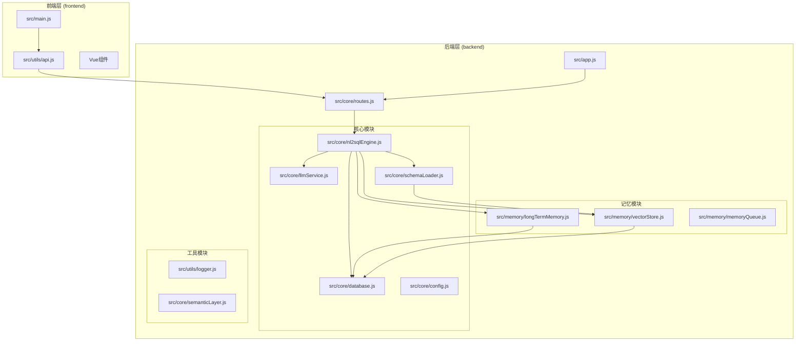
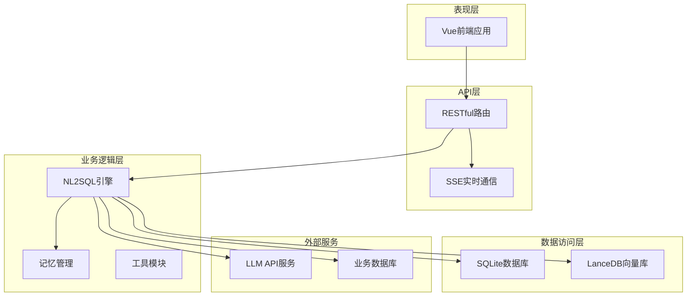
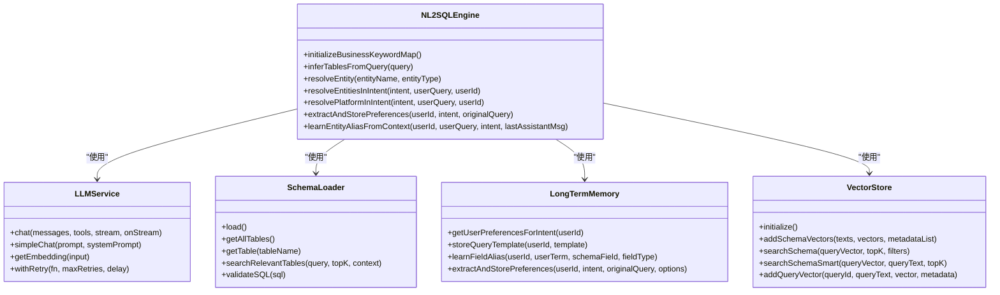
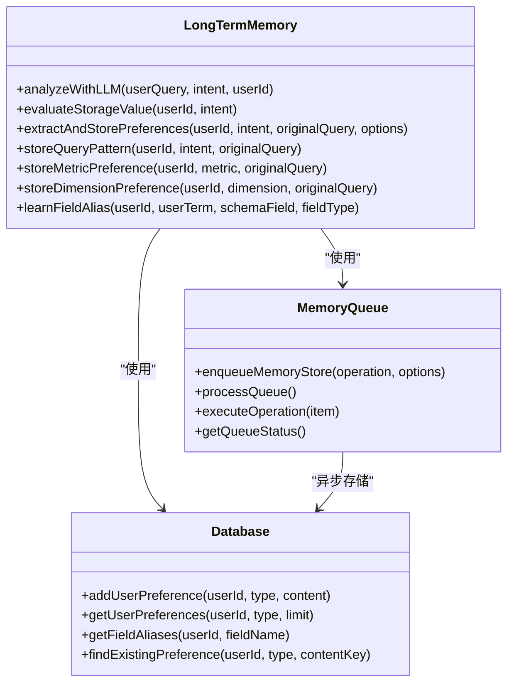
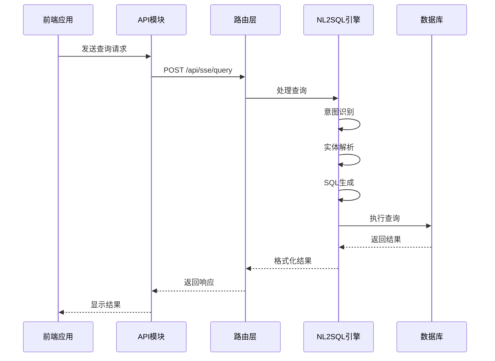
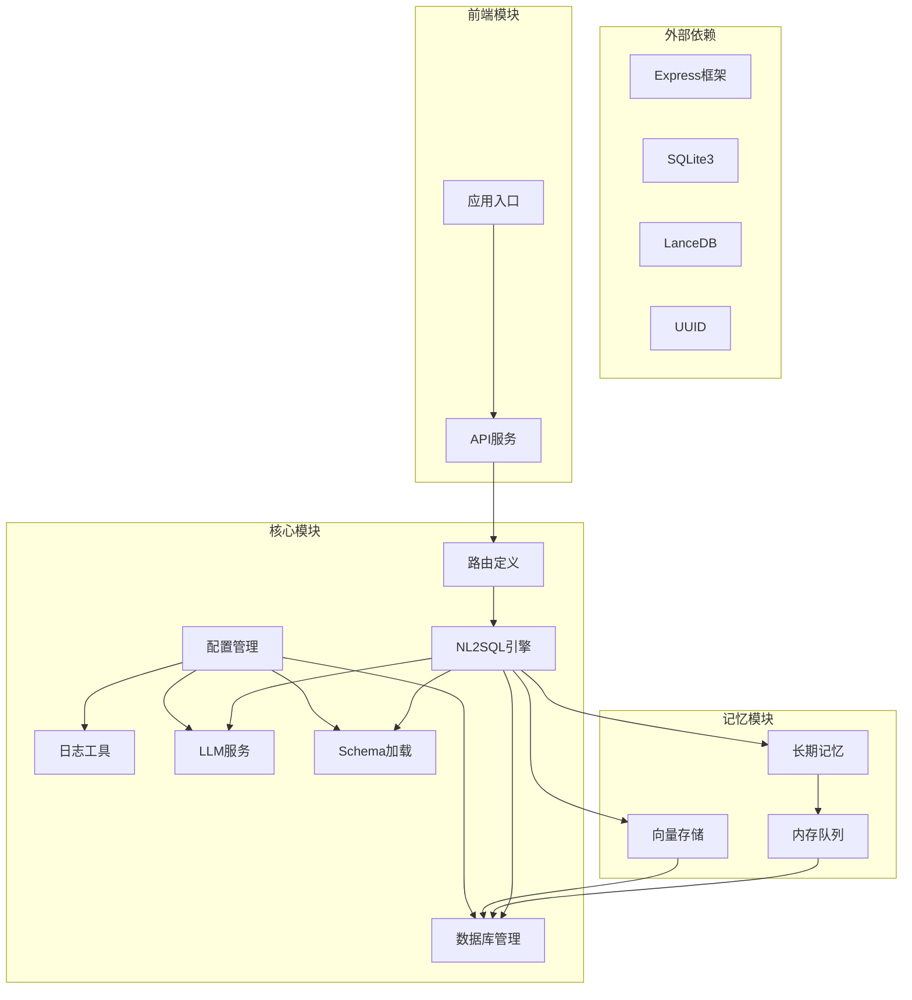
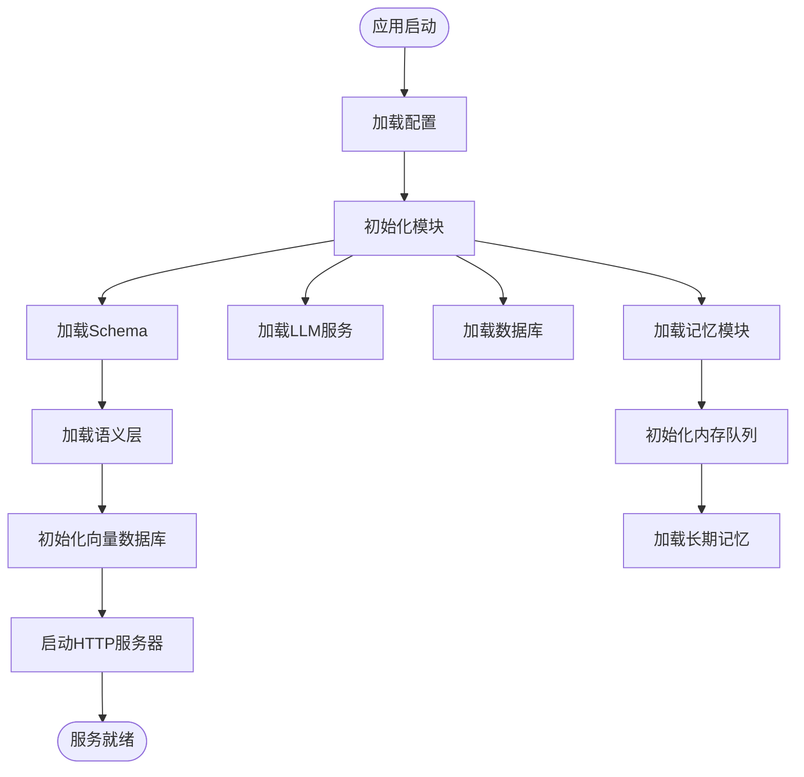
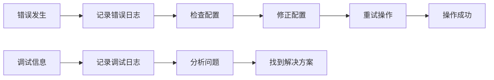

# 模块依赖关系

<cite>
**本文档引用的文件**
- [backend/src/app.js](file://backend/src/app.js)
- [backend/src/core/routes.js](file://backend/src/core/routes.js)
- [backend/src/core/nl2sqlEngine.js](file://backend/src/core/nl2sqlEngine.js)
- [backend/src/core/llmService.js](file://backend/src/core/llmService.js)
- [backend/src/core/schemaLoader.js](file://backend/src/core/schemaLoader.js)
- [backend/src/core/database.js](file://backend/src/core/database.js)
- [backend/src/core/config.js](file://backend/src/core/config.js)
- [backend/src/memory/longTermMemory.js](file://backend/src/memory/longTermMemory.js)
- [backend/src/memory/vectorStore.js](file://backend/src/memory/vectorStore.js)
- [backend/src/memory/memoryQueue.js](file://backend/src/memory/memoryQueue.js)
- [backend/src/utils/logger.js](file://backend/src/utils/logger.js)
- [backend/src/core/semanticLayer.js](file://backend/src/core/semanticLayer.js)
- [backend/package.json](file://backend/package.json)
- [frontend/src/main.js](file://frontend/src/main.js)
- [frontend/src/utils/api.js](file://frontend/src/utils/api.js)
- [frontend/package.json](file://frontend/package.json)
</cite>

## 目录
1. [简介](#简介)
2. [项目结构](#项目结构)
3. [核心组件](#核心组件)
4. [架构概览](#架构概览)
5. [详细组件分析](#详细组件分析)
6. [依赖分析](#依赖分析)
7. [性能考虑](#性能考虑)
8. [故障排除指南](#故障排除指南)
9. [结论](#结论)

## 简介

NL2SQL模块是一个基于自然语言到SQL转换的智能查询系统，采用前后端分离架构设计。该项目实现了从自然语言理解到SQL生成的完整流程，包括意图识别、实体解析、SQL生成、验证和结果格式化等功能。

系统采用模块化设计，将核心功能分解为独立的模块，每个模块都有明确的职责边界和清晰的接口契约。后端使用Node.js + Express构建RESTful API服务，前端使用Vue.js提供用户界面。

## 项目结构

项目采用典型的三层架构设计：

**图表来源**
- [backend/src/app.js:1-260](file://backend/src/app.js#L1-L260)
- [backend/src/core/routes.js:1-1037](file://backend/src/core/routes.js#L1-L1037)

**章节来源**
- [backend/src/app.js:1-260](file://backend/src/app.js#L1-L260)
- [frontend/src/main.js:1-89](file://frontend/src/main.js#L1-L89)

## 核心组件

### 后端核心模块

#### 应用入口模块 (app.js)
应用入口模块负责整个服务的启动和初始化，包括环境变量加载、模块初始化、服务器启动等。

#### 路由模块 (routes.js)
路由模块定义了所有RESTful API端点，包括健康检查、Schema查询、会话管理、查询历史、用户偏好等接口。

#### NL2SQL引擎 (nl2sqlEngine.js)
NL2SQL引擎是系统的核心，实现了自然语言到SQL的完整转换流程，包括意图识别、实体解析、SQL生成、验证等功能。

#### LLM服务 (llmService.js)
LLM服务模块负责与外部大语言模型API通信，提供聊天、嵌入向量生成等能力。

#### Schema加载器 (schemaLoader.js)
Schema加载器负责加载和管理数据库表结构定义，提供Schema查询、匹配和验证功能。

### 记忆模块

#### 长期记忆 (longTermMemory.js)
长期记忆模块负责用户偏好和查询模式的提取、存储和管理，支持字段别名学习、查询模板存储等功能。

#### 向量存储 (vectorStore.js)
向量存储模块基于LanceDB实现向量数据库，支持Schema信息和查询历史的向量化存储和语义检索。

#### 内存队列 (memoryQueue.js)
内存队列模块提供异步记忆存储功能，通过队列机制避免阻塞主流程。

### 工具模块

#### 日志模块 (logger.js)
日志模块提供统一的日志记录功能，支持多级别日志、文件输出、结构化日志格式等。

#### 配置模块 (config.js)
配置模块统一管理应用的所有配置项，从环境变量读取并提供默认值。

**章节来源**
- [backend/src/core/nl2sqlEngine.js:1-800](file://backend/src/core/nl2sqlEngine.js#L1-L800)
- [backend/src/memory/longTermMemory.js:1-800](file://backend/src/memory/longTermMemory.js#L1-L800)
- [backend/src/memory/vectorStore.js:1-800](file://backend/src/memory/vectorStore.js#L1-L800)

## 架构概览

系统采用分层架构设计，各层之间通过明确定义的接口进行通信：

**图表来源**
- [backend/src/core/routes.js:1-1037](file://backend/src/core/routes.js#L1-L1037)
- [backend/src/core/nl2sqlEngine.js:1-800](file://backend/src/core/nl2sqlEngine.js#L1-L800)

## 详细组件分析

### NL2SQL引擎组件分析

NL2SQL引擎是系统的核心组件，实现了完整的自然语言到SQL转换流程：

**图表来源**
- [backend/src/core/nl2sqlEngine.js:1-800](file://backend/src/core/nl2sqlEngine.js#L1-L800)
- [backend/src/core/llmService.js:1-477](file://backend/src/core/llmService.js#L1-L477)
- [backend/src/core/schemaLoader.js:1-800](file://backend/src/core/schemaLoader.js#L1-L800)
- [backend/src/memory/longTermMemory.js:1-800](file://backend/src/memory/longTermMemory.js#L1-L800)
- [backend/src/memory/vectorStore.js:1-800](file://backend/src/memory/vectorStore.js#L1-L800)

#### NL2SQL引擎核心功能

1. **业务关键词映射**: 从配置文件动态加载业务关键词到表的映射关系
2. **实体解析**: 将用户查询中的模糊描述映射到具体ID
3. **意图识别**: 理解用户查询的业务意图和需求
4. **SQL生成**: 生成符合数据库结构的SQL语句
5. **记忆学习**: 从用户交互中学习偏好和习惯

**章节来源**
- [backend/src/core/nl2sqlEngine.js:1-800](file://backend/src/core/nl2sqlEngine.js#L1-L800)

### 记忆模块组件分析

记忆模块实现了用户长期记忆的管理功能：

**图表来源**
- [backend/src/memory/longTermMemory.js:1-800](file://backend/src/memory/longTermMemory.js#L1-L800)
- [backend/src/memory/memoryQueue.js:1-217](file://backend/src/memory/memoryQueue.js#L1-L217)
- [backend/src/core/database.js:1-800](file://backend/src/core/database.js#L1-L800)

#### 记忆模块核心功能

1. **偏好提取**: 从用户查询中提取个人偏好和习惯
2. **模板存储**: 存储常用的查询模式和模板
3. **别名学习**: 学习用户使用的字段别名映射
4. **异步存储**: 通过队列机制异步存储记忆数据

**章节来源**
- [backend/src/memory/longTermMemory.js:1-800](file://backend/src/memory/longTermMemory.js#L1-L800)
- [backend/src/memory/memoryQueue.js:1-217](file://backend/src/memory/memoryQueue.js#L1-L217)

### 前后端通信机制

前端通过API模块与后端进行通信：

**图表来源**
- [frontend/src/utils/api.js:1-303](file://frontend/src/utils/api.js#L1-L303)
- [backend/src/core/routes.js:1-1037](file://backend/src/core/routes.js#L1-L1037)

**章节来源**
- [frontend/src/utils/api.js:1-303](file://frontend/src/utils/api.js#L1-L303)
- [frontend/src/main.js:1-89](file://frontend/src/main.js#L1-L89)

## 依赖分析

### 模块依赖关系图

**图表来源**
- [backend/package.json:1-28](file://backend/package.json#L1-L28)
- [frontend/package.json:1-36](file://frontend/package.json#L1-L36)

### 模块耦合关系

系统采用了松耦合的设计原则：

1. **核心模块与工具模块**: 核心业务逻辑通过接口依赖工具模块，避免直接依赖具体实现
2. **记忆模块与核心模块**: 记忆模块通过接口与核心模块交互，支持可插拔的记忆策略
3. **前端与后端**: 通过RESTful API进行通信，前端不直接依赖后端实现细节

### 依赖注入和模块加载

系统采用动态模块加载的方式：

**图表来源**
- [backend/src/app.js:97-188](file://backend/src/app.js#L97-L188)

**章节来源**
- [backend/src/app.js:97-188](file://backend/src/app.js#L97-L188)
- [backend/src/core/config.js:1-398](file://backend/src/core/config.js#L1-L398)

## 性能考虑

### 异步处理机制

系统通过多种异步处理机制提升性能：

1. **内存队列**: 记忆存储操作通过队列异步处理，避免阻塞主流程
2. **批量处理**: 向量存储和记忆操作采用批量处理提高效率
3. **并行执行**: 多个存储操作可以并行执行

### 缓存策略

1. **Schema缓存**: Schema元数据加载后进行缓存，减少重复加载开销
2. **向量缓存**: 向量数据库中的向量数据进行缓存，提升查询性能
3. **配置缓存**: 配置信息进行缓存，避免频繁读取环境变量

### 资源管理

1. **数据库连接池**: 使用连接池管理数据库连接，提高连接复用率
2. **内存管理**: 合理的内存使用策略，避免内存泄漏
3. **文件系统**: 数据文件存储在本地磁盘，支持持久化存储

## 故障排除指南

### 常见问题诊断

1. **LLM API连接失败**
   - 检查API密钥配置
   - 验证网络连接
   - 查看超时设置

2. **数据库连接问题**
   - 检查数据库文件路径
   - 验证SQLite权限
   - 查看迁移日志

3. **向量数据库初始化失败**
   - 检查LanceDB安装
   - 验证存储路径权限
   - 查看向量维度配置

### 日志分析

系统提供了完整的日志记录机制：

**图表来源**
- [backend/src/utils/logger.js:1-442](file://backend/src/utils/logger.js#L1-L442)

**章节来源**
- [backend/src/utils/logger.js:1-442](file://backend/src/utils/logger.js#L1-L442)

## 结论

NL2SQL模块展现了良好的模块化设计和架构组织。系统通过清晰的模块划分、明确的接口契约和松耦合的依赖关系，实现了自然语言到SQL的智能转换功能。

主要特点包括：

1. **模块化设计**: 每个模块都有明确的职责和边界
2. **可扩展性**: 支持插件化的功能扩展
3. **性能优化**: 采用异步处理、缓存策略等优化手段
4. **可靠性**: 完善的错误处理和日志记录机制
5. **易维护性**: 清晰的代码结构和文档

该架构为后续的功能扩展和性能优化奠定了良好的基础，适合在生产环境中部署和使用。