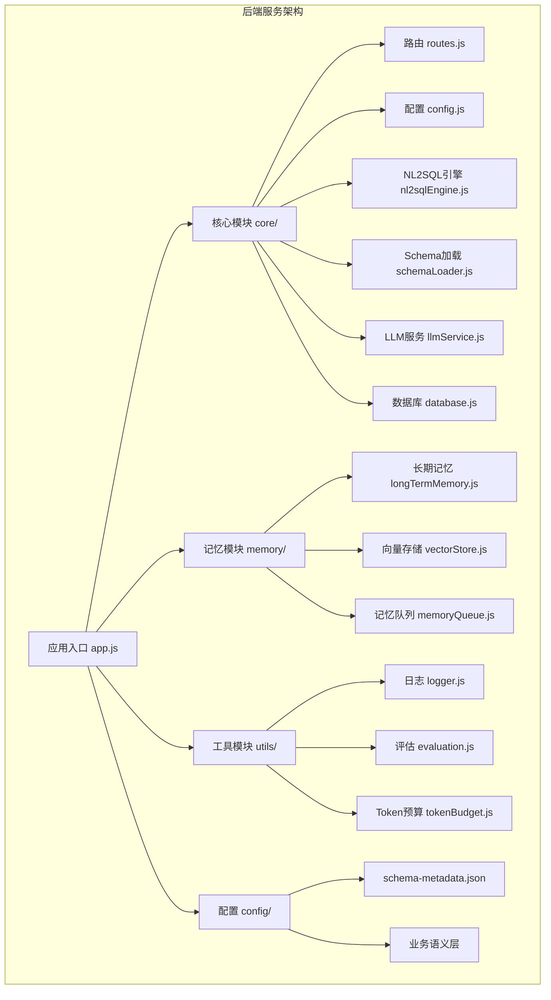
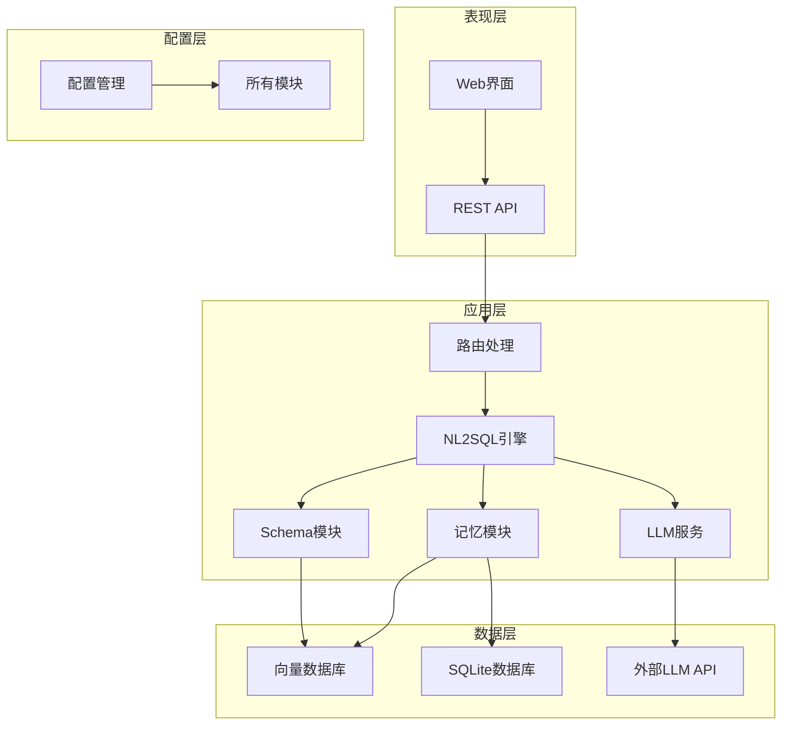
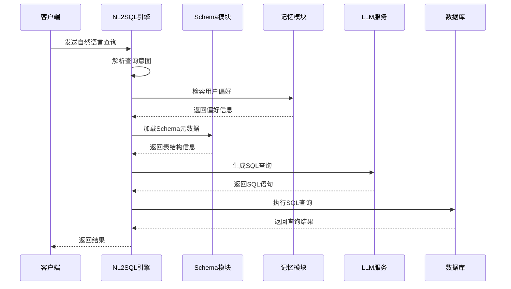
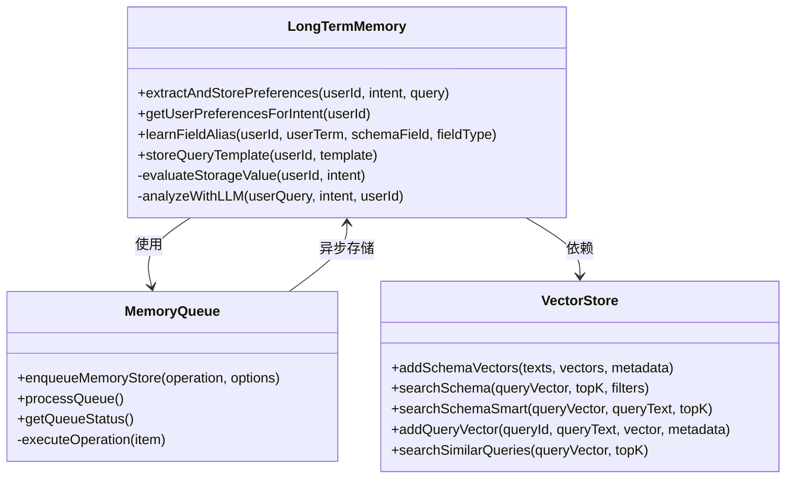
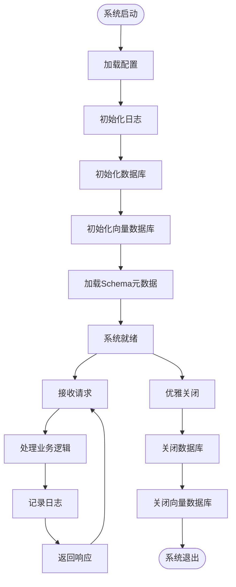
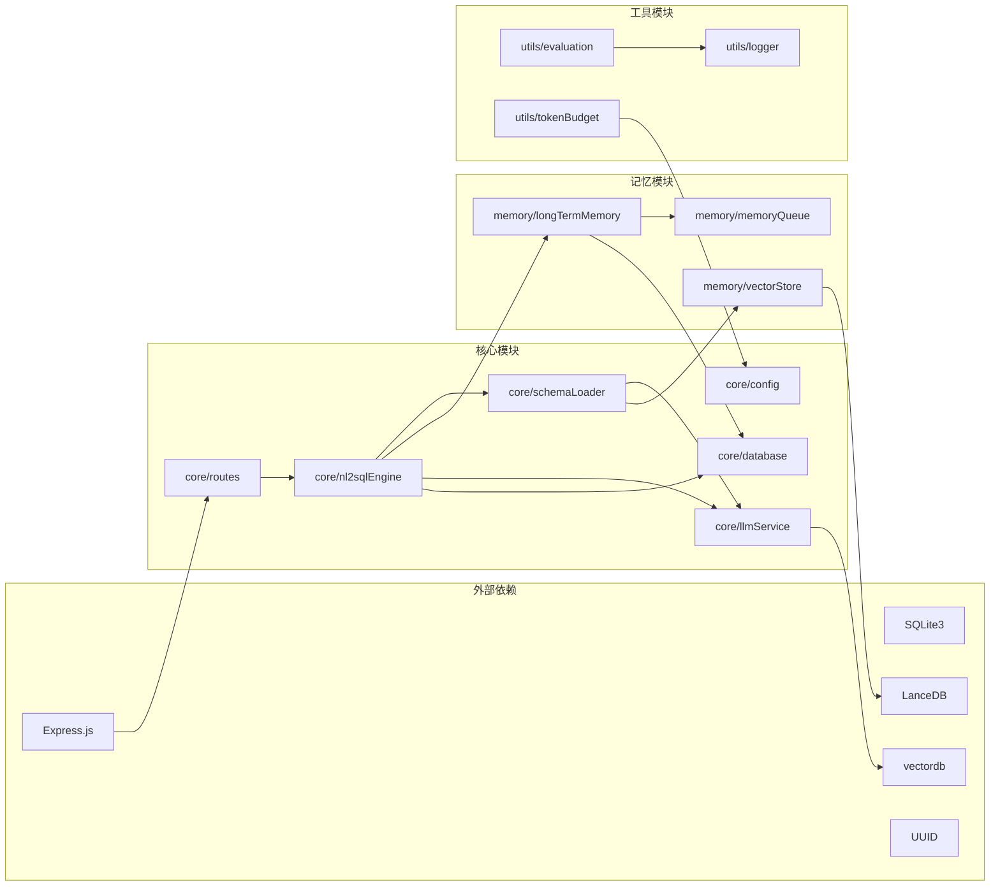

# 模块组织与职责划分

<cite>
**本文档引用的文件**
- [app.js](file://backend/src/app.js)
- [routes.js](file://backend/src/core/routes.js)
- [config.js](file://backend/src/core/config.js)
- [nl2sqlEngine.js](file://backend/src/core/nl2sqlEngine.js)
- [schemaLoader.js](file://backend/src/core/schemaLoader.js)
- [llmService.js](file://backend/src/core/llmService.js)
- [database.js](file://backend/src/core/database.js)
- [longTermMemory.js](file://backend/src/memory/longTermMemory.js)
- [vectorStore.js](file://backend/src/memory/vectorStore.js)
- [memoryQueue.js](file://backend/src/memory/memoryQueue.js)
- [logger.js](file://backend/src/utils/logger.js)
- [evaluation.js](file://backend/src/utils/evaluation.js)
- [tokenBudget.js](file://backend/src/utils/tokenBudget.js)
- [schema-metadata.json](file://backend/config/schema-metadata.json)
- [package.json](file://backend/package.json)
</cite>

## 目录
1. [简介](#简介)
2. [项目结构](#项目结构)
3. [核心组件](#核心组件)
4. [架构概览](#架构概览)
5. [详细组件分析](#详细组件分析)
6. [依赖分析](#依赖分析)
7. [性能考量](#性能考量)
8. [故障排查指南](#故障排查指南)
9. [结论](#结论)

## 简介

NL2SQL项目是一个基于自然语言到SQL转换的智能查询服务系统。该项目采用模块化设计理念，将功能划分为清晰的层次结构，实现了高内聚、低耦合的架构设计。

本项目的核心目标是提供一个可扩展、可维护的NL2SQL解决方案，支持：
- 自然语言到SQL的智能转换
- 语义检索和向量数据库支持
- 用户长期记忆和偏好管理
- 上下文管理和Token预算控制
- 评估和监控功能

## 项目结构

项目采用基于功能域的模块化组织方式，主要分为四个核心模块：

**图表来源**
- [app.js:1-260](file://backend/src/app.js#L1-L260)
- [routes.js:1-800](file://backend/src/core/routes.js#L1-L800)

**章节来源**
- [app.js:1-260](file://backend/src/app.js#L1-L260)
- [package.json:1-28](file://backend/package.json#L1-L28)

## 核心组件

### 核心模块 (core/)
核心模块是整个NL2SQL系统的核心引擎，负责处理主要的业务逻辑：

**NL2SQL引擎 (nl2sqlEngine.js)**
- 自然语言到SQL转换的核心算法
- 意图识别和澄清机制
- 实体解析和映射
- SQL验证和安全检查

**Schema加载器 (schemaLoader.js)**
- Schema元数据的加载和管理
- 语义搜索和表匹配
- 向量数据库集成
- SQL验证功能

**LLM服务 (llmService.js)**
- 与外部LLM API的通信
- Embedding向量生成
- 请求重试和错误处理
- 流式响应支持

**数据库管理 (database.js)**
- SQLite数据库的初始化和连接
- 会话和消息的持久化
- 用户偏好的存储和查询
- 事务管理和数据迁移

### 记忆模块 (memory/)
记忆模块负责用户长期记忆和偏好管理：

**长期记忆 (longTermMemory.js)**
- 用户查询模式的提取和存储
- 字段别名的学习和管理
- 指标和维度偏好的维护
- LLM智能分析功能

**向量存储 (vectorStore.js)**
- LanceDB向量数据库的封装
- Schema信息的向量化存储
- 语义相似度搜索
- 查询历史的向量化

**记忆队列 (memoryQueue.js)**
- 异步记忆存储的队列管理
- 批量处理和并发控制
- 错误处理和重试机制

### 工具模块 (utils/)
工具模块提供系统运行所需的基础设施：

**日志系统 (logger.js)**
- 多级别日志记录
- 控制台和文件输出
- 执行流程追踪
- 结构化日志格式

**评估系统 (evaluation.js)**
- 向量化质量评估
- 记忆命中率统计
- 运行时性能监控
- 测试数据集管理

**Token预算 (tokenBudget.js)**
- 上下文Token计算
- 预算控制和超限处理
- 上下文压缩和裁剪
- 预算配置管理

**章节来源**
- [nl2sqlEngine.js:1-800](file://backend/src/core/nl2sqlEngine.js#L1-L800)
- [schemaLoader.js:1-800](file://backend/src/core/schemaLoader.js#L1-L800)
- [longTermMemory.js:1-800](file://backend/src/memory/longTermMemory.js#L1-L800)
- [vectorStore.js:1-800](file://backend/src/memory/vectorStore.js#L1-L800)
- [logger.js:1-442](file://backend/src/utils/logger.js#L1-L442)

## 架构概览

NL2SQL系统采用分层架构设计，实现了清晰的关注点分离：

**图表来源**
- [app.js:97-188](file://backend/src/app.js#L97-L188)
- [routes.js:1-800](file://backend/src/core/routes.js#L1-L800)

系统的主要特点：
- **模块化设计**：每个模块都有明确的职责边界
- **依赖注入**：通过配置文件集中管理依赖关系
- **异步处理**：大量使用Promise和async/await模式
- **错误处理**：完善的异常捕获和错误恢复机制
- **监控和日志**：全面的系统监控和日志记录

## 详细组件分析

### NL2SQL引擎组件分析

NL2SQL引擎是整个系统的核心，负责处理自然语言到SQL的转换过程：

**图表来源**
- [nl2sqlEngine.js:1-800](file://backend/src/core/nl2sqlEngine.js#L1-L800)
- [longTermMemory.js:1-800](file://backend/src/memory/longTermMemory.js#L1-L800)
- [schemaLoader.js:1-800](file://backend/src/core/schemaLoader.js#L1-L800)

**组件职责划分**：
- **意图识别**：解析用户查询的业务意图
- **实体解析**：识别和映射业务实体
- **SQL生成**：基于Schema和意图生成SQL
- **结果处理**：格式化查询结果

**接口设计原则**：
- **单一职责**：每个函数只负责一个明确的功能
- **参数验证**：严格的输入参数验证和错误处理
- **返回标准化**：统一的返回格式和错误码
- **异步优先**：优先使用异步API避免阻塞

### 记忆模块组件分析

记忆模块实现了用户长期记忆和偏好管理功能：

**图表来源**
- [longTermMemory.js:1-800](file://backend/src/memory/longTermMemory.js#L1-L800)
- [memoryQueue.js:1-217](file://backend/src/memory/memoryQueue.js#L1-L217)
- [vectorStore.js:1-800](file://backend/src/memory/vectorStore.js#L1-L800)

**模块扩展指南**：
1. **新记忆类型**：在`PREFERENCE_TYPES`中添加新类型
2. **存储策略**：在`extractAndStorePreferences`中添加新策略
3. **检索算法**：在`vectorStore.js`中实现新的搜索算法
4. **评估指标**：在`evaluation.js`中添加新的评估方法

### 工具模块组件分析

工具模块提供了系统运行所需的基础设施：

**图表来源**
- [app.js:97-188](file://backend/src/app.js#L97-L188)
- [logger.js:1-442](file://backend/src/utils/logger.js#L1-L442)
- [database.js:1-800](file://backend/src/core/database.js#L1-L800)

**章节来源**
- [config.js:1-398](file://backend/src/core/config.js#L1-L398)
- [logger.js:1-442](file://backend/src/utils/logger.js#L1-L442)
- [evaluation.js:1-488](file://backend/src/utils/evaluation.js#L1-L488)

## 依赖分析

NL2SQL系统的依赖关系体现了清晰的分层架构：

**图表来源**
- [package.json:10-27](file://backend/package.json#L10-L27)
- [app.js:38-50](file://backend/src/app.js#L38-L50)

**依赖管理策略**：
- **版本锁定**：使用package.json锁定依赖版本
- **安全更新**：定期更新安全补丁版本
- **性能优化**：选择高性能的替代库
- **向后兼容**：确保依赖库的向后兼容性

**章节来源**
- [package.json:10-27](file://backend/package.json#L10-L27)
- [app.js:38-50](file://backend/src/app.js#L38-L50)

## 性能考量

NL2SQL系统在设计时充分考虑了性能优化：

### 异步处理和并发控制
- **Promise链式调用**：避免回调地狱，提高代码可读性
- **并发限制**：通过内存队列控制同时处理的记忆存储数量
- **批量处理**：向量数据库操作采用批量处理提高效率

### 缓存策略
- **Schema缓存**：Schema元数据的内存缓存
- **向量缓存**：向量数据库的增量更新
- **配置缓存**：配置信息的热更新支持

### 资源管理
- **连接池**：数据库连接池管理
- **内存监控**：实时监控内存使用情况
- **垃圾回收**：及时释放不再使用的资源

## 故障排查指南

### 常见问题诊断

**启动失败**
1. 检查环境变量配置
2. 验证数据库文件权限
3. 确认端口未被占用

**向量数据库问题**
1. 检查LanceDB安装状态
2. 验证向量维度配置
3. 确认磁盘空间充足

**LLM API错误**
1. 验证API密钥有效性
2. 检查网络连接状态
3. 确认模型名称正确

### 日志分析

系统提供了多层次的日志记录：
- **TRACE级别**：详细流程追踪，用于深度调试
- **DEBUG级别**：开发调试信息
- **INFO级别**：一般运行信息
- **WARN级别**：潜在问题警告
- **ERROR级别**：错误信息记录

**章节来源**
- [logger.js:29-44](file://backend/src/utils/logger.js#L29-L44)
- [app.js:198-252](file://backend/src/app.js#L198-L252)

## 结论

NL2SQL项目通过模块化的设计理念，成功实现了高度可扩展的自然语言到SQL转换系统。项目的主要优势包括：

**架构优势**
- 清晰的模块边界和职责划分
- 良好的解耦设计，便于独立开发和测试
- 支持异步处理和并发控制
- 完善的错误处理和监控机制

**技术特色**
- 基于向量数据库的语义检索
- 用户长期记忆和偏好管理
- 上下文管理和Token预算控制
- 全面的评估和监控功能

**扩展性**
- 模块化设计便于功能扩展
- 插件化架构支持新功能集成
- 配置驱动的灵活性
- 良好的API设计便于第三方集成

未来的发展方向包括：
- 更智能的意图识别算法
- 更丰富的记忆类型支持
- 更高效的向量检索算法
- 更完善的多模态查询支持