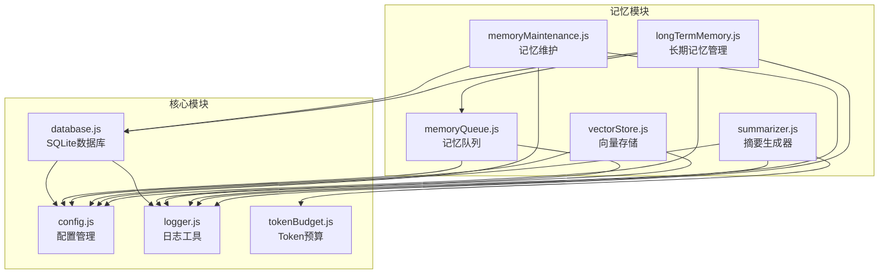
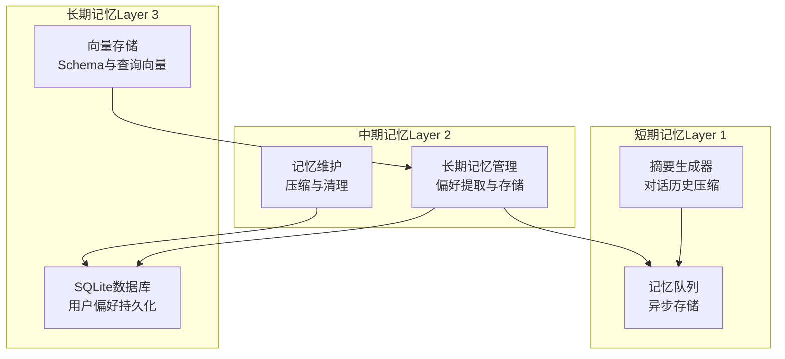
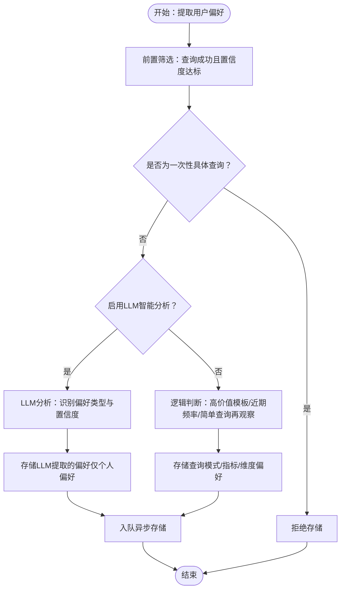
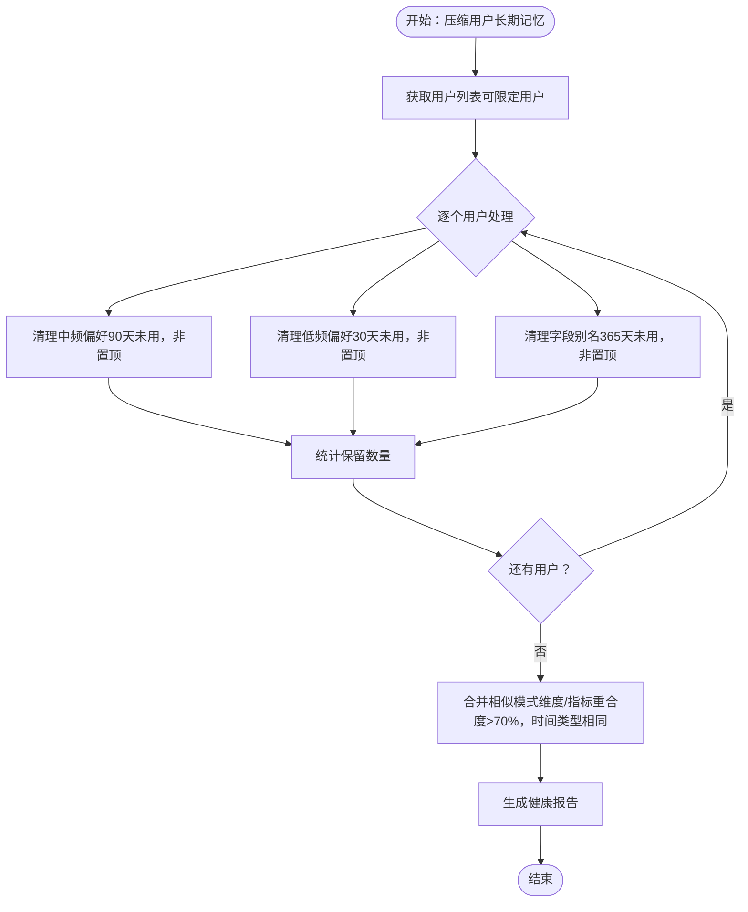
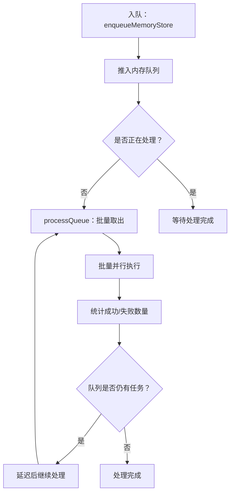
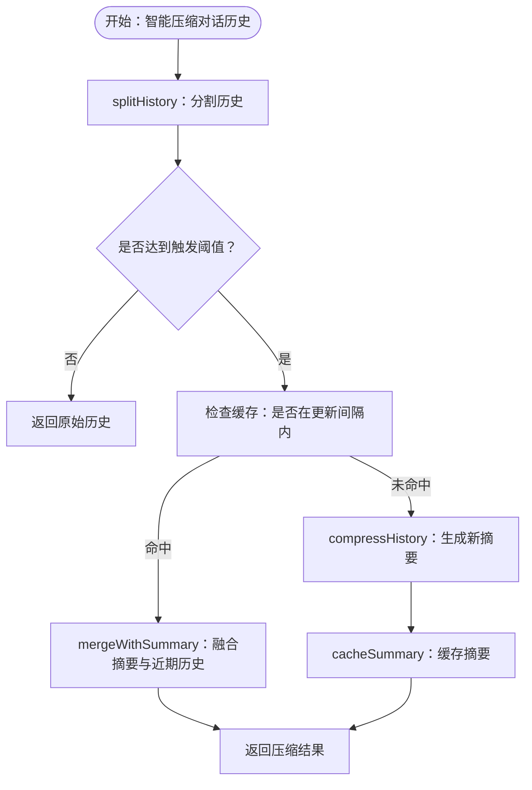
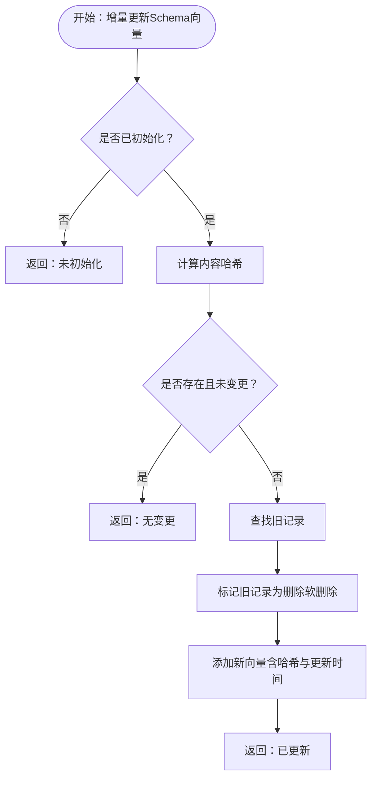
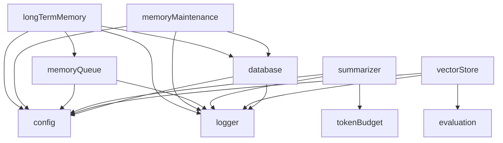

# 记忆模块

<cite>
**本文引用的文件**
- [longTermMemory.js](file://backend/src/memory/longTermMemory.js)
- [memoryMaintenance.js](file://backend/src/memory/memoryMaintenance.js)
- [memoryQueue.js](file://backend/src/memory/memoryQueue.js)
- [summarizer.js](file://backend/src/memory/summarizer.js)
- [vectorStore.js](file://backend/src/memory/vectorStore.js)
- [config.js](file://backend/src/core/config.js)
- [database.js](file://backend/src/core/database.js)
- [logger.js](file://backend/src/utils/logger.js)
- [tokenBudget.js](file://backend/src/utils/tokenBudget.js)
- [package.json](file://backend/package.json)
</cite>

## 目录
1. [简介](#简介)
2. [项目结构](#项目结构)
3. [核心组件](#核心组件)
4. [架构概览](#架构概览)
5. [详细组件分析](#详细组件分析)
6. [依赖关系分析](#依赖关系分析)
7. [性能考量](#性能考量)
8. [故障排除指南](#故障排除指南)
9. [结论](#结论)
10. [附录](#附录)

## 简介
本文件为 NL2SQL 记忆模块的详细技术文档，涵盖三层记忆架构设计与实现：短期记忆（对话摘要）、中期记忆（上下文管理）与长期记忆（用户偏好与模式）。重点说明 longTermMemory 长期记忆管理、memoryMaintenance 记忆维护、memoryQueue 记忆队列、summarizer 摘要生成器和 vectorStore 向量存储等模块的功能特性、数据结构、生命周期管理与性能优化策略。文档还提供配置参数、扩展接口与故障排除指南，帮助开发者与运维人员高效理解和维护记忆系统。

## 项目结构
记忆模块位于后端工程的 memory 目录下，配合核心配置、数据库与工具模块共同构成完整的记忆体系：
- memory 目录：长期记忆、记忆维护、记忆队列、摘要生成、向量存储
- core 目录：配置、数据库、LLM 服务等核心能力
- utils 目录：日志、Token 预算等工具模块

图表来源
- [longTermMemory.js:1-1127](file://backend/src/memory/longTermMemory.js#L1-L1127)
- [memoryMaintenance.js:1-418](file://backend/src/memory/memoryMaintenance.js#L1-L418)
- [memoryQueue.js:1-217](file://backend/src/memory/memoryQueue.js#L1-L217)
- [summarizer.js:1-530](file://backend/src/memory/summarizer.js#L1-L530)
- [vectorStore.js:1-881](file://backend/src/memory/vectorStore.js#L1-L881)
- [config.js:1-398](file://backend/src/core/config.js#L1-L398)
- [database.js:1-859](file://backend/src/core/database.js#L1-L859)
- [logger.js:1-442](file://backend/src/utils/logger.js#L1-L442)
- [tokenBudget.js:1-435](file://backend/src/utils/tokenBudget.js#L1-L435)

章节来源
- [longTermMemory.js:1-1127](file://backend/src/memory/longTermMemory.js#L1-L1127)
- [memoryMaintenance.js:1-418](file://backend/src/memory/memoryMaintenance.js#L1-L418)
- [memoryQueue.js:1-217](file://backend/src/memory/memoryQueue.js#L1-L217)
- [summarizer.js:1-530](file://backend/src/memory/summarizer.js#L1-L530)
- [vectorStore.js:1-881](file://backend/src/memory/vectorStore.js#L1-L881)
- [config.js:1-398](file://backend/src/core/config.js#L1-L398)
- [database.js:1-859](file://backend/src/core/database.js#L1-L859)
- [logger.js:1-442](file://backend/src/utils/logger.js#L1-L442)
- [tokenBudget.js:1-435](file://backend/src/utils/tokenBudget.js#L1-L435)

## 核心组件
- 长期记忆管理（Layer 2）
  - 功能：从用户查询中提取并存储偏好（字段别名、查询模式、指标/维度偏好），支持 LLM 智能提炼与逻辑判断双通道。
  - 关键点：置信度阈值、高频模式合并、一次性查询排除、异步存储队列。
- 记忆维护（Layer 2）
  - 功能：定期压缩与清理长期记忆，分级保留策略（高频/中频/低频/字段别名），相似模式合并。
  - 关键点：使用频率与最后使用时间，保留天数配置，置顶记忆保护。
- 记忆队列（Layer 1）
  - 功能：异步批量处理记忆存储操作，避免阻塞主流程，提升高并发性能。
  - 关键点：批量大小、处理间隔、队列状态监控、等待完成。
- 摘要生成器（Layer 1）
  - 功能：对长对话历史进行自动摘要与压缩，保留近期对话原文，支持缓存与增量更新。
  - 关键点：轮数阈值、Token 数阈值、摘要缓存、智能压缩入口。
- 向量存储（Layer 3）
  - 功能：基于 LanceDB 的向量数据库，支持 Schema 向量与查询历史向量的增删改查、智能搜索与元数据增强。
  - 关键点：初始化、表结构、元数据增强、智能搜索策略、增量更新。

章节来源
- [longTermMemory.js:1-1127](file://backend/src/memory/longTermMemory.js#L1-L1127)
- [memoryMaintenance.js:1-418](file://backend/src/memory/memoryMaintenance.js#L1-L418)
- [memoryQueue.js:1-217](file://backend/src/memory/memoryQueue.js#L1-L217)
- [summarizer.js:1-530](file://backend/src/memory/summarizer.js#L1-L530)
- [vectorStore.js:1-881](file://backend/src/memory/vectorStore.js#L1-L881)

## 架构概览
三层记忆架构设计：
- 短期记忆（Layer 1）：对话摘要与上下文压缩，保障 LLM 输入窗口安全。
- 中期记忆（Layer 2）：上下文管理与长期记忆提取，平衡个性化与通用知识。
- 长期记忆（Layer 3）：用户偏好与模式持久化，支持检索与维护。

图表来源
- [summarizer.js:1-530](file://backend/src/memory/summarizer.js#L1-L530)
- [memoryQueue.js:1-217](file://backend/src/memory/memoryQueue.js#L1-L217)
- [longTermMemory.js:1-1127](file://backend/src/memory/longTermMemory.js#L1-L1127)
- [memoryMaintenance.js:1-418](file://backend/src/memory/memoryMaintenance.js#L1-L418)
- [vectorStore.js:1-881](file://backend/src/memory/vectorStore.js#L1-L881)
- [database.js:1-859](file://backend/src/core/database.js#L1-L859)

## 详细组件分析

### 长期记忆管理（Layer 2）
- 功能概述
  - 从成功的、高置信度查询中提取用户偏好，包括字段别名、查询模式、指标/维度偏好。
  - 支持 LLM 智能分析与逻辑判断两种路径，优先存储高价值知识（模板、高频模式、用户个人偏好）。
  - 通过记忆队列异步存储，避免阻塞主流程。
- 数据结构
  - 偏好类型：字段别名、查询模式、指标偏好、维度偏好。
  - 存储内容：JSON 结构，包含字段名、时间范围、过滤器、样本查询、使用次数等。
- 生命周期管理
  - 前置筛选：查询成功、置信度阈值、排除一次性查询。
  - 价值评估：高价值模板、近期频率、简单查询的再观察。
  - 异步存储：入队后批量执行，记录等待时间与结果。
- LLM 智能提炼
  - 识别字段别名、分析习惯、通用/单次查询、过滤逻辑等，区分个人偏好与通用知识。
  - 置信度评估与理由输出，便于回退到逻辑判断。
- 关键流程图

图表来源
- [longTermMemory.js:313-471](file://backend/src/memory/longTermMemory.js#L313-L471)
- [longTermMemory.js:58-190](file://backend/src/memory/longTermMemory.js#L58-L190)
- [longTermMemory.js:253-297](file://backend/src/memory/longTermMemory.js#L253-L297)

章节来源
- [longTermMemory.js:1-1127](file://backend/src/memory/longTermMemory.js#L1-L1127)

### 记忆维护（Layer 2）
- 功能概述
  - 定期压缩与清理长期记忆，按使用频率分级保留：高频永久、中频90天、低频30天、字段别名365天。
  - 相似查询模式合并，减少冗余，提升检索质量。
  - 提供用户记忆统计与系统健康报告。
- 数据结构
  - 用户偏好表：包含用户ID、偏好类型、内容（JSON）、使用次数、最后使用时间、置顶标记等。
- 生命周期管理
  - 压缩策略：按使用次数与最后使用时间清理，跳过置顶记忆。
  - 相似模式合并：维度/指标重合度与时间类型匹配，合并为更通用模式。
- 关键流程图

图表来源
- [memoryMaintenance.js:69-120](file://backend/src/memory/memoryMaintenance.js#L69-L120)
- [memoryMaintenance.js:127-192](file://backend/src/memory/memoryMaintenance.js#L127-L192)
- [memoryMaintenance.js:204-248](file://backend/src/memory/memoryMaintenance.js#L204-L248)

章节来源
- [memoryMaintenance.js:1-418](file://backend/src/memory/memoryMaintenance.js#L1-L418)
- [database.js:136-171](file://backend/src/core/database.js#L136-L171)

### 记忆队列（Layer 1）
- 功能概述
  - 将记忆存储操作异步化，避免阻塞主流程，提升高并发场景下的系统性能。
  - 批量处理与并行执行，支持队列状态查询、清空与等待完成。
- 数据结构
  - 队列项：操作函数、类型、用户ID、入队时间。
  - 状态：队列长度、是否处理中、批量大小、处理间隔。
- 生命周期管理
  - 入队：记录入队时间，触发处理。
  - 处理：批量取出、并行执行、统计结果、失败记录。
  - 等待：支持超时等待队列处理完成。
- 关键流程图

图表来源
- [memoryQueue.js:46-118](file://backend/src/memory/memoryQueue.js#L46-L118)
- [memoryQueue.js:186-202](file://backend/src/memory/memoryQueue.js#L186-L202)

章节来源
- [memoryQueue.js:1-217](file://backend/src/memory/memoryQueue.js#L1-L217)

### 摘要生成器（Layer 1）
- 功能概述
  - 对长对话历史进行自动摘要与压缩，保留近期对话原文，支持缓存与增量更新。
  - 智能压缩入口：根据轮数与 Token 数阈值触发，结合缓存避免重复生成。
- 数据结构
  - 摘要缓存：Map 结构，键为 sessionId，值包含摘要、最后更新轮数、时间戳。
  - 配置：触发轮数、保留最近轮数、最大摘要 Token 数、更新间隔、是否包含元数据。
- 生命周期管理
  - 分割历史：将历史分为需要摘要的部分与保留的部分。
  - 生成摘要：调用 LLM 生成摘要，长度控制与裁剪。
  - 增量更新：合并现有摘要与新增对话，生成更新后的摘要。
  - 缓存管理：缓存过期清理、指定会话缓存清除。
- 关键流程图

图表来源
- [summarizer.js:264-331](file://backend/src/memory/summarizer.js#L264-L331)
- [summarizer.js:450-504](file://backend/src/memory/summarizer.js#L450-L504)
- [summarizer.js:341-363](file://backend/src/memory/summarizer.js#L341-L363)

章节来源
- [summarizer.js:1-530](file://backend/src/memory/summarizer.js#L1-L530)
- [tokenBudget.js:1-435](file://backend/src/utils/tokenBudget.js#L1-L435)

### 向量存储（Layer 3）
- 功能概述
  - 基于 LanceDB 的向量数据库，支持 Schema 向量与查询历史向量的增删改查。
  - 元数据增强：重要性评分、查询类型分类、复杂度统计、执行信息等。
  - 智能搜索：根据查询意图识别（如游戏提及）进行优先级重排。
  - 增量更新：基于内容哈希判断是否需要更新，避免重复 Embedding。
- 数据结构
  - 表结构：schema_vectors（Schema 描述向量）、query_vectors（查询历史向量）。
  - 元数据：时间戳、重要性评分、查询类型、复杂度、执行信息、意图摘要。
- 生命周期管理
  - 初始化：连接数据库、创建/打开表。
  - 增删改查：添加向量、搜索相似、删除占位、统计信息。
  - 智能搜索：意图识别 + 距离 + 优先级评分重排。
  - 增量更新：内容哈希校验、软删除旧记录、添加新记录。
- 关键流程图

图表来源
- [vectorStore.js:799-852](file://backend/src/memory/vectorStore.js#L799-L852)
- [vectorStore.js:745-776](file://backend/src/memory/vectorStore.js#L745-L776)

章节来源
- [vectorStore.js:1-881](file://backend/src/memory/vectorStore.js#L1-L881)
- [config.js:103-109](file://backend/src/core/config.js#L103-L109)

## 依赖关系分析
- 模块耦合
  - longTermMemory 依赖 database、memoryQueue、llmService、logger、config。
  - memoryMaintenance 依赖 database、logger、config。
  - memoryQueue 依赖 logger、config。
  - summarizer 依赖 llmService、logger、tokenBudget、config。
  - vectorStore 依赖 lancedb、config、logger、crypto、evaluation。
- 外部依赖
  - LanceDB：向量数据库，提供向量搜索与表管理。
  - SQLite：用户偏好持久化存储。
  - dotenv：环境变量加载。
- 关键依赖图

图表来源
- [longTermMemory.js:17-22](file://backend/src/memory/longTermMemory.js#L17-L22)
- [memoryMaintenance.js:16-18](file://backend/src/memory/memoryMaintenance.js#L16-L18)
- [memoryQueue.js:8](file://backend/src/memory/memoryQueue.js#L8)
- [summarizer.js:12-14](file://backend/src/memory/summarizer.js#L12-L14)
- [vectorStore.js:14-23](file://backend/src/memory/vectorStore.js#L14-L23)
- [database.js:12-19](file://backend/src/core/database.js#L12-L19)

章节来源
- [package.json:10-20](file://backend/package.json#L10-L20)

## 性能考量
- 异步与批处理
  - memoryQueue 批量大小与处理间隔可调，建议根据系统负载动态调整。
  - longTermMemory 通过队列异步存储，避免阻塞主流程。
- Token 预算与上下文压缩
  - tokenBudget 提供快速估算与预算计算，支持历史裁剪与检索片段压缩。
  - summarizer 的智能压缩入口在达到阈值时触发，减少 LLM 输入负担。
- 向量搜索优化
  - vectorStore 的智能搜索根据查询意图进行优先级重排，提升检索质量。
  - 增量更新基于内容哈希，避免重复 Embedding 调用。
- 数据库与索引
  - database 对 user_preferences 表建立复合索引，加速按用户与类型的查询。
  - memoryMaintenance 的清理与合并操作使用 SQL 语句，减少内存压力。

[本节为通用性能讨论，不直接分析具体文件]

## 故障排除指南
- 长期记忆不生效
  - 检查 longTermMemory.enabled 与 useLLMForExtraction 配置。
  - 确认查询成功且置信度达标，排除一次性具体查询。
  - 查看日志中“LLM分析失败，回退到逻辑判断”的记录。
- 记忆维护未清理
  - 检查 retention 配置与用户最后使用时间。
  - 确认非置顶记忆才会被清理。
  - 查看压缩统计与健康报告。
- 摘要生成失败
  - 检查 LLM API 配置与网络连通性。
  - 查看摘要长度限制与裁剪日志。
  - 确认缓存过期时间与清理策略。
- 向量存储不可用
  - 检查 vectorDb.path 与 LanceDB 初始化状态。
  - 确认表创建与数据添加成功。
  - 查看增量更新的哈希校验与软删除日志。
- 队列积压
  - 查看队列状态与批量大小，适当增大 BATCH_SIZE 或缩短 PROCESS_INTERVAL。
  - 监控等待时间与失败数量，定位具体操作。

章节来源
- [longTermMemory.js:58-190](file://backend/src/memory/longTermMemory.js#L58-L190)
- [memoryMaintenance.js:69-120](file://backend/src/memory/memoryMaintenance.js#L69-L120)
- [summarizer.js:144-185](file://backend/src/memory/summarizer.js#L144-L185)
- [vectorStore.js:233-263](file://backend/src/memory/vectorStore.js#L233-L263)
- [memoryQueue.js:160-202](file://backend/src/memory/memoryQueue.js#L160-L202)

## 结论
NL2SQL 记忆模块通过三层架构实现了从短期到长期的记忆管理：短期记忆保障上下文安全与高效交互，中期记忆平衡个性化与通用知识，长期记忆沉淀用户偏好与模式。核心模块具备完善的异步处理、智能提炼、缓存与增量更新能力，配合配置化参数与监控日志，能够满足生产环境的稳定性与可维护性需求。建议在部署时根据业务规模调整批量大小、阈值与保留策略，并持续关注健康报告与日志指标。

[本节为总结性内容，不直接分析具体文件]

## 附录

### 配置参数总览
- 长期记忆配置（longTermMemory）
  - enabled：是否启用长期记忆
  - useLLMForExtraction：是否使用 LLM 进行智能提炼
  - thresholds：筛选阈值（最小置信度、模板维度/指标阈值、频率天数、简单查询频率）
  - retention：分级保留策略（高频、中频、低频、字段别名）
- 上下文管理配置（contextManagement）
  - enableTokenBudget：是否启用 Token 预算
  - enableSummarizer：是否启用对话摘要
  - tokenBudget：最大上下文 Token、预留输出 Token、警告/压缩阈值
  - summarizer：触发轮数、保留最近轮数、最大摘要 Token、更新间隔
- 向量数据库配置（vectorDb）
  - path：LanceDB 数据库存储目录
- 其他
  - embedding：Embedding 模型与维度
  - log：日志级别、文件路径、控制台输出开关

章节来源
- [config.js:259-293](file://backend/src/core/config.js#L259-L293)
- [config.js:303-333](file://backend/src/core/config.js#L303-L333)
- [config.js:103-109](file://backend/src/core/config.js#L103-L109)
- [config.js:77-87](file://backend/src/core/config.js#L77-L87)
- [config.js:195-213](file://backend/src/core/config.js#L195-L213)

### 扩展接口与最佳实践
- 扩展接口
  - longTermMemory：支持自定义偏好类型与存储逻辑，可扩展 LLM 提炼规则。
  - memoryMaintenance：支持自定义清理规则与相似模式合并策略。
  - memoryQueue：支持队列状态监控与等待完成接口，便于集成测试。
  - summarizer：支持自定义摘要提示词与缓存策略。
  - vectorStore：支持自定义元数据增强与智能搜索策略。
- 最佳实践
  - 合理设置 thresholds 与 retention，避免过度学习或信息丢失。
  - 监控队列长度与处理延迟，及时调整批量大小与处理间隔。
  - 使用 Token 预算与摘要压缩，确保 LLM 输入窗口安全。
  - 定期运行记忆维护任务，清理无效偏好并合并相似模式。
  - 启用评估与日志，持续跟踪向量质量与记忆命中率。

[本节为概念性内容，不直接分析具体文件]