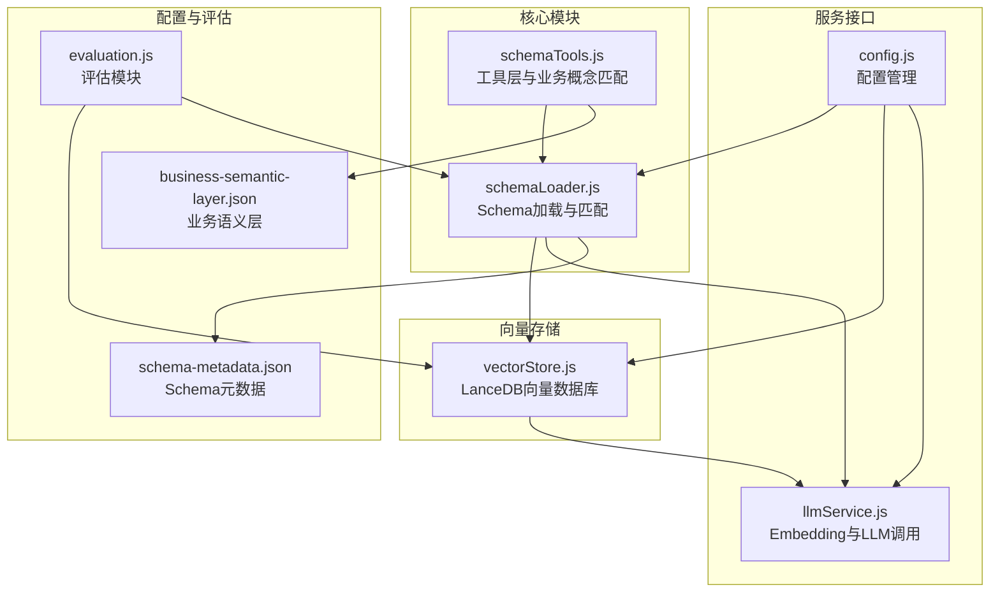
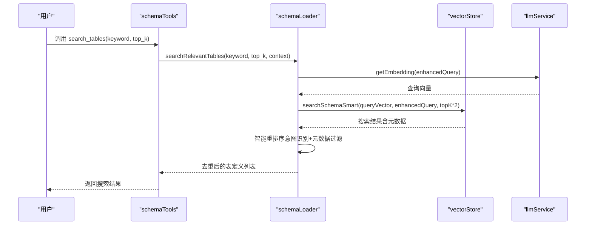
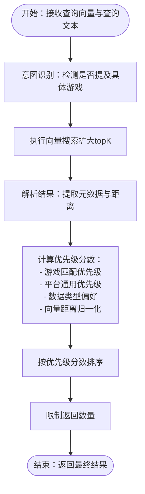
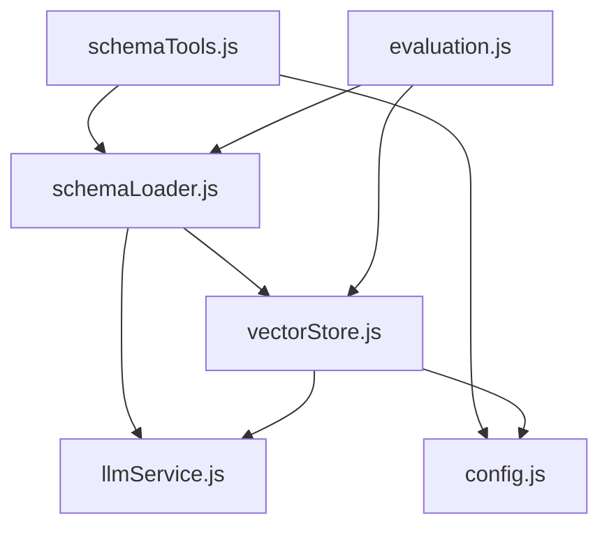

# Schema搜索机制

<cite>
**本文档引用的文件**
- [schemaTools.js](file://backend/src/core/schemaTools.js)
- [vectorStore.js](file://backend/src/memory/vectorStore.js)
- [schemaLoader.js](file://backend/src/core/schemaLoader.js)
- [evaluation.js](file://backend/src/utils/evaluation.js)
- [business-semantic-layer.json](file://backend/config/business-semantic-layer.json)
- [schema-metadata.json](file://backend/config/schema-metadata.json)
- [llmService.js](file://backend/src/core/llmService.js)
- [config.js](file://backend/src/core/config.js)
- [app.js](file://backend/src/app.js)
- [package.json](file://backend/package.json)
</cite>

## 目录
1. [简介](#简介)
2. [项目结构](#项目结构)
3. [核心组件](#核心组件)
4. [架构概览](#架构概览)
5. [详细组件分析](#详细组件分析)
6. [依赖关系分析](#依赖关系分析)
7. [性能考量](#性能考量)
8. [故障排查指南](#故障排查指南)
9. [结论](#结论)

## 简介
本文件深入解析NL2SQL项目中的Schema搜索机制，涵盖向量检索、语义匹配、相关性评分算法、关键词处理、模糊匹配与同义词识别、性能优化策略（索引构建、缓存机制、查询优化）、搜索结果排序与过滤、以及搜索质量评估与改进方法。该机制通过表级向量表示与智能重排序相结合，实现高效准确的Schema发现与推荐。

## 项目结构
NL2SQL后端采用模块化架构，核心围绕Schema元数据加载、向量存储、LLM服务与工具层展开。Schema搜索涉及以下关键模块：
- 核心模块：schemaLoader（Schema加载与匹配）、schemaTools（工具层与业务概念匹配）
- 向量存储：vectorStore（LanceDB向量数据库、语义检索、智能重排序）
- 服务接口：llmService（Embedding与LLM调用）、config（配置管理）
- 评估模块：evaluation（向量化质量评估与统计）

**图表来源**
- [schemaLoader.js:1-1172](file://backend/src/core/schemaLoader.js#L1-L1172)
- [schemaTools.js:1-632](file://backend/src/core/schemaTools.js#L1-L632)
- [vectorStore.js:1-881](file://backend/src/memory/vectorStore.js#L1-L881)
- [llmService.js:1-477](file://backend/src/core/llmService.js#L1-L477)
- [config.js:1-398](file://backend/src/core/config.js#L1-L398)
- [business-semantic-layer.json:1-189](file://backend/config/business-semantic-layer.json#L1-L189)
- [schema-metadata.json:1-800](file://backend/config/schema-metadata.json#L1-L800)
- [evaluation.js:1-488](file://backend/src/utils/evaluation.js#L1-L488)

**章节来源**
- [app.js:1-260](file://backend/src/app.js#L1-L260)
- [package.json:1-28](file://backend/package.json#L1-L28)

## 核心组件
- Schema加载与匹配（schemaLoader）：负责从配置文件加载Schema元数据，构建快速查找映射，生成表级向量表示，并提供语义搜索与关键词匹配功能。
- 向量存储（vectorStore）：基于LanceDB实现向量数据库，支持表级向量的增删改查、语义检索、智能重排序与查询历史向量化。
- 工具层（schemaTools）：提供LLM可调用的Schema探索工具（search_tables、describe_table、search_knowledge、peek_table），并实现业务概念匹配与别名识别。
- LLM服务（llmService）：封装Embedding与LLM API调用，提供重试机制与错误处理。
- 评估模块（evaluation）：提供向量化质量评估、相似度计算与运行时统计。

**章节来源**
- [schemaLoader.js:1-1172](file://backend/src/core/schemaLoader.js#L1-L1172)
- [vectorStore.js:1-881](file://backend/src/memory/vectorStore.js#L1-L881)
- [schemaTools.js:1-632](file://backend/src/core/schemaTools.js#L1-L632)
- [llmService.js:1-477](file://backend/src/core/llmService.js#L1-L477)
- [evaluation.js:1-488](file://backend/src/utils/evaluation.js#L1-L488)

## 架构概览
Schema搜索的整体流程如下：
1. 用户通过工具层调用search_tables，传入关键词与top_k参数。
2. schemaTools解析工具调用，调用schemaLoader.searchRelevantTables。
3. schemaLoader根据上下文增强查询文本，优先使用向量存储进行语义搜索；若向量存储不可用或失败，则回退到关键词匹配。
4. 向量搜索通过llmService获取查询Embedding，调用vectorStore.searchSchemaSmart进行智能重排序。
5. 智能重排序结合查询意图（如游戏提及、平台类型）与元数据标签（scope、data_type）进行优先级调整。
6. 返回去重后的表定义列表给工具层，最终由LLM工具调用返回给用户。

**图表来源**
- [schemaTools.js:225-256](file://backend/src/core/schemaTools.js#L225-L256)
- [schemaLoader.js:562-652](file://backend/src/core/schemaLoader.js#L562-L652)
- [vectorStore.js:452-538](file://backend/src/memory/vectorStore.js#L452-L538)
- [llmService.js:369-424](file://backend/src/core/llmService.js#L369-L424)

**章节来源**
- [schemaTools.js:225-256](file://backend/src/core/schemaTools.js#L225-L256)
- [schemaLoader.js:562-652](file://backend/src/core/schemaLoader.js#L562-L652)
- [vectorStore.js:452-538](file://backend/src/memory/vectorStore.js#L452-L538)
- [llmService.js:369-424](file://backend/src/core/llmService.js#L369-L424)

## 详细组件分析

### 向量检索与智能重排序
- 表级向量表示：schemaLoader将每个表的核心业务含义（域标签、类型、功能描述、核心特征词）浓缩为单一文本向量，减少向量数量并提升检索效率。
- 智能重排序：vectorStore.searchSchemaSmart根据查询文本识别意图（如是否提及具体游戏），对结果进行优先级调整：
  - 若提及具体游戏，对应游戏表优先级最高；
  - 未提及游戏时，平台通用表优先级次之；
  - 原始日志表优先级高于聚合报表；
  - 向量距离越小得分越高，归一化到0-20分。
- 元数据过滤：支持按scope（域标签）与data_type（数据类型）进行过滤，提升相关性。

**图表来源**
- [vectorStore.js:452-538](file://backend/src/memory/vectorStore.js#L452-L538)

**章节来源**
- [schemaLoader.js:191-276](file://backend/src/core/schemaLoader.js#L191-L276)
- [vectorStore.js:452-538](file://backend/src/memory/vectorStore.js#L452-L538)

### 语义匹配与关键词匹配
- 语义匹配：当向量存储可用时，优先使用Embedding向量进行相似度搜索，结合智能重排序提升准确性。
- 关键词匹配：当向量存储不可用或失败时，回退到关键词匹配，基于表名、中文名、描述与字段名进行匹配，计算匹配分数并排序。

**章节来源**
- [schemaLoader.js:586-652](file://backend/src/core/schemaLoader.js#L586-L652)
- [schemaLoader.js:654-709](file://backend/src/core/schemaLoader.js#L654-L709)

### 搜索关键词处理、模糊匹配与同义词识别
- 关键词处理：将查询文本转为小写并进行简单分词，提取关键词用于匹配与评分。
- 模糊匹配：在业务概念匹配中，支持精确匹配、别名匹配与模糊匹配三种策略，提升对用户输入多样性的适应性。
- 同义词识别：通过业务语义层配置文件business-semantic-layer.json定义概念别名，实现同义词识别与映射。

**章节来源**
- [schemaLoader.js:661-709](file://backend/src/core/schemaLoader.js#L661-L709)
- [schemaTools.js:490-542](file://backend/src/core/schemaTools.js#L490-L542)
- [business-semantic-layer.json:1-189](file://backend/config/business-semantic-layer.json#L1-L189)

### 搜索结果排序与过滤
- 排序策略：智能重排序综合考虑游戏匹配、平台通用性、数据类型偏好与向量距离，形成优先级分数；关键词匹配按匹配分数排序。
- 过滤策略：支持按scope与data_type过滤，以及在有上下文时按datasource与平台类型优先匹配。

**章节来源**
- [vectorStore.js:391-437](file://backend/src/memory/vectorStore.js#L391-L437)
- [schemaLoader.js:592-643](file://backend/src/core/schemaLoader.js#L592-L643)

### 搜索性能优化策略
- 索引构建：采用表级向量表示，每个表仅生成一个向量，减少向量数量与存储开销。
- 缓存机制：Level 1索引缓存（表名+业务注释）与Schema元数据缓存，降低重复加载成本。
- 查询优化：向量搜索扩大topK再裁剪，结合智能重排序减少二次检索；增量更新避免全量重建。
- 环境配置：通过config.js集中管理向量维度、超时时间、重试次数等参数，便于调优。

**章节来源**
- [schemaLoader.js:191-276](file://backend/src/core/schemaLoader.js#L191-L276)
- [schemaTools.js:136-173](file://backend/src/core/schemaTools.js#L136-L173)
- [config.js:80-87](file://backend/src/core/config.js#L80-L87)
- [config.js:240-250](file://backend/src/core/config.js#L240-L250)

### 搜索质量评估与改进
- 评估指标：提供向量化质量评估（精确率、召回率、F1分数）与查询相似度评估（余弦相似度），并记录运行时统计。
- 统计报告：记录向量检索命中率、距离分布与长期记忆命中率，支持重置与导出。
- 改进建议：根据评估结果调整特征词提取、向量维度、过滤策略与重排序权重，持续优化搜索效果。

**章节来源**
- [evaluation.js:158-266](file://backend/src/utils/evaluation.js#L158-L266)
- [evaluation.js:276-334](file://backend/src/utils/evaluation.js#L276-L334)
- [evaluation.js:344-430](file://backend/src/utils/evaluation.js#L344-L430)

## 依赖关系分析
Schema搜索机制的关键依赖关系如下：
- schemaTools依赖schemaLoader进行表搜索，依赖config进行缓存与配置管理。
- schemaLoader依赖llmService生成Embedding，依赖vectorStore进行向量存储与检索。
- vectorStore依赖LanceDB进行向量数据库操作，依赖config进行路径与维度配置。
- evaluation模块独立运行，为向量检索与记忆系统提供评估与统计。

**图表来源**
- [schemaTools.js:17-26](file://backend/src/core/schemaTools.js#L17-L26)
- [schemaLoader.js:15-26](file://backend/src/core/schemaLoader.js#L15-L26)
- [vectorStore.js:14-23](file://backend/src/memory/vectorStore.js#L14-L23)
- [llmService.js:15-24](file://backend/src/core/llmService.js#L15-L24)
- [config.js:16-398](file://backend/src/core/config.js#L16-L398)
- [evaluation.js:12-13](file://backend/src/utils/evaluation.js#L12-L13)

**章节来源**
- [schemaTools.js:17-26](file://backend/src/core/schemaTools.js#L17-L26)
- [schemaLoader.js:15-26](file://backend/src/core/schemaLoader.js#L15-L26)
- [vectorStore.js:14-23](file://backend/src/memory/vectorStore.js#L14-L23)
- [llmService.js:15-24](file://backend/src/core/llmService.js#L15-L24)
- [config.js:16-398](file://backend/src/core/config.js#L16-L398)
- [evaluation.js:12-13](file://backend/src/utils/evaluation.js#L12-L13)

## 性能考量
- 向量维度与存储：通过config.js统一管理embedding维度与向量数据库路径，避免硬编码带来的维护困难。
- 超时与重试：llmService提供重试机制与超时控制，防止API调用阻塞影响整体性能。
- 缓存策略：Level 1索引缓存与Schema元数据缓存减少重复加载，提升响应速度。
- 智能重排序：在保证召回的前提下，通过优先级分数减少无效结果，提升用户体验。

[本节为通用性能指导，无需特定文件分析]

## 故障排查指南
- 向量数据库未初始化：检查LanceDB路径与权限，确认vectorStore.initialize()执行成功。
- Embedding API调用失败：检查LLM API密钥、基础URL与超时设置，查看重试日志。
- 搜索结果为空：确认Schema元数据加载成功，检查向量存储中是否存在表级向量。
- 业务概念匹配失败：检查business-semantic-layer.json配置，确认别名与映射关系正确。

**章节来源**
- [vectorStore.js:233-263](file://backend/src/memory/vectorStore.js#L233-L263)
- [llmService.js:167-195](file://backend/src/core/llmService.js#L167-L195)
- [schemaLoader.js:69-122](file://backend/src/core/schemaLoader.js#L69-L122)
- [business-semantic-layer.json:1-189](file://backend/config/business-semantic-layer.json#L1-L189)

## 结论
NL2SQL的Schema搜索机制通过表级向量表示与智能重排序相结合，实现了高效准确的Schema发现。系统在向量检索、语义匹配、关键词处理、模糊匹配与同义词识别、性能优化与质量评估等方面形成了完整的解决方案。通过持续的评估与改进，可进一步提升搜索质量与用户体验。