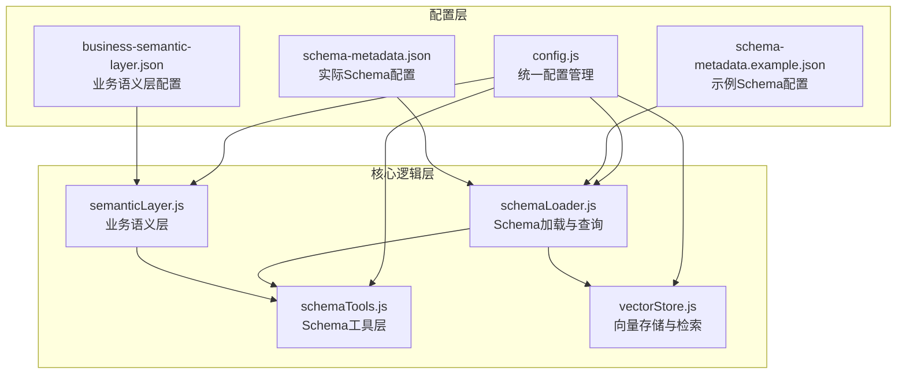
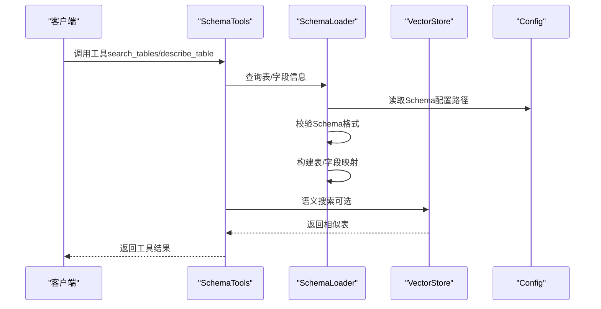
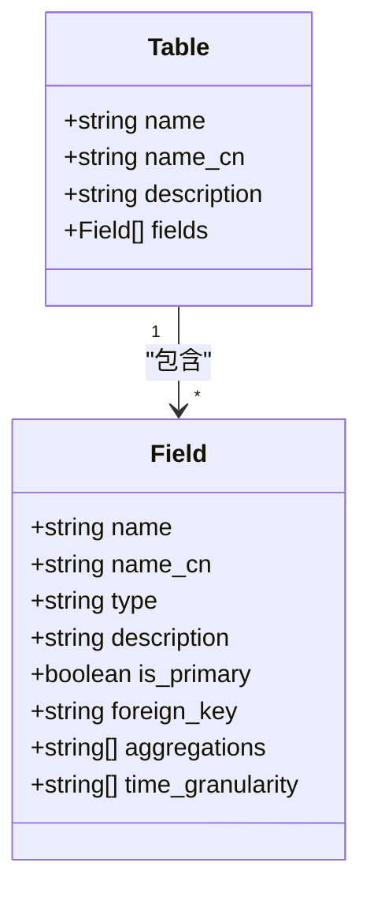
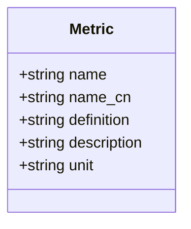
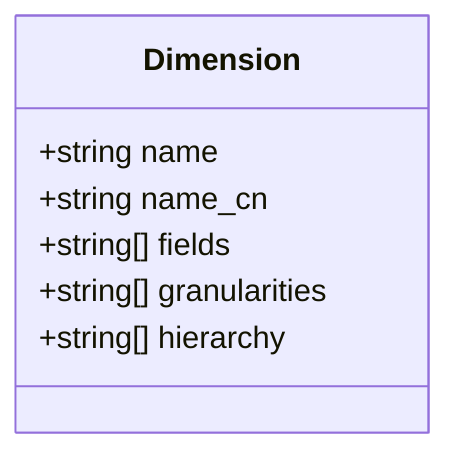
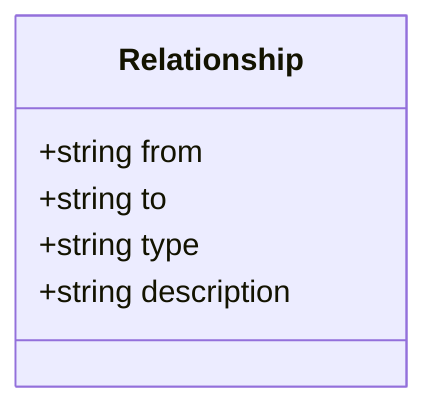
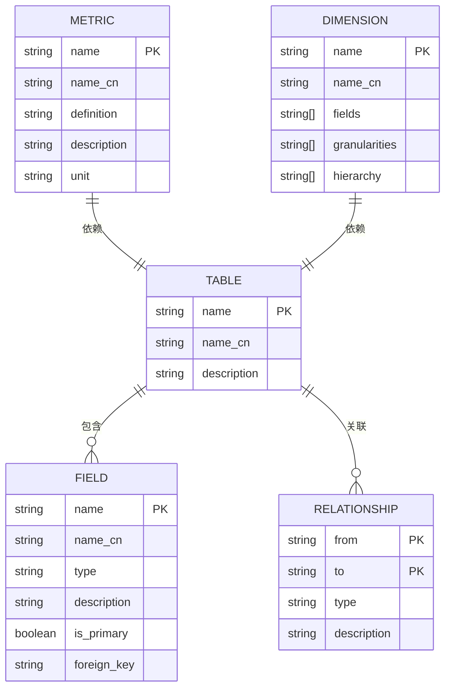
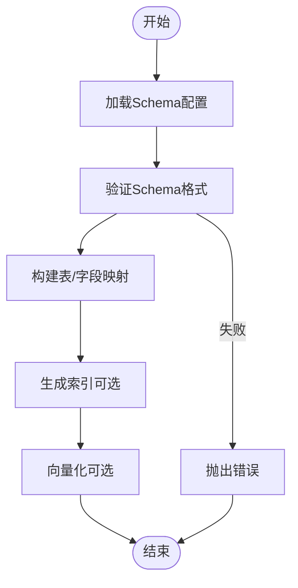
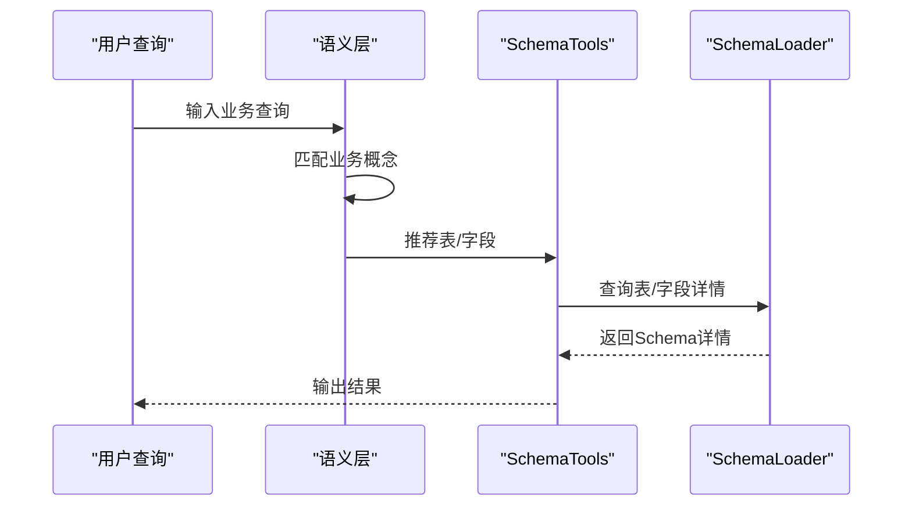
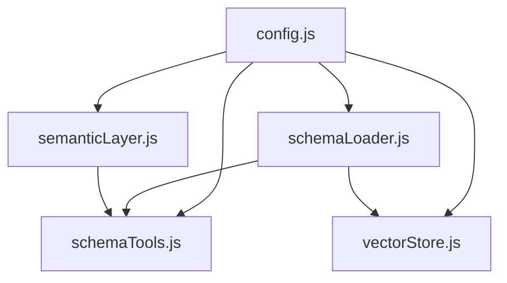

# Schema数据模型

<cite>
**本文档引用的文件**
- [schemaLoader.js](file://backend/src/core/schemaLoader.js)
- [schemaTools.js](file://backend/src/core/schemaTools.js)
- [semanticLayer.js](file://backend/src/core/semanticLayer.js)
- [config.js](file://backend/src/core/config.js)
- [vectorStore.js](file://backend/src/memory/vectorStore.js)
- [schema-metadata.example.json](file://backend/config/schema-metadata.example.json)
- [schema-metadata.json](file://backend/config/schema-metadata.json)
- [business-semantic-layer.json](file://backend/config/business-semantic-layer.json)
</cite>

## 目录
1. [简介](#简介)
2. [项目结构](#项目结构)
3. [核心组件](#核心组件)
4. [架构概览](#架构概览)
5. [详细组件分析](#详细组件分析)
6. [依赖关系分析](#依赖关系分析)
7. [性能考量](#性能考量)
8. [故障排查指南](#故障排查指南)
9. [结论](#结论)
10. [附录](#附录)

## 简介
本文件为NL2SQL项目中的Schema数据模型技术文档，聚焦于表定义、指标、维度三类Schema类型的字段定义、数据类型与约束条件，以及Schema元数据的存储格式、数据库表结构、字段关系图与实体关系模型。文档还涵盖Schema数据验证规则、业务规则与数据生命周期管理策略，帮助开发者与业务人员理解并正确使用NL2SQL的Schema体系。

## 项目结构
NL2SQL项目采用前后端分离架构，Schema相关的核心逻辑集中在后端的`backend/src/core`目录中，配置文件位于`backend/config`目录，向量存储位于`backend/data/vectordb`目录。Schema数据模型由以下关键模块协同实现：
- schemaLoader：负责Schema元数据的加载、校验、缓存与查询
- schemaTools：提供LLM可调用的Schema探索工具
- semanticLayer：建立业务语义到物理表/字段的映射
- config：集中管理配置项，包括Schema配置路径、缓存策略、安全策略等
- vectorStore：基于LanceDB的向量存储与语义检索

**图表来源**
- [config.js:240-250](file://backend/src/core/config.js#L240-L250)
- [schemaLoader.js:69-122](file://backend/src/core/schemaLoader.js#L69-L122)
- [schemaTools.js:17-19](file://backend/src/core/schemaTools.js#L17-L19)
- [semanticLayer.js:48-73](file://backend/src/core/semanticLayer.js#L48-L73)
- [vectorStore.js:233-263](file://backend/src/memory/vectorStore.js#L233-L263)

**章节来源**
- [config.js:240-250](file://backend/src/core/config.js#L240-L250)
- [schemaLoader.js:69-122](file://backend/src/core/schemaLoader.js#L69-L122)
- [schemaTools.js:17-19](file://backend/src/core/schemaTools.js#L17-L19)
- [semanticLayer.js:48-73](file://backend/src/core/semanticLayer.js#L48-L73)
- [vectorStore.js:233-263](file://backend/src/memory/vectorStore.js#L233-L263)

## 核心组件
- Schema元数据加载与缓存：从JSON配置文件加载Schema，构建表名与字段名映射，支持缓存与失效控制
- Schema验证：对JSON配置进行格式与完整性校验，确保tables、fields等字段存在且格式正确
- 语义搜索与匹配：结合向量检索与关键词匹配，支持根据业务概念与查询上下文推荐相关表
- 业务语义层：将业务术语映射到物理表/字段，解决“老平台”、“累计充值”等语义歧义
- 向量存储：基于LanceDB的向量数据库，支持Schema向量与查询历史向量的存储与检索

**章节来源**
- [schemaLoader.js:69-122](file://backend/src/core/schemaLoader.js#L69-L122)
- [schemaLoader.js:131-155](file://backend/src/core/schemaLoader.js#L131-L155)
- [schemaTools.js:225-256](file://backend/src/core/schemaTools.js#L225-L256)
- [semanticLayer.js:134-167](file://backend/src/core/semanticLayer.js#L134-L167)
- [vectorStore.js:380-437](file://backend/src/memory/vectorStore.js#L380-L437)

## 架构概览
Schema数据模型的运行时架构如下：
- 配置层：通过config.js集中管理Schema配置路径、缓存策略与安全策略
- 加载层：schemaLoader负责从JSON配置文件加载Schema，构建映射并进行验证
- 工具层：schemaTools提供search_tables、describe_table、search_knowledge、peek_table等工具
- 语义层：semanticLayer将业务概念映射到物理表/字段，并推荐表
- 向量层：vectorStore提供向量存储与语义检索能力，支持智能搜索与重排序

**图表来源**
- [schemaTools.js:565-577](file://backend/src/core/schemaTools.js#L565-L577)
- [schemaLoader.js:69-122](file://backend/src/core/schemaLoader.js#L69-L122)
- [vectorStore.js:452-538](file://backend/src/memory/vectorStore.js#L452-L538)
- [config.js:240-250](file://backend/src/core/config.js#L240-L250)

## 详细组件分析

### 表定义（Tables）
表定义是Schema的核心，包含表的基本信息、字段列表与关系定义。每张表至少包含以下字段：
- name：表名（英文）
- name_cn：表名（中文）
- description：表描述
- fields：字段数组，每个字段包含：
  - name：字段名（英文）
  - name_cn：字段名（中文）
  - type：字段类型（如VARCHAR、BIGINT、DATETIME等）
  - description：字段描述
  - is_primary：是否为主键（布尔）
  - foreign_key：外键引用（格式：表名.字段名）
  - aggregations：可聚合函数列表（如SUM、AVG、COUNT、MAX、MIN）
  - time_granularity：时间粒度（如hour、day、week、month、year）

字段关系设计要点：
- 主键：通过is_primary标记，通常用于唯一标识与关联
- 外键：通过foreign_key字段指向另一表的字段，形成表间关联
- 时间字段：通过time_granularity定义可用于时间维度分析的时间粒度
- 聚合字段：通过aggregations定义可用于聚合计算的函数集合

**图表来源**
- [schema-metadata.example.json:4-77](file://backend/config/schema-metadata.example.json#L4-L77)
- [schema-metadata.json:6-28](file://backend/config/schema-metadata.json#L6-L28)

**章节来源**
- [schema-metadata.example.json:4-77](file://backend/config/schema-metadata.example.json#L4-L77)
- [schema-metadata.json:6-28](file://backend/config/schema-metadata.json#L6-L28)

### 指标（Metrics）
指标是对事实表中度量字段的抽象，通常通过聚合函数计算得到。指标定义包含：
- name：指标名（英文）
- name_cn：指标名（中文）
- definition：指标定义（SQL表达式，如SUM(字段)）
- description：指标描述
- unit：指标单位（如元、笔、人）

指标设计要点：
- 定义清晰：definition应明确聚合逻辑与字段引用
- 单位一致：unit用于统一输出格式
- 与维度组合：指标通常与维度组合进行多维分析

**图表来源**
- [schema-metadata.example.json:253-296](file://backend/config/schema-metadata.example.json#L253-L296)

**章节来源**
- [schema-metadata.example.json:253-296](file://backend/config/schema-metadata.example.json#L253-L296)

### 维度（Dimensions）
维度是对事实表中分类字段的抽象，用于分析的分组依据。维度定义包含：
- name：维度名（英文）
- name_cn：维度名（中文）
- fields：维度字段数组（格式：表名.字段名）
- granularities：时间维度粒度（如hour、day、week、month、quarter、year）
- hierarchy：层级关系（如省-市-区县）

维度设计要点：
- 字段组合：fields可包含多个字段，形成复合维度
- 层级关系：hierarchy定义父子层级，支持钻取分析
- 时间维度：granularities定义时间粒度，支持按时间切片分析

**图表来源**
- [schema-metadata.example.json:297-326](file://backend/config/schema-metadata.example.json#L297-L326)

**章节来源**
- [schema-metadata.example.json:297-326](file://backend/config/schema-metadata.example.json#L297-L326)

### 关系（Relationships）
关系定义表之间的关联关系，包含：
- from：起始表.字段（格式：表名.字段名）
- to：目标表.字段（格式：表名.字段名）
- type：关系类型（如MANY_TO_ONE）
- description：关系描述

关系设计要点：
- 明确方向：from与to定义关系的方向
- 关系类型：支持一对一、一对多、多对一等
- 业务语义：关系描述应体现业务含义

**图表来源**
- [schema-metadata.example.json:233-252](file://backend/config/schema-metadata.example.json#L233-L252)

**章节来源**
- [schema-metadata.example.json:233-252](file://backend/config/schema-metadata.example.json#L233-L252)

### Schema元数据存储格式
Schema元数据支持两种存储格式：
- JSON配置文件：schema-metadata.json（实际使用）、schema-metadata.example.json（示例）
- 数据库表结构：通过SchemaLoader加载到内存，构建映射表与字段映射

JSON配置结构要点：
- version：Schema版本号
- tables：表定义数组
- relationships：关系定义数组
- metrics：指标定义数组
- dimensions：维度定义数组

**图表来源**
- [schema-metadata.example.json:4-326](file://backend/config/schema-metadata.example.json#L4-L326)

**章节来源**
- [schema-metadata.example.json:4-326](file://backend/config/schema-metadata.example.json#L4-L326)
- [schema-metadata.json:6-28](file://backend/config/schema-metadata.json#L6-L28)

### Schema字段关系图
Schema字段关系图展示了表与字段之间的主键、外键与索引设计。主键通过is_primary标记，外键通过foreign_key字段引用，时间字段通过time_granularity定义，聚合字段通过aggregations定义。

**图表来源**
- [schemaLoader.js:69-122](file://backend/src/core/schemaLoader.js#L69-L122)
- [schemaLoader.js:131-155](file://backend/src/core/schemaLoader.js#L131-L155)
- [schemaLoader.js:161-189](file://backend/src/core/schemaLoader.js#L161-L189)

**章节来源**
- [schemaLoader.js:69-122](file://backend/src/core/schemaLoader.js#L69-L122)
- [schemaLoader.js:131-155](file://backend/src/core/schemaLoader.js#L131-L155)
- [schemaLoader.js:161-189](file://backend/src/core/schemaLoader.js#L161-L189)

### 业务语义层与数据源映射
业务语义层将业务术语映射到物理表/字段，解决“老平台”、“累计充值”等语义歧义。配置文件business-semantic-layer.json包含：
- concepts：业务概念及其别名、映射关系
- query_patterns：查询模式模板
- field_mappings：字段值映射
- datasource_mappings：数据源映射

**图表来源**
- [semanticLayer.js:134-167](file://backend/src/core/semanticLayer.js#L134-L167)
- [schemaTools.js:225-256](file://backend/src/core/schemaTools.js#L225-L256)
- [schemaLoader.js:789-824](file://backend/src/core/schemaLoader.js#L789-L824)

**章节来源**
- [semanticLayer.js:134-167](file://backend/src/core/semanticLayer.js#L134-L167)
- [schemaTools.js:225-256](file://backend/src/core/schemaTools.js#L225-L256)
- [schemaLoader.js:789-824](file://backend/src/core/schemaLoader.js#L789-L824)

## 依赖关系分析
Schema数据模型的依赖关系如下：
- config.js：集中管理Schema配置路径、缓存策略、安全策略
- schemaLoader.js：依赖config.js读取配置，依赖fs/path进行文件读取，依赖logger进行日志记录
- schemaTools.js：依赖schemaLoader进行Schema查询，依赖config进行缓存控制
- semanticLayer.js：依赖config读取业务语义层配置，依赖logger进行日志记录
- vectorStore.js：依赖config读取向量数据库路径，依赖lancedb进行向量存储与检索

**图表来源**
- [config.js:240-250](file://backend/src/core/config.js#L240-L250)
- [schemaLoader.js:15-26](file://backend/src/core/schemaLoader.js#L15-L26)
- [schemaTools.js:17-19](file://backend/src/core/schemaTools.js#L17-L19)
- [semanticLayer.js:14-17](file://backend/src/core/semanticLayer.js#L14-L17)
- [vectorStore.js:14-23](file://backend/src/memory/vectorStore.js#L14-L23)

**章节来源**
- [config.js:240-250](file://backend/src/core/config.js#L240-L250)
- [schemaLoader.js:15-26](file://backend/src/core/schemaLoader.js#L15-L26)
- [schemaTools.js:17-19](file://backend/src/core/schemaTools.js#L17-L19)
- [semanticLayer.js:14-17](file://backend/src/core/semanticLayer.js#L14-L17)
- [vectorStore.js:14-23](file://backend/src/memory/vectorStore.js#L14-L23)

## 性能考量
- 缓存策略：Schema加载支持缓存与失效控制，通过config.schema.enableCache与config.schema.cacheExpireTime控制
- 向量化：Schema向量支持增量更新与智能搜索，减少重复Embedding调用
- 查询优化：支持关键词匹配与语义搜索，结合过滤条件与重排序提升检索效率
- 安全与限制：通过allowedTables与forbiddenKeywords限制SQL执行范围，防止危险操作

**章节来源**
- [config.js:240-250](file://backend/src/core/config.js#L240-L250)
- [schemaLoader.js:948-958](file://backend/src/core/schemaLoader.js#L948-L958)
- [vectorStore.js:452-538](file://backend/src/memory/vectorStore.js#L452-L538)
- [config.js:140-170](file://backend/src/core/config.js#L140-L170)

## 故障排查指南
- Schema加载失败：检查配置文件路径与权限，确认JSON格式正确
- 向量数据库初始化失败：检查LanceDB路径与权限，确认依赖安装正确
- 业务概念匹配失败：检查business-semantic-layer.json配置，确认别名与映射关系正确
- SQL验证失败：检查allowedTables与forbiddenKeywords配置，确认查询中未包含禁用关键字

**章节来源**
- [schemaLoader.js:77-80](file://backend/src/core/schemaLoader.js#L77-L80)
- [vectorStore.js:258-262](file://backend/src/memory/vectorStore.js#L258-L262)
- [semanticLayer.js:69-72](file://backend/src/core/semanticLayer.js#L69-L72)
- [config.js:140-170](file://backend/src/core/config.js#L140-L170)

## 结论
NL2SQL的Schema数据模型通过JSON配置文件与内存映射实现了灵活的表、指标、维度与关系定义，结合业务语义层与向量存储提供了强大的语义检索与匹配能力。通过合理的缓存策略、安全限制与性能优化，Schema系统能够高效支撑NL2SQL的自然语言到SQL转换需求。

## 附录
- 示例配置：schema-metadata.example.json展示了标准的Schema配置结构
- 实际配置：schema-metadata.json包含实际业务数据库的Schema定义
- 业务语义：business-semantic-layer.json定义了业务概念与物理表/字段的映射关系

**章节来源**
- [schema-metadata.example.json:1-328](file://backend/config/schema-metadata.example.json#L1-L328)
- [schema-metadata.json:1-800](file://backend/config/schema-metadata.json#L1-L800)
- [business-semantic-layer.json:1-189](file://backend/config/business-semantic-layer.json#L1-L189)