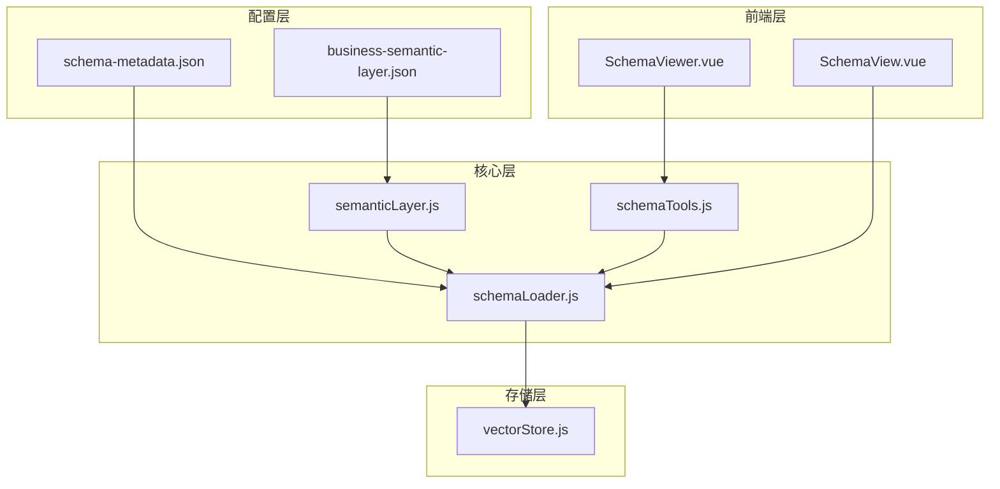
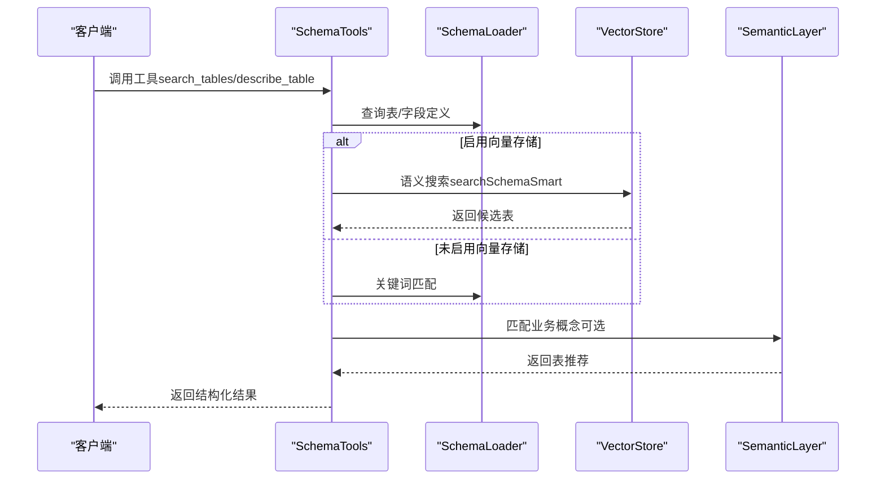
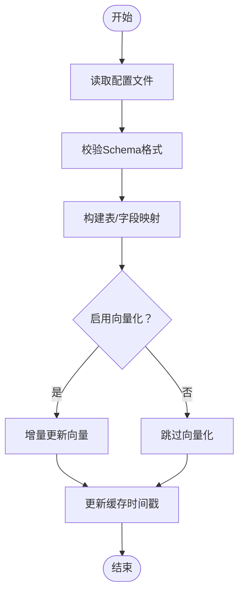
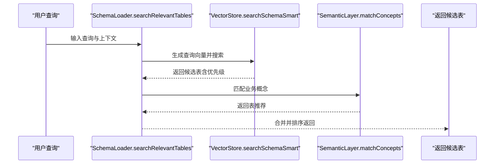
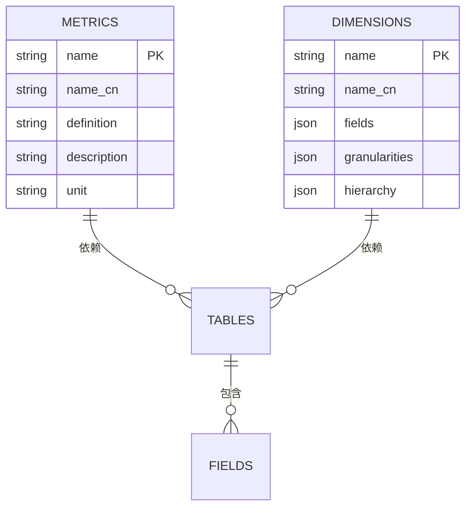
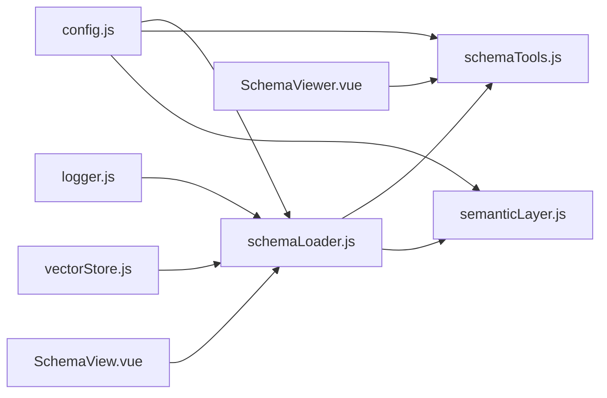

# Schema概览

<cite>
**本文引用的文件**
- [schemaLoader.js](file://backend/src/core/schemaLoader.js)
- [schemaTools.js](file://backend/src/core/schemaTools.js)
- [semanticLayer.js](file://backend/src/core/semanticLayer.js)
- [config.js](file://backend/src/core/config.js)
- [vectorStore.js](file://backend/src/memory/vectorStore.js)
- [logger.js](file://backend/src/utils/logger.js)
- [schema-metadata.json](file://backend/config/schema-metadata.json)
- [schema-metadata.example.json](file://backend/config/schema-metadata.example.json)
- [business-semantic-layer.json](file://backend/config/business-semantic-layer.json)
- [SchemaViewer.vue](file://frontend/src/components/SchemaViewer.vue)
- [SchemaView.vue](file://frontend/src/views/SchemaView.vue)
- [NL2SQL-进度追踪.md](file://docs/NL2SQL-进度追踪.md)
- [记忆系统优化计划.md](file://docs/记忆系统优化计划.md)
</cite>

## 目录
1. [简介](#简介)
2. [项目结构](#项目结构)
3. [核心组件](#核心组件)
4. [架构总览](#架构总览)
5. [详细组件分析](#详细组件分析)
6. [依赖分析](#依赖分析)
7. [性能考量](#性能考量)
8. [故障排查指南](#故障排查指南)
9. [结论](#结论)
10. [附录](#附录)

## 简介
本文件面向NL2SQL Schema系统，系统性阐述Schema的整体架构与设计理念，涵盖表定义、指标、维度三大核心类型，并深入解析Schema数据结构设计原则（字段类型、约束关系、业务语义映射）、加载与缓存机制、更新与增量同步工作原理，同时提供Schema配置示例与最佳实践建议，帮助开发者与产品人员高效理解与使用Schema能力。

## 项目结构
Schema系统位于后端核心模块，围绕“配置驱动 + 向量化检索 + 业务语义层”的设计思路组织：
- 配置层：schema-metadata.json定义表结构、指标、维度与关系；business-semantic-layer.json定义业务概念映射。
- 核心层：schemaLoader负责Schema加载、校验、构建索引、向量化与搜索；schemaTools提供LLM可调用的Schema探索工具；semanticLayer负责业务概念匹配与表推荐。
- 存储层：vectorStore基于LanceDB实现Schema与查询历史的向量存储与智能检索。
- 前端层：SchemaViewer与SchemaView提供Schema浏览与交互。

**图表来源**
- [schemaLoader.js:1-120](file://backend/src/core/schemaLoader.js#L1-L120)
- [schemaTools.js:1-60](file://backend/src/core/schemaTools.js#L1-L60)
- [semanticLayer.js:1-50](file://backend/src/core/semanticLayer.js#L1-L50)
- [vectorStore.js:1-60](file://backend/src/memory/vectorStore.js#L1-L60)
- [schema-metadata.json:1-40](file://backend/config/schema-metadata.json#L1-L40)
- [business-semantic-layer.json:1-40](file://backend/config/business-semantic-layer.json#L1-L40)
- [SchemaViewer.vue:1-40](file://frontend/src/components/SchemaViewer.vue#L1-L40)
- [SchemaView.vue:1-40](file://frontend/src/views/SchemaView.vue#L1-L40)

**章节来源**
- [schemaLoader.js:1-120](file://backend/src/core/schemaLoader.js#L1-L120)
- [schemaTools.js:1-60](file://backend/src/core/schemaTools.js#L1-L60)
- [semanticLayer.js:1-50](file://backend/src/core/semanticLayer.js#L1-L50)
- [vectorStore.js:1-60](file://backend/src/memory/vectorStore.js#L1-L60)
- [schema-metadata.json:1-40](file://backend/config/schema-metadata.json#L1-L40)
- [business-semantic-layer.json:1-40](file://backend/config/business-semantic-layer.json#L1-L40)
- [SchemaViewer.vue:1-40](file://frontend/src/components/SchemaViewer.vue#L1-L40)
- [SchemaView.vue:1-40](file://frontend/src/views/SchemaView.vue#L1-L40)

## 核心组件
- Schema加载器（schemaLoader）：负责从JSON配置加载Schema，构建表/字段映射，提供查询接口，执行Schema校验，支持向量化与语义搜索。
- Schema工具层（schemaTools）：提供LLM可调用的工具集（搜索表、描述表、查询业务知识、预览表），并维护Level 1索引缓存。
- 业务语义层（semanticLayer）：将业务概念映射到物理表/字段，支持别名识别、数据源映射、查询模式匹配与表推荐。
- 向量存储（vectorStore）：基于LanceDB实现Schema与查询历史的向量存储、智能检索与增量更新。
- 配置中心（config）：集中管理Schema配置、缓存策略、向量化开关等。
- 前端Schema视图（SchemaViewer/SchemaView）：提供Schema浏览、搜索与交互。

**章节来源**
- [schemaLoader.js:69-122](file://backend/src/core/schemaLoader.js#L69-L122)
- [schemaTools.js:25-35](file://backend/src/core/schemaTools.js#L25-L35)
- [semanticLayer.js:48-73](file://backend/src/core/semanticLayer.js#L48-L73)
- [vectorStore.js:233-263](file://backend/src/memory/vectorStore.js#L233-L263)
- [config.js:240-250](file://backend/src/core/config.js#L240-L250)
- [SchemaViewer.vue:1-40](file://frontend/src/components/SchemaViewer.vue#L1-L40)
- [SchemaView.vue:1-40](file://frontend/src/views/SchemaView.vue#L1-L40)

## 架构总览
Schema系统采用“配置驱动 + 向量化检索 + 业务语义层”的三层架构：
- 配置驱动：Schema元数据以JSON配置文件形式管理，支持版本化与增量更新。
- 向量化检索：将表级描述向量化，结合智能搜索与过滤策略，提升表推荐与语义匹配精度。
- 业务语义层：抽象业务概念，实现跨表/跨数据源的语义对齐与推荐。

**图表来源**
- [schemaTools.js:225-256](file://backend/src/core/schemaTools.js#L225-L256)
- [schemaLoader.js:562-652](file://backend/src/core/schemaLoader.js#L562-L652)
- [vectorStore.js:452-538](file://backend/src/memory/vectorStore.js#L452-L538)
- [semanticLayer.js:134-167](file://backend/src/core/semanticLayer.js#L134-L167)

## 详细组件分析

### Schema数据结构与设计原则
- 表定义（tables）：包含表名、中文名、描述、字段数组。字段包含名称、中文名、类型、描述、主键标记、外键、时间粒度、聚合能力等。
- 指标（metrics）：定义业务指标的名称、中文名、定义（表达式）、描述、单位等，用于自然语言到SQL的映射。
- 维度（dimensions）：定义维度名称、中文名、字段集合、层级关系、时间粒度等，支撑多维分析。
- 关系（relationships）：定义表间关系类型（如MANY_TO_ONE）与描述，辅助JOIN推理。

设计原则：
- 字段类型与约束：通过字段类型与主键/外键标记明确数据约束，支持SQL生成与校验。
- 业务语义映射：通过中文名、描述、时间粒度、聚合能力等增强语义表达，便于LLM理解。
- 可扩展性：通过配置文件与工具层解耦，支持动态扩展与增量更新。

**章节来源**
- [schema-metadata.json:4-127](file://backend/config/schema-metadata.json#L4-L127)
- [schema-metadata.json:128-289](file://backend/config/schema-metadata.json#L128-L289)
- [schema-metadata.json:290-475](file://backend/config/schema-metadata.json#L290-L475)
- [schema-metadata.json:476-685](file://backend/config/schema-metadata.json#L476-L685)
- [schema-metadata.json:686-800](file://backend/config/schema-metadata.json#L686-L800)
- [schema-metadata.example.json:4-232](file://backend/config/schema-metadata.example.json#L4-L232)

### Schema加载与缓存机制
- 加载流程：读取配置文件 -> 校验Schema格式 -> 构建表/字段映射 -> 可选向量化 -> 记录缓存时间戳。
- 缓存策略：内存中维护schemaData与映射表，支持缓存过期时间配置；前端Level 1索引也具备缓存与失效控制。
- 安全校验：提供SQL白名单与禁止关键字检查，保障查询安全。

**图表来源**
- [schemaLoader.js:69-122](file://backend/src/core/schemaLoader.js#L69-L122)
- [schemaLoader.js:161-189](file://backend/src/core/schemaLoader.js#L161-L189)
- [schemaLoader.js:201-276](file://backend/src/core/schemaLoader.js#L201-L276)
- [config.js:240-250](file://backend/src/core/config.js#L240-L250)

**章节来源**
- [schemaLoader.js:69-122](file://backend/src/core/schemaLoader.js#L69-L122)
- [schemaLoader.js:161-189](file://backend/src/core/schemaLoader.js#L161-L189)
- [schemaLoader.js:201-276](file://backend/src/core/schemaLoader.js#L201-L276)
- [schemaTools.js:136-173](file://backend/src/core/schemaTools.js#L136-L173)
- [config.js:240-250](file://backend/src/core/config.js#L240-L250)

### 语义搜索与表推荐
- 语义搜索：将查询文本与表级描述向量化，结合智能搜索策略（游戏提及优先、平台表优先、原始日志优先）进行重排序。
- 关键词匹配：作为回退策略，基于表名、中文名、描述与字段名进行匹配与打分。
- 业务概念匹配：semanticLayer将业务术语映射到物理表/字段，提升推荐准确性。

**图表来源**
- [schemaLoader.js:562-652](file://backend/src/core/schemaLoader.js#L562-L652)
- [vectorStore.js:452-538](file://backend/src/memory/vectorStore.js#L452-L538)
- [semanticLayer.js:134-167](file://backend/src/core/semanticLayer.js#L134-L167)

**章节来源**
- [schemaLoader.js:562-652](file://backend/src/core/schemaLoader.js#L562-L652)
- [vectorStore.js:452-538](file://backend/src/memory/vectorStore.js#L452-L538)
- [semanticLayer.js:134-167](file://backend/src/core/semanticLayer.js#L134-L167)

### 指标与维度的定义与使用
- 指标（metrics）：通过定义表达式与单位，将自然语言指标映射到SQL聚合，支持LLM生成与校验。
- 维度（dimensions）：定义字段集合、层级关系与时间粒度，支撑多维分析与时间序列分析。

**图表来源**
- [schema-metadata.example.json:253-296](file://backend/config/schema-metadata.example.json#L253-L296)
- [schema-metadata.example.json:297-326](file://backend/config/schema-metadata.example.json#L297-L326)

**章节来源**
- [schema-metadata.example.json:253-296](file://backend/config/schema-metadata.example.json#L253-L296)
- [schema-metadata.example.json:297-326](file://backend/config/schema-metadata.example.json#L297-L326)

### 业务语义层与概念映射
- 概念映射：将“老平台”、“新平台”、“充值”、“注册”等业务术语映射到具体表/字段与数据源。
- 查询模式：定义典型查询模式（如“玩家筛选+行为分析”），指导表推荐与SQL生成。
- 字段值映射：对game_id、platform_type等常见字段建立用户术语到真实值的映射。

**章节来源**
- [business-semantic-layer.json:5-121](file://backend/config/business-semantic-layer.json#L5-L121)
- [business-semantic-layer.json:123-148](file://backend/config/business-semantic-layer.json#L123-L148)
- [business-semantic-layer.json:150-187](file://backend/config/business-semantic-layer.json#L150-L187)
- [semanticLayer.js:134-167](file://backend/src/core/semanticLayer.js#L134-L167)

### 前端Schema浏览与交互
- SchemaViewer：弹窗式查看Schema，支持搜索、折叠展开、主键标识与关系展示。
- SchemaView：完整页面展示表结构、指标、维度与关系，支持标签页切换与统计信息。

**章节来源**
- [SchemaViewer.vue:1-87](file://frontend/src/components/SchemaViewer.vue#L1-L87)
- [SchemaViewer.vue:157-182](file://frontend/src/components/SchemaViewer.vue#L157-L182)
- [SchemaView.vue:1-146](file://frontend/src/views/SchemaView.vue#L1-L146)
- [SchemaView.vue:185-200](file://frontend/src/views/SchemaView.vue#L185-L200)

## 依赖分析
Schema系统各模块之间的依赖关系如下：
- schemaLoader依赖配置中心、日志模块、向量存储与LLM服务。
- schemaTools依赖schemaLoader与配置中心，提供工具定义与执行。
- semanticLayer依赖配置中心与schemaLoader，提供业务概念匹配与表推荐。
- vectorStore依赖配置中心与日志模块，提供向量存储与检索。
- 前端组件依赖API服务与后端Schema接口。

**图表来源**
- [config.js:16-50](file://backend/src/core/config.js#L16-L50)
- [schemaLoader.js:15-27](file://backend/src/core/schemaLoader.js#L15-L27)
- [schemaTools.js:17-20](file://backend/src/core/schemaTools.js#L17-L20)
- [semanticLayer.js:14-18](file://backend/src/core/semanticLayer.js#L14-L18)
- [vectorStore.js:14-24](file://backend/src/memory/vectorStore.js#L14-L24)
- [SchemaViewer.vue:103-104](file://frontend/src/components/SchemaViewer.vue#L103-L104)
- [SchemaView.vue:162-163](file://frontend/src/views/SchemaView.vue#L162-L163)

**章节来源**
- [config.js:16-50](file://backend/src/core/config.js#L16-L50)
- [schemaLoader.js:15-27](file://backend/src/core/schemaLoader.js#L15-L27)
- [schemaTools.js:17-20](file://backend/src/core/schemaTools.js#L17-L20)
- [semanticLayer.js:14-18](file://backend/src/core/semanticLayer.js#L14-L18)
- [vectorStore.js:14-24](file://backend/src/memory/vectorStore.js#L14-L24)
- [SchemaViewer.vue:103-104](file://frontend/src/components/SchemaViewer.vue#L103-L104)
- [SchemaView.vue:162-163](file://frontend/src/views/SchemaView.vue#L162-L163)

## 性能考量
- 向量化与智能搜索：通过表级向量化与智能重排序减少无关表干扰，提升召回质量与速度。
- 缓存策略：内存缓存与前端Level 1索引缓存降低重复加载与计算成本。
- 增量更新：基于内容哈希的upsert策略避免重复Embedding调用，减少系统抖动。
- 日志与监控：统一日志记录与运行时统计，便于性能分析与问题定位。

**章节来源**
- [vectorStore.js:452-538](file://backend/src/memory/vectorStore.js#L452-L538)
- [schemaTools.js:136-173](file://backend/src/core/schemaTools.js#L136-L173)
- [vectorStore.js:799-800](file://backend/src/memory/vectorStore.js#L799-L800)
- [logger.js:263-309](file://backend/src/utils/logger.js#L263-L309)

## 故障排查指南
- Schema加载失败：检查配置文件路径与格式，确认tables与fields字段完整性；查看日志错误信息。
- 向量数据库未初始化：确认LanceDB路径与权限，检查初始化日志；若失败，语义搜索将回退到关键词匹配。
- 业务概念未匹配：检查business-semantic-layer.json配置，确认别名与映射关系；必要时扩展查询模式。
- SQL安全校验失败：检查白名单与禁止关键字配置，确保查询符合安全策略。

**章节来源**
- [schemaLoader.js:77-81](file://backend/src/core/schemaLoader.js#L77-L81)
- [schemaLoader.js:118-122](file://backend/src/core/schemaLoader.js#L118-L122)
- [vectorStore.js:233-263](file://backend/src/memory/vectorStore.js#L233-L263)
- [semanticLayer.js:48-73](file://backend/src/core/semanticLayer.js#L48-L73)
- [config.js:140-170](file://backend/src/core/config.js#L140-L170)

## 结论
NL2SQL Schema系统通过“配置驱动 + 向量化检索 + 业务语义层”的架构，实现了从Schema定义到自然语言查询的高效映射。其设计强调可扩展性、可维护性与性能优化，既满足当前业务需求，也为未来扩展提供了清晰路径。建议在实际落地中持续完善Schema配置、强化业务概念映射，并结合增量更新与智能搜索策略，进一步提升系统稳定性与用户体验。

## 附录

### Schema配置示例与最佳实践
- 配置文件位置与命名：schema-metadata.json（生产）、schema-metadata.example.json（示例）。
- 指标与维度定义：参考示例文件中的metrics与dimensions字段，明确表达式、字段集合与粒度。
- 业务语义层：在business-semantic-layer.json中完善概念映射与查询模式，提升表推荐准确性。
- 前端展示：利用SchemaViewer与SchemaView进行Schema浏览与交互，支持搜索与折叠展示。

**章节来源**
- [schema-metadata.json:1-40](file://backend/config/schema-metadata.json#L1-L40)
- [schema-metadata.example.json:1-40](file://backend/config/schema-metadata.example.json#L1-L40)
- [business-semantic-layer.json:1-40](file://backend/config/business-semantic-layer.json#L1-L40)
- [SchemaViewer.vue:1-87](file://frontend/src/components/SchemaViewer.vue#L1-L87)
- [SchemaView.vue:1-146](file://frontend/src/views/SchemaView.vue#L1-L146)