# Schema端点详解

<cite>
**本文档引用的文件**
- [routes.js](file://backend/src/core/routes.js)
- [schemaLoader.js](file://backend/src/core/schemaLoader.js)
- [schemaTools.js](file://backend/src/core/schemaTools.js)
- [vectorStore.js](file://backend/src/memory/vectorStore.js)
- [config.js](file://backend/src/core/config.js)
- [schema-metadata.json.backup](file://backend/config/schema-metadata.json.backup)
- [api.js](file://frontend/src/utils/api.js)
- [SchemaView.vue](file://frontend/src/views/SchemaView.vue)
</cite>

## 目录
1. [简介](#简介)
2. [项目结构](#项目结构)
3. [核心组件](#核心组件)
4. [架构概览](#架构概览)
5. [详细组件分析](#详细组件分析)
6. [依赖分析](#依赖分析)
7. [性能考虑](#性能考虑)
8. [故障排除指南](#故障排除指南)
9. [结论](#结论)

## 简介

NL2SQL项目是一个基于自然语言生成SQL查询的智能系统，Schema端点是该系统的核心API接口。本文档深入解析三个核心Schema端点：`GET /api/schema`、`GET /api/schema/tables/:tableName`、`GET /api/schema/search`的完整实现。

这些端点提供了完整的Schema元数据查询能力，包括：
- 获取完整Schema信息（表、指标、维度）
- 查询特定表的详细信息
- 基于关键词的Schema搜索
- 语义化的Schema发现和推荐

## 项目结构

NL2SQL项目采用前后端分离架构，核心后端逻辑位于`backend/src/core/`目录，前端界面位于`frontend/src/`目录。

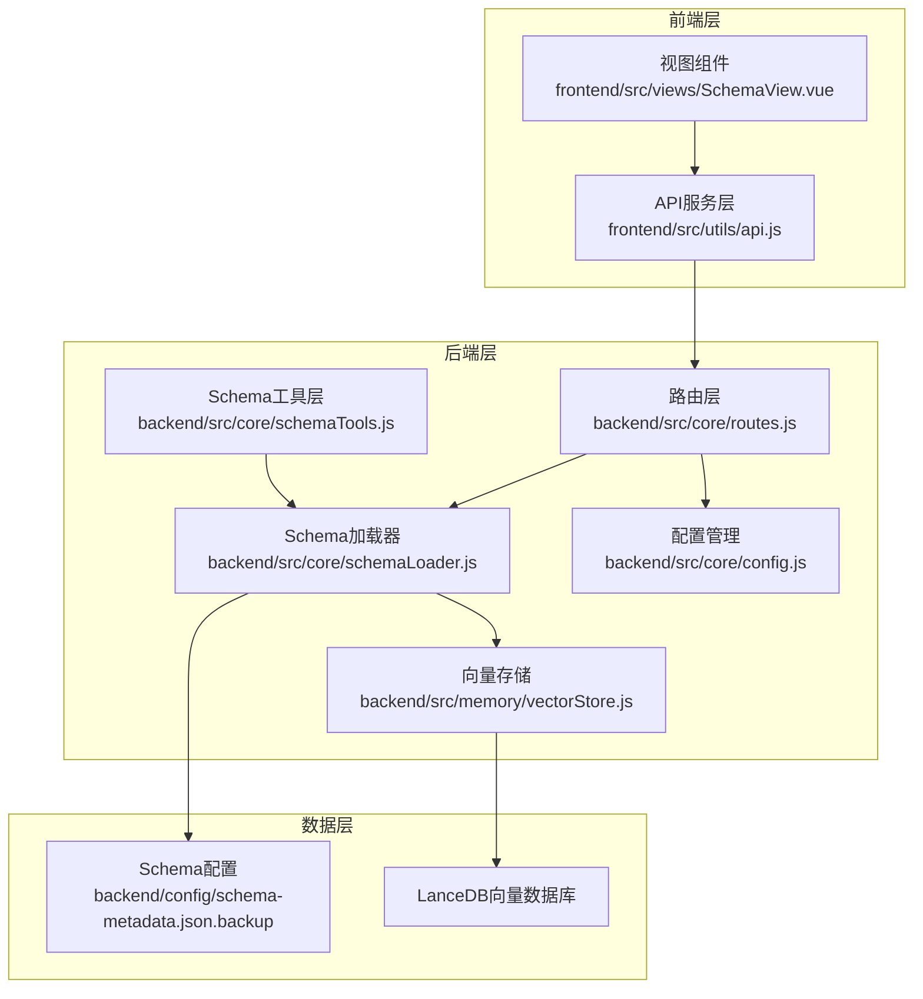

**图表来源**
- [routes.js:1-1037](file://backend/src/core/routes.js#L1-L1037)
- [schemaLoader.js:1-1172](file://backend/src/core/schemaLoader.js#L1-L1172)
- [vectorStore.js:1-881](file://backend/src/memory/vectorStore.js#L1-L881)

**章节来源**
- [routes.js:1-1037](file://backend/src/core/routes.js#L1-L1037)
- [schemaLoader.js:1-1172](file://backend/src/core/schemaLoader.js#L1-L1172)
- [vectorStore.js:1-881](file://backend/src/memory/vectorStore.js#L1-L881)

## 核心组件

### Schema端点架构

三个核心Schema端点构成了完整的Schema查询体系：

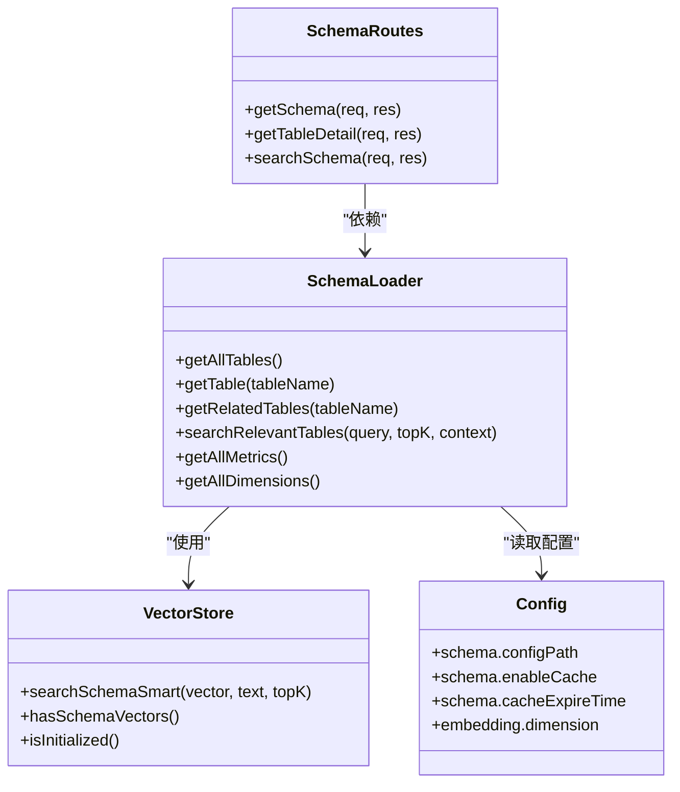

**图表来源**
- [routes.js:143-250](file://backend/src/core/routes.js#L143-L250)
- [schemaLoader.js:428-710](file://backend/src/core/schemaLoader.js#L428-L710)
- [vectorStore.js:440-538](file://backend/src/memory/vectorStore.js#L440-L538)

### 端点关系图

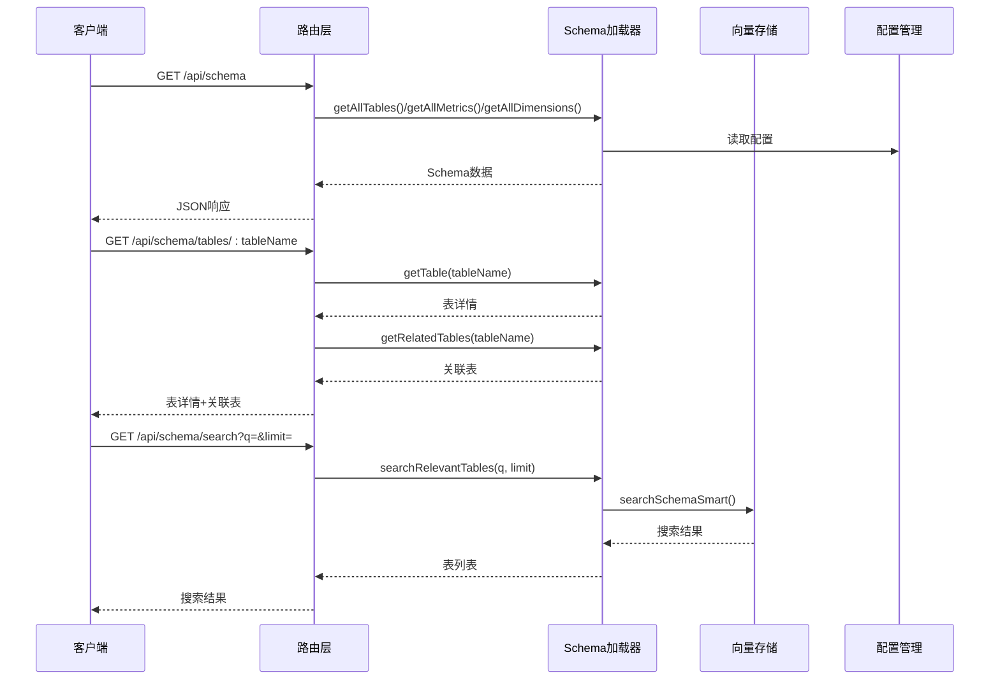

**图表来源**
- [routes.js:143-250](file://backend/src/core/routes.js#L143-L250)
- [schemaLoader.js:562-652](file://backend/src/core/schemaLoader.js#L562-L652)
- [vectorStore.js:452-538](file://backend/src/memory/vectorStore.js#L452-L538)

**章节来源**
- [routes.js:143-250](file://backend/src/core/routes.js#L143-L250)
- [schemaLoader.js:428-710](file://backend/src/core/schemaLoader.js#L428-L710)
- [vectorStore.js:440-538](file://backend/src/memory/vectorStore.js#L440-L538)

## 架构概览

### 系统架构设计

NL2SQL的Schema端点采用分层架构设计，确保了良好的可维护性和扩展性：

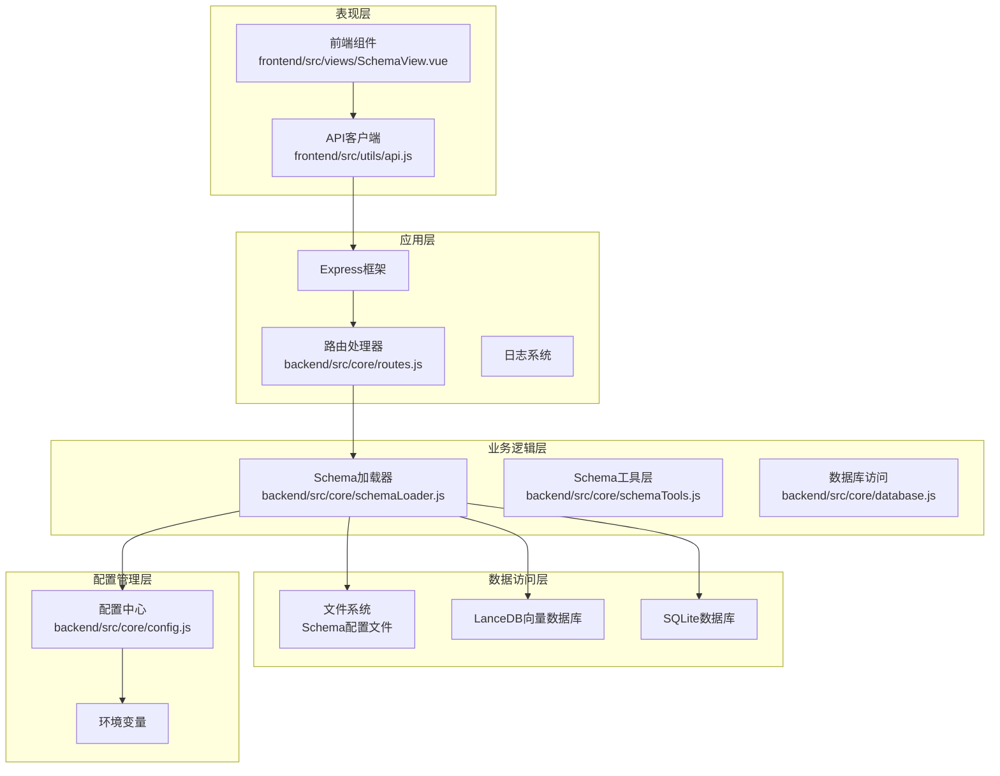

**图表来源**
- [routes.js:1-1037](file://backend/src/core/routes.js#L1-L1037)
- [schemaLoader.js:1-1172](file://backend/src/core/schemaLoader.js#L1-L1172)
- [config.js:1-398](file://backend/src/core/config.js#L1-L398)

### 数据流架构

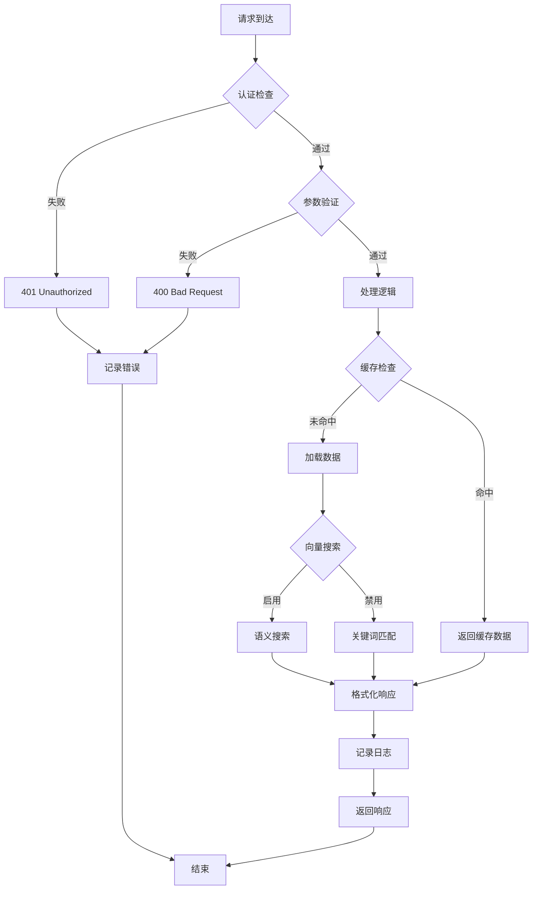

**图表来源**
- [routes.js:143-250](file://backend/src/core/routes.js#L143-L250)
- [schemaLoader.js:562-652](file://backend/src/core/schemaLoader.js#L562-L652)

**章节来源**
- [routes.js:1-1037](file://backend/src/core/routes.js#L1-L1037)
- [schemaLoader.js:1-1172](file://backend/src/core/schemaLoader.js#L1-L1172)
- [config.js:234-250](file://backend/src/core/config.js#L234-L250)

## 详细组件分析

### GET /api/schema 端点

#### 端点定义与功能

`GET /api/schema` 是Schema查询的核心端点，提供多种查询模式：

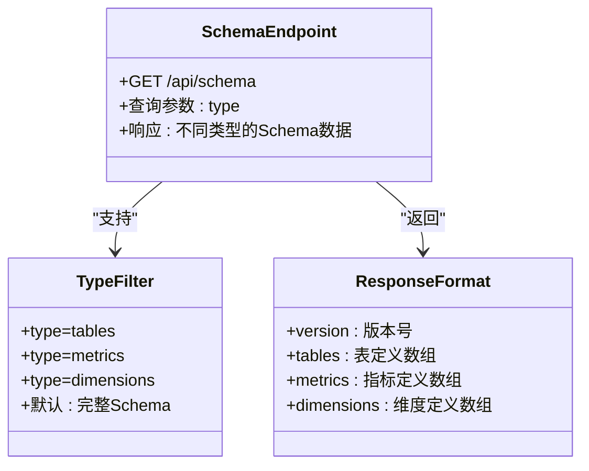

**图表来源**
- [routes.js:143-186](file://backend/src/core/routes.js#L143-L186)

#### 请求参数详解

| 参数名 | 类型 | 必填 | 默认值 | 描述 |
|--------|------|------|--------|------|
| type | string | 否 | 无 | 类型筛选参数，可选值：`tables`、`metrics`、`dimensions` |

#### 响应格式分析

**完整Schema响应结构：**
```json
{
  "version": "1.0",
  "tables": [
    {
      "name": "表名",
      "name_cn": "中文名",
      "description": "表描述",
      "fields": [
        {
          "name": "字段名",
          "name_cn": "中文名",
          "type": "字段类型",
          "description": "字段描述",
          "is_primary": true,
          "foreign_key": "外键信息"
        }
      ]
    }
  ],
  "metrics": [
    {
      "name": "指标名",
      "name_cn": "中文名", 
      "definition": "指标定义",
      "description": "指标描述",
      "unit": "单位"
    }
  ],
  "dimensions": [
    {
      "name": "维度名",
      "name_cn": "中文名",
      "fields": ["字段1", "字段2"],
      "granularities": ["day", "week", "month"]
    }
  ]
}
```

**章节来源**
- [routes.js:143-186](file://backend/src/core/routes.js#L143-L186)
- [schema-metadata.json.backup:1-800](file://backend/config/schema-metadata.json.backup#L1-L800)

### GET /api/schema/tables/:tableName 端点

#### 端点定义与功能

`GET /api/schema/tables/:tableName` 提供特定表的详细信息查询：

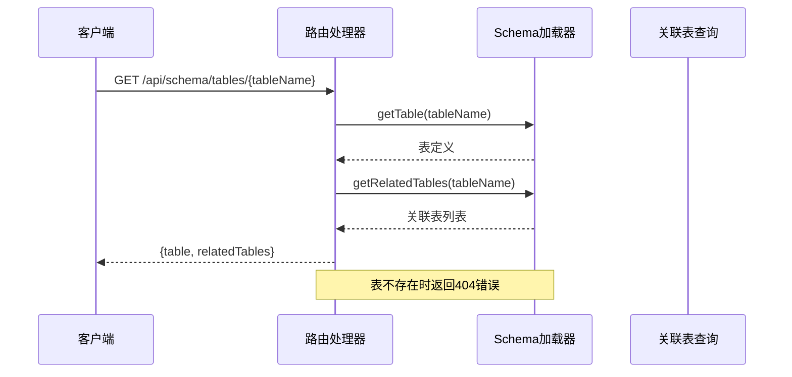

**图表来源**
- [routes.js:188-215](file://backend/src/core/routes.js#L188-L215)

#### 请求参数详解

| 参数名 | 类型 | 必填 | 描述 |
|--------|------|------|------|
| tableName | string | 是 | 表名（支持英文名或中文名） |

#### 响应格式分析

**成功响应结构：**
```json
{
  "table": {
    "name": "表名",
    "name_cn": "中文名",
    "description": "表描述",
    "fields": [
      {
        "name": "字段名",
        "name_cn": "中文名",
        "type": "字段类型",
        "description": "字段描述",
        "is_primary": true,
        "foreign_key": "外键信息"
      }
    ]
  },
  "relatedTables": ["表1", "表2", "表3"]
}
```

**错误响应结构：**
```json
{
  "error": "表不存在",
  "tableName": "表名"
}
```

**章节来源**
- [routes.js:188-215](file://backend/src/core/routes.js#L188-L215)
- [schemaLoader.js:432-522](file://backend/src/core/schemaLoader.js#L432-L522)

### GET /api/schema/search 端点

#### 端点定义与功能

`GET /api/schema/search` 提供基于关键词的Schema搜索功能，支持语义化搜索：

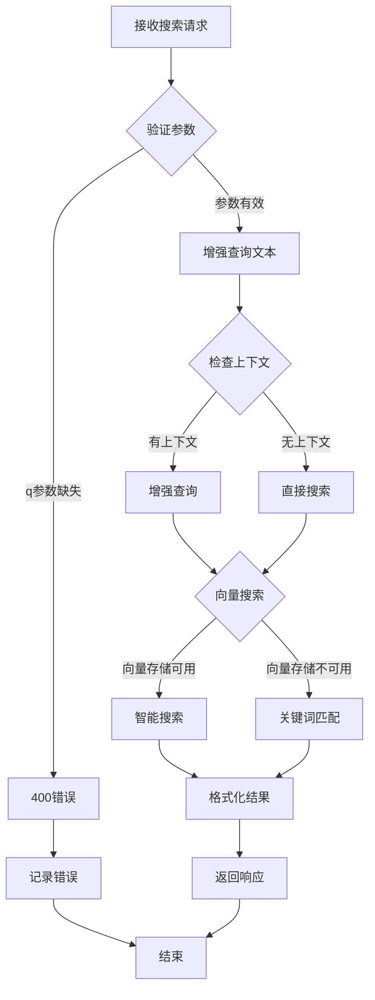

**图表来源**
- [routes.js:217-250](file://backend/src/core/routes.js#L217-L250)
- [schemaLoader.js:562-652](file://backend/src/core/schemaLoader.js#L562-L652)

#### 请求参数详解

| 参数名 | 类型 | 必填 | 默认值 | 描述 |
|--------|------|------|--------|------|
| q | string | 是 | 无 | 搜索关键词 |
| limit | number | 否 | 5 | 返回结果数量限制 |

#### 搜索算法详解

**智能搜索流程：**
1. **查询文本增强**：根据上下文信息（gameId、datasource）增强查询
2. **向量搜索**：使用语义相似度搜索相关表
3. **智能重排序**：基于游戏提及、平台优先级、数据类型等策略重排序
4. **结果过滤**：应用域标签和数据类型过滤
5. **结果限制**：返回指定数量的表定义

**章节来源**
- [routes.js:217-250](file://backend/src/core/routes.js#L217-L250)
- [schemaLoader.js:562-652](file://backend/src/core/schemaLoader.js#L562-L652)
- [vectorStore.js:452-538](file://backend/src/memory/vectorStore.js#L452-L538)

## 依赖分析

### 组件依赖关系

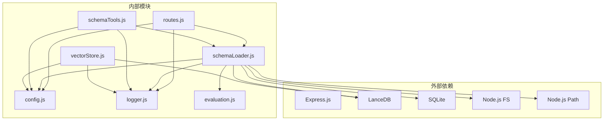

**图表来源**
- [routes.js:15-30](file://backend/src/core/routes.js#L15-L30)
- [schemaLoader.js:15-27](file://backend/src/core/schemaLoader.js#L15-L27)
- [vectorStore.js:14-24](file://backend/src/memory/vectorStore.js#L14-L24)

### 数据依赖分析

**Schema配置文件依赖：**
- 主配置文件：`backend/config/schema-metadata.json`
- 备份配置文件：`backend/config/schema-metadata.json.backup`
- 示例配置文件：`backend/config/schema-metadata.example.json`

**向量存储依赖：**
- LanceDB向量数据库：`backend/data/vectordb/`
- Schema向量表：`schema_vectors`
- 查询向量表：`query_vectors`

**章节来源**
- [schema-metadata.json.backup:1-800](file://backend/config/schema-metadata.json.backup#L1-L800)
- [vectorStore.js:206-324](file://backend/src/memory/vectorStore.js#L206-L324)

## 性能考虑

### 缓存策略

系统实现了多层次的缓存机制来提升性能：

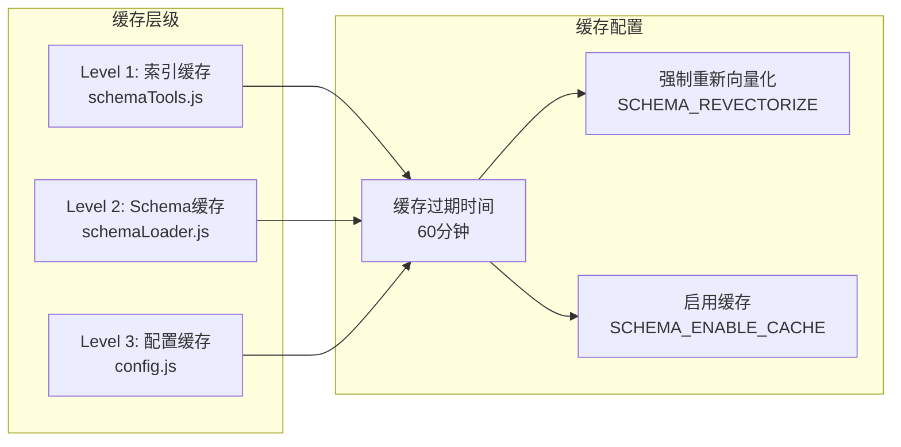

**图表来源**
- [schemaTools.js:25-173](file://backend/src/core/schemaTools.js#L25-L173)
- [schemaLoader.js:69-122](file://backend/src/core/schemaLoader.js#L69-L122)
- [config.js:240-250](file://backend/src/core/config.js#L240-L250)

### 性能优化措施

**1. 向量搜索优化**
- 使用智能搜索算法减少不必要的计算
- 支持元数据过滤降低搜索范围
- 实现优先级重排序提升相关性

**2. 缓存优化**
- Level 1索引缓存仅包含表名和描述
- Schema数据缓存包含完整结构信息
- 缓存过期时间可配置，默认1小时

**3. 内存优化**
- 流式处理大数据集
- 智能释放不再使用的资源
- 限制单次查询返回的行数

**章节来源**
- [schemaTools.js:136-173](file://backend/src/core/schemaTools.js#L136-L173)
- [schemaLoader.js:201-276](file://backend/src/core/schemaLoader.js#L201-L276)
- [config.js:240-250](file://backend/src/core/config.js#L240-L250)

## 故障排除指南

### 常见错误类型

**1. 参数验证错误**
- 缺少必需参数：返回400状态码
- 参数格式错误：返回400状态码
- 参数范围超出限制：返回400状态码

**2. 资源不存在错误**
- 表不存在：返回404状态码
- Schema配置文件不存在：返回500状态码

**3. 服务内部错误**
- 向量搜索失败：返回500状态码
- 数据库连接失败：返回500状态码
- 配置加载失败：返回500状态码

### 错误处理流程

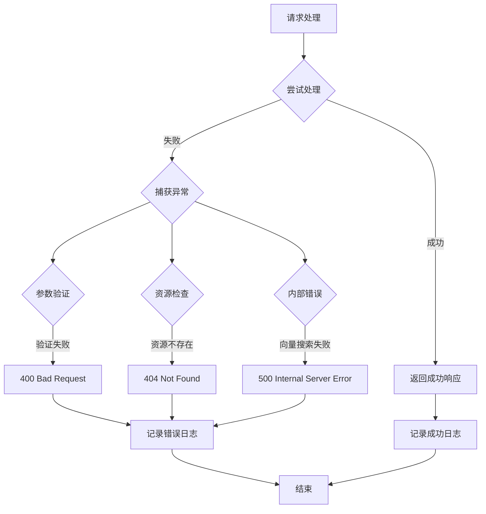

**图表来源**
- [routes.js:199-249](file://backend/src/core/routes.js#L199-L249)

### 调试建议

**1. 启用详细日志**
```bash
# 设置日志级别为debug
LOG_LEVEL=debug

# 启用详细错误信息
NODE_ENV=development
```

**2. 检查配置**
- 验证Schema配置文件路径
- 确认向量数据库连接正常
- 检查LLM API配置

**3. 性能监控**
- 监控缓存命中率
- 跟踪向量搜索性能
- 监控内存使用情况

**章节来源**
- [routes.js:199-249](file://backend/src/core/routes.js#L199-L249)
- [config.js:366-388](file://backend/src/core/config.js#L366-L388)

## 结论

NL2SQL的Schema端点提供了完整的Schema元数据查询能力，具有以下特点：

**技术优势：**
- 多层次缓存机制确保高性能
- 语义化搜索提升用户体验
- 模块化设计便于维护和扩展
- 完善的错误处理和日志记录

**应用场景：**
- 数据分析师快速发现相关表
- 开发者了解数据结构和关系
- 业务人员理解指标和维度
- 系统集成中的Schema查询

**未来发展方向：**
- 增强搜索算法的准确性
- 扩展Schema元数据的丰富程度
- 优化大规模数据集的查询性能
- 提供更丰富的Schema可视化功能

通过合理使用这些Schema端点，用户可以高效地理解和利用NL2SQL系统的Schema信息，为后续的自然语言查询奠定坚实基础。