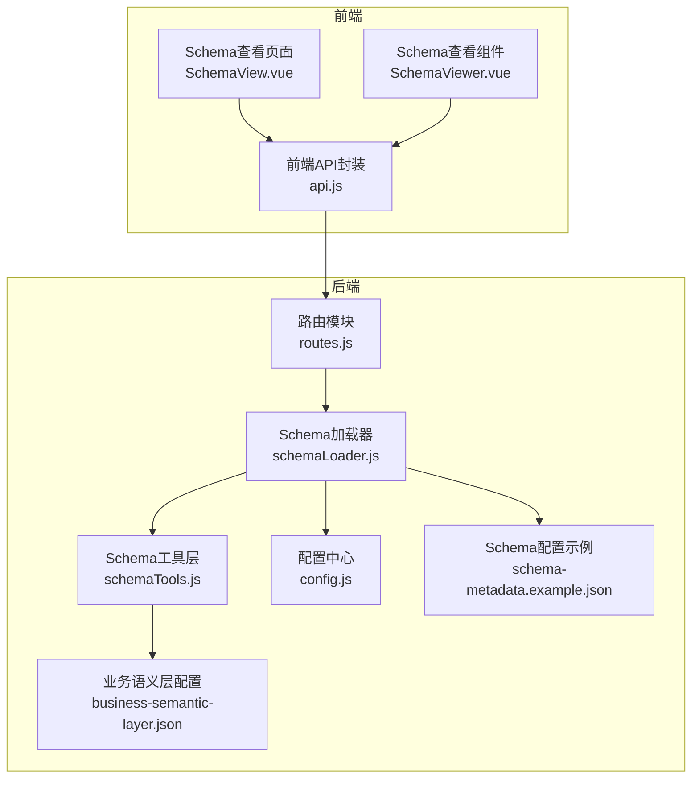
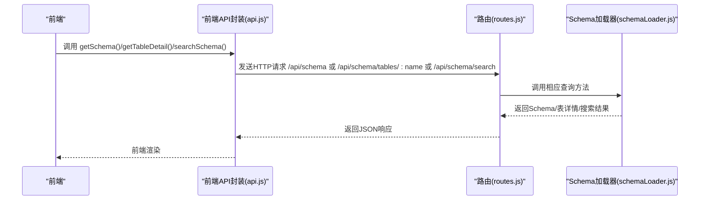
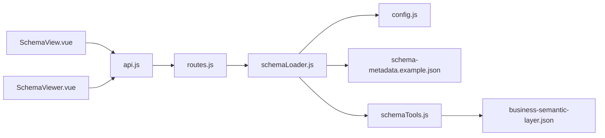

# Schema管理接口

<cite>
**本文引用的文件**
- [routes.js](file://backend/src/core/routes.js)
- [schemaLoader.js](file://backend/src/core/schemaLoader.js)
- [schemaTools.js](file://backend/src/core/schemaTools.js)
- [config.js](file://backend/src/core/config.js)
- [schema-metadata.example.json](file://backend/config/schema-metadata.example.json)
- [business-semantic-layer.json](file://backend/config/business-semantic-layer.json)
- [api.js](file://frontend/src/utils/api.js)
- [SchemaView.vue](file://frontend/src/views/SchemaView.vue)
- [SchemaViewer.vue](file://frontend/src/components/SchemaViewer.vue)
</cite>

## 目录
1. [简介](#简介)
2. [项目结构](#项目结构)
3. [核心组件](#核心组件)
4. [架构总览](#架构总览)
5. [详细组件分析](#详细组件分析)
6. [依赖分析](#依赖分析)
7. [性能考量](#性能考量)
8. [故障排查指南](#故障排查指南)
9. [结论](#结论)
10. [附录](#附录)

## 简介
本文档面向NL2SQL系统的Schema管理接口，聚焦以下端点：
- GET /api/schema：获取完整Schema或按类型筛选（tables/metrics/dimensions）
- GET /api/schema/tables/:tableName：获取指定表的详细信息及关联表
- GET /api/schema/search：基于关键词搜索相关表（支持语义检索与上下文增强）

文档同时解释Schema数据结构（表、指标、维度、关系）、缓存机制与性能优化策略，并提供查询、表详情获取、Schema搜索的完整示例与最佳实践。

## 项目结构
后端采用Express框架，Schema相关能力集中在核心模块中：
- 路由定义：/api/schema系列端点
- Schema加载与缓存：schemaLoader.js
- Schema工具与向量化：schemaTools.js
- 配置中心：config.js
- 示例Schema配置：schema-metadata.example.json、business-semantic-layer.json
- 前端调用：frontend/src/utils/api.js，页面组件SchemaView.vue与SchemaViewer.vue

图表来源
- [routes.js:140-250](file://backend/src/core/routes.js#L140-L250)
- [schemaLoader.js:1-120](file://backend/src/core/schemaLoader.js#L1-L120)
- [schemaTools.js:1-60](file://backend/src/core/schemaTools.js#L1-L60)
- [config.js:240-250](file://backend/src/core/config.js#L240-L250)
- [schema-metadata.example.json:1-328](file://backend/config/schema-metadata.example.json#L1-L328)
- [business-semantic-layer.json:1-189](file://backend/config/business-semantic-layer.json#L1-L189)

章节来源
- [routes.js:140-250](file://backend/src/core/routes.js#L140-L250)
- [schemaLoader.js:1-120](file://backend/src/core/schemaLoader.js#L1-L120)
- [schemaTools.js:1-60](file://backend/src/core/schemaTools.js#L1-L60)
- [config.js:240-250](file://backend/src/core/config.js#L240-L250)
- [schema-metadata.example.json:1-328](file://backend/config/schema-metadata.example.json#L1-L328)
- [business-semantic-layer.json:1-189](file://backend/config/business-semantic-layer.json#L1-L189)

## 核心组件
- 路由模块：定义Schema相关REST端点，负责参数解析、调用schemaLoader并返回标准化响应。
- Schema加载器：负责加载Schema配置、构建查找映射、缓存管理、向量化、搜索与匹配、SQL校验等。
- Schema工具层：提供LLM可调用的Schema探索工具（search_tables、describe_table、search_knowledge、peek_table），并实现Level 1索引缓存。
- 配置中心：集中管理Schema缓存、向量化、安全、日志等配置项。
- 示例Schema配置：定义表、字段、关系、指标、维度等元数据结构。

章节来源
- [routes.js:140-250](file://backend/src/core/routes.js#L140-L250)
- [schemaLoader.js:1-120](file://backend/src/core/schemaLoader.js#L1-L120)
- [schemaTools.js:1-60](file://backend/src/core/schemaTools.js#L1-L60)
- [config.js:240-250](file://backend/src/core/config.js#L240-L250)
- [schema-metadata.example.json:1-328](file://backend/config/schema-metadata.example.json#L1-L328)

## 架构总览
Schema管理接口的调用链路如下：
- 前端通过api.js发起HTTP请求
- Express路由解析参数并调用schemaLoader
- schemaLoader根据配置决定是否使用向量检索或关键词匹配
- 返回标准化JSON响应给前端渲染

图表来源
- [api.js:118-141](file://frontend/src/utils/api.js#L118-L141)
- [routes.js:140-250](file://backend/src/core/routes.js#L140-L250)
- [schemaLoader.js:432-709](file://backend/src/core/schemaLoader.js#L432-L709)

## 详细组件分析

### GET /api/schema
- 功能：获取完整Schema或按类型筛选
- 请求参数
  - type: 可选，支持 tables、metrics、dimensions
- 响应格式
  - 不带type：返回version、tables、metrics、dimensions
  - type=tables：返回tables数组
  - type=metrics：返回metrics数组
  - type=dimensions：返回dimensions数组
- 错误码
  - 200：成功
- 示例
  - GET /api/schema → 返回完整Schema
  - GET /api/schema?type=tables → 仅返回表定义
- 实现要点
  - 调用schemaLoader.getAllTables()/getAllMetrics()/getAllDimensions()
  - 支持按type分支返回

章节来源
- [routes.js:143-186](file://backend/src/core/routes.js#L143-L186)
- [schemaLoader.js:432-491](file://backend/src/core/schemaLoader.js#L432-L491)

### GET /api/schema/tables/:tableName
- 功能：获取指定表的详细信息及关联表
- 路径参数
  - tableName: 表名（支持英文或中文名）
- 响应格式
  - table: 表定义
  - relatedTables: 关联表名数组
- 错误码
  - 200：成功
  - 404：表不存在
- 示例
  - GET /api/schema/tables/sales_order → 返回表定义与关联表
- 实现要点
  - 调用schemaLoader.getTable()与getRelatedTables()
  - 若表不存在返回404

章节来源
- [routes.js:188-215](file://backend/src/core/routes.js#L188-L215)
- [schemaLoader.js:441-522](file://backend/src/core/schemaLoader.js#L441-L522)

### GET /api/schema/search
- 功能：搜索相关表（支持语义检索与上下文增强）
- 查询参数
  - q: 必填，搜索关键词
  - limit: 可选，默认5
- 响应格式
  - query: 原始查询
  - count: 匹配表数量
  - tables: 表定义数组
- 错误码
  - 200：成功
  - 400：缺少q参数
  - 500：内部错误
- 示例
  - GET /api/schema/search?q=充值&limit=5 → 返回相关表列表
- 实现要点
  - 调用schemaLoader.searchRelevantTables()
  - 支持根据game_id、datasource等上下文增强查询
  - 优先返回显式表名，再合并向量检索结果

章节来源
- [routes.js:217-250](file://backend/src/core/routes.js#L217-L250)
- [schemaLoader.js:562-652](file://backend/src/core/schemaLoader.js#L562-L652)

### Schema数据结构
- 表定义（tables）
  - name/name_cn/description/fields[]
  - fields[]包含name/name_cn/type/description/is_primary/foreign_key等
- 指标（metrics）
  - name/name_cn/definition/description/unit
- 维度（dimensions）
  - name/name_cn/fields/granularities/hierarchy
- 关系（relationships）
  - from/to/type/description

章节来源
- [schema-metadata.example.json:4-327](file://backend/config/schema-metadata.example.json#L4-L327)

### Schema缓存机制与性能优化
- Schema加载缓存
  - schemaLoader内部维护schemaData与映射表，加载完成后缓存
  - isCacheExpired()检查缓存是否过期
  - reload()可强制重新加载
- Level 1索引缓存（工具层）
  - schemaTools提供Level 1索引（仅表名+业务注释），带过期时间
  - getLevel1Index()支持强制刷新
- 向量化与智能搜索
  - vectorizeSchema()将表级表征向量化，支持增量更新
  - searchRelevantTables()优先使用向量检索，失败回退关键词匹配
  - 支持上下文增强（datasource、game_id）提升匹配精度
- 配置项
  - schema.enableCache、schema.cacheExpireTime、schema.revectorize
  - embedding.dimension、llm.timeout等影响性能

章节来源
- [schemaLoader.js:36-122](file://backend/src/core/schemaLoader.js#L36-L122)
- [schemaLoader.js:948-967](file://backend/src/core/schemaLoader.js#L948-L967)
- [schemaTools.js:25-173](file://backend/src/core/schemaTools.js#L25-L173)
- [schemaLoader.js:201-276](file://backend/src/core/schemaLoader.js#L201-L276)
- [schemaLoader.js:562-652](file://backend/src/core/schemaLoader.js#L562-L652)
- [config.js:240-250](file://backend/src/core/config.js#L240-L250)

### 前端集成与使用示例
- 前端API封装
  - api.js提供getSchema()、getTableDetail()、searchSchema()等方法
- 页面组件
  - SchemaView.vue：完整展示Schema（表、指标、维度、关系）
  - SchemaViewer.vue：弹窗式Schema查看与搜索
- 使用流程
  - 调用api.getSchema()获取完整Schema
  - 调用api.getTableDetail(tableName)获取表详情
  - 调用api.searchSchema(query, limit)进行搜索

章节来源
- [api.js:118-141](file://frontend/src/utils/api.js#L118-L141)
- [SchemaView.vue:185-200](file://frontend/src/views/SchemaView.vue#L185-L200)
- [SchemaViewer.vue:191-208](file://frontend/src/components/SchemaViewer.vue#L191-L208)

## 依赖分析
- 路由依赖Schema加载器
  - routes.js依赖schemaLoader导出的方法
- Schema加载器依赖
  - config.js提供缓存与向量化配置
  - schema-metadata.example.json提供Schema元数据
  - business-semantic-layer.json提供业务语义映射
  - schemaTools.js提供工具与Level 1索引
- 前端依赖
  - api.js封装HTTP调用
  - Vue组件消费API并渲染

图表来源
- [routes.js:140-250](file://backend/src/core/routes.js#L140-L250)
- [schemaLoader.js:1-120](file://backend/src/core/schemaLoader.js#L1-L120)
- [schemaTools.js:1-60](file://backend/src/core/schemaTools.js#L1-L60)
- [config.js:240-250](file://backend/src/core/config.js#L240-L250)
- [schema-metadata.example.json:1-328](file://backend/config/schema-metadata.example.json#L1-L328)
- [business-semantic-layer.json:1-189](file://backend/config/business-semantic-layer.json#L1-L189)
- [api.js:118-141](file://frontend/src/utils/api.js#L118-L141)

## 性能考量
- 缓存策略
  - Schema加载缓存：减少重复解析与构建映射的成本
  - Level 1索引缓存：降低LLM工具调用开销
  - 向量检索：优先语义匹配，失败回退关键词匹配
- 配置优化
  - 合理设置cacheExpireTime与revectorize
  - 控制embedding维度与LLM超时
- 前端体验
  - 搜索实时过滤、懒加载、骨架屏提升交互流畅度

[本节为通用指导，无需特定文件来源]

## 故障排查指南
- 常见错误与处理
  - 404：表不存在（/api/schema/tables/:tableName）
  - 400：缺少q参数（/api/schema/search）
  - 500：搜索失败（/api/schema/search）
- 日志与监控
  - 路由中间件记录请求日志
  - schemaLoader记录加载与向量化日志
  - 健康检查接口可用于快速诊断
- 建议排查步骤
  - 确认Schema配置文件存在且格式正确
  - 检查向量数据库初始化状态
  - 验证LLM API配置与超时设置
  - 使用GET /api/health与GET /api/health/detail确认组件状态

章节来源
- [routes.js:199-205](file://backend/src/core/routes.js#L199-L205)
- [routes.js:229-233](file://backend/src/core/routes.js#L229-L233)
- [routes.js:244-249](file://backend/src/core/routes.js#L244-L249)
- [schemaLoader.js:70-122](file://backend/src/core/schemaLoader.js#L70-L122)
- [routes.js:100-137](file://backend/src/core/routes.js#L100-L137)

## 结论
NL2SQL的Schema管理接口通过清晰的REST设计与强大的Schema加载/搜索能力，实现了“按需索取”的Schema探索模式。结合缓存与向量化技术，既保证了响应速度，又提升了语义检索的准确性。前端组件与API封装进一步降低了使用门槛，适合在多场景下快速集成与扩展。

[本节为总结性内容，无需特定文件来源]

## 附录

### API定义与示例

- GET /api/schema
  - 参数：type（可选，枚举：tables/metrics/dimensions）
  - 成功响应：200，返回对应Schema片段或完整Schema
  - 示例：GET /api/schema?type=tables

- GET /api/schema/tables/:tableName
  - 路径参数：tableName
  - 成功响应：200，返回table与relatedTables
  - 失败响应：404，返回错误信息
  - 示例：GET /api/schema/tables/sales_order

- GET /api/schema/search
  - 查询参数：q（必填）、limit（可选，默认5）
  - 成功响应：200，返回query、count、tables
  - 失败响应：400/500
  - 示例：GET /api/schema/search?q=充值&limit=5

章节来源
- [routes.js:143-186](file://backend/src/core/routes.js#L143-L186)
- [routes.js:188-215](file://backend/src/core/routes.js#L188-L215)
- [routes.js:217-250](file://backend/src/core/routes.js#L217-L250)

### Schema数据结构说明
- 表定义（tables[]）
  - 字段：name、name_cn、description、fields[]
  - 字段详情：name、name_cn、type、description、is_primary、foreign_key、aggregations、time_granularity等
- 指标（metrics[]）
  - 字段：name、name_cn、definition、description、unit
- 维度（dimensions[]）
  - 字段：name、name_cn、fields、granularities、hierarchy
- 关系（relationships[]）
  - 字段：from、to、type、description

章节来源
- [schema-metadata.example.json:4-327](file://backend/config/schema-metadata.example.json#L4-L327)

### 缓存与向量化配置
- schema.enableCache：是否启用Schema缓存
- schema.cacheExpireTime：缓存过期时间（毫秒）
- schema.revectorize：是否强制重新向量化
- embedding.dimension：向量维度
- llm.timeout：LLM请求超时

章节来源
- [config.js:240-250](file://backend/src/core/config.js#L240-L250)
- [schemaLoader.js:201-276](file://backend/src/core/schemaLoader.js#L201-L276)