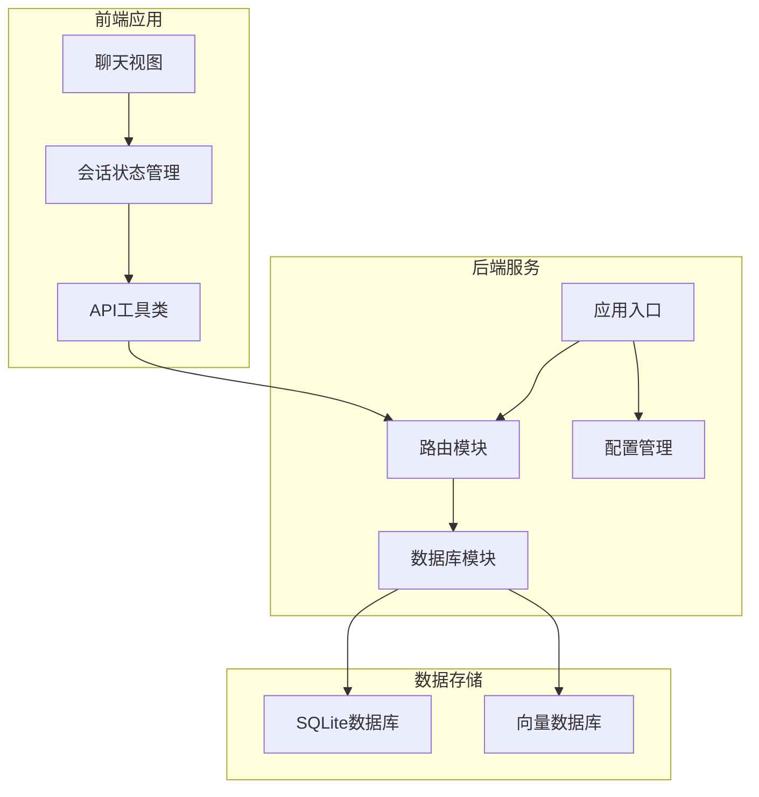
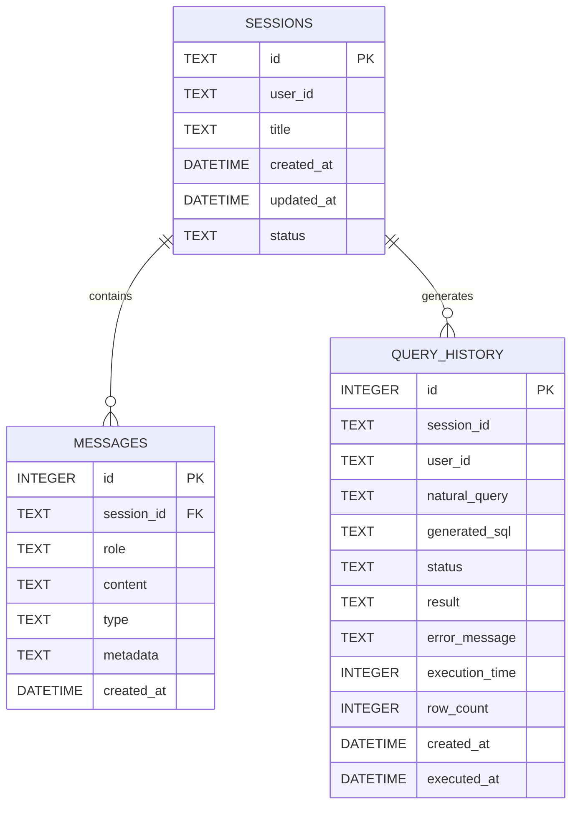
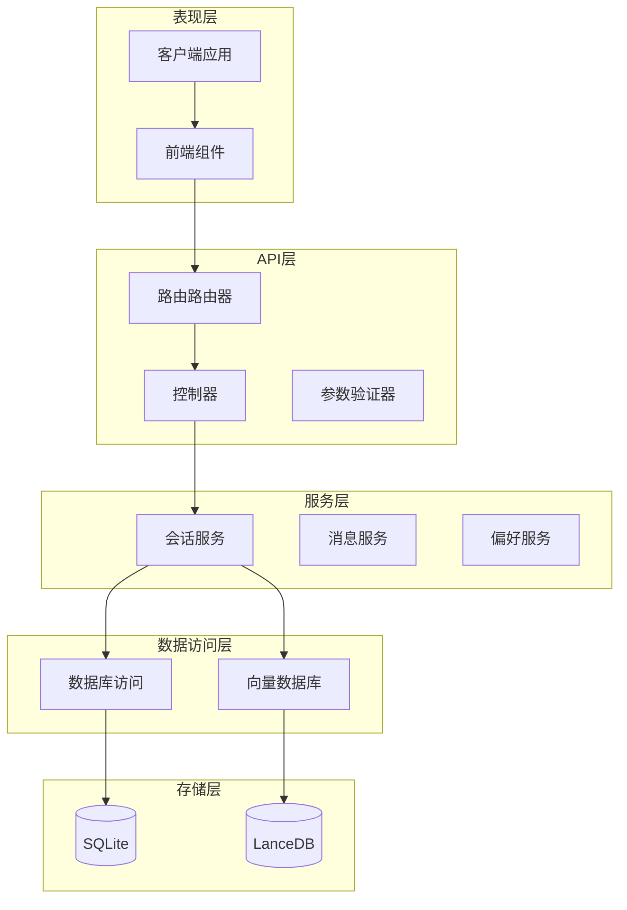
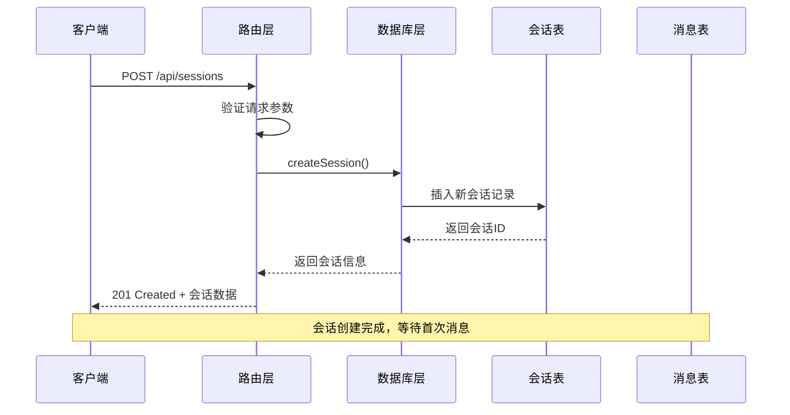
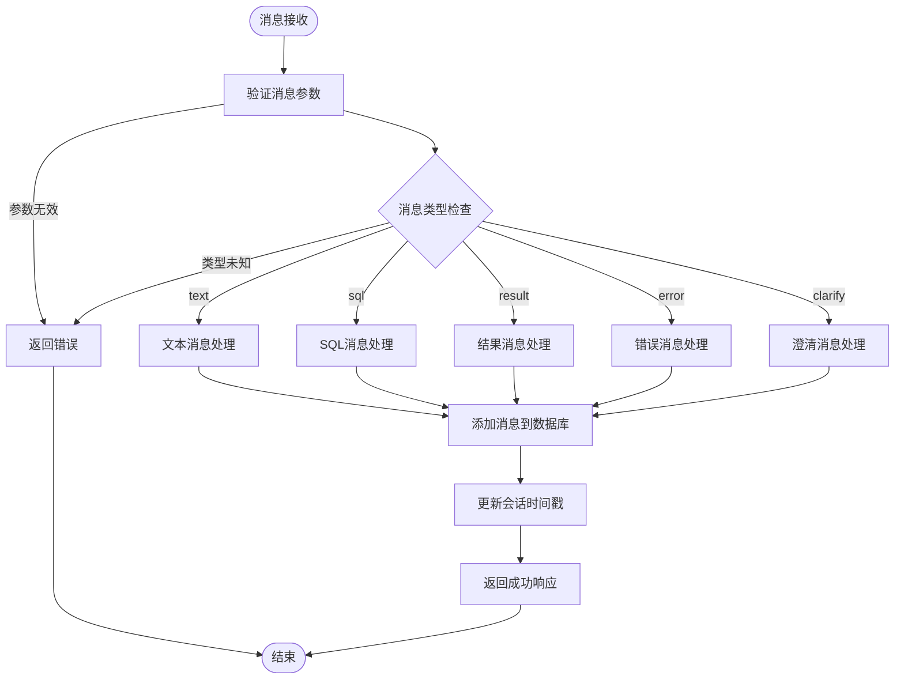
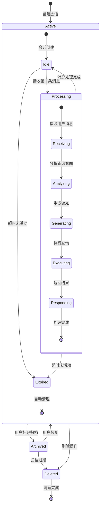
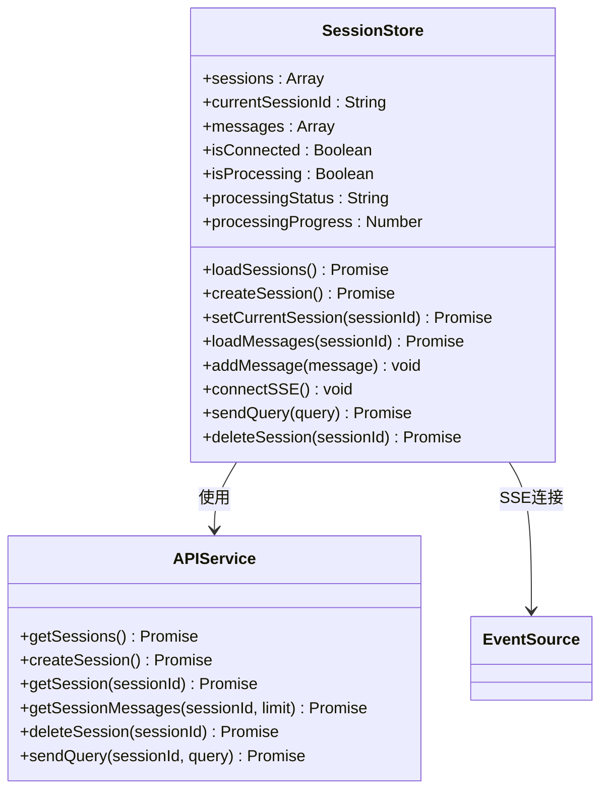
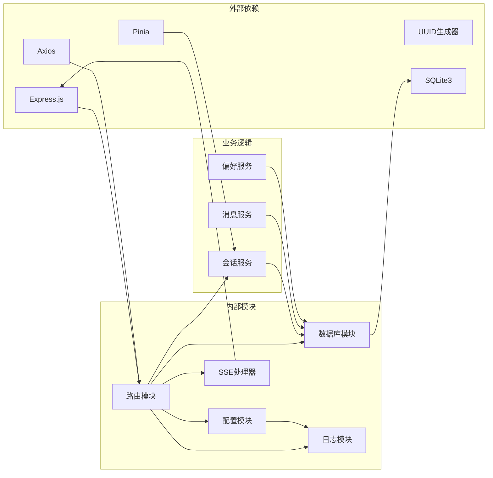
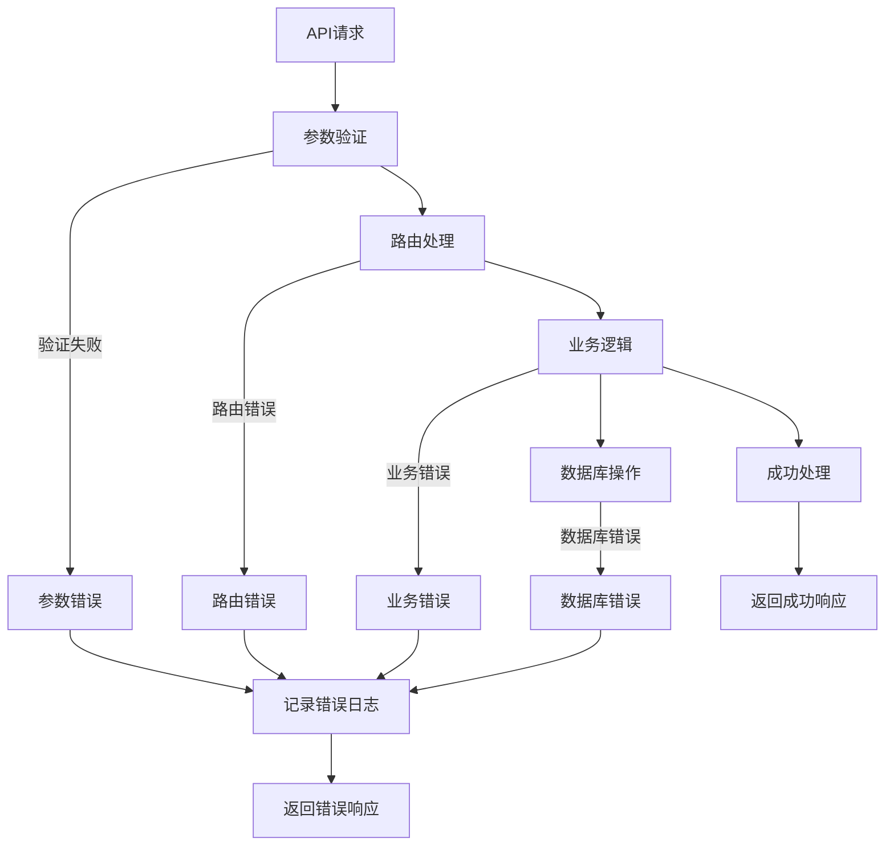

# 会话管理接口

<cite>
**本文档引用的文件**
- [routes.js](file://backend/src/core/routes.js)
- [database.js](file://backend/src/core/database.js)
- [session.js](file://backend/src/app.js)
- [config.js](file://backend/src/core/config.js)
- [api.js](file://frontend/src/utils/api.js)
- [session-store.js](file://frontend/src/stores/session.js)
</cite>

## 目录
1. [简介](#简介)
2. [项目结构](#项目结构)
3. [核心组件](#核心组件)
4. [架构概览](#架构概览)
5. [详细组件分析](#详细组件分析)
6. [依赖分析](#依赖分析)
7. [性能考虑](#性能考虑)
8. [故障排除指南](#故障排除指南)
9. [结论](#结论)

## 简介

NL2SQL会话管理接口是自然语言转SQL系统中的核心功能模块，负责管理用户的对话会话、消息历史和查询状态。该接口提供了完整的RESTful API，支持会话的创建、查询、删除和消息历史管理，为用户提供流畅的自然语言数据查询体验。

## 项目结构

NL2SQL项目采用前后端分离的架构设计，会话管理功能分布在后端API层和前端状态管理层：

**图表来源**
- [routes.js:1-1037](file://backend/src/core/routes.js#L1-L1037)
- [session.js:1-260](file://backend/src/app.js#L1-L260)

**章节来源**
- [routes.js:1-1037](file://backend/src/core/routes.js#L1-L1037)
- [session.js:1-260](file://backend/src/app.js#L1-L260)

## 核心组件

### 会话管理API端点

NL2SQL提供了以下核心会话管理API端点：

| 端点 | 方法 | 功能描述 |
|------|------|----------|
| `/api/sessions` | POST | 创建新会话 |
| `/api/sessions/:sessionId` | GET | 获取会话信息 |
| `/api/sessions/:sessionId` | DELETE | 删除会话 |
| `/api/sessions/:sessionId/messages` | GET | 获取会话消息历史 |
| `/api/users/:userId/sessions` | GET | 获取用户的所有会话 |

### 数据库表结构

会话管理功能基于以下数据库表结构：

**图表来源**
- [database.js:44-134](file://backend/src/core/database.js#L44-L134)

**章节来源**
- [database.js:44-134](file://backend/src/core/database.js#L44-L134)

## 架构概览

NL2SQL会话管理采用分层架构设计，确保功能模块的清晰分离和良好的可维护性：

**图表来源**
- [routes.js:252-398](file://backend/src/core/routes.js#L252-L398)
- [database.js:456-605](file://backend/src/core/database.js#L456-L605)

## 详细组件分析

### 会话创建流程

会话创建是用户开始新对话的第一步，涉及完整的数据验证和持久化过程：

**图表来源**
- [routes.js:266-290](file://backend/src/core/routes.js#L266-L290)
- [database.js:467-475](file://backend/src/core/database.js#L467-L475)

### 会话消息管理

消息管理是会话功能的核心，支持不同类型的消息类型和元数据存储：

**图表来源**
- [routes.js:354-373](file://backend/src/core/routes.js#L354-L373)
- [database.js:564-583](file://backend/src/core/database.js#L564-L583)

**章节来源**
- [routes.js:266-373](file://backend/src/core/routes.js#L266-L373)
- [database.js:564-583](file://backend/src/core/database.js#L564-L583)

### 会话生命周期管理

会话生命周期管理涵盖了从创建到销毁的完整过程，包括状态维护和资源清理：

**图表来源**
- [database.js:507-549](file://backend/src/core/database.js#L507-L549)
- [config.js:179-186](file://backend/src/core/config.js#L179-L186)

**章节来源**
- [database.js:507-549](file://backend/src/core/database.js#L507-L549)
- [config.js:179-186](file://backend/src/core/config.js#L179-L186)

### 前端会话状态管理

前端使用Pinia状态管理库实现会话状态的本地存储和同步：

**图表来源**
- [session-store.js:33-399](file://frontend/src/stores/session.js#L33-L399)
- [api.js:151-195](file://frontend/src/utils/api.js#L151-L195)

**章节来源**
- [session-store.js:33-399](file://frontend/src/stores/session.js#L33-L399)
- [api.js:151-195](file://frontend/src/utils/api.js#L151-L195)

## 依赖分析

### 核心依赖关系

会话管理功能的依赖关系体现了清晰的分层架构：

**图表来源**
- [routes.js:16-30](file://backend/src/core/routes.js#L16-L30)
- [session.js:22-50](file://backend/src/app.js#L22-L50)

**章节来源**
- [routes.js:16-30](file://backend/src/core/routes.js#L16-L30)
- [session.js:22-50](file://backend/src/app.js#L22-L50)

### 错误处理机制

系统实现了多层次的错误处理机制，确保会话管理的健壮性：

**图表来源**
- [routes.js:1008-1030](file://backend/src/core/routes.js#L1008-L1030)
- [database.js:370-433](file://backend/src/core/database.js#L370-L433)

**章节来源**
- [routes.js:1008-1030](file://backend/src/core/routes.js#L1008-L1030)
- [database.js:370-433](file://backend/src/core/database.js#L370-L433)

## 性能考虑

### 数据库优化策略

会话管理功能采用了多项数据库优化策略来确保高性能：

1. **索引优化**：为常用查询字段创建索引，包括用户ID、状态、时间戳等
2. **事务处理**：使用事务确保数据一致性，特别是在删除会话时
3. **查询优化**：限制消息历史的数量，避免过大的查询负载
4. **连接池管理**：合理配置数据库连接池参数

### 缓存策略

系统实现了多层缓存策略来提升性能：

- **会话缓存**：短期缓存活跃会话信息
- **消息缓存**：缓存最近的消息历史
- **配置缓存**：缓存系统配置信息

### 并发处理

会话管理支持高并发场景：

- **SSE连接管理**：支持多个并发的Server-Sent Events连接
- **消息队列**：使用内存队列处理消息的异步处理
- **锁机制**：在需要时使用适当的锁机制避免竞态条件

## 故障排除指南

### 常见问题及解决方案

| 问题类型 | 症状 | 可能原因 | 解决方案 |
|----------|------|----------|----------|
| 会话创建失败 | 返回500错误 | 数据库连接问题 | 检查数据库配置和连接状态 |
| 会话查询失败 | 返回404错误 | 会话ID不存在 | 验证会话ID的有效性和状态 |
| 消息历史为空 | 返回空数组 | 查询限制或数据清理 | 检查limit参数和数据保留策略 |
| SSE连接失败 | 连接中断 | 网络问题或超时 | 检查网络连接和超时设置 |

### 调试技巧

1. **启用详细日志**：在开发环境中启用详细日志输出
2. **监控数据库性能**：使用SQLite性能监控工具
3. **检查内存使用**：监控应用的内存使用情况
4. **验证API响应**：使用Postman或curl测试API端点

**章节来源**
- [routes.js:1008-1030](file://backend/src/core/routes.js#L1008-L1030)
- [config.js:366-388](file://backend/src/core/config.js#L366-L388)

## 结论

NL2SQL会话管理接口提供了完整、健壮的会话管理功能，具有以下特点：

1. **完整的API覆盖**：提供了会话生命周期管理所需的所有端点
2. **良好的架构设计**：采用分层架构，职责分离清晰
3. **高性能实现**：通过多种优化策略确保系统性能
4. **完善的错误处理**：多层次的错误处理机制保证系统稳定性
5. **前后端协同**：前端状态管理和后端API紧密配合

该接口为NL2SQL系统提供了可靠的会话管理基础，支持用户进行自然语言数据查询的完整对话体验。通过合理的配置和优化，可以满足各种规模的应用需求。