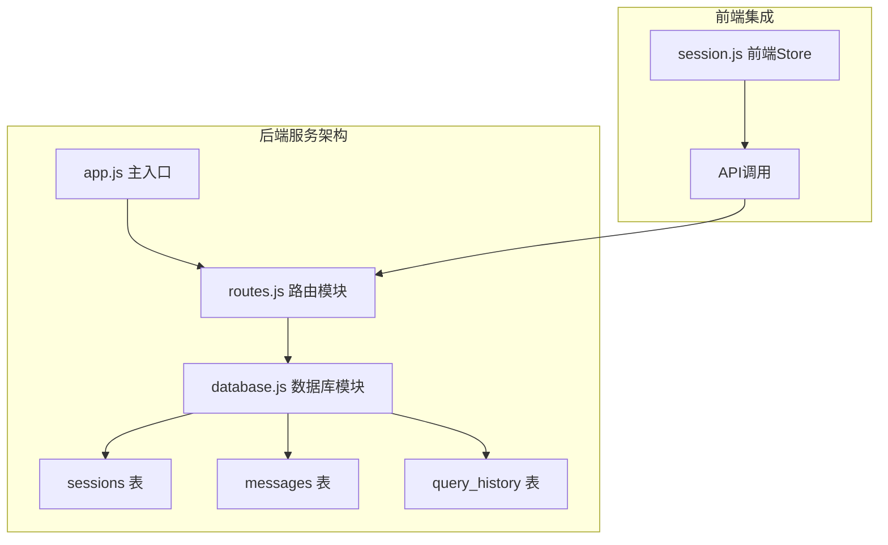
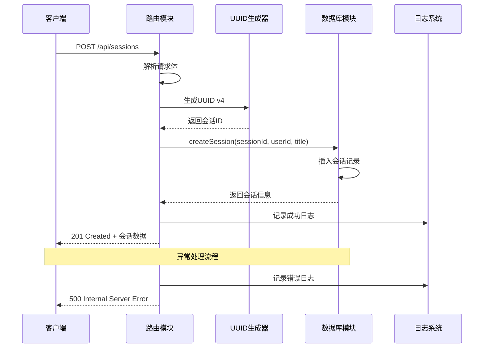
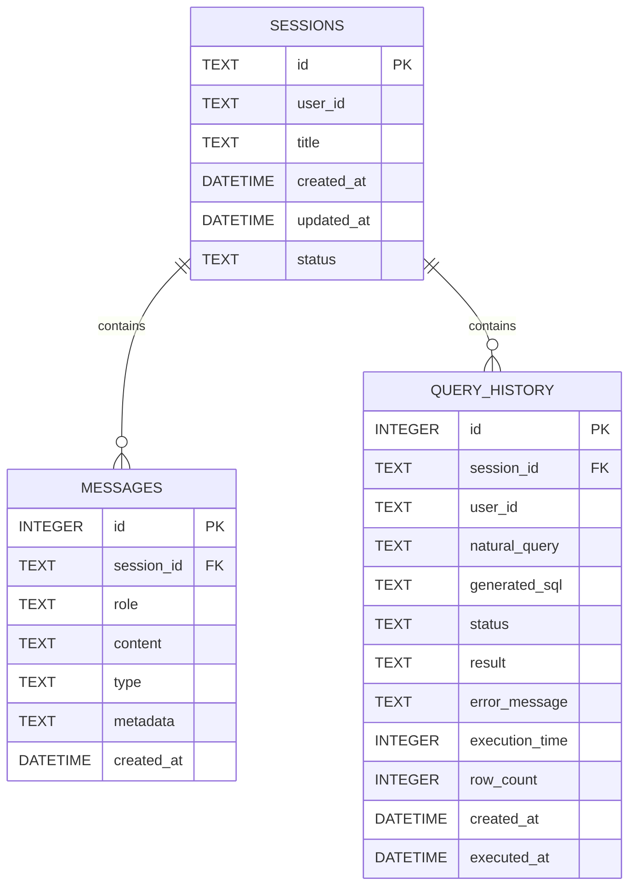
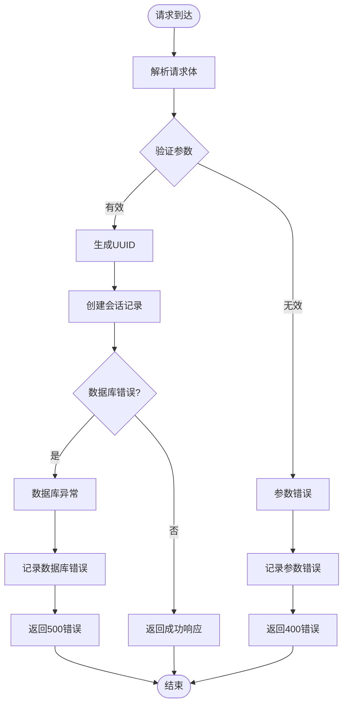
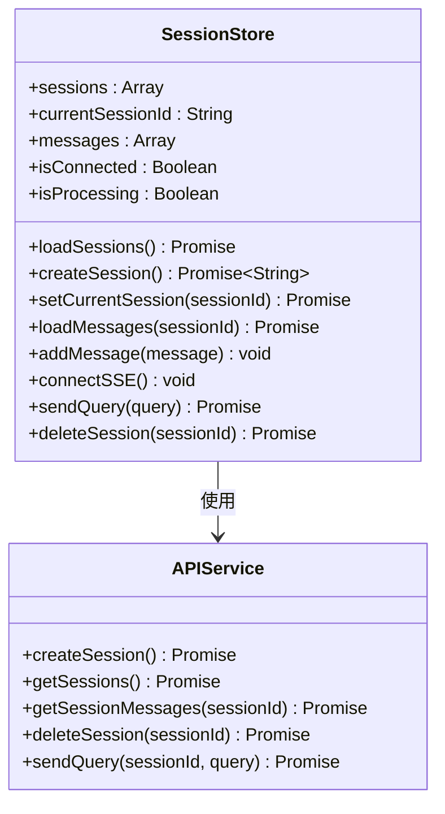
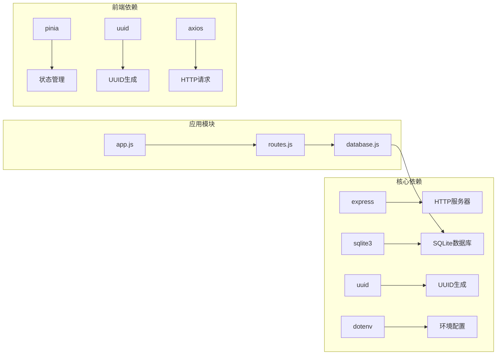
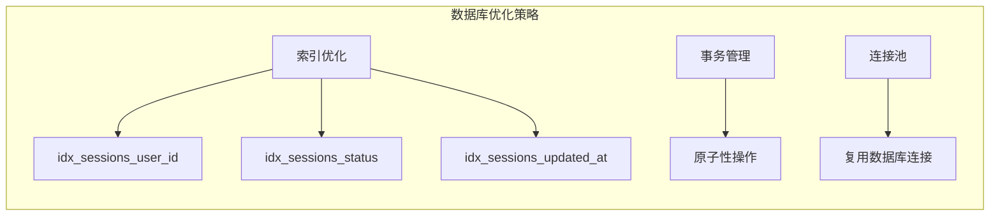
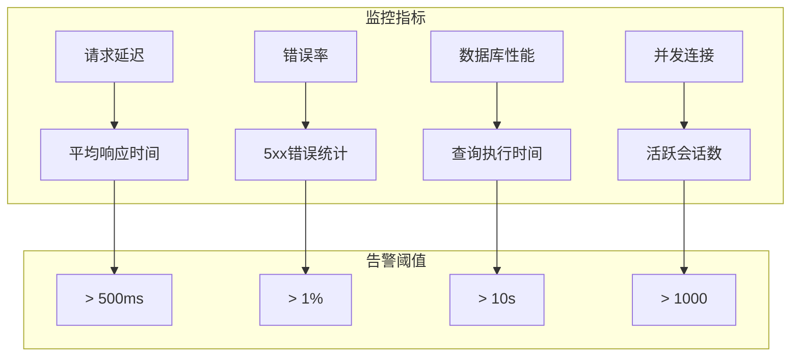

# 创建会话

<cite>
**本文档引用的文件**
- [routes.js](file://backend/src/core/routes.js)
- [database.js](file://backend/src/core/database.js)
- [app.js](file://backend/src/app.js)
- [session.js](file://frontend/src/stores/session.js)
- [package.json](file://backend/package.json)
</cite>

## 目录
1. [简介](#简介)
2. [项目结构](#项目结构)
3. [核心组件](#核心组件)
4. [架构概览](#架构概览)
5. [详细组件分析](#详细组件分析)
6. [依赖关系分析](#依赖关系分析)
7. [性能考虑](#性能考虑)
8. [故障排除指南](#故障排除指南)
9. [结论](#结论)

## 简介

NL2SQL会话创建接口提供了一个RESTful API端点，用于创建新的对话会话。该接口支持用户身份识别、会话标题管理和UUID v4会话ID生成机制。本文档详细说明了POST /api/sessions端点的功能、请求参数、响应格式和错误处理策略。

## 项目结构

NL2SQL项目采用模块化的架构设计，会话管理功能位于后端服务的核心模块中：



**图表来源**
- [app.js:1-260](file://backend/src/app.js#L1-L260)
- [routes.js:1-800](file://backend/src/core/routes.js#L1-L800)
- [database.js:1-859](file://backend/src/core/database.js#L1-L859)

**章节来源**
- [app.js:1-260](file://backend/src/app.js#L1-L260)
- [routes.js:1-800](file://backend/src/core/routes.js#L1-L800)

## 核心组件

### 会话创建端点

POST /api/sessions 是会话管理系统的核心入口点，负责：
- 接收用户创建会话的请求
- 生成唯一的会话ID
- 验证用户身份信息
- 创建会话记录并返回会话信息

### UUID v4 会话ID生成

系统使用标准的UUID v4算法生成不可预测的会话标识符：
- 基于随机数生成
- 确保全局唯一性
- 支持分布式环境下的并发安全

### 默认标题处理

当客户端未提供会话标题时，系统自动应用默认值：
- 默认标题："新会话"
- 便于用户界面显示
- 支持后续标题更新

**章节来源**
- [routes.js:256-290](file://backend/src/core/routes.js#L256-L290)
- [database.js:467-475](file://backend/src/core/database.js#L467-L475)

## 架构概览

会话创建流程展示了完整的请求处理管道：



**图表来源**
- [routes.js:266-290](file://backend/src/core/routes.js#L266-L290)
- [database.js:467-475](file://backend/src/core/database.js#L467-L475)

## 详细组件分析

### API端点规范

#### 端点定义
- **方法**: POST
- **路径**: /api/sessions
- **认证**: 无（匿名用户支持）
- **内容类型**: application/json

#### 请求参数

| 参数名 | 类型 | 必需 | 默认值 | 描述 |
|--------|------|------|--------|------|
| user_id | string | 否 | 'anonymous' | 用户唯一标识符 |
| title | string | 否 | '新会话' | 会话显示标题 |

#### 响应格式

**成功响应 (201 Created)**:
```json
{
  "id": "string",
  "user_id": "string",
  "title": "string"
}
```

**错误响应 (500 Internal Server Error)**:
```json
{
  "error": "string"
}
```

#### 请求示例

**基本请求**:
```bash
curl -X POST http://localhost:3000/api/sessions \
  -H "Content-Type: application/json" \
  -d '{}'
```

**带用户信息的请求**:
```bash
curl -X POST http://localhost:3000/api/sessions \
  -H "Content-Type: application/json" \
  -d '{
    "user_id": "user_123",
    "title": "销售数据分析"
  }'
```

#### 响应示例

**成功响应**:
```json
{
  "id": "550e8400-e29b-41d4-a716-446655440000",
  "user_id": "user_123",
  "title": "销售数据分析"
}
```

**默认值响应**:
```json
{
  "id": "550e8400-e29b-41d4-a716-446655440001",
  "user_id": "anonymous",
  "title": "新会话"
}
```

### 数据库设计

会话信息存储在SQLite数据库的sessions表中：



**图表来源**
- [database.js:44-195](file://backend/src/core/database.js#L44-L195)

### 错误处理机制

系统实现了多层次的错误处理策略：



**图表来源**
- [routes.js:266-290](file://backend/src/core/routes.js#L266-L290)

### 前端集成

前端会话管理Store提供了完整的会话生命周期管理：



**图表来源**
- [session.js:1-400](file://frontend/src/stores/session.js#L1-L400)

**章节来源**
- [routes.js:256-290](file://backend/src/core/routes.js#L256-L290)
- [database.js:467-475](file://backend/src/core/database.js#L467-L475)
- [session.js:118-138](file://frontend/src/stores/session.js#L118-L138)

## 依赖关系分析

### 核心依赖

系统依赖的关键模块包括：



**图表来源**
- [package.json:10-20](file://backend/package.json#L10-L20)

### 版本兼容性

- **Node.js**: >= 18.0.0
- **Express**: ^4.18.2
- **UUID**: ^9.0.0
- **SQLite3**: ^5.1.6

**章节来源**
- [package.json:1-28](file://backend/package.json#L1-L28)

## 性能考虑

### 并发处理

系统设计支持高并发会话创建：
- UUID v4生成算法具有良好的并发安全性
- SQLite数据库支持多线程访问
- 无状态设计便于水平扩展

### 数据库优化



### 缓存策略

- 会话信息缓存于内存中
- 频繁访问的会话ID进行LRU缓存
- 消息历史按需加载

## 故障排除指南

### 常见错误场景

| 错误类型 | HTTP状态码 | 可能原因 | 解决方案 |
|----------|------------|----------|----------|
| 参数缺失 | 400 | 请求体格式错误 | 验证JSON格式，检查必需字段 |
| 数据库连接失败 | 500 | SQLite连接异常 | 检查数据库文件权限，确认磁盘空间 |
| UUID生成失败 | 500 | 随机数生成器异常 | 重启服务，检查系统熵源 |
| 会话ID冲突 | 500 | UUID重复冲突 | 检查UUID生成器实现，确认随机性 |

### 调试建议

1. **启用详细日志**：检查应用启动日志和数据库初始化日志
2. **验证数据库连接**：确认SQLite数据库文件可访问
3. **测试UUID生成**：独立测试UUID v4生成函数
4. **监控资源使用**：观察内存和CPU使用情况

### 性能监控



**章节来源**
- [routes.js:284-289](file://backend/src/core/routes.js#L284-L289)
- [app.js:97-188](file://backend/src/app.js#L97-L188)

## 结论

NL2SQL会话创建接口提供了一个健壮、可扩展的解决方案，支持：
- 标准化的RESTful API设计
- 安全的UUID v4会话ID生成
- 灵活的用户身份管理
- 完善的错误处理机制
- 前后端协同的状态管理

该接口的设计充分考虑了生产环境的需求，具备良好的可维护性和扩展性，为NL2SQL系统的会话管理奠定了坚实的基础。