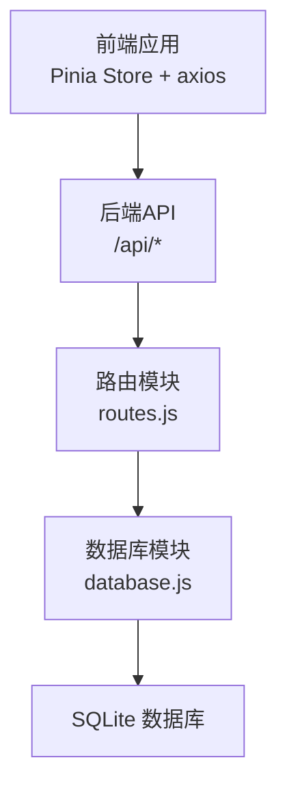
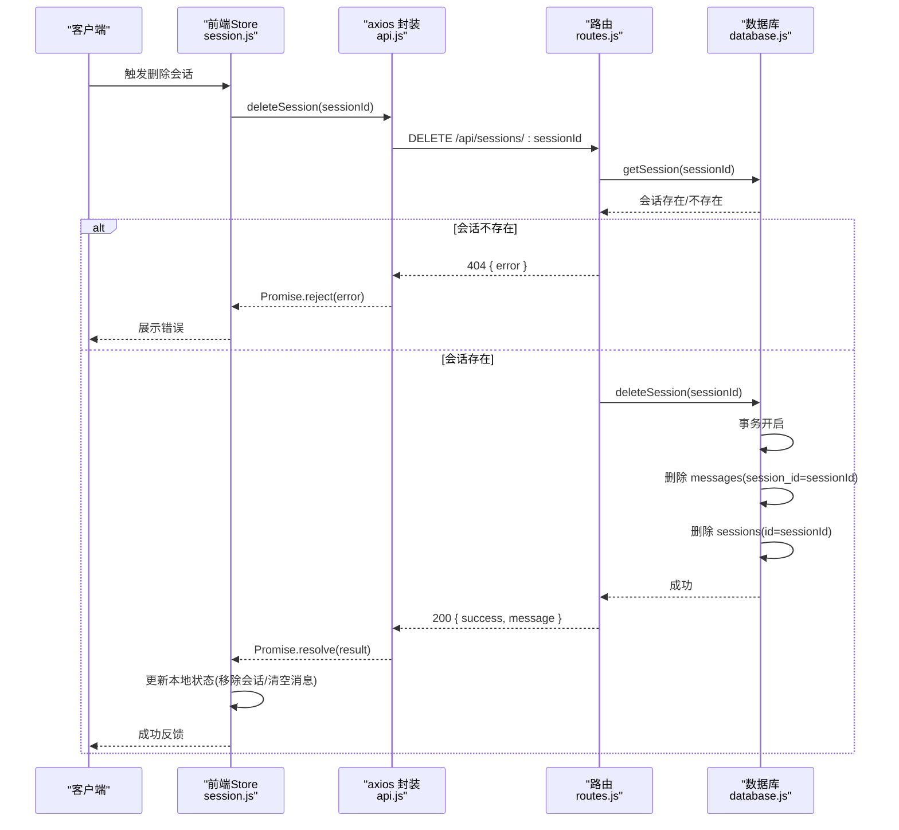
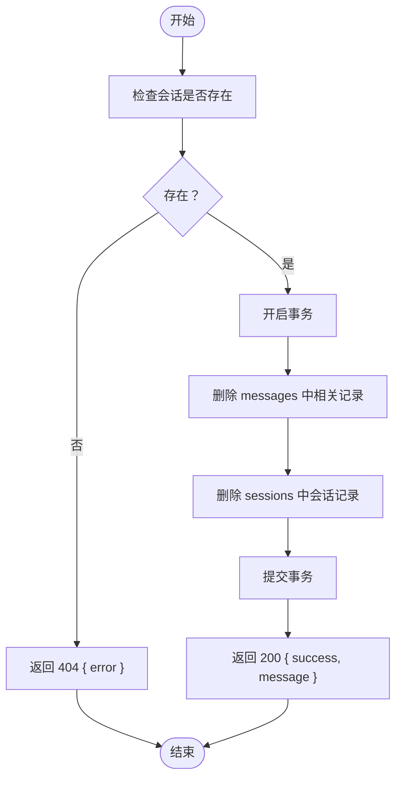
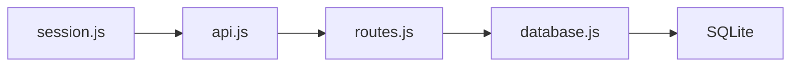

# 删除会话

<cite>
**本文引用的文件**
- [app.js](file://backend/src/app.js)
- [routes.js](file://backend/src/core/routes.js)
- [database.js](file://backend/src/core/database.js)
- [session.js](file://frontend/src/stores/session.js)
- [api.js](file://frontend/src/utils/api.js)
</cite>

## 目录
1. [简介](#简介)
2. [项目结构](#项目结构)
3. [核心组件](#核心组件)
4. [架构概览](#架构概览)
5. [详细组件分析](#详细组件分析)
6. [依赖分析](#依赖分析)
7. [性能考量](#性能考量)
8. [故障排查指南](#故障排查指南)
9. [结论](#结论)

## 简介
本文件为 NL2SQL 会话删除接口的详细 API 文档，聚焦于 DELETE /api/sessions/:sessionId 端点。内容涵盖：
- 接口功能与用途
- 路径参数处理与校验
- 存在性检查机制
- 删除流程与级联影响
- 响应格式与错误处理策略
- 安全考虑与边界情况
- 请求与响应示例

## 项目结构
后端采用 Express 框架，API 路由集中于 core/routes.js；会话删除逻辑位于该路由模块中，实际数据持久化由 core/database.js 提供。前端通过 Pinia Store 与 axios 封装的 API 工具进行交互。

图表来源
- [routes.js:316-345](file://backend/src/core/routes.js#L316-L345)
- [database.js:525-549](file://backend/src/core/database.js#L525-L549)

章节来源
- [routes.js:316-345](file://backend/src/core/routes.js#L316-L345)
- [database.js:525-549](file://backend/src/core/database.js#L525-L549)

## 核心组件
- 路由层：定义 DELETE /api/sessions/:sessionId 并调用数据库层删除会话。
- 数据库层：提供 deleteSession(sessionId) 方法，封装事务与级联删除。
- 前端：通过 api.js 的 deleteSession(sessionId) 发起删除请求，随后更新本地状态。

章节来源
- [routes.js:316-345](file://backend/src/core/routes.js#L316-L345)
- [database.js:525-549](file://backend/src/core/database.js#L525-L549)
- [api.js:188-195](file://frontend/src/utils/api.js#L188-L195)
- [session.js:343-370](file://frontend/src/stores/session.js#L343-L370)

## 架构概览
删除会话的端到端流程如下：

图表来源
- [routes.js:316-345](file://backend/src/core/routes.js#L316-L345)
- [database.js:525-549](file://backend/src/core/database.js#L525-L549)
- [api.js:188-195](file://frontend/src/utils/api.js#L188-L195)
- [session.js:343-370](file://frontend/src/stores/session.js#L343-L370)

## 详细组件分析

### 端点定义与行为
- 方法与路径：DELETE /api/sessions/:sessionId
- 功能：删除指定会话及其相关消息历史
- 路径参数：sessionId（必填）
- 响应：
  - 成功：200 OK，返回 { success: true, message: "会话已删除" }
  - 会话不存在：404 Not Found，返回 { error: "会话不存在" }
  - 服务器错误：500 Internal Server Error，返回 { error: "删除会话失败: ..." }

章节来源
- [routes.js:316-345](file://backend/src/core/routes.js#L316-L345)

### 路径参数处理与校验
- 参数来源：req.params.sessionId
- 处理方式：直接读取并传递给数据库层
- 校验策略：路由层仅做存在性检查；数据库层通过事务保证一致性

章节来源
- [routes.js:320-323](file://backend/src/core/routes.js#L320-L323)

### 存在性检查机制
- 路由层：先调用 database.getSession(sessionId) 获取会话
- 若返回空，则立即返回 404
- 若存在，则进入删除流程

章节来源
- [routes.js:324-330](file://backend/src/core/routes.js#L324-L330)
- [database.js:482-485](file://backend/src/core/database.js#L482-L485)

### 删除流程与级联影响
- 事务保障：deleteSession(sessionId) 在事务中执行，确保原子性
- 删除顺序：
  1) 删除 messages 表中所有 session_id=sessionId 的记录
  2) 删除 sessions 表中 id=sessionId 的记录
- 级联影响：
  - messages 表的外键约束：ON DELETE CASCADE，会话删除时自动清理消息
  - query_history 表的外键约束：ON DELETE SET NULL，会话删除后相关记录保留但 session_id 置空
- 返回值：成功返回 true，异常抛出错误

图表来源
- [routes.js:316-345](file://backend/src/core/routes.js#L316-L345)
- [database.js:525-549](file://backend/src/core/database.js#L525-L549)

章节来源
- [database.js:525-549](file://backend/src/core/database.js#L525-L549)

### 响应格式与错误处理策略
- 成功响应：{ success: true, message: "会话已删除" }
- 会话不存在：{ error: "会话不存在" }
- 服务器错误：{ error: "删除会话失败: ..." }
- 前端处理：
  - 成功：从本地会话列表移除该会话，清空消息并断开 SSE
  - 失败：捕获错误并提示用户

章节来源
- [routes.js:335-344](file://backend/src/core/routes.js#L335-L344)
- [session.js:347-370](file://frontend/src/stores/session.js#L347-L370)

### 安全考虑
- 身份与权限：当前实现未对 user_id 进行校验，删除请求仅依赖 sessionId。若需增强安全，可在路由层增加用户上下文校验。
- 事务隔离：使用事务确保删除的原子性，避免部分删除导致的数据不一致。
- 外键约束：合理使用 CASCADE 和 SET NULL，避免悬挂引用。

章节来源
- [routes.js:316-345](file://backend/src/core/routes.js#L316-L345)
- [database.js:86-125](file://backend/src/core/database.js#L86-L125)

### 边界情况处理
- 会话不存在：直接返回 404，不抛异常
- 删除过程中异常：事务回滚，错误记录日志并返回 500
- 前端状态同步：删除成功后主动刷新会话列表，确保 UI 与后端一致

章节来源
- [routes.js:339-344](file://backend/src/core/routes.js#L339-L344)
- [session.js:347-370](file://frontend/src/stores/session.js#L347-L370)

### 请求与响应示例
- 请求示例
  - 方法：DELETE
  - 路径：/api/sessions/{sessionId}
  - 示例：DELETE /api/sessions/a1b2c3d4-e5f6-7890-a1b2-c3d4e5f67890
- 成功响应示例
  - 状态码：200
  - 示例：{ "success": true, "message": "会话已删除" }
- 会话不存在响应示例
  - 状态码：404
  - 示例：{ "error": "会话不存在" }
- 服务器错误响应示例
  - 状态码：500
  - 示例：{ "error": "删除会话失败: 数据库异常" }

章节来源
- [routes.js:316-345](file://backend/src/core/routes.js#L316-L345)
- [api.js:188-195](file://frontend/src/utils/api.js#L188-L195)

## 依赖分析
- 路由依赖数据库模块：DELETE 路由调用 database.deleteSession
- 数据库依赖 SQLite：通过 sqlite3 操作 sessions 与 messages 表
- 前端依赖 axios：封装 HTTP 请求，统一拦截错误

图表来源
- [routes.js:316-345](file://backend/src/core/routes.js#L316-L345)
- [database.js:525-549](file://backend/src/core/database.js#L525-L549)
- [api.js:188-195](file://frontend/src/utils/api.js#L188-L195)
- [session.js:343-370](file://frontend/src/stores/session.js#L343-L370)

章节来源
- [routes.js:316-345](file://backend/src/core/routes.js#L316-L345)
- [database.js:525-549](file://backend/src/core/database.js#L525-L549)
- [api.js:188-195](file://frontend/src/utils/api.js#L188-L195)
- [session.js:343-370](file://frontend/src/stores/session.js#L343-L370)

## 性能考量
- 删除操作为 O(n)（n 为该会话的消息数量），受 messages 表索引与外键约束影响较小
- 事务减少多次往返的开销，提升一致性与吞吐
- 建议：若消息量极大，可考虑分批删除或异步清理策略（当前实现已通过事务保证原子性）

## 故障排查指南
- 404 会话不存在
  - 检查 sessionId 是否正确
  - 确认会话是否已被删除或从未创建
- 500 删除失败
  - 查看后端日志定位数据库异常
  - 检查 SQLite 文件权限与磁盘空间
- 前端未更新
  - 确认前端 deleteSession 成功回调
  - 检查本地状态更新逻辑（移除会话、清空消息、断开 SSE）

章节来源
- [routes.js:339-344](file://backend/src/core/routes.js#L339-L344)
- [session.js:347-370](file://frontend/src/stores/session.js#L347-L370)

## 结论
DELETE /api/sessions/:sessionId 接口通过存在性检查与事务保障，实现了会话与其消息历史的可靠删除。建议在后续版本中引入用户身份校验与更细粒度的权限控制，以进一步提升安全性与可审计性。