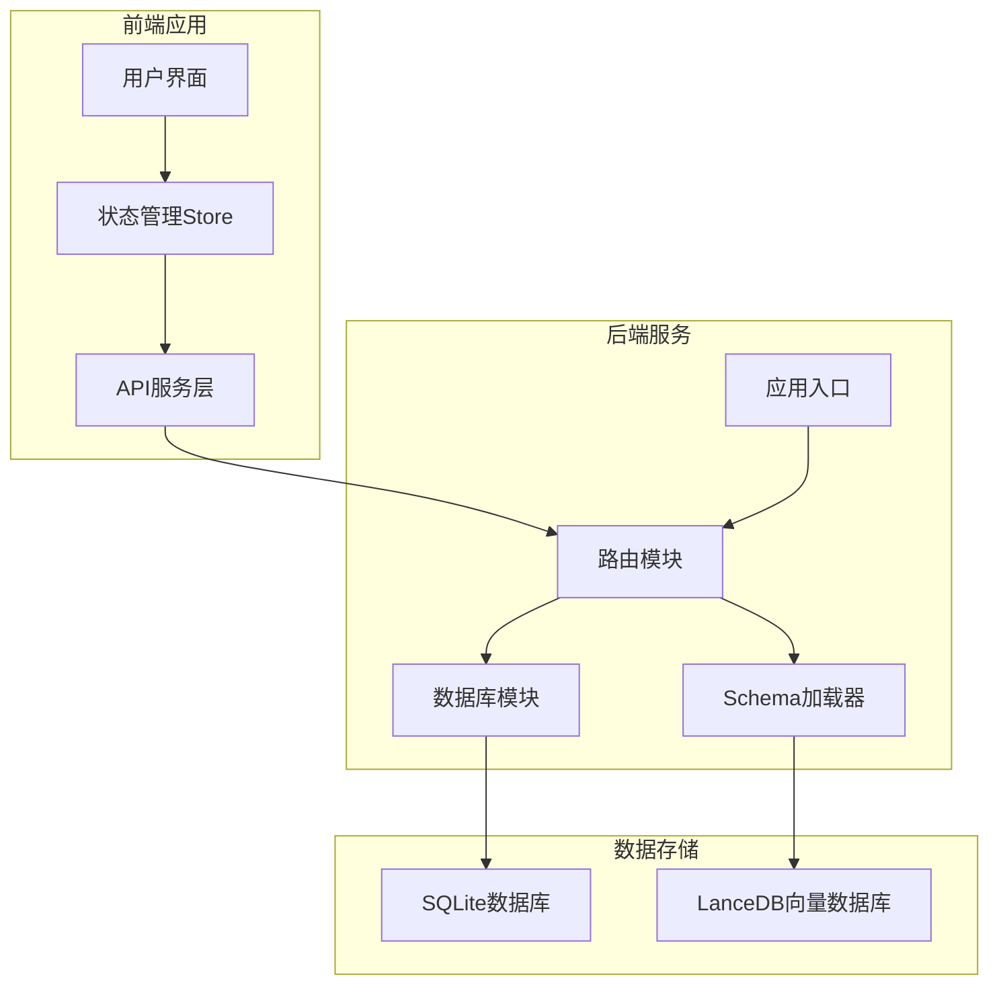
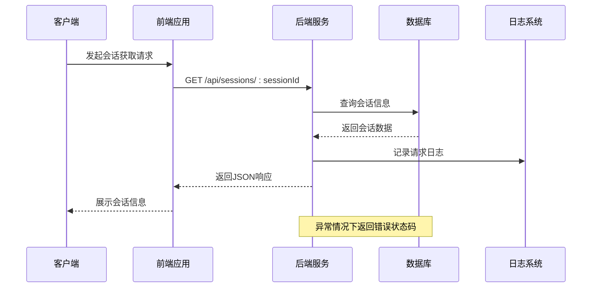
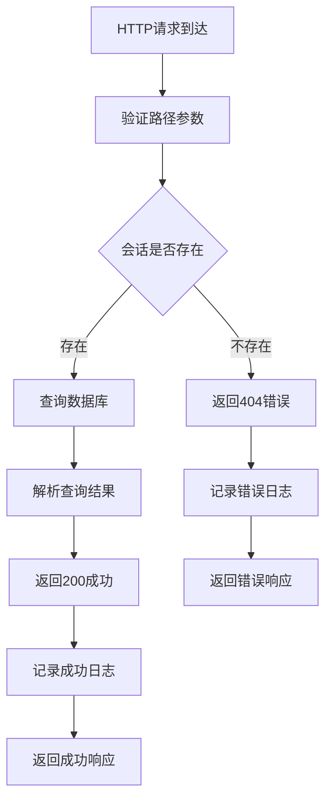
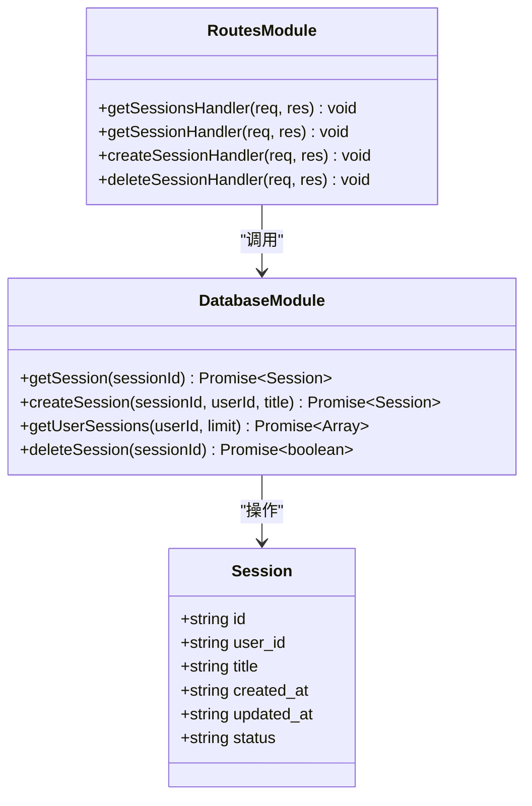
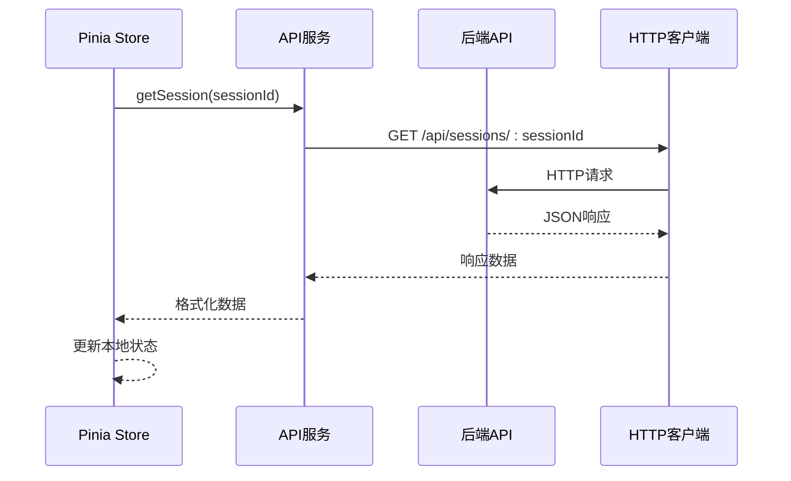
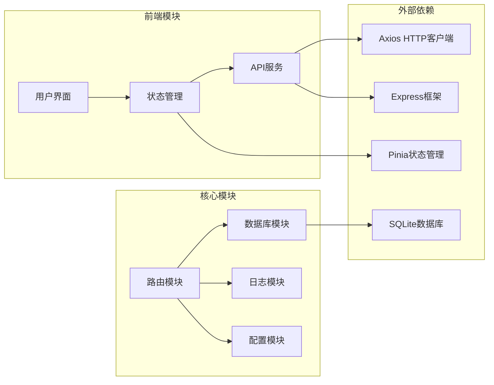

# 获取会话信息

<cite>
**本文档引用的文件**
- [routes.js](file://backend/src/core/routes.js)
- [database.js](file://backend/src/core/database.js)
- [app.js](file://backend/src/app.js)
- [api.js](file://frontend/src/utils/api.js)
- [session.js](file://frontend/src/stores/session.js)
</cite>

## 目录
1. [简介](#简介)
2. [项目结构](#项目结构)
3. [核心组件](#核心组件)
4. [架构概览](#架构概览)
5. [详细组件分析](#详细组件分析)
6. [依赖分析](#依赖分析)
7. [性能考虑](#性能考虑)
8. [故障排除指南](#故障排除指南)
9. [结论](#结论)

## 简介

本文档详细说明NL2SQL系统中获取会话信息的API接口。该接口支持通过会话ID获取完整的会话数据，包括会话基本信息、状态管理和消息历史。文档涵盖了端点功能、路径参数处理、响应格式、错误处理机制以及完整的请求示例。

## 项目结构

NL2SQL项目采用前后端分离架构，后端使用Node.js + Express构建RESTful API，前端使用Vue.js + Pinia管理状态。会话管理功能位于后端核心模块中，通过路由层暴露给前端应用。

**图表来源**
- [app.js:1-260](file://backend/src/app.js#L1-260)
- [routes.js:1-1037](file://backend/src/core/routes.js#L1-1037)

**章节来源**
- [app.js:1-260](file://backend/src/app.js#L1-260)
- [routes.js:1-1037](file://backend/src/core/routes.js#L1-1037)

## 核心组件

### API端点定义

获取会话信息的API端点遵循RESTful设计原则，使用HTTP GET方法和路径参数传递会话ID。

- **端点**: `GET /api/sessions/:sessionId`
- **功能**: 根据会话ID获取完整的会话信息
- **路径参数**: `sessionId` - 会话唯一标识符
- **响应状态**: 
  - 200: 成功获取会话信息
  - 404: 会话不存在
  - 500: 服务器内部错误

### 会话数据结构

会话信息包含以下核心字段：

| 字段名 | 类型 | 描述 | 必填 |
|--------|------|------|------|
| id | string | 会话唯一标识符（UUID） | 是 |
| user_id | string | 用户标识符 | 是 |
| title | string | 会话标题 | 否 |
| created_at | string | 会话创建时间（ISO 8601） | 是 |
| updated_at | string | 会话最后更新时间（ISO 8601） | 是 |
| status | string | 会话状态（active/archived/deleted） | 是 |

### 错误处理机制

系统实现了完善的错误处理机制，包括：
- 会话不存在时返回404状态码
- 数据库操作异常时返回500状态码
- 参数验证失败时返回400状态码
- 统一日志记录和错误信息格式化

**章节来源**
- [routes.js:292-314](file://backend/src/core/routes.js#L292-314)
- [database.js:482-485](file://backend/src/core/database.js#L482-485)

## 架构概览

NL2SQL系统采用分层架构设计，会话管理功能贯穿多个层次：

**图表来源**
- [routes.js:292-314](file://backend/src/core/routes.js#L292-314)
- [database.js:482-485](file://backend/src/core/database.js#L482-485)

## 详细组件分析

### 后端实现分析

#### 路由层实现

路由层负责处理HTTP请求和响应，实现会话信息的获取逻辑：

**图表来源**
- [routes.js:296-314](file://backend/src/core/routes.js#L296-314)

#### 数据库层实现

数据库层负责会话数据的持久化存储和查询操作：

**图表来源**
- [database.js:482-549](file://backend/src/core/database.js#L482-549)
- [routes.js:292-345](file://backend/src/core/routes.js#L292-345)

### 前端集成分析

#### API服务封装

前端通过API服务模块封装所有后端通信逻辑：

**图表来源**
- [api.js:167-174](file://frontend/src/utils/api.js#L167-174)
- [session.js:144-155](file://frontend/src/stores/session.js#L144-155)

#### 状态管理集成

前端使用Pinia状态管理库维护会话状态：

| 状态属性 | 类型 | 描述 | 用途 |
|----------|------|------|------|
| sessions | Array | 会话列表 | 显示用户所有会话 |
| currentSessionId | string | 当前会话ID | 标识当前操作的会话 |
| messages | Array | 消息历史 | 显示对话记录 |
| isConnected | boolean | SSE连接状态 | 控制实时通信 |
| isProcessing | boolean | 处理状态 | 显示加载指示器 |

**章节来源**
- [routes.js:292-314](file://backend/src/core/routes.js#L292-314)
- [database.js:482-485](file://backend/src/core/database.js#L482-485)
- [api.js:167-174](file://frontend/src/utils/api.js#L167-174)
- [session.js:144-155](file://frontend/src/stores/session.js#L144-155)

## 依赖分析

### 组件耦合关系

NL2SQL系统中各组件之间的依赖关系如下：

**图表来源**
- [app.js:1-260](file://backend/src/app.js#L1-260)
- [routes.js:1-1037](file://backend/src/core/routes.js#L1-1037)

### 数据流分析

会话信息获取的数据流过程：

1. **请求阶段**: 前端发起HTTP请求
2. **路由处理**: Express路由解析路径参数
3. **业务逻辑**: 调用数据库模块查询会话
4. **数据转换**: 格式化查询结果为JSON
5. **响应返回**: 发送HTTP响应给客户端
6. **错误处理**: 统一处理各种异常情况

**章节来源**
- [routes.js:292-314](file://backend/src/core/routes.js#L292-314)
- [database.js:482-485](file://backend/src/core/database.js#L482-485)

## 性能考虑

### 查询优化

系统针对会话查询进行了专门的性能优化：

- **索引优化**: 会话表建立了多列索引以加速查询
- **状态过滤**: 默认只查询active状态的会话
- **参数绑定**: 使用参数化查询防止SQL注入
- **连接池**: SQLite连接复用减少开销

### 缓存策略

虽然会话信息查询频率不高，但系统仍具备良好的扩展性：

- **内存缓存**: 可在应用层实现短期缓存
- **数据库缓存**: SQLite内置缓存机制
- **CDN支持**: 响应数据适合缓存

## 故障排除指南

### 常见错误及解决方案

| 错误类型 | HTTP状态码 | 可能原因 | 解决方案 |
|----------|------------|----------|----------|
| 会话不存在 | 404 | 会话ID无效或已被删除 | 验证会话ID有效性，检查会话状态 |
| 数据库连接失败 | 500 | 数据库服务不可用 | 检查数据库连接配置，重启服务 |
| 参数格式错误 | 400 | 路径参数格式不正确 | 确保会话ID为有效的UUID格式 |
| 超时错误 | 504 | 查询执行时间过长 | 优化查询条件，检查数据库性能 |

### 调试建议

1. **启用详细日志**: 检查后端日志输出
2. **验证数据库状态**: 确认SQLite数据库正常运行
3. **测试API端点**: 使用curl或Postman验证接口
4. **检查网络连接**: 确保前后端通信正常

**章节来源**
- [routes.js:292-314](file://backend/src/core/routes.js#L292-314)
- [database.js:482-485](file://backend/src/core/database.js#L482-485)

## 结论

NL2SQL系统的会话获取接口设计合理，实现了清晰的职责分离和良好的错误处理机制。通过RESTful API设计，前端能够轻松获取会话信息并进行相应的UI更新。系统的架构支持良好的扩展性和维护性，为后续功能增强奠定了坚实基础。

接口的主要优势包括：
- **简洁的API设计**: 符合RESTful规范
- **完善的错误处理**: 提供清晰的错误信息
- **良好的性能表现**: 通过索引和参数化查询优化
- **易于集成**: 前后端分离设计便于独立开发和部署