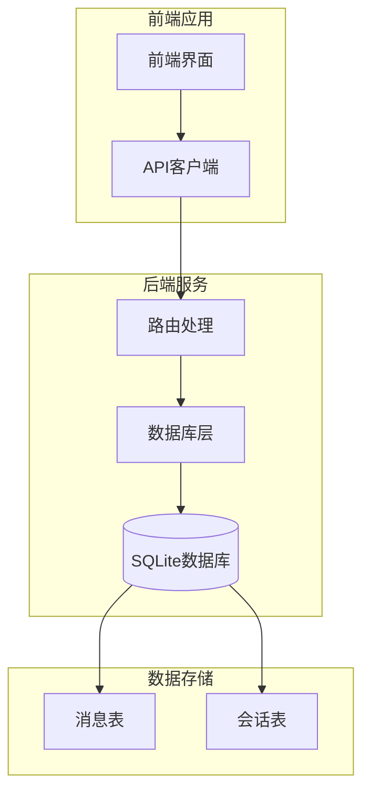
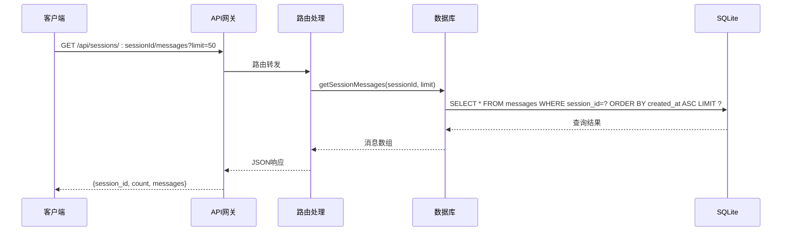
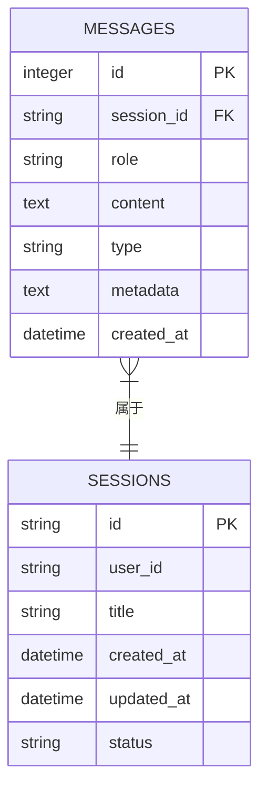

# 获取会话消息历史

<cite>
**本文档引用的文件**
- [routes.js](file://backend/src/core/routes.js)
- [database.js](file://backend/src/core/database.js)
- [api.js](file://frontend/src/utils/api.js)
- [app.js](file://backend/src/app.js)
</cite>

## 目录
1. [简介](#简介)
2. [端点概述](#端点概述)
3. [请求规范](#请求规范)
4. [响应规范](#响应规范)
5. [消息数据结构](#消息数据结构)
6. [分页机制](#分页机制)
7. [存储格式与时间排序](#存储格式与时间排序)
8. [性能优化考虑](#性能优化考虑)
9. [使用示例](#使用示例)
10. [故障排除](#故障排除)
11. [架构图](#架构图)

## 简介

NL2SQL系统提供了一个完整的会话消息历史管理功能，允许用户获取指定会话的完整消息历史记录。该功能基于SQLite数据库实现，支持高效的消息检索和分页显示。

## 端点概述

### 基本信息
- **端点**: `GET /api/sessions/:sessionId/messages`
- **功能**: 获取指定会话的消息历史
- **路径参数**: `sessionId` - 会话唯一标识符
- **查询参数**: `limit` - 返回消息数量限制（默认50）

### 路由定义
```javascript
// 路由定义位置：backend/src/core/routes.js
router.get('/sessions/:sessionId/messages', async (req, res) => {
  try {
    const { sessionId } = req.params;
    const limit = parseInt(req.query.limit) || 50;
    
    // 获取消息历史
    const messages = await database.getSessionMessages(sessionId, limit);
    
    res.json({
      session_id: sessionId,
      count: messages.length,
      messages
    });
  } catch (error) {
    logger.error('获取消息历史失败:', error);
    res.status(500).json({
      error: '获取消息历史失败: ' + error.message
    });
  }
});
```

## 请求规范

### HTTP请求
- **方法**: GET
- **路径**: `/api/sessions/{sessionId}/messages`
- **查询参数**:
  - `limit` (可选): 整数类型，指定返回的消息数量上限
  - 默认值: 50

### 请求头
- Content-Type: application/json
- Accept: application/json

### 路径参数
- `sessionId`: UUID格式的会话标识符

## 响应规范

### 成功响应
响应包含三个主要部分：
1. `session_id`: 请求的会话标识符
2. `count`: 返回的消息数量
3. `messages`: 消息数组

### 错误响应
- **404 Not Found**: 会话不存在
- **500 Internal Server Error**: 服务器内部错误

## 消息数据结构

### 消息字段定义

| 字段名 | 类型 | 描述 | 示例 |
|--------|------|------|------|
| `id` | integer | 消息唯一标识符 | 123 |
| `session_id` | string | 所属会话ID | "550e8400-e29b-41d4-a716-446655440000" |
| `role` | string | 消息角色 | "user" |
| `content` | string | 消息内容 | "如何查询销售额？" |
| `type` | string | 消息类型 | "text" |
| `metadata` | object/null | 元数据（JSON对象） | `{...}` |
| `created_at` | string | 创建时间 | "2024-01-15T10:30:00Z" |

### 角色类型
- `user`: 用户发送的消息
- `assistant`: 系统助手回复
- `system`: 系统生成的提示信息
- `tool`: 工具调用产生的消息

### 消息类型
- `text`: 文本消息
- `sql`: SQL代码
- `result`: 查询结果
- `error`: 错误信息
- `clarify`: 澄清信息

## 分页机制

### 查询参数
- **limit**: 控制返回的消息数量
- 默认值: 50
- 最大值: 无限（受数据库限制）

### 分页策略
由于消息按时间顺序存储，系统采用简单的分页策略：
- 每次请求返回最新的消息
- 通过limit参数控制返回数量
- 不支持游标分页或offset分页

## 存储格式与时间排序

### 数据库存储
消息存储在SQLite数据库的`messages`表中：

```sql
-- 消息表结构
CREATE TABLE IF NOT EXISTS messages (
  id INTEGER PRIMARY KEY AUTOINCREMENT,
  session_id TEXT NOT NULL,
  role TEXT NOT NULL,
  content TEXT NOT NULL,
  type TEXT DEFAULT 'text',
  metadata TEXT,
  created_at DATETIME DEFAULT CURRENT_TIMESTAMP,
  FOREIGN KEY (session_id) REFERENCES sessions(id) ON DELETE CASCADE
);

-- 索引优化
CREATE INDEX IF NOT EXISTS idx_messages_session_id ON messages(session_id);
CREATE INDEX IF NOT EXISTS idx_messages_created_at ON messages(created_at);
```

### 时间排序规则
- **排序方式**: `ORDER BY created_at ASC`
- **排序方向**: 升序（最早的消息在前）
- **索引优化**: `idx_messages_created_at`索引支持快速排序

### 元数据处理
- `metadata`字段以JSON字符串形式存储
- 查询时自动解析为JavaScript对象
- 支持null值

## 性能优化考虑

### 数据库优化
1. **索引优化**
   - `idx_messages_session_id`: 加速按会话查询
   - `idx_messages_created_at`: 加速时间排序

2. **查询优化**
   - 使用LIMIT子句限制返回数量
   - 通过WHERE条件精确筛选会话

3. **内存管理**
   - 分批处理大量消息
   - 及时释放数据库连接

### 前端优化
1. **缓存策略**
   - 缓存最近访问的会话消息
   - 避免重复请求相同数据

2. **懒加载**
   - 滚动到底部时动态加载更多消息
   - 分批次渲染大量消息

3. **防抖处理**
   - 避免频繁刷新导致的重复请求

## 使用示例

### 基本请求
```javascript
// 前端调用示例
const sessionId = "550e8400-e29b-41d4-a716-446655440000";
const response = await getSessionMessages(sessionId, 50);
```

### 请求URL
```
GET /api/sessions/550e8400-e29b-41d4-a716-446655440000/messages?limit=50
```

### 成功响应示例
```json
{
  "session_id": "550e8400-e29b-41d4-a716-446655440000",
  "count": 3,
  "messages": [
    {
      "id": 1,
      "session_id": "550e8400-e29b-41d4-a716-446655440000",
      "role": "user",
      "content": "如何查询销售额？",
      "type": "text",
      "metadata": null,
      "created_at": "2024-01-15T10:30:00Z"
    },
    {
      "id": 2,
      "session_id": "550e8400-e29b-41d4-a716-446655440000",
      "role": "assistant",
      "content": "我可以帮您查询销售额。请问您希望查询哪个时间段的销售额？",
      "type": "text",
      "metadata": null,
      "created_at": "2024-01-15T10:30:05Z"
    },
    {
      "id": 3,
      "session_id": "550e8400-e29b-41d4-a716-446655440000",
      "role": "user",
      "content": "上个月的销售额",
      "type": "text",
      "metadata": null,
      "created_at": "2024-01-15T10:30:10Z"
    }
  ]
}
```

### 错误响应示例
```json
{
  "error": "会话不存在"
}
```

## 故障排除

### 常见问题

1. **会话不存在**
   - **原因**: sessionId无效或已被删除
   - **解决方案**: 验证会话ID的有效性

2. **数据库连接失败**
   - **原因**: SQLite数据库不可用
   - **解决方案**: 检查数据库文件权限和磁盘空间

3. **查询超时**
   - **原因**: 消息数量过多或数据库性能问题
   - **解决方案**: 减少limit参数值或优化数据库

### 调试建议
1. 检查数据库连接状态
2. 验证sessionId格式
3. 监控数据库查询性能
4. 查看服务器日志

## 架构图

### 系统架构


### 数据流图


### 数据模型图


**图表来源**
- [routes.js:347-373](file://backend/src/core/routes.js#L347-L373)
- [database.js:66-92](file://backend/src/core/database.js#L66-L92)
- [database.js:585-605](file://backend/src/core/database.js#L585-L605)

**章节来源**
- [routes.js:347-373](file://backend/src/core/routes.js#L347-L373)
- [database.js:585-605](file://backend/src/core/database.js#L585-L605)
- [api.js:176-186](file://frontend/src/utils/api.js#L176-L186)
- [app.js:78-80](file://backend/src/app.js#L78-L80)