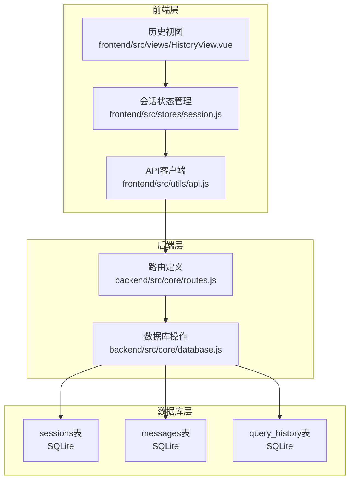
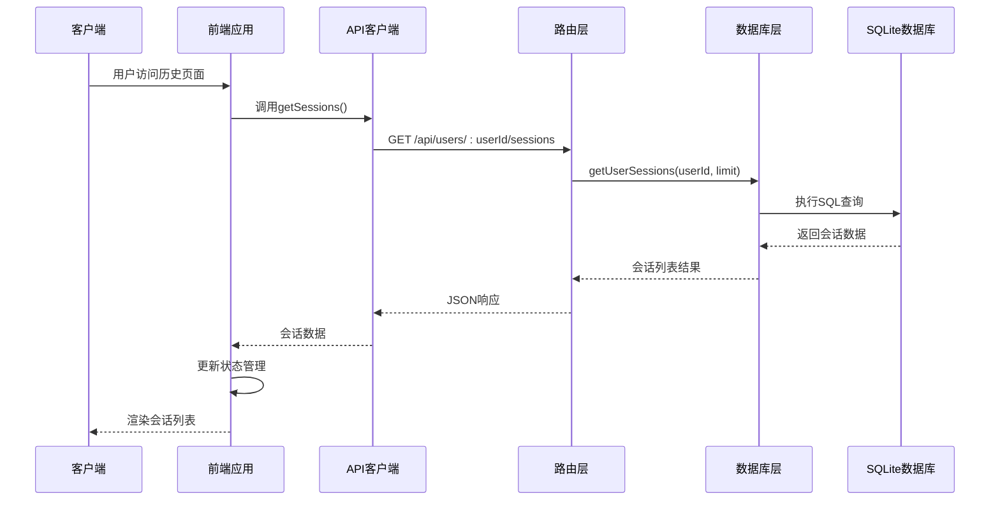
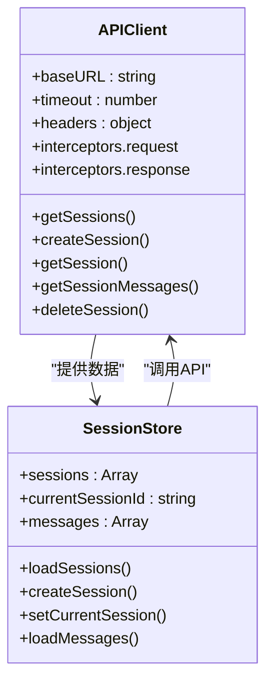
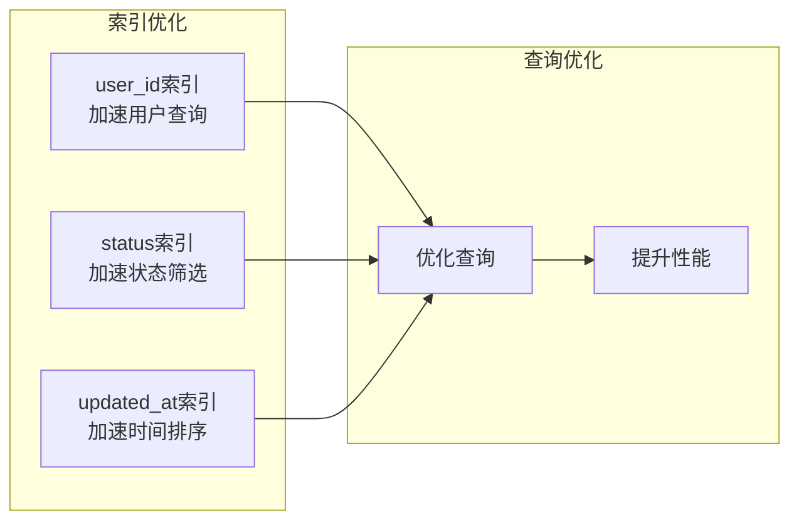
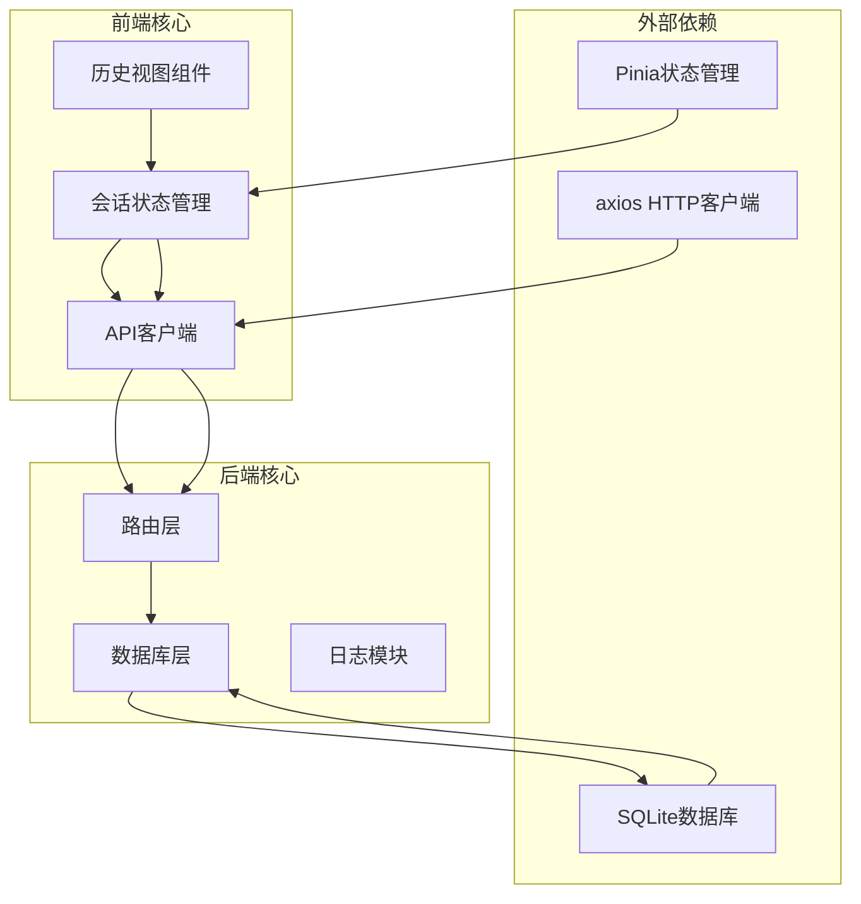
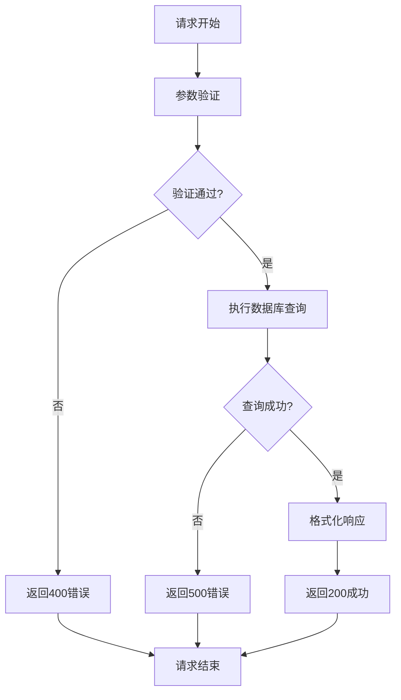

# 获取用户会话列表

<cite>
**本文档引用的文件**
- [routes.js](file://backend/src/core/routes.js)
- [database.js](file://backend/src/core/database.js)
- [session.js](file://frontend/src/stores/session.js)
- [api.js](file://frontend/src/utils/api.js)
- [HistoryView.vue](file://frontend/src/views/HistoryView.vue)
</cite>

## 目录
1. [简介](#简介)
2. [项目结构](#项目结构)
3. [核心组件](#核心组件)
4. [架构概览](#架构概览)
5. [详细组件分析](#详细组件分析)
6. [依赖关系分析](#依赖关系分析)
7. [性能考虑](#性能考虑)
8. [故障排除指南](#故障排除指南)
9. [结论](#结论)

## 简介

本文档详细说明了NL2SQL系统的用户会话列表接口，重点介绍`GET /api/users/:userId/sessions`端点的功能特性、数据结构和使用方法。该接口支持用户会话的查询、排序和限制功能，是NL2SQL应用中用户界面展示历史会话的核心API。

## 项目结构

NL2SQL项目采用前后端分离架构，会话管理功能分布在以下关键位置：



**图表来源**
- [routes.js:375-398](file://backend/src/core/routes.js#L375-L398)
- [database.js:44-64](file://backend/src/core/database.js#L44-L64)

**章节来源**
- [routes.js:375-398](file://backend/src/core/routes.js#L375-L398)
- [database.js:44-64](file://backend/src/core/database.js#L44-L64)

## 核心组件

### 后端路由组件

后端通过Express框架提供RESTful API，用户会话列表接口位于路由定义文件中：

- **端点**: `GET /api/users/:userId/sessions`
- **路径参数**: `userId` - 用户唯一标识符
- **查询参数**: `limit` - 返回会话数量限制，默认值为20
- **响应格式**: JSON对象，包含用户ID、会话数量和会话列表

### 数据库组件

数据库层负责会话数据的持久化存储，使用SQLite作为轻量级数据库：

- **表结构**: sessions表包含会话基本信息
- **索引优化**: 为user_id、status和updated_at字段建立索引
- **查询优化**: 支持按用户ID和状态筛选，按更新时间排序

### 前端组件

前端通过API客户端与后端交互，会话状态管理采用Pinia状态管理：

- **状态管理**: 使用ref和computed管理会话列表状态
- **API调用**: 通过axios封装HTTP请求
- **用户界面**: 提供会话列表展示和交互功能

**章节来源**
- [routes.js:375-398](file://backend/src/core/routes.js#L375-L398)
- [database.js:44-64](file://backend/src/core/database.js#L44-L64)
- [session.js:103-112](file://frontend/src/stores/session.js#L103-L112)
- [api.js:151-154](file://frontend/src/utils/api.js#L151-L154)

## 架构概览

NL2SQL的会话管理系统采用分层架构设计，确保了良好的可维护性和扩展性：



**图表来源**
- [routes.js:375-398](file://backend/src/core/routes.js#L375-L398)
- [database.js:488-501](file://backend/src/core/database.js#L488-L501)
- [api.js:151-154](file://frontend/src/utils/api.js#L151-L154)

## 详细组件分析

### 用户会话列表接口

#### 接口规范

**端点**: `GET /api/users/:userId/sessions`

**路径参数**:
- `userId` (string, 必需): 用户唯一标识符

**查询参数**:
- `limit` (number, 可选): 返回会话数量限制，默认值为20

**响应结构**:
```json
{
  "user_id": "string",
  "count": 0,
  "sessions": [
    {
      "id": "string",
      "user_id": "string",
      "title": "string",
      "created_at": "datetime",
      "updated_at": "datetime",
      "status": "string"
    }
  ]
}
```

#### 数据模型定义

会话数据模型包含以下字段：

| 字段名 | 类型 | 描述 | 索引 |
|--------|------|------|------|
| id | TEXT | 会话唯一标识符 | 主键 |
| user_id | TEXT | 用户标识符 | 索引 |
| title | TEXT | 会话标题 | 无索引 |
| created_at | DATETIME | 会话创建时间 | 无索引 |
| updated_at | DATETIME | 最后更新时间 | 索引 |
| status | TEXT | 会话状态 | 索引 |

**状态管理**:
- `active`: 活跃会话（默认状态）
- `archived`: 归档会话
- `deleted`: 删除会话

#### 查询逻辑

会话查询遵循以下规则：

1. **用户关联**: 通过`user_id`字段关联用户
2. **状态过滤**: 默认只返回状态为`active`的会话
3. **排序规则**: 按`updated_at`降序排列，最新的会话在前
4. **数量限制**: 通过`LIMIT`子句控制返回数量

**章节来源**
- [routes.js:375-398](file://backend/src/core/routes.js#L375-L398)
- [database.js:488-501](file://backend/src/core/database.js#L488-L501)

### 前端集成实现

#### API客户端封装

前端通过axios创建API客户端，统一处理请求和响应：



**图表来源**
- [api.js:25-34](file://frontend/src/utils/api.js#L25-L34)
- [session.js:33-399](file://frontend/src/stores/session.js#L33-L399)

#### 状态管理流程

前端会话状态管理采用Pinia进行状态持久化：

1. **状态初始化**: 定义响应式状态变量
2. **数据加载**: 通过API调用获取会话列表
3. **状态更新**: 更新本地状态管理器
4. **UI渲染**: 自动触发组件重新渲染

**章节来源**
- [api.js:151-154](file://frontend/src/utils/api.js#L151-L154)
- [session.js:103-112](file://frontend/src/stores/session.js#L103-L112)

### 性能优化策略

#### 数据库索引优化

为提升查询性能，数据库层建立了多个索引：



**图表来源**
- [database.js:59-64](file://backend/src/core/database.js#L59-L64)

#### 查询参数配置

| 参数 | 类型 | 默认值 | 说明 |
|------|------|--------|------|
| limit | number | 20 | 返回会话数量限制 |
| userId | string | 必需 | 用户唯一标识符 |

**章节来源**
- [routes.js:375-398](file://backend/src/core/routes.js#L375-L398)
- [database.js:493-501](file://backend/src/core/database.js#L493-L501)

## 依赖关系分析

NL2SQL会话管理系统的依赖关系呈现清晰的分层结构：



**图表来源**
- [routes.js:16-30](file://backend/src/core/routes.js#L16-L30)
- [database.js:12-20](file://backend/src/core/database.js#L12-L20)
- [api.js:14-15](file://frontend/src/utils/api.js#L14-L15)
- [session.js:16-22](file://frontend/src/stores/session.js#L16-L22)

**章节来源**
- [routes.js:16-30](file://backend/src/core/routes.js#L16-L30)
- [database.js:12-20](file://backend/src/core/database.js#L12-L20)
- [api.js:14-15](file://frontend/src/utils/api.js#L14-L15)
- [session.js:16-22](file://frontend/src/stores/session.js#L16-L22)

## 性能考虑

### 查询性能优化

1. **索引策略**: 为高频查询字段建立索引
2. **查询限制**: 通过LIMIT限制返回数据量
3. **排序优化**: 使用合适的排序字段减少排序开销

### 前端性能优化

1. **状态缓存**: 使用Pinia进行状态缓存
2. **懒加载**: 按需加载会话数据
3. **防抖处理**: 避免频繁的API调用

### 数据库性能优化

1. **连接池**: SQLite原生支持多连接
2. **事务处理**: 批量操作使用事务
3. **查询优化**: 使用预编译语句

## 故障排除指南

### 常见问题及解决方案

**问题1**: 会话列表为空
- **原因**: 用户没有活跃会话或查询参数错误
- **解决方案**: 检查用户ID是否正确，确认limit参数范围

**问题2**: API响应超时
- **原因**: 数据库查询性能问题或网络延迟
- **解决方案**: 优化查询索引，检查数据库连接状态

**问题3**: 前端状态不同步
- **原因**: API调用失败或状态管理错误
- **解决方案**: 检查网络连接，验证API响应格式

### 错误处理机制

系统提供了完善的错误处理机制：



**图表来源**
- [routes.js:375-398](file://backend/src/core/routes.js#L375-L398)

**章节来源**
- [routes.js:375-398](file://backend/src/core/routes.js#L375-L398)

## 结论

NL2SQL的用户会话列表接口设计合理，实现了前后端的良好分离和高效的性能表现。通过合理的数据库索引、查询优化和状态管理，系统能够稳定地处理用户会话数据的查询需求。接口的RESTful设计和清晰的错误处理机制确保了系统的可靠性和可维护性。

未来可以在以下方面进一步优化：
1. 增加更多的查询筛选选项
2. 实现分页加载机制
3. 添加会话状态的实时更新功能
4. 优化前端状态同步机制