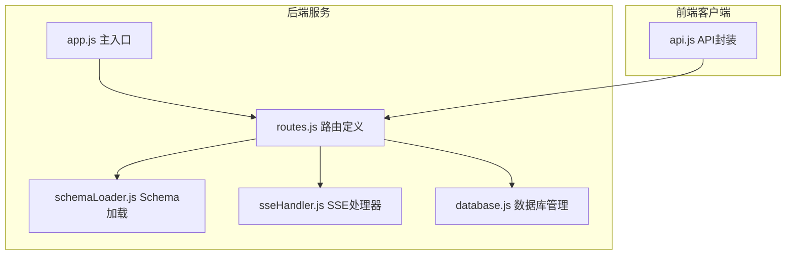
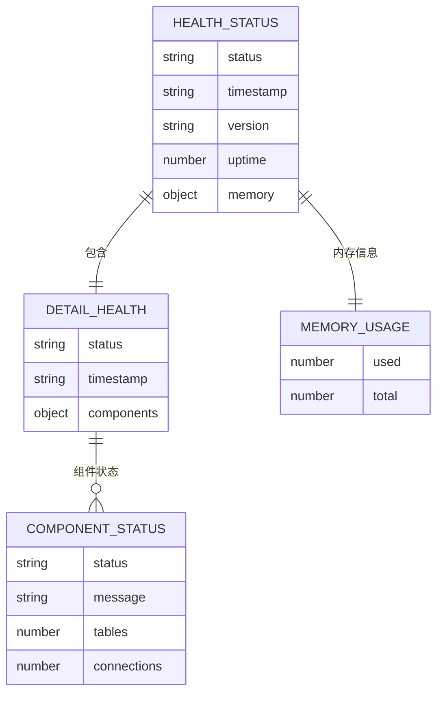
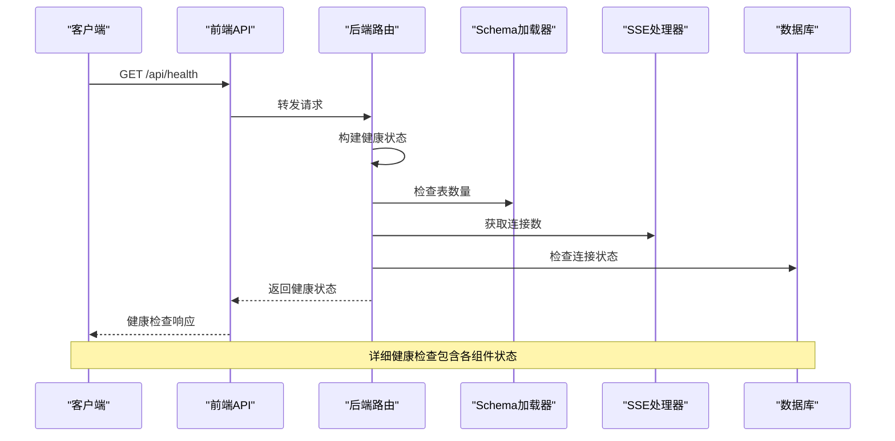
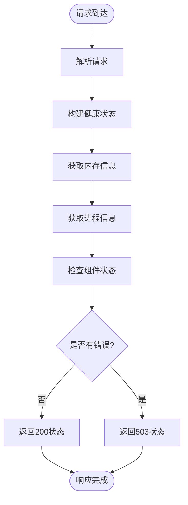
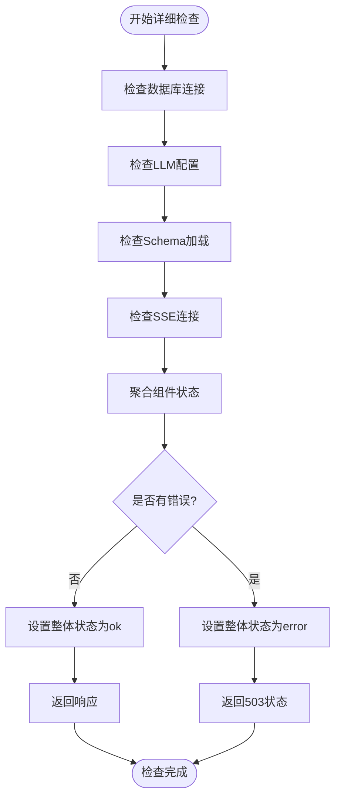
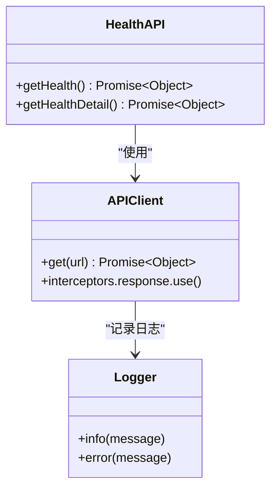
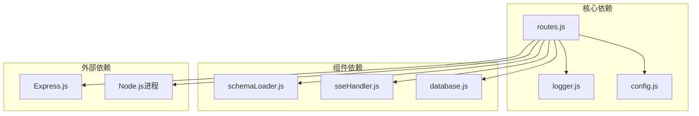

# 健康检查接口

<cite>
**本文档引用的文件**
- [routes.js](file://backend/src/core/routes.js)
- [app.js](file://backend/src/app.js)
- [api.js](file://frontend/src/utils/api.js)
- [sseHandler.js](file://backend/src/core/sseHandler.js)
- [schemaLoader.js](file://backend/src/core/schemaLoader.js)
- [database.js](file://backend/src/core/database.js)
</cite>

## 目录
1. [简介](#简介)
2. [项目结构](#项目结构)
3. [核心组件](#核心组件)
4. [架构概览](#架构概览)
5. [详细组件分析](#详细组件分析)
6. [依赖分析](#依赖分析)
7. [性能考虑](#性能考虑)
8. [故障排除指南](#故障排除指南)
9. [结论](#结论)

## 简介

健康检查接口是NL2SQL系统的重要监控组件，用于实时监测服务状态和各组件运行状况。该系统提供了两个级别的健康检查端点：基础健康检查（/api/health）和详细健康检查（/api/health/detail），为服务监控、故障诊断和运维管理提供全面的状态信息。

健康检查接口的主要用途包括：
- **服务状态监控**：实时检测NL2SQL服务的运行状态
- **组件健康状态检查**：监控数据库、LLM API、Schema加载、SSE连接等核心组件
- **性能指标收集**：提供内存使用、运行时间等关键性能数据
- **故障预警**：及时发现服务异常，支持自动恢复机制
- **运维支持**：为系统管理员提供完整的健康状态视图

## 项目结构

NL2SQL项目的健康检查接口主要分布在以下位置：



**图表来源**
- [app.js:78-80](file://backend/src/app.js#L78-L80)
- [routes.js:16-29](file://backend/src/core/routes.js#L16-L29)

**章节来源**
- [app.js:78-80](file://backend/src/app.js#L78-L80)
- [routes.js:16-29](file://backend/src/core/routes.js#L16-L29)

## 核心组件

### 健康检查端点概述

NL2SQL系统提供两个层次的健康检查接口：

1. **基础健康检查**：提供服务基本状态信息
2. **详细健康检查**：提供各组件详细状态信息

### 健康检查数据模型



**图表来源**
- [routes.js:72-94](file://backend/src/core/routes.js#L72-L94)
- [routes.js:100-137](file://backend/src/core/routes.js#L100-L137)

**章节来源**
- [routes.js:72-94](file://backend/src/core/routes.js#L72-L94)
- [routes.js:100-137](file://backend/src/core/routes.js#L100-L137)

## 架构概览

健康检查接口在整个NL2SQL系统中的位置和交互关系如下：



**图表来源**
- [api.js:98-108](file://frontend/src/utils/api.js#L98-L108)
- [routes.js:100-137](file://backend/src/core/routes.js#L100-L137)

**章节来源**
- [api.js:98-108](file://frontend/src/utils/api.js#L98-L108)
- [routes.js:100-137](file://backend/src/core/routes.js#L100-L137)

## 详细组件分析

### 基础健康检查接口

#### 接口定义

**端点**: `GET /api/health`

**功能**: 提供NL2SQL服务的基础健康状态信息

**响应格式**:
```javascript
{
  "status": "ok",                    // 服务状态：ok/error
  "timestamp": "2024-01-01T00:00:00Z", // 检查时间戳
  "version": "1.0.0",                // 服务版本
  "uptime": 3600,                    // 运行时间（秒）
  "memory": {                        // 内存使用情况
    "used": 128,                     // 已使用内存（MB）
    "total": 512                     // 总内存（MB）
  }
}
```

**请求处理流程**:



**图表来源**
- [routes.js:72-94](file://backend/src/core/routes.js#L72-L94)

**章节来源**
- [routes.js:72-94](file://backend/src/core/routes.js#L72-L94)

### 详细健康检查接口

#### 接口定义

**端点**: `GET /api/health/detail`

**功能**: 提供NL2SQL服务的详细健康状态信息，包含各组件的运行状态

**响应格式**:
```javascript
{
  "status": "ok",                    // 整体状态：ok/error
  "timestamp": "2024-01-01T00:00:00Z", // 检查时间戳
  "components": {                    // 组件状态
    "database": {                    // 数据库状态
      "status": "ok",               // 状态：ok/error
      "message": "SQLite连接正常"   // 状态消息
    },
    "llm": {                         // LLM API状态
      "status": "ok",
      "message": "LLM API配置正常"
    },
    "schema": {                      // Schema加载状态
      "status": "ok",
      "tables": 42                  // 表数量
    },
    "sse": {                         // SSE连接状态
      "status": "ok",
      "connections": 15             // 活跃连接数
    }
  }
}
```

**状态检查逻辑**:



**图表来源**
- [routes.js:100-137](file://backend/src/core/routes.js#L100-L137)

**章节来源**
- [routes.js:100-137](file://backend/src/core/routes.js#L100-L137)

### 组件状态检查机制

#### 数据库状态检查
- **检查方式**: 验证数据库连接是否正常
- **状态判断**: 基于数据库初始化过程的成功与否
- **错误处理**: 连接失败时返回error状态

#### Schema加载状态检查
- **检查方式**: 通过schemaLoader.getAllTables()获取表数量
- **状态判断**: 表数量 > 0 时为ok，否则为error
- **错误处理**: Schema加载失败时返回error状态

#### SSE连接状态检查
- **检查方式**: 通过sseHandler.getConnectionCount()获取连接数
- **状态判断**: 基于连接数的非负性
- **错误处理**: 连接异常时返回error状态

#### LLM API状态检查
- **检查方式**: 验证LLM配置是否正确
- **状态判断**: 基于配置验证的结果
- **错误处理**: 配置错误时返回error状态

**章节来源**
- [routes.js:105-126](file://backend/src/core/routes.js#L105-L126)

### 前端集成

#### API封装
前端通过api.js模块封装健康检查接口：



**图表来源**
- [api.js:98-108](file://frontend/src/utils/api.js#L98-L108)

**章节来源**
- [api.js:98-108](file://frontend/src/utils/api.js#L98-L108)

## 依赖分析

健康检查接口的依赖关系如下：



**图表来源**
- [routes.js:16-29](file://backend/src/core/routes.js#L16-L29)

**章节来源**
- [routes.js:16-29](file://backend/src/core/routes.js#L16-L29)

### 关键依赖说明

1. **Express中间件**: 提供请求日志记录功能
2. **Schema加载器**: 检查数据表加载状态
3. **SSE处理器**: 监控实时连接状态
4. **数据库管理**: 验证数据库连接有效性
5. **日志模块**: 记录健康检查过程中的关键事件

**章节来源**
- [routes.js:46-54](file://backend/src/core/routes.js#L46-L54)

## 性能考虑

### 健康检查性能特性

1. **低延迟设计**: 健康检查仅进行轻量级状态查询，响应时间通常小于100ms
2. **内存效率**: 不会加载大量数据，内存占用极低
3. **CPU友好**: 使用Node.js内置的process.uptime()和process.memoryUsage()函数
4. **并发安全**: 健康检查是无状态操作，支持高并发访问

### 监控最佳实践

1. **检查频率**: 建议每30-60秒进行一次基础健康检查
2. **详细检查**: 建议每5-10分钟进行一次详细健康检查
3. **告警阈值**: 
   - 基础检查: 500ms响应时间超时
   - 详细检查: 2秒响应时间超时
4. **重试策略**: 失败时最多重试3次，间隔1秒

### 性能监控指标

| 指标名称 | 描述 | 正常范围 | 告警阈值 |
|---------|------|----------|----------|
| 响应时间 | 健康检查响应时间 | < 500ms | > 1000ms |
| 内存使用率 | 已用内存占比 | < 80% | > 90% |
| 运行时间 | 服务持续运行时间 | 持续增长 | 异常下降 |
| 连接数 | SSE活跃连接数 | 根据业务量变化 | 异常激增 |

## 故障排除指南

### 常见错误场景

#### 健康检查失败

**症状**: 健康检查返回503状态码

**可能原因**:
1. 数据库连接异常
2. Schema文件加载失败
3. SSE连接池异常
4. LLM API配置错误

**解决步骤**:
1. 检查数据库连接状态
2. 验证Schema配置文件完整性
3. 查看SSE连接日志
4. 确认LLM API配置正确

#### 内存使用过高

**症状**: memory.used字段显示异常高值

**可能原因**:
1. 内存泄漏
2. 大量并发请求
3. 缓存未及时清理

**解决步骤**:
1. 检查内存泄漏点
2. 实施内存监控告警
3. 优化缓存策略

#### SSE连接异常

**症状**: sse.connections字段为0或异常波动

**可能原因**:
1. 客户端连接频繁断开
2. 服务器负载过高
3. Nginx配置问题

**解决步骤**:
1. 检查Nginx配置
2. 监控服务器负载
3. 优化SSE连接管理

### 调试技巧

1. **启用详细日志**: 在开发环境中启用DEBUG级别日志
2. **性能分析**: 使用Node.js内置的profiler分析性能瓶颈
3. **监控仪表板**: 集成Prometheus和Grafana进行可视化监控
4. **自动化测试**: 编写健康检查的自动化测试用例

**章节来源**
- [routes.js:129-136](file://backend/src/core/routes.js#L129-L136)

## 结论

NL2SQL系统的健康检查接口设计合理，提供了多层次的服务监控能力。通过基础健康检查和详细健康检查的结合，能够有效监控服务状态、组件运行状况和性能指标。

### 主要优势

1. **双层监控**: 基础检查提供快速状态概览，详细检查提供深入诊断信息
2. **组件覆盖**: 涵盖数据库、Schema、SSE、LLM等核心组件
3. **性能友好**: 设计注重性能，不影响正常业务运行
4. **易于集成**: 与现有系统无缝集成，支持多种监控工具

### 改进建议

1. **扩展监控维度**: 可以增加更多性能指标如QPS、错误率等
2. **智能告警**: 实现基于历史数据的智能告警阈值
3. **分布式支持**: 支持微服务架构下的分布式健康检查
4. **API版本化**: 为健康检查接口提供版本控制

健康检查接口作为NL2SQL系统的重要组成部分，为系统的稳定运行和高效运维提供了坚实的技术保障。通过合理的监控策略和故障排除流程，可以确保系统始终保持最佳运行状态。