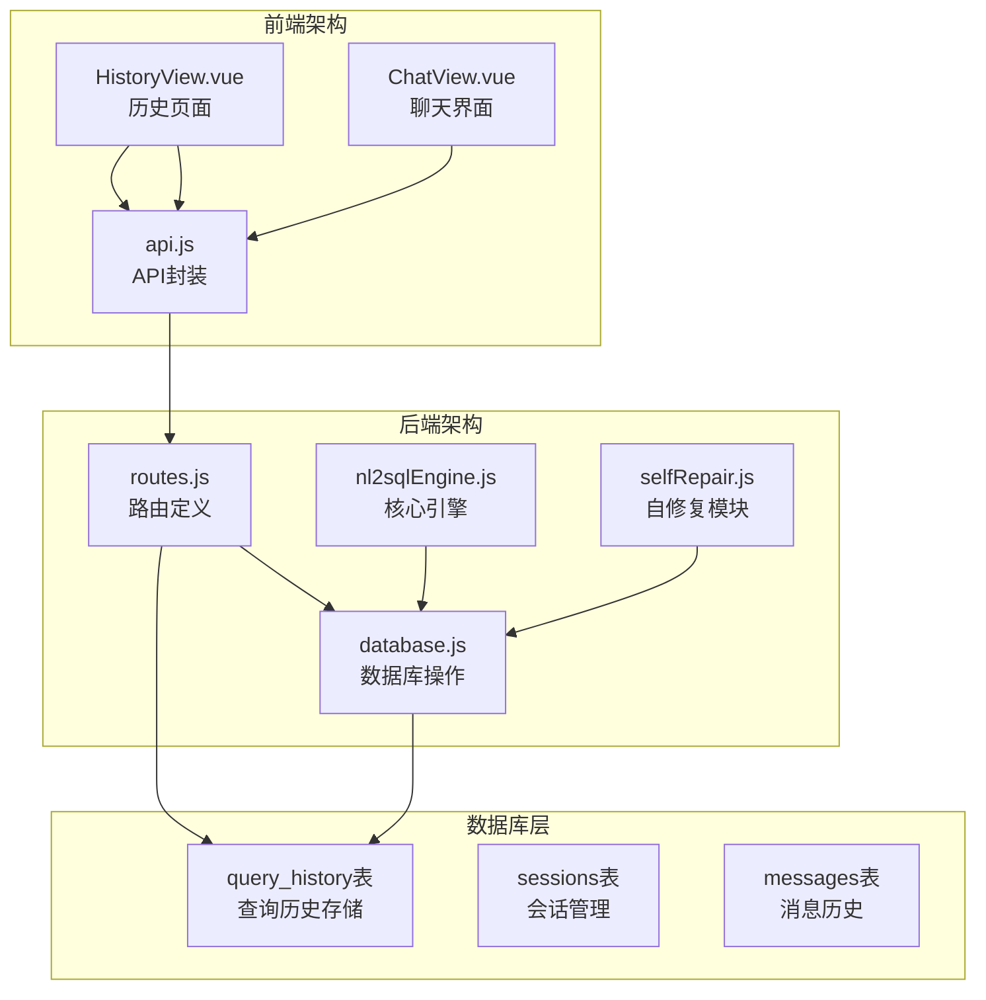
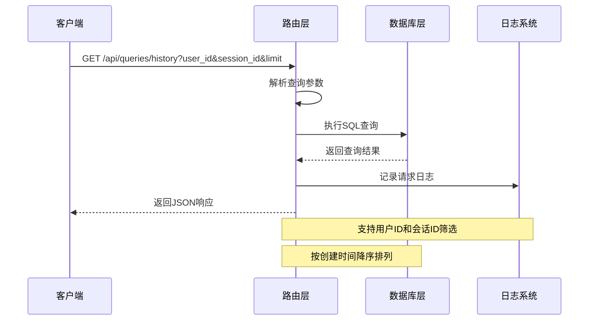
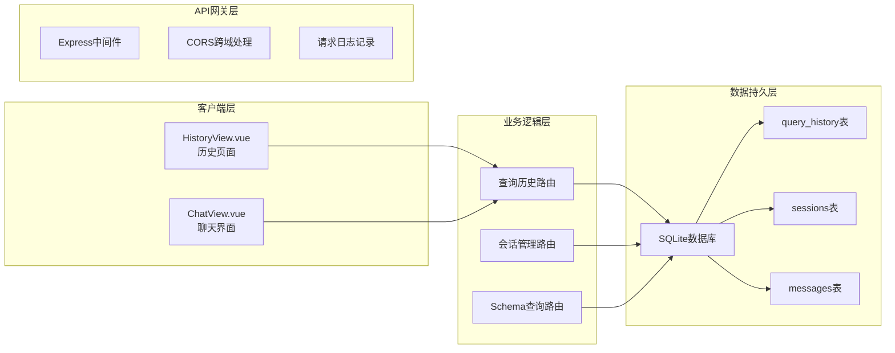
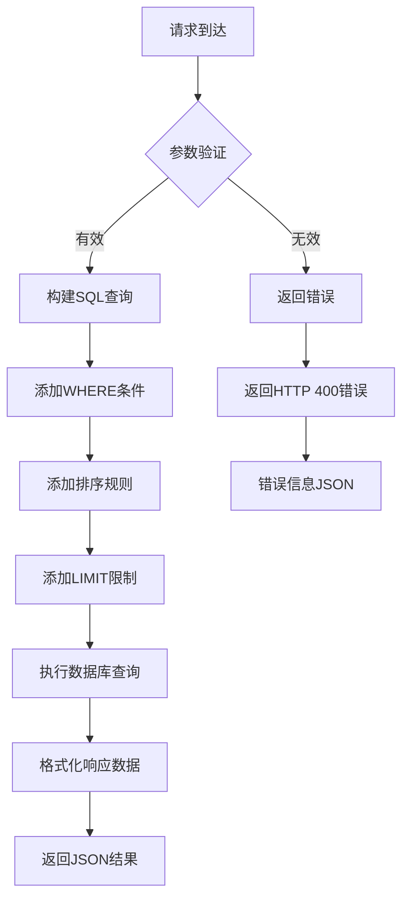
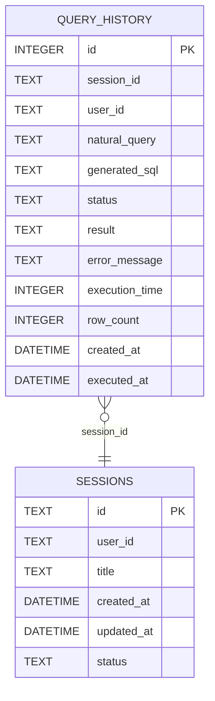
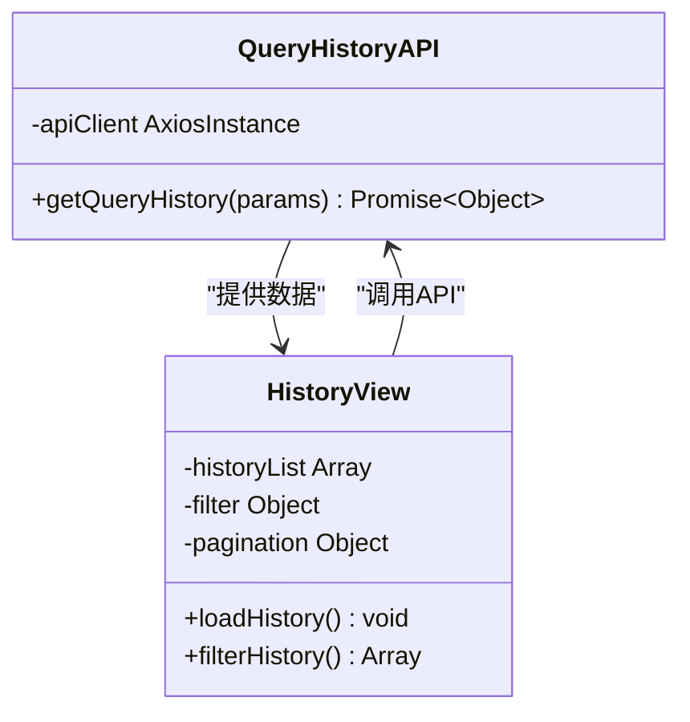
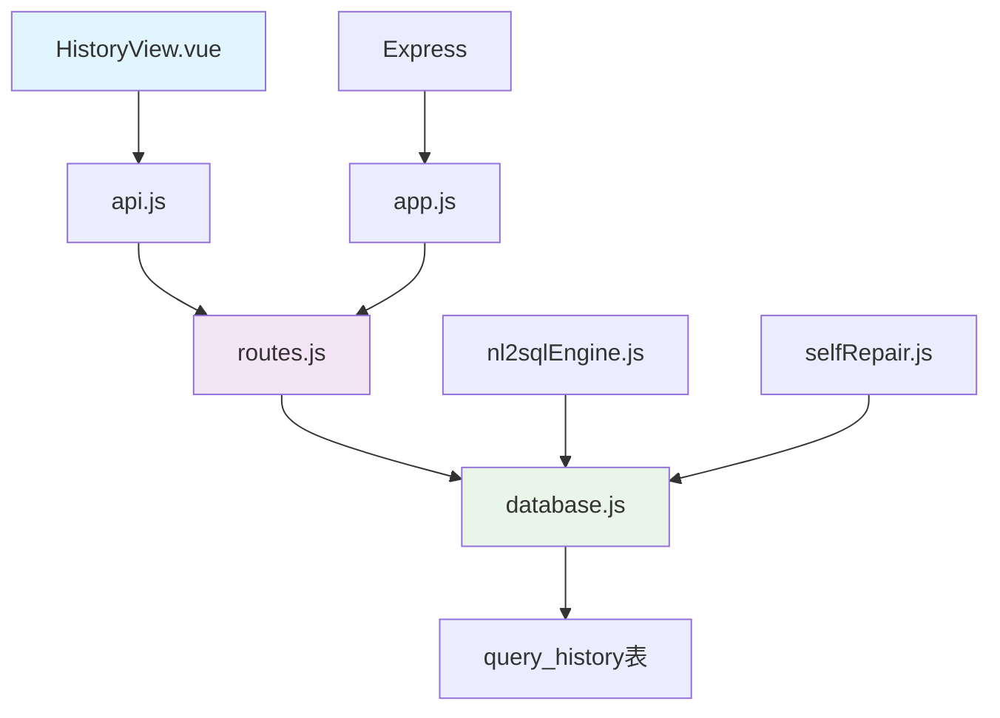

# 查询历史接口

<cite>
**本文档引用的文件**
- [routes.js](file://backend/src/core/routes.js)
- [database.js](file://backend/src/core/database.js)
- [api.js](file://frontend/src/utils/api.js)
- [HistoryView.vue](file://frontend/src/views/HistoryView.vue)
- [app.js](file://backend/src/app.js)
</cite>

## 目录
1. [简介](#简介)
2. [项目结构](#项目结构)
3. [核心组件](#核心组件)
4. [架构概览](#架构概览)
5. [详细组件分析](#详细组件分析)
6. [依赖分析](#依赖分析)
7. [性能考虑](#性能考虑)
8. [故障排除指南](#故障排除指南)
9. [结论](#结论)

## 简介

查询历史接口是NL2SQL系统中的重要功能模块，用于管理和检索用户的查询历史记录。该接口提供了对query_history表的查询能力，支持按用户ID、会话ID进行筛选，并按照创建时间降序排列。

## 项目结构

NL2SQL项目采用前后端分离的架构设计，查询历史功能涉及以下关键文件：



**图表来源**
- [routes.js:400-450](file://backend/src/core/routes.js#L400-L450)
- [database.js:94-135](file://backend/src/core/database.js#L94-L135)

**章节来源**
- [routes.js:1-100](file://backend/src/core/routes.js#L1-L100)
- [app.js:75-85](file://backend/src/app.js#L75-L85)

## 核心组件

### 查询历史表结构

查询历史功能基于SQLite数据库的query_history表，该表设计支持完整的查询历史管理需求：

| 字段名 | 数据类型 | 描述 | 索引 |
|--------|----------|------|------|
| id | INTEGER | 查询记录唯一标识（自增） | 主键 |
| session_id | TEXT | 所属会话ID（外键） | 索引 |
| user_id | TEXT | 用户标识 | 索引 |
| natural_query | TEXT | 用户的自然语言查询 | - |
| generated_sql | TEXT | 生成的SQL语句 | - |
| status | TEXT | 查询执行状态 | 索引 |
| result | TEXT | 查询执行结果（JSON格式） | - |
| error_message | TEXT | 错误信息 | - |
| execution_time | INTEGER | 执行耗时（毫秒） | - |
| row_count | INTEGER | 返回行数 | - |
| created_at | DATETIME | 查询创建时间 | 索引 |
| executed_at | DATETIME | 查询执行时间 | - |

**章节来源**
- [database.js:94-135](file://backend/src/core/database.js#L94-L135)

### 路由定义与实现

查询历史接口在routes.js中定义为GET /api/queries/history端点，提供灵活的查询筛选和排序功能：



**图表来源**
- [routes.js:404-450](file://backend/src/core/routes.js#L404-L450)

**章节来源**
- [routes.js:404-450](file://backend/src/core/routes.js#L404-L450)

## 架构概览

查询历史接口在整个NL2SQL系统中的位置和作用：



**图表来源**
- [app.js:63-80](file://backend/src/app.js#L63-L80)
- [routes.js:1-50](file://backend/src/core/routes.js#L1-L50)

## 详细组件分析

### API端点规范

#### 端点定义
- **路径**: `/api/queries/history`
- **方法**: `GET`
- **功能**: 获取查询历史记录

#### 请求参数

| 参数名 | 类型 | 必需 | 默认值 | 描述 |
|--------|------|------|--------|------|
| user_id | string | 否 | - | 用户ID筛选条件 |
| session_id | string | 否 | - | 会话ID筛选条件 |
| limit | number | 否 | 20 | 返回记录数量限制 |

#### 响应格式



**图表来源**
- [routes.js:413-450](file://backend/src/core/routes.js#L413-L450)

#### 响应结构

```json
{
  "count": 5,
  "history": [
    {
      "id": 1,
      "session_id": "session-123",
      "user_id": "user-456",
      "natural_query": "查询用户总数",
      "generated_sql": "SELECT COUNT(*) FROM users",
      "status": "success",
      "result": "{\"count\": 100}",
      "error_message": null,
      "execution_time": 150,
      "row_count": 1,
      "created_at": "2024-01-15T10:30:00Z",
      "executed_at": "2024-01-15T10:30:00Z"
    }
  ]
}
```

**章节来源**
- [routes.js:404-450](file://backend/src/core/routes.js#L404-L450)

### 数据存储机制

#### 数据库初始化

查询历史表在数据库初始化时自动创建，包含以下索引以优化查询性能：



**图表来源**
- [database.js:94-135](file://backend/src/core/database.js#L94-L135)

#### 查询优化策略

系统通过以下索引实现高效查询：

1. **用户ID索引** (`idx_query_history_user_id`): 支持按用户快速筛选
2. **会话ID索引** (`idx_query_history_session_id`): 支持按会话快速筛选  
3. **创建时间索引** (`idx_query_history_created_at`): 支持时间排序
4. **状态索引** (`idx_query_history_status`): 支持状态筛选

**章节来源**
- [database.js:127-134](file://backend/src/core/database.js#L127-L134)

### 前端集成

#### API封装

前端通过api.js模块封装查询历史API调用：



**图表来源**
- [api.js:201-209](file://frontend/src/utils/api.js#L201-L209)
- [HistoryView.vue:223-243](file://frontend/src/views/HistoryView.vue#L223-L243)

#### 前端筛选功能

前端实现了多维度的查询历史筛选功能：

| 筛选类型 | 控制器 | 实现方式 | 功能描述 |
|----------|--------|----------|----------|
| 文本搜索 | el-input | 本地过滤 | 按查询内容模糊匹配 |
| 状态筛选 | el-select | 本地过滤 | 支持成功/失败状态筛选 |
| 时间范围 | el-date-picker | 本地过滤 | 按创建时间范围筛选 |
| 分页控制 | Element Plus分页 | 本地分页 | 支持大数据量分页显示 |

**章节来源**
- [api.js:201-209](file://frontend/src/utils/api.js#L201-L209)
- [HistoryView.vue:190-217](file://frontend/src/views/HistoryView.vue#L190-L217)

## 依赖分析

### 组件耦合关系



**图表来源**
- [app.js:48-50](file://backend/src/app.js#L48-L50)
- [routes.js:16-30](file://backend/src/core/routes.js#L16-L30)

### 外部依赖

查询历史接口依赖以下外部模块：

| 模块 | 版本 | 用途 | 依赖关系 |
|------|------|------|----------|
| express | 最新版 | Web框架 | 核心依赖 |
| sqlite3 | 最新版 | SQLite驱动 | 数据库访问 |
| dayjs | 最新版 | 时间处理 | 前端显示 |
| element-plus | 最新版 | UI组件库 | 前端界面 |

**章节来源**
- [app.js:22-34](file://backend/src/app.js#L22-L34)
- [HistoryView.vue:1-50](file://frontend/src/views/HistoryView.vue#L1-L50)

## 性能考虑

### 查询性能优化

1. **索引优化**: 通过多列索引支持高效的筛选和排序操作
2. **参数化查询**: 使用参数绑定防止SQL注入并提高查询缓存效率
3. **分页机制**: 限制单次查询返回的记录数量，避免大数据量传输
4. **时间索引**: 创建created_at索引支持高效的排序和范围查询

### 存储优化策略

1. **数据压缩**: JSON格式的结果存储占用较小空间
2. **外键约束**: 通过外键保证数据一致性
3. **事务处理**: 批量操作使用事务确保原子性

## 故障排除指南

### 常见错误及解决方案

| 错误类型 | HTTP状态码 | 错误原因 | 解决方案 |
|----------|------------|----------|----------|
| 数据库连接失败 | 500 | SQLite初始化失败 | 检查数据库文件权限和路径 |
| SQL查询错误 | 500 | 查询语法错误 | 验证查询参数和表结构 |
| 参数缺失 | 400 | 必需参数未提供 | 确保提供有效的user_id或session_id |
| 数据库未初始化 | 500 | 表结构未创建 | 重启服务触发数据库初始化 |

### 调试建议

1. **启用详细日志**: 检查后端日志输出SQL执行详情
2. **验证数据库状态**: 确认query_history表存在且结构正确
3. **测试查询性能**: 使用EXPLAIN查询计划分析慢查询
4. **监控内存使用**: 关注SQLite数据库文件大小增长

**章节来源**
- [routes.js:444-449](file://backend/src/core/routes.js#L444-L449)

## 结论

查询历史接口作为NL2SQL系统的重要组成部分，提供了完整的查询历史管理功能。通过合理的数据库设计、高效的查询优化和完善的前端集成，该接口能够满足用户对查询历史的查看、筛选和管理需求。

系统的主要优势包括：
- **高性能**: 通过索引优化和参数化查询实现快速响应
- **易用性**: 简洁的API设计和丰富的筛选选项
- **可靠性**: 完善的错误处理和日志记录机制
- **扩展性**: 模块化设计支持功能扩展和性能优化

未来可以考虑的改进方向：
- 添加更多筛选条件（如状态、时间范围）
- 实现增量更新和实时同步
- 优化大数据量场景下的查询性能
- 增强查询历史的统计分析功能