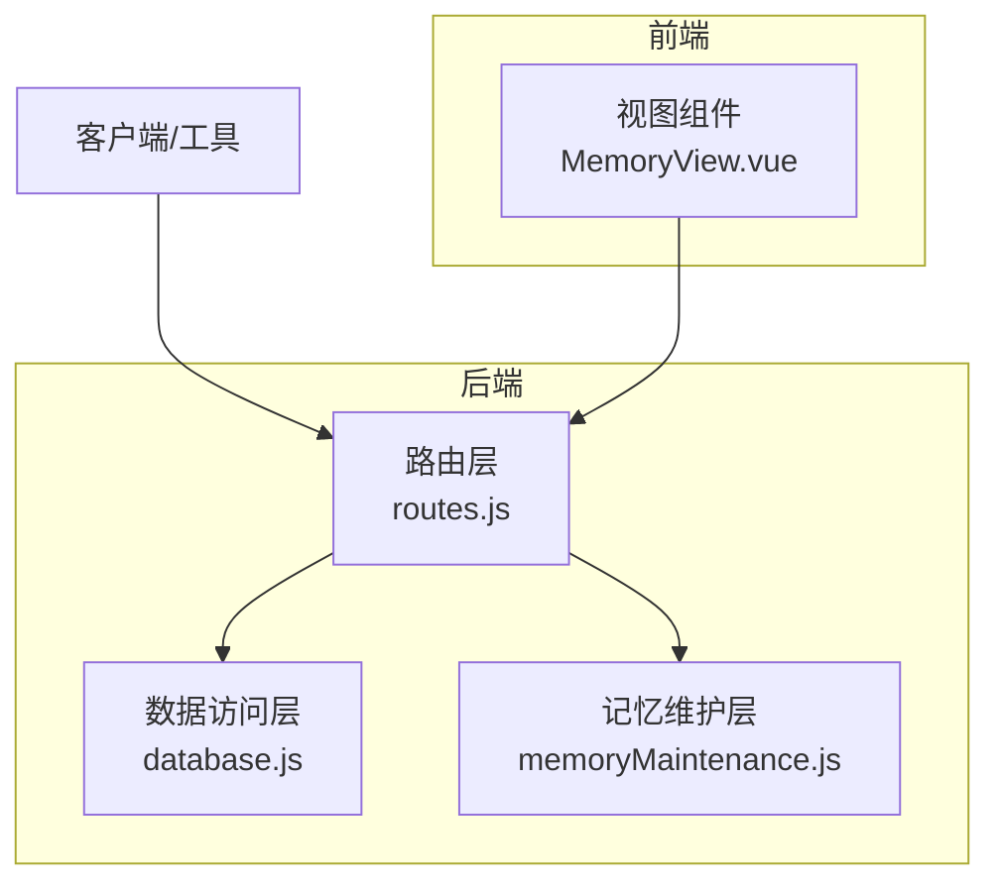
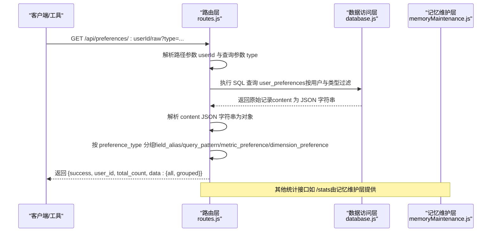
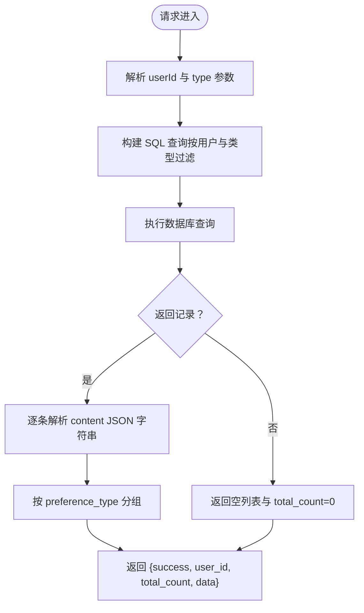
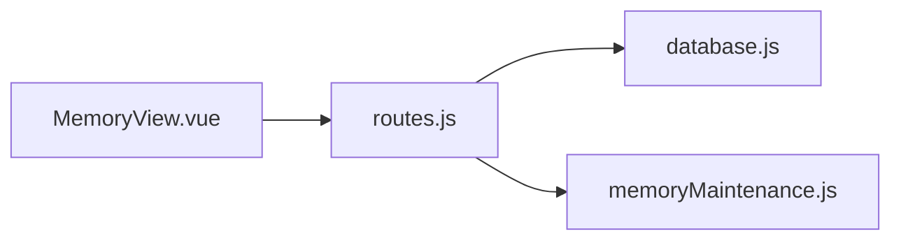

# 原始记忆数据

<cite>
**本文引用的文件**
- [routes.js](file://backend/src/core/routes.js)
- [database.js](file://backend/src/core/database.js)
- [memoryMaintenance.js](file://backend/src/memory/memoryMaintenance.js)
- [MemoryView.vue](file://frontend/src/views/MemoryView.vue)
</cite>

## 目录
1. [简介](#简介)
2. [项目结构](#项目结构)
3. [核心组件](#核心组件)
4. [架构概览](#架构概览)
5. [详细组件分析](#详细组件分析)
6. [依赖关系分析](#依赖关系分析)
7. [性能考量](#性能考量)
8. [故障排查指南](#故障排查指南)
9. [结论](#结论)

## 简介
本文件针对 NL2SQL 项目的“原始记忆数据”接口进行深入说明，重点围绕后端路由 GET /api/preferences/:userId/raw 的功能与实现细节，涵盖：
- 接口用途与参数说明（type 可选过滤）
- 返回数据的 JSON 解析处理流程
- 原始数据存储格式与 content 字段结构
- 按偏好类型分组的数据组织方式
- 调试与数据分析使用场景
- 数据格式转换与分组逻辑的实现要点

该接口专用于“原始记忆数据”的调试与分析，直接返回数据库中 user_preferences 表的原始记录，便于开发者与分析师快速定位问题、验证偏好抽取效果、复盘用户习惯。

## 项目结构
与原始记忆数据接口相关的核心文件与职责如下：
- 后端路由层：定义 /api/preferences/:userId/raw 端点，负责参数解析、SQL 查询、JSON 解析与分组
- 数据访问层：封装 SQLite 操作，提供查询、插入、更新、删除等基础能力
- 记忆维护层：提供用户记忆统计、清理与健康报告等高级功能
- 前端展示：MemoryView.vue 展示偏好数据，便于人工核对与验证

图表来源
- [routes.js](file://backend/src/core/routes.js)
- [database.js](file://backend/src/core/database.js)
- [memoryMaintenance.js](file://backend/src/memory/memoryMaintenance.js)
- [MemoryView.vue](file://frontend/src/views/MemoryView.vue)

章节来源
- [routes.js](file://backend/src/core/routes.js)
- [database.js](file://backend/src/core/database.js)
- [memoryMaintenance.js](file://backend/src/memory/memoryMaintenance.js)
- [MemoryView.vue](file://frontend/src/views/MemoryView.vue)

## 核心组件
- 路由端点：GET /api/preferences/:userId/raw
  - 功能：按用户 ID 获取原始偏好记录，支持按偏好类型过滤；返回解析后的 JSON 数据与按类型的分组结果
  - 参数：
    - 路径参数：userId（必填）
    - 查询参数：type（可选，支持 query_pattern、field_alias、metric_preference、dimension_preference）
  - 返回：包含 success、user_id、total_count、data.all、data.grouped 的结构化响应
- 数据访问层：
  - 提供 user_preferences 表的查询、解析 JSON、索引优化等能力
  - 支持按用户与类型过滤，以及按使用次数与时间排序
- 记忆维护层：
  - 提供用户记忆统计、清理策略与健康报告，辅助理解偏好分布与生命周期

章节来源
- [routes.js](file://backend/src/core/routes.js)
- [database.js](file://backend/src/core/database.js)
- [memoryMaintenance.js](file://backend/src/memory/memoryMaintenance.js)

## 架构概览
原始记忆数据接口的调用链路如下：

图表来源
- [routes.js](file://backend/src/core/routes.js)
- [database.js](file://backend/src/core/database.js)
- [memoryMaintenance.js](file://backend/src/memory/memoryMaintenance.js)

## 详细组件分析

### 端点：GET /api/preferences/:userId/raw
- 功能概述
  - 获取指定用户的原始偏好记录，用于调试与数据分析
  - 支持按偏好类型过滤，便于聚焦特定类型的偏好
  - 返回解析后的 JSON 数据与按类型的分组结果
- 参数与行为
  - 路径参数：userId（必填）
  - 查询参数：type（可选），支持四种类型之一
  - SQL 查询：按用户过滤，可选按类型过滤，按 preference_type 与创建时间排序
- 数据解析与分组
  - 将 content 字段从 JSON 字符串解析为对象
  - 按 preference_type 分组为 field_alias、query_pattern、metric_preference、dimension_preference 四类
- 返回结构
  - success：布尔值，指示请求是否成功
  - user_id：用户标识
  - total_count：匹配记录总数
  - data.all：解析后的原始记录列表
  - data.grouped：按类型分组的记录集合

图表来源
- [routes.js](file://backend/src/core/routes.js)

章节来源
- [routes.js](file://backend/src/core/routes.js)

### 数据存储与 content 字段结构
- 表结构与字段
  - 表名：user_preferences
  - 关键字段：id、user_id、preference_type、content、usage_count、last_used_at、created_at、updated_at、is_pinned、priority、source
  - 索引：user_id、preference_type、复合索引 (user_id, preference_type)
- content 字段
  - 存储格式：JSON 字符串
  - 解析时机：接口返回前统一解析为对象，便于前端与工具直接消费
  - 常见结构（示例形态）
    - 字段别名：包含 user_term、schema_field、field_type 等
    - 查询模式：包含 name、dimensions、metrics 等
    - 指标/维度偏好：包含字段名、使用习惯等
- 类型枚举
  - 支持类型：field_alias、query_pattern、metric_preference、dimension_preference

章节来源
- [database.js](file://backend/src/core/database.js)

### 分组与统计接口
- 分组逻辑
  - 在原始记忆接口中，按 preference_type 将记录分为四类并返回 grouped
  - 便于快速定位某类偏好的历史与分布
- 统计接口
  - /api/preferences/:userId/stats：按类型统计数量、平均使用次数、最大使用次数与最久使用时间
  - 用于宏观评估用户记忆的健康状况与使用趋势

章节来源
- [routes.js](file://backend/src/core/routes.js)
- [memoryMaintenance.js](file://backend/src/memory/memoryMaintenance.js)

### 前端展示与调试联动
- MemoryView.vue
  - 展示不同类型的偏好记录，便于人工核对与验证
  - 与后端接口配合，形成“采集—解析—展示—反馈”的闭环
- 使用建议
  - 结合前端表格与后端原始数据，快速定位偏好抽取异常或解析错误
  - 通过 type 参数缩小范围，提高排查效率

章节来源
- [MemoryView.vue](file://frontend/src/views/MemoryView.vue)

## 依赖关系分析
- 路由层依赖数据访问层提供的查询能力
- 记忆维护层提供统计与清理能力，与路由层并行存在
- 前端视图组件依赖路由层提供的数据结构

图表来源
- [routes.js](file://backend/src/core/routes.js)
- [database.js](file://backend/src/core/database.js)
- [memoryMaintenance.js](file://backend/src/memory/memoryMaintenance.js)
- [MemoryView.vue](file://frontend/src/views/MemoryView.vue)

章节来源
- [routes.js](file://backend/src/core/routes.js)
- [database.js](file://backend/src/core/database.js)
- [memoryMaintenance.js](file://backend/src/memory/memoryMaintenance.js)
- [MemoryView.vue](file://frontend/src/views/MemoryView.vue)

## 性能考量
- 查询优化
  - user_id、preference_type、(user_id, preference_type) 索引有助于提升按用户与类型过滤的查询性能
- JSON 解析成本
  - content 字段在返回前统一解析，避免重复解析带来的开销
- 分页与限制
  - 原始记忆接口未内置 limit 参数，建议在调用方控制返回量，避免一次性拉取过多数据
- 统计接口
  - /api/preferences/:userId/stats 适合批量统计，减少对原始数据的大规模扫描

章节来源
- [database.js](file://backend/src/core/database.js)
- [routes.js](file://backend/src/core/routes.js)

## 故障排查指南
- 常见问题与定位步骤
  - 无法解析 content 字段
    - 确认 content 是否为合法 JSON 字符串；若为空或格式错误，解析会失败
  - 返回空列表
    - 检查 userId 是否正确；确认是否存在该用户的偏好记录
    - 若设置了 type 参数，确认类型拼写与枚举一致
  - 性能问题
    - 确认数据库索引是否存在；必要时重建索引
    - 控制返回量，避免一次性拉取大量数据
- 相关接口对照
  - 原始记忆接口：GET /api/preferences/:userId/raw
  - 统计接口：GET /api/preferences/:userId/stats
  - 偏好列表接口：GET /api/preferences/:userId（用于对比解析后的结构差异）

章节来源
- [routes.js](file://backend/src/core/routes.js)
- [database.js](file://backend/src/core/database.js)
- [memoryMaintenance.js](file://backend/src/memory/memoryMaintenance.js)

## 结论
原始记忆数据接口为 NL2SQL 的长期记忆系统提供了直达底层数据的调试通道。通过 type 参数过滤与 content 字段的统一 JSON 解析，结合按类型的分组结果，能够高效地完成偏好数据的采集、验证与分析。配合统计接口与前端展示组件，可形成从数据采集到问题定位的完整闭环，为持续优化用户偏好抽取与记忆维护策略提供坚实支撑。