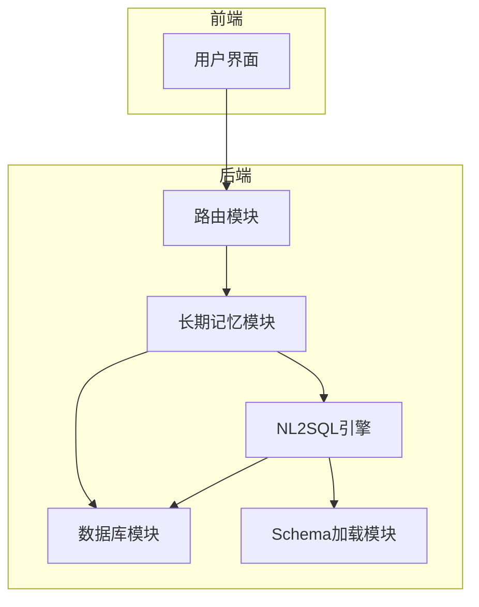
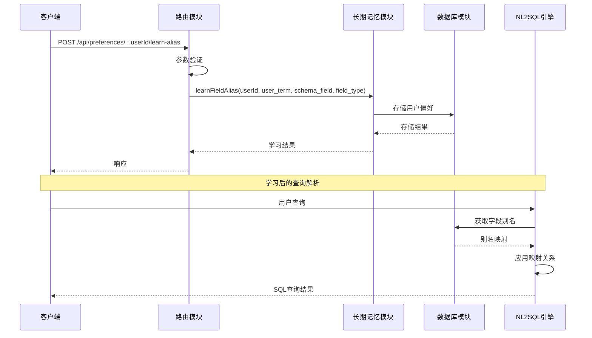
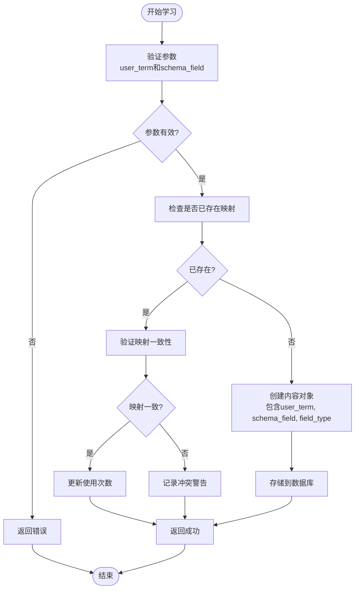
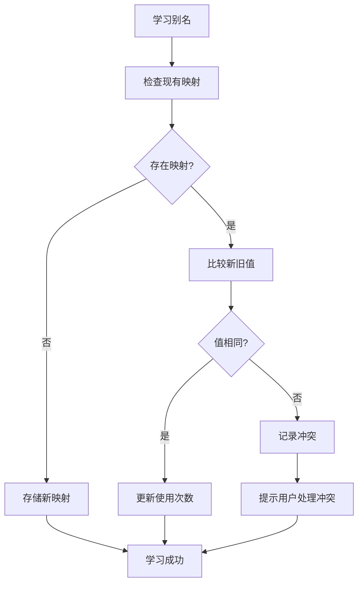
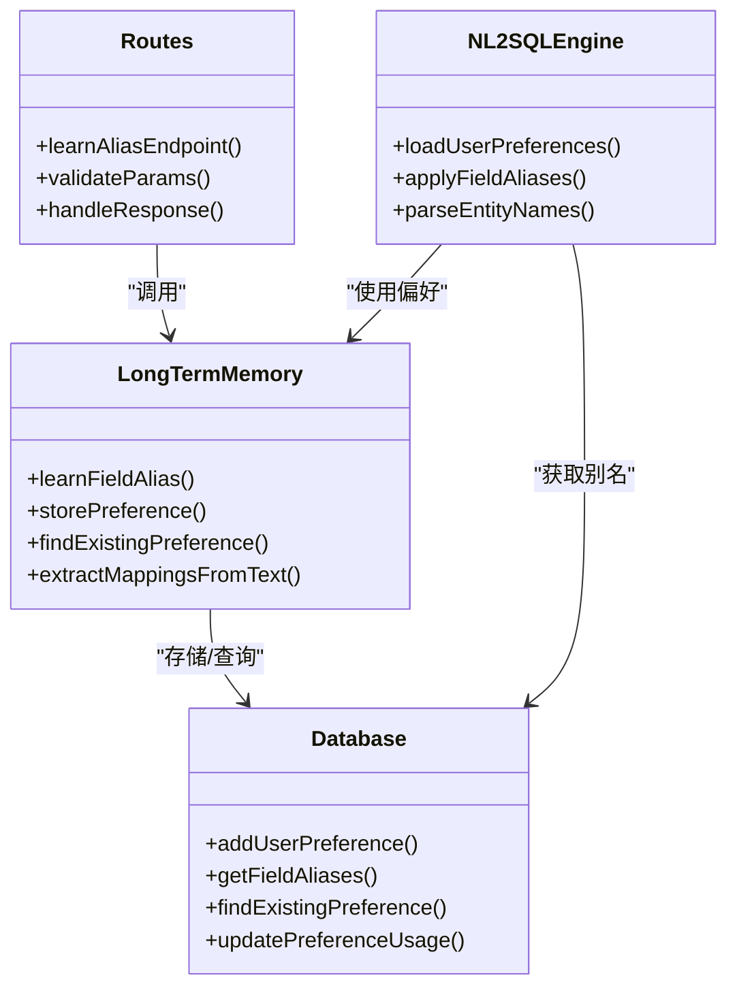
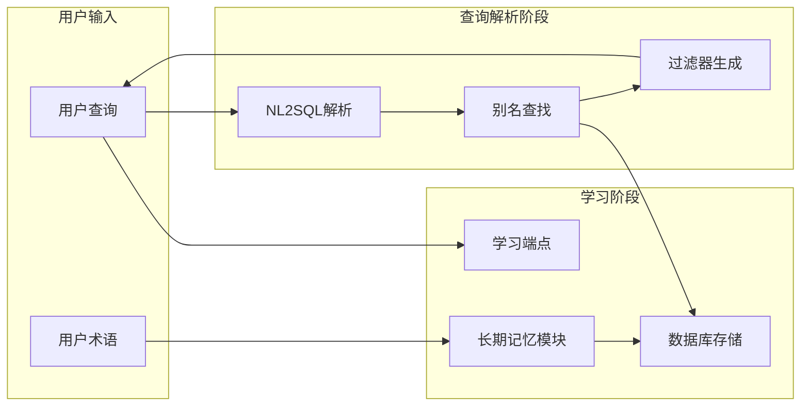

# 字段别名学习

<cite>
**本文档引用的文件**
- [routes.js](file://backend/src/core/routes.js)
- [longTermMemory.js](file://backend/src/memory/longTermMemory.js)
- [nl2sqlEngine.js](file://backend/src/core/nl2sqlEngine.js)
- [database.js](file://backend/src/core/database.js)
- [business-semantic-layer.json](file://backend/config/business-semantic-layer.json)
- [schemaLoader.js](file://backend/src/core/schemaLoader.js)
</cite>

## 目录
1. [简介](#简介)
2. [项目结构](#项目结构)
3. [核心组件](#核心组件)
4. [架构概览](#架构概览)
5. [详细组件分析](#详细组件分析)
6. [依赖关系分析](#依赖关系分析)
7. [性能考虑](#性能考虑)
8. [故障排除指南](#故障排除指南)
9. [结论](#结论)

## 简介
字段别名学习功能是NL2SQL系统中的重要组成部分，它允许用户通过自然语言与数据库字段建立映射关系。该功能通过POST /api/preferences/:userId/learn-alias端点实现，支持用户术语与Schema字段之间的双向映射，包括指标、维度和过滤器等不同类型的字段。

## 项目结构
NL2SQL项目采用模块化架构设计，主要包含以下核心模块：
- **核心路由模块**：定义REST API端点和请求处理逻辑
- **长期记忆模块**：负责用户偏好存储、检索和管理
- **NL2SQL引擎**：执行自然语言到SQL的转换和实体解析
- **数据库模块**：提供用户偏好数据的持久化存储
- **Schema加载模块**：管理数据库表结构和字段定义



**图表来源**
- [routes.js:667-716](file://backend/src/core/routes.js#L667-L716)
- [longTermMemory.js:1-50](file://backend/src/memory/longTermMemory.js#L1-L50)
- [nl2sqlEngine.js:400-572](file://backend/src/core/nl2sqlEngine.js#L400-L572)

## 核心组件

### POST /api/preferences/:userId/learn-alias 端点
该端点用于手动学习字段别名映射关系，支持用户通过自然语言表达与数据库字段建立联系。

**请求参数定义**：
- `user_term` (必需)：用户使用的自然语言术语
- `schema_field` (必需)：对应的Schema字段或值
- `field_type` (可选，默认: metric)：字段类型，支持metric、dimension、filter

**请求体示例**：
```json
{
  "user_term": "青木",
  "schema_field": "30",
  "field_type": "game"
}
```

**响应格式**：
- 成功：返回学习结果和状态信息
- 失败：返回错误信息和HTTP状态码

**章节来源**
- [routes.js:667-716](file://backend/src/core/routes.js#L667-L716)

### 字段别名学习机制
字段别名学习通过以下步骤实现：
1. **参数验证**：确保user_term和schema_field参数有效
2. **冲突检测**：检查是否存在相同的用户术语映射
3. **存储处理**：将映射关系存储到用户偏好数据库
4. **类型处理**：支持多种字段类型和映射格式

**章节来源**
- [longTermMemory.js:758-812](file://backend/src/memory/longTermMemory.js#L758-L812)

## 架构概览



**图表来源**
- [routes.js:677-716](file://backend/src/core/routes.js#L677-L716)
- [longTermMemory.js:758-812](file://backend/src/memory/longTermMemory.js#L758-L812)
- [nl2sqlEngine.js:406-572](file://backend/src/core/nl2sqlEngine.js#L406-L572)

## 详细组件分析

### 字段别名学习流程



**图表来源**
- [longTermMemory.js:758-812](file://backend/src/memory/longTermMemory.js#L758-L812)
- [database.js:733-760](file://backend/src/core/database.js#L733-L760)

### 支持的字段类型

系统支持以下字段类型的学习和应用：

| 字段类型 | 描述 | 示例场景 |
|---------|------|----------|
| metric | 指标字段 | 收入金额、付费订单数、留存率 |
| dimension | 维度字段 | 游戏ID、渠道ID、日期 |
| filter | 过滤器字段 | 平台类型、服务器ID、时间范围 |
| game | 游戏实体映射 | 游戏名称到game_id的映射 |
| datasource | 数据源映射 | 平台标识到数据库标识的映射 |

**章节来源**
- [longTermMemory.js:758-812](file://backend/src/memory/longTermMemory.js#L758-L812)
- [nl2sqlEngine.js:882-885](file://backend/src/core/nl2sqlEngine.js#L882-L885)

### 学习结果存储和使用

#### 存储结构
学习的字段别名以JSON格式存储在用户偏好表中：

```json
{
  "user_term": "青木",
  "schema_field": "30",
  "field_type": "game",
  "confidence": 0.8,
  "usage_count": 1
}
```

#### 使用流程
1. **查询解析阶段**：NL2SQL引擎加载用户偏好
2. **别名匹配**：在用户查询中查找匹配的别名
3. **映射应用**：将用户术语替换为实际的Schema字段
4. **过滤器生成**：生成对应的SQL过滤器

**章节来源**
- [database.js:704-724](file://backend/src/core/database.js#L704-L724)
- [nl2sqlEngine.js:406-572](file://backend/src/core/nl2sqlEngine.js#L406-L572)

### 冲突处理机制

系统实现了完善的冲突处理机制：



**图表来源**
- [longTermMemory.js:769-790](file://backend/src/memory/longTermMemory.js#L769-L790)

## 依赖关系分析

### 组件耦合关系



**图表来源**
- [routes.js:667-716](file://backend/src/core/routes.js#L667-L716)
- [longTermMemory.js:758-812](file://backend/src/memory/longTermMemory.js#L758-L812)
- [database.js:827-859](file://backend/src/core/database.js#L827-L859)

### 数据流分析



**图表来源**
- [nl2sqlEngine.js:406-572](file://backend/src/core/nl2sqlEngine.js#L406-L572)
- [longTermMemory.js:758-812](file://backend/src/memory/longTermMemory.js#L758-L812)

## 性能考虑

### 存储优化策略
1. **使用JSON字段**：利用SQLite的JSON1扩展存储复杂结构
2. **索引优化**：为user_term和schema_field建立索引
3. **缓存机制**：在内存中缓存常用的别名映射
4. **批量操作**：支持批量学习和查询操作

### 查询优化策略
1. **向量化搜索**：使用嵌入向量加速相似别名查找
2. **预编译查询**：减少SQL解析开销
3. **连接池管理**：优化数据库连接复用
4. **异步处理**：学习操作采用异步方式避免阻塞

## 故障排除指南

### 常见问题及解决方案

| 问题类型 | 症状 | 解决方案 |
|---------|------|----------|
| 参数验证失败 | 返回400错误 | 确保user_term和schema_field参数有效 |
| 存储冲突 | 记录冲突警告 | 检查现有映射并处理冲突 |
| 查询解析失败 | 别名未生效 | 验证用户偏好加载和别名匹配逻辑 |
| 性能问题 | 学习响应慢 | 检查数据库索引和查询优化 |

### 调试建议
1. **启用详细日志**：查看学习过程中的详细信息
2. **检查数据库状态**：验证用户偏好表结构和数据
3. **测试查询解析**：验证别名映射在查询中的应用
4. **监控性能指标**：关注学习和查询的响应时间

**章节来源**
- [longTermMemory.js:782-790](file://backend/src/memory/longTermMemory.js#L782-L790)
- [nl2sqlEngine.js:456-458](file://backend/src/core/nl2sqlEngine.js#L456-L458)

## 结论

字段别名学习功能通过以下方式提升了NL2SQL系统的用户体验：

1. **自然语言交互**：用户可以用熟悉的术语表达查询需求
2. **智能映射**：系统自动将用户术语映射到正确的数据库字段
3. **持续学习**：通过长期记忆机制不断优化映射准确性
4. **冲突处理**：完善的冲突检测和处理机制保证数据一致性

该功能为用户提供了更加直观和高效的查询体验，减少了对技术术语的依赖，使得数据分析变得更加友好和便捷。