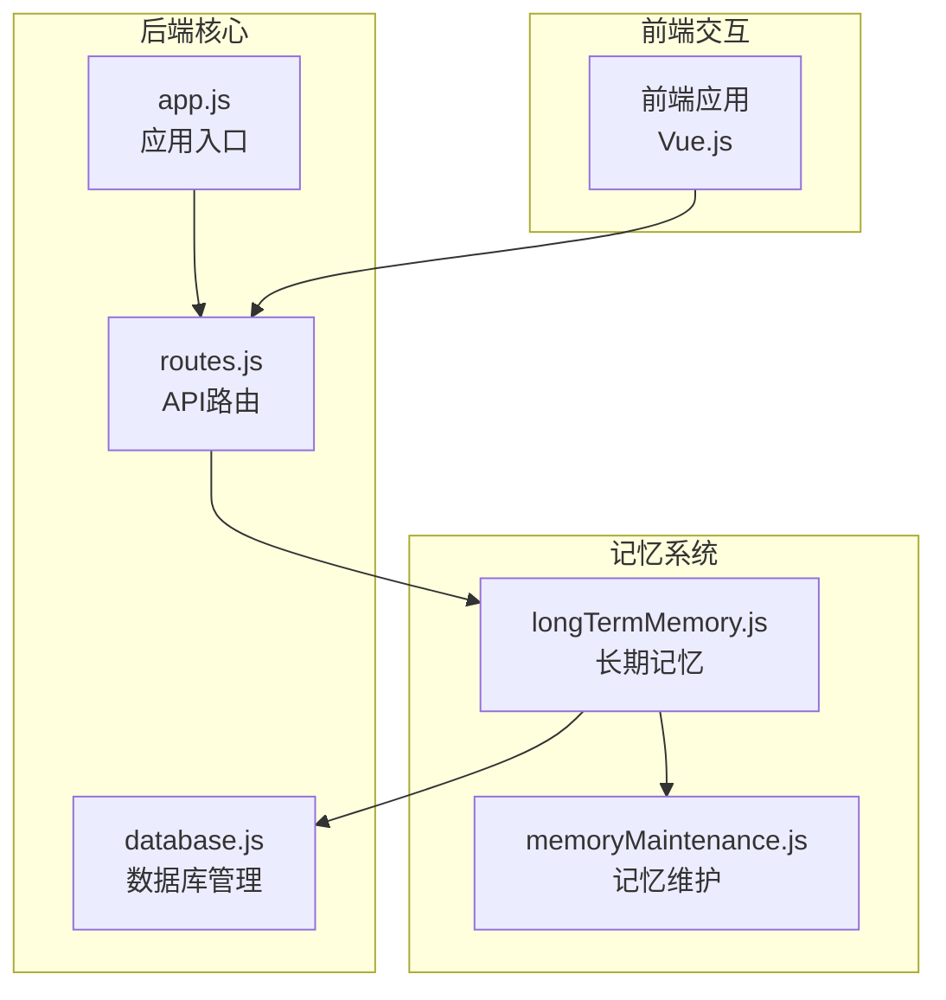
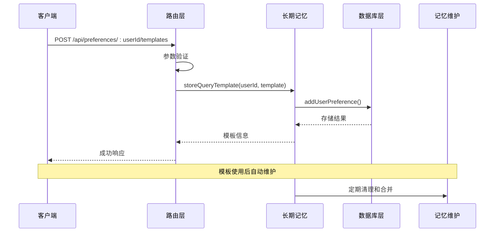
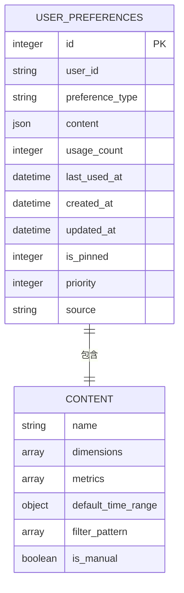
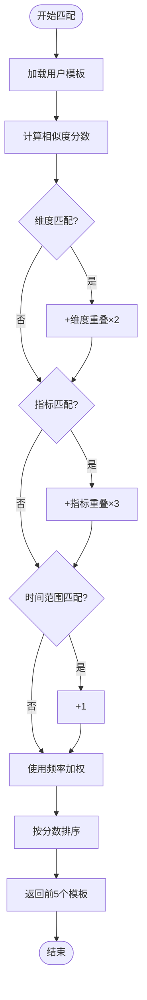
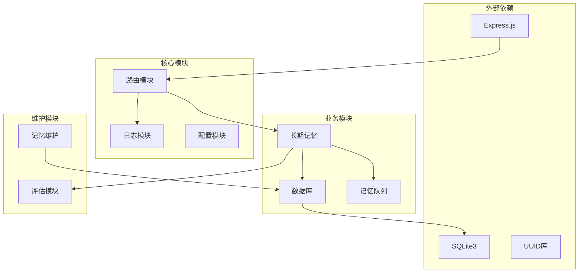

# 查询模板管理

<cite>
**本文档引用的文件**
- [routes.js](file://backend/src/core/routes.js)
- [longTermMemory.js](file://backend/src/memory/longTermMemory.js)
- [database.js](file://backend/src/core/database.js)
- [memoryMaintenance.js](file://backend/src/memory/memoryMaintenance.js)
- [app.js](file://backend/src/app.js)
</cite>

## 目录
1. [简介](#简介)
2. [项目结构](#项目结构)
3. [核心组件](#核心组件)
4. [架构概览](#架构概览)
5. [详细组件分析](#详细组件分析)
6. [依赖关系分析](#依赖关系分析)
7. [性能考虑](#性能考虑)
8. [故障排除指南](#故障排除指南)
9. [结论](#结论)

## 简介

查询模板管理功能是NL2SQL系统中用户偏好管理的重要组成部分，负责为用户提供可重复使用的查询模式。该功能允许用户创建、存储和管理自定义查询模板，包括模板名称、维度数组、指标数组和默认时间范围等参数。

本功能通过POST /api/preferences/:userId/templates端点实现，支持用户手动添加查询模板，并与系统的长期记忆机制深度集成。模板存储采用SQLite数据库，支持模板的创建、更新、删除操作，并提供智能匹配算法来优化查询性能。

## 项目结构

NL2SQL项目的查询模板管理功能主要分布在以下模块中：



**图表来源**
- [app.js:1-260](file://backend/src/app.js#L1-L260)
- [routes.js:1-800](file://backend/src/core/routes.js#L1-L800)
- [longTermMemory.js:1-800](file://backend/src/memory/longTermMemory.js#L1-L800)

**章节来源**
- [app.js:1-260](file://backend/src/app.js#L1-L260)
- [routes.js:1-800](file://backend/src/core/routes.js#L1-L800)

## 核心组件

### API路由组件

查询模板管理功能通过Express路由模块实现，主要包含以下核心组件：

- **模板管理路由**: `/api/preferences/:userId/templates`
- **请求验证**: 模板名称必填验证
- **响应处理**: 成功/失败状态码和错误信息

### 长期记忆组件

长期记忆模块负责模板的存储和检索，包含：

- **模板存储**: `storeQueryTemplate()`函数
- **模板检索**: `findSimilarTemplates()`函数
- **偏好管理**: `deletePreference()`函数

### 数据库组件

数据库模块提供模板数据的持久化存储，包括：

- **用户偏好表**: `user_preferences`表结构
- **索引优化**: 复合索引提升查询性能
- **数据迁移**: 支持表结构升级

**章节来源**
- [routes.js:594-633](file://backend/src/core/routes.js#L594-L633)
- [longTermMemory.js:1068-1127](file://backend/src/memory/longTermMemory.js#L1068-L1127)
- [database.js:137-171](file://backend/src/core/database.js#L137-L171)

## 架构概览

查询模板管理功能采用分层架构设计，实现了清晰的关注点分离：



**图表来源**
- [routes.js:606-633](file://backend/src/core/routes.js#L606-L633)
- [longTermMemory.js:1068-1092](file://backend/src/memory/longTermMemory.js#L1068-L1092)
- [database.js:626-627](file://backend/src/core/database.js#L626-L627)

## 详细组件分析

### 模板管理API端点

#### POST /api/preferences/:userId/templates

该端点负责处理用户提交的查询模板，包含完整的参数验证和错误处理机制。

**请求参数定义**:

| 参数 | 类型 | 必填 | 描述 | 验证规则 |
|------|------|------|------|----------|
| name | string | 是 | 模板名称 | 非空字符串，长度>=1 |
| dimensions | array | 否 | 维度数组 | 数组元素为字符串，去重处理 |
| metrics | array | 否 | 指标数组 | 数组元素为字符串，去重处理 |
| default_time_range | object | 否 | 默认时间范围 | 包含type和value字段 |

**请求体示例**:
```json
{
  "name": "每日销售报表",
  "dimensions": ["日期", "地区", "产品类别"],
  "metrics": ["销售额", "销售量"],
  "default_time_range": {
    "type": "relative",
    "value": "最近7天"
  }
}
```

**响应格式**:
- 成功: `{ success: true, message: "模板已保存", data: template }`
- 失败: `{ success: false, error: "错误信息" }`

**章节来源**
- [routes.js:594-633](file://backend/src/core/routes.js#L594-L633)

### 模板存储结构

模板数据采用JSON格式存储在`user_preferences`表的`content`字段中，支持灵活的数据结构扩展。

**模板内容结构**:



**图表来源**
- [database.js:137-171](file://backend/src/core/database.js#L137-L171)
- [longTermMemory.js:1068-1092](file://backend/src/memory/longTermMemory.js#L1068-L1092)

### 模板匹配算法

系统提供智能模板匹配功能，通过计算相似度分数来推荐最相关的查询模板。

**匹配算法评分规则**:

| 匹配类型 | 评分权重 | 计算方式 |
|----------|----------|----------|
| 维度重叠 | ×2 | 计算维度交集大小 |
| 指标重叠 | ×3 | 计算指标交集大小 |
| 时间范围匹配 | ×1 | 类型一致性检查 |
| 使用频率 | log(n+1) | 对数加权，n为使用次数 |

**匹配流程**:


**图表来源**
- [longTermMemory.js:1013-1056](file://backend/src/memory/longTermMemory.js#L1013-L1056)

**章节来源**
- [longTermMemory.js:1007-1056](file://backend/src/memory/longTermMemory.js#L1007-L1056)

### 记忆维护机制

系统提供自动的记忆维护功能，包括模板清理、合并和统计分析。

**清理策略**:
- 高频模板(≥10次): 永久保留
- 中频模板(3-9次): 90天未使用清理
- 低频模板(<3次): 30天未使用清理
- 字段别名: 365天未使用清理

**模板合并**:
- 维度重合度>70%
- 指标重合度>70%
- 时间范围类型相同

**章节来源**
- [memoryMaintenance.js:69-192](file://backend/src/memory/memoryMaintenance.js#L69-L192)
- [memoryMaintenance.js:204-273](file://backend/src/memory/memoryMaintenance.js#L204-L273)

## 依赖关系分析

查询模板管理功能的依赖关系呈现清晰的层次结构：



**图表来源**
- [app.js:22-50](file://backend/src/app.js#L22-L50)
- [routes.js:16-30](file://backend/src/core/routes.js#L16-L30)
- [longTermMemory.js:17-23](file://backend/src/memory/longTermMemory.js#L17-L23)

**章节来源**
- [app.js:22-50](file://backend/src/app.js#L22-L50)
- [routes.js:16-30](file://backend/src/core/routes.js#L16-L30)

## 性能考虑

### 数据库优化

1. **索引策略**: 
   - 复合索引`(user_id, preference_type)`提升查询性能
   - 使用`usage_count DESC`和`last_used_at DESC`优化排序

2. **查询优化**:
   - 限制返回数量避免大数据集传输
   - 使用参数化查询防止SQL注入

3. **内存管理**:
   - 异步队列处理批量存储操作
   - 定期清理无用模板减少内存占用

### 缓存策略

系统采用多层缓存机制：
- **短期缓存**: 内存中的模板缓存
- **长期缓存**: 数据库中的持久化存储
- **智能淘汰**: 基于使用频率的自动清理

## 故障排除指南

### 常见问题及解决方案

**1. 模板保存失败**
- 检查网络连接和数据库状态
- 验证请求参数格式正确性
- 查看服务器日志获取详细错误信息

**2. 模板无法检索**
- 确认用户ID有效性
- 检查模板是否被清理或合并
- 验证权限设置

**3. 性能问题**
- 分析数据库查询执行计划
- 检查索引使用情况
- 优化模板数量和复杂度

**章节来源**
- [routes.js:626-632](file://backend/src/core/routes.js#L626-L632)
- [longTermMemory.js:1088-1091](file://backend/src/memory/longTermMemory.js#L1088-L1091)

## 结论

查询模板管理功能为NL2SQL系统提供了强大的用户个性化能力。通过合理的架构设计和智能算法，系统能够：

1. **简化用户操作**: 通过模板复用减少重复输入
2. **提升查询效率**: 智能匹配算法推荐最优查询模式
3. **优化系统性能**: 自动维护机制保持数据质量
4. **增强用户体验**: 个性化的查询偏好管理

该功能的成功实施体现了现代AI驱动查询系统的设计理念，为用户提供了更加智能化和个性化的数据分析体验。