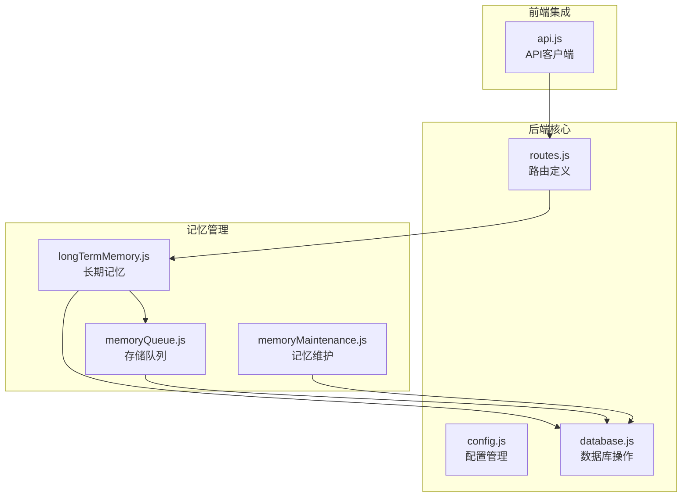
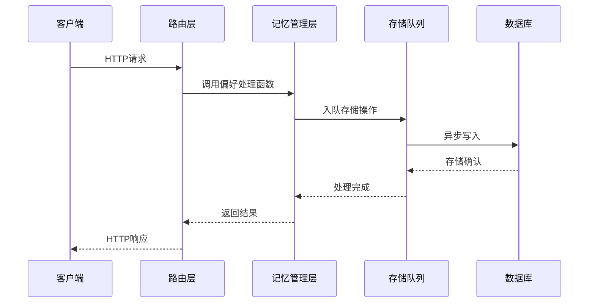
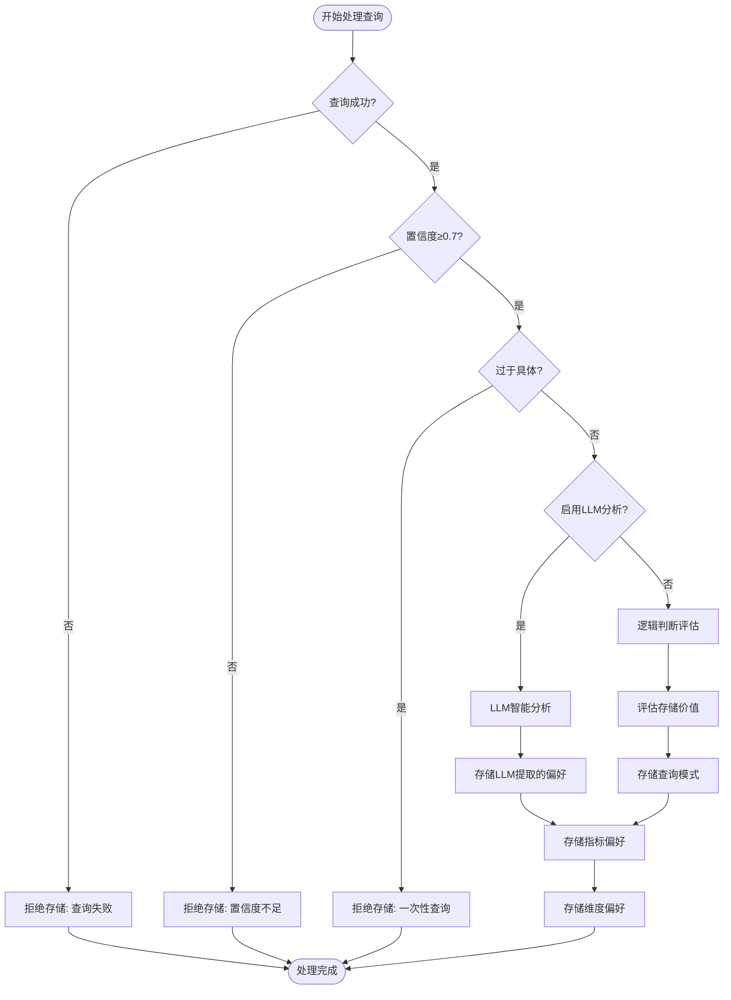
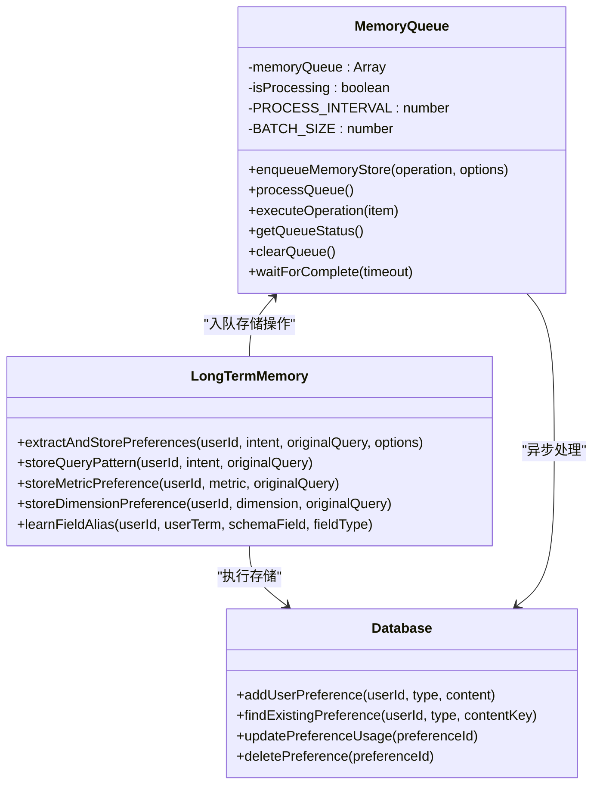
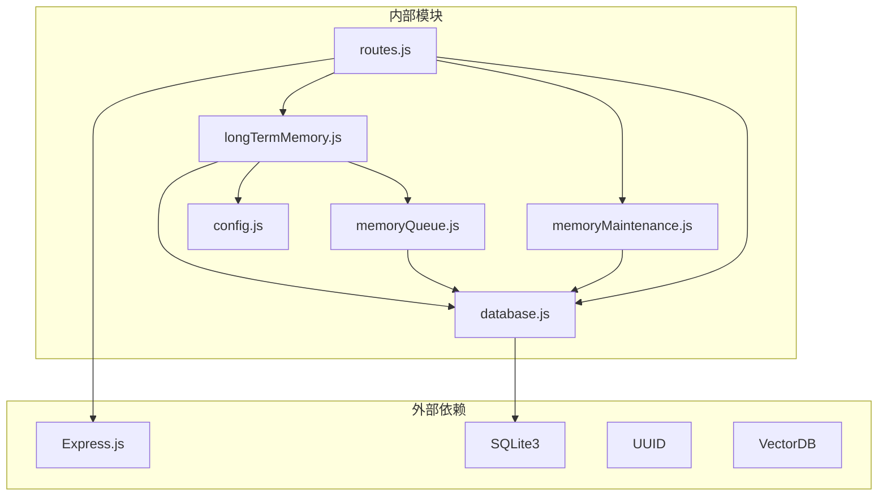

# 用户偏好接口

<cite>
**本文档引用的文件**
- [routes.js](file://backend/src/core/routes.js)
- [longTermMemory.js](file://backend/src/memory/longTermMemory.js)
- [database.js](file://backend/src/core/database.js)
- [memoryQueue.js](file://backend/src/memory/memoryQueue.js)
- [memoryMaintenance.js](file://backend/src/memory/memoryMaintenance.js)
- [config.js](file://backend/src/core/config.js)
- [api.js](file://frontend/src/utils/api.js)
</cite>

## 目录
1. [简介](#简介)
2. [项目结构](#项目结构)
3. [核心组件](#核心组件)
4. [架构概览](#架构概览)
5. [详细组件分析](#详细组件分析)
6. [依赖分析](#依赖分析)
7. [性能考虑](#性能考虑)
8. [故障排除指南](#故障排除指南)
9. [结论](#结论)
10. [附录](#附录)

## 简介

NL2SQL系统的用户偏好接口是一套完整的长期记忆管理系统，旨在为用户提供个性化的查询体验。该系统能够自动学习用户的查询习惯、字段别名、常用指标和维度偏好，并通过智能筛选机制将有价值的偏好存储到SQLite数据库中。

用户偏好接口主要包含以下核心功能：
- 自动提取和存储用户查询模式
- 字段别名学习和映射
- 查询模板管理
- 偏好使用统计和维护
- 异步存储队列机制

## 项目结构

用户偏好接口位于后端服务的特定目录结构中，采用模块化设计：



**图表来源**
- [routes.js:453-716](file://backend/src/core/routes.js#L453-L716)
- [longTermMemory.js:1-800](file://backend/src/memory/longTermMemory.js#L1-L800)
- [database.js:137-171](file://backend/src/core/database.js#L137-L171)

**章节来源**
- [routes.js:453-716](file://backend/src/core/routes.js#L453-L716)
- [longTermMemory.js:1-800](file://backend/src/memory/longTermMemory.js#L1-L800)
- [database.js:137-171](file://backend/src/core/database.js#L137-L171)

## 核心组件

用户偏好接口由以下核心组件构成：

### 1. 路由层 (Routes Layer)
负责HTTP请求的接收和响应处理，提供RESTful API端点。

### 2. 记忆管理层 (Long Term Memory Layer)
实现用户偏好的智能提取、存储和管理逻辑。

### 3. 数据访问层 (Data Access Layer)
封装SQLite数据库操作，提供CRUD功能。

### 4. 存储队列层 (Storage Queue Layer)
实现异步存储机制，提升系统并发性能。

### 5. 配置管理层 (Config Layer)
管理长期记忆的各种配置参数和阈值。

**章节来源**
- [routes.js:453-716](file://backend/src/core/routes.js#L453-L716)
- [longTermMemory.js:1-800](file://backend/src/memory/longTermMemory.js#L1-L800)
- [database.js:137-171](file://backend/src/core/database.js#L137-L171)

## 架构概览

用户偏好接口采用分层架构设计，确保职责分离和代码可维护性：



**图表来源**
- [routes.js:545-716](file://backend/src/core/routes.js#L545-L716)
- [longTermMemory.js:412-446](file://backend/src/memory/longTermMemory.js#L412-L446)
- [memoryQueue.js:46-118](file://backend/src/memory/memoryQueue.js#L46-L118)

## 详细组件分析

### 用户偏好路由定义

用户偏好接口提供以下主要端点：

#### GET /api/preferences/:userId
获取用户偏好列表，支持按类型筛选和数量限制。

**请求参数:**
- 路径参数: `userId` (必需) - 用户标识符
- 查询参数: `type` (可选) - 偏好类型筛选
  - `query_pattern` - 查询模式
  - `field_alias` - 字段别名
  - `metric_preference` - 指标偏好
  - `dimension_preference` - 维度偏好
- 查询参数: `limit` (可选) - 返回数量限制，默认50

**响应格式:**
```json
{
  "success": true,
  "user_id": "string",
  "data": {
    "patterns": [],
    "aliases": [],
    "metrics": [],
    "dimensions": []
  }
}
```

**错误码:**
- 500: 获取用户偏好失败

#### GET /api/preferences/:userId/raw
获取用户长期记忆原始数据，用于调试目的。

**请求参数:**
- 路径参数: `userId` (必需) - 用户标识符
- 查询参数: `type` (可选) - 偏好类型筛选

**响应格式:**
```json
{
  "success": true,
  "user_id": "string",
  "total_count": 0,
  "data": {
    "all": [],
    "grouped": {
      "field_alias": [],
      "query_pattern": [],
      "metric_preference": [],
      "dimension_preference": []
    }
  }
}
```

**错误码:**
- 500: 获取原始记忆数据失败

#### GET /api/preferences/:userId/stats
获取用户记忆统计信息。

**请求参数:**
- 路径参数: `userId` (必需) - 用户标识符

**响应格式:**
```json
{
  "success": true,
  "user_id": "string",
  "data": {
    "total": 0,
    "byType": [
      {
        "preference_type": "string",
        "count": 0,
        "avg_usage": 0,
        "max_usage": 0,
        "oldest_use": "string"
      }
    ]
  }
}
```

**错误码:**
- 500: 获取用户记忆统计失败

#### POST /api/preferences/:userId/templates
手动添加查询模板。

**请求参数:**
- 路径参数: `userId` (必需) - 用户标识符
- 请求体: 模板定义
  - `name` (必需) - 模板名称
  - `dimensions` (可选) - 维度数组
  - `metrics` (可选) - 指标数组
  - `default_time_range` (可选) - 默认时间范围

**响应格式:**
```json
{
  "success": true,
  "message": "string",
  "data": {
    "id": 0,
    "user_id": "string",
    "preference_type": "query_pattern",
    "content": {}
  }
}
```

**错误码:**
- 400: 模板名称不能为空
- 500: 保存查询模板失败

#### DELETE /api/preferences/:preferenceId
删除用户偏好。

**请求参数:**
- 路径参数: `preferenceId` (必需) - 偏好记录ID

**响应格式:**
```json
{
  "success": true,
  "message": "偏好已删除"
}
```

**错误码:**
- 404: 偏好不存在或删除失败
- 500: 删除偏好失败

#### POST /api/preferences/:userId/learn-alias
手动学习字段别名。

**请求参数:**
- 路径参数: `userId` (必需) - 用户标识符
- 请求体: 别名定义
  - `user_term` (必需) - 用户术语
  - `schema_field` (必需) - Schema字段
  - `field_type` (可选) - 字段类型，默认'metric'

**响应格式:**
```json
{
  "success": true,
  "message": "字段别名已学习",
  "data": {
    "id": 0,
    "user_id": "string",
    "preference_type": "field_alias",
    "content": {
      "user_term": "string",
      "schema_field": "string",
      "field_type": "string",
      "confidence": 0.8
    }
  }
}
```

**错误码:**
- 400: user_term和schema_field不能为空
- 500: 学习字段别名失败

**章节来源**
- [routes.js:456-716](file://backend/src/core/routes.js#L456-L716)

### 长期记忆管理机制

长期记忆管理器实现了复杂的偏好提取和存储逻辑：



**图表来源**
- [longTermMemory.js:313-471](file://backend/src/memory/longTermMemory.js#L313-L471)

### 存储队列机制

为了提升系统性能，采用了异步存储队列机制：



**图表来源**
- [memoryQueue.js:46-150](file://backend/src/memory/memoryQueue.js#L46-L150)
- [longTermMemory.js:412-446](file://backend/src/memory/longTermMemory.js#L412-L446)
- [database.js:626-675](file://backend/src/core/database.js#L626-L675)

### 数据存储结构

用户偏好数据存储在SQLite数据库中，采用JSON格式存储偏好内容：

```mermaid
erDiagram
USER_PREFERENCES {
integer id PK
string user_id
string preference_type
text content
integer usage_count
datetime last_used_at
datetime created_at
datetime updated_at
integer is_pinned
integer priority
string source
}
INDEXES {
idx_user_preferences_user_id
idx_user_preferences_type
idx_user_prefs_user_type
}
USER_PREFERENCES ||--o{ INDEXES : "使用"
```

**图表来源**
- [database.js:140-171](file://backend/src/core/database.js#L140-L171)

**章节来源**
- [longTermMemory.js:1-800](file://backend/src/memory/longTermMemory.js#L1-L800)
- [memoryQueue.js:1-217](file://backend/src/memory/memoryQueue.js#L1-L217)
- [database.js:137-171](file://backend/src/core/database.js#L137-L171)

## 依赖分析

用户偏好接口的依赖关系如下：



**图表来源**
- [routes.js:16-36](file://backend/src/core/routes.js#L16-L36)
- [longTermMemory.js:17-22](file://backend/src/memory/longTermMemory.js#L17-L22)
- [memoryQueue.js:8](file://backend/src/memory/memoryQueue.js#L8)

**章节来源**
- [routes.js:16-36](file://backend/src/core/routes.js#L16-L36)
- [longTermMemory.js:17-22](file://backend/src/memory/longTermMemory.js#L17-L22)

## 性能考虑

用户偏好接口在设计时充分考虑了性能优化：

### 异步存储机制
- 使用内存队列避免阻塞主请求线程
- 批量处理提升存储效率
- 可配置的处理间隔和批量大小

### 缓存策略
- 使用SQLite索引加速查询
- 按使用频率排序返回偏好
- 智能筛选减少无效存储

### 配置优化
- 可调节的阈值参数
- 支持LLM智能分析的开关控制
- 分级保留策略减少存储压力

## 故障排除指南

### 常见问题及解决方案

**1. 偏好存储失败**
- 检查数据库连接状态
- 验证用户ID格式正确性
- 确认请求参数完整性

**2. 查询性能问题**
- 检查队列积压情况
- 监控数据库性能指标
- 调整批量处理参数

**3. LLM分析异常**
- 验证LLM服务可用性
- 检查配置参数设置
- 查看日志获取详细错误信息

**章节来源**
- [routes.js:585-591](file://backend/src/core/routes.js#L585-L591)
- [longTermMemory.js:467-471](file://backend/src/memory/longTermMemory.js#L467-L471)

## 结论

NL2SQL用户偏好接口提供了一个完整、高效的长期记忆管理系统。通过智能筛选机制、异步存储队列和灵活的配置选项，系统能够为用户提供个性化的查询体验，同时保持良好的性能表现。

该接口的主要优势包括：
- 智能偏好提取和存储
- 异步处理提升性能
- 灵活的配置管理
- 完善的错误处理机制
- 可扩展的架构设计

## 附录

### 使用场景示例

**场景1：自动学习用户查询习惯**
- 系统监听用户查询
- 提取查询意图和偏好
- 自动存储有价值的偏好模式

**场景2：手动添加查询模板**
- 用户定义常用的查询模式
- 系统保存为模板供后续使用
- 支持时间范围和过滤条件

**场景3：字段别名管理**
- 用户学习新的术语映射
- 系统自动更新别名映射表
- 支持多字段类型的别名学习

### 配置参数说明

| 参数名 | 默认值 | 描述 |
|--------|--------|------|
| LTM_ENABLED | true | 是否启用长期记忆功能 |
| LTM_USE_LLM | false | 是否使用LLM进行智能分析 |
| MIN_CONFIDENCE | 0.7 | 最小置信度阈值 |
| MIN_DIMENSIONS_FOR_TEMPLATE | 2 | 高价值模板最小维度数 |
| MIN_METRICS_FOR_TEMPLATE | 1 | 高价值模板最小指标数 |