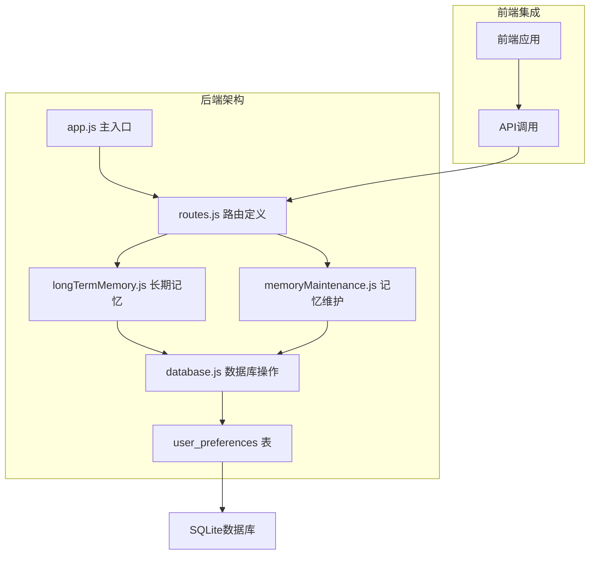
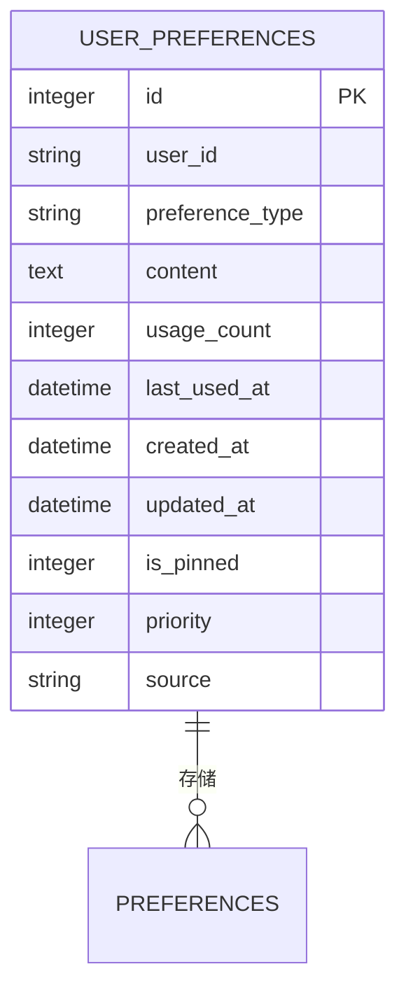
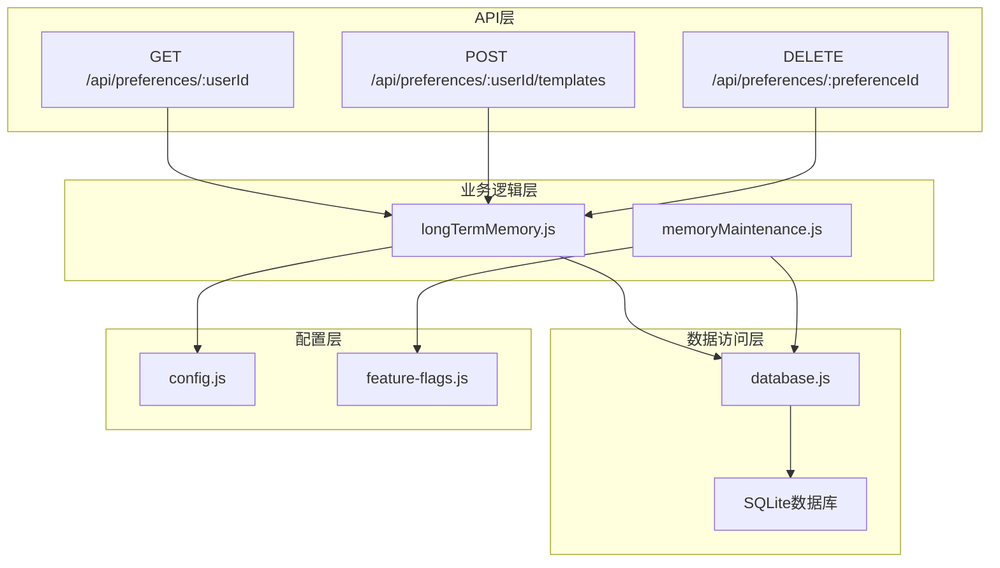
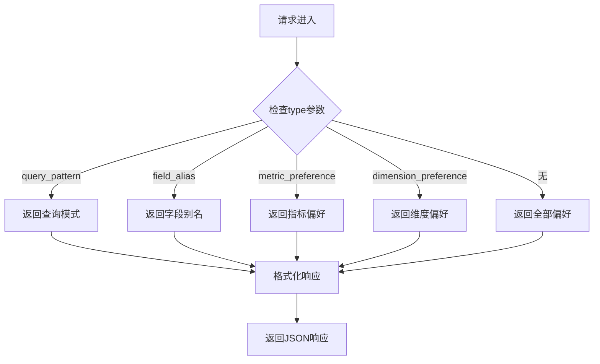
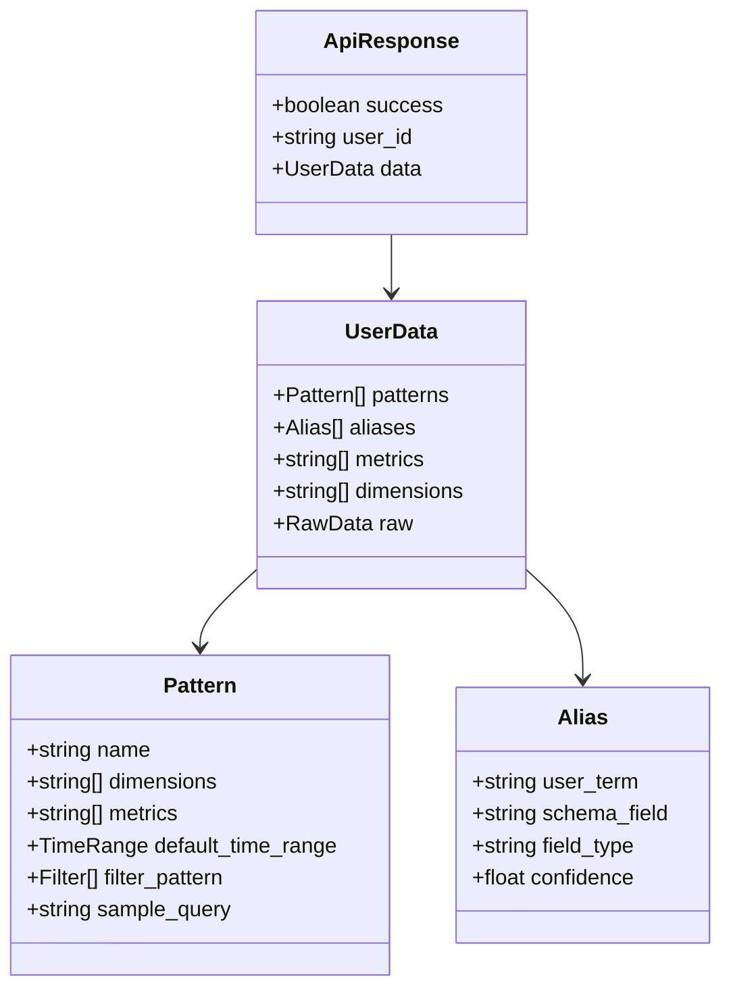
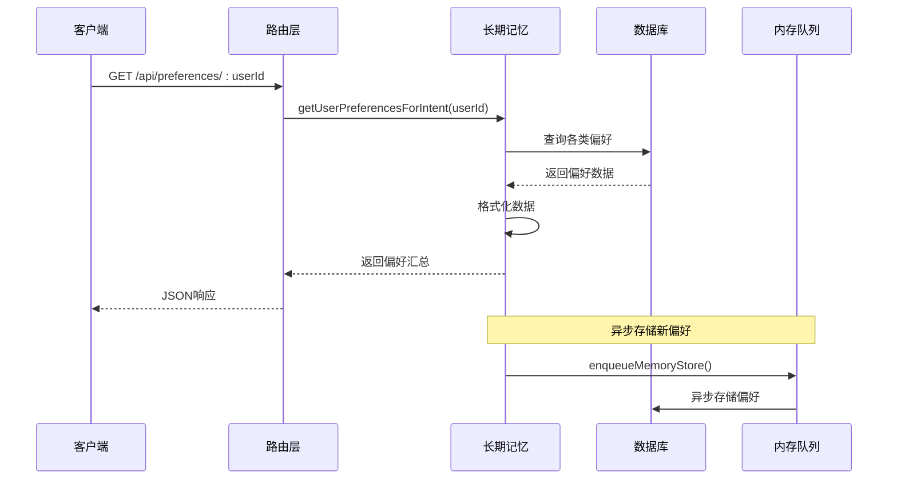
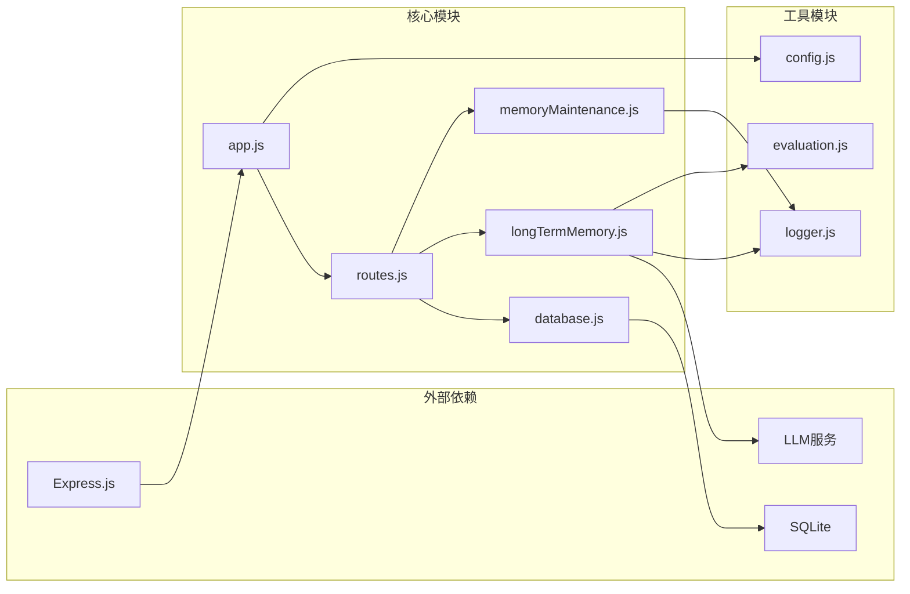
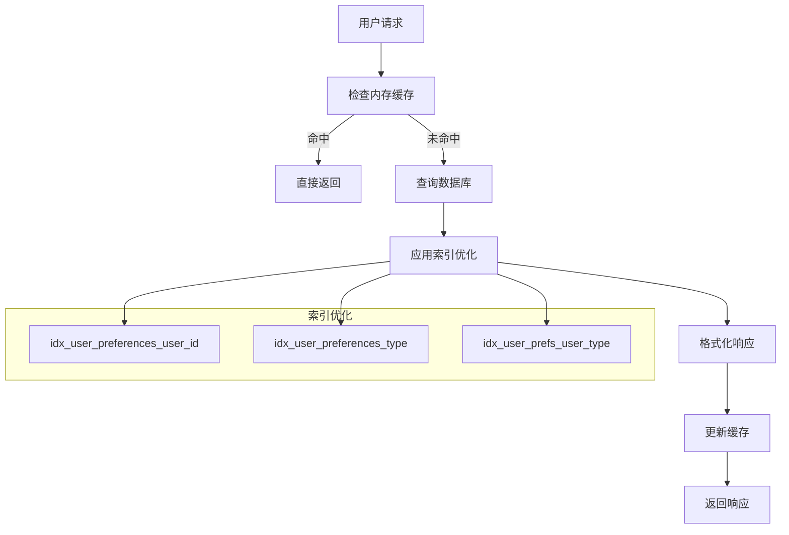

# 用户偏好管理

<cite>
**本文档引用的文件**
- [app.js](file://backend/src/app.js)
- [routes.js](file://backend/src/core/routes.js)
- [database.js](file://backend/src/core/database.js)
- [longTermMemory.js](file://backend/src/memory/longTermMemory.js)
- [memoryMaintenance.js](file://backend/src/memory/memoryMaintenance.js)
</cite>

## 目录
1. [简介](#简介)
2. [项目结构](#项目结构)
3. [核心组件](#核心组件)
4. [架构概览](#架构概览)
5. [详细组件分析](#详细组件分析)
6. [依赖关系分析](#依赖关系分析)
7. [性能考虑](#性能考虑)
8. [故障排除指南](#故障排除指南)
9. [结论](#结论)

## 简介

NL2SQL系统的用户偏好管理功能是一个智能化的长期记忆管理系统，旨在为用户提供个性化的自然语言到SQL转换体验。该系统通过学习和存储用户的查询习惯、字段别名、指标偏好和维度偏好，能够显著提升查询质量和用户体验。

系统的核心目标是：
- 自动识别和存储用户的查询模式
- 学习字段别名映射关系
- 记录常用的指标和维度偏好
- 提供智能的查询模板建议
- 通过机器学习优化偏好提取策略

## 项目结构

NL2SQL项目的用户偏好管理功能主要分布在以下几个核心模块中：



**图表来源**
- [app.js:56-87](file://backend/src/app.js#L56-L87)
- [routes.js:35-36](file://backend/src/core/routes.js#L35-L36)

**章节来源**
- [app.js:1-260](file://backend/src/app.js#L1-L260)
- [routes.js:1-1037](file://backend/src/core/routes.js#L1-L1037)

## 核心组件

### 用户偏好类型

系统支持四种核心偏好类型，每种都有特定的数据结构和用途：

| 偏好类型 | 描述 | 数据结构 | 存储策略 |
|---------|------|----------|----------|
| query_pattern | 查询模式 | `{name, dimensions, metrics, default_time_range, filter_pattern, sample_query}` | 高频模式优先存储 |
| field_alias | 字段别名 | `{user_term, schema_field, field_type, confidence}` | 按使用频率清理 |
| metric_preference | 指标偏好 | `{field_name, last_query}` | 永久保留 |
| dimension_preference | 维度偏好 | `{field_name, last_query}` | 永久保留 |

### 数据存储结构

用户偏好数据采用JSON格式存储在SQLite数据库中，表结构设计支持高效的查询和维护：



**图表来源**
- [database.js:140-163](file://backend/src/core/database.js#L140-L163)

**章节来源**
- [database.js:140-170](file://backend/src/core/database.js#L140-L170)
- [longTermMemory.js:37-43](file://backend/src/memory/longTermMemory.js#L37-L43)

## 架构概览

用户偏好管理系统的整体架构采用分层设计，确保了良好的可扩展性和维护性：



**图表来源**
- [routes.js:545-664](file://backend/src/core/routes.js#L545-L664)
- [longTermMemory.js:1-25](file://backend/src/memory/longTermMemory.js#L1-L25)

## 详细组件分析

### GET /api/preferences/:userId 端点

该端点是用户偏好管理的核心接口，提供了灵活的偏好查询和筛选功能。

#### 请求参数

| 参数 | 类型 | 必需 | 默认值 | 描述 |
|------|------|------|--------|------|
| userId | 路径参数 | 是 | - | 用户唯一标识符 |
| type | 查询参数 | 否 | - | 偏好类型筛选 |
| limit | 查询参数 | 否 | 50 | 返回数量限制 |

#### 偏好类型筛选

系统支持四种偏好类型的精确筛选：



**图表来源**
- [routes.js:561-578](file://backend/src/core/routes.js#L561-L578)

#### 响应格式



**图表来源**
- [routes.js:580-584](file://backend/src/core/routes.js#L580-L584)
- [longTermMemory.js:983-994](file://backend/src/memory/longTermMemory.js#L983-L994)

**章节来源**
- [routes.js:545-592](file://backend/src/core/routes.js#L545-L592)
- [longTermMemory.js:963-1005](file://backend/src/memory/longTermMemory.js#L963-L1005)

### 偏好提取与存储机制

系统采用智能的偏好提取策略，结合机器学习和规则引擎来判断何时存储用户偏好：



**图表来源**
- [routes.js:558-559](file://backend/src/core/routes.js#L558-L559)
- [longTermMemory.js:420-446](file://backend/src/memory/longTermMemory.js#L420-L446)

### 记忆维护与清理策略

系统实现了智能的记忆维护机制，根据使用频率和时间进行分级清理：

```mermaid
flowchart TD
A[开始维护] --> B{检查用户偏好}
B --> C{使用频率分类}
C --> |高频(≥10次)| D[永久保留]
C --> |中频(3-9次)| E[90天未用清理]
C --> |低频(<3次)| F[30天未用清理]
D --> G[更新统计]
E --> G
F --> G
G --> H{字段别名清理}
H --> |365天未用| I[清理别名]
H --> |活跃别名| J[保留别名]
I --> K[完成维护]
J --> K
G --> K
```

**图表来源**
- [memoryMaintenance.js:69-120](file://backend/src/memory/memoryMaintenance.js#L69-L120)
- [memoryMaintenance.js:127-192](file://backend/src/memory/memoryMaintenance.js#L127-L192)

**章节来源**
- [memoryMaintenance.js:1-418](file://backend/src/memory/memoryMaintenance.js#L1-L418)

## 依赖关系分析

用户偏好管理功能的依赖关系体现了清晰的分层架构：



**图表来源**
- [app.js:23-49](file://backend/src/app.js#L23-L49)
- [routes.js:17-29](file://backend/src/core/routes.js#L17-L29)

### 关键依赖关系

1. **路由到业务逻辑**：routes.js将HTTP请求转发到longTermMemory.js进行业务处理
2. **业务逻辑到数据访问**：longTermMemory.js通过database.js访问数据库
3. **机器学习集成**：longTermMemory.js依赖LLM服务进行智能分析
4. **日志系统**：所有模块都依赖logger.js进行统一的日志记录

**章节来源**
- [routes.js:558-559](file://backend/src/core/routes.js#L558-L559)
- [longTermMemory.js:17-22](file://backend/src/memory/longTermMemory.js#L17-L22)

## 性能考虑

### 查询优化策略

系统采用了多种查询优化策略来确保高性能：

1. **索引优化**：为user_id、preference_type和复合索引建立了专门的索引
2. **分页机制**：默认limit为50，可根据需要调整
3. **异步处理**：偏好存储采用内存队列异步处理，不影响主请求响应
4. **缓存策略**：高频访问的偏好数据在内存中有缓存

### 数据库性能特性



**图表来源**
- [database.js:165-170](file://backend/src/core/database.js#L165-L170)

**章节来源**
- [database.js:636-658](file://backend/src/core/database.js#L636-L658)
- [database.js:165-170](file://backend/src/core/database.js#L165-L170)

## 故障排除指南

### 常见问题及解决方案

#### 1. 偏好数据查询异常

**症状**：GET /api/preferences/:userId 返回错误

**可能原因**：
- 用户ID不存在
- 数据库连接问题
- SQL查询语法错误

**解决步骤**：
1. 验证用户ID格式
2. 检查数据库连接状态
3. 查看日志文件获取详细错误信息

#### 2. 偏好存储失败

**症状**：用户偏好无法正确存储

**可能原因**：
- LLM服务不可用
- 数据库写入权限问题
- JSON格式验证失败

**解决步骤**：
1. 检查LLM服务状态
2. 验证数据库写入权限
3. 验证JSON数据格式

#### 3. 性能问题

**症状**：API响应时间过长

**可能原因**：
- 缺少必要的数据库索引
- 查询参数不当
- 数据库负载过高

**解决步骤**：
1. 检查数据库索引状态
2. 优化查询参数
3. 分析数据库性能指标

**章节来源**
- [routes.js:585-591](file://backend/src/core/routes.js#L585-L591)
- [longTermMemory.js:467-470](file://backend/src/memory/longTermMemory.js#L467-L470)

## 结论

NL2SQL系统的用户偏好管理功能通过智能化的设计和实现，为用户提供了个性化的自然语言查询体验。系统的核心优势包括：

1. **全面的偏好支持**：支持查询模式、字段别名、指标偏好和维度偏好的完整生命周期管理
2. **智能提取策略**：结合机器学习和规则引擎，智能判断偏好提取时机
3. **高效的数据存储**：采用JSON格式存储，支持灵活的数据结构和高效的查询性能
4. **完善的维护机制**：智能的记忆清理和合并策略，确保数据质量
5. **可扩展的架构**：清晰的分层设计，便于功能扩展和维护

该系统为NL2SQL平台提供了强大的个性化能力，能够显著提升用户的查询效率和满意度。通过持续的优化和改进，用户偏好管理功能将继续为系统的核心价值提供重要支撑。