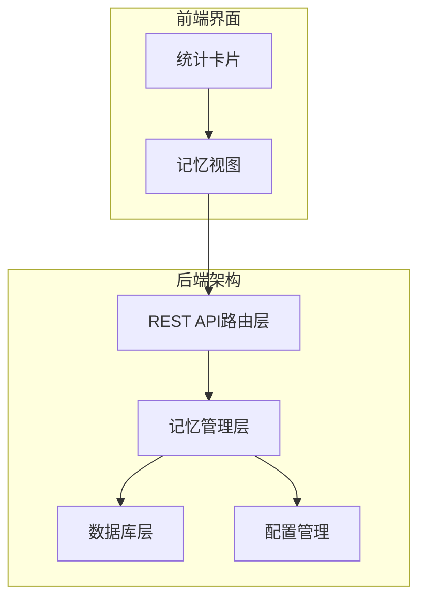
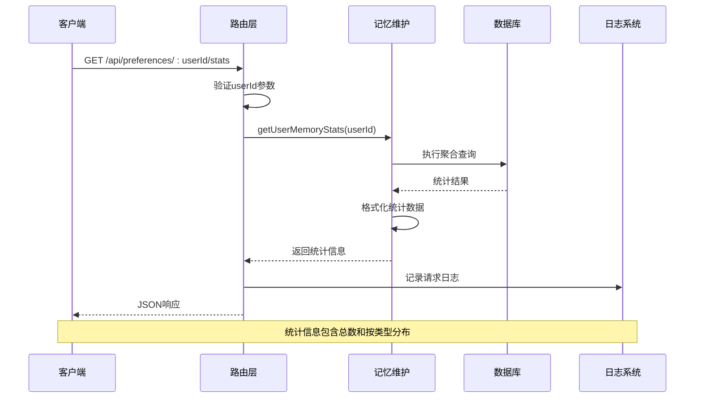
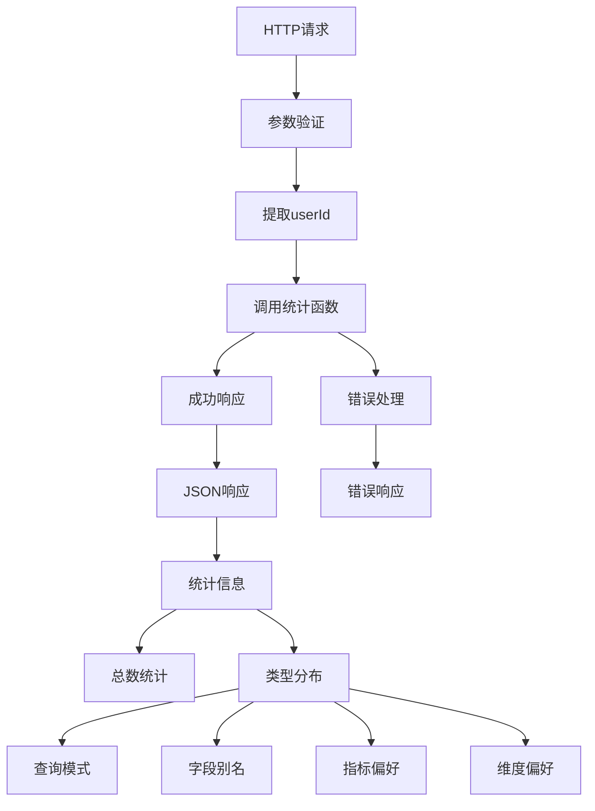
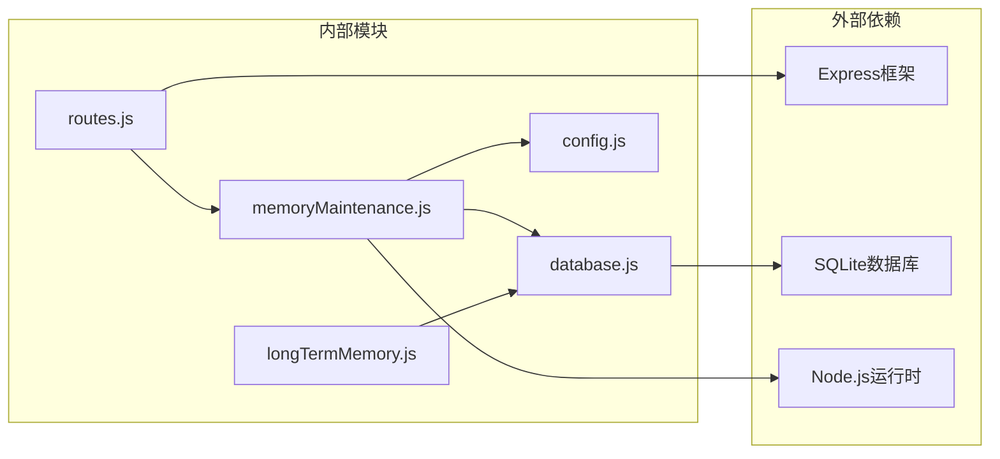

# 记忆统计信息

<cite>
**本文档引用的文件**
- [routes.js](file://backend/src/core/routes.js)
- [memoryMaintenance.js](file://backend/src/memory/memoryMaintenance.js)
- [longTermMemory.js](file://backend/src/memory/longTermMemory.js)
- [database.js](file://backend/src/core/database.js)
- [config.js](file://backend/src/core/config.js)
- [MemoryView.vue](file://frontend/src/views/MemoryView.vue)
</cite>

## 目录
1. [简介](#简介)
2. [项目结构](#项目结构)
3. [核心组件](#核心组件)
4. [架构概览](#架构概览)
5. [详细组件分析](#详细组件分析)
6. [依赖关系分析](#依赖关系分析)
7. [性能考量](#性能考量)
8. [故障排除指南](#故障排除指南)
9. [结论](#结论)

## 简介

记忆统计信息接口是NL2SQL系统中用于分析和展示用户长期记忆使用情况的重要功能模块。该接口通过GET /api/preferences/:userId/stats端点提供用户记忆统计信息，帮助开发者和运维人员理解用户偏好的使用模式和系统性能指标。

本接口的核心功能包括：
- 统计用户长期记忆的总数和按类型的分布
- 分析记忆使用频率和活跃度
- 提供记忆维护和清理的决策支持
- 展示系统整体的记忆健康状况

## 项目结构

NL2SQL项目采用模块化架构设计，记忆统计功能位于后端核心模块中：

**图表来源**
- [routes.js:524-543](file://backend/src/core/routes.js#L524-L543)
- [memoryMaintenance.js:323-352](file://backend/src/memory/memoryMaintenance.js#L323-L352)

**章节来源**
- [routes.js:1-1037](file://backend/src/core/routes.js#L1-L1037)
- [config.js:259-293](file://backend/src/core/config.js#L259-L293)

## 核心组件

记忆统计信息功能由以下核心组件构成：

### 1. 统计接口层
- **路由定义**：在routes.js中定义GET /api/preferences/:userId/stats端点
- **参数处理**：接收userId参数并验证用户存在性
- **响应格式**：标准化的JSON响应结构

### 2. 统计计算引擎
- **memoryMaintenance模块**：提供getUserMemoryStats函数
- **数据库查询**：执行聚合统计查询
- **结果格式化**：将原始统计数据转换为可读格式

### 3. 数据存储层
- **SQLite数据库**：存储用户偏好和记忆数据
- **索引优化**：为user_id和preference_type建立复合索引
- **JSON内容存储**：支持灵活的偏好内容结构

**章节来源**
- [routes.js:524-543](file://backend/src/core/routes.js#L524-L543)
- [memoryMaintenance.js:323-352](file://backend/src/memory/memoryMaintenance.js#L323-L352)
- [database.js:140-171](file://backend/src/core/database.js#L140-L171)

## 架构概览

记忆统计信息接口的完整架构流程如下：

**图表来源**
- [routes.js:524-543](file://backend/src/core/routes.js#L524-L543)
- [memoryMaintenance.js:323-352](file://backend/src/memory/memoryMaintenance.js#L323-L352)

## 详细组件分析

### 统计接口实现

#### 路由定义与参数处理
统计接口在routes.js中定义，采用RESTful设计原则：

**图表来源**
- [routes.js:524-543](file://backend/src/core/routes.js#L524-L543)

#### 统计计算逻辑
memoryMaintenance.js中的getUserMemoryStats函数实现核心统计逻辑：

**章节来源**
- [routes.js:524-543](file://backend/src/core/routes.js#L524-L543)
- [memoryMaintenance.js:318-352](file://backend/src/memory/memoryMaintenance.js#L318-L352)

### 数据统计指标

#### 基础统计指标
系统提供以下核心统计指标：

| 指标名称 | 描述 | 计算方式 |
|---------|------|----------|
| total | 用户记忆总数 | COUNT(*) |
| byType | 按类型分布 | GROUP BY preference_type |
| avg_usage | 平均使用次数 | AVG(usage_count) |
| max_usage | 最高使用次数 | MAX(usage_count) |
| oldest_use | 最早使用时间 | MIN(last_used_at) |

#### 类型分布统计
系统支持四种偏好类型的统计：

1. **查询模式 (query_pattern)**：用户常用的查询模式和模板
2. **字段别名 (field_alias)**：用户对数据库字段的个性化称呼
3. **指标偏好 (metric_preference)**：用户经常使用的指标
4. **维度偏好 (dimension_preference)**：用户经常使用的维度

**章节来源**
- [memoryMaintenance.js:325-346](file://backend/src/memory/memoryMaintenance.js#L325-L346)

### 统计结果解读指南

#### 总体使用情况分析
- **记忆总量**：反映用户对系统的使用程度和记忆积累情况
- **类型分布**：分析用户偏好的集中度和多样性
- **使用频率**：评估记忆的活跃度和价值密度

#### 类型分布解读
- **查询模式占比**：高占比表示用户有明确的查询习惯
- **字段别名占比**：反映用户对系统术语的个性化适应
- **指标/维度偏好**：显示用户关注的数据维度和指标

#### 使用频率分析
- **平均使用次数**：衡量记忆的普遍价值
- **最高使用次数**：识别最常用的记忆项
- **最早使用时间**：评估记忆的时效性和稳定性

**章节来源**
- [memoryMaintenance.js:343-346](file://backend/src/memory/memoryMaintenance.js#L343-L346)

## 依赖关系分析

记忆统计信息接口的依赖关系如下：

**图表来源**
- [routes.js:17-29](file://backend/src/core/routes.js#L17-L29)
- [memoryMaintenance.js:16-18](file://backend/src/memory/memoryMaintenance.js#L16-L18)

### 模块耦合分析

#### 路由层依赖
- 依赖memoryMaintenance模块获取统计数据
- 依赖logger模块记录请求日志
- 依赖config模块获取系统配置

#### 统计模块依赖
- 依赖database模块执行数据库查询
- 依赖logger模块记录统计过程
- 依赖config模块获取保留策略配置

**章节来源**
- [routes.js:528-529](file://backend/src/core/routes.js#L528-L529)
- [memoryMaintenance.js:16-18](file://backend/src/memory/memoryMaintenance.js#L16-L18)

## 性能考量

### 数据库查询优化

#### 索引策略
系统为user_preferences表建立了以下关键索引：
- `idx_user_preferences_user_id`：加速按用户查询
- `idx_user_preferences_type`：加速按类型查询
- `idx_user_prefs_user_type`：复合索引优化联合查询

#### 查询优化
统计查询使用GROUP BY和聚合函数，避免全表扫描：
- 使用COUNT(*)统计总数
- 使用AVG()计算平均使用次数
- 使用MAX()获取最高使用次数

### 缓存策略

#### 内存缓存
- **短期缓存**：统计结果可在内存中缓存一段时间
- **失效策略**：基于时间或数据变更事件的缓存失效
- **并发控制**：避免缓存击穿和缓存雪崩

#### 数据库层面优化
- **索引优化**：合理使用复合索引减少查询成本
- **查询计划**：利用EXPLAIN查询计划分析优化
- **批量操作**：减少数据库往返次数

### 性能监控

#### 监控指标
- **查询响应时间**：统计接口的响应延迟
- **数据库负载**：统计查询对数据库的影响
- **内存使用**：统计结果的内存占用

#### 优化建议
- 实施适当的缓存策略
- 优化数据库查询计划
- 考虑分页处理大量数据

**章节来源**
- [database.js:165-171](file://backend/src/core/database.js#L165-L171)
- [memoryMaintenance.js:325-346](file://backend/src/memory/memoryMaintenance.js#L325-L346)

## 故障排除指南

### 常见问题及解决方案

#### 统计结果异常
**问题**：统计结果显示异常值或空数据
**排查步骤**：
1. 检查数据库连接状态
2. 验证用户ID的有效性
3. 确认user_preferences表结构完整性

**解决方案**：
- 重启数据库连接
- 清理损坏的偏好记录
- 重建相关索引

#### 性能问题
**问题**：统计接口响应缓慢
**排查步骤**：
1. 分析数据库查询执行计划
2. 检查索引使用情况
3. 监控数据库负载

**解决方案**：
- 优化查询语句
- 添加缺失的索引
- 实施查询缓存

#### 数据一致性问题
**问题**：统计结果与实际数据不符
**排查步骤**：
1. 检查数据同步状态
2. 验证事务完整性
3. 确认数据完整性约束

**解决方案**：
- 执行数据修复脚本
- 重新初始化相关表
- 调整数据同步策略

**章节来源**
- [database.js:370-433](file://backend/src/core/database.js#L370-L433)
- [memoryMaintenance.js:116-119](file://backend/src/memory/memoryMaintenance.js#L116-L119)

### 错误处理机制

#### 异常捕获
统计接口实现了完善的错误处理：
- 数据库查询异常捕获
- 参数验证错误处理
- 系统资源异常处理

#### 日志记录
- 记录统计查询的执行时间和结果
- 记录异常情况和错误信息
- 提供调试所需的详细日志

**章节来源**
- [routes.js:536-542](file://backend/src/core/routes.js#L536-L542)
- [memoryMaintenance.js:348-351](file://backend/src/memory/memoryMaintenance.js#L348-L351)

## 结论

记忆统计信息接口为NL2SQL系统提供了重要的数据分析能力，通过以下方面体现了其价值：

### 功能价值
- **用户行为洞察**：帮助理解用户偏好和使用模式
- **系统性能监控**：提供记忆系统的健康状况指标
- **优化决策支持**：为系统优化和资源配置提供数据支撑

### 技术优势
- **模块化设计**：清晰的职责分离和依赖管理
- **性能优化**：合理的数据库设计和查询优化
- **可扩展性**：支持未来功能扩展和指标增加

### 改进建议
- 实施统计结果缓存机制
- 增加实时统计和增量更新
- 提供更丰富的可视化展示
- 建立统计指标的基准线和预警机制

该接口为NL2SQL系统的长期记忆功能提供了坚实的数据基础，有助于持续改进用户体验和系统性能。